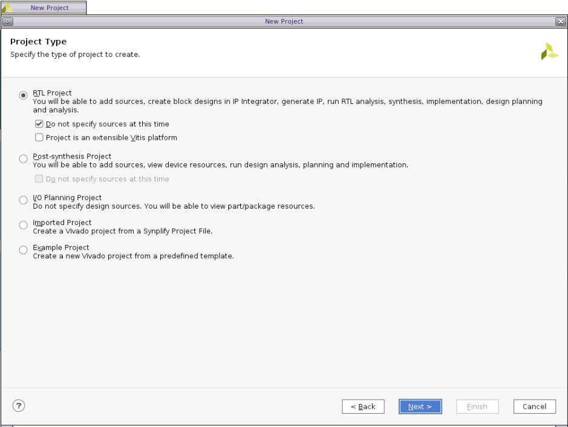
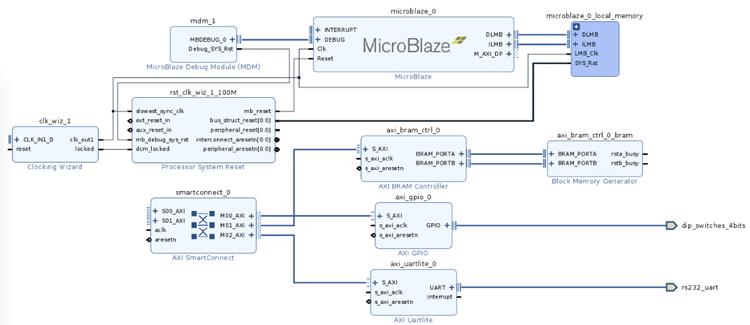
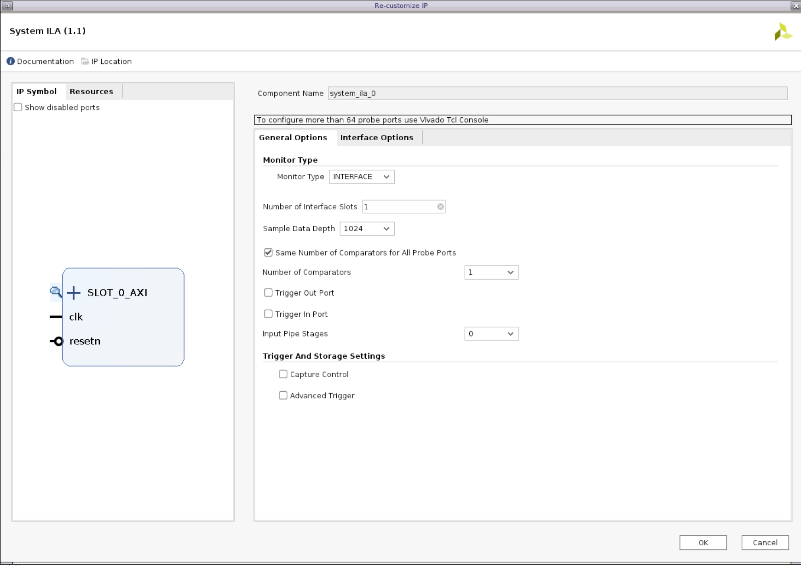
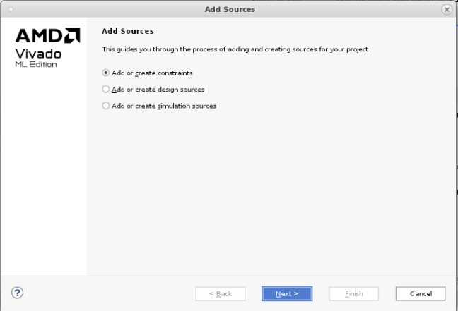

<table class="sphinxhide" width="100%">
 <tr width="100%">
    <td align="center"><h1>Vivado™ Design Flow Tutorials</h1>
    <a href="https://www.xilinx.com/products/design-tools/vivado.html">See Vivado Development Environment on xilinx.com</a>
    </td>
 </tr>
</table>

# Designing with IP integrator

***Version: Vivado 2022.1***

## Table of Contents

- [Designing with IP integrator](#designing-with-ip-integrator)
  - [Table of Contents](#table-of-contents)
  - [Introduction](#introduction)
  - [Tutorial Design Description](#tutorial-design-description)
    - [**Step 1: Creating a Project**](#step-1-creating-a-project)
    - [**Step 2: Creating an IP integrator   Design**](#step-2-creating-an-ip-integrator---design)
    - [**Step 3: Customizing IP**](#step-3-customizing-ip)
    - [**Step 4: Creating Connections**](#step-4-creating-connections)
    - [**Step 6: Adding Masters and Block Automation**](#step-6-adding-masters-and-block-automation)
    - [**Step 7: Using the Address Editor**](#step-7-using-the-address-editor)
    - [**Step 8: Validating the Design**](#step-8-validating-the-design)
    - [**Step 9: Debugging the Design**](#step-9-debugging-the-design)
    - [**Step 10: Creating and Implementing the Top-level Design**](#step-10-creating-and-implementing-the-top-level-design)

## Introduction

The Xilinx® Vivado® Design Suite IP integrator lets you create complex
system designs by instantiating and interconnecting IP cores from the Vivado IP catalog
onto a design canvas. You can create designs interactively through the
IP integrator   design canvas GUI, or programmatically using a Tcl
programming interface.

This tutorial walks you through the steps for building a basic IP
subsystem design using the IP integrator  . You will instantiate a few IPs in the IP integrator   and then
stitch them up to create an IP sub-system design. While working through this tutorial, you will be
introduced to the IP integrator   GUI, run design rule checks (DRC) on
your design, and then integrate the design into a top-level design in
the Vivado Design Suite. Finally, you will run synthesis and
implementation and generate a bitstream on the design

## Tutorial Design Description

This tutorial is based on a simple processor-based IP integrator   design.
It contains peripheral IP cores and an AXI Interconnect core, which
connects to a number of processors.

For the purpose of learning the different IP integrator   capabilities, we
will manually do some of the steps described in this tutorial, instead
of using an automated option all the time.

The design targets a Virtex UltraScale+ VCU118 Evaluation Platform with
a xcvu9p-flga2104-2L-e part. The lab results should be similar.
  

### **Step 1: Creating a Project**

1.  Open the Vivado® Integrated Design Environment (IDE).

    -   On Linux, change to the directory where the Vivado tutorial design
    file is stored: 
    
        cd <Extract_Dir\>/Vivado_Tutorial. Then launch the Vivado Design Suite: Vivado.

    -   On Windows, launch the Vivado Design Suite: **Start → All Programs →
    Xilinx Design Tools→ Vivado 2021.x**.

        As an alternative, click the **Vivado 2021.x** Desktop icon to start the
        Vivado IDE.

        The Vivado IDE Getting Started page contains links to open or create
        projects and to view documentation, as shown in the following figure:

    

***Note*:** Your Vivado Design Suite installation may be called
something different from Xilinx Design Tools on the Start menu.

2.  Under the Quick Start section, select **Create Project**.

3.  The New Project wizard opens. Click **Next** to confirm the project
    creation.

4.  In the Project Name page, shown in the following figure, set the
    following options:

    -   In the Project name field, enter Lab-1.
    -   In the Project location field, enter \<IPI-Basics\>.

    

5.  Ensure that Create project subdirectory is checked and click
    **Next.**

6.  In the Project Type page, select **RTL Project**, and select **Do
    not specify sources at this time**, then click **Next**, as shown in
    the following figure:

    

7.  Click next, and then you will land on the Default Part page. Click
    on the Boards tab to select the Virtex Ultrascale+ VCU118 Evaluation
    Platform.

    

8.  Review the project summary in the New Project Summary page.

    

9.  Click Finish to create the project.

10. The new project opens in the Vivado IDE.

### **Step 2: Creating an IP integrator   Design**

1.  Using the Flow Navigator, select Create Block Design.

    Notice how you can set Design Name, Directory, and source set in the
    **Create Block Design** dialog box. You can change or keep the default
    values and proceed.

    

   The Vivado IP integrator   displays a design canvas to let you quickly create complex subsystem designs by integrating IP cores.

2.  There are a few different ways to add IPs in the block design-

    -   By clicking the **Add IP** button in the block design canvas.
    
    

    

    -   You can also right-click on the design canvas to open the context
    menu and select **Add IP**.

    -   You can also add an IP by dragging and dropping the IP from the IP
    catalog to the block design canvas. In this case, you can search for
    the IP, select it and drag-and-drop it on the block design canvas.

    > **TIP:** *To open the IP Details window beside the IP catalog, as
    > shown in the following figure, type* Ctrl-Q* as described at the
    > bottom of the IP catalog window. This window lets you see details of
    > the currently selected IP in the catalog.  

    Let us add IPs into our block design now.

3.  In the search field of the IP catalog, type gpio to find the AXI
    GPIO IP.

    

    Select **AXI GPIO** core and press **Enter** on the keyboard or
    double-click the core in the IP catalog. The AXI GPIO core is
    instantiated onto the IP integrator   design canvas.

4.  Repeat step 2 to add the AXI BRAM Controller, AXI Uartlite, and the
    AXI SmartConnect.

5.  After adding all the IPs, the IP integrator   should look like this.
    The relative positions of the blocks placed on the canvas might be
    slightly different.  
    
    

6.  Click the Regenerate Layout button if you need to better placement
    of the blocks on the canvas.  
      
    

### **Step 3: Customizing IP**

1.  Double-click the AXI SmartConnect core to open the Re-Customize IP
    dialog box, as shown in the following figure:  
      
    

2.  In the Settings, change Number of Master Interfaces field to **3**
    from the drop-down menu.

3.  Leave all the remaining options as is and click **OK**.

    The IP integrator   re-customizes the AXI SmartConnect, changing the
    number of master interfaces to three, as shown in the following figure:

    

    Now you can connect the three slave IP cores to the AXI SmartConnect.

### **Step 4: Creating Connections**

At this point, you have instantiated several AXI slaves that you can access through a master such as a processor. To connect to a master controlling these slaves, first let’s create connectivity between the AXI SmartConnect and the instantiated IPs.

An interface is a grouping of signals that share a common function,
containing both individual signals and multiple buses. By grouping
these signals and buses into an interface, the Vivado IP integrator  
can identify common interfaces and automatically make multiple
connections in a single step. See the *Vivado Design Suite User Guide:
Designing IP Subsystems Using IP integrator  * ([UG994)](https://www.xilinx.com/cgi-bin/docs/rdoc?v=2020.2;d=ug994-vivado-ip-subsystems.pdf)
for more information on interface pins and ports.

**IMPORTANT!** *IP integrator   treats an external reset coming into the
block design as asynchronous to the clocks. You should always
synchronize the external resets with a clock domain in the IP
subsystem to help the design meet timing.*
You can use a Processor System Reset block (proc_sys_reset) to
synchronize the reset. The Processing System Reset is a soft IP that
handles numerous reset conditions at its input and generates
appropriate system reset signals at its output; however, if a clock
and a reset are external inputs to the block design, and the reset
signal synchronizes externally to the clock, then you need to
associate the related clock with the reset. This does not require the
Processor System Reset block.

1.  Place the cursor on top of the M00_AXI interface pin of the AXI
    SmartConnect. Click and drag the cursor from the M00_AXI interface
    pin to the S_AXI interface port of AXI GPIO block.

> ***Note*:** The cursor changes into a pencil indicating that a
> connection can be made from that interface pin. Clicking the mouse
> button here starts a connection on the M00_AXI interface pin.

<alt="Diagram Description automatically generated" />

> **TIP:** *You must press and hold down the mouse button while dragging
> the connection from the* M00_AXI *pin to the* S_AXI *interface port.*

    
As you drag the connection wire, a green checkmark appears on the
S_AXI interface pin indicating that you can make a valid connection
between these points. The Vivado IP integrator   highlights all possiblec onnection points in the subsystem design as you interactively wire
the pins and ports.

2.  Release the mouse button and Vivado IP integrator   makes a connection
    between the M00_AXI interface pin and the S_AXI port, as shown in
    the following figure:

    

3.  Repeating the steps outlined above, connect the M01_AXI and the
    M02_AXI to the S_AXI interface ports of AXI Bram Controller and AXI
    Uartlite.

    Note that the order of connection between M_AXI interfaces of the
    SmartConnect and S_AXI interfaces of the slave IPs does not matter.
    The connections to the AXI SmartConnect should now appear as shown in the following figure:

    

4.  Click the **File → Save Block Design** command from the main menu.

**Step 5: Running Connection Automation**

At this point, there are still some output interface pins that you
must connect external to the subsystem design, such as the following:

-   UART interface of the AXI Uartlite

-   GPIO interface of the AXI GPIO

Also, note that the AXI BRAM Controller is not connected to a Block
Memory Generator.
IP integrator   offers the Designer Assistance feature to automate
certain kinds of connections. For the current subsystem design, you
can connect the UART and GPIO interfaces to external ports using
connection automation. You can also use the Designer Assistance
feature to connect a Block Memory Generator to the BRAM Controller.

1.  Click **Run Connection Automation** in the banner at the top of the
    design canvas.

    

    The Run Connection Automation dialog box opens.

2.  Only select the interface pins shown in the following figure. This
    selects all external interfaces and the BRAM Controller for auto
    connection.

    

3.  Select and highlight the interfaces, as shown in the following
    figure, to see a description of the automation that the tool offers
    as well as any options needed to connect these interfaces.

    

4.  Click **OK**.

5.  All the external interfaces connect to I/O ports, and the BRAM
    Controller connects to the Block Memory Generator, as shown in the
    following figure:

    

    You can right-click on the external ports (dip_switches_4bits and
    rs232_uart in this design) and select the External Interface
    Properties command.

    In the External Interface Properties window, you can change the name
    of the port if needed. The IP integrator   automatically assigns the
    name of the port when connection automation is run. For now, leave the
    port names as is.

    

### **Step 6: Adding Masters and Block Automation**

The next step is to add and connect the masters to the subsystem created
so far.

1.  Right-click the design canvas to open the popup menu and select
    **Add IP**.

2.  In the search field, type Microblaze and double-click the core to
    instantiate it onto the canvas.

3.  Click **Run Block Automation** in the banner at the top of the
    design canvas.  
      
    

4.  Select all the default options in the Run Block Automation dialog
    box and click OK.  
    
    

5.  The IP integrator   adds local memory and debug to the processor block
    and connects a Clocking Wizard and Processor System Reset to the
    subsystem.

6.  Click the Regenerate Layout button to redraw the subsystem design.

    The optimized layout of the design should now look like the following
    figure:  
  
    

7.  Click Run Connection Automation in the banner at the top of the
    design canvas. The **Run Connection Automation** dialog box opens. 
    
    

8.  Select **All Automation (7 out of 7 selected)** as shown in the
    following figure. This selects the external interfaces for clock and
    reset on the board, the s_axi_aclk of slave peripheral, and the
    master M_AXI_DP port of the processor for auto connection.

    

9.  Once connection automation is done, change the diagram view from
    Default to Interfaces as shown below.

    

10. The layout of the design should now look like the figure below with
    only interfaces showing on the canvas for better viewing. You can
    click the **Regenerate Layout** button
    
    to redraw the subsystem design.

    

11. There are different ways of changing the view on the canvas and
    better organizing the blocks. One of these capabilities is creating
    hierarchy levels to include one or more blocks. To do so, select the
    following blocks- microblaze_0, microblaze_0\_local_memory, and
    mdm_1 by holding down the ctrl- button clicking on them one after
    the other. They should be highlighted in orange like the following
    figure-
    
    

12. Now, right-click and select Create Hierarchy.

    

13. You can assign a new name to the hierarchy or keep the default name
    in the dialog box, then click OK.

    Note that you can expand the hierarchy to see the content inside by
    clicking on the + button on the top left of the block-
    
      
    

14. Hierarchy levels can help with organizing the blocks on the canvas
    as well as replicating different sections of a block design. At this
    point, you have connected only one master to the SmartConnect block.
    To add the second master, we replicate the hierarchy block created
    in the previous step.

15. Switch the diagram view from Interfaces to Default from the top
    canvas toolbar.

16. Select the MicroBlaze subsystem hierarchy block previously created
    (hier_0), right-click and select copy.

    

17. Right-click on the white space area of the canvas and select paste.
    A second hierarchical level with the exact same content gets
    created.

18. After creating both the hierarchies, you will now have 2 Microblaze
    Debug Modules. Change the **BSCAN location** of the Microblaze Debug
    Module (MDM) to **EXTERNAL** for both the debug modules. This is to
    avoid any implementation issues with both the BSCAN locations, as
    the might get assigned the same location.  
    
    

19. Click **Run Connection Automation** in the banner at the top of the
    design canvas.

    

20. Select **All Automation (2 out of 2 selected)** to connect M_AXI_DP
    of the MicroBlaze to the second master AXI port of the
    SmartConnect.  
      
    

21. Click the **Regenerate Layout** button

    
    to redraw the subsystem design.

    The optimized layout of the design should now look like the following figure:

    

22. The only remaining connection is the sys_rst port of the new
    hierarchical block.

    Place the cursor on top of the pin and drag the connection to
    bus_struct_reset\[0:0\] port of the Processor System Reset block.

    

23. Click on **File → Save Block Design** command from the main menu.

### **Step 7: Using the Address Editor**

For various memory mapped master and slave interfaces, IP integrator  
follows the industry standard IP-XACT data format for capturing memory requirements and
capabilities of endpoint masters and slaves. This section provides an overview of how IP
Integrator models address information on a memory-mapped slave.

Master interfaces have address spaces, or address_space objects. Slave
interfaces have an address_space container called a memory map to map the slave to the
address space of the associated master. Typically, these memory maps are named after the
slave interface pins, for example S_AXI, though that is not required.

The memory map for each slave interface pin contains address segments,
or address_segment objects. These address segments correspond to the
address decode window for that slave. A typical AXI4-Lite slave will
have only one address segment, representing a range of addresses.
However, some slaves, like a bridge, will have multiple address segments
or a range of addresses for each address decode window.

When you map a slave to the master address space, a master
address_segment object is created, mapping the address segments of the
slave to the master. The Vivado IP integrator   can automatically assign
addresses for all slaves in the design. However, you can also manually
assign the addresses using the Address Editor. In the Address Editor,
you see the address segments of the slaves, and can map them to address
spaces in the masters.

**TIP:** *The Address Editor tab only appears if the subsystem design
contains an IP block that functions as a bus master. In the tutorial
design, the processors connecting through the AXI SmartConnect are the
bus masters.*

1.  Click the **Address Editor** tab to show the memory map of all the
    slaves in the design.

    > ***Note*:** If the Address Editor tab is not visible then select
    > **Window →  Address Editor** from the main menu.

    The IP integrator   has automatically assigned the addresses.
    Note that there are three address networks. One is the shared network
    between processors accessing the peripherals (AXI BRAM, GPIO, and UART), and two networks for local memory belonging to each processor subsystem.

    You can change the automatic address assignments by clicking in the
    corresponding column and changing the values.

2.  Change the size of the address segments for the AXI BRAM Controller
    core for the MicroBlaze in hier_1. Click the **Range** column, and
    select **64K** from the drop-down menu as shown in the following
    figure:

    

3.  Select the **Diagram** tab, to return to the IP integrator   design
    canvas.

### **Step 8: Validating the Design**

1.  From the menu at the top of the IPI design canvas, run the IP
    subsystem design rule checks (DRCs) by clicking the **Validate Design** button

    

    The Validate Design dialog box opens, and validation should be successful. Click **OK**.  
 
    

    At this point, you should save the IP integrator   subsystem design again.

2.  Select **File → Save Block Design** command from the main menu to
    save the design.

### **Step 9: Debugging the Design**

The System ILA debug core in IP integrator   allows you to perform
in-system debugging of block designs. This feature should be used when
there is a need to monitor interfaces and signals in the design. We will
demonstrate how to debug a signal in this section.

1.  Mark the interface between the AXI SmartConnect and AXI GPIO IPs by
    right-clicking on the net and selecting Debug from the context menu
    as shown in the following figure:  
      
    

    Note that nets and interface marked for debug show a small bug icon
    placed on top of the net or interface in the block design.

    
    <alt="Diagram Description automatically generated" />

2.  Now, use Designer Assistance to connect the interface to the System
    ILA core.

3.  You can select the desired options for the System ILA core for
    debugging or accept the default values.  
      
    

4.  Validate Design to ensure that design connectivity is correct.

### **Step 10: Creating and Implementing the Top-level Design**

With the IP subsystem design completed and validated, it can be included
as a module or block in the top-level design or it may be the top-level
in the design. In either case, you need to generate the HDL files for
the subsystem design.

1.  In the **Sources** window, right-click the top-level subsystem
    design, **design_1**, and select **Generate Output Products**.

    The Generate Output Products dialog box lets you choose how to handle the synthesis of the block design. The three Synthesis Options include:

-   **Global:** Synthesizes the block design as part of the top-level
    project rather than as an out-of-context block.

-   **Out-of-Context per IP:** Synthesizes each IP in the block design
    separately, out-of-context of the block design or the top-level
    design. This prevents each IP from being synthesized unnecessarily
    but requires updating and re-synthesizing each IP when it is
    updated.

-   **Out-of-context per Block Design:** Synthesizes the entire block
    design at one time, but out-of-context from the global or top-level
    design. This prevents the block design from being synthesized
    unnecessarily when the top-level design is synthesized but requires
    updating and re-synthesizing the block design when any of the IP in
    it are updated.

    Leave the default selection of Out of Context per IP.  
  
    

2.  Click **Generate** to generate all output products.

    Alternatively, you can click **Generate Block Design** in the Flow
    Navigator, under the IP integrator   drop-down menu.  
  
    

3.  The Out-of-Context (OOC) runs for each IP in the design launch,
    shown in the Design Runs tab below. OOC runs can take a few minutes
    to finish.

4.  After the Out-of-context runs are finished, in the Sources window,
    right-click the top-level subsystem design, **design_1**, and select
    **Create HDL Wrapper**.

    The Create HDL Wrapper dialog box opens, and offers two choices:

    -   **Copy generated wrapper to allow user edits:** with this option you
    will modify the wrapper file. Often a block design is a subset of an
    overall project. In cases like these, you might need to edit the
    wrapper file and instantiate other design components in the wrapper.
    If the I/O interface of the block design changes in any manner, you
    must manually update the wrapper file to reflect those changes.

    -   **Let Vivado manage wrapper and auto-update:** with this option
    Vivado generates and updates the wrapper file as needed. The wrapper
    file created using this method is automatically updated every time
    output products for the block design are generated, to reflect the
    latest changes.

5.  Select the default option, **Let Vivado manage wrapper and
    auto-update** and click **OK**.

    The Vivado IDE creates a top-level HDL wrapper for the design_1 block
    design and adds it to the design sources to the project and proceed to
    implementation.

6.  Once the top-level HDL source is added to the project, add the
    design constraints by clicking **File → Add Sources.** Then click on
    **Add or Create Constraints** and click **Next.** Then click on
    **Add files** to add the “/constraints/vcu118_rev2.0_12082017.xdc”
    file.  
      
    

7.  Now, you have 3 options to move forward:

-   Use the Run Synthesis command to run only synthesis.

-   Use the Run Implementation command, which will first run synthesis
    if it has not been run and then run implementation.

-   Use the Generate Bitstream command, which will first run synthesis,
    then run implementation if they have not been run, and then write
    the bitstream for programming the Xilinx device.

    These options can be selected from the Flow Navigator.

8.  For this lab, we are going to generate the bitstream for the design.
    From the Flow Navigator, click on **Generate Bitstream,** which will
    automatically synthesize, implement, and generate the bitstream for
    the design.

      
    
    The No Implementation Results Available dialog box opens as seen in the following figure:  
 
    

9.  When the bitstream generation completes, you will get the following
    message.  
    
    

This marks the end of the tutorial. You can now exit Vivado.

Copyright © 2020–2024 Advanced Micro Devices, Inc.

<a href="https://www.amd.com/en/corporate/copyright">Terms and Conditions</a>

