<<<<<<< Updated upstream
 Table of Contents

 Designing with IP Integrator using Block Design Containers

 Introduction  

 Tutorial Design Description 
 Design Creation Steps : Top – Bottom BDC flow
 
 Step 1: Creating a Project

 Step 2: Creating an IP Integrator Design with MicroBlaze Master
 
 Step 3: Adding New IP’s, Interfaces and IP Customization

 Step 4: Creating Connections to all IP’s and interfaces

 Step 5: Connecting all IP’s and Interfaces using both manual and
automated connections

 Step 6: Using the Address Editor

 Step 7: Creating Hierarchies

 Step 8: Block Design Containers

 Design Creation Steps: Bottom - Up BDC flow

# Designing with IP Integrator using Block Design Containers

## Introduction

The AMD Vivado™ Design Suite IP Integrator lets you create complex
system designs by instantiating and interconnecting IP cores from the Vivado IP catalog onto a design canvas. You can create designs interactively through the IP Integrator design canvas GUI, or programmatically using a Tcl programming interface.

This tutorial walks you through the steps for building a basic IP subsystem design using the IP
Integrator. You will instantiate a few IPs in the IP Integrator and then stitch them up to create an IP sub-system design. While working through this tutorial, you will be introduced to the IP Integrator GUI, run design rule checks (DRC) on your design, and then integrate the design into a top-level design in the Vivado Design Suite. Finally, you will run synthesis and implementation and generate a bitstream on the design.

## Tutorial Design Description

=======
# Table of Contents

Designing with IP Integrator using Block Design Containers

Introduction 

Tutorial Design Description

Design Creation Steps : Top – Bottom BDC flow

Step 1: Creating a Project

Step 2: Creating an IP Integrator Design with MicroBlaze Master

Step 3: Adding New IP’s, Interfaces and IP Customization

Step 4: Creating Connections to all IP’s and interfaces

Step 5: Connecting all IP’s and Interfaces using both manual and
automated connections

Step 6: Using the Address Editor

Step 7: Creating Hierarchies

Step 8: Block Design Containers

Design Creation Steps: Bottom - Up BDC flow

# Designing with IP Integrator using Block Design Containers

## Introduction

The AMD Vivado™ Design Suite IP Integrator lets you create complex
system designs by
instantiating and interconnecting IP cores from the Vivado IP catalog
onto a design canvas. You can create designs interactively through the
IP Integrator design canvas GUI, or programmatically using a Tcl
programming interface.
This tutorial walks you through the steps for building a basic IP
subsystem design using the IP
Integrator. You will instantiate a few IPs in the IP Integrator and then
stitch them up to create an
IP sub-system design. While working through this tutorial, you will be
introduced to the IP Integrator GUI, run design rule checks (DRC) on
your design, and then integrate the design into a top-level design in
the Vivado Design Suite. Finally, you will run synthesis and
implementation and generate a bitstream on the design.

### Tutorial Design Description

>>>>>>> Stashed changes
This tutorial is based on a simple processor-based IP Integrator design.
It contains peripheral IP cores, AXI Interconnect core, SmartConnect
core and DDR4 SDRAM. The major focus of this tutorial is to get familiar
with Vivado IP integrator and to explore enhanced features like Block
Design Containers (BDC).

For the purpose of learning the different IP Integrator (IPI)
capabilities, we will manually do some of the steps described in this
tutorial, instead of using an automated option all the time. This
tutorial will use Graphical User Interface (GUI) flow of the IPI to
demonstrate the Top - Bottom BDC creation steps. The last section would
use Tcl flow to demonstrate Bottom – Up BDC flow. For more information
on IPI BDC flow please refer to UG994 Vivado Documentation.

<<<<<<< Updated upstream
The design targets an AMD Kintex™ UltraScale™ KCU105 Evaluation Platform.
=======
The design targets a AMD Kintex™ UltraScale™ KCU105 Evaluation Platform.
>>>>>>> Stashed changes

# Design Creation Steps : Top – Bottom BDC flow

## Step 1: Creating a Project

1.  Open the Vivado Integrated Design Environment (IDE).

- On Linux, change to the directory where the Vivado tutorial design
  file is stored: cd

<<<<<<< Updated upstream
    \<Extract_Dir\>/Vivado_Tutorial. Then launch the Vivado Design Suite:
Vivado.

- On Windows, launch the Vivado Design Suite: **Start → All Programs →
  Xilinx Design Tools→ Vivado 2023.1**.

    As an alternative, click the **Vivado 2023.1** Desktop icon to start the
Vivado IDE.

    The Vivado IDE Getting Started page contains links to open or create
projects and to view documentation, as shown in the following figure:

    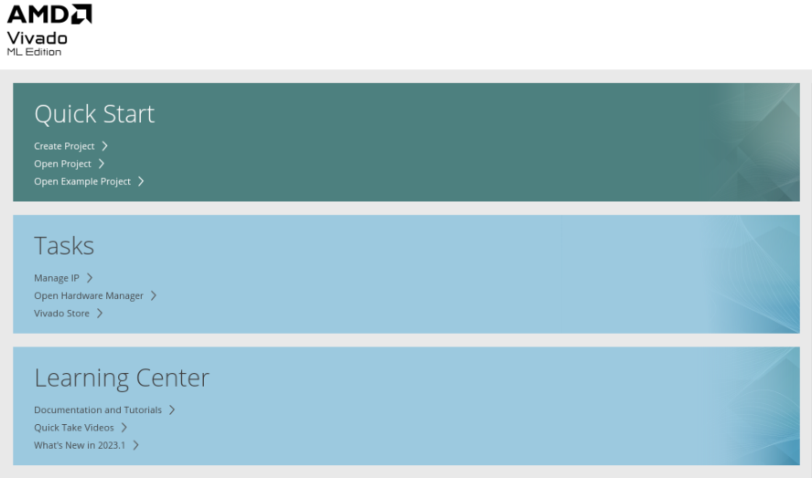

    > **Note:** Your Vivado Design Suite installation may be called
something different from the Design Tools on the Start menu.
=======
  \<Extract_Dir\>/Vivado_Tutorial. Then launch the Vivado Design Suite:
Vivado.

- On Windows, launch the Vivado Design Suite: **Start → All Programs →
  Xilinx Design Tools→ Vivado 2023.2**.

  As an alternative, click the **Vivado 2023.2** Desktop icon to start the
Vivado IDE.

  The Vivado IDE Getting Started page contains links to open or create
projects and to view documentation, as shown in the following figure:

  

  > **Note:** Your Vivado Design Suite installation may be called
something different from Design Tools on the Start menu.
>>>>>>> Stashed changes

2.  Under the Quick Start section, select **Create Project**.

3.  The New Project wizard opens. Click **Next** to confirm the project
    creation.

4.  In the Project Name page, shown in the following figure, set the
    following options:

    a\. In the Project name field, enter Lab-2.

<<<<<<< Updated upstream
    b\. In the Project location field, enter \<IPI-Basics\>, or choose any location as per your working folder structure.

     
=======
    b\. In the Project location field, enter \<IPI-Basics\>, or choose any
  location as per your working folder structure.

    
>>>>>>> Stashed changes

5.  Ensure that Create project subdirectory is checked and click
    **Next.**

6.  In the Project Type page, select **RTL Project**, and select **Do
    not specify sources at this time**, then click **Next**, as shown in
    the following figure:

<<<<<<< Updated upstream
    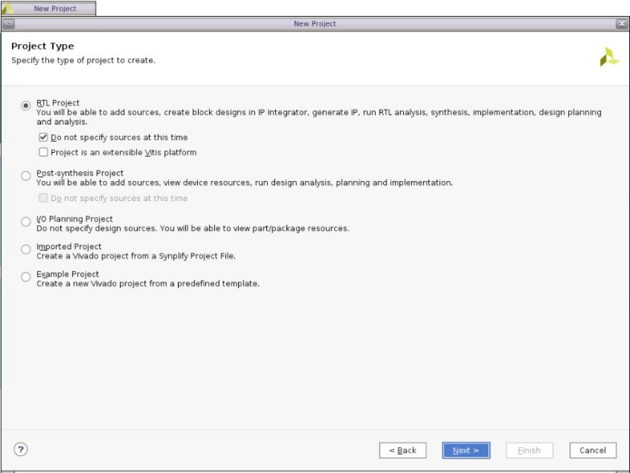
=======
    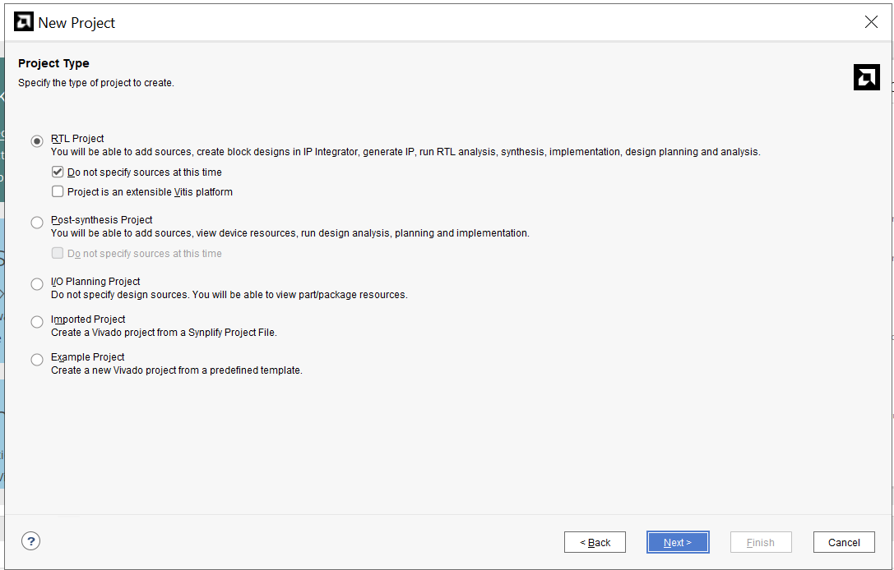
>>>>>>> Stashed changes

7.  Click next, and then you will land on the Default Part page, as
    shown in the following figure. Select the Kintex Ultrascale KCU105
    Evaluation Platform under **Boards** tab.

<<<<<<< Updated upstream
    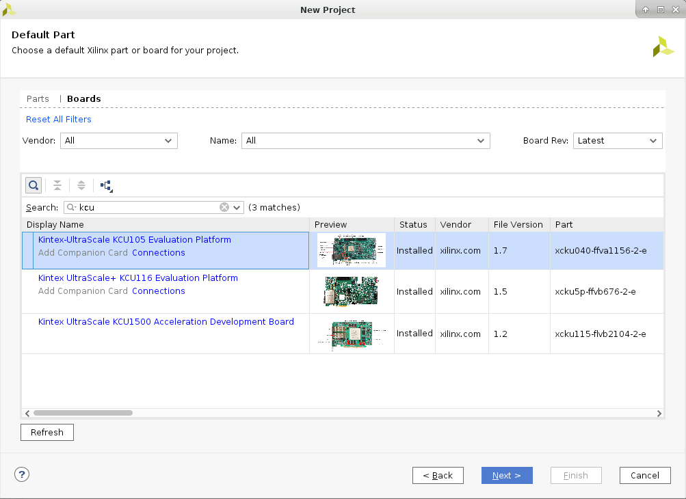

8.  Review the project summary in the New Project Summary page.

     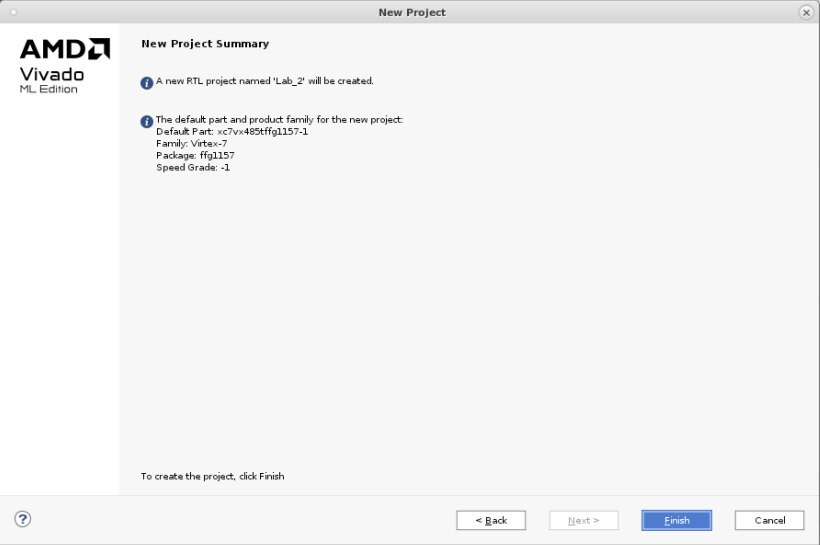
=======
     

8.  Review the project summary in the New Project Summary page.

    
>>>>>>> Stashed changes

9.  Click Finish to create the project.

10. The new project opens in the Vivado IDE.

<<<<<<< Updated upstream
## Step 2: Creating an IP Integrator Design with MicroBlaze Master
=======
## Step 2: Creating an IP Integrator Design with MicroBlaze Master 
>>>>>>> Stashed changes

1.  This step will show how Vivado is board aware of the connections and
    the interfaces it supports on the selected board. IPI features like
    block automation, connection automation and IP customization must
    also be demonstrated.

2.  Using the Flow Navigator, select Create Block Design.

<<<<<<< Updated upstream
    > **Note:** Notice how you can set Design Name, Directory, and source set in the
    **Create Block Design** dialog box. You can change or keep the default
    values and proceed. For this lab, choose design name as ‘top’.

    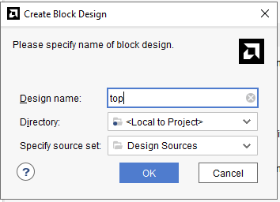
=======
     Notice how you can set Design Name, Directory, and source set in the
    **Create Block Design** dialog box. You can change or keep the default
  values and proceed. For this lab, choose design name as ‘top’.

    

    The Vivado IP Integrator displays a design canvas to let you quickly
create complex subsystem designs by integrating IP cores.
>>>>>>> Stashed changes

    The Vivado IP Integrator displays a design canvas to let you quickly create complex subsystem designs by integrating IP cores.

<<<<<<< Updated upstream
3.  There are a few different ways to add IPs in the block design

    - By clicking the **Add IP** button in the block design canvas.
  

        

    - You can also right-click on the design canvas to open the context menu
  and select **Add IP**.

    - You can also add an IP by dragging and dropping the IP from the IP
  catalog to the block design canvas. In this case, you can search for
  the IP, select it and drag-and-drop it on the block design canvas.

    Add **MicroBlaze** processor IP to the block design now.
=======
    - By clicking the **Add IP** button in the block design canvas.
  

      

    - You can also right-click on the design canvas to open the context menu
  and select **Add IP**.

    - You can also add an IP by dragging and dropping the IP from the IP
  catalog to the block design canvas. In this case, you can search for
  the IP, select it and drag-and-drop it on the block design canvas.

      Let’s add **MicroBlaze** processor IP into our block design now.
>>>>>>> Stashed changes

4.  In the search field of the IP catalog, type MICROBLAZE to find the
    IP.

<<<<<<< Updated upstream
    
=======
       
>>>>>>> Stashed changes

5.  Select **MicroBlaze** and press **Enter** on the keyboard or
    double-click the core in the IP catalog. The MicroBlaze core is
    instantiated onto the IP Integrator design canvas.

<<<<<<< Updated upstream
    Double-click the MicroBlaze IP to re-customize it. In general settings, make sure to check the following options:

    - Enable MicroBlaze Debug Module Interface

    - Use Instruction and Data Caches

    Leave all the other options to default settings and press OK.

     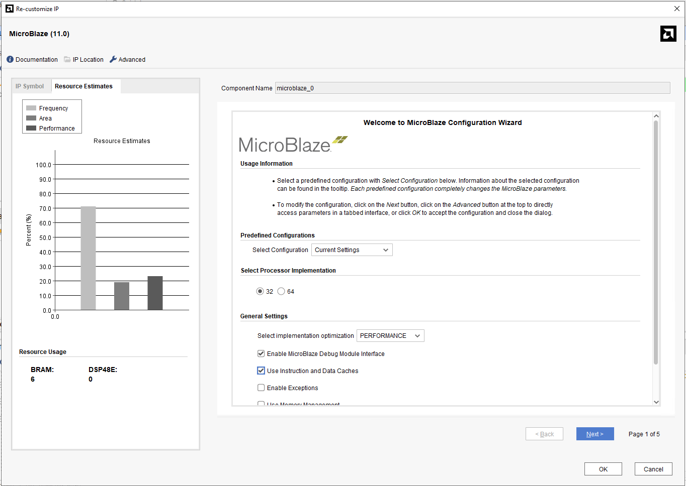
=======
    Double click the MicroBlaze IP to re-customize it. In general settings,
make sure to check the following options:

- Enable MicroBlaze Debug Module Interface

- Use Instruction and Data Caches

  Leave all the other options to default settings and press OK.

   
>>>>>>> Stashed changes

6.  Click **Run Block Automation** in the banner at the top of the
    design canvas

<<<<<<< Updated upstream
     
=======
    
>>>>>>> Stashed changes

7.  Select all the default options in the Run Block Automation dialog
    box and click OK. Make sure that clock connection is set to New
    Clocking Wizard, for this lab.

<<<<<<< Updated upstream
     

=======
    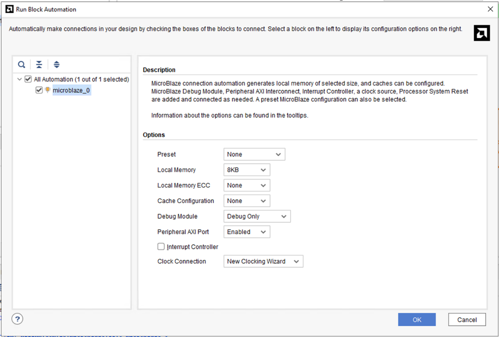
 
>>>>>>> Stashed changes
8.  The IP Integrator adds local memory and debug to the processor block
    and connects a Clocking Wizard and Processor System Reset to the
    subsystem.

9.  Click the Regenerate Layout button  to redraw the subsystem
    design. The optimized layout of the design should now look like the
    following figure:

<<<<<<< Updated upstream
     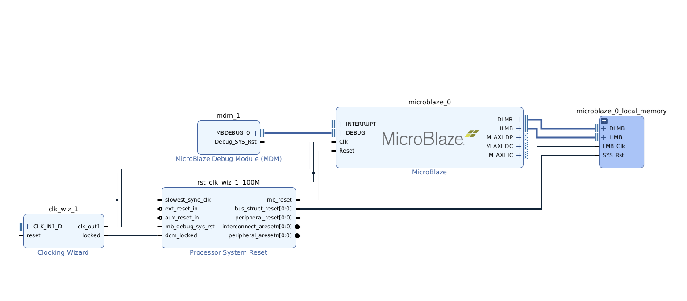 
=======
     
>>>>>>> Stashed changes

10. In the IP Integrator Flow of the Flow Navigator there are multiple
    tabs available like Sources, Design, Signals and Board. If you click
    on the ‘Board’ interface tab, it shows all the available interfaces
    on the KCU105 evaluation platform.

    An interface is a grouping of signals that share a common function,
<<<<<<< Updated upstream
containing both individual signals and multiple buses. By grouping these
signals and buses into an interface, the Vivado IP Integrator can
identify common interfaces and automatically make multiple connections
in a single step. See the *Vivado Design Suite User Guide: Designing IP
Subsystems Using IP Integrator*
( UG994)  (https://docs.amd.com/access/sources/dita/map?Doc_Version=2020.2%20English&url=ug994-vivado-ip-subsystems)
for more information on interface pins and ports.

    
=======
    containing both individual signals and multiple buses. By grouping these
    signals and buses into an interface, the Vivado IP Integrator can
    identify common interfaces and automatically make multiple connections
    in a single step. See the *Vivado Design Suite User Guide: Designing IP
    Subsystems Using IP Integrator*
    [(UG994)](https://docs.amd.com/access/sources/dita/map?Doc_Version=2020.2%20English&url=ug994-vivado-ip-subsystems)
    for more information on interface pins and ports.

     
>>>>>>> Stashed changes

11. You can drag and drop the interfaces required for the design from
    here directly to the design canvas. For this lab choose DDR4 SDRAM
    interface. You can choose different auto connect options for
    Interfaces depending on the design requirement. For this design
    choose ddr4_sdram_062.

    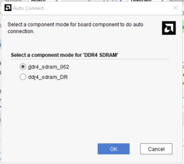
<<<<<<< Updated upstream

    > **Note:** Component mode can be changed later as well by using
recustomization feature of the IP. You can re-customize any IP by
double clicking on it in the design canvas, and doing modifications as
needed, for the project. Additionally, we can also add the interface
IP’s to the design canvas by **add ip** feature, described above for
MicroBlaze IP.
=======
>>>>>>> Stashed changes

    > **Note:** Component mode can be changed later as well by using
re-customization feature of the IP. You can re-customize any IP by
double clicking on it in the design canvas, and doing modifications as
needed, for the project. Additionally, we can also add the interface
IP’s to the design canvas by **add ip** feature, described above for
MicroBlaze IP.

<<<<<<< Updated upstream
    

13. You can now see that there is an orange circle next to DDR4 SDRAM in
=======
1.  The design canvas should now look like shown below:

      

2.  You can now see that there is an orange circle next to DDR4 SDRAM in
>>>>>>> Stashed changes
    the boards tab. This shows that Vivado is board aware and knows what
    interfaces (external memory in this case) in the design has already
    been used.

<<<<<<< Updated upstream
     

14. As you can see that Microblaze and DDR4 are not connected to each
=======
     

3.  As you can see that Microblaze and DDR4 are not connected to each
>>>>>>> Stashed changes
    other yet. IP Integrator offers the Designer Assistance feature to
    automate certain kinds of connections. For the current subsystem
    design, you can connect DDR4 SDRAM IP with the MicroBlaze using
    connection automation. Click **Run Connection Automation** in the
    banner at the top of the design canvas.

<<<<<<< Updated upstream
    The Run connection Automation dialog box opens.

     

15. Before you run connection automation, make sure that the IP’s are
=======
     

    The Run connection Automation dialog box opens.

4.  Before you run connection automation, make sure that the IP’s are
>>>>>>> Stashed changes
    customized as per the design requirements. For example, in the
    current design we want the MicroBlaze clock frequency at 125 MHz and
    DDR4 frequency at 300 MHz. To do this, double click the CLOCKING
    WIZARD IP auto generated with the MICROBLAZE board automation and
    re-customize the CLK_IN1 to sysclk125. Leave all the settings to
    default and click **OK.**

<<<<<<< Updated upstream
    

16. Now click on Run Connection Automation, and the Automation window
=======
     

5.  Now click on Run Connection Automation, and the Automation window
>>>>>>> Stashed changes
    opens up. Select all the blocks you need for connection automation.

    For this lab, make the following changes:

<<<<<<< Updated upstream
    - reset of clk_wiz_1 is set to custom

    - sys_reset for ddr4_0 is set to FPGA reset

    - ext_reset_in of rst_clk_wiz_1_100M is set to FPGA reset

    Leave all other connections to default settings, select all interfaces and click OK

    The MicroBlaze and DDR4 IP’s with their respective interface, clock and reset connections is now ready on the design canvas.

     

17. You will see that after running connection automation, the ‘Run
=======
- reset of clk_wiz_1 is set to custom

- sys_reset for ddr4_0 is set to FPGA reset

- ext_reset_in of rst_clk_wiz_1_100M is set to FPGA reset

  Leave all other connections to default settings, select all interfaces
and click OK

  The MicroBlaze and DDR4 IP’s with their respective interface, clock and
reset connections is now ready on the design canvas.

    

1.  You will see that after running connection automation, the ‘Run
>>>>>>> Stashed changes
    Connection Automation’ banner is still active for M_AXI_DP port of
    Microblaze. This port has not been connected to any slave port so
    the Vivado design assistance will give an option to connect it
    automatically, if you run it then you will observe that a new slave
    port will be automatically created in the SmartConnect and will be
    connected to Microblaze master. But that is not the current design
    requirement, and that port has not been connected intentionally. You
    will see later that an AXI Interconnect IP will be instantiated in
    the design and that will become a slave for the M_AXI_DP port.

    You must be mindful of the design connections you are making as per the requirements of our design. This will help you debug the design easily if the end design does not behave as expected.

<<<<<<< Updated upstream
18. Click the Regenerate Layout button if you need to better placement
=======
1.  Click the Regenerate Layout button if you need to better placement
>>>>>>> Stashed changes
    of the blocks on the canvas.  
      
    

<<<<<<< Updated upstream
19. The design canvas should look like the design shown below:

     

20. It can be observed that after running connection automation, an AXI
=======
2.  The design canvas should look like the design shown below:

       

3.  It can be observed that after running connection automation, an AXI
>>>>>>> Stashed changes
    SmartConnect is automatically instantiated along with a processor
    system reset IP for DDR4 SDRAM. Since the design uses two different
    frequencies therefore Vivado is aware of it to minimize Clock Domain
    Crossing (CDC) issues, it auto instantiates the necessary IP’s as
    required by the design.

<<<<<<< Updated upstream
    > **IMPORTANT!** IP Integrator treats an external reset coming into the block design as synchronous to the clocks. You should always synchronize the external resets with a clock domain in the IP subsystem to help the design meet timing.
=======
    > **IMPORTANT!** *IP Integrator treats an external reset coming into the
    > block design as asynchronous to the clocks. You should always
    > synchronize the external resets with a clock domain in the IP
    > subsystem to help the design meet timing.*
>>>>>>> Stashed changes

4.  You can use a Processor System Reset block (proc_sys_reset) to
    synchronize the reset. The Processing System Reset is a soft IP that
    handles numerous reset conditions at its input and generates
    appropriate system reset signals at its output; however, if a clock
    and a reset are external inputs to the block design, and the reset
    signal synchronizes externally to the clock, then you need to
    associate the related clock with the reset. This does not require
    the Processor System Reset block.

## Step 3: Adding New IP’s, Interfaces and IP Customization

1.  You can add multiple IP’s from the Vivado IP catalogue as per the
    specific design requirements. For continuity of this lab, add the
    following IP’s from the IP catalogue, by using add IP feature on the
    design canvas. For a quick reference, check the above-mentioned
    steps (Step-2), used for adding Microblaze IP.

    - AXI UARTLITE

    - AXI GPIO (2 instances)

    - AXI INTERCONNECT

<<<<<<< Updated upstream
    - AXI BRAM CONTROLLER
=======
    - AXI block RAM CONTROLLER
>>>>>>> Stashed changes

    - CONCAT

    - CONSTANT (2 instances)

    - AXI INTERRUPT CONTROLLER

    - AXI IIC

2.  After adding all the IPs, the IP Integrator should look like the
    snapshot below. The relative positions of the blocks placed on the
    canvas might be slightly different.

<<<<<<< Updated upstream
     

3.  Double-click the AXI Interconnect core to open the Re-Customize IP
    dialog box, as shown in the following figure:

     
=======
     
 
3.  Double-click the AXI Interconnect core to open the Re-Customize IP
    dialog box, as shown in the following figure:

      
>>>>>>> Stashed changes

4.  In the Top Level Settings, change Number of Master Interfaces field
    to **5** from the drop-down menu.

5.  Leave all the remaining options as is and click **OK**.

<<<<<<< Updated upstream
     The IP integrator re-customizes the AXI Interconnect, changing the number of master interfaces to five, as shown in the following figure:

     
=======
     The IP integrator re-customizes the AXI Interconnect, changing the
    number of master interfaces to five, as shown in the following figure:

      
>>>>>>> Stashed changes

    Now you can connect the five slave IP cores to the AXI Interconnect.

6.  Double-click Concat IP to open the Re-Customize IP dialog box.
    Change number of ports to 4 from 2. Leave all the remaining options
    as is and click **OK.**

<<<<<<< Updated upstream
     
=======
      
>>>>>>> Stashed changes

7.  Double-click axi_gpio_0 to open the Re-Customize IP dialog box. In
    the Board tab of Re-customize IP window choose the following:

<<<<<<< Updated upstream
    - GPIO (IP interface) -\> rotary switch (Board Interface)

    - GPIO2(IP interface) -\> push buttons 5bits (Board Interface)

    Leave all the remaining options as is and click **OK.**

    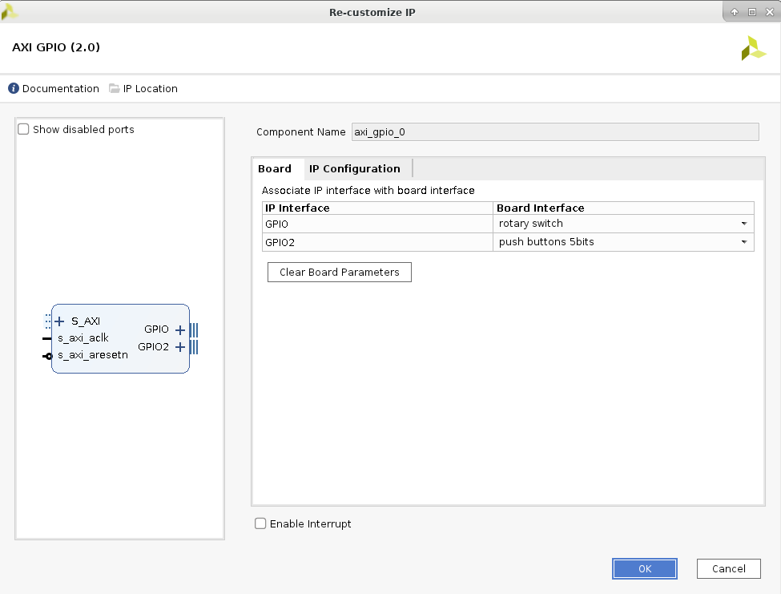
=======
    GPIO (IP interface) -\> rotary switch (Board Interface)

    GPIO2(IP interface) -\> push buttons 5bits (Board Interface)

    Leave all the remaining options as is and click **OK.**

      
>>>>>>> Stashed changes

8.  Double-click axi_gpio_1 to open the Re-Customize IP dialog box. In
    the Board tab of Re-customize IP window choose the following:

<<<<<<< Updated upstream
    - GPIO (IP interface) -\> led 8bits (Board Interface)

    - GPIO2(IP interface) -\> dip switches 4bits (Board Interface)

    Leave all the remaining options as is and click **OK.**

     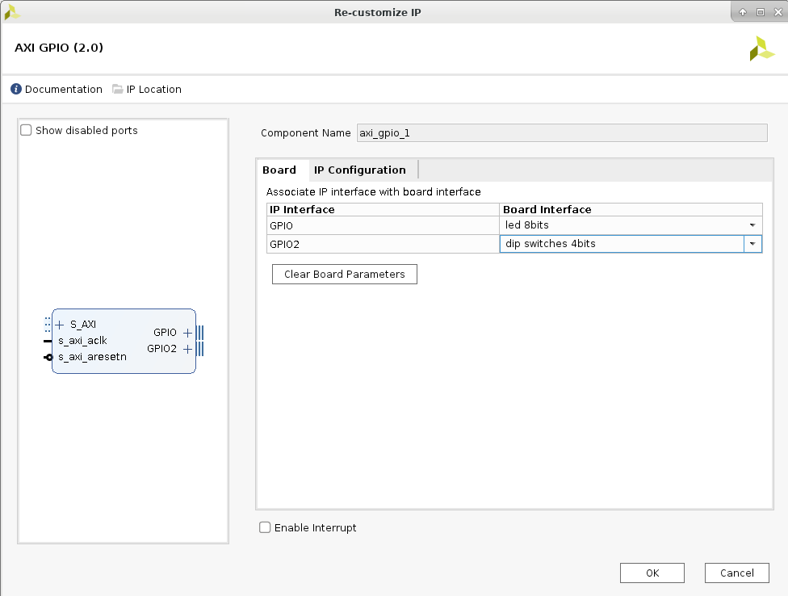
=======
    GPIO (IP interface) -\> led 8bits (Board Interface)

    GPIO2(IP interface) -\> dip switches 4bits (Board Interface)

    Leave all the remaining options as is and click **OK.**

      
>>>>>>> Stashed changes

9.  Double-click AXI SMARTCONNECT IP which was auto-generated earlier to
    open the Re-Customize IP dialog box and change number of Master
    Interfaces to ‘2’. Leave all the remaining options as is and click
    **OK.**

<<<<<<< Updated upstream
     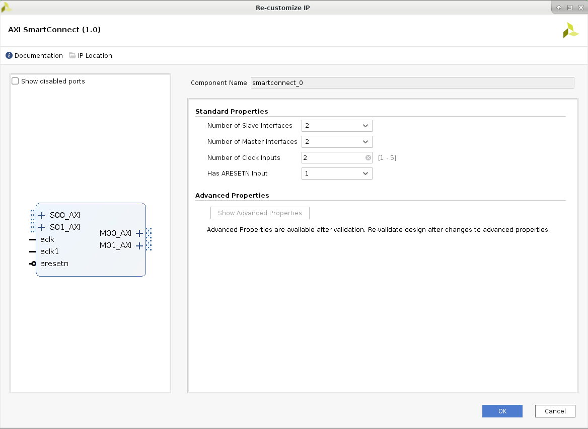 

## Step 4: Creating Connections to all IP’s and interfaces

 At this point, you have instantiated several AXI slaves that you can access through a master such as a processor. To connect to a master controlling these slaves, first create connectivity between the AXI Interconnect and the instantiated IPs.
=======
      

## Step 4: Creating Connections to all IP’s and interfaces

 At this point, you have instantiated several AXI slaves that you can
 access through a master such as a processor. To connect to a master
 controlling these slaves, first let’s create connectivity between the
 AXI Interconnect and the instantiated IPs
>>>>>>> Stashed changes

1.  Place the cursor on top of the M00_AXI interface pin of the AXI
    Interconnect. Click and drag the cursor from the M00_AXI interface
    pin to the S_AXI interface port of AXI GPIO block.

<<<<<<< Updated upstream
    > ***Note*:** The cursor changes into a pencil indicating that a connection can be made from that interface pin. Clicking the mouse button here starts a connection on the M00_AXI interface pin. You must press and hold down the mouse button while dragging the connection from the M00_AXI pin to the S_AXI interface port.

     

    As you drag the connection wire, a green checkmark appears on the S_AXI interface pin indicating that you can make a valid connection between these points. The Vivado IP Integrator highlights all possible connection points in the subsystem design as you interactively wire the pins and ports.
=======
    > ***Note*:** The cursor changes into a pencil indicating that a
    > connection can be made from that interface pin. Clicking the mouse
    > button here starts a connection on the M00_AXI interface pin. You must
    > press and hold down the mouse button while dragging the connection
    > from the M00_AXI pin to the S_AXI interface port.

      

     As you drag the connection wire, a green checkmark appears on the
     S_AXI interface pin indicating that you can make a valid connection
     between these points. The Vivado IP Integrator highlights all possible
     connection points in the subsystem design as you interactively wire
     the pins and ports.
>>>>>>> Stashed changes

2.  Release the mouse button and Vivado IP Integrator makes a connection
    between the M00_AXI interface pin and the S_AXI port, as shown in
    the following figure:

<<<<<<< Updated upstream
     
=======
      
>>>>>>> Stashed changes

3.  Repeating the steps outlined above, connect the M01_AXI and the
    M02_AXI, M03_AXI, M04_AXI to the S_AXI interface ports of AXI
    Interrupt Controller, AXI Uartlite, AXI IIC and AXI
    GPIO (axi_gpio_1).

<<<<<<< Updated upstream
    > **Note:** The order of connection between M_AXI interfaces of the AXI Interconnect and AXI interfaces of the slave IPs does not matter. The connections to the AXI SmartConnect should now appear as shown in the following figure:

     

## Step 5: Connecting all IP’s and Interfaces using both manual and automated connections

1.  On the design canvas you can see that there are few IP’s and
    Interfaces which are not connected, such as, UART interface of the
    AXI Uartlite, GPIO interface of the AXI GPIO’s, Concat, AXI Block RAM
    Controller, and so on.

    To connect the remaining interfaces, you can once again use the
connection automation feature of IPI as used earlier to connect DDR4
SDRAM IP. The remaining unconnected IP’s can be connected manually as
per the design requirement.
=======
    > **Note:** The order of connection between M_AXI interfaces of the AXI
    > Interconnect and S_AXI interfaces of the slave IPs does not matter.
    > The connections to the AXI SmartConnect should now appear as shown in
    > the following figure:

       

## Step 5: Connecting all IPs and Interfaces using both manual and automated connections

1.  On the design canvas you can see that there are few IP’s and
    Interfaces which are not connected, such as, UART interface of the
    AXI Uartlite, GPIO interface of the AXI GPIO’s, Concat, AXI block RAM
    Controller, and so on.

    To connect the remaining interfaces, you can once again use the
    connection automation feature of IPI as used earlier to connect DDR4
    SDRAM IP. The remaining unconnected IP’s can be connected manually as
    per the design requirement.
>>>>>>> Stashed changes

2.  Run Connection Automation from the designer assistance by selecting
    all interfaces.
    
    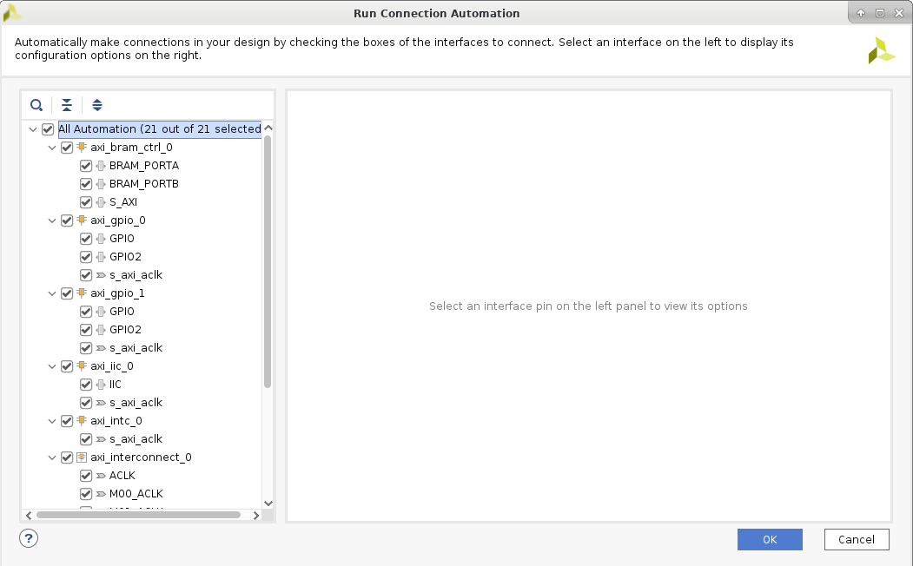

<<<<<<< Updated upstream
    

3.  After running the connection Automation, and regenerating layout,
    the design canvas should look like the figure below:

       

4.  All the external interfaces connect to I/O ports, and the Block RAM
=======
3.  After running the connection Automation, and regenerating layout,
    the design canvas should look like the figure below:

      

4.  All the external interfaces connect to I/O ports, and the block RAM
>>>>>>> Stashed changes
    Controller connects to the Block Memory Generator. You can
    right-click on the external ports (dip_switches_4bits and rs232_uart
    etc.) and select the External Interface Properties command.

    In the External Interface Properties window, you can change the name of
the port if needed. The IP Integrator automatically assigns the name of
the port when connection automation is run.

5.  You can see on the design canvas that some IP’s are still not
    connected but apart from that all the interfaces have been connected
    according to their customizations.

    Now we can make the following connections manually

<<<<<<< Updated upstream
     *dout\ 0:0\   port of CONSTANT(xlconstant_0) to In3\ 0:0\   port of
     CONCAT  
    dout\ 0:0\   port of CONSTANT(xlconstant_1) to In2\ 0:0\   port of
    CONCAT*

    *interrupt port of AXI UARTLITE to In1\ 0:0\   port of CONCAT  
    iic2intc_irpt port of AXI IIC to In0\ 0:0\   port of CONCAT*

    *dout\ 3:0\   port of CONCAT block to intr\ 0:0\   port of AXI INTERRUPT
    CONTROLLER*

    *interrupt port of INTERRUPT CONTROLLER to Interrupt pin of
    MICROBLAZE*

    To automate these manual connections, you can run the following Tcl
    commands on the Tcl console to make the connections:

    <table>
<colgroup>
<col style="width: 100%" />
</colgroup>
<thead>
<tr class="header">
<th>
connect_bd_net  get_bd_pins xlconstant_0/dout    get_bd_pins
xlconcat_0/In3  

connect_bd_net  get_bd_pins xlconstant_1/dout    get_bd_pins
xlconcat_0/In2  

connect_bd_net  get_bd_pins axi_uartlite_0/interrupt    get_bd_pins
xlconcat_0/In1  

connect_bd_net  get_bd_pins axi_iic_0/iic2intc_irpt    get_bd_pins
xlconcat_0/In0  

connect_bd_net  get_bd_pins xlconcat_0/dout    get_bd_pins
axi_intc_0/intr  

connect_bd_intf_net  get_bd_intf_pins axi_intc_0/interrupt  
 get_bd_intf_pins microblaze_0/INTERRUPT  
</th>
</tr>
</thead>
<tbody>
</tbody>
</table>
=======
    > *dout\[0:0\] port of CONSTANT(xlconstant_0) to In3\[0:0\] port of
    > CONCAT  
    > dout\[0:0\] port of CONSTANT(xlconstant_1) to In2\[0:0\] port of
    > CONCAT*
    >
    > *interrupt port of AXI UARTLITE to In1\[0:0\] port of CONCAT  
    > iic2intc_irpt port of AXI IIC to In0\[0:0\] port of CONCAT*
    >
    > *dout\[3:0\] port of CONCAT block to intr\[0:0\] port of AXI INTERRUPT
    > CONTROLLER*
    >
    > *interrupt port of INTERRUPT CONTROLLER to Interrupt pin of
    > MICROBLAZE*

    To automate these manual connections, you can run the following Tcl commands on the Tcl console to make the connections:

    <table>
    <colgroup>
    <col style="width: 100%" />
    </colgroup>
    <thead>
    <tr class="header">
    <th>
connect_bd_net [get_bd_pins xlconstant_0/dout] [get_bd_pins
    xlconcat_0/In3]

    
connect_bd_net [get_bd_pins xlconstant_1/dout] [get_bd_pins
    xlconcat_0/In2]

    
connect_bd_net [get_bd_pins axi_uartlite_0/interrupt] [get_bd_pins
    xlconcat_0/In1]

    
connect_bd_net [get_bd_pins axi_iic_0/iic2intc_irpt] [get_bd_pins
    xlconcat_0/In0]

    
connect_bd_net [get_bd_pins xlconcat_0/dout] [get_bd_pins
    axi_intc_0/intr]

    
connect_bd_intf_net [get_bd_intf_pins axi_intc_0/interrupt]
    [get_bd_intf_pins microblaze_0/INTERRUPT]
</th>
    </tr>
    </thead>
    <tbody>
    </tbody>
    </table>
>>>>>>> Stashed changes

6.  After making all the connections the final design should look
    something like the figure shown below. You can use regenerate layout
    for a cleaner design canvas.

<<<<<<< Updated upstream
     
=======
     
>>>>>>> Stashed changes

7.  Click the **File → Save Block Design** command from the main menu.

8.  From the menu at the top of the IPI design canvas, run the IP
<<<<<<< Updated upstream
    subsystem design rule checks

     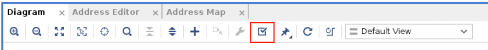

    (DRCs) by clicking the **Validate Design** button
=======
    subsystem design rule checks (DRCs) by clicking the **Validate Design** button.

    
>>>>>>> Stashed changes

9.  The Validate Design dialog box opens, and validation should be
    successful. Click **OK**.

<<<<<<< Updated upstream
    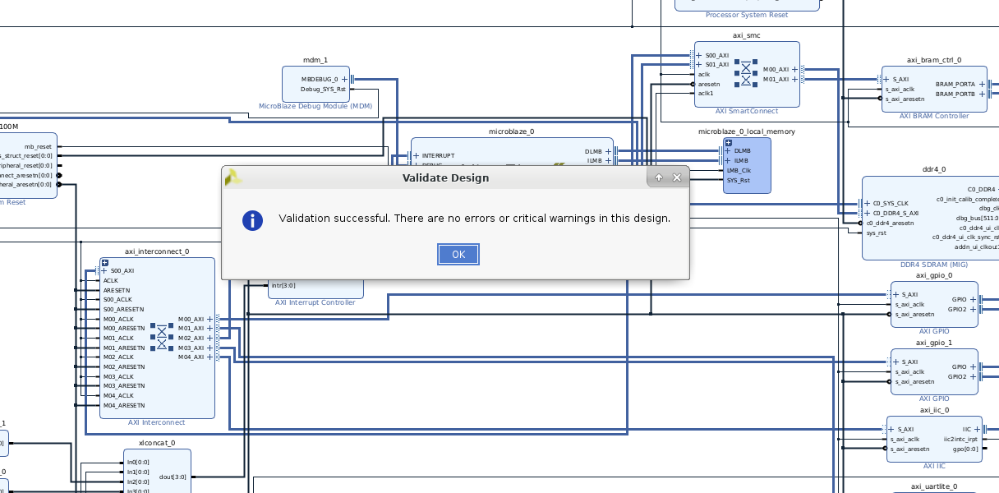
=======
     
>>>>>>> Stashed changes

## Step 6: Using the Address Editor

For various memory mapped master and slave interfaces, IP Integrator
<<<<<<< Updated upstream
follows the industry standard IP-XACT data format for capturing memory requirements and capabilities of endpoint masters and slaves. This section provides an overview of how IP Integrator models address information on a memory-mapped slave. Master interfaces have address spaces, or address_space objects. Slave interfaces have an address_space container called a memory map to map the slave to the address space of the associated master. Typically, these memory maps are named after the slave interface pins, for example S_AXI, though that is not required.
=======
follows the industry
standard IP-XACT data format for capturing memory requirements and
capabilities of endpoint
masters and slaves. This section provides an overview of how IP
Integrator models address
information on a memory-mapped slave.
Master interfaces have address spaces, or address_space objects. Slave
interfaces have an
address_space container called a memory map to map the slave to the
address space of the
associated master. Typically, these memory maps are named after the
slave interface pins, for example S_AXI, though that is not required.
>>>>>>> Stashed changes

The memory map for each slave interface pin contains address segments,
or address_segment objects. These address segments correspond to the
address decode window for that slave. A typical AXI4-Lite slave will
have only one address segment, representing a range of addresses.
However, some slaves, like a bridge, will have multiple address segments
or a range of addresses for each address decode window.

When you map a slave to the master address space, a master
address_segment object is created, mapping the address segments of the
slave to the master. The Vivado IP Integrator can automatically assign
addresses for all slaves in the design. However, you can also manually
assign the addresses using the Address Editor. In the Address Editor,
you see the address segments of the slaves, and can map them to address
spaces in the masters.

1.  Click the **Address Editor** tab to show the memory map of all the
    slaves in the design.

<<<<<<< Updated upstream
    > **Note:** If the Address Editor tab is not visible then select **Window →  Address Editor** from the main menu.

     The IP Integrator has automatically assigned the addresses.

    > **Note:** There are multiple address networks shared between processors accessing the peripherals (AXI Block RAM, GPIO etc.), and networks for local memory belonging to each processor subsystem.

     You can change the automatic address assignments by clicking in the corresponding column and changing the values.
     
    

=======
    >**Note:** If the Address Editor tab is not visible then select
 **Window →  Address Editor** from the main menu.

     The IP Integrator has automatically assigned the addresses.

     > **Note:** There are multiple address networks shared between
     > processors accessing the peripherals (AXI block RAM, GPIO etc.), and
     > networks for local memory belonging to each processor subsystem.

     You can change the automatic address assignments by clicking in the
     corresponding column and changing the values.

     

>>>>>>> Stashed changes
2.  Select the **Diagram** tab, to return to the IP Integrator design
    canvas.

## Step 7: Creating Hierarchies 

1.  There are different ways of changing the view on the canvas and
    better organizing the blocks. One of these capabilities is creating
    hierarchy levels to include one or more blocks.

<<<<<<< Updated upstream
    For this lab you will create three hierarchies called peripherals, memory_ss and microblaze_ss.
=======
    For this lab you will create 3 hierarchies called peripherals, memory_ss
  and microblaze_ss.
>>>>>>> Stashed changes

2.  To create the ***peripherals*** hierarchy select the following 4
    blocks- axi_iic_0 (IIC),axi_uartlite_0(UARTLITE),axi_gpio_0(GPIO),axi_gpio_1(GPIO) by
    holding down the ctrl- button clicking on them one after the other.
    They should be highlighted in orange.

3.  Now, right-click and select Create Hierarchy.

    

4.  You can assign a new name to the hierarchy as “peripherals”.

5.  You can expand the hierarchy to see the content inside by clicking
    on the + button on the top left of the block.

<<<<<<< Updated upstream
     
     
     

6.  Similarly, to create the ***memory_ss*** hierarchy select the
    following 4 blocks- axi_smc (SmartConnect), ddr4_0(DDR4 SDRAM),
    axi_Block RAM_ctrl_0 (Block RAM Controller), axi_bram_ctrl_0_bram (Block
=======
       
 
     

6.  Similarly, to create the ***memory_ss*** hierarchy select the
    following 4 blocks- axi_smc (SmartConnect), ddr4_0(DDR4 SDRAM),
    axi_bram_ctrl_0 (block RAM Controller), axi_bram_ctrl_0_bram (Block
>>>>>>> Stashed changes
    Memory Generator) by holding down the ctrl- button clicking on them
    one after the other.

7.  And lastly, to create the ***microblaze_ss*** hierarchy select the
    following 7 blocks – microblaze_0(Microblaze), axi_intc_0(Interrupt
    Controller),
    microblaze_0_local_memory,mdm_1(MDM),xlconstant_0(Constant),
    xlconstant_1(Constant), xlconcat_0(Concat)

    You might get a critical warning when trying to create a MicroBlaze
    subsystem as shown in figure below, but it can be safely ignored for
    this design. Elf file is the executable. It's generated after
    compilation & build process in Software Development Kit (SDK). Since
<<<<<<< Updated upstream
    this design will not be using the SDK therefore it is safe to ignore the
    warning.

     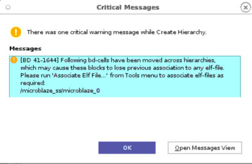
=======
    this design won’t be using the SDK therefore it is safe to ignore the
    warning.

    
>>>>>>> Stashed changes

8.  The design canvas should look something like the snapshot shown
    below.

<<<<<<< Updated upstream
     
=======
    
>>>>>>> Stashed changes

9.  You can also switch to interface view and try other options for
    better clarity on the design canvas.

<<<<<<< Updated upstream
     
=======
       
>>>>>>> Stashed changes

10. Click on Validate Design and click OK once the design is Validated
    successfully.

11. Click on **File → Save Block Design** command from the main menu.

## Step 8: Block Design Containers 

Block Design Containers (BDC) is a feature in IPI which allows you to
instantiate a Block Design (BD) inside another BD. We call the BD that
gets instantiated as the **childBD **and the BD in which the childBD is
instantiated as the **topBD**. The following features are supported:

- **Full visibility into the contents of the childBD from the topBD**:
  The instantiated childBD looks like a regular hierarchy in the topBD,
  where clicking on the '+' icon on the block will expand the childBD
  in-place and allow you to view the contents.

- **Ability to change addresses from the topBD**: Slaves assigned to
  certain addresses in the childBD can be changed directly from the
  topBD, and can be different from the original assignments. This allows
  multiple instantiations of the same childBD to map to different
  Masters at different addresses.

- **Ability to propagate parameters inside childBD**: You can propagate
  parameters from the topBD inside the childBD. This also allows for
  different set of parameters to propagate to different instantiations
  of the same childBD.

<<<<<<< Updated upstream
- **Changes made to childBD and reflected into topBD: **Any changes made
=======
- **Changes made to childBD and reflected into topBD:** Any changes made
>>>>>>> Stashed changes
  to the master copy of the childBD pops up a Stale banner in the topBD
  which will then update all block containers to the changes made.

- **Ability to specify multiple Synthesis sources**: This allows you to
  add multiple implementations (versions) for the same piece of logic to
  be specified, all in one block.

- **Create partition definitions and Reconfigurable Modules(RMs)**: A
  block container can be made into a Partially Reconfigurable (PR)
  module, which means that when the design is being generated, a
  Partition Definition is created for the block container and all
  "variants" are converted into RMs.

<<<<<<< Updated upstream
    > **Note:** Block Design Containers support both Top – Down flow and Bottoms Up
    > flow. In Top- Down flow a diagram for the top-level design is created
    > first. The user/designer them creates proper hierarchies in the
    > top-level block design to push a set of IP blocks into BDC’s as
    > sub-blocks. In this step, you will implement a Top Down flow where you
    > will convert a regular hierarchy in top BD to a BDC cell. In the next
    > step you will implement the bottom-up flow.
=======
 Block Design Containers support both Top – Down flow and Bottoms Up
 flow. In Top- Down flow a diagram for the top-level design is created
 first. The user/designer them creates proper hierarchies in the
 top-level block design to push a set of IP blocks into BDC’s as
 sub-blocks. In this step, you will implement a Top Down flow where you
 will convert a regular hierarchy in top BD to a BDC cell. In the next
 step you will implement the bottom-up flow.
>>>>>>> Stashed changes

1.  To create a block design container from the ‘peripherals’ hierarchy
    Right-click on the 'peripherals' hierarchy and select "Create block
    container". Ensure that the design is validated before creating the
    BDC.

<<<<<<< Updated upstream
     
=======
     
>>>>>>> Stashed changes

2.  You will notice that a new block design has been created for the
    selected hierarchy. Also, the hierarchy block in the topBD has been
    replaced with a block design container.

<<<<<<< Updated upstream
     

3.  If you go to sources and double-click on ‘peripherals.bd’, it should
    look like screenshot below:

     

4.  If you switch back to the top.bd by double clicking on ‘top.bd’ in
    the sources tab and click on the '+' icon, you should see contents
    of 'peripherals.bd' 
    > **Note:** This looks similar to the hierarchy block
    we had previously, but in fact it is now showing the contents of the
    new peripherals.bd)
    Click on the '-' icon to collapse the hierarchy
    and reduce clutter:

     

5.  **Adding a second variant: **We will now add a second variant to
    this container. To do this, switch back to 'peripherals.bd', click
    on File → Save Block Design As ... → Type in a name for the new
    variant. For example 'peripherals_2' → Click OK.

     

6.  For this Lab, you can choose the name peripheral_2

     

    >**NOTE**: Users are allowed to use whatever BD they choose to as a potential Synthesis source. However, when a block is marked as a PR module, the tool requires that the boundaries of all the sources are matching EXACTLY.
=======
     

3.  If you go to sources and double click on ‘peripherals.bd’, it should
    look like screenshot below:

     
 
4.  If you switch back to the top.bd by double clicking on ‘top.bd’ in
    the sources tab and click on the '+' icon, you should see contents
    of 'peripherals.bd' (NOTE: This looks similar to the hierarchy block
    we had previously, but in fact it is now showing the contents of the
    new peripherals.bd). Click on the '-' icon to collapse the hierarchy
    and reduce clutter:

    

5.  Adding a second variant: We will now add a second variant to
    this container. To do this, switch back to 'peripherals.bd', click
    on File → Save Block Design As ... → Type in a name for the new
    variant. For example 'peripherals_2' → Click OK.

      

6.  For this Lab, you can choose the name peripheral_2

     

    > **NOTE**: You are allowed to use whatever BD they choose to as a
    > potential Synthesis source. However, when a block is marked as a PR
    > module, the tool requires that the boundaries of all the sources are
    > matching EXACTLY.
>>>>>>> Stashed changes

7.  Add this variant as a Synthesis source to the block container. To do
    this, switch back to the top.bd, and double-click on the block
    'peripherals' (on design canvas).

<<<<<<< Updated upstream
     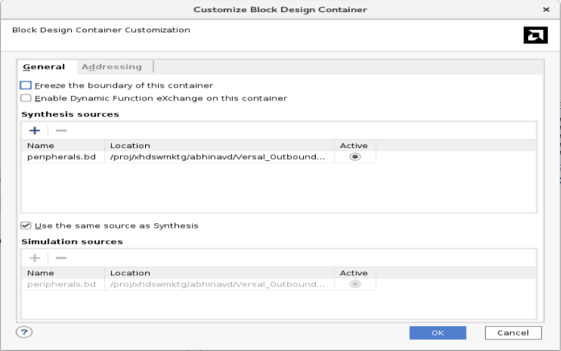

8.  You will see the following options in the GUI:

    1.  The '**Enable Dynamic Function eXchange on this module**'
        checkbox specifies if this container is a PR module or not.

    2.  The '**Freeze the boundary of this container**' checkbox
=======
    

8.  You will see the following options in the GUI:

    -  The '**Enable Dynamic Function eXchange on this module**'
        checkbox specifies if this container is a PR module or not.

    -  The '**Freeze the boundary of this container**' checkbox
>>>>>>> Stashed changes
        prevents any parameters from the topBD from entering inside this
        container.  
        This is useful when you have certain IPs configured at a
        particular frequency, for example, and want to maintain that.

<<<<<<< Updated upstream
    3.  The two tables below this allow you to specify multiple
=======
    -  The two tables below this allow you to specify multiple
>>>>>>> Stashed changes
        Synthesis and Simulation sources for this container.

9.  Enable the '**Enable Dynamic Function eXchange on this module**'
    checkbox. Then, click on the '+' icon near the 'Synthesis sources'
    table, and add the newly created 'peripherals_2.bd':

     

10. Validate and save the design

11. Click on 'Generate Block Design' on the left panel and select 'On
    local host' in 'Run Settings'. You can also choose to run it on a
    cluster if you have the configurations defined correctly. Click on
    **Generate**.

<<<<<<< Updated upstream
     
12. If you switch to the 'Design Runs' tab, you should see something
    like this:

     

    >**NOTE:** This window indicates that a Synthesis run has been created
for the two variants inside the container, and Synthesis runs have been
started for IPs inside the top BD. Since this container is in PR mode,
the runs of the variants are deferred until Synthesis starts. At that
point, the runs for the variants will be launched Out-of-Context and
stitched at run-time. 

    >**NOTE:** The completion of this step might take some time.
=======
    

12. If you switch to the 'Design Runs' tab, you should see something
    like this:

     

    > **Note:** This window indicates that a Synthesis run has been created
    for the two variants inside the container, and Synthesis runs have been
    started for IPs inside the top BD. Since this container is in PR mode,
    the runs of the variants are deferred until Synthesis starts. At that
    point, the runs for the variants will be launched Out-of-Context and
    stitched at run-time. 

    >**Note:** The completion of this step might take some time.
>>>>>>> Stashed changes

13. Create a top-level wrapper for the top.bd: Right-click on 'top' in
    the Sources view and select "Create HDL wrapper". Click OK.

<<<<<<< Updated upstream
     

    In the ‘Create HDL Wrapper Window’ select ‘Let Vivado manage wrapper and
=======
      

    In the Create HDL Wrapper window select ‘Let Vivado manage wrapper and
>>>>>>> Stashed changes
auto-update’ and click OK.

14. Setup Dynamic Function Exchange (DFX) configurations: This step is
    essential because you want to associate your Partition Definitions
    to certain configurations. This allows your Reconfigurable Modules
    (RMs) to synthesize differently than other Block Designs (BDs).

15. Click on 'Dynamic Function eXchange Wizard' in the Flow Navigator.
    Click Next

<<<<<<< Updated upstream
     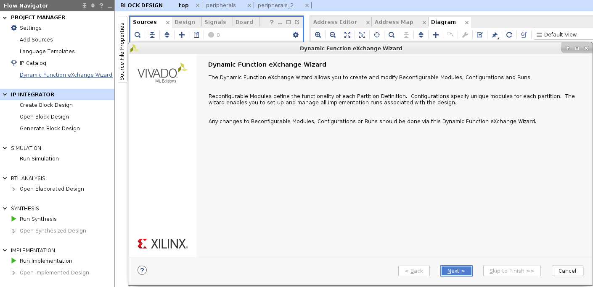
=======
      
>>>>>>> Stashed changes

16. This window shows you a list of Partition Definitions in your design
    and RMs inside each of them. You are allowed to modify/add/delete
    RMs as you'd like. In this tutorial we will not concentrate on
    those, Click Next.

<<<<<<< Updated upstream
    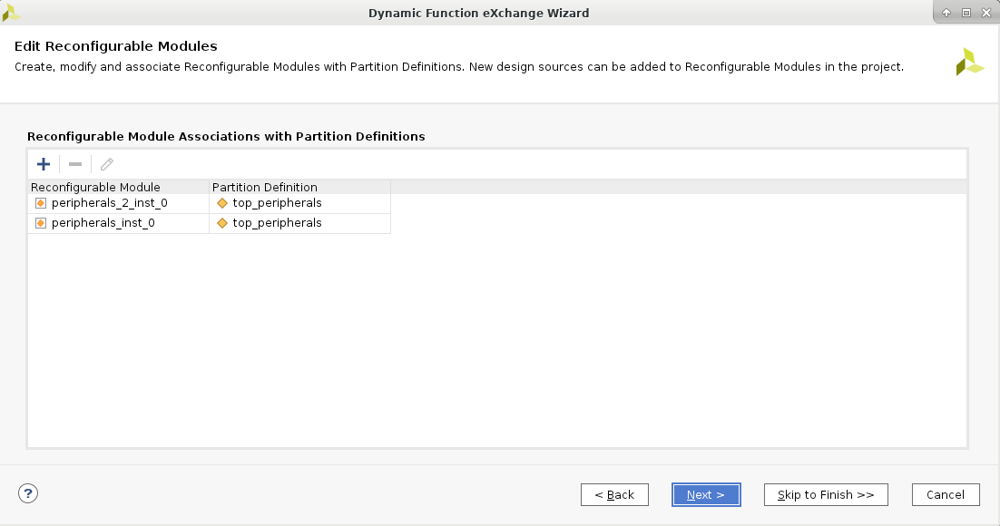
=======
     
>>>>>>> Stashed changes

17. This window allows you to attach custom configurations to you RMs.
    Click on 'automatically create configurations' → Next.

<<<<<<< Updated upstream
     
=======
    
>>>>>>> Stashed changes

18. The next window allows you to attach custom runs to your RMs. Click
    on 'automatically create configuration run’.

<<<<<<< Updated upstream
     
=======
    
>>>>>>> Stashed changes

19. Click on Next → Finish.

20. Now, you have three options to move forward:

- Use the Run Synthesis command to run only synthesis.

<<<<<<< Updated upstream
- Use the Run Implementation command, which first runs synthesis if
=======
- Use the Run Implementation command, which will first run synthesis if
>>>>>>> Stashed changes
  it has not been run and then run implementation.

- Use the Generate Bitstream command, which will first run synthesis,
  then run implementation if they have not been run, and then write the
  bitstream for programming the Xilinx device.

<<<<<<< Updated upstream
    These options can be selected from the Flow Navigator.
=======
   These options can be selected from the Flow Navigator.
>>>>>>> Stashed changes

21. For this lab, we are going to generate the bitstream for the design.

22. Before doing this step, you should add the constraint file to the
    design. You can create a constraint file as required by your design.
    For this lab, we will use the constraint file “top.xdc” already
    provided in ‘BDC_top_bottom_ref_files’ folder. To add the constraint
    file to current working directory, select add sources from flow
    Navigator, choose ‘add or create constraints’ option in the add
    sources wizard. Add the constraint files to the current directory
    and click Finish. You will see ‘top.xdc’ file added in constraints
    folder, under design sources tab.

<<<<<<< Updated upstream
     
=======
     
>>>>>>> Stashed changes

23. From the Flow Navigator, click on **Generate Bitstream,** which will
    automatically synthesize, implement, and generate the bitstream for
    the design.

24. You now have a fully generated PR design using Block Design
<<<<<<< Updated upstream
    Containers using Top-Down flow.

# Design Creation Steps: Bottom - Up BDC flow

1.  In this lab you will get familiar with Bottom UP design flow of IP
=======
    Containers using Top -  
    Down flow.

# Design Creation Steps: Bottom - Up BDC flow

1.  In this lab you get familiar with Bottom UP design flow of IP
>>>>>>> Stashed changes
    Integrator using Tcl flow, instead of creating the design completely
    using the GUI mode from IPI.

2.  In this flow, sub-block designs have been created separately and the
    user needs to instantiate these sub-blocks as BDC’s within the
    top-level block design.

3.  Vivado offers the flexibility to populate and connect the IP’s and
    Interfaces on design canvas using either the GUI flow, Tcl flow or a
    hybrid flow, where few steps can be completed using either flow. In
    step 8 of this tutorial, it could be observed that for every
    activity performed on the Design Canvas, be it adding IP, making
    connections, validation et al, there was a corresponding Tcl command
    generated by Vivado which could be seen on the Tcl console.

    The entire design can be recreated using this Tcl flow if you generate
    a corresponding Tcl script of the design using either the
<<<<<<< Updated upstream
     “write_bd_tcl” command or by using the Vivado GUI as shown in snapshot
     below:

     

     Additionally, Vivado also saves journal files automatically, which can
     be used to regenerate few steps of the already created design.
=======
    `write_bd_tcl` command or by using the Vivado GUI as shown in snapshot
    below:

     

    Additionally, Vivado also saves journal files automatically, which can be used to regenerate few steps of the already created design.
>>>>>>> Stashed changes

4.  You will create the bottoms up BDC in this step using the Tcl flow.
    The Tcl script for top block design, peripheral block design and the
    constraints files are already generated for this section of the
    tutorial to demonstrate the specific feature of the BDC using same
    process as mentioned in point 2. Put the top_bd.Tcl and
    peripherals.bd.tcl , provided with this tutorial in the same folder.

5.  For bottoms up BDC flow, Create project and top level design by
    running ‘top_bd.tcl’ in Vivado (source top_bd.tcl), and you will see
    the following design populated on the design canvas with a top.bd
    source pre created.

<<<<<<< Updated upstream
    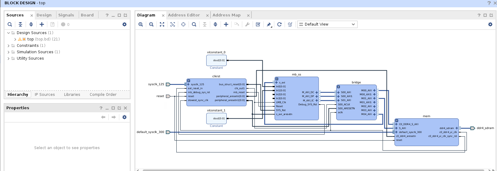
=======
     
>>>>>>> Stashed changes

6.  Create a sub design, source peripherals.bd in the project using Tcl
    console (source peripherals.bd.tcl)

<<<<<<< Updated upstream
     
=======
       
>>>>>>> Stashed changes

7.  Drag and Drop peripherals.bd from Sources/Hierarchy window onto the
    top.bd block design.

<<<<<<< Updated upstream
     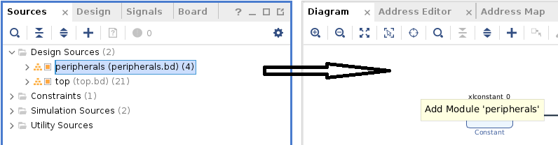
=======
     
>>>>>>> Stashed changes

8.  Connect BDC cell peripherals in top design (Run Connection
    Automation or connect manually).

9.  Validate and save the design.

10. Follow steps \#5 to \#21 from the above section Top Down Flow and
<<<<<<< Updated upstream
    you can take the design to bitstream generation
=======
    you can take the design to bitstream generation.
>>>>>>> Stashed changes

This brings us to the end of the tutorial.
