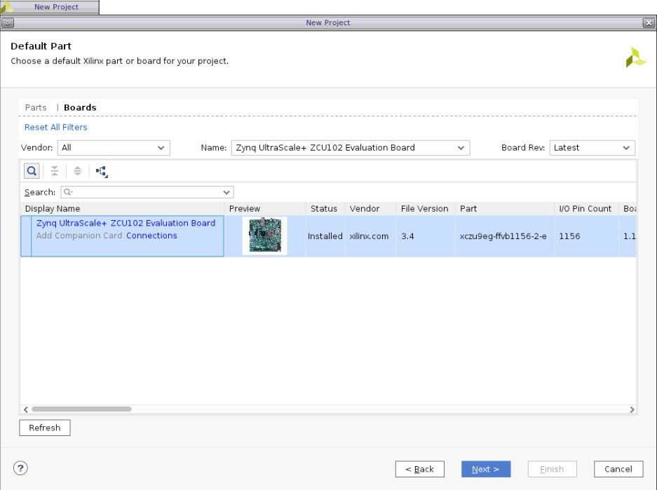
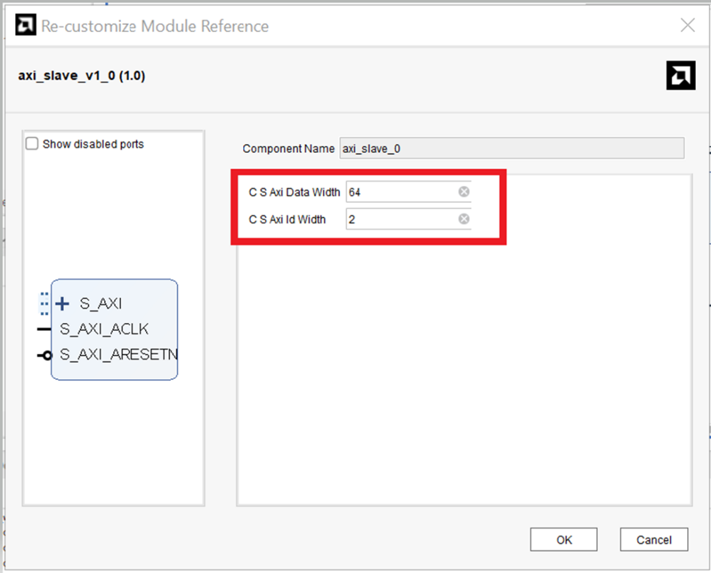
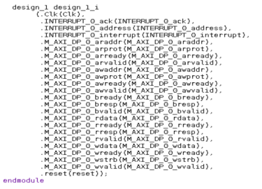
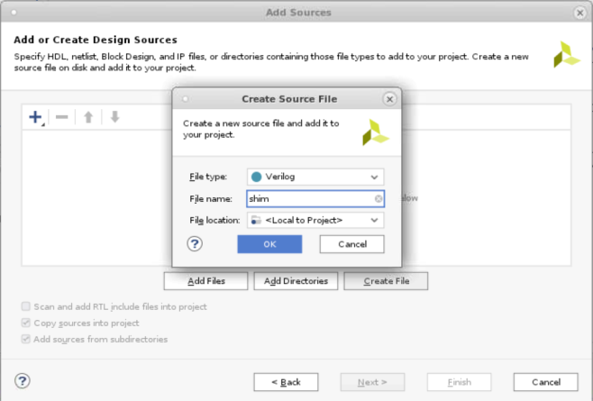
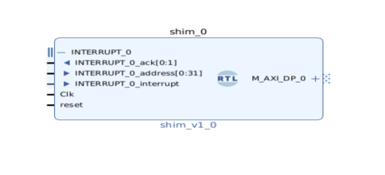
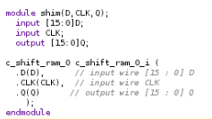

#   **Contents**
1. [**Module Referencing in IPI**](#module-referencing-in-ipi)

    -   [**Introduction**](#introduction)
    -   [**Tutorial Design
        Description**](#tutorial-design-description)
    -   [**Part 1- Creating the Microblaze
        Design**](#part-1--creating-the-microblaze-design)
    -   [**Part 2 - Referencing RTL Module**
        ](#part-2--referencing-rtl-module)
    -   [**Part 3 - Inference in an RTL
        module**](#part-3--inference-in-an-rtl-module)
    -   [**Part 4- The X_MODULE_SPEC
        Attribute**](#part-4--the-x_module_spec-attribute)

        -   [**Part 4a- Creating a Module Reference of a Block Design
            (BD)**](#part-4a--creating-a-module-reference-of-a-block-design-bd)
        -   [**Part 4b- Creating a module reference of an XCI
            file**](#part-4b--creating-a-module-reference-of-an-xci-file)
        -   [**Limitations of the X_MODULE_SPEC
            attribute**](#limitations-of-the-x_module_spec-attribute)

# **Module Referencing in IPI**
## **Introduction**

***Version : Vivado 2022.1***

The Module Reference feature of the Vivado IP Integrator lets you
quickly add a module or entity definition from a Verilog or VHDL source
file directly in your block design. It provides a means of quickly
adding RTL modules without having to go through the process of packaging
the RTL as an IP to be added through VIVADO IP catalog. This technology
works for both project flow and non-project flow of Vivado.

## **Tutorial Design Description**

For Part 1, we will creat a basic Microblaze block design with the ZCU102 Evaluation Board.

In Part 2, we will use the design created in part 1 to explore the Register Transfer Level (RTL) module reference feature of IP Integrator.

In Part 3, we will explore the RTL inference feature of module reference technology based on Microblaze design created in part 1 and RTL design added in part 2.

In part 4, we will explore the new feature introduced for module reference called X_MODULE_SPEC, which combines the existing X_INTERFACE_INFO and X_INTERFACE_PARAMETER HDL attributes. This part
will once again use the Microblaze design created in part 1, for
creating new designs, independent of the RTL features explored in part 2
and part 3 of this lab.

## **Part 1- Creating the Microblaze Design**

1.  Open the Vivado® Integrated Design Environment (IDE). Create a new
    project by clicking on **Create Project** from the Vivado 2022.1
    Quick Start page. Choose a name and sub-directory for your project
    and click **Next**. In the Project Type page, select **RTL
    Project**, and select Do not specify sources at this time, then
    click **Next**.

2.  Click next, and you will land on the Default Part page. Click
    on the **Boards** tab and select ZCU102 from the options.

  

3.  Review the project summary in the New Project Summary page. Click
    **Finish** to create the project.

4.  The new project opens in the Vivado IDE.

5.  Click on **Create Block Design** from the Flow Navigator pane and
    leave the block design settings as default.

6.  Add the **Microblaze** IP into the BD.

  

7.  Once that has been added to the BD, click on **Run Block
    Automation**.

  

8.  Leave the default block automation settings and click **OK**.
  

9.  You will see the associated IPs with the Microblaze in the BD after
    running Block Automation. Next, click on **Run Connection
    Automation** to finish the remaining connections. Make sure to
    select all interfaces and then click **OK**.

  

10. The BD should now look like this figure-

  
  
11. Now, validate the design- there should be no errors. Next, generate
    output products by going under **Sources** and right-clicking on
    design_1 as shown below-

  .
 
Leave the default settings for the generation of output products-

  

This part completes all the steps required to generate a Microblaze design.
This design will be used as a template to showcase different features of
module reference in the sections below. You will be required to recreate
this design multiple times for the tutorial walkthrough.

## **Part 2- Referencing RTL Module** 

To add HDL to the block design, first you must add the RTL source file
to the Vivado project. An RTL source file can define one or more modules
or entities within the file. The module can contain one or more IP
instances (support all IP types like HLS IP, IP with ELF dependencies,
OOC IP, etc.) one or more BD designs, one or more OOC/Global sources (IP
or BD), and a mix of them. The Vivado IP integrator can access any of
the modules defined within an added source file You can refer *Vivado
Design Suite User Guide: System-Level Design Entry (UG895)* for more
information on adding design sources.

1.  For this tutorial, you can add the "axi_slave.v" file provided with this
    document to your design folder, where the part 1 design is saved.
    You can find this file under "../rtl" folder. Go to Flow Navigator
    -\> Add Sources -\> Add or create design sources -\> Add Files -\>
    add axi_slave.v -\> click OK -\> Finish. You will see that the
    axi_slave.v has been added as a design source.

  

2.  In the block design, you can add a reference to an RTL module using
    the Add Module command from the right-click menu of the design
    canvas, as shown in the following figure.

  

3.  The add module dialog box displays a list of valid modules defined
    in the RTL source files that you have added to the project. Select
    axi_slave module and click OK to add it to the block design, as
    shown in figure below:

  

The Add Module dialog box also provides a Hide incompatible module check
box that is enabled by default. This hide module definitions in the
loaded source files that do not meet the requirements of the Module
Reference feature and, consequently, cannot be added to the block
design. You can uncheck this check box to display all RTL modules
defined in the loaded source files, but you will not be able to add all
modules to the block design.

4.  The instance names of RTL modules are inferred from the top-level
    source of the RTL block as defined in the entity/module definition.
    As shown in the following figure, axi_slave is the top level module
    name (red rectangular box).

  

**NOTE:** If the entity/module name changes in the source RTL file, the
referenced module instance must be deleted from the block design and a
new module added.

5.  You can also add modules to an open block design by selecting the
    module in the Sources window and using the Add Module to Block
    Design command from the context menu, as shown in figure below

  

Finally, RTL can also be dragged and dropped from the Sources window
onto the block design canvas as shown below:

  

6.  The IP integrator adds the selected module to the block design, and
    you can make connections to it just as you would with any other IP
    in the design. The IP displays in the block design with special
    markings that identify it as an RTL referenced module, as shown in
    the following figure:

  
  
7.  Now run connection automation and you will see that design canvas
    looks like the figure below:

  
  
8.  If a new block design is created after you have added design sources to the project, the block design is not set as the top-level of the design in the Sources window.
The Vivado Design Suite automatically assigns a top-level module for the design as the sources are added to the project. To set the block design as the top level of the design, right-click the block design in the Sources window and use Create HDL Wrapper.

  
 
**NOTE**: The block design cannot be directly set as top level module

9.  Once you create the HDL wrapper you can see that Vivado
    automatically made design_1\_wrapper as top module for axi_slave and
    a module reference wrapper for the same is created. Any RTL modules
    that are referenced by the block design are moved into the hierarchy
    of the design under the HDL wrapper, as shown in the following
    figure.

    If you delete a referenced module from the block design, then the module is moved outside the block design hierarchy in the Sources window.

  

10. If you want to set another module as the top module after creating the wrapper, right-click to select it in the Sources window and use the Set as Top command from the context menu. For example,if you want to create axi_slave.v as top module instead of design_1\_wrapper then right click on the it and select set as top, as shown in figure below:

  
  
But for this lab we will keep design_1\_wrapper as the top design.

11. In some cases, a user code might have commonly used Xilinx® IP instantiated within their RTL. The Reference RTL Module feature allows inferencing the XCI (.xci) files for IP embedded within the RTL code.

    Vivado 2022.1 supports most IP's in ModuleRef apart from CIPS, NOC an ZYNQ
processing system.

## **Part 3- Inference in an RTL module**

You can infer generic or parameters, control signals and AXI interfaces
in your IPI design, while using module reference technology by following
specific guidelines mentioned below.

1.  Inferring Generics/Parameters in an RTL Module: If the source RTL contains generics or parameters, those are inferred at the time the module is added to the block design, and can also be configured in the re-customize Module Reference dialog box for a selected module.

    If you open the RTL code of axi_slave.v by double clicking on it under the sources tab, you can see the usage of parameter for DATA_WIDTH and
    ID_WIDTH

  
  
When the axi_slave module is instantiated into the block design, the module is added with port widths defined by the value of the parameter.
You can double-click the module to open the Re-customize Module
Reference dialog box. You can also right-click the module and select
**Customize Block** from the context menu.

Any generics or parameters defined in the RTL source are available to edit and configure as needed for an instance of the module. As the parameter is changed, the module symbol and
ports defined by the parameter are changed accordingly. In the snapshot below you can see that you can change the value of the parameters defined in the code in the re-customize window.
 
  

For this Lab, keep the values to preassigned values and click **OK**.

2.  Inferring Control Signals in a RTL Module : You must insert attributes into the HDL code so that clocks, resets, interrupts, and clock enable are correctly inferred. The Vivado® Design Suite provides language templates for these attributes. To access these templates, click **Language Templates** under the Project Manager.

  

This opens the Language Template dialog box, as shown in the following figure

  
  
You can expand the required HDL language **Verilog/VHDL → IP Integrator HDL**  and select the appropriate Signal Interface to see the attributes in the Preview pane. You can copy and paste the required X_INTERFACE attributes from the preview pane and add it your RTL code to infer the required control signals.

3.  Inferring AXI Interfaces: When you use the standard naming
    convention for an AXI interface (*recommended*), the Vivado IP Integrator automatically infers the interface. If you open the RTL code for axi_slave.v, you can see that standard AXI names have been used as shown in the code snippet below:

  

When this RTL module is added to the block design the AXI interface is automatically inferred as shown below and all the ports from the RTL are inferred.
  
  
  
Vivado IPI automatically puts together all the AXI signals as a bus interface S_AXI which can be collapsed or expanded on the canvas as needed.

  

After an AXI interface is inferred for a module, the Connection Automation feature of IP integrator becomes available for the module. This feature offers connectivity options to connect a slave interface to a master interface,
or the master to the slave. You have already used this feature in Part 2 of this Lab.

If the names of your ports do not match with standard AXI interface names, you can force the creation of an interface and map the physical ports to the logical ports by using the
X_INTERFACE_INFO attribute as found in the Language Templates mentioned in point 2.

4.  The IP packager and the Module Reference flow support a number of Attributes of the style X\_\[\...\] that can specify a certain behavior to replace and modify the standard interface heuristic. As a global rule, the parameters always take precedence over any project wide or application-wide behavior.
Furthermore, most attributes are attached to the ports (because VHDL or Verilog do not have any notion of an interface that this information could be attached to). If the attribute relates to interface-wide information (for example,
X_INTERFACE_MODE), the attribute applies to the entire interface, and any constituent port can be chosen as representative for the whole interface.

5.  In some cases, users may need to specify the order in which interfaces are inferred rather than letting the tools automatically infer them. The Module Reference feature allows the user to prioritize the order of the interface inference. There are several attributes that can be used to infer interfaces.

6.  To edit the source code of a module, right-click it, and select Go To Source from the context menu, as shown in the following figure.

  

This opens the module source file for editing, shown in the following
figure

  

Now you can change parameter C_S\_AXI_DATA_WIDTH to 32 and save it, notice that the Refresh Change Modules link becomes active in the banner of the block design canvas, as shown in the following figure.

  
  

Click **Refresh Changed Modules** to reread the module from the source file. Depending on the changes made to the module definition, for example, changing parameter value, you might see a message such as shown in the following figure.

  

You can see the TCL commands for all the points mentioned above, in the TCL console of Vivado. For more information on using RTL Inference in your design, please refer to *Designing IP Subsystems Using IP Integrator (UG995)* documentation.

## **Part 4- The X_MODULE_SPEC Attribute**

The existing X_INTERFACE_INFO and X_INTERFACE_PARAMETER HDL attributes discussed in part 3 of this tutorial can be replaced with a single X_MODULE_SPEC attribute. For more information on the X_INTERFACE_INFO and X_INTERFACE_PARAMETER HDL attributes, please refer to Chapter 14- Referencing RTL Modules of UG994.
The X_MODULE SPEC contains boundary information like port to interface mappings and addressing information. 

In this section of the tutorial, we will be using the new
**::ipx::package_module_spec** tcl command which has been added in Vivado 2022.1 to help users create, validate and convert an X_MODULE_SPEC attribute for use in any IP, BD or RTL shim module.

### **Part 4a- Creating a Module Reference of a Block Design (BD)**

In this part of the lab, we will be using the
**ipx::package_module_spec** command to create a module reference for the MicroBlaze design similar to the one created in part 1 of this tutorial.

1.  Follow the steps mentioned in part 1 above, to create a MicroBlaze subsystem in a *new project*. Make all connections, run connection automation, validate and save the design. Finally generate the output products. For this lab the design can be names as "design_1".

2.  To reference an IP or BD module into another BD as RTL module reference, you must first create a shim RTL file. You can create a new shim RTL file (like shim.v) from an IP or a BD instantiation template, or from a generated BD wrapper.

**IMPORTANT**: If using BD wrapper then please configure to be \"managed by user\" to avoid future BD generations overwriting your work. Make sure the BD output products are generated before using the ::ipx::package_module_spec tcl commands below.

3.  In this Lab we will be using the generated BD wrapper to create the shim RTL file. To do this, right- click on the design_1.bd under sources -\> Design Sources and select Create HDL Wrapper, as shown below:

  

4.  In the Create HDL Wrapper window select "Copy generated wrapper to allow user edits".

  

5.  The generated hdl wrapper should look like the snapshot shown below:

  

6.  Create an RTL shim file and add it to the folder. You can use the flow navigator to add the files by following Add Sources -\> Add or create design sources -\> Create File. In this Lab Verilog will be used so you can create a shim.v file as shown below:

  

Click Finish to add shim.v as source file and name the module as shim to create an empty shim module.

  

7.  Copy the generated HDL wrapper of design_1, created previously into the shim module of shim.v file and save it. The final code should look like the snapshot shown below:

  

8.  Once you save the changes made to shim.v, you can see that all the block designs have been automatically added to it, as shown below:

  
  
9.  Now, use the ipx::package_module_spec command as mentioned below, in the tcl console to create the default X_MODULE_SPEC attribute for a wrapped module. IP or BD modules must be generated before running ipx::package_module_spec or else the tool will fail with an error. In the previous part, we have already generated the output products so an error will not be seen.

The standard template for this tcl command is:

**ipx::package_module_spec -create -module_name \<BD_name\>
-output_file** **module_spec.json**

Since the BD_name in this design is design_1 therefore the tcl script for the same would be:

**ipx::package_module_spec -create -module_name design_1 -output_file module_spec.json**

Use the tcl script above in the tcl console to create a module_spec.json file. This json file will be created in the current working folder along with the log and journal files.

You have the flexibility to edit module_spec.json to add/remove interfaces, edit clocking etc.

For this lab, you don't need to make any changes.

  

10. To check if the instantiation has been done properly in the shim.v file, user can use the tcl command below to validate the module specification with respect to the target \'shim\' module.

    **ipx::package_module_spec -validate -module_name shim -input_file module_spec.json**

11. After running the tcl command, you should get a message saying the module specification is valid as follows:

  

12. The next step is to convert the module_spec.json file into a Verilog/VHDL file so that it can be added into the shim.v file. The appropriate commands are-
    
    For Verilog:\
    **ipx::package_module_spec -convert -module_name shim -language verilog -input_file module_spec.json -output_file module_spec.v**

    For VHDL:**\
ipx::package_module_spec -convert -module_name - shim -language vhdl -input_file module_spec.json -output_file module_spec.vhd**

    For this tutorial, we will be converting the module_spec.json file into a module_spec.v. This is how the file will look like after conversion-

  

13. You can now add the module_spec.v into the shim.v file to
    instantiate the Microblaze module. Add the contents of module_spec.v on top of the module 'shim'. The resulting shim.v file should look like this-

  

14. You can now create a new block design called upper_bd to add the shim.v as an RTL module to act as a module reference. There are two ways to add a new block design- click on the **Create Block Design** option through the Flow Navigator pane or through the below tcl command, **create_bd_design "upper_bd**".

  

15. Then, use the tcl command **create_bd_cell -type module -reference shim shim_0** to create a module reference to the Shim module.

  

16. From the below image, it can be seen that the MicroBlaze module have been instantiated into the Shim module.

  

17. Now save the design, and observe that sources design hierarchy would now look like the snapshot below:

  

18. You can now proceed to further steps such as making the interface pins and input pins as external, run validation, save block design, generate output products, etc. For this tutorial, all the pins have been made external and the
design has been successfully validated.

  

19. You can also open address editor at this stage and it will be observed that the address assignment metadata of the original design_1 has been propagated to the new shim.v design as well.

  

20. Now you can Generate Output products.

  

### **Part 4b- Creating a module reference of an XCI file**

In the previous section, we saw how to create a module reference of a block design within a block design. In this section, we will see how we can do the same using an XCI file.

1.  Create a new project as you normally would, following the steps mentioned in the Part-1. Now, under **Project Manager**, click on **IP Catalog** to view a list of IPs. For this tutorial, we will choose a RAM-based Shift Register.

  
  
Keep the configuration as default, click **OK** and generate the output products.

2.  Once the output products are generated, you can create a new shim file using the add sources from flow navigator, following the steps mentioned in step 4a. You can choose Verilog format for this section of the lab.

3.  In case of XCI files you can use the instantiation template and the stub file to create an HDL wrapper and subsequently populate the shim module for module reference. To access the instantiation template and stub files of RAM based shift register, navigate to the IP Sources sub-tab under the Sources tab and you will find an instantiation template folder under *c_shift_ram_0*.

    If you expand this folder you will find both vhdl(.vho) and Verilog(.veo) instantiation template. For this lab we are working with Verilog therefore double click to open the *c_shift_ram_0.veo* template.

  

4.  Copy and paste the Verilog code from the instantiated template into the shim.v file created earlier. Remember to change the "your_instance_name" in the template to a desired name, in this case change it to *c_shift_ram_0\_i*.

5.  Now you can navigate to the *c_shift_ram_0\_stub.v file* in the IP sources window and copy the contents including the Input/Output (I/O) ports to the shim module and save it.

  The final shim.v should look something like the snapshot below:

  

6.  If you navigate back to the Hierarchy folder you will see that shim.v has become a hdl wrapper of *c_shift_ram_0.xci.*

  

7.  Now you can use this shim.v to create a module reference. To do that, first use the **ipx::package_module_spec** command in the Tcl Console to create a json file of the shift register module as below-

    **ipx::package_module_spec -create -module_name c_shift_ram_0 -output_file \"module_spec.json\"**
    The resulting module_spec.json file will be created in the working directory and should look like the snapshot below:

  

8.  Now you can validate the design using the following tcl command:
    **ipx::package_module_spec -validate -module_name \"shim\" -input_file \"module_spec.json\"**

9.  Convert the module_spec.json file into a verilog file using the following command:

    **ipx::package_module_spec -convert -module_name \"shim\"
    -input_file \"module_spec.json\" -language \"verilog\" -output_file \"module_spec.v\"**
    The module_spec.v file should look as follows-

  

10. Next, we need to add the contents of the module_spec.v file into the
    shim.v file. To do this, copy and paste the contents of
    module_spec.v into the shim.v file and save the file.

  

11. You can now create a new block design called upper_bd to add the shim.v as an RTL module, to act as a module reference. There are two ways to add a new block design- click on the **Create Block Design** option through the Flow Navigator pane or through the below tcl command,**create_bd_design "upper_bd**".

  

12. Use the command **create_bd_cell -type module -reference shim shim_0** to create the module reference. As you can see from the figure below, the shim.v file has been added as an RTL module in the upper_bd block design with the instantiated ports from RAM-based shift register XCI file from the IP Catalog, in a similar way a BD was instantiated in the previous section.

  

13. You can now go ahead with further steps like validating design generating output products, etc.

### **Limitations of the X_MODULE_SPEC attribute**

1.  A ModuleRef must not contain Zynq Processing System,CIPS and NOC IP.

2.  A ModuleRef may not instantiate one or more DCP modules.

3.  A ModuleRef may not instantiate one or more ModuleRefs (i.e. \"Nested ModuleRefs\").

4.  A ModuleRef may not instantiate a BD using Block Design Container (BDC) technology.

5.  RTL within one or more BD designs: Currently
    ::ipx::package_module_spec operates on a single module at a time. In
    this case the user will need to run ipx::package_module_spec on both
    the instances to create separate module specifications, then
    manually merge these into the final module specification for the
    RTL.

This marks the end of the tutorial
