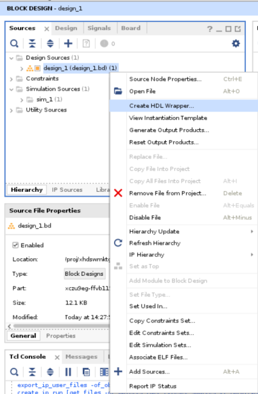
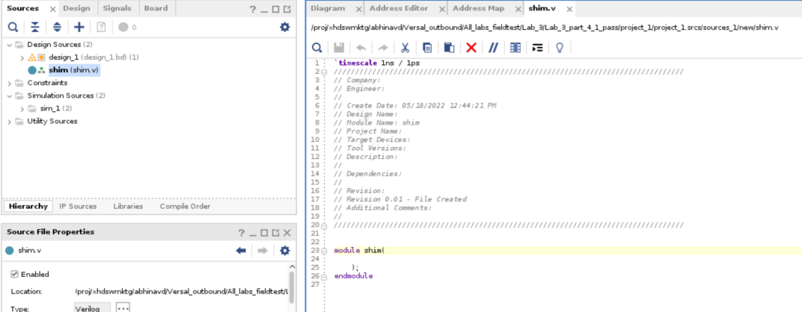
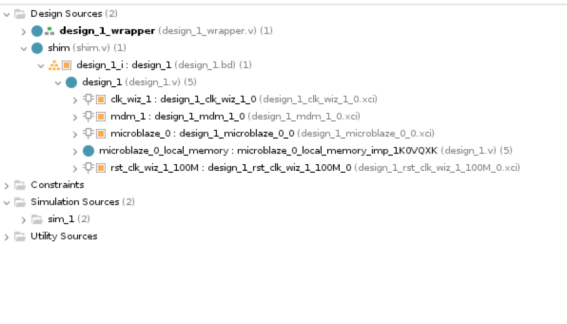
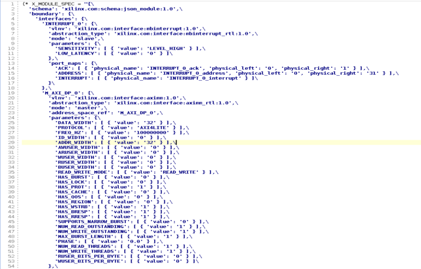
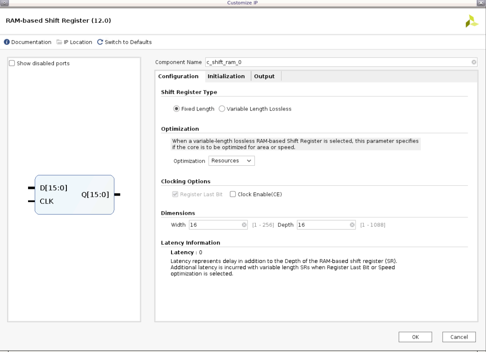

# **Contents**

<<<<<<< Updated upstream
 **Module Referencing in IPI**

 **Introduction** 

 **Tutorial Design Description**

 **Part 1- Creating the Microblaze Design**

 **Part 2 – Referencing RTL Module**

 **Part 3 – Inference in an RTL module**

 **Part 4- The X_MODULE_SPEC Attribute**
 **Part 4a- Creating a Module Reference of a Block Design (BD)**

 **Part-4b Creating a module reference of an XCI file**

 **Limitations of the X_MODULE_SPEC attribute**
=======
Module Referencing in IPI

Introduction

Tutorial Design Description

Part 1- Creating the Microblaze Design

Part 2 – Referencing RTL Module

Part 3 – Inference in an RTL module

Part 4- The X_MODULE_SPEC Attribute

Part 4a- Creating a Module Reference of a Block Design (BD)

Part-4b Creating a module reference of an XCI file

Limitations of the X_MODULE_SPEC attribute
>>>>>>> Stashed changes

# **Module Referencing in IPI**

## **Introduction**

The Module Reference feature of the AMD Vivado™ IP Integrator lets you
quickly add a module or entity definition from a Verilog or VHDL source
file directly in your block design. It provides a means of quickly
adding RTL modules without having to go through the process of packaging
the RTL as an IP to be added through Vivado IP catalog. This technology
works for both project flow and non-project flow of Vivado.

## **Tutorial Design Description**

For Part 1, we will be creating a basic Microblaze block design with the
ZCU102 Evaluation Board.

In Part 2, we will be using the design created in part 1 to explore the
Register Transfer Level (RTL) module reference feature of IP Integrator.

In Part 3, we will be exploring the RTL inference feature of module
reference technology based on Microblaze design created in part 1 and
RTL design added in part 2.

In part 4, we will be exploring the new feature introduced for module
reference called X_MODULE_SPEC, which combines the existing
X_INTERFACE_INFO and X_INTERFACE_PARAMETER HDL attributes. This part
will once again use the Microblaze design (similar to part 1), for
creating new designs, independent of the RTL features explored in part 2
and part 3 of this lab.

## **Part 1- Creating the Microblaze Design**

1.  Open the Vivado Integrated Design Environment (IDE). Create a new
<<<<<<< Updated upstream
    project by clicking on **Create Project** from the Vivado 2023.1
    **Quick Start** page. Choose a name and sub-directory for your project
=======
    project by clicking on **Create Project** from the Vivado 2023.2
    Quick Start page. Choose a name and sub-directory for your project
>>>>>>> Stashed changes
    and click **Next**. In the Project Type page, select **RTL
    Project**, and select Do not specify sources at this time, then
    click **Next**.

2.  Click next, and then you will land on the Default Part page. Click
    on the **Boards** tab and select ZCU102 from the options.

<<<<<<< Updated upstream
     
=======
    
>>>>>>> Stashed changes

3.  Review the project summary in the New Project Summary page. Click
    **Finish** to create the project.

4.  The new project opens in the Vivado IDE.

5.  Click on **Create Block Design** from the Flow Navigator pane and
    leave the block design settings as default.

6.  Add the **Microblaze** IP into the BD.

<<<<<<< Updated upstream
     
=======
    
>>>>>>> Stashed changes

7.  Once that has been added to the BD, click on **Run Block
    Automation**.

<<<<<<< Updated upstream
    

8.  Leave the default block automation settings and click **OK**.

     
=======
     
 
8.  Leave the default block automation settings and click **OK**.
>>>>>>> Stashed changes

    
 
9.  You will see the associated IPs with the Microblaze in the BD after
    running Block Automation. Next, click on **Run Connection
    Automation** to finish the remaining connections. Make sure to
    select all interfaces and then click **OK**.

<<<<<<< Updated upstream
     
=======
     
>>>>>>> Stashed changes

10. The BD should now look like the following figure:

    

<<<<<<< Updated upstream
    

=======
>>>>>>> Stashed changes
11. Now, validate the design- there should be no errors. Next, generate
    output products by going under **Sources** and right-clicking on
    design_1 as shown in the following figure:

<<<<<<< Updated upstream
    

    Leave the default settings for the generation of output products-

    
=======
    

    Leave the default settings for the generation of output products:

      
>>>>>>> Stashed changes

This part completes all the steps required to generate a Microblaze.
This design will be used as a template to showcase different features of
module reference in the sections below. You will be required to recreate
this design multiple times for the tutorial walkthrough.

## **Part 2 – Referencing RTL Module** 

To add HDL to the block design, first you must add the RTL source file
to the Vivado project. An RTL source file can define one or more modules
or entities within the file. The module can contain one or more IP
instances (support all IP types like HLS IP, IP with ELF dependencies,
OOC IP, etc.) one or more BD designs, one or more OOC/Global sources (IP
or BD), and a mix of them. The Vivado IP integrator can access any of
the modules defined within an added source file You can refer *Vivado
Design Suite User Guide: System-Level Design Entry* [(UG895)](https://docs.amd.com/access/sources/dita/map?isLatest=true&url=ug895-vivado-system-level-design-entry&ft:locale=en-US) for more
information on adding design sources.

1.  For this tutorial, you can add axi_slave.v file provided with this
    document to your design folder, where the part 1 design is saved.
    You can find this file under “../rtl” folder. Go to Flow Navigator
    -\> Add Sources -\> Add or create design sources -\> Add Files -\>
    rtl -\> add axi_slave.v -\> click OK -\> Finish. You will see that
    the axi_slave.v has been added as a design source.

<<<<<<< Updated upstream
      
=======
      
>>>>>>> Stashed changes

2.  In the block design, you can add a reference to an RTL module using
    the Add Module command from the right-click menu of the design
    canvas, as shown in the following figure.

<<<<<<< Updated upstream
     
=======
    
>>>>>>> Stashed changes

3.  The add module dialog box displays a list of valid modules defined
    in the RTL source files that you have added to the project. Select
    axi_slave module and click OK to add it to the block design, as
    shown in figure below:

<<<<<<< Updated upstream
     
=======
    
>>>>>>> Stashed changes

    The Add Module dialog box also provides a Hide incompatible module check
    box that is enabled by default. This hide module definitions in the
    loaded source files that do not meet the requirements of the Module
    Reference feature and, consequently, cannot be added to the block
    design. You can uncheck this check box to display all RTL modules
    defined in the loaded source files, but you will not be able to add all
    modules to the block design.

4.  The instance names of RTL modules are inferred from the top-level
    source of the RTL block as defined in the entity/module definition.
    As shown in the following figure, axi_slave is the top level module
    name (red rectangular box).

<<<<<<< Updated upstream
     

    >**NOTE:** If the entity/module name changes in the source RTL file, the
    >referenced module instance must be deleted from the block design and a
    >new module added.

5.  You can also add modules to an open block design by selecting the
    module in the Sources window and using the Add Module to Block
    Design command from the context menu, as shown in the following figure.

     

    Finally, RTL can also be dragged and dropped from the Sources window
    onto the block design canvas as shown below:

     
=======
    

    >**Note:** If the entity/module name changes in the source RTL file, the
    referenced module instance must be deleted from the block design and a
    new module added.

5.  You can also add modules to an open block design by selecting the
    module in the Sources window and using the Add Module to Block
    Design command from the context menu, as shown in the following figure:

    

    Finally, RTL can also be dragged and dropped from the Sources window
    onto the block design canvas as shown in the following figure:

     
>>>>>>> Stashed changes

6.  The IP integrator adds the selected module to the block design, and
    you can make connections to it just as you would with any other IP
    in the design. The IP displays in the block design with special
    markings that identify it as an RTL referenced module, as shown in
    the following figure:

<<<<<<< Updated upstream
     
=======
     
>>>>>>> Stashed changes

7.  Now run connection automation and you will see that design canvas
    looks like the following figure:

<<<<<<< Updated upstream
    
=======
     
>>>>>>> Stashed changes

8.  If a new block design is created after you have added design sources
    to the project, the block design is not set as the top-level of the design in the Sources window. The Vivado Design Suite automatically assigns a top-level module for the design as the sources are added to the project. To set the block design as the top level of the design, right-click the block design in the Sources window and use Create HDL Wrapper.

<<<<<<< Updated upstream
     

    >**NOTE**: The block design cannot be directly set as top level module
=======
     

    >**Note**: The block design cannot be directly set as top level module
>>>>>>> Stashed changes

9.  Once you create the HDL wrapper you can see that Vivado
    automatically made design_1_wrapper as top module for axi_slave and
    a module reference wrapper for the same is created. Any RTL modules
    that are referenced by the block design are moved into the hierarchy
    of the design under the HDL wrapper, as shown in the following
    figure.

    If you delete a referenced module from the block design, then the module
    is moved outside the block design hierarchy in the Sources window.

<<<<<<< Updated upstream
     
=======
     
>>>>>>> Stashed changes

10. If you want to create some other module as the top module after
    creating the wrapper, right-click to select it in the Sources window
    and use the Set as Top command from the context menu. For example,
    if you want to create axi_slave.v as top module instead of
    design_1_wrapper then right click on the it and select set as top,
<<<<<<< Updated upstream
    as shown in the following figure:

    
=======
    as shown in figure below:

     
>>>>>>> Stashed changes

    But for this lab we will keep design_1_wrapper as the top design.

11. In some cases, a user code might have commonly used AMD IP
    instantiated within their RTL. The Reference RTL Module feature
    allows inferencing the XCI (.xci) files for IP embedded within the
    RTL code.

<<<<<<< Updated upstream
    Vivado 2023.1 supports most IP’s in modref apart from CIPS, NOC an ZYNQ
    processing system.
=======
    Vivado 2023.2 supports most IPs in modref apart from CIPS, NOC and AMD Zynq™ processing system.
>>>>>>> Stashed changes

## **Part 3 – Inference in an RTL module**

You can infer generic or parameters, control signals and AXI interfaces
in your IPI design, while using module reference technology by following
specific guidelines mentioned below.

1.  Inferring Generics/Parameters in an RTL Module: If the source RTL
    contains generics or parameters, those are inferred at the time the
    module is added to the block design, and can also be configured in
    the re-customize Module Reference dialog box for a selected module.

<<<<<<< Updated upstream
    If you open the RTL code of axi_slave.v by double clicking on it under
    the sources tab, you can see the usage of parameter for DATA_WIDTH and
    ID_WIDTH

     

    When the axi_slave module is instantiated into the block design, the
=======
    - If you open the RTL code of axi_slave.v by double clicking on it under
    the sources tab, you can see the usage of parameter for DATA_WIDTH and
    ID_WIDTH.

         

    - When the axi_slave module is instantiated into the block design, the
>>>>>>> Stashed changes
    module is added with port widths defined by the value of the parameter.
    You can double-click the module to open the Re-customize Module
    Reference dialog box. You can also right-click the module and select
    **Customize Block** from the context menu.

<<<<<<< Updated upstream
    Any generics or parameters defined in the RTL source are available to
    edit and configure as needed for an instance of the module. As the parameter is changed, the
    module symbol and ports defined by the parameter are changed accordingly. In the snapshot
    below you can see that you can change the value of the parameters
    defined in the code in the re-customize window.

     

    For this Lab, keep the preassigned values and click **OK**.

2.  Inferring Control Signals in a RTL Module : You must insert
    attributes into the HDL code so that clocks, resets, interrupts, and
    clock enable are correctly inferred. The Vivado® Design Suite
    provides language templates for these attributes. To access these
    templates, click **Language Templates** under the Project Manager.

     

    This opens the Language Template dialog box, as shown in the following figure.

     

    You can expand the required HDL language **Verilog/VHDL → IP Integrator HDL** \> and select the appropriate Signal Interface to see the attributes in the Preview pane. You can copy and paste the required X_INTERFACE attributes from the preview pane and add it your RTL code to
=======
    - Any generics or parameters defined in the RTL source are available to
    edit and configure as needed for an instance of the module. As the parameter is changed, the module symbol and ports defined by the parameter are changed accordingly. In the snapshot
    below you can see that you can change the value of the parameters
    defined in the code in the re-customize window.

         

    For this Lab, keep the preassigned values and click **OK**.

2.  Inferring Control Signals in RTL Module : You must insert attributes
    into the HDL code so that clocks, resets, interrupts, and clock
    enable are correctly inferred. The AMD Vivado™ Design Suite provides
    language templates for these attributes. To access these templates,
    click **Language Templates** under the Project Manager.

    

    - This opens the Language Template dialog box, as shown in the following figure

        

    - You can expand the required HDL language **Verilog/VHDL → IP Integrator
    HDL** \> and select the appropriate Signal Interface to see the
    attributes in the Preview pane. You can copy and paste the required
    X_INTERFACE attributes from the preview pane and add it your RTL code to
>>>>>>> Stashed changes
    infer the required control signals.

3.  Inferring AXI Interfaces: When you use the standard naming
    convention for an AXI interface (*recommended*), the Vivado IP
    integrator automatically infers the interface. If you open the RTL
    code for axi_slave.v, you can see that standard AXI names have been
<<<<<<< Updated upstream
    used as shown in the code snippet below:

     

    When this RTL module is added to the block design the AXI interface is
    automatically inferred as shown below and all the ports from the RTL are
    inferred.

     

    Vivado IPI automatically puts together all the AXI signals as a bus
    interface S_AXI which can be collapsed or expanded on the canvas as
    needed.

     

    After an AXI interface is inferred for a module, the Connection
    Automation feature of IP integrator becomes available for the module. This feature offers connectivity options to connect a slave interface to a master interface, or the master to the slave. You have already used this feature in Part 2 of this Lab.

    If the names of your ports do not match with standard AXI interface
    names, you can force the creation of an interface and map the physical
    ports to the logical ports by using the

    X_INTERFACE_INFO attribute as found in the Language Templates mentioned
    in point 2.

4.  The IP packager and the Module Reference flow support a number of
    Attributes of the style X\_\ ...\   that can specify a certain
    behavior to replace and modify the standard interface inference heuristic. As a global rule, the parameters always take precedence over any project wide or application-wide behavior.Furthermore, most attributes are attached to the ports (because VHDL or Verilog do not have any notion of an interface that this information could be attached to). If the attribute relates to interface-wide information (for example, X_INTERFACE_MODE), the attribute applies to the entire interface, and any constituent port can be chosen as representative for the whole interface.

5.  In some cases, users may need to specify the order in which
    interfaces are inferred rather than letting the tools automatically
    infer them. The Module Reference feature allows the user to
    prioritize the order of the interface inference. There are several
    attributes that can be used to infer interfaces.

6.  To edit the source code of a module, right-click it, and select Go
    To Source from the context menu, as shown in the following figure.
    
    

    This opens the module source file for editing, shown in the following figure

     

You can now change the parameter C_S_AXI_DATA_WIDTH to 32 and save it,
notice that the Refresh Change Modules link becomes active in the banner
of the block design canvas, as shown in the following figure.

Click **Refresh Changed Modules** to reread the module from the source
file. Depending on the changes made to the module definition, for
example, changing parameter value, you might see a message such as shown
in the following figure.

=======
    used as shown in the following code snippet:

     

    - When this RTL module is added to the block design the AXI interface is
    automatically inferred as shown below and all the ports from the RTL are
    inferred.

        

    - Vivado IPI automatically puts together all the AXI signals as a bus
    interface S_AXI which can be collapsed or expanded on the canvas as
    needed.

         

    - After an AXI interface is inferred for a module, the Connection
    Automation feature of IP integrator becomes available for the module. This feature offers
    connectivity options to connect a slave interface to a master interface,
    or the master to the slave. You have already used this feature in Part 2
    of this Lab.

    - If the names of your ports do not match with standard AXI interface
    names, you can force the creation of an interface and map the physical
    ports to the logical ports by using the X_INTERFACE_INFO attribute as found in the Language Templates mentioned in point 2.

4.  The IP packager and the Module Reference flow support a number of
    Attributes of the style X\_\[...\] that can specify a certain
    behavior to replace and modify the standard interface inference heuristic. As a global rule, the parameters always take precedence over any project wide or application-wide behavior. Furthermore, most attributes are attached to the ports (because VHDL or Verilog do not have  any notion of an interface that this information could be attached to). If the attribute relates to interface-wide information (for example, X_INTERFACE_MODE), the attribute applies to the entire interface, and
    any constituent port can be chosen as representative for the whole
    interface.

5.  In some cases, users may need to specify the order in which
    interfaces are inferred rather than letting the tools automatically
    infer them. The Module Reference feature allows the user to
    prioritize the order of the interface inference. There are several
    attributes that can be used to infer interfaces.

6.  To edit the source code of a module, right-click it, and select Go
    To Source from the context menu, as shown in the following figure.

    

    - This opens the module source file for editing, shown in the following figure:

        

        Now you can change parameter C_S_AXI_DATA_WIDTH to 32 and save it,
    notice that the Refresh Change Modules link becomes active in the banner
    of the block design canvas, as shown in the following figure:

         

    - Click **Refresh Changed Modules** to reread the module from the source
    file. Depending on the changes made to the module definition, for
    example, changing parameter value, you might see a message such as shown
    in the following figure:

         
>>>>>>> Stashed changes

You can see the Tcl commands for all the points mentioned above, in the
Tcl console of Vivado. For more information on using RTL Inference in
your design, please refer to *Designing IP Subsystems Using IP
<<<<<<< Updated upstream
Integrator (UG995)* documentation.
=======
Integrator* [(UG995)](https://docs.amd.com/access/sources/dita/map?isLatest=true&url=ug995-vivado-ip-subsystems-tutorial&ft:locale=en-US) documentation.
>>>>>>> Stashed changes

## **Part 4- The X_MODULE_SPEC Attribute**

The existing X_INTERFACE_INFO and X_INTERFACE_PARAMETER HDL attributes
discussed in part 3 of this tutorial can be replaced with a single
X_MODULE_SPEC attribute. For more information on the X_INTERFACE_INFO
and X_INTERFACE_PARAMETER HDL attributes, please refer to Chapter 14-
Referencing RTL Modules of UG994.

The X_MODULE SPEC contains boundary information like port to interface
mappings and addressing information.

In this section of the tutorial, we will be using the new
<<<<<<< Updated upstream
**::ipx::package_module_spec** Tcl command which is added in
=======
**::ipx::package_module_spec** Tcl command which has been added in
>>>>>>> Stashed changes
Vivado 202221 to help users create, validate and convert an
X_MODULE_SPEC attribute for use in any IP, BD or RTL shim module.

### **Part 4a- Creating a Module Reference of a Block Design (BD)**

In this part of the lab, we will be using the
**ipx::package_module_spec** command to create a module reference for
the MicroBlaze design similar to the one created in part 1 of this
tutorial.

1.  Follow the steps mentioned in part 1 above, to add a MicroBlaze IP
    in a *new project*. Once the Microblaze IP has been added to the
    design canvas, run Block Automation. In the Block automation
    customization window, change the clock connection option to “New
    External Port” and leave the remaining settings to default and click
<<<<<<< Updated upstream
    OK. After Block Automation, right-click once again on the Microblaze
=======
    OK. After Block Automation, right click once again on the Microblaze
>>>>>>> Stashed changes
    IP and select “Make External” option to make all other ports
    external. Now “Run Connection Automation” followed by “Validate
    Design”. Auto assign any unassigned address segment during
    validation, and once the validation is successful, save the design.
    Finally generate the output products. For this lab the design can be
    names as “design_1” and the design canvas would like the image
    below:

    

2.  To reference an IP or BD module into another BD as RTL module
    reference, you must first create a shim RTL file. You can create a
    new shim RTL file (like shim.v) from an IP or a BD instantiation
    template, or from a generated BD wrapper.
<<<<<<< Updated upstream
    
    > **IMPORTANT**: If using BD wrapper then please configure to be "managed
    by user" to avoid future BD generations overwriting your work. Make sure
    the BD output products are generated before using the
    ::ipx::package_module_spec Tcl commands below.

3.  In this Lab we will be using the generated BD wrapper to create the
    shim RTL file. To do this, right- click on the design_1.bd under
    sources -\> Design Sources and select Create HDL Wrapper, as shown
    below:

     

4.  In the Create HDL Wrapper window select “Copy generated wrapper to
    allow user edits”.

     
=======

    >**IMPORTANT**: If using BD wrapper then please configure to be "managed
    by user" to avoid future BD generations overwriting your work. Make sure
    the BD output products are generated before using the
    ::ipx::package_module_spec Tcl commands below.

3.  In this Lab we will be using the generated BD wrapper to create the
    shim RTL file. To do this, right- click on the design_1.bd under
    sources -\> Design Sources and select Create HDL Wrapper, as shown
    below:

     

4.  In the Create HDL Wrapper window select “Copy generated wrapper to
    allow user edits”.
>>>>>>> Stashed changes

    

<<<<<<< Updated upstream
     

     
=======
5.  The generated HDL wrapper should look like the snapshot shown below:

     
 
     
>>>>>>> Stashed changes

6.  Create an RTL shim file and add it to the folder. You can use the
    flow navigator to add the files by following Add Sources -\> Add or
    create design sources -\> Create File. In this Lab Verilog will be
    used so you can create a shim.v file as shown below:

<<<<<<< Updated upstream
     

    Click Finish to add shim.v as source file and name the module as shim to create an empty shim module.

     
=======
    

    Click Finish to add shim.v as source file and name the module as shim to
    create an empty shim module.

     
>>>>>>> Stashed changes

7.  Copy the generated HDL wrapper of design_1, created previously into
    the shim module of shim.v file and save it. The final code should
    look like the snapshot shown below:

<<<<<<< Updated upstream
     

     

8.  Once you save the changes made to shim.v, you can see that all the
    block designs have been automatically added to it, as shown below:

     

9.  Now, use the ipx::package_module_spec command as mentioned below, in
    the Tcl console to create the default X_MODULE_SPEC attribute for a
    wrapped module. IP or BD modules must be generated before running
    ipx::package_module_spec or else the tool fails with an error.
    In the previous part, we have already generated the output products
    so an error is not seen.

    The standard template for this Tcl command is:

    **ipx::package_module_spec -create -module_name \<BD_name\>-output_file**

    **module_spec.json**

    Since the BD_name in this design is design_1 therefore the Tcl script for the same would be:

    **ipx::package_module_spec -create -module_name design_1 -output_file module_spec.json**

10. Use the Tcl script above in the Tcl console to create a
    module_spec.json file. This json file will be created in the current
    working folder along with the log and journal files.

    You have the flexibility to edit module_spec.json to add/remove interfaces, edit clocking etc.

    For this lab, you do not need to make any changes.

     

     

11. To check if the instantiation has been done properly in the shim.v
    file, user can use the Tcl command below to validate the module
    specification with respect to the target 'shim' module.
=======
    
 
      

8.  Once you save the changes made to shim.v, you can see that all the
    block designs have been automatically added to it, as shown below:

    

9.  Now, use the ipx::package_module_spec command as mentioned below, in
    the Tcl console to create the default X_MODULE_SPEC attribute for a
    wrapped module. IP or BD modules must be generated before running
    ipx::package_module_spec or else the tool will fail with an error.
    In the previous part, we have already generated the output products
    so an error will not be seen.

    The standard template for this Tcl command is:

    **ipx::package_module_spec -create -module_name \<BD_name\>
    -output_file**

    **module_spec.json**

    Since the BD_name in this design is design_1 therefore the Tcl script
    for the same would be:

    **ipx::package_module_spec -create -module_name design_1 -output_file
    module_spec.json**

10. Use the Tcl script above in the Tcl console to create a
    module_spec.json file. This json file will be created in the current
    working folder along with the log and journal files.

    You have the flexibility to edit module_spec.json to add/remove
    interfaces, edit clocking etc.
>>>>>>> Stashed changes

    For this lab, you don’t need to make any changes.

<<<<<<< Updated upstream
12. If you made any changes in the json as mentioned in step 10 above,
    it is recommended to validate the json file using the command below
    before proceeding to next step since it helps in catching syntax
    related issues etc.

13. After running the Tcl command, you should get a message saying the
    module specification is valid as follows:**  
      

    

14. The next step is to convert the module_spec.json file into a
    Verilog/VHDL file so that it can be added into the shim.v file. The
    appropriate commands are-  
      
    For Verilog:  
    **ipx::package_module_spec -convert -module_name shim -language
    verilog -input_file module_spec.json -output_file module_spec.v**

    For VHDL:**  
    ipx::package_module_spec -convert -module_name - shim -language vhdl
    -input_file module_spec.json -output_file module_spec.vhd**

    Copy and paste the X_MODULE_SPEC above the module in Verilog or within
    the Shim ENTITY for VHDL.

    For this tutorial, we will be converting the module_spec.json file into
    a module_spec.v. This is how the file will look like after conversion-

    

    

15. You can now add the module_spec.v into the shim.v file to
    instantiate the Microblaze module. Add the X_MODULE_SPEC after the
    timescale command and before the module definition, and save it.

16. You can now create a new block design called upper_bd to add the
    shim.v as an RTL module to act as a module reference. There are two
    ways to add a new block design- click on the **Create Block Design**
    option through the Flow Navigator pane or through the below Tcl
    command, **create_bd_design “upper_bd**”.

   

17. Then, use the Tcl command **create_bd_cell -type module -reference
    shim shim_0** to create a module reference to the Shim module.

   

18. In the snapshot below, you can see that the MicroBlaze module has
    been instantiated into the Shim module.

     

19. Now save the design, and observe that sources design hierarchy would
    now look like the snapshot below:

     

20. You can now proceed to further steps such as making the interface
    pins and input pins as external, run validation, save block design,
    generate output products, etc.  
    For this tutorial, all the pins have been made external and the
    design has been successfully validated.

     

=======
    
 
      

11. To check if the instantiation has been done properly in the shim.v
    file, user can use the Tcl command below to validate the module
    specification with respect to the target 'shim' module.

    **ipx::package_module_spec -validate -module_name shim -input_file
    module_spec.json**

12. If you made any changes in the json as mentioned in step 10 above,
    it is recommended to validate the json file using the command below
    before proceeding to next step since it helps in catching syntax
    related issues etc.

13. After running the Tcl command, you should get a message saying the
    module specification is valid as follows:

    

14. The next step is to convert the module_spec.json file into a
    Verilog/VHDL file so that it can be added into the shim.v file. The
    appropriate commands are:  
      
    For Verilog:  
    **ipx::package_module_spec -convert -module_name shim -language
    verilog -input_file module_spec.json -output_file module_spec.v**

    For VHDL:
    **ipx::package_module_spec -convert -module_name - shim -language vhdl
    -input_file module_spec.json -output_file module_spec.vhd**

    Copy and paste the X_MODULE_SPEC above the module in Verilog or within
    the Shim ENTITY for VHDL.

    For this tutorial, we will be converting the module_spec.json file into
    a module_spec.v. This is how the file will look like after conversion:

    
 
    

15. You can now add the module_spec.v into the shim.v file to
    instantiate the Microblaze module. Add the X_MODULE_SPEC after the
    timescale command and before the module definition, and save it.

16. You can now create a new block design called upper_bd to add the
    shim.v as an RTL module to act as a module reference. There are two
    ways to add a new block design- click on the **Create Block Design**
    option through the Flow Navigator pane or through the below Tcl
    command, **create_bd_design “upper_bd**”.

     

17. Then, use the Tcl command **create_bd_cell -type module -reference
    shim shim_0** to create a module reference to the Shim module.

    

18. In the snapshot below, you can see that the MicroBlaze module has
    been instantiated into the Shim module.

    

19. Now save the design, and observe that sources design hierarchy would
    now look like the snapshot below:

    

20. You can now proceed to further steps such as making the interface
    pins and input pins as external, run validation, save block design,
    generate output products, etc.  
    For this tutorial, all the pins have been made external and the
    design has been successfully validated.

    

>>>>>>> Stashed changes
21. You can also open address editor at this stage and it will be
    observed that the address assignment metadata of the original
    design_1 has been propagated to the new shim.v design as well.

<<<<<<< Updated upstream
     
=======
    
>>>>>>> Stashed changes

22. The X_MODULE_SPEC allows addressing modifications as well. In step
    21 you can see that the master base address for M_AXI_DP_0_0 is
    0x44A0_0000. If you want to change it to 0x44B0_0000 then you can do
    it by editing the address information in the RTL file generated
    using the json file. In this Lab you used module_spec.json to create
    the module_spec.v file, which was added to the shim.v file. So, to
    modify the address, open the shim RTL file created in ‘step 15’ and
    change the address space offset to ‘0x44B00000” and save the shim.v
    file. You will see a popup to refresh Changed Modules as “Module
    references are out of date. Once you click on refresh Changed
    Modules and goto address editor, you will observe that the previous
    address has been highlighted in “red color.”

<<<<<<< Updated upstream
     

    Right-click in the editor window and select “Unassign all.” You will see
    that the Master Base Address and Range has been removed. Once again,
    right click in the editor window and this time select “Assign all.” Now
    you will observe that the Master Base Address has changed to
    “0x44B0_0000”, which is the address you defined in the shim.v file.

     
=======
    

    Right-click in the editor window and select “Unassign all.” You will see
    that the Master Base Address and Range has been removed. Once again,
    right-click in the editor window and this time select “Assign all.” Now
    you will observe that the Master Base Address has changed to
    “0x44B0_0000”, which is the address you defined in the shim.v file.

    
>>>>>>> Stashed changes

    Thus, X_MODULE_SPEC simplifies the address assignment and management
    which was not possible earlier.

23. Now you can Generate Output products.

<<<<<<< Updated upstream
     
=======
     
>>>>>>> Stashed changes

24. The \<project\>.xpr file generated can then be used to build the
    Xilinx Support Archive file(.xsa) for hardware handoff. For more
    information on hardware handoff please refer to *Chapter 15-
    Creating Vitis Platforms using Vivado/IP Integrator* of UG994.

### **Part 4b- Creating a module reference of an XCI file**

In the previous section, we saw how to create a module reference of a
block design within a block design. In this section, we will see how we
can do the same using an XCI file.

1.  Create a new project as you normally would, following the steps
    mentioned in the Part-1. Now, under **Project Manager**, click on
    **IP Catalog** to view a list of IPs. For this tutorial, you can
    choose a RAM-based Shift Register.

<<<<<<< Updated upstream
     

    Keep the configuration as default, click **OK** and generate the output products.
=======
    

    Keep the configuration as default, click **OK** and generate the output
    products.
>>>>>>> Stashed changes

2.  Once the output products are generated, you can create a new shim
    file using the add sources from flow navigator, following the steps
    mentioned in step 4a. You can choose Verilog format for this section
    of the lab.

3.  In case of XCI files you can use the instantiation template and the
    stub file to create an HDL wrapper and subsequently populate the
    shim module for module reference. To access the instantiation
    template and stub files of RAM based shift register, navigate to the
    IP Sources sub-tab under the Sources tab and you will find an
    instantiation template folder under *c_shift_ram_0*.

<<<<<<< Updated upstream
     If you expand this folder you will find both vhdl(.vho) and
=======
    If you expand this folder you will find both vhdl(.vho) and
>>>>>>> Stashed changes
    Verilog(.veo) instantiation template. For this lab we are working with
    Verilog therefore double click to open the *c_shift_ram_0.veo*
    template.

    

4.  Copy and paste the Verilog code from the instantiated template into
    the shim.v file created earlier. Remember to change the
    “your_instance_name” in the template to a desired name, in this case
    change it to *c_shift_ram_0_i*.

5.  Now you can navigate to the *c_shift_ram_0_stub.v file* in the IP
    sources window and copy the contents including the Input/Output
    (I/O) ports to the shim module and save it.

    The final shim.v should look something like the snapshot below:

    

6.  If you navigate back to the Hierarchy folder you will see that
    shim.v has become a hdl wrapper of *c_shift_ram_0.xci.*

<<<<<<< Updated upstream
    

7.  You can now use this shim.v to create a module reference. To do
    that, first use the **ipx::package_module_spec** command in the Tcl
    Console to create a json file of the shift register module as
    below-  
    **ipx::package_module_spec -create -module_name c_shift_ram_0-output_file "module_spec.json"  
      
    **The resulting module_spec.json file will be created in the working
=======
    

7.  Now you can use this shim.v to create a module reference. To do
    that, first use the **ipx::package_module_spec** command in the Tcl
    Console to create a json file of the shift register module as
    below-  
      
    ipx::package_module_spec -create -module_name c_shift_ram_0
    -output_file "module_spec.json"  
      
    The resulting module_spec.json file will be created in the working
>>>>>>> Stashed changes
    directory and should look like the snapshot below:

    

8.  Now you can valideate the design using the following Tcl command:  
    **ipx::package_module_spec -validate -module_name "shim" -input_file
    "module_spec.json"**

9.  Convert the module_spec.json file into a verilog file using the
    following command:  
<<<<<<< Updated upstream
    **ipx::package_module_spec -convert -module_name "shim" -input_file
    "module_spec.json" -language "verilog" -output_file
    "module_spec.v"  
    **  
    The module_spec.v file should look as follows-

    
=======
    
    ipx::package_module_spec -create -module_name c_shift_ram_0 -output_file "module_spec.json"
      
    The resulting module_spec.json file will be created in the working directory and should look like the snapshot `follows:

     
>>>>>>> Stashed changes

10. Next, we need to add the contents of the module_spec.v file into the
    shim.v file. To do this, copy and paste the contents of
    module_spec.v into the shim.v file and save the file.

<<<<<<< Updated upstream
    
=======
     
>>>>>>> Stashed changes

11. You can now create a new block design called upper_bd to add the
    shim.v as an RTL module, to act as a module reference. There are two
    ways to add a new block design- click on the **Create Block Design**
    option through the Flow Navigator pane or through the below Tcl
    command, **create_bd_design “upper_bd**”.

<<<<<<< Updated upstream
    
=======
     
>>>>>>> Stashed changes

12. Use the command **create_bd_cell -type module -reference shim
    shim_0** to create the module reference. As you can see from the
    figure below, the shim.v file has been added as an RTL module in the
    upper_bd block design with the instantiated ports from RAM-based
    shift register XCI file from the IP Catalog, in a similar way a BD
    was instantiated in the previous section.

<<<<<<< Updated upstream
    
=======
     
>>>>>>> Stashed changes

13. You can now go ahead with further steps like validating design,
    generating output products, etc.

14. The \<project\>.xpr file generated can then be used to build the
    Xilinx Support Archive file(.xsa) for hardware handoff

### **Limitations of the X_MODULE_SPEC attribute**

1.  A ModuleRef must not contain Zynq Processing System, CIPS and NOC IP.

2.  A ModuleRef may not instantiate one or more DCP modules.

<<<<<<< Updated upstream
3.  A ModuleRef may not instantiate one or more ModuleRefs (that is, "Nested
=======
3.  A ModuleRef may not instantiate one or more ModuleRefs (i.e. "Nested
>>>>>>> Stashed changes
    ModuleRefs").

4.  A ModuleRef may not instantiate a BD using Block Design Container
    (BDC) technology.

5.  RTL within one or more BD designs: Currently
    ::ipx::package_module_spec operates on a single module at a time. In
    this case the user will need to run ipx::package_module_spec on both
    the instances to create separate module specifications, then
    manually merge these into the final module specification for the
    RTL.

This marks the end of the tutorial.
