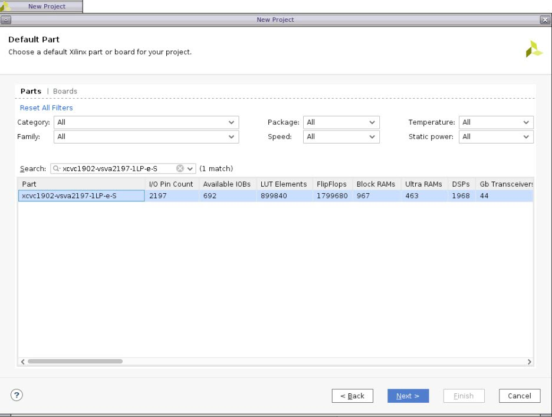
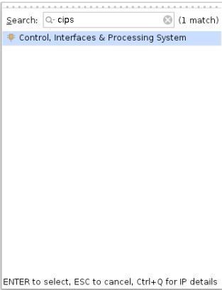
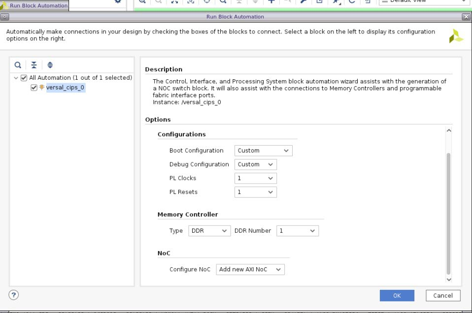
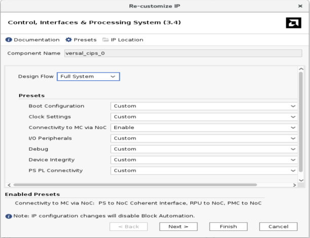
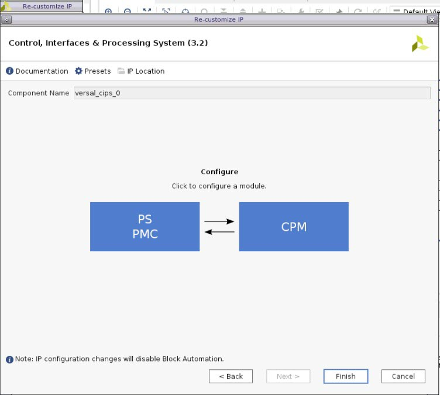
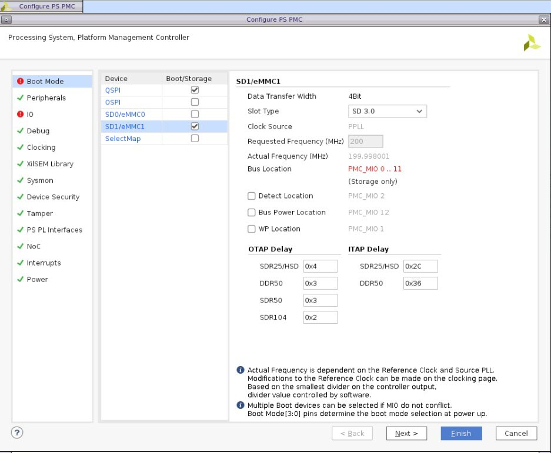
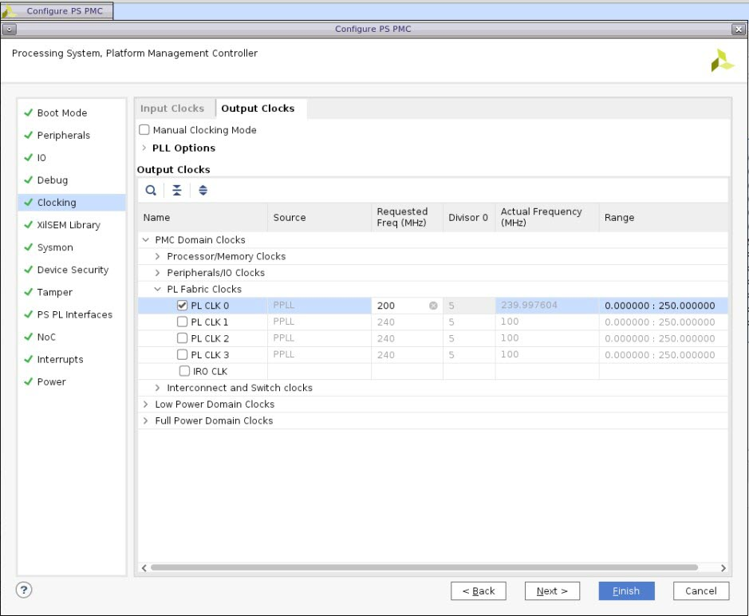
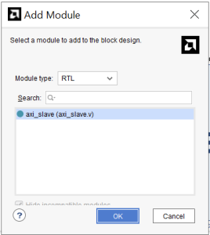
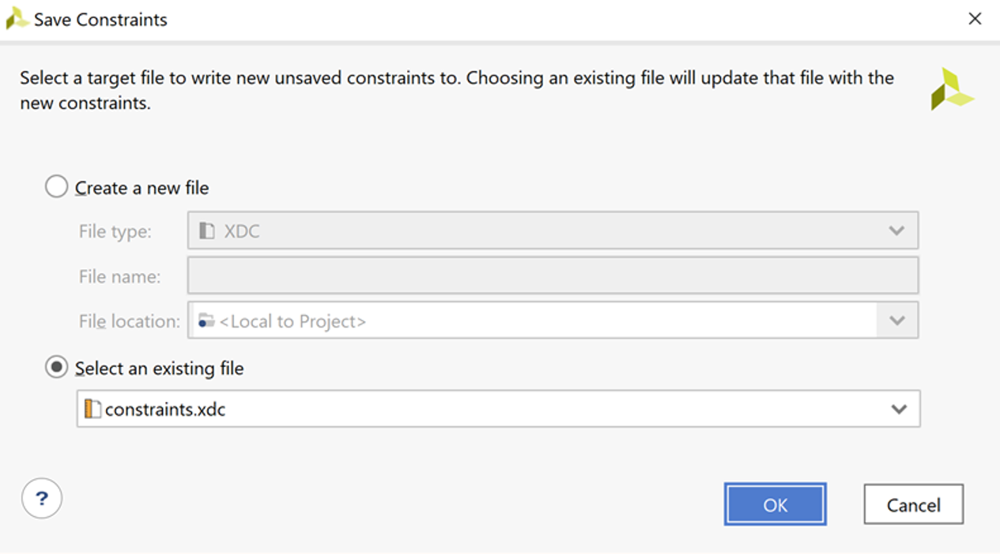

# Contents

<<<<<<< Updated upstream
   **Basic Versal Design using Vivado IP Integrator**

   **Introduction** 

   **Step 1: Project Creation**

   **Step 2: Initial CIPS, NoC & DDR-MC Instantiation with Block Automation**

   **Step 3: CIPS CUSTOMIZATION**

   **Step 4: Referencing RTL Modules**

   **Step 5: Adding RTL as Packaged IP**

   **Step 6: Design Validation**

   **Step 7: Generate HDL Wrapper, Constraints, Synthesis**

   **Step 8: Advanced I/O Planner**

   **Step 9: Implementation, Generating Device Image**
=======
Basic AMD Versal™ Design using the AMD Vivado™ IP Integrator

Introduction

Step 1: Project Creation

Step 2: Initial CIPS, NoC & DDR-MC Instantiation with Block

Step 3: CIPS CUSTOMIZATION

Step 4: Referencing RTL Modules

Step 5: Adding RTL as Packaged IP

Step 6: Design Validation

Step 7: Generate HDL Wrapper, Constraints, Synthesis

Step 8: Advanced I/O Planner

Step 9: Implementation, Generating Device Image
>>>>>>> Stashed changes

# **Basic Versal Design using Vivado IP Integrator**

## **Introduction**

<<<<<<< Updated upstream
When using an AMD Versal™ device, the IP Integrator creates a Block Design
=======
When using an Versal device, the IP Integrator creates a Block Design
>>>>>>> Stashed changes
(BD) that contains a CIPS block (Control, Interfaces & Processing
System) and the NoC (Network-On-Chip) with DDR-MC (DDR Memory
Controller).

<<<<<<< Updated upstream
An AXI-based RTL module is imported using IPI Module Reference to
=======
An AXI-based RTL module will be imported using IPI Module Reference to
>>>>>>> Stashed changes
demonstrate how users can quickly add their own RTL to a block design. A
second RTL based IP that is packaged as an IP repository is also
added to the Block Design.

<<<<<<< Updated upstream
The IPI Design uses Block and Connection Automation to assist in the
creation of interconnections. Once the design is validated and the RTL
wrapper is created, initial constraints are then added before running
RTL synthesis. After synthesis is complete, the “Advanced I/O Planner” is
=======
The IPI Design utilizes Block and Connection Automation to assist in the
creation of interconnections. Once the design is validated and the RTL
wrapper is created, initial constraints are then added before running
RTL synthesis. After synthesis is complete, the “Advanced IO Planner” is
>>>>>>> Stashed changes
used to constrain the DDR-MC pinout prior to running implementation and
finally generating the device image.

Highlighted steps include:

<<<<<<< Updated upstream
- AMD Vivado™ Project Creation
=======
- Vivado Project Creation
>>>>>>> Stashed changes

- CIPS Instantiation and Configuration

- NoC and DDR-MC Creation using Block Automation

- RTL IP by Module Reference and connectivity with Connection Automation

- RTL IP using IP repository

- Final Validation

- RTL Wrapper Generation

- Initial Constraints

- Synthesis

<<<<<<< Updated upstream
- Advanced I/O Planner constraints
=======
- Advanced IO Planner constraints
>>>>>>> Stashed changes

- Implementation

- Generate Device Image

## **Step 1: Project Creation**

1.  Unzip the tutorial .zip file. It should create the following
    sub-directories in a working area:

<<<<<<< Updated upstream
    > **Note:** If using Windows, unzip to C:/ to avoid the 256-character
    > directory limit

    

2.  Invoke AMD Vivado™ 2023.1 IDE GUI.
=======
    > **Note:** If using Windows, unzip to C:/ to avoid the 256-character directory limit

     

2.  Invoke Vivado 2023.2 IDE GUI.
>>>>>>> Stashed changes

3.  In the GUI go to **Quick Start** and select “Create Project”. Keep
    the default project name “project_1”. Set the project location to a
    working directory for the project. The “project_1” directory should
    be created at the same directory level as the files shown in step 1.

4.  Click through the following menus accepting default settings which
    should be:

<<<<<<< Updated upstream
    - Project Type: RTL Project 

    - Add Sources: (leave blank)

    - Add Constraints: (leave blank)

5.  In the “Default Part” menu, select the following Versal AI device:

    - xcvc1902-vsva2197-1LP-e-S

    - Click “Next”  
    
    
=======
- Project Type: RTL Project

- Add Sources: (leave blank)

- Add Constraints: (leave blank)

5.  In the “Default Part” menu, select the following Versal AI device:

- xcvc1902-vsva2197-1LP-e-S

- Click “Next”  
    
  
>>>>>>> Stashed changes

6.  On the next menu, review the “New Project Summary”. If everything
    looks correct, click “Finish”

<<<<<<< Updated upstream
    

## **Step 2: Initial CIPS, NoC & DDR-MC Instantiation with Block Automation**

The CIPS block is instantiated on the Block Design IPI canvas and
with the use of IPI “Block Automation”, the NoC and DDR-MC modules are initially configured and instantiated on the IPI Canvas. Further customization is performed after this initial setup.
=======
    

## **Step 2: Initial CIPS, NoC & DDR-MC Instantiation with Block Automation**

The CIPS block will be instantiated on the Block Design IPI canvas and
with the use of IPI “Block Automation”, the NoC and DDR-MC modules will
be initially configured and instantiated on the IPI Canvas. Further
customization will be performed after this initial setup.
>>>>>>> Stashed changes

1.  To create a Block Design, click the following in the Flow Navigator
    pane:

    “Project Manager \> IP INTEGRATOR \> Create Block Design”

    Accept the defaults on the pop-up window and click “OK”

<<<<<<< Updated upstream
2.  Right-click in the IPI Canvas and select “Add IP…” and search for
    “**cips**”. Double-click on “**Control, Interfaces & Processing
    System**” to select and instantiate the CIPS on the IPI Canvas. The
    AMD Versal™ CIPS module should now appear on the IPI Canvas.

    

    
=======
2.  Right click in the IPI Canvas and select “Add IP…” and search for
    “**cips**”. Double Click on “**Control, Interfaces & Processing
    System**” to select and instantiate the CIPS on the IPI Canvas. The
    Versal CIPS module should now appear on the IPI Canvas.

    
>>>>>>> Stashed changes

3.  Click on “Run Block Automation” to bring up the block automation
    menu which allows a user to select configurations of other related
    blocks. Select a single DDR4 Memory controller and additionally, a
    single PL reset and PL clock. This reset and clock will be used
    later by an RTL module. Under **Options,** change the following
    settings below, and leave the rest to default.

<<<<<<< Updated upstream
    - Set **PL Clocks** to 1

    - Set **PL Resets** to 1

    - Set **Memory Controller (DDR4)** to 1

    
=======
- Set **PL Clocks** to 1

- Set **PL Resets** to 1

     

- Set **Memory Controller (DDR4)** to 1

    
>>>>>>> Stashed changes

4.  Once the “Block Automation” process is complete, the AXI NoC will
    now appear on the IPI Canvas configured for DDR4 (the DDR-MC is part
    of the NoC instance) with an external port named “CH0_DDR_0_0” and
    connections to the CIPS via multiple AXI ports along with associated
    AXI clock ports with an external clock port named “sys_clk0_0”:  
      
    

## **Step 3: CIPS CUSTOMIZATION** 

Next, the CIPS will be customized for QSPI and SD Card Boot Modes. We
will also configure the PL clock for 200 MHz.

1.  Double-click on the CIPS block to enter the configuration settings
    for the CIPS. You will see different preset options. Leave them to
    their default settings and Click **Next.**

<<<<<<< Updated upstream
    
=======
    

    Select **PS PMC (click)** to change the QSPI and other settings.  
  
    
>>>>>>> Stashed changes

    Under **Boot Mode** make the following changes-

<<<<<<< Updated upstream
    

    Under **Boot Mode** make the following changes-

    - Check **QSPI**

    - Mode: **Dual Parallel**

    - Data Mode: **x4**

    - Check **Loop Back Clock IO** and you can see that the loopback location is set as **PMC MIO 6**.

    

2.  Under **SD 1 / eMCC** **1** select the following:

    - Check “SD1”

    <!-- -->

    - Check **Slot Type** as **SD 3.0**.

    > **Note:** The default pin location for SD1 is set to **PMC MIO 0 ..11** and
    turns red because it is not available for selection. This is due to some
    of the pins within the available pin-set getting blocked from use since
    they were consumed by the prior configured QSPI interface. This can be
    changed from under the **IO** tab. Select PMC_MI0 26.. 36 instead of
    **PMC MIO 0 ..11** and the error is eliminated for this tutorial.

    

3.  The PL fabric clock needs to be configured for 200 MHz. Under
    Clocking \> Output Clocks \> PMC Domain Clocks \> PL Fabric Clocks
    select:

- Check “PL_CLK_0” and set to “200” for 200 MHz (Window columns may have
  to be moved to view full naming)

    > **Note:** The “Actual Frequency (MHz)” differs slightly from the
     “Requested Frequency (MHz)”. This is due to the accuracy of the PLL
    that derives this clock for the 33.333 MHz input clock. The input
    clock is not shown as a port in the BD diagram since it is a dedicated
    input. It can be observed and changed however in the tab
    “Configuration Options\> PS-PMC \> Input Clocks \> REF_CLK”.

    - Click “Finish” to finalize the configuration of the CIPS module.

    

## **Step 4: Referencing RTL Modules**

The Module Reference feature of the AMD Vivado™ IP integrator lets you
=======
- Check **QSPI**

- Mode: **Dual Parallel**

- Data Mode: **x4**

- Check **Loop Back Clock IO** and you can see that the loopback
  location is set as **PMC MIO 6**.

    

2.  Under **SD 1 / eMCC** **1** select the following:

- Check “SD1”
- Check **Slot Type** as **SD 3.0**.

    >**Note:** The default pin location for SD1 is set to **PMC MIO 0 ..11** and
turns red because it is not available for selection. This is due to some
of the pins within the available pin-set getting blocked from use since
they were consumed by the prior configured QSPI interface. This can be
changed from under the **IO** tab. Select PMC_MI0 26.. 36 instead of
**PMC MIO 0 ..11** and the error will be eliminated for this tutorial.

    

3.  The PL fabric clock needs to be configured for 200 MHz. Under Clocking \> Output Clocks \> PMC Domain Clocks \> PL Fabric Clocks select:

- Check “PL_CLK_0” and set to “200” for 200 MHz (Window columns may have
  to be moved to view full naming)

    > **Note:** The “Actual Frequency (MHz)” differs slightly from the
    > “Requested Frequency (MHz)”. This is due to the accuracy of the PLL
    > that derives this clock for the 33.333 MHz input clock. The input
    > clock is not shown as a port in the BD diagram since it is a dedicated
    > input. It can be observed and changed however in the tab
    > “Configuration Options\> PS-PMC \> Input Clocks \> REF_CLK”.

- Click “Finish” to finalize the configuration of the CIPS module.

    

## **Step 4: Referencing RTL Modules**

The Module Reference feature of the Vivado® IP integrator lets you
>>>>>>> Stashed changes
quickly add a module or entity definition from a Verilog or VHDL source
file directly into your block design. While this feature does have
limitations, it provides a means of quickly adding RTL modules without
having to go through the process of packaging the RTL as an IP to be
added through the Vivado IP catalog.

Both flows have their benefits and costs:

• The Package IP flow is rigorous and time consuming, but it offers a
well-defined IP that can managed through the IP catalog, used in
multiple designs, and upgraded as new revisions become available.

• The Module Reference flow is quick, but does not offer the benefits of
working through the IP catalog.

<<<<<<< Updated upstream
**<u>Adding a RTL Module by Module Reference</u>  
**To add HDL to the block design, first you must add the RTL source file
=======
### Adding a RTL Module by Module Reference  
 
To add HDL to the block design, first you must add the RTL source file
>>>>>>> Stashed changes
to the Vivado project. A PL AXI Slave module called “axi_slave” will now
be added to the IPI canvas.

1.  Add the RTL source “axi_slave.v” provided with the tutorial to the
    project:

    - “File \> Add Sources… \> Add or create design sources”

<<<<<<< Updated upstream
    - “Next” then “Add Files”   
=======
    - “Next” then “Add Files”
>>>>>>> Stashed changes

2.  Navigate to the provided tutorial directory and in the “/rtl”
    directory select “axi_slave.v” and then click “OK” then “Finish”

3.  The “axi_slave.v” file should now appear in the “Sources” pane under
    “Design Sources”. There are a few ways to add the RTL module onto
<<<<<<< Updated upstream
    the IPI canvas.

<!-- -->

1.  You can click and drag the file onto the IPI Canvas.

    

2.  By selecting the module in the Sources window and using the Add
    Module to Block Design command from the context menu, shown in the
    following figure.

    

3.  Using the Add Module command from the right-click menu of the design
    canvas, as shown in the following figure.

    
=======
    the IPI canvas:

    -  You can click and drag the file onto the IPI Canvas.

         

    -  By selecting the module in the Sources window and using the Add
    Module to Block Design command from the context menu, shown in the
    following figure.

         

    -  Using the Add Module command from the right-click menu of the design
    canvas, as shown in the following figure.

       

     The Add Module dialog box displays a list of all valid modules defined in the RTL source files that you have added to the project. For this  tutorial, we have only added the axi_slave module. Select the module to add from the list, and click **OK** to add it to the block design, shown in the following figure.
>>>>>>> Stashed changes

     

<<<<<<< Updated upstream
    

4.  The IPI instantiated RTL Module should appear as follows on the IPI
    Canvas:

    

5.  Run “Connection Automation” to connect the AXI port of this module
    to the NoC:

    - Click “Run Connection Automation” on the top of the IPI Canvas

    - Verify that “All Automation” is “checked”

    - Set “Options \> Master Interface” to “/versal_cips_0/FPD_CCI_NOC_0” to
    connect to the CIPS via the NoC

    - Click “OK”

    

6.  At this point, the RTL module should now be connected to the NoC via
=======
      The IPI instantiated RTL Module should appear as follows on the IPI
    Canvas:

       

4.  Run “Connection Automation” to connect the AXI port of this module
    to the NoC:

- Click “Run Connection Automation” on the top of the IPI Canvas

- Verify that “All Automation” is “checked”

- Set “Options \> Master Interface” to “/versal_cips_0/FPD_CCI_NOC_0” to
  connect to the CIPS via the NoC

- Click “OK”

    

7.  At this point, the RTL module should now be connected to the NoC via
>>>>>>> Stashed changes
    AXI and the clock port connected to the CIPS PL clock that was
    configured earlier. However, the reset on the RTL module is now
    connected to a “**Processor System Reset**” module. The input side
    of the **Processor System Reset** needs to be connected properly to
    complete proper connectivity of the reset circuit. Run “**Connection
    Automation**” to connect this input to the previously configured
    CIPS PL reset output.

<<<<<<< Updated upstream
    - Click “Run Connection Automation” at the top of the IPI Canvas.

    - Under “Options \> Select Reset Source” select “/versal_cips_0/pl0_resetn”.

    

    - Click “OK”.

7.  Right-click on the IPI Canvas and select **Regenerate Layout**. The
    Block Diagram should now appear similar to the following diagram.

    

=======
- Click “Run Connection Automation” at the top of the IPI Canvas.

- Under “Options \> Select Reset Source” select
  “/versal_cips_0/pl0_resetn”.

     

- Click “OK”.

8.  Right click on the IPI Canvas and select **Regenerate Layout**. The
    Block Diagram should now appear similar-to the following diagram:

    

>>>>>>> Stashed changes
## **Step 5: Adding RTL as Packaged IP** 

In this section of the tutorial, a non-AXI RTL IP called “wave_gen_v1_0”
that has previously been packaged with IP Packager will be added to the
IPI Canvas with independent external IO connectivity (no connection to
CIPS or the NoC). This packaged IP is provided with the tutorial files
under the sub-directory “/custom_ip_repo”. Further information on the
packaging flow for this IP can be found in ***UG1119 Lab 4***.

1.  The IP Repository for the “wave_gen_v1_0” IP must first be added to
    IP Catalog. First open IP Catalog (IPC):

<<<<<<< Updated upstream
    - Select “Flow Navigator \> Project Manager \> IP Catalog”

    - Right-click in IP Catalog pane and select “Add Repository…”

        

    - Navigate to /custom_ip_repo/wave_gen_v1_0” and click “Select” then
    click “OK”. The added IP should now appear under “User Repository” in
    IPC:

        

2.  Now that the IP Repo has been added to IP Catalog, the IP can be
    instantiated on the IPI Canvas. In the Block Design “Diagram” tab,
    right-click on the IPI Canvas and select “Add IP”.
=======
- Select “Flow Navigator \> Project Manager \> IP Catalog”

- Right Click in IP Catalog pane and select “Add Repository…”

     

- Navigate to /custom_ip_repo/wave_gen_v1_0” and click “Select” then
  click “OK”. The added IP should now appear under “User Repository” in
  IPC:

    

2.  Now that the IP Repo has been added to IP Catalog, the IP can be
    instantiated on the IPI Canvas. In the Block Design “Diagram” tab,
    right click on the IPI Canvas and select “Add IP”.
>>>>>>> Stashed changes

3.  In the Search window type “wave” and select “wave_gen_v1_0”. This IP
    should now appear on the IPI Canvas:

<<<<<<< Updated upstream
    
=======
    
>>>>>>> Stashed changes

4.  Next, the IO for this module will be made external to the Block
    Design. Right-click on the module and select **Make External**.

5.  Finally, regenerate the IPI layout. Right click on the IPI Canvas
<<<<<<< Updated upstream
    and select **Regenerate Layout**.

    
=======
    and select **Regenerate Layout.**

    
>>>>>>> Stashed changes

## **Step 6: Design Validation**

1.  On the “Diagram” tab, validate the design to ensure there are no DRC
    violations. By right clicking on the IPI Canvas and selecting
    “Validate Design” and click “OK” once this is completed.

2.  Save the IPI Block Design by clicking on **File --\> Save Block
<<<<<<< Updated upstream
    Design**.
=======
    Design.**
>>>>>>> Stashed changes

3.  During the “Validate Design” process, the NoC Compiler is run. A new
    “NoC” tab appears that shows a preliminary physical
    representation of the NoC resources used and their locations. These
    resources can be clicked on to get NoC Site Properties information.
    These locations are preliminary since Vivado can move these sites
    when the NoC Compiler is run during the placer implementation stage.

    

<<<<<<< Updated upstream
4.  Also note a “NoC QoS” tab appears that will detail NoC Traffic
    Class and required and estimated Bandwidth and Latency:

    

## **Step 7: Generate HDL Wrapper, Constraints, Synthesis**

In this section, an HDL wrapper is generated for the IPI Block
Design, constraints is then added to the project and the design is
synthesized. After it is synthesized, the Advanced I/O Planner can be
=======
     >**Note:** Also note a “NoC QoS” tab will appear that will detail NoC Traffic
    Class and required and estimated Bandwidth and Latency:

    

## **Step 7: Generate HDL Wrapper, Constraints, Synthesis**

In this section, an HDL wrapper will be generated for the IPI Block
Design, constraints will then be added to the project and the design
synthesized. After it is synthesized, the Advanced IO Planner can be
>>>>>>> Stashed changes
invoked to assign pins for the DDR-MC.

1.  In the “Sources” tab, right-click on the Block Design “design_1” and
    select “Create HDL Wrapper”. When the window pops up, keep the
    default and select “OK”.

2.  Add the constraints file “constraints.xdc” that was provided with
    the tutorial to the project. This file contains initial clock and I/O
    constraints for the PL logic. Later, additional DDR4 pin-out
    constraints is defined and appended to this file.

<<<<<<< Updated upstream
    - Select “Flow Navigator \> Project Manager \> Add Sources”

    - Next select “Add or Create Constraints” then click on “Next”  

    - Click on “Add Files” and navigate to the “/constraints/constraints.xdc” file provided with this tutorial.

    - Click on “Copy constraints files into project” and click on “Finish”

3.  Next, Synthesize the design.

    - In the “Flow Navigator” pane, click on “Synthesis \> Run Synthesis”
    and accept the default settings and click on “OK” to invoke synthesis
    or alternatively, click on the “Design Runs” tab and right click on
    “synth_1” and click “Launch Runs” and then “OK”.

    - The generation of IP output products and synthesis process can take ~1
    hour to complete.
=======
- Select “Flow Navigator \> Project Manager \> Add Sources”.

- Next select “Add or Create Constraints” then click on “Next”.

- Click on “Add Files” and navigate to the
  “/constraints/constraints.xdc” file provided with this tutorial.

- Click on “Copy constraints files into project” and click on “Finish”.

3.  Next, Synthesize the design.

- In the “Flow Navigator” pane, click on “Synthesis \> Run Synthesis”
  and accept the default settings and click on “OK” to invoke synthesis
  or alternatively, click on the “Design Runs” tab and right click on
  “synth_1” and click “Launch Runs” and then “OK”.

- The generation of IP output products and synthesis process can take ~1
  hour to complete.
>>>>>>> Stashed changes

## **Step 8: Advanced I/O Planner**

In this section, the “Advanced I/O Planner” will be used to assign a
pin-out for the DDR-MC.

1.  When the “Synthesis Completed” pop-up window appears, click on “Open
    Synthesized Design” and then click on “OK” open the Synthesized
    design in Vivado.

2.  The Vivado layout view should be changed from “Default Layout” to
    “I/O Planning”. There is a pull-down menu for the layout view in the
    top right of Vivado as shown circled in red below:

    

3.  In the **I/O Ports** tab, click on **Open Advanced I/O Planner**.

<<<<<<< Updated upstream
    
=======
     
>>>>>>> Stashed changes

4.  When the **Advanced I/O Planner** window pops up, click on the
    3-dots in the **IO Bank** column. Then check the box next to
    **DDRMC_X0Y0** to specifically select the DDR-MC location at X0Y0.
    This will automatically select the IO Triplet Banks of 700, 701, 702
    and the pins for these banks. Select **OK** to exit the **Advanced
    I/O Planner.**

<<<<<<< Updated upstream
    

    
=======
    

    
>>>>>>> Stashed changes

5.  Save the new generated pin constraints to target constraints file
    “constraints.xdc”.

<<<<<<< Updated upstream
    - Select “File \> Constraints \> Save”

    - Verify “Select an existing file” selected and “constraints.xdc” is
    selected and then click on “OK”.

    - You will get a notification for an out-of-date design because the new
    constraints have been saved. This means that synthesis will have to be
    run again. Click OK.

    

     

    - The **constraints.xdc** file can be opened to verify that the
    constraints were generated and saved properly. Pinouts for ports
    beginning with the name “ddr4…” can be observed constrained to package
    pins as shown in this constraints file excerpt:

    
=======
- Select “File \> Constraints \> Save”

- Verify “Select an existing file” selected and “constraints.xdc” is
  selected and then click on “OK”.

- You will get a notification for an out-of-date design because the new
  constraints have been saved. This means that synthesis will have to be
  run again. Click OK.

    

    

- The **constraints.xdc** file can be opened to verify that the
  constraints were generated and saved properly. Pinouts for ports
  beginning with the name “ddr4…” can be observed constrained to package
  pins as shown in this constraints file excerpt:

    
>>>>>>> Stashed changes

## **Step 9: Implementation, Generating Device Image**

1.  In the Vivado **Flow Navigator** pane, click **Program and Debug**
    --\> **Generate Device Image** and click-through the following
    pop-up windows to generate the final implementation and device
    image.

2.  Once the device image is generated, the following pop-up window
    should appear. Click **Cancel**. This completes the tutorial.

<<<<<<< Updated upstream
    

> Note: The device image file (.pdi) is now generated and can be found
> in the project runs sub-directory called “/impl_1”.
=======
     
 
    > **Note:** The device image file (.pdi) is now generated and can be found
    > in the project runs sub-directory called “/impl_1”.
>>>>>>> Stashed changes
