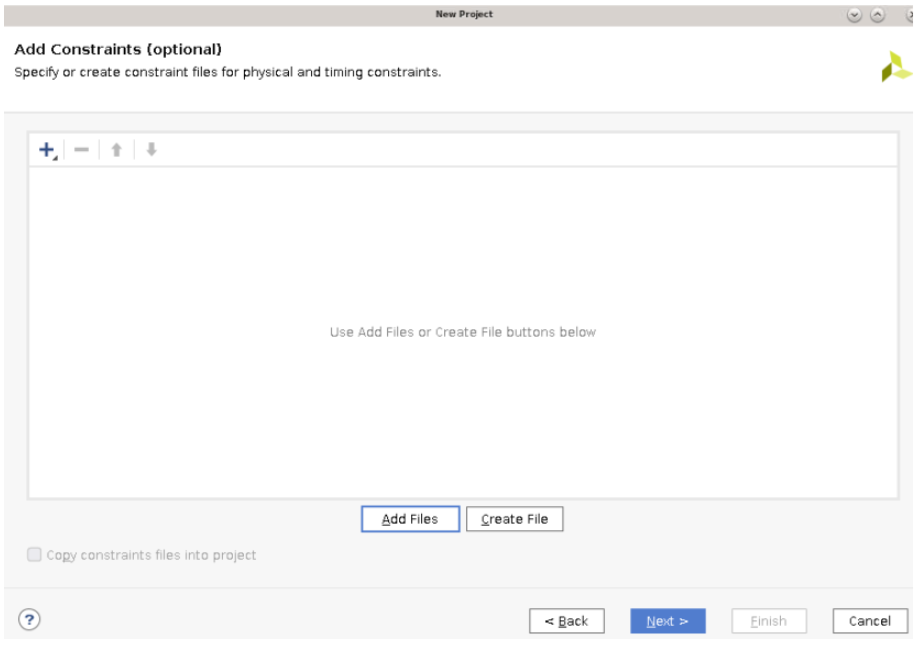
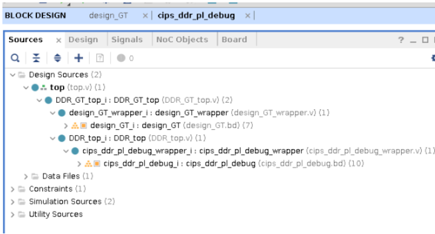
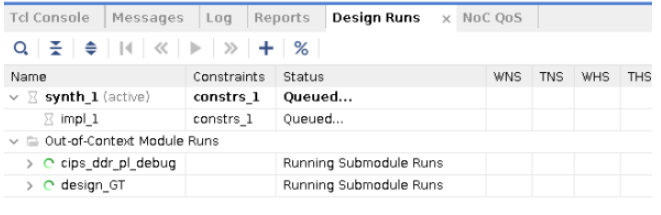
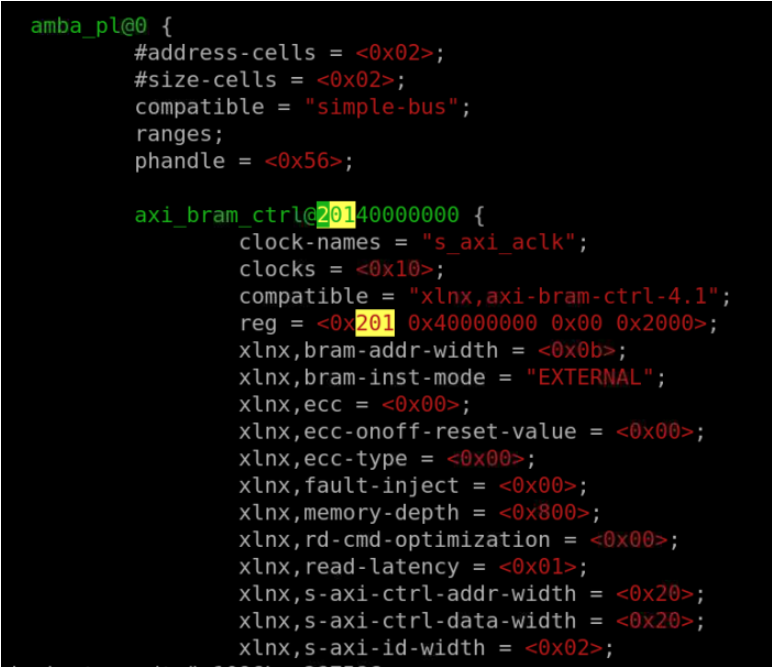

<table class="sphinxhide" width="100%">
 <tr width="100%">
    <td align="center"><h1>AMD Vivado™ Design Suite Tutorials</h1>
    <a href="https://www.xilinx.com/products/design-tools/vivado.html">See Vivado Development Environment on xilinx.com</br></a>
    </td>
 </tr>
</table>

  [Table of Contents](#table-of-contents)

- [Designing with IP Integrator Design with RTL top](#designing-with-ip-integrator-design-with-rtl-top)
  - [](#)
  - [**Step 1: Creating an IPI design with RTL as top**](#step-1-creating-an-ipi-design-with-rtl-as-top)
  - [**Step 2: Running implementation and generating xsa**](#step-2-running-implementation-and-generating-xsa)
  - [**Step 3: Exporting Hardware Platform(xsa) to PetaLinux Project**](#step-3-exporting-hardware-platformxsa-to-petalinux-project)
  - [**Step4: Analysing the device tree**](#step4-analysing-the-device-tree)
  - [**Step5: Booting PetaLinux Image on Hardware**](#step5-booting-petalinux-image-on-hardware)


# Designing with IP Integrator Design with RTL top

**Introduction**

The Xilinx® Vivado® Design Suite IP Integrator lets you create complex
system designs by

instantiating and interconnecting IP cores from the Vivado IP catalog
onto a design canvas. You can create designs interactively through the
IP Integrator design canvas GUI, or programmatically using a Tcl
programming interface.

**Tutorial Design Description**

This tutorial walks you through the steps of building an IPI design with
RTL as top. You will generate the post implementation xsa and run it on
the petalinux. While working through the tutorial you will learn how the
BD addressing of an RTL top design gets mapped to device tree generated
in the petaliux through Xilinx shell archive (xsa).

## 

## **Step 1: Creating an IPI design with RTL as top**

1.  Open the Vivado® Integrated Design Environment (IDE).

-   On Linux, change to the directory where the Vivado tutorial design
    file is stored: cd

\<Extract_Dir\>/Vivado_Tutorial. Then launch the Vivado Design Suite:
Vivado.

-   On Windows, launch the Vivado Design Suite: **Start → All Programs →
    Xilinx Design Tools→ Vivado 2021.x**.

As an alternative, click the **Vivado 2021.x** Desktop icon to start the
Vivado IDE.

The Vivado IDE Getting Started page contains links to open or create
projects and to view

documentation, as shown in the following figure:

{width="5.795248250218723in"
height="4.216418416447944in"}

***Note*:** Your Vivado Design Suite installation may be called
something different from Xilinx Design Tools

on the Start menu.

2.  Under the Quick Start section, select **Create Project**.

3.  The New Project wizard opens. Click **Next** to confirm the project
    creation.

4.  In the Project Name page, shown in the following figure, set the
    following options:

```{=html}
<!-- -->
```
a.  In the Project name field, enter Lab1 and specify a location where
    the project must be created

{width="6.268055555555556in"
height="2.8666666666666667in"}

5.  Ensure that Create project subdirectory is checked and click
    **Next.**

6.  In the Project Type page, select **RTL Project**, {width="5.552238626421698in"
    height="4.174328521434821in"}

7.  Click on **Add Files** and select the files from src_files/RTL_files
    folder

{width="6.268055555555556in"
height="3.154861111111111in"}

8.  Click **OK** and click **Next**.

{width="6.268055555555556in"
height="4.378472222222222in"}

9.  In the Add constraints box, click **Add Files** and add the top.xdc
    from the src_files/xdc folder.

10. Click next, and then you will land on the Default Part page. Click
    on the Boards tab to select the Versal VCK190 Evaluation Platform.

{width="6.268055555555556in"
height="3.9819444444444443in"}

11. Review the project summary in the New Project Summary page.

{width="6.268055555555556in" height="3.60625in"}

12. Click Finish to create the Lab1 project

13. The new project opens in the Vivado IDE.

14. Now the design looks as below, the gaps shown must be filled with
    the Block designs

{width="5.489583333333333in"
height="3.5520833333333335in"}

15. Source the GT_bd.tcl and cips_ddr_pl_bd.tcl from src_files/tcl_files
    in the TCL Console.

16. Once the BD (Block Designs) tcl files are sourced, you will see the
    hierarchy as below

{width="6.260416666666667in"
height="3.351466535433071in"}

17. Note that the design has block diagram under the 3 levels of RTL.

## **Step 2: Running implementation and generating xsa**

1.  Open the BD cips_ddr_pl_debug,the block design connects the
    processing system to the DDR memory and BRAM through NOC (Network On
    Chip). AXI Bus is probed with ILA and counter is controlled with a
    VIO core.

{width="6.268055555555556in"
height="2.8569444444444443in"}

2.  Open the Address Editor and see the slave segment BRAM is at
    0x20140000000 master CIPS base address

{width="6.268055555555556in"
height="3.067361111111111in"}

3.  Click on 'Generate Device Image' in the Flow navigator. Click Yes
    when prompted to launch Implementation and click OK to launch runs.

{width="6.268055555555556in"
height="1.5590277777777777in"}

4.  The Design Runs tab looks as shown below. Full design synthesis and
    implementation will be launched after the block design are
    synthesized in Out of context.

{width="6.135416666666667in"
height="2.2708333333333335in"}

5.  Once the device Image is generated, Export the Hardware i:e
    generates the xsa from File \> Export \> Export Hardware. The XSA
    extension stands for Xilinx Shell Archive and these files are
    generated by Vivado to contain the required hardware information.

6.  In the Output, choose 'Include device Image' and click
    Ok.{width="3.341666666666667in"
    height="1.1069269466316711in"}

## **Step 3: Exporting Hardware Platform(xsa) to PetaLinux Project**

PetaLinux tools enable developers to synchronize the software platform
with the hardware design. PetaLinux is an embedded
Linux Software Development Kit (SDK) targeting FPGA-based
system-on-a-chip (SoC) design.

This section assumes that the following prerequisites have been
satisfied:

-   Peta Linux BSP is downloaded. You can download PetaLinux [VCK190
    BSP](https://www.xilinx.com/member/forms/download/xef.html?filename=xilinx-vck190-v2022.1-04191534.bsp)
    (BSP - 2.06 GB) from [[PetaLinux
    Downloads](https://www.xilinx.com/support/download/index.html/content/xilinx/en/downloadNav/embedded-design-tools.html).]{.underline}
    For more information visit
    [Project-Creation-Using-PetaLinux-BSP](https://docs.xilinx.com/r/en-US/ug1144-petalinux-tools-reference-guide/Project-Creation-Using-PetaLinux-BSP)

-   The Peta Linux tools installation is complete. For more information,
    see[ [Installation
    Steps](https://docs.xilinx.com/r/e3GNC2xfjh_jKWGBR7Rtsw/Uj3ckTGNVF35m3PB3RlY3A)]{.underline}.

-   Peta Linux Working Environment Setup is completed. For more details,
    see [[PetaLinux Working Environment
    Setup](https://docs.xilinx.com/r/e3GNC2xfjh_jKWGBR7Rtsw/lxJsFk4CzY8pU~_dUtC5MQ).]{.underline}

1.  Create a PetaLinux project

    -   Change to the directory under which you want PetaLinux projects
        to be created. For example, if you want to create projects
        under /home/user

> **\$cd /home/user**

-   Run petalinux-create command on the command console

> **\$petalinux-create -t project -n vck190 -s \<path-to-bsp\>**

{width="10.413081802274716in"
height="1.001881014873141in"}

When the above command runs, it tells you the projects that are
extracted and installed from the BSP. If the specified location is on
the Network File System (NFS), it changes the TMPDIR
to /tmp/\<projname-timestamp-id\>; otherwise, it is set
to \$PROOT/build/tmp

> *Note: PetaLinux requires a minimum of 50 GB and a maximum of 100 GB
> /tmp space to build the project successfully when you create the
> project on NFS. Please refer to UG1144 for more details*.

2.  Importing Hardware Configuration

> This section explains the process of updating an existing PetaLinux
> project with a hardware configuration. This enables you to make the
> PetaLinux tools software platform ready for building a Linux system,
> customized to your new hardware platform

-   Change into the directory of your PetaLinux project.

> **\$cd vck190**

-   Copy the xsa generated in Step2 to the vck190 folder created in your
    location

-   Import the hardware description with petalinux-config command using
    the following step

> **\$petalinux-config \--get-hw-description=. --silentconfig**

{width="6.268055555555556in"
height="2.4229166666666666in"}

> *Note:When the petalinux-config \--get-hw-description command runs for
> the PetaLinux project, the tool detects changes in the system primary
> hardware candidates. Please refer to UG1144 for more details.*

3.  Build System Image

This step generates a device tree DTB file, PLM (for Versal® ACAP), PSM
(for Versal ACAP) and TF-A (for Zynq UltraScale+ MPSoC and Versal ACAP),
U-Boot, the Linux kernel, a root file system image, and the U-Boot boot
script (boot.scr). Finally, it generates the necessary boot images.

-   Run petalinux-build to build the system image:

> **\$petalinux-build**

{width="9.17705927384077in"
height="2.587592957130359in"}

> *Note:The compilation progress shows on the console. Wait until the
> compilation finishes.A detailed compilation log is
> in \<plnx-proj-root\>/build/build.log.When the build finishes, the
> generated images are stored in the \< plnx-proj-root
> \>/images/linux or /tftpboot directories. For more info refer to
> UG1144*

4.  Generate Boot Image for Versal ACAP

> This section is for Versal® ACAP only and describes how to generate
> boot image BOOT.BIN for vck190.A boot image usually contains a PDI
> file (imported from hardware design), PLM, PSM firmware, Arm® trusted
> firmware, U-Boot, and DTB.

-   Execute the following command to generate the boot image in .bin
    format:

> **\$petalinux-package \--boot \--u-boot --force**

{width="7.584346019247594in"
height="3.146840551181102in"}

> *Note: Specifying \--u-boot adds all the required images to boot up to
> U-Boot into BOOT.BIN. Please refer to UG1144 for details*

## **Step4: Analysing the device tree**

1.  The device tree generated(system.dtb) can be found inside
    vck190/images/linux folder.

> {width="7.584346019247594in"
> height="0.9999311023622047in"}
>
> The system.dtb is a compiled binary device tree. This will be copied
> to your image. So, now we are going to check the if the BRAM address
> 0x20140000000 (mentioned in Setp2, point2) is correctly mapped in the
> device tree. For this the dtb file must be converted to dts.

2.  We will be using dtc -- device tree compiler which takes an input a
    device-tree in a given format and output in another format. In the
    below command dtc takes the system.dtb(binary format) and outputs
    dts (human readable source format)

> {width="5.0in" height="0.4166666666666667in"}
>
> {width="4.479166666666667in" height="0.375in"}

3.  In the device tree you can see axi_bram_ctrl is assigned at
    0x20140000000. So, ideally this address should be same as the BRAM
    base address in the design IPI address editor (refer to Setp2,
    point2)

> {width="5.0in" height="4.3125in"}
>
> Open the design and observe the axi_bram_ctl Master base address.
>
> {width="6.886456692913386in"
> height="3.3699846894138235in"}

## **Step5: Booting PetaLinux Image on Hardware** 

This section describes how to boot a PetaLinux image on hardware with an
SD Card.

1.  This section assumes that a serial communication program such as
    minicom/kermit/gtkterm has been installed; the baud rate of the
    serial communication program has been set to 115200 bps.

2.  Copy the following files from /linux/images/ into the root directory
    of the first partition, which is in FAT32 format in the SD card:

    a.  BOOT.BIN

    b.  image.ub

    c.  boot.scr

3.  Extract the rootfs.tar.gz folder into the ext4 partition of the SD
    card.

4.  Connect the serial port on the board to your workstation.

5.  Open a console on the workstation and start the preferred serial
    communication program (For example: kermit, minicom, gtkterm) with
    the baud rate set to 115200 on that console.

6.  Power off the board.

7.  Set the boot mode of the board to SD boot. Refer to the board
    documentation for details.

8.  Plug the SD card into the board.

9.  Power on the board.

10. A boot message displays on the serial console.

11. Once the image is booted, use devmem to verify the memory contents.

12. Use devmem again to verify the write was successful.

Refer to below link for more detail\'s other methods of booting:

[Boot-a-PetaLinux-Image-on-Hardware-with-SD-Card]{.underline}

[Boot-a-PetaLinux-Image-on-Hardware-with-TFTP]{.underline}

[Boot-a-PetaLinux-Image-on-Hardware-with-JTAG]{.underline}


 
<p class="sphinxhide" align="center"><sub>Copyright © 2020–2023 Advanced Micro Devices, Inc</sub></p>

<p class="sphinxhide" align="center"><sup><a href="https://www.amd.com/en/corporate/copyright">Terms and Conditions</a></sup></p>
