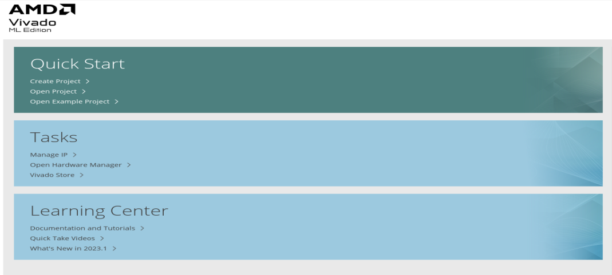
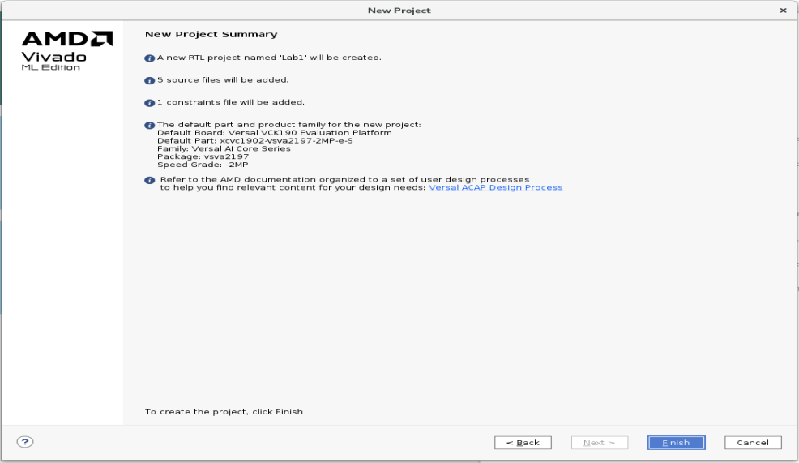

# Contents

<<<<<<< Updated upstream
 Designing with IP Integrator Design with RTL top

 Introduction

 Tutorial Design Description

 Step 1: Creating an IPI design with RTL as top

 Step 2: Running implementation and generating xsa

 Step 3: Exporting Hardware Platform(xsa) to PetaLinux Project

 Step 4: Analysing the device tree

 Step 5: Booting PetaLinux Image on Hardware
=======
Designing with IP Integrator Design with RTL top

Introduction

Tutorial Design Description

Step 1: Creating an IPI design with RTL as top

Step 2: Running implementation and generating xsa

Step 3: Exporting Hardware Platform(xsa) to PetaLinux Project

Step 4: Analysing the device tree

Step 5: Booting PetaLinux Image on Hardware
>>>>>>> Stashed changes

# Designing with IP Integrator Design with RTL top

## Introduction

The AMD Vivado™ Design Suite IP Integrator lets you create complex
system designs by instantiating and interconnecting IP cores from the
Vivado IP catalog onto a design canvas. You can create designs
interactively through the IP Integrator design canvas GUI, or
programmatically using a Tcl programming interface.

## Tutorial Design Description

This tutorial walks you through the steps of building an IPI design with
RTL as top. You will generate the post implementation xsa and run it on
the PetaLinux. While working through the tutorial you will learn how the
BD addressing of an RTL top design gets mapped to device tree generated
in the PetaLinux through Xilinx shell archive (xsa).

## Step 1: Creating an IPI design with RTL as top

<<<<<<< Updated upstream
1.  Open the AMD Vivado™ Integrated Design Environment (IDE).
=======
1.  Open the Vivado Integrated Design Environment (IDE).
>>>>>>> Stashed changes

- On Linux, change to the directory where the Vivado tutorial design
  file is stored: cd

<<<<<<< Updated upstream
    \<Extract_Dir\>/Vivado_Tutorial. Then launch the Vivado Design Suite:
Vivado.

- On Windows, launch the Vivado Design Suite: **Start → All Programs →
  Xilinx Design Tools→ Vivado 2023.1**.

    As an alternative, click the **Vivado 2023.1** Desktop icon to start the
    Vivado IDE. The Vivado IDE Getting Started page contains links to open or create
    projects and to view documentation, as shown in the following figure:

    

    ***Note*:** Your Vivado Design Suite installation may be called
    something different from Xilinx Design Tools on the Start menu.
=======
    \<Extract_Dir\>/Vivado_Tutorial. Then launch the Vivado Design Suite: Vivado.

- On Windows, launch the Vivado Design Suite: **Start → All Programs →
  AMD Design Tools→ Vivado 2023.2**.

    As an alternative, click the **Vivado 2023.2** Desktop icon to start the
    Vivado IDE. The Vivado IDE Getting Started page contains links to open or create
    projects and to view documentation, as shown in the following figure:

    

    >**Note:** Your Vivado Design Suite installation may be called something different from AMD Design Tools on the Start menu.
>>>>>>> Stashed changes

2.  Under the Quick Start section, select **Create Project**.

3.  The New Project wizard opens. Click **Next** to confirm the project
    creation.

4.  In the Project Name page, shown in the following figure, set the
    following options:s

<<<<<<< Updated upstream
<!-- -->

1.  In the Project name field, enter Lab1 and specify a location where
    the project must be created.

=======
  - In the Project name field, enter Lab1 and specify a location where
    the project must be created.

>>>>>>> Stashed changes
    

5.  Ensure that Create project subdirectory is checked and click
    **Next.**

6.  In the Project Type page, select **RTL Project**, Graphical user
    interface, text, application, email Description automatically
    generated.

7.  Click on **Add Files** and select the files from src_files/RTL_files
    folder.

    

8.  Click **OK** and click **Next**.

    

9.  In the Add constraints box, click **Add Files** and add the top.xdc
    from the src_files/xdc folder.

10. Click next, and then you will land on the Default Part page. Click
<<<<<<< Updated upstream
    on the Boards tab to select the Versal VCK190 Evaluation Platform.

<!-- -->

11. Review the project summary in the New Project Summary page.

    

12. Click **Finish** to create the Lab1 project.
=======
    on the Boards tab to select the AMD Versal™ VCK190 Evaluation Platform.

11. Review the project summary in the New Project Summary page.

    

12. Click Finish to create the Lab1 project.
>>>>>>> Stashed changes

13. The new project opens in the Vivado IDE.

14. Now the design looks as below, the gaps shown must be filled with
    the Block designs.

    

15. Source the GT_bd.tcl and cips_ddr_pl_bd.tcl from src_files/tcl_files
    in the Tcl Console.

<<<<<<< Updated upstream
16. Once the BD (Block Designs) Tcl files are sourced, you will see the
=======
16. Once the BD (Block Designs) tcl files are sourced, you will see the
>>>>>>> Stashed changes
    hierarchy as below.

    

<<<<<<< Updated upstream
17. Note that the design has block diagram under the three levels of RTL.
=======
    > **Note:** that the design has block diagram under the 3 levels of RTL.
>>>>>>> Stashed changes

## Step 2: Running implementation and generating xsa

1.  Open the BD cips_ddr_pl_debug, the block design connects the
<<<<<<< Updated upstream
    processing system to the DDR memory and Block RAM through NOC (Network On
=======
    processing system to the DDR memory and block RAM through NOC (Network On
>>>>>>> Stashed changes
    Chip). AXI Bus is probed with ILA and counter is controlled with a
    VIO core.

    

<<<<<<< Updated upstream
2.  Open the Address Editor and see the slave segment Block RAM is at
=======
2.  Open the Address Editor and see the slave segment block RAM is at
>>>>>>> Stashed changes
    0x20140000000 master CIPS base address.

    

3.  Click on ‘Generate Device Image’ in the Flow navigator. Click Yes
    when prompted to launch Implementation and click OK to launch runs.

    

4.  The Design Runs tab looks as shown below. Full design synthesis and
    implementation will be launched after the block design are
    synthesized in Out of context.

    

5.  Once the device Image is generated, Export the Hardware i:e
    generates the xsa from File \> Export \> Export Hardware. The XSA
    extension stands for Xilinx Shell Archive and these files are
    generated by Vivado to contain the required hardware information.
    
    

6.  In the Output, choose ‘Include device Image’ and click Ok.

<<<<<<< Updated upstream
    
=======
     
>>>>>>> Stashed changes

## Step 3: Exporting Hardware Platform(xsa) to PetaLinux Project

PetaLinux tools enable developers to synchronize the software platform
with the hardware design. PetaLinux is an embedded
Linux Software Development Kit (SDK) targeting FPGA-based
system-on-a-chip (SoC) design.

This section assumes that the following prerequisites have been
satisfied:

<<<<<<< Updated upstream
- PetaLinux BSP is downloaded. You can download PetaLinux  VCK190
  BSP (https://www.xilinx.com/member/forms/download/xef.html?filename=xilinx-vck190-v2022.1-04191534.bsp)
  (BSP - 2.06 GB) from <u> PetaLinux
  Downloads (https://www.xilinx.com/support/download/index.html/content/xilinx/en/downloadNav/embedded-design-tools.html).</u>
  For more information visit
   Project-Creation-Using-PetaLinux-BSP (https://docs.xilinx.com/r/en-US/ug1144-petalinux-tools-reference-guide/Project-Creation-Using-PetaLinux-BSP)

- The PetaLinux tools installation is complete. For more information,
  see<u>  Installation
  Steps (https://docs.xilinx.com/r/e3GNC2xfjh_jKWGBR7Rtsw/Uj3ckTGNVF35m3PB3RlY3A)</u>.

- PetaLinux Working Environment Setup is completed. For more details,
  see <u> PetaLinux Working Environment
  Setup (https://docs.xilinx.com/r/e3GNC2xfjh_jKWGBR7Rtsw/lxJsFk4CzY8pU~_dUtC5MQ).</u>
=======
- Peta Linux BSP is downloaded. You can download PetaLinux [VCK190
  BSP](https://www.xilinx.com/member/forms/download/xef.html?filename=xilinx-vck190-v2022.1-04191534.bsp)
  (BSP - 2.06 GB) from <u>[PetaLinux
  Downloads](https://www.xilinx.com/support/download/index.html/content/xilinx/en/downloadNav/embedded-design-tools.html).</u>
  For more information visit
  [Project-Creation-Using-PetaLinux-BSP](https://docs.xilinx.com/r/en-US/ug1144-petalinux-tools-reference-guide/Project-Creation-Using-PetaLinux-BSP)

- The Peta Linux tools installation is complete. For more information,
  see<u> [Installation
  Steps](https://docs.xilinx.com/r/e3GNC2xfjh_jKWGBR7Rtsw/Uj3ckTGNVF35m3PB3RlY3A)</u>.

- Peta Linux Working Environment Setup is completed. For more details,
  see <u>[PetaLinux Working Environment
  Setup](https://docs.xilinx.com/r/e3GNC2xfjh_jKWGBR7Rtsw/lxJsFk4CzY8pU~_dUtC5MQ).</u>
>>>>>>> Stashed changes

1.  Create a PetaLinux project

    - Change to the directory under which you want PetaLinux projects to
      be created. For example, if you want to create projects
      under /home/user

<<<<<<< Updated upstream
        **\$cd /home/user**

        - Run petalinux-create command on the command console

        **\$petalinux-create -t project -n vck190 -s \<path-to-bsp\>**

        When the above command runs, it tells you the projects that are
        extracted and installed from the BSP. If the specified location is on
        the Network File System (NFS), it changes the TMPDIR
        to /tmp/\<projname-timestamp-id\>; otherwise, it is set
        to \$PROOT/build/tmp

        >**Note**: PetaLinux requires a minimum of 50 GB and a maximum of 100 GB
        /tmp space to build the project successfully when you create the
        project on NFS. Please refer to UG1144 for more details.

2.  Importing Hardware Configuration

    This section explains the process of updating an existing PetaLinux
    project with a hardware configuration. This enables you to make the
    PetaLinux tools software platform ready for building a Linux system,
    customized to your new hardware platform

    - Change into the directory of your PetaLinux project.

         **\$cd vck190**

    - Copy the xsa generated in Step2 to the vck190 folder created in your
    location

    - Import the hardware description with petalinux-config command using
    the following step

        **\$petalinux-config --get-hw-description=. –silentconfig**

        

    > **Note:** When the petalinux-config --get-hw-description command runs for
    the PetaLinux project, the tool detects changes in the system primary hardware candidates. Please refer to UG1144 for more details.

3.  Build System Image

    This step generates a device tree DTB file, PLM (for AMD Versal™ Adaptive SoC), PSM
    (for Versal Adaptive SoC) and TF-A (for AMD Zynq™ UltraScale+™ MPSoC and Versal Adaptive SoC),
    U-Boot, the Linux kernel, a root file system image, and the U-Boot boot
    script (boot.scr). Finally, it generates the necessary boot images.

    - Run petalinux-build to build the system image:

    **\$petalinux-build**

    > **Note:** The compilation progress shows on the console. Wait until the
    compilation finishes.A detailed compilation log is
    in \<plnx-proj-root\>/build/build.log.When the build finishes, the
    generated images are stored in the \< plnx-proj-root
    \>/images/linux or /tftpboot directories. For more info refer to
    UG1144.

4.  Generate Boot Image for Versal Adaptive SoC

    This section is for Versal Adaptive SoC only and desribes how to generate
=======
     **\$cd /home/user**

    - Run petalinux-create command on the command console

     **\$petalinux-create -t project -n vck190 -s \<path-to-bsp\>**

    When the above command runs, it tells you the projects that are extracted and installed from the BSP. If the specified location is on the Network File System (NFS), it changes the TMPDIR to /tmp/\<projname-timestamp-id\>; otherwise, it is set to \$PROOT/build/tmp

    > **Note:** PetaLinux requires a minimum of 50 GB and a maximum of 100 GB
    > /tmp space to build the project successfully when you create the
    > project on NFS. Please refer to UG1144 for more details.

2.  Importing Hardware Configuration

    This section explains the process of updating an existing PetaLinux  project with a hardware configuration. This enables you to make the  PetaLinux tools software platform ready for building a Linux system, customized to your new hardware platform.

- Change into the directory of your PetaLinux project.

     **\$cd vck190**

- Copy the xsa generated in Step2 to the vck190 folder created in your
  location

- Import the hardware description with petalinux-config command using
  the following step

     **\$petalinux-config --get-hw-description=. –silentconfig**

    

    > **Note:** When the petalinux-config --get-hw-description command runs for the PetaLinux project, the tool detects changes in the system primary hardware candidates. Please refer to [(UG1144)](https://docs.amd.com/access/sources/dita/map?isLatest=true&url=ug1144-petalinux-tools-reference-guide&ft:locale=en-US) for more details.

3.  Build System Image

    This step generates a device tree DTB file, PLM (for AMD Versal™ adaptive SoC), PSM
    (for Versal adaptive SoC) and TF-A (for AMD Zynq™ UltraScale+™ MPSoC and Versal adaptive SoC),
    U-Boot, the Linux kernel, a root file system image, and the U-Boot boot
    script (boot.scr). Finally, it generates the necessary boot images.

- Run petalinux-build to build the system image:

     **\$petalinux-build**

    >**Note:** The compilation progress shows on the console. Wait until the
 compilation finishes.A detailed compilation log is
 in \<plnx-proj-root\>/build/build.log.When the build finishes, the
 generated images are stored in the \< plnx-proj-root
 \>/images/linux or /tftpboot directories. For more info refer to
 [(UG1144)](https://docs.amd.com/access/sources/dita/map?isLatest=true&url=ug1144-petalinux-tools-reference-guide&ft:locale=en-US)

4.  Generate Boot Image for Versal adaptive SoC

     This section is for Versal adaptive SoC only and describes how to generate
>>>>>>> Stashed changes
    boot image BOOT.BIN for vck190.A boot image usually contains a PDI
    file (imported from hardware design), PLM, PSM firmware, Arm® trusted
    firmware, U-Boot, and DTB.

<<<<<<< Updated upstream
    - Execute the following command to generate the boot image in .bin
    format:

     **\$petalinux-package --boot --u-boot –force**

    > **Note:** Specifying --u-boot adds all the required images to boot up to U-Boot into BOOT.BIN. Please refer to UG1144 for details.

## Step 4: Analysing the device tree

1.  The device tree generated (system.dtb) can be found inside
    vck190/images/linux folder.

    The system.dtb is a compiled binary device tree. This will be copied
    to your image. So, now we are going to check the if the Block RAM address
    0x20140000000 (mentioned in Setp2, point2) is correctly mapped in the
    device tree. For this the dtb file must be converted to dts.

=======
- Execute the following command to generate the boot image in .bin
  format:

    **\$petalinux-package --boot --u-boot –force**

    > **Note:** Specifying --u-boot adds all the required images to boot up to U-Boot into BOOT.BIN. Please refer to [(UG1144)](https://docs.amd.com/access/sources/dita/map?isLatest=true&url=ug1144-petalinux-tools-reference-guide&ft:locale=en-US) for details.

## Step 4: Analysing the device tree

1.  The device tree generated(system.dtb) can be found inside
    vck190/images/linux folder. The system.dtb is a compiled binary device tree. This will be copied to your image. So, now we are going to check the if the block RAM address 0x20140000000 (mentioned in Step 2, point2) is correctly mapped in the device tree. For this the dtb file must be converted to dts.

>>>>>>> Stashed changes
2.  We will be using dtc – device tree compiler which takes an input a
    device-tree in a given format and output in another format. In the
    below command dtc takes the system.dtb(binary format) and outputs
    dts (human readable source format)

    
<<<<<<< Updated upstream
    
    

3.  In the device tree you can see axi_bram_ctrl is assigned at
    0x20140000000. So, ideally this address should be same as the Block RAM
    base address in the design IPI address editor (refer to Setp2,
    point2)

    

    Open the design and observe the axi_bram_ctl Master base address.
=======

    

3.  In the device tree you can see axi_bram_ctrl is assigned at
    0x20140000000. So, ideally this address should be same as the block RAM
    base address in the design IPI address editor (refer to Setp2,
    point2)

    

     Open the design and observe the axi_bram_ctl Master base address.
>>>>>>> Stashed changes

## Step 5: Booting PetaLinux Image on Hardware

This section describes how to boot a PetaLinux image on hardware with an
SD Card.

1.  This section assumes that a serial communication program such as
    minicom/kermit/gtkterm has been installed; the baud rate of the
    serial communication program has been set to 115200 bps.

2.  Copy the following files from /linux/images/ into the root directory
    of the first partition, which is in FAT32 format in the SD card:

<<<<<<< Updated upstream
    1.  BOOT.BIN

    2.  image.ub

    3.  boot.scr
=======
    -  BOOT.BIN

    -  image.ub

    -  boot.scr
>>>>>>> Stashed changes

3.  Extract the rootfs.tar.gz folder into the ext4 partition of the SD
    card.

4.  Connect the serial port on the board to your workstation.

5.  Open a console on the workstation and start the preferred serial
    communication program (For example: kermit, minicom, gtkterm) with
    the baud rate set to 115200 on that console.

6.  Power off the board.

7.  Set the boot mode of the board to SD boot. Refer to the board
    documentation for details.

8.  Plug the SD card into the board.

9.  Power on the board.

10. A boot message displays on the serial console.

11. Once the image is booted, use devmem to verify the memory contents.

12. Use devmem again to verify the write was successful.

Refer to below link for more detail's other methods of booting:

<u>Boot-a-PetaLinux-Image-on-Hardware-with-SD-Card</u>

<u>Boot-a-PetaLinux-Image-on-Hardware-with-TFTP</u>

<u>Boot-a-PetaLinux-Image-on-Hardware-with-JTAG</u>
