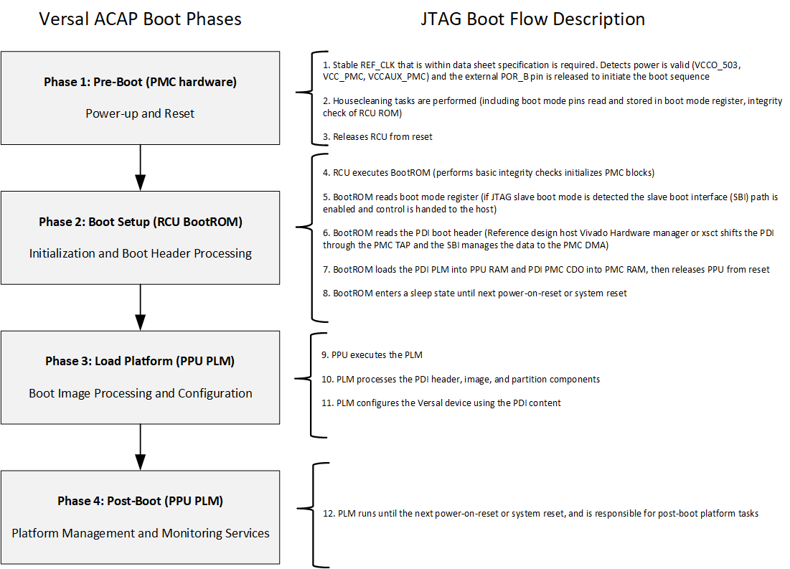

<table class="sphinxhide" width="100%">
 <tr width="100%">
    <td align="center"><h1>Versal™ Adaptive SoC Boot and Configuration Tutorials</h1>
    <a href="https://www.xilinx.com/products/design-tools/vivado.html">See Vivado™ Development Environment on xilinx.com</a>
    </td>
 </tr>
</table>

# JTAG Boot Tutorial: Before You Begin

***Version: Vivado 2021.2***

## Table of Contents

1. [Introduction](README.md)

2. Before You Begin

3. [Quick-Start Instructions](3QuickStartInstructions.md)

4. [Building Hardware Design](4BuildingHardwareDesign.md)

5. [Debug Resources](5DebugResources.md)

6. [Custom Board Bring-up Resources](6CustomBoardBringupResources.md)

7. [References](7References.md)

## Before You Begin

### Recommended General Knowledge

The general knowledge of the following is recommended:

* VCK190 evaluation board
* Versal primary boot mode
* Versal PMC/PS peripherals
* Xilinx Vivado Design Suite  

### Key Versal Reference Documents

* VCK190 Evaluation Board User Guide [(UG1366)](https://www.xilinx.com/content/dam/xilinx/support/documentation/boards_and_kits/vck190/ug1366-vck190-eval-bd.pdf)
* Versal Adaptive SoC Technical Reference Manual [(AM011)](https://www.xilinx.com/support/documentation/architecture-manuals/am011-versal-acap-trm.pdf)
* Versal Adaptive SoC System Software Developers User Guide [(UG1304)](https://www.xilinx.com/cgi-bin/docs/rdoc?v=latest;d=ug1304-versal-acap-ssdg.pdf)
* Control, Interface and Processing System LogiCORE IP Product Guide [(PG352)](https://www.xilinx.com/cgi-bin/docs/ipdoc?c=versal_cips;v=latest;d=pg352-cips.pdf)
* Versal Adaptive SoC Embedded Design Tutorial [(UG1305)](https://xilinx.github.io/Embedded-Design-Tutorials/docs/2021.2/build/html/docs/Introduction/Versal-EDT/Versal-EDT.html)

### Key Versal Terms

|Term|Description|
|  ---  |  ---  |
|Platform management controller (PMC)|Manages Versal Adaptive SoC boot and the life cycle management of the device. The PMC ROM Code Unit (RCU) and platform processing unit (PPU) are responsible for booting the device.|
|ROM code unit (RCU)| Includes a microblaze processor that executes the BootROM to initiate the boot phase2: boot setup.|
|Platform processing unit (PPU)|Includes a microblaze processor that executes the platform loader and manager (PLM) to initiate the boot phase3: load platform.|
|Scalar engines|Includes the processing system (PS) Dual-Core ARM Cortex R5F and A72.|
|Adaptable engines|Includes Versal adaptable hardware, also referred to in this tutorial as programmable logic (PL).|
|Control Interfaces and Processing System (CIPS)|CIPS LogiCORE IP sets the configuration of PMC/PS peripherals, clocks, and MIO.|
|BootROM|Responsible for initial security and boot mode interface checks. Reads and processes the PDI boot header. Releases the PMC PPU to complete the boot phases. See the Versal Adaptive SoC Technical Reference Manual [(AM011)](https://www.xilinx.com/support/documentation/architecture-manuals/am011-versal-acap-trm.pdf) for more detail on BootROM.|
|Platform loader and manager (PLM)|Responsible for the final boot phases to load the PDI. Executes supported platform management libraries and application user code. See the Versal Adaptive SoC System Software Developers User Guide [(UG1304)](https://www.xilinx.com/cgi-bin/docs/rdoc?v=latest;d=ug1304-versal-acap-ssdg.pdf) for more detail on the PLM.|
|Programmable device image (PDI)|Boot image for programming and configuring the Versal Adaptive SoC device. See the BootGen User Guide [(UG1283)](https://www.xilinx.com/content/dam/xilinx/support/documentation/sw_manuals/xilinx2021_2/ug1283-bootgen-user-guide.pdf) for details on the format. See the Versal Adaptive SoC System Software Developers User Guide [(UG1304)](https://www.xilinx.com/cgi-bin/docs/rdoc?v=latest;d=ug1304-versal-acap-ssdg.pdf) for details on how PLM manages the images and partitions.|
|MIO| Multiplexed I/O pins that can be configured for different peripherals and functions.|
|DIO| Dedicated I/O pins dedicated for specific functions, such as JTAG (TCK, TMS, TDI, TDO) or power-on reset (POR_B).|

### Tutorial Requirements

This tutorial is demonstrated on the VCK190 evaluation board. See [VCK190](https://www.xilinx.com/products/boards-and-kits/vck190.html) for more information.

Note: This tutorial targets the VCK190 evaluation board, but the methodology flow also applies to the VMK180 evaluation board.

#### Hardware Requirements:

* Host machine with an operating system supported by Vivado Design Suite and Vitis 2021.2.
* VCK190 evaluation board, which includes:
  * Versal Adaptive SoC XCVC1902-2VSVA2197
  * AC power adapter (100-240VAC input, 12VDC 15.0A output).
  * System controller microSD card in socket (J302).
  * USB Type-C cable (for JTAG and UART communications).

#### Software Requirements:
In order to build and run the JTAG Boot tutorial reference design, the following must be available or installed:
  * Vivado Design Suite and Vitis 2021.2:
  	- Visit the [Xilinx support download area]( https://www.xilinx.com/support/download.html) for the 2021.2 version.
  	- For more information on installing the Vivado Design Suite and Vitis, refer to the Vitis Unified Software Platform Documentation: Embedded Software Development [(UG1400)](https://docs.xilinx.com/r/en-US/ug1400-vitis-embedded/Getting-Started-with-Vitis).
  * Scripts to generate the reference design are provided in the [Quick-Start Instructions](3QuickStartInstructions.md).
  * UART serial terminal recommended:
	- Vitis serial terminal or a terminal emulator program for UART (i.e., Putty or Tera Term) can be used to display valuable PLM log boot status.  
    - When UART is not available, Vivado Design Suite and Vitis xsct/xsdb command line tools can be used to read the plm log after a boot attempt. See [Debug Resources](5DebugResources.md) for detail.

### JTAG Boot Flow Basics

The Versal PMC has two microblaze processors that perform the boot and configuration, RCU and PPU. See the Versal Adaptive SoC Technical Reference Manual [(AM011)](https://www.xilinx.com/support/documentation/architecture-manuals/am011-versal-acap-trm.pdf) or the Versal Adaptive SoC System Software Developers Guide [(UG1304)](https://www.xilinx.com/cgi-bin/docs/rdoc?v=latest;d=ug1304-versal-acap-ssdg.pdf) for additional boot mode details.

This section provides information about the JTAG boot flow that is initiated during the [Quick-Start Instructions](3QuickStartInstructions.md) program. The VCK190 is powered on, initiating the Versal Adaptive SoC device power-up sequence. The POR_B pin is released after the REF_CLK is stable and key supplies are valid (i.e., PMC_VCC, VCCAUX_PMC, and VCCO_503). The JTAG boot flow boot phases then begin, as detailed in the following image:

#### Versal Adaptive SoC Boot Phases

### Go To Next Section:  

[Quick Start Instructions](3QuickStartInstructions.md)

### Go To Table of Contents:  

[README](README.md)

Copyright © 2020–2024 Advanced Micro Devices, Inc.

<a href="https://www.amd.com/en/corporate/copyright">Terms and Conditions</a>

