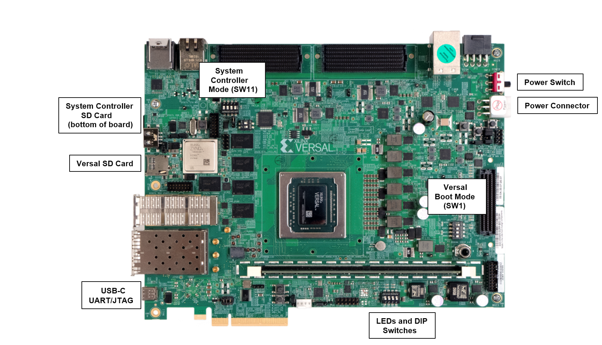
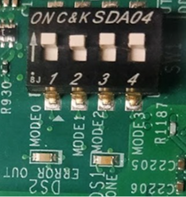
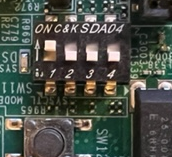
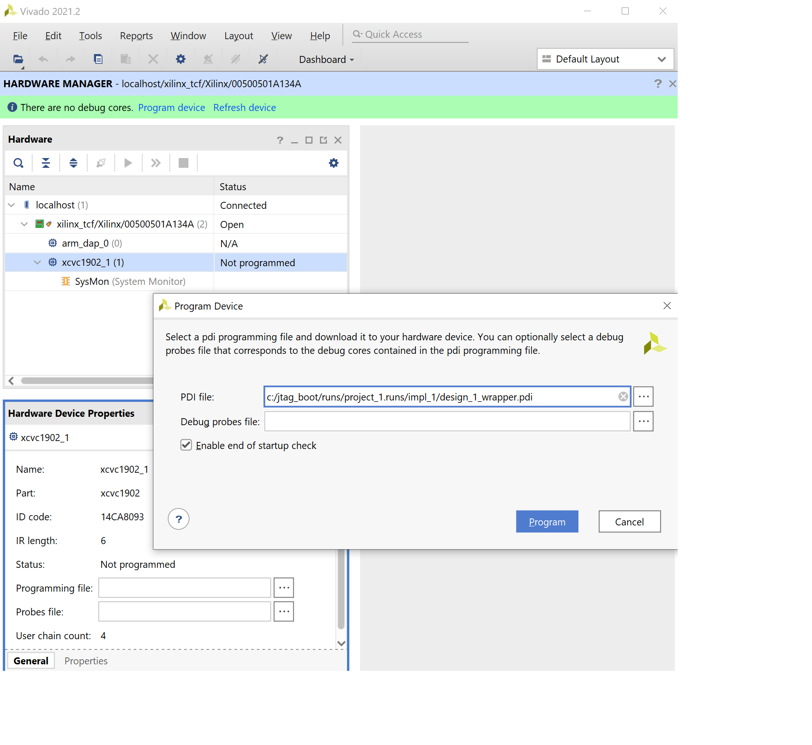
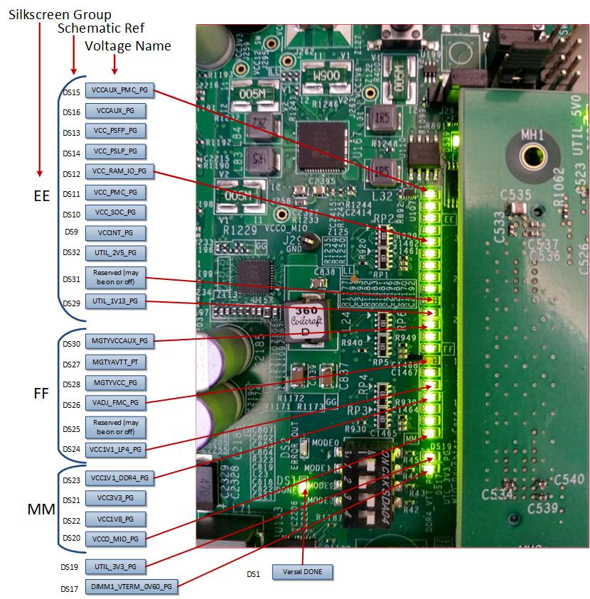

impages <tr>
   <td align="center"><h1>2021.2 Versal JTAG Boot Tutorial</h1>
   </td>
 </tr>
</table>

# Table of Contents

1. [Introduction](README.md)

2. [Before You Begin](2BeforeYouBegin.md)

3. Quick-Start Instructions

4. [Building Hardware Design](4BuildingHardwareDesign.md)

5. [Debug Resources](5DebugResources.md)

6. [Custom Board Bring-up Resources](6CustomBoardBringupResources.md)

7. [References](7References.md)

# Quick-Start Instructions

The following instructions detail how to build the JTAG Boot tutorial reference design and create the PDI.

 1. Copy the Design and Scripts directories and files to a local project directory.
 The following is an example of the top level directory jtag_boot:

```
jtag_boot
	|___Design
	    |___pl.xdc
	|___Scripts
	    |___ run.tcl  
	    |___ create_jtag_refdesign.tcl
	    |___ load_jtag_pdi.tcl
	    |___ read_jtag_regs.tcl
```

 2. Launch Vivado Design Suite 2021.2.

 3. In the Vivdado Tcl console, cd to the tutorial directory (i.e., jtag_boot).

 4. Source the Tcl from the tutorial directory as follows:

 ```tcl
 	source ./Scripts/run.tcl
 ```

 Sourcing the run.tcl script does the following:
  * Creates a project directory
  * Sources and runs the create_jtag_refdesign.tcl, which does the following:
      * Selects target Versal VC1902 production device.
      * Loads design source constraints and creates ports.
      * Creates blocks, configures and connects IP (i.e., control, interfaces, and processing system (CIPS), Smartconnect).
      * Runs placement and routing.
      * Creates a programmable device image (PDI).

## Setup VCK190 Board

The Xilinx VCK190 evaluation board is used to demonstrate loading the tutorial reference design PDI into the Versal ACAP using the JTAG boot mode. This section describes VCK190 hardware basic setup.

## VCK190 Board



## VCK190 Connections

Before you begin, ensure the SW13 power switch is off.

1. Connect the 12V power supply cable to the VCK190 J16.

2. Connect the USB-C cable used for JTAG/UART from your host system (where Vivado is installed) to VCK190 J207.

3. Set the SW1[1:4] = (ON, ON, ON, ON) to set the Versal to JTAG boot mode MODE[0:3] = 0000.

  

## VCK190 System Controller Settings

The VCK190 includes an on-board system controller that assists with the Versal ACAP power sequencing management. Ensure the following are set for the Zynq UltraScale+ system controller:

* Set the SW11[1:4] = (ON, OFF, OFF, OFF) to set the Zynq Ultrascale+ System Controller to the SD1 LS (3.0) boot mode PS_MODE[0:3]=0111.

  

* System Controller SD card is inserted into the VCK190 J206 slot (located on the bottom of the board).

* VCK190 system controller image is pre-programmed out of the box. If any issues occur with the image, the SD card can be reprogrammed with the VCK190 system controller design image located here:
  * [BEAM Tool for VCK190 Evaluation Kit](https://xilinx-wiki.atlassian.net/wiki/spaces/A/pages/973078551/BEAM+Tool+for+VCK190+Evaluation+Kit) > Board Setup and Connection section includes the Micro SD image download link.   


## Program Tutorial Design

1. Set SW13 to the ON position.

2. Check that the power good (PG) LEDs are all on and reserved LEDs (reserved LEDs can be on or off).

3. Open the 2021.2 Vivado Hardware Manager.

4. Select Open New Target and connect the VCK190.

5. Right-click Versal device xcvc1902_1 and select program device.

6. Select the tutorial reference design PDI: \jtag_boot\runs\project_1.runs\impl_1\design_1_wrapper.pdi

### Vivado Hardware Manager Program



Note: For steps 3-5, 2021.2 Vivado xsdb.bat or Vitis xsct.bat can be used to program the device. This tutorial highlights xsct in the examples since the commands for xsct and xsdb are the same. The following is an example command sequence used program a PDI with xsct.
```
xsct% connect
xsct% ta 1
xsct% device program {C:\jtag_boot\runs\project_1.runs\impl_1\design_1_wrapper.pdi}

```

The user drive location may differ, so ensure the correct path is used.

## Tutorial Design Load Check  

When the tutorial design is loaded successfully, the following is seen:



* DS1 DONE LED on.
* DS3-DS5 PL GPIO LEDs are toggling (connected to binary counters in design).

## Go To Next Section:
[Building Hardware Design](4BuildingHardwareDesign.md)

## Go To Table of Contents:  
[README](README.md)

© Copyright 2020-2022 Xilinx, Inc.

Licensed under the Apache License, Version 2.0 (the "License"); you may not use this file except in compliance with the License. You may obtain a copy of the License at

http://www.apache.org/licenses/LICENSE-2.0
Unless required by applicable law or agreed to in writing, software distributed under the License is distributed on an "AS IS" BASIS, WITHOUT WARRANTIES OR CONDITIONS OF ANY KIND, either express or implied. See the License for the specific language governing permissions and limitations under the License.
