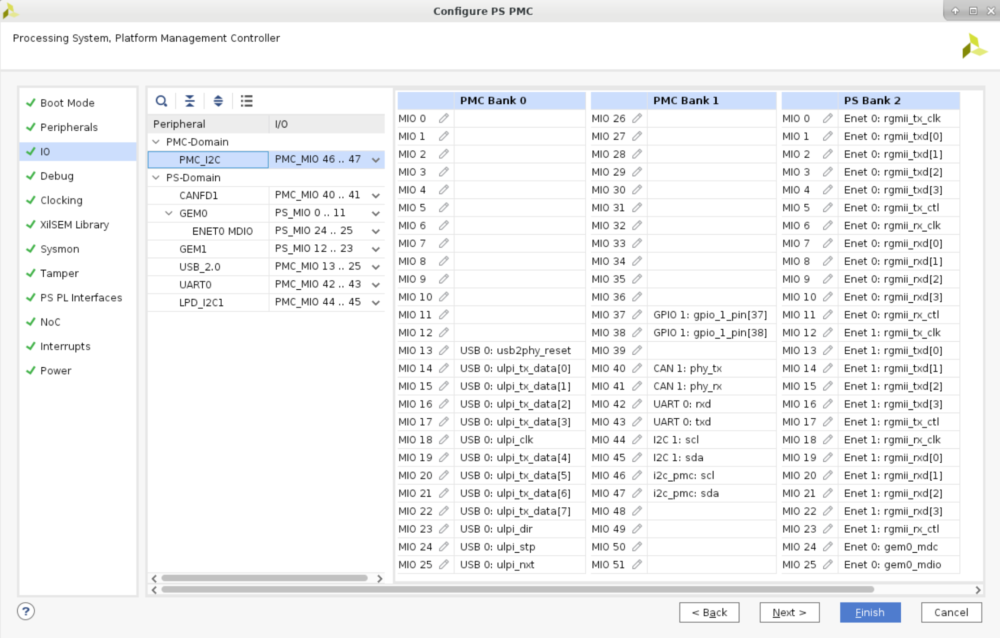
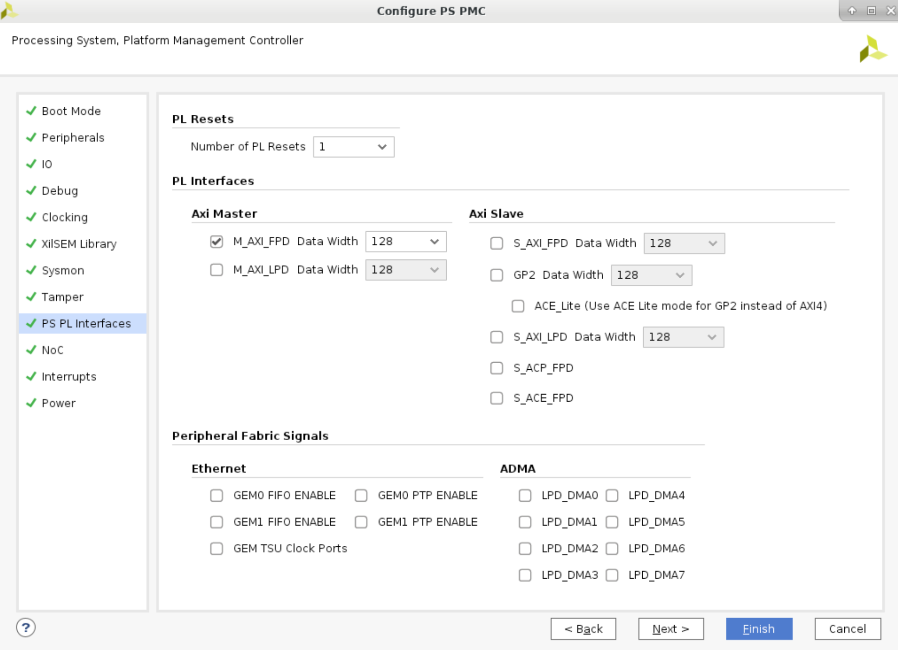
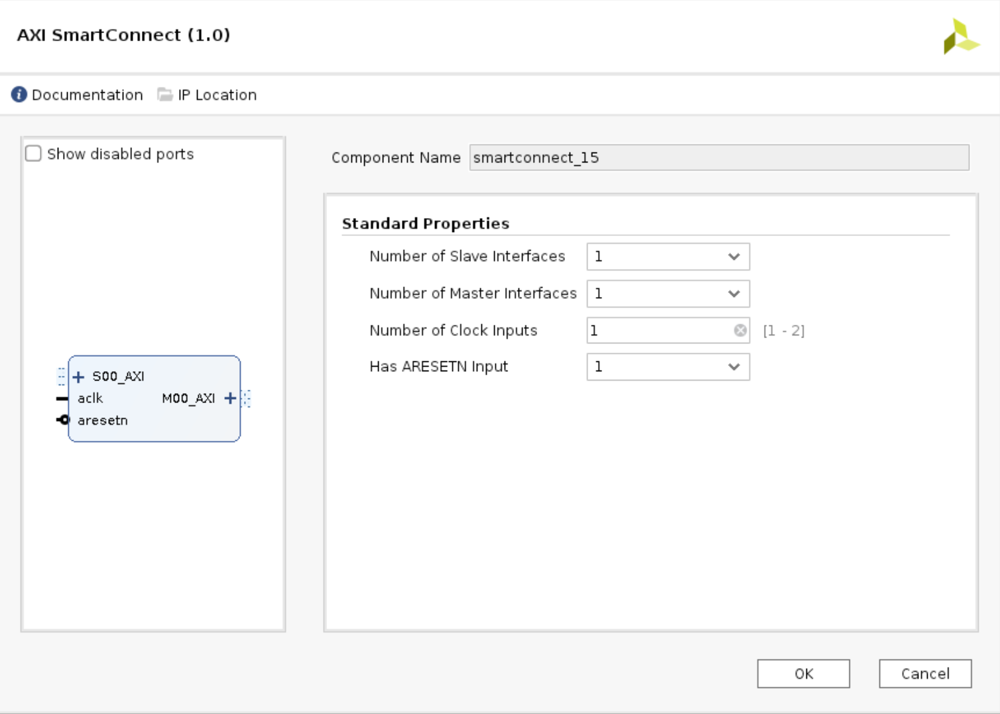

<table class="sphinxhide" width="100%">
 <tr width="100%">
    <td align="center"><h1>AMD Vivado™ Design Suite Tutorials</h1>
    <a href="https://www.xilinx.com/products/design-tools/vivado.html">See Vivado Development Environment on xilinx.com</br></a>
    </td>
 </tr>
</table>

# Table of Contents

1. [Introduction](README.md)

2. [Before You Begin](2BeforeYouBegin.md)

3. [Quick-Start Instructions](3QuickStartInstructions.md)

4. Building Hardware Design

5. [Debug Resources](5DebugResources.md)

6. [Custom Board Bring-up Resources](6CustomBoardBringupResources.md)

7. [References](7References.md)

# Building Hardware Design

This JTAG boot tutorial design has PMC/PS peripherals and PL GPIO used to demonstrate board bring-up with JTAG boot. When the run.tcl script is sourced you will get a Vivado block design output, as detailed in the Vivado Block Design.

## Vivado Block Design


The [Quick-Start Instructions](3QuickStartInstructions.md) create the reference design. The next sections highlight key steps implemented by the scripts for this tutorial reference design.

#### Important Note:
All user designs require CIPS IP for boot, but CIPS other configuration options for peripherals and features is specific to the design.

## Create XDC files

The tutorial reference design PL GPIO Xilinx design constraints file (xdc) is provided to assign LEDs, pushbuttons, and dip switch functions to the package pins based on the VCK190 schematic pinout. For VCK190 schematic detail, see the [VCK190 schematic](https://www.xilinx.com/member/forms/download/design-license.html?cid=1b472a7f-089f-495e-97cb-68bcb4cceec8&filename=vck190-schematic-xtp610.zip).

The PL GPIO (pl.xdc) reference constraints file is located in the design directory. The following shows a portion of the pl.xdc standard constraints file format.

 ```
# pl.xdc: Constraints for the PL GPIO (2 push buttons, 4 LEDs, and 4 dip switches)
set_property PACKAGE_PIN G37 [get_ports push_button_0]
set_property PACKAGE_PIN G36 [get_ports push_button_1]

set_property PACKAGE_PIN H34 [get_ports led_0]
```

The PS and PMC controllers/peripherals pinouts are defined by the Vivado CIPS IP configuration as shown in the following sections.

## Create Vivado Project Setup  

Use the following steps to create a new project.  

1. Launch Vivado 2021.2


2. Select Create Project and select Next to launch the Create a New Vivado Project wizard.

### Vivado Create Project


3. Enter the project name and project location and select Next.

### Vivado Project Name


4. Select RTL Project as the project type and select Next.

### Vivado Project Type


Users can input both RTL source and constraint files for custom designs. This reference design only requires the pl.xdc constraint file.

5. Select next without adding source files.


6. Select the constraints pl.xdc file and select Next.


#### Important Note:
This tutorial demonstrates the part project type flow as a reference since custom board designs will start with that flow. Designs targeted for only the VCK190 evaluation board and that do not intend to port a design to a custom board are recommended to use the boards project type flow because it includes board specific presets. The Versal Embedded Design Tutorial [(UG1305)](https://xilinx.github.io/Embedded-Design-Tutorials/docs/2021.1/build/html/docs/Introduction/Versal-EDT/Versal-EDT.html) demonstrates the Versal VCK190 evaluation platform board project type flow.

7. Select the Vivado default part XCVC1902-vsva2197-2MP-e-S and select Next.

### Select Vivado Default Part


8. Select Finish

## Create Block Design
The reference design in this tutorial uses IP Integrator. CIPS IP is required by all designs for boot, but is also used to configure PMC and PS peripherals, controllers, MIO, clocks, SYSMON monitoring capability, enable interrupts, and setup PS manager and subordinate interfaces for NoC. The following sections highlight key step IP setup steps used by the tutorial scripts to create the reference design.

Once the project manager has loaded:

1. Select Create Block Design from the IP Integrator  
2. Enter a Design name and select OK.

### IP Integrator - Create Block Diagram


3. Select the “+” sign to add IP and search CIPS.

### Include CIPS


4. Select Next

### CIPS presets


5. Select the PS PMC box to configure the PS and PMC clocks and Peripherals.

### CIPS PS PMC Configuration


6. Select Clocking and select the Input Clocks tab.

7. Set the input REF_CLK to 33.333MHz for the VCK190.

### CIPS REF_CLK Setup


Notes:
  * CIPS is required for all Versal designs, including JTAG boot mode. JTAG boot mode uses only dedicated I/O pins. Because there is not an MIO to configure in this boot mode, no additional selection is required from the boot peripherals section.
  * User designs that are created with non-JTAG boot modes must setup the targeted boot peripheral under the boot mode tab.
  * See the Versal ACAP Embedded Design Tutorial [(UG1305)](https://xilinx.github.io/Embedded-Design-Tutorials/docs/2021.1/build/html/docs/Introduction/Versal-EDT/Versal-EDT.html) for a QSPI boot flow example and Control Interfaces and Processing System LogiCORE IP Product Guide [(PG352)](https://www.xilinx.com/content/dam/xilinx/support/documentation/ip_documentation/versal_cips/v3_1/pg352-cips.pdf) for more information on the options.
  * A single PDI can support multiple boot modes if the MIO pins do not conflict. For example, the VCK190 pinout supports can support a single PDI that enables QSPI, SD1 3.0, and JTAG boot mode options. The boot mode pins MODE[3:0] would determine which primary boot mode is used for boot.

8. Select Power to set the MIO Voltage Standard.

9. Select LVCMOS1.8 from the Bank0 (MIO), Bank1(MIO), Bank2, and Bank3 dropdown menu's. For this tutorial reference design, 1.8V is used on the PMC DIO, PMC MIO, and PS LPD MIO bank.

### CIPS PS-PMC I/O Configuration- MIO Voltage Standard


The Peripheral section is grouped by the PMC domain and PS domain related peripherals and controllers. Each peripheral will have unique MIO and interface options. Below are some example peripheral setups used in the reference design. For the PMC peripherals, this tutorial uses the PMC I2C controller and PMC GPIO features.

10. Assign the peripheral to I2C PMC and select MIO[46:47] from the pull-down menu.

### CIPS PS-PMC I/O Configuration - PMC Peripheral


For the PS domain peripherals, the steps are similar to the PMC domain peripherals setup. The MIO selected in this reference design is based on the VCK190 pinout for the interfaces.

11. Select each targeted PS peripheral (LPD_I2C1, USB, UART0, USB, GEM0, GEM1, CAN_FD, and TTC) and assign the MIO from the pull-down menu. As an example, the CAN_FD1 is assigned to the PMC MIO[40:41].


### CIPS PS-PMC I/O Configuration - PS Peripherals


12. Select the MIO PIN view (highlighted in red in the following image).

13. Select the External Usage pull-down menu to set GPIO for the PMC MIO[37:38]. PMC MIO 37 the VCK190 system controller VCC_RAM power sequence trigger and PMC MIO 38 are assigned to PCIE_PERST_B.

### Adjust MIO Configuration Pin Settings:
Users can change the MIO Drive Strength, slew rate, and pullup/pulldown settings for a custom board.

14. Select the MIO pin pull-down menus to set the configuration of the pins. The following provides an example of the tutorial reference design MIO settings.

### CIPS Customize and Configure MIO  


After the MIO pin options are selected:

15. Select the MIO PIN View button to revert to the standard view.

CIPS will attempt to manage your required clock frequencies in the auto clocking mode (default) and will consider the user input requirements for peripherals (i.e., the PLLs selected and requested frequencies) to provide the best combination. Auto clocking mode is recommended for most designs because it provides optimal performance based on inputs. There is also a manual clocking mode option that allows users to make adjustments if the auto selections do not meet their requirements.

16.  Select Clocking and select the Output Clocks tab.

17.  Select the PL fabric clocks (used to drive the binary counters in the reference design).

18. Select the TTC0 source pull-down menu and select APB as the source.

### CIPS Configuration of Output Clocks  


CIPS also configures the number of PL resets and the AXI manager and subordinate interfaces required in the design.

19. Set the Number of PL Resets to 1 and set the AXI Manager interface (M_AXI_FPD) data width as 128.

### Configuration of PL-PS Interfaces



Interrupts are also configured within CIPS. This includes debug processor interrupts, PL to PS interrupts from LPD or FPD, and inter processor interrupts (IPI).

20. Set the Inter Processor Interrupt configuration to enable the manager PMC, PSM, and A72 as shown in the following image.

### Configuration of interrupts


The Versal device system monitor is a valuable resource for board bring-up. There are various monitoring options that can be used to check temperature, on-chip rail monitors, and external supplies. For the VCK190 reference design, the system monitor on-chip supply monitor is enabled for the critical device supplies for PMC, PS, BBRAM, and PL/NoC resources.


21. Select Sysmon and select the basic configuration tab for system monitor as shown in the following image.

### Enabling System Monitor - basic setup


22. Select the On Chip Supply Monitor tab and set the SUPPLY_VOLTAGE power rails to enable the monitoring capability (shown in the following image). The System Monitor temperature and external supply monitor tabs are left as default.

### CIPS System Monitor - supply setup


23. Select Finish to close the CIPS IP once all the settings have been entered.

There are other sections in the CIPS IP (i.e., debug and tamper) that are not used in this reference tutorial. Designs that use these features should setup the options in those tabs. Refer to the Control, Interface and Processing System LogiCORE IP Product Guide [(PG352)](https://www.xilinx.com/support/documentation/ip_documentation/versal_cips/v2_1/pg352-cips.pdf) for details.

### Additional IP Resources
In addition to the CIPS IP, other IP used for the tutorial reference design are highlighted. The binary counters, AXI SmartConnect, Concat, AXI GPIO, constant, processor system reset, and slice IP are all used in the design for function and connectivity. Each of these IP are selected from the IP integrator menu.

### IP Selection


Example reference design IP setups are detailed in this section. There are four binary counter IP's connected with slice IP and the AXI SmartConnect IP connected with AXI GPIO.

24. Select the binary counter IP from the IP selection. The binary counter IP has four instances in the reference design with the same basic and control settings.

25. Set the Output Width to 27 and Increment Value (Hex) 1 to create an up counter for each of the four instances of binary counter IP. These four counters are clocked by the Versal ACAP PL0-PL3 reference clocks configured in CIPS.

See the Binary Counter LogiCORE IP Product Guide [(PG121)](https://www.xilinx.com/support/documentation/ip_documentation/counter_binary/v12_0/pg121-c-counter-binary.pdf) for more information.

### Binary Counter Setup


26. Select the Slice IP from the IP selection to add to the design.

27. The slice IP is used to display the counter MSB to the LEDs using the widths shown in the following image.

### Slice Setup


28. Select the AXI SmartConnect IP from the IP selection to add to the design.

29. Set AXI SmartConnect standard properties as shown in the following image.

The AXI SmartConnect IP is used to connect a subordinate AXI interface to a manager AXI interface in the FPD for the reference design. See the SmartConnect LogiCORE IP Product Guide [(PG247)](https://www.xilinx.com/support/documentation/ip_documentation/smartconnect/v1_0/pg247-smartconnect.pdf) for more information.

### AXI SmartConnect Setup


30. Select the AXI GPIO IP from the IP selection to add to the design.

31. Set the AXI GPIO input and the width settings shown in the following image.

The AXI GPIO IP is used to connect the subordinate AXI interface to six GPIO inputs, which are connected to reference design dip switches and pushbuttons on the VCK190. See the AXI GPIO LogiCORE IP Product Guide [(PG144)](https://www.xilinx.com/support/documentation/ip_documentation/axi_gpio/v2_0/pg144-axi-gpio.pdf) for more information.

### AXI GPIO Setup


32. Select the Processor System Reset IP from the IP selection to add to the design.

33. Set the Processor System Reset settings as shown.

The Processor System Reset IP is used to setup a custom reset using the PL reset. See the Processor System Reset Module LogiCORE IP Product Guide [(PG164)](https://www.xilinx.com/support/documentation/ip_documentation/proc_sys_reset/v5_0/pg164-proc-sys-reset.pdf) for more information.

### Processor System Reset Setup


### Run Connection Automation

Once the desired IPs have been included and setup in the design:
34. Select Run Connection Automation (as shown in the following image).

#### Run Connection Automation


## Saving IP settings
After the IP blocks have been connected and validated on the board, the setup can be saved to load in other projects for the same board target. The following tcl command can be ran to load initial presets:

```
write_bd_tcl ./mycustom_bd1.tcl
```
The tcl can be sourced to setup the IP in an existing project. See the Vivado Design Suite Tcl Command Reference Guide [(UG835)](https://www.xilinx.com/content/dam/xilinx/support/documentation/sw_manuals/xilinx2021_2/ug835-vivado-tcl-commands.pdf) for more information.

## Vivado Synthesis, Implementation, and Program

After the IP blocks have been included, the Vivado Flow synthesis and implementation steps are initiated by selecting Run Synthesis, followed by Run Implementation (shown in the flow navigator). These steps are included in the tutorial scripts.

### Project flow - Synthesis, Implementation


To program the device with Vivado hardware manager, the board connection is established and the pdi is selected. See the [Quick-Start Instructions](3QuickStartInstructions.md) for more information.


## Go To Next Section:  
[Debug Resources](5DebugResources.md)

## Go To Table of Contents:  
[README](README.md)

<p class="sphinxhide" align="center"><sub>Copyright © 2020–2023 Advanced Micro Devices, Inc</sub></p>

<p class="sphinxhide" align="center"><sup><a href="https://www.amd.com/en/corporate/copyright">Terms and Conditions</a></sup></p>
