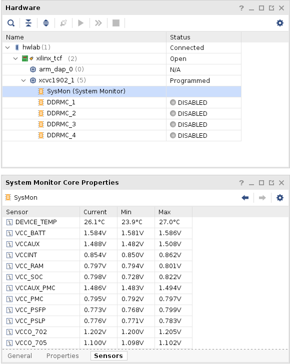
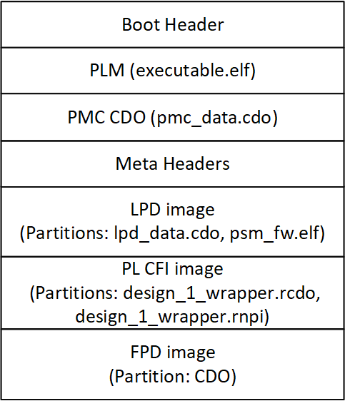
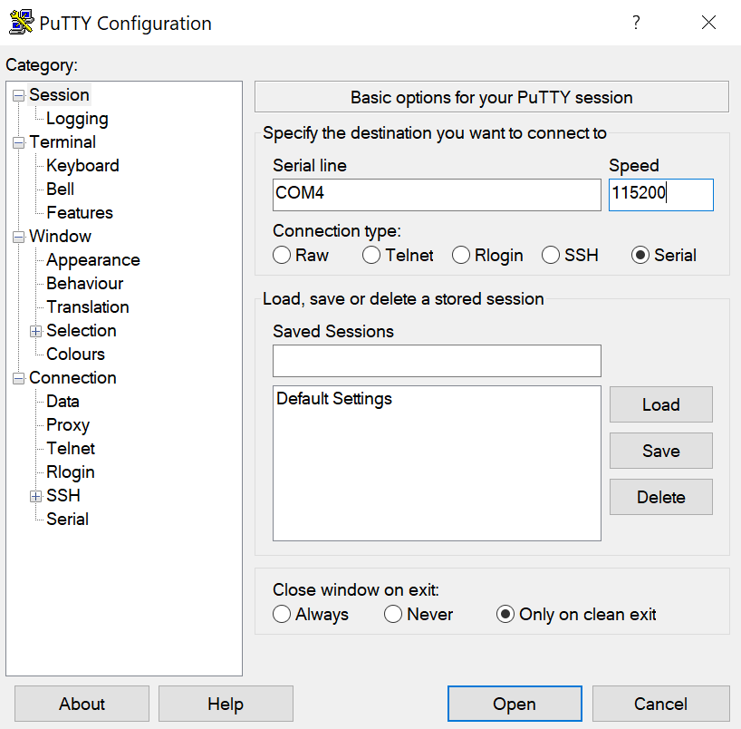

<table class="sphinxhide" width="100%">
 <tr width="100%">
    <td align="center"><h1>AMD Vivado™ Design Suite Tutorials</h1>
    <a href="https://www.xilinx.com/products/design-tools/vivado.html">See Vivado Development Environment on xilinx.com</br></a>
    </td>
 </tr>
</table>

# Table of Contents

1. [Introduction](README.md)

2. [Before You Begin](2BeforeYouBegin.md)

3. [Quick-Start Instructions](3QuickStartInstructions.md)

4. [Building Hardware Design](4BuildingHardwareDesign.md)

5. Debug Resources

6. [Custom Board Bring-up Resources](6CustomBoardBringupResources.md)

7. [References](7References.md)

# Debug During Board Bring-up

The Vivado Hardware Manager and xsct are helpful debug tools if an issue is encountered during boot. Vivado hardware manager provides the following options for debug:

* Reducing the TCK default rate frequency in hardware manager can help to identify any clock edge or signal integrity issues. This option is also helpful to isolate issues on larger JTAG chains where buffering is needed.

* System monitor (SYSMON) voltage and temperature readings can ensure the power rails are on and operating within the expected Versal ACAP data sheet ranges. If a boot issue is encountered the power rails should be confirmed. The tutorial reference design enables monitoring of key power rails. After the reference design PDI is programmed into the Versal ACAP device, the sensor information can be viewed in the hardware manager (shown in the following image).


## Versal ACAP BIF and PDI Example

The PDI can have many different components included depending on the design. Refer to the Bootgen User Guide [(UG1283)](https://www.xilinx.com/content/dam/xilinx/support/documentation/sw_manuals/xilinx2021_2/ug1283-bootgen-user-guide.pdf) for details on the boot image file (BIF) format and the PDI components. The following shows the BIF and PDI components for the example JTAG boot reference design. The BIF file can be helpful ensure the expected partitions are included during debug.

### Tutorial Reference Design BIF

```
new_bif:
{
 id_code = 0x14ca8093
 extended_id_code = 0x01
 id = 0x2
 image
 {
  name = pmc_subsys
  id = 0x1c000001
  partition
  {
   id = 0x01
   type = bootloader
   file = gen_files/plm.elf
  }
  partition
  {
   id = 0x09
   type = pmcdata, load = 0xf2000000
   file = static_files/topology_xcvc1902.v3.cdo
   file = gen_files/pmc_data.cdo
  }
 }
 image
 {
  name = lpd
  id = 0x4210002
  partition
  {
   id = 0x0C
   type = cdo
   file = gen_files/lpd_data.cdo
  }
  partition
  {
   id = 0x0B
   core = psm
   file = static_files/psm_fw.elf
  }
 }
 image
 {
  name = pl_cfi
  id = 0x18700000
  partition
  {
   id = 0x03
   type = cdo
   file = design_1_wrapper.rcdo
  }
  partition
  {
   id = 0x05
   type = cdo
   file = design_1_wrapper.rnpi
  }
 }
 image
 {
  name = fpd
  id = 0x420c003
  partition
  {
   id = 0x08
   type = cdo
   file = gen_files/fpd_data.cdo
  }
 }
}
```

The following image details the reference design PDI components that follows the BIF file order. Understanding the partition order is helpful when reviewing the example PLM log. The order partitions are loaded in the next sections.

### Tutorial Reference Design PDI Composition



## Reading JTAG Registers

This tutorial includes a script (/Scripts/read_jtag_regs.tcl) with commands to read out the JTAG registers (i.e., IDCODE, EXTENDED_IDCODE, DNA, JTAG_STATUS, USERCODE, ERROR_STATUS) in the Vivado hardware manager if debug is required.  

Versal ACAP has two JTAG status registers (the JTAG_STATUS 36-bit register and the ERROR_STATUS 160-bit register) that provide valuable status information if an issue during boot occurs.

  * Reading the JTAG_STATUS 36-bit register provides:
    * The boot mode pins values register can be checked to ensure the proper boot mode is selected.
    * Provides status on key power rails (VCC_PMC, VCC_PSLP, VCCINT, VCC_SOC).
    * Provides status on the SBI used for JTAG boot mode. If an error occurred during reading or loading (not ready to accept JTAG data).
    * Confirms the version of PMC.


  * Reading the ERROR_STATUS 160-bit register provides key error information to help isolate the root cause for boot issues.
    * BootROM first and last errors are captured. Refer to the Versal ACAP Technical Reference Manual [(AM011)](https://www.xilinx.com/support/documentation/architecture-manuals/am011-versal-acap-trm.pdf) for information on the next steps.
    * PLM Major errors are captured. Refer to the Versal ACAP System Software Developers User Guide [(UG1304)](https://www.xilinx.com/content/dam/xilinx/support/documentation/sw_manuals/xilinx2021_2/ug1304-versal-acap-ssdg.pdf) for the PLM Major Error Codes.
    * PLM Minor errors are captured. Refer to the associated library/driver or register for minor error detail.
    * Block errors, correctable or non-correctable, are captured. Refer to the specific block user guide for more detail on correctable errors and associated registers.

Versal ACAP devices have specific identification checks that prevent the incorrect device type or device version (ES1 vs. production) from being programmed. The device IDCODE should be confirmed if boot errors are encountered when programming the PDI.

## Checking the Device Identifiers
  * Reading the IDCODE Register- This 32-bit register stores the device identification base family and revision (VCK190 production IDCODE is 0x14CA8093).

  * Reading the EXTENDED_IDCODE- This 32-bit register is an extension to the IDCODE. 14 bits in this register define the Versal code extension (VCK190 production EXTENDED_IDCODE is [27:14]=0000 0000 0000 01).

  * Reading the DNA- This 128 bit register uniquely identifies the device.

# Boot Status and PLM Error Codes

Vivado Hardware Manager or xsct can be used to read registers when a boot failure is identified. This section shows the JTAG_STATUS and ERROR_STATUS successful boot reading along with a few error code examples. Example PLM logs are also provided for error examples and proceeding with debug.

### Example before PDI device program - JTAG_STATUS Read
```
xsct% connect
xsct% ta 1
xsct% device status jtag_status                                                 
JTAG STATUS: 0x002a810f09
              RESERVED (Bits [35]): 0
                  DONE (Bits [34]): 0
           JRDBK ERROR (Bits [33]): 0
         JCONFIG ERROR (Bits [32]): 0
        PMC VERSION (Bits [31:28]): 0010
           RESERVED (Bits [27:24]): 1010
         JTAG SEC GATE (Bits [23]): 1
              RESERVED (Bits [22]): 0
   PMC SCAN CLEAR DONE (Bits [21]): 0
   PMC SCAN CLEAR PASS (Bits [20]): 0
           RESERVED (Bits [19:17]): 000
              RESERVED (Bits [16]): 1
          BOOT MODE (Bits [15:12]): 0000
      VCC PMC DETECTED (Bits [11]): 1
     VCC PSLP DETECTED (Bits [10]): 1
        VCCINT DETECTED (Bits [9]): 1
       VCC SOC DETECTED (Bits [8]): 1
       AES KEY ZEROIZED (Bits [7]): 0
     BBRAM KEY ZEROIZED (Bits [6]): 0
  SELECTMAP BUS WIDTH (Bits [5:4]): 00
       SBI JTAG ENABLED (Bits [3]): 1
          SBI JTAG BUSY (Bits [2]): 0
           RSVD READS 0 (Bits [1]): 0
           RSVD READS 1 (Bits [0]): 1
```
### Example Successful Boot- JTAG_STATUS Read (Reference Design Loaded)

```
xsct% connect
xsct% ta 1
xsct% device status jtag_status
JTAG STATUS: 0x042e810f09
              RESERVED (Bits [35]): 0
                  DONE (Bits [34]): 1
           JRDBK ERROR (Bits [33]): 0
         JCONFIG ERROR (Bits [32]): 0
        PMC VERSION (Bits [31:28]): 0010
           RESERVED (Bits [27:24]): 1110
         JTAG SEC GATE (Bits [23]): 1
              RESERVED (Bits [22]): 0
   PMC SCAN CLEAR DONE (Bits [21]): 0
   PMC SCAN CLEAR PASS (Bits [20]): 0
           RESERVED (Bits [19:17]): 000
              RESERVED (Bits [16]): 1
          BOOT MODE (Bits [15:12]): 0000
      VCC PMC DETECTED (Bits [11]): 1
     VCC PSLP DETECTED (Bits [10]): 1
        VCCINT DETECTED (Bits [9]): 1
       VCC SOC DETECTED (Bits [8]): 1
       AES KEY ZEROIZED (Bits [7]): 0
     BBRAM KEY ZEROIZED (Bits [6]): 0
  SELECTMAP BUS WIDTH (Bits [5:4]): 00
       SBI JTAG ENABLED (Bits [3]): 1
          SBI JTAG BUSY (Bits [2]): 0
           RSVD READS 0 (Bits [1]): 0
           RSVD READS 1 (Bits [0]): 1
```


### Example Successful Boot - ERROR_STATUS Read (with reference design loaded):

On a successful boot, you would not expect any error conditions unless it passed on a fallback or multiboot attempt.

```
xsct% connect
xsct% ta 1
xsct% device status error_status
ERROR STATUS: 0x0000000000000000000000000000000700000007
         RSVD READS 0 (Bits [159:155]): 00000
             RESERVED (Bits [154:148]): 0000000
  BOOTROM FIRST ERROR (Bits [147:136]): 000000000000
   BOOTROM LAST ERROR (Bits [135:124]): 000000000000
      PLM MAJOR ERROR (Bits [123:110]): 00000000000000
       PLM MINOR ERROR (Bits [109:94]): 0000000000000000
              GSW ERROR (Bits [93:64]): 000000000000000000000000000000
                  RESERVED (Bits [63]): 0
               BOOTROM NCR (Bits [62]): 0
                    PLM CR (Bits [61]): 0
                   PLM NCR (Bits [60]): 0
                    GSW CR (Bits [59]): 0
                   GSW NCR (Bits [58]): 0
                 CFU ERROR (Bits [57]): 0
              CFRAME ERROR (Bits [56]): 0
                    PSM CR (Bits [55]): 0
                   PSM NCR (Bits [54]): 0
               DDRMC MB CR (Bits [53]): 0
              DDRMC MB NCR (Bits [52]): 0
                    NOC CR (Bits [51]): 0
                   NOC NCR (Bits [50]): 0
            NOC USER ERROR (Bits [49]): 0
           MMCM LOCK ERROR (Bits [48]): 0
                    AIE CR (Bits [47]): 0
                   AIE NCR (Bits [46]): 0
           DDRMC MC ECC CR (Bits [45]): 0
          DDRMC MC ECC NCR (Bits [44]): 0
                     GT CR (Bits [43]): 0
                    GT NCR (Bits [42]): 0
                 SYSMON CR (Bits [41]): 0
                SYSMON NCR (Bits [40]): 0
            USER PL0 ERROR (Bits [39]): 0
            USER PL1 ERROR (Bits [38]): 0
            USER PL2 ERROR (Bits [37]): 0
            USER PL3 ERROR (Bits [36]): 0
            NPI ROOT ERROR (Bits [35]): 0
               SSIT ERROR3 (Bits [34]): 0
               SSIT ERROR4 (Bits [33]): 0
               SSIT ERROR5 (Bits [32]): 0
             PMC APB ERROR (Bits [31]): 0
         PMC BOOTROM ERROR (Bits [30]): 0
        RCU HARDWARE ERROR (Bits [29]): 0
        PPU HARDWARE ERROR (Bits [28]): 0
             PMC PAR ERROR (Bits [27]): 0
                    PMC CR (Bits [26]): 0
                   PMC NCR (Bits [25]): 0
         PMC SYSMON0 ALARM (Bits [24]): 0
         PMC SYSMON1 ALARM (Bits [23]): 0
         PMC SYSMON2 ALARM (Bits [22]): 0
         PMC SYSMON3 ALARM (Bits [21]): 0
         PMC SYSMON4 ALARM (Bits [20]): 0
         PMC SYSMON5 ALARM (Bits [19]): 0
         PMC SYSMON6 ALARM (Bits [18]): 0
         PMC SYSMON7 ALARM (Bits [17]): 0
         PMC SYSMON8 ALARM (Bits [16]): 0
         PMC SYSMON9 ALARM (Bits [15]): 0
                   CFI NCR (Bits [14]): 0
             SEU CRC ERROR (Bits [13]): 0
             SEU ECC ERROR (Bits [12]): 0
           RSVD READS 0 (Bits [11:10]): 00
                  RTC ALARM (Bits [9]): 0
                 NPLL ERROR (Bits [8]): 0
                 PPLL ERROR (Bits [7]): 0
        CLOCK MONITOR ERROR (Bits [6]): 0
          PMC TIMEOUT ERROR (Bits [5]): 0
             PMC XMPU ERROR (Bits [4]): 0
             PMC XPPU ERROR (Bits [3]): 0
                SSIT ERROR0 (Bits [2]): 0
                SSIT ERROR1 (Bits [1]): 0
                SSIT ERROR2 (Bits [0]): 0
```

### Example Unsuccessful Boot- Incorrect Device or Version Targeted
When the incorrect device PDI (does not match target device) is used or a PDI with the wrong version (ES1 vs. production) is selected, a PLM error code 0x0326 and DONE low is seen during PDI programming.

Unsuccessful boot JTAG_STATUS register read:
```
xsct% connect
xsct% ta 1
xsct% device status jtag_status
JTAG STATUS: 0x001e810f09
              RESERVED (Bits [35]): 0
                  DONE (Bits [34]): 0
           JRDBK ERROR (Bits [33]): 0
         JCONFIG ERROR (Bits [32]): 0
        PMC VERSION (Bits [31:28]): 0001
           RESERVED (Bits [27:24]): 1110
         JTAG SEC GATE (Bits [23]): 1
              RESERVED (Bits [22]): 0
   PMC SCAN CLEAR DONE (Bits [21]): 0
   PMC SCAN CLEAR PASS (Bits [20]): 0
           RESERVED (Bits [19:17]): 000
              RESERVED (Bits [16]): 1
          BOOT MODE (Bits [15:12]): 0000
      VCC PMC DETECTED (Bits [11]): 1
     VCC PSLP DETECTED (Bits [10]): 1
        VCCINT DETECTED (Bits [9]): 1
       VCC SOC DETECTED (Bits [8]): 1
       AES KEY ZEROIZED (Bits [7]): 0
     BBRAM KEY ZEROIZED (Bits [6]): 0
  SELECTMAP BUS WIDTH (Bits [5:4]): 00
       SBI JTAG ENABLED (Bits [3]): 1
          SBI JTAG BUSY (Bits [2]): 0
           RSVD READS 0 (Bits [1]): 0
           RSVD READS 1 (Bits [0]): 1
```

### Unsuccessful boot ERROR_STATUS register read:

When targeting the incorrect device the PLM major error code 0x0326 is seen. Refer to the following partial read out.
```
xsct% connect
xsct% ta 1
xsct% device status error_status
  ERROR STATUS: 0x0000000000c98000400000000000000700000007
         RSVD READS 0 (Bits [159:155]): 00000
             RESERVED (Bits [154:148]): 0000000
  BOOTROM FIRST ERROR (Bits [147:136]): 000000000000
   BOOTROM LAST ERROR (Bits [135:124]): 000000000000
      PLM MAJOR ERROR (Bits [123:110]): 00001100100110
       PLM MINOR ERROR (Bits [109:94]): 0000000000000001
       ...
```

The Versal IDCODE can also be read using the following command:
```
xsct% connect
xsct% jtag ta
```

Alternately, memory mapped registers can be accessed for additional information. You can read out register content with xsct using the rrd command. For example, the pmc_jtag_csr register IDCODE and version can be read as shown below:

```
xsct% connect
xsct% ta 1
xsct% rrd pmc_jtag_csr idcode
xsct% rrd pmc_jtag_csr version
```


## Example PLM Log

In addition to key JTAG registers, the PLM log is an important debug resource. The PLM log is accessible using either the PS UART or the xsct command. The PLM log start indicates that the PLM boot phase execution has initiated. The PLM will provide status as it processes the programmable device image.

Connect to the PS UART to see the PLM boot progress. The log includes timestamps for each image/partition loaded by the PLM and reports any errors. If an error occurs, the PLM log will include an additional register dump. The register dump provides key information from several important memory mapped registers (i.e., PLM Error status, PMC ERR1, PMC ERR2).

For more information, see the [Vivado PLM log command line documentation](https://www.xilinx.com/html_docs/xilinx2020_2/vitis_doc/ags1585739038565.html).

### UART Example PLM log setup and output

There are different methods to connect to the UART. This example shows a setup using PuTTY. The COM port used will be dependent on your system.

To see the UART PLM log, launch PuTTY and setup the COM port with speed 115200 selected before you program the PDI image as detailed in the [Quick-Start Instructions](3QuickStartInstructions.md).



#### UART PLM Log Output

After the serial COM port is setup, follow the [Quick-Start Instructions](3QuickStartInstructions.md) to program the PDI with Vivado Hardware manager. The UART should display the PLM status.
If the UART is not accessible, the PLM status information can still be accessed after the boot attempt completes. The PLM status information is stored in the PMC RAM and can be accessed with the xsct plm log command. Launch the xsct and connect to the target to use the following PLM log command after loading the JTAG boot reference design. The plm log command has a -log-size option if the default 1024 bytes size is too short and truncates the log.

##### Example xsct PLM Log Output
```
xsct% connect
xsct% ta 1
xsct% device program {C:\jtag_boot\runs\project_1.runs\impl_1\design_1_wrapper.pdi}
xsct% plm log                                                                 
[0.015]****************************************                                 
[0.072]Xilinx Versal Platform Loader and Manager
[0.129]Release 2021.2   Feb  1 2022  -  00:42:12
[0.189]Platform Version: v2.0 PMC: v2.0, PS: v2.0
[0.255]BOOTMODE: 0x0, MULTIBOOT: 0x0
[0.309]****************************************
[0.509]Non Secure Boot
[3.730]PLM Initialization Time
[3.780]***********Boot PDI Load: Started***********
[3.843]Loading PDI from SBI
[3.891]Monolithic/Master Device
[3.986]0.117 ms: PDI initialization time
[4.045]+++Loading Image#: 0x1, Name: lpd, Id: 0x04210002
[4.113]---Loading Partition#: 0x1, Id: 0xC
[54.198] 49.998 ms for Partition#: 0x1, Size: 2304 Bytes
[59.083]---Loading Partition#: 0x2, Id: 0xB
[63.481] 0.512 ms for Partition#: 0x2, Size: 48 Bytes
[67.660]---Loading Partition#: 0x3, Id: 0xB
[112.748] 41.200 ms for Partition#: 0x3, Size: 61312 Bytes
[115.085]---Loading Partition#: 0x4, Id: 0xB
[119.071] 0.016 ms for Partition#: 0x4, Size: 5968 Bytes
[124.004]---Loading Partition#: 0x5, Id: 0xB
[127.978] 0.004 ms for Partition#: 0x5, Size: 80 Bytes
[132.803]+++Loading Image#: 0x2, Name: pl_cfi, Id: 0x18700000
[138.154]---Loading Partition#: 0x6, Id: 0x3
[667.545] 525.416 ms for Partition#: 0x6, Size: 746992 Bytes
[670.056]---Loading Partition#: 0x7, Id: 0x5
[818.245] 144.218 ms for Partition#: 0x7, Size: 208176 Bytes
[820.789]+++Loading Image#: 0x3, Name: fpd, Id: 0x0420C003
[825.904]---Loading Partition#: 0x8, Id: 0x8
[830.275] 0.399 ms for Partition#: 0x8, Size: 1040 Bytes
[834.879]***********Boot PDI Load: Done***********
[839.321]71148.057 ms: ROM Time
[842.115]Total PLM Boot Time

```

Notes:
* Because of the initial UART setup time, the PLM initialization comments can be seen in the stored plm log and accessed from xsct, but not in the UART PLM log display.
* If the -log-size option used is greater than the PLM log data, junk characters will be printed for the rest of the log size and can be ignored.  

##### Example PLM Log Output with Error

If the design included DDR4, the following example PLM log could be seen on a boot failure. The example log indicates the failure is a DDR calibration failure. The PLM error codes can be found in the Versal ACAP System Software Developers User Guide [(UG1304)](https://www.xilinx.com/content/dam/xilinx/support/documentation/sw_manuals/xilinx2021_2/ug1304-versal-acap-ssdg.pdf).

PLM Error Status: 0x032B0000 or 0x032B PLM MAJOR ERROR (DDR calibration error).  

The XPlmi_MaskPoll: Addr: 0xF6110008 entry provides additional information on where the failure happened and can isolate the memory controller affected. If this type of failure is seen, it is recommended to use the Vivado hardware manager for additional debug. This will indicate which memory controllers are seen in the design and which has passed or failed.

##### UART PLM Log DDR4 fail Example

```
7.798309]****************************************
[9.452140]Xilinx Versal Platform Loader and Manager
[14.141896]Release 2020.2   Oct 26 2020  -  06:29:33
[18.831650]Platform Version: v1.0 PMC: v1.0, PS: v1.0
[23.608303]BOOTMODE: 0, MULTIBOOT: 0x0
[27.081640]****************************************
[31.695896] 27.424203 ms for PrtnNum: 1, Size: 2224 Bytes
[36.807609]-------Loading Prtn No: 0x2
[40.979587] 0.692090 ms for PrtnNum: 2, Size: 48 Bytes
[45.141803]-------Loading Prtn No: 0x3
[107.047840] 58.422178 ms for PrtnNum: 3, Size: 57136 Bytes
[109.484068]-------Loading Prtn No: 0x4
[113.064453] 0.014096 ms for PrtnNum: 4, Size: 2512 Bytes
[118.170312]-------Loading Prtn No: 0x5
[121.752993] 0.016503 ms for PrtnNum: 5, Size: 3424 Bytes
[126.855843]-------Loading Prtn No: 0x6
[130.429237] 0.007771 ms for PrtnNum: 6, Size: 80 Bytes
[135.414265]+++++++Loading Image No: 0x2, Name: pl_cfi, Id: 0x18700000
[141.620740]-------Loading Prtn No: 0x7
[277.675778]ERROR: PlHouseClean: Hard Block Scan Clear / MBIST FAILED
[935.840615] 790.647462 ms for PrtnNum: 7, Size: 749952 Bytes
[938.451193]-------Loading Prtn No: 0x8
[3002.459018]XPlmi_MaskPoll: Addr: 0xF6110008,  Mask: 0x10, ExpVal: 0x10, Timeout: 1000000 ...ERROR
[3009.554228]Error loading PL data:
CFU_ISR: 0x00000000, CFU_STATUS: 0x00000A8C
PMC ERR1: 0xE0000000, PMC ERR2: 0xE0000000
[3024.582812]ERROR: PlHouseClean: Hard Block Scan Clear / MBIST FAILED
[3027.998421]PLM Error Status: 0x032B0000
[3031.701640]====Register Dump============
[3035.519762]IDCODE: 0x04CA8093
[3038.383025]EXTENDED IDCODE: 0x00004000
[3042.027168]Version: 0x00301010
[3044.976662]Bootmode User: 0x00000000
[3048.447018]Bootmode POR: 0x00000000
[3051.831306]Reset Reason: 0x00000000
[3055.215443]Multiboot: 0x00000000
[3058.339803]PMC PWR Status: 0x0007FFE0
[3061.897665]PMC GSW Err: 0x00000000
[3065.196093]PLM Error: 0x032B0000
[3068.319903]PMC ERR OUT1 Status: 0xEF000000
[3072.312262]PMC ERR OUT2 Status: 0xE0000000
[3076.304912]GICP0 IRQ Status: 0x00000000
[3080.036268]GICP1 IRQ Status: 0x00000000
[3083.767562]GICP2 IRQ Status: 0x0FF00000
[3087.499962]GICP3 IRQ Status: 0x00000000
[3091.231628]GICP4 IRQ Status: 0x00000000
[3094.963740]GICPPMC IRQ Status: 0x00000000
[3098.868921]====Register Dump============
```

##### xsct PLM Log of the DDR4 Fail Example:

```
xsct% plm log -log-size 4000
[4.004153]PLM Initialization Time
[4.030596]***********Boot PDI Load: Started***********
[4.063834]Loading PDI from JTAG
[4.089340]Monolithic/Master Device
[4.154450]0.084481 ms: PDI initialization time
[4.189756]+++++++Loading Image No: 0x1, Name: lpd, Id: 0x04210002
[4.231178]-------Loading Prtn No: 0x1
[7.798309]****************************************
[9.452140]Xilinx Versal Platform Loader and Manager
[14.141896]Release 2020.2   Oct 26 2020  -  06:29:33
[18.831650]Platform Version: v1.0 PMC: v1.0, PS: v1.0
[23.608303]BOOTMODE: 0, MULTIBOOT: 0x0
[27.081640]****************************************
[31.695896] 27.424203 ms for PrtnNum: 1, Size: 2224 Bytes
[36.807609]-------Loading Prtn No: 0x2
[40.979587] 0.692090 ms for PrtnNum: 2, Size: 48 Bytes
[45.141803]-------Loading Prtn No: 0x3
[107.047840] 58.422178 ms for PrtnNum: 3, Size: 57136 Bytes
[109.484068]-------Loading Prtn No: 0x4
[113.064453] 0.014096 ms for PrtnNum: 4, Size: 2512 Bytes
[118.170312]-------Loading Prtn No: 0x5
[121.752993] 0.016503 ms for PrtnNum: 5, Size: 3424 Bytes
[126.855843]-------Loading Prtn No: 0x6
[130.429237] 0.007771 ms for PrtnNum: 6, Size: 80 Bytes
[135.414265]+++++++Loading Image No: 0x2, Name: pl_cfi, Id: 0x18700000
[141.620740]-------Loading Prtn No: 0x7
[277.675778]ERROR: PlHouseClean: Hard Block Scan Clear / MBIST FAILED
[935.840615] 790.647462 ms for PrtnNum: 7, Size: 749952 Bytes
[938.451193]-------Loading Prtn No: 0x8
[3002.459018]XPlmi_MaskPoll: Addr: 0xF6110008,  Mask: 0x10, ExpVal: 0x10, Timeout: 1000000 ...ERROR
[3009.554228]Error loading PL data:
CFU_ISR: 0x00000000, CFU_STATUS: 0x00000A8C
PMC ERR1: 0xE0000000, PMC ERR2: 0xE0000000
[3024.582812]ERROR: PlHouseClean: Hard Block Scan Clear / MBIST FAILED
[3027.998421]PLM Error Status: 0x032B0000
[3031.701640]====Register Dump============
[3035.519762]IDCODE: 0x04CA8093
[3038.383025]EXTENDED IDCODE: 0x00004000
[3042.027168]Version: 0x00301010
[3044.976662]Bootmode User: 0x00000000
[3048.447018]Bootmode POR: 0x00000000
[3051.831306]Reset Reason: 0x00000000
[3055.215443]Multiboot: 0x00000000
[3058.339803]PMC PWR Status: 0x0007FFE0
[3061.897665]PMC GSW Err: 0x00000000
[3065.196093]PLM Error: 0x032B0000
[3068.319903]PMC ERR OUT1 Status: 0xEF000000
[3072.312262]PMC ERR OUT2 Status: 0xE0000000
[3076.304912]GICP0 IRQ Status: 0x00000000
[3080.036268]GICP1 IRQ Status: 0x00000000
[3083.767562]GICP2 IRQ Status: 0x0FF00000
[3087.499962]GICP3 IRQ Status: 0x00000000
[3091.231628]GICP4 IRQ Status: 0x00000000
[3094.963740]GICPPMC IRQ Status: 0x00000000
[3098.868921]====Register Dump============
```
## Go To Next Section:  
[Custom Board Bring-up Resources](6CustomBoardBringupResources.md)

## Go To Table of Contents:  
[README](README.md)


<p class="sphinxhide" align="center"><sub>Copyright © 2020–2023 Advanced Micro Devices, Inc</sub></p>

<p class="sphinxhide" align="center"><sup><a href="https://www.amd.com/en/corporate/copyright">Terms and Conditions</a></sup></p>
