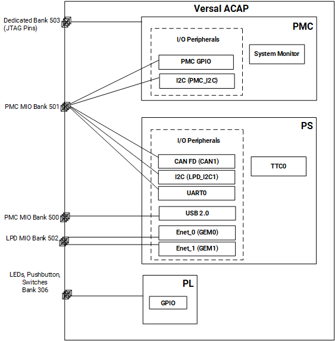

 <tr>
   <td align="center"><h1>2021.2 Versal JTAG Boot Tutorial</h1>
   </td>
 </tr>
</table>


# Table of Contents

1. Introduction

2. [Before You Begin](2BeforeYouBegin.md)

3. [Quick-Start Instructions](3QuickStartInstructions.md)

4. [Building Hardware Design](4BuildingHardwareDesign.md)

5. [Debug Resources](5DebugResources.md)

6. [Custom Board Bring-up Resources](6CustomBoardBringupResources.md)

7. [References](7References.md)


# Introduction
Versal™ ACAP combines adaptable processing and acceleration engines with programmable logic and configurable connectivity to enable custom, heterogeneous hardware solutions for a wide variety of applications in Data Center, automotive, 5G wireless, wired network, and defense. Versal ACAP supports several primary boot modes for application flexibility. This tutorial highlights the JTAG primary boot mode flow since it is commonly used to bring up a new board.

See [Quick-Start Instructions](3QuickStartInstructions.md) for the scripts used to generate the example tutorial reference design and instructions on how to program the VCK190 evaluation board with JTAG boot mode. Sample steps to set MIO/clock configurations for the reference design components are also provided. The reference design includes the Versal ACAP System Monitor, triple timer counter, platform management controller (PMC) peripherals, processing system (PS) peripherals, binary counters, and general purpose IO (GPIO). This reference design is created using the parts project type flow since that is the flow users would follow when creating their own custom board designs.

The [Debug Resources](5DebugResources.md) and [Custom Board Bring-up Resources](6CustomBoardBringupResources.md) section assists with custom board bring-up and debug. A script to read the Versal ACAP JTAG registers status and save the contents to a file for debug is provided.

## Objectives
After completing this tutorial, users should be able to:
* Understand the steps required for the JTAG boot mode flow.
* Build the tutorial reference design programmable device image (PDI).
* Program the VCK190 Versal device with the PDI in JTAG boot mode.
* Understand how to set PMC/PS peripheral configurations.
* Use JTAG registers for status and troubleshooting.
* Decode common BootROM and PLM error codes if encountered on new designs.
* Use resources for custom board bring-up and boot debug.

## Design Block Diagram

The JTAG boot tutorial scripts generate a Vivado reference design, which is detailed in the following diagram.

### Block diagram



The design block diagram includes the following components:

|Component|Description|
|  ---  |  ---  |
|PMC system monitor|Monitors system voltages and temperatures.|
|PL GPIO|Adaptable engine programmable logic (PL) GPIO, inputs (switches, pushbuttons) and outputs (counter LEDs).|
|PMC GPIO|PMC general purpose IO used for the system controller trigger and reset.|
|PMC_I2C|PMC I2C controller compatible with the I2C spec.|
|PS CAN_FD|Control area network flexible data-rate (CAN-FD) controller compatible with the CAN 2.0 spec.|
|PS TTC0| Processing system 32-bit triple timer counter|
|PS LPD_I2C1|PS I2C controller compatible with the I2C spec.|
|PS UART0|PS UART controller to support full-duplex asynchronous receiver and transmitter.|
|PS USB 2.0| PS USB 2.0 controller compliant with USB 2.0 spec.|
|PS GEM0|Gigabit Ethernet MAC (GEM) controller 0.|
|PS GEM1|Gigabit Ethernet MAC (GEM) controller 1.|


## Directory Structure Details
  

```
JTAG_BOOT
|___Design.................Contains Vivado design input constraints
  |___pl.xdc...........................PL GPIO constraints file
|___Images.................Contains images that appear in .md files
  |___blkdiagram.png...................Versal ACAP reference design block usage overview
  |___2_bootphase_steps.png.............Versal ACAP boot phases
  |___3_hwmgr_pdisel.png................PDI programming in Hardware Manager
  |___3_vck190_board.png...............VCK190 board view
  |___3_vck190_power_good_leds.jpg.....Power rails power good LEDs on VCK190
  |___3_vck190sw1.png.................JTAG boot mode setting
  |___3_vck190sw11.png................System Controller boot mode setting
  |___4_addcipsip.png..................Add CIPS IP
  |___4_addplxdc.png...................Add PL constraints files
  |___4_addsources.png.................Add PL source files
  |___4_axi_gpio.png...................AXI GPIO IP defined
  |___4_bincntr.png....................Binary Counter IP defined
  |___4_bincounter.png.................IP Integrator additions
  |___4_cips_interrupts.png............Interrupts enabled
  |___4_cips_io_pmci2c.png.............MIO peripheral setup
  |___4_cips_io_ps.png.................PS peripheral setup
  |___4_cips_plrefclks_ttc0.png........PL and TTC0 reference clocks
  |___4_cips_pmc_gpio_pulltype.png.....GPIO pull type
  |___4_cips_presetsetup.png...........Presets
  |___4_cips_ps_pmc.png................PS PMC setup
  |___4_cips_psplinterface.png.........PL-PS AXI setup
  |___4_cips_refclk.png................REF_CLK defined
  |___4_cips_sysmon_basicconfig.png....System Monitor basic setup
  |___4_cips_sysmon_supply.png.........System Monitor on-chip supply monitors setup
  |___4_cips_voltage.png...............MIO voltage setup
  |___4_cipscreatebd.png...............Vivado Create Block Diagram
  |___4_flow_nav.png....................Flow navigator steps
  |___4_projname.png...................Select project name  
  |___4_projtypertl.png................Select project type
  |___4_ps_rst.png.....................Processor System Reset IP defined
  |___4_runconnectauto.png.............IP connected        
  |___4_selectpart.png.................Versal part selection
  |___4_slice_ip.png...................Slice IP defined
  |___4_smart_connect.png..............Smartconnect IP defined
  |___4_vivadoblockdiagram2021_2.png...Vivado IP connectivity diagram
  |___4_vivadocreateproj.png...........Vivado project creation
  |___5_jtagpdi.png....................Reference design PDI components
  |___5_puttycomsetup.png..............PuTTY COM port setup
  |___5_sysmon_volt.png.................System Monitor voltage readings
|___Scripts................Contains TCL scripts to generate reference design and PDI, and to read JTAG registers
  |___create_jtag_refdesign.tcl........Generates the reference design PDI (runs place and route, implementation)
  |___load_jtag_pdi.tcl................Commands for Vivado Hardware Manager load PDI
  |___read_jtag_regs.tcl...............Commands to read Versal JTAG registers status to file that can be shared for debug
  |___run.tcl..........................Top tcl for project setup, calls create_jtag_refdesign.tcl
|___README.md...............Includes tutorial overview, steps to create reference design, and debug resources
```


## [Go To Next Section](2BeforeYouBegin.md)


© Copyright 2020-2022 Xilinx, Inc.

Licensed under the Apache License, Version 2.0 (the "License"); you may not use this file except in compliance with the License. You may obtain a copy of the License at

http://www.apache.org/licenses/LICENSE-2.0
Unless required by applicable law or agreed to in writing, software distributed under the License is distributed on an "AS IS" BASIS, WITHOUT WARRANTIES OR CONDITIONS OF ANY KIND, either express or implied. See the License for the specific language governing permissions and limitations under the License.
