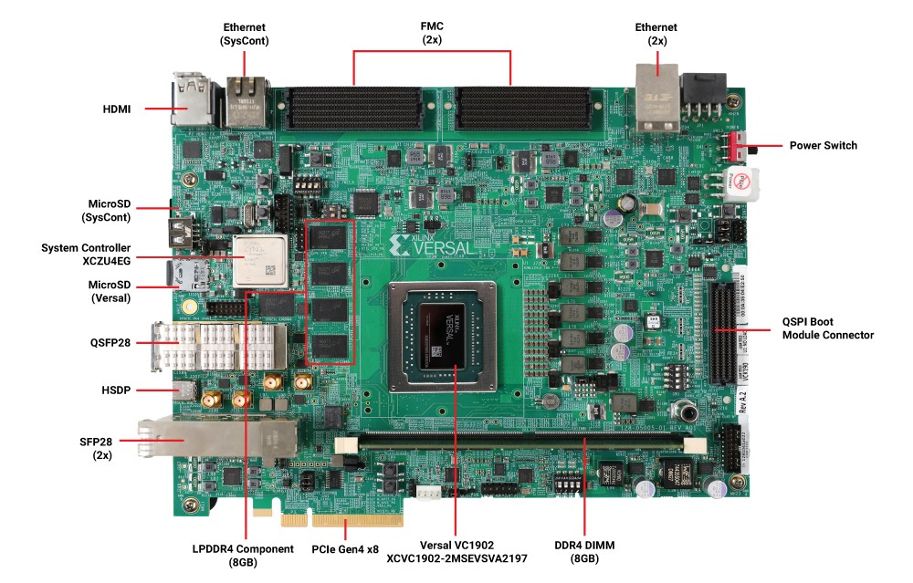
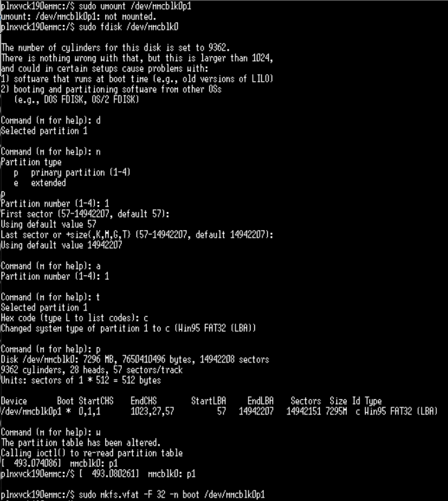
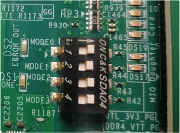
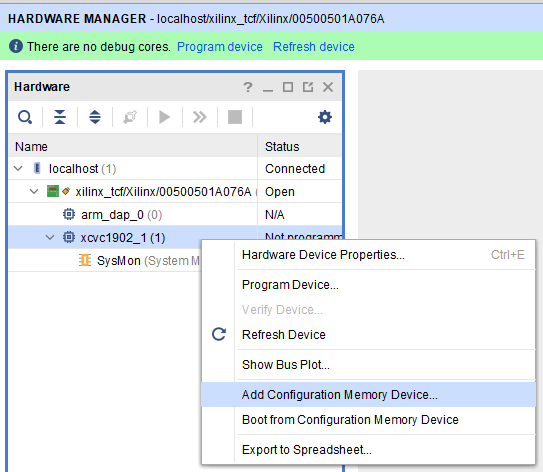
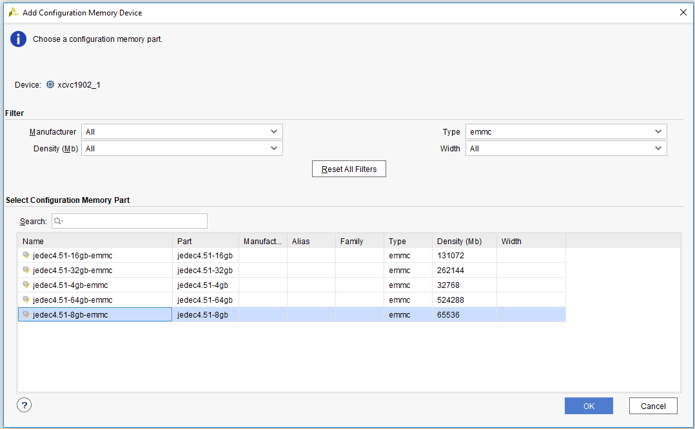
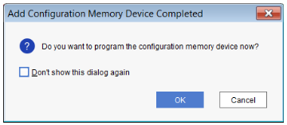
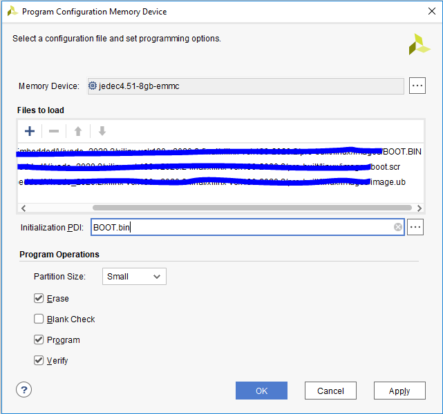

<table class="sphinxhide" width="100%">
 <tr width="100%">
    <td align="center"><h1>Versal™Boot and Configuration Tutorials</h1>
    <a href="https://www.xilinx.com/products/design-tools/vivado.html">See Vivado™ Development Environment on xilinx.com</a>
    </td>
 </tr>
</table>


# VCK190 eMMC Bring Up

***Version: Vivado 2022.1***

## Table of Contents

1. [Introduction](#introduction)

2. [Before You Begin](#before-you-begin)

3. [Building Hardware Design](#building-hardware-design)

4. [Building Software Design](#building-software-design)

5. [Running the Design](#running-the-design)

6. [Debugging the Design](#debugging-the-design)


## Introduction
Versal™ Adaptive SoC combines adaptable processing and acceleration engines with programmable logic and configurable connectivity to enable custom, heterogeneous hardware solutions for a wide variety of applications in Data Center, automotive, 5G wireless, wired network, and defense. Versal Adaptive SoC supports several primary boot modes for application flexibility.


#### Objectives
In order to use the eMMC Boot Module on the VCK190 the flash needs to be formatted and partitioned properly.
This page guides you through the first time usage of the eMMC flash in two cases:
- without Vivado HW Manager
- with Vivado HW Manager

This page can also be followed to recover a corrupted eMMC flash that doesn't boot up to Linux.
	

#### Design Block Diagram

The eMMC boot module will be put on the QSPI boot module connector.

###### <Block diagram name>



#### Directory Structure
<details>
<summary> Tutorial Directory Details </summary>

```
vck190_boot_emmc
|___Design.................Contains all the generated hardware and software design for this example
  |___Hardware.................Contains Vivado design 
  |___Software................Contains TCL scripts to generate reference design and PDI, and to read JTAG registers
    |___emmc........Directory that XSA for eMMC project will be written to
    |___sd1................Directory that XSA for SD card project will be written to
    |___user_dtsi...............Contains "system-user.dtsi" for petalinux projects
      |___system-user.dtsi.........................."system-user.dtsi" for petalinux projects
|___Scripts.................Contains TCL scripts to generate reference design, PDI/XSA, and text file with the commands to reconfigure eMMC
  |___cmd_to_reconfigure_emmc....................Contains the text file with the commands to reconfigure eMMC
    |___cmd_to_reconfigure_emmc.txt....................text file with the commands to reconfigure eMMC
  |___project_top_emmc.tcl....................Create vivado project for eMMC
  |___project_top_sd1.tcl.....................Create vivado project for SD card
  |___vck190_emmc_bd.tcl......................Create block design for eMMC
  |___vck190_sd1_bd.tcl..................Create block design for SD card
  |___xsa_generation_for_projects_emmc_and_sd1.tcl..............Top level scripts for eMMC and SD card vivado project, and it also run implement and write XSA for the projects
|___Figures.................Contains images to format eMMC in linux and hardware manager
  |___vck190_image.png...........................Image of vck190 board
  |___fdisk_commands.PNG...........................Image to format eMMC partitions in linux
  |___boot_modes_switch.PNG........................Image to select the boot modes switch
  |___add_config.PNG...............................Image to add configuration memory device
  |___config_mem.PNG...............................Image to add configuration memory device
  |___config_mem_ok.PNG............................Image to program memory device
  |___prog_mem.PNG.................................Image to program memory device
|___README.md...............Includes tutorial overview, steps to create reference design, and instructions to run the design
```
</details>

## Before You Begin

Recommended general knowledge of:
* VCK190 evaluation board
* Versal primary boot mode
* Versal PMC/PS peripherals
* Xilinx Vivado Design Suite

<details>

<summary> Key Versal Reference Documents </summary>

* VCK190 Evaluation Board User Guide [(UG1366)](https://docs.xilinx.com/r/en-US/ug1366-vck190-eval-bd/Revision-History)
* Versal Technical Reference Manual [(AM011)](https://docs.xilinx.com/r/en-US/am011-versal-acap-trm/Introduction)
* Versal System Software Developers User Guide [(UG1304)](https://docs.xilinx.com/r/2020.2-English/ug1304-versal-acap-ssdg/Revision-History)
* Petalinux Tools Reference Guide [(UG1144)](https://www.xilinx.com/support/documentation/sw_manuals/xilinx2020_2/ug1144-petalinux-tools-reference-guide.pdf)
* Versal Control Interfaces and Processing System (CIPS) [(PG352)](https://www.xilinx.com/cgi-bin/docs/ipdoc?c=versal_cips;v=latest;d=pg352-cips.pdf)

</details>

<details>

<summary> Versal Terms </summary>

|Term|Description|
|  ---  |  ---  |
|Platform management controller (PMC)|Manages Versal Adaptive SoC boot and the life cycle management of the device. The PMC ROM Code Unit (RCU) and platform processing unit (PPU) are responsible for booting the device.|
|ROM code unit (RCU)| Includes a microblaze processor that executes the BootROM to initiate the boot phase2: boot setup.|
|Platform processing unit (PPU)|Includes a microblaze processor that executes the platform loader and manager (PLM) to initiate the boot phase3: load platform.|
|Scalar engines|Includes the processing system (PS) Dual-Core ARM Cortex R5F and A72.|
|Adaptable engines|Includes Versal adaptable hardware also referred to in this tutorial as programmable logic (PL).|
|Control Interfaces and Processing System (CIPS)|CIPS LogiCORE IP sets the configuration of PMC/PS peripherals, clocks, and MIO.|
|BootROM|Responsible for initial security and boot mode interface checks. Reads and processes the PDI boot header. Releases the PMC PPU to complete the boot phases. See the Versal Technical Reference Manual [(AM011)](https://www.xilinx.com/support/documentation/architecture-manuals/am011-versal-acap-trm.pdf) for more detail on BootROM.|
|Platform loader and manager (PLM)|Responsible for the final boot phases to load the PDI. Executes supported platform management libraries and application user code. See the Versal System Software Developers User Guide [(UG1304)](https://www.xilinx.com/cgi-bin/docs/rdoc?v=latest;d=ug1304-versal-acap-ssdg.pdf) for more detail on the PLM.|
|Programmable device image (PDI)|Boot image for programming and configuring the Versal Adaptive SoC device. See the BootGen UG1283 for details on the format. See system software developers user guide for details on how PLM manages the images and partitions.|
|MIO| Multiplexed IO pins that can be configured for different peripherals and functions.|
|DIO| Dedicated IO pins dedicated for specific functions, such as JTAG (TCK, TMS, TDI, TDO) or power-on reset (POR_B).|

</details>

#### Tutorial Requirements
This tutorial is demonstrated on the VCK190 production evaluation board. To run this tutorial download the necessary files from the lounge and ensure you have the correct licenses installed. If you do not have a board and Vivado license contact your Xilinx sales representative. See [https://www.xilinx.com/products/boards-and-kits/vck190.html](https://www.xilinx.com/products/boards-and-kits/vck190.html) for more information.

Note: This tutorial targets the VCK190 evaluation board, but the methodology flow also applies to the VMK180 evaluation board.


##### Hardware Requirements

* Host machine with an operating system supported by Vivado Design Suite and Vitis 2022.1
* VCK190 production evaluation board, which includes:
  * Versal Adaptive SoC XCVC1902-2VSVA2197
  * AC power adapter (100-240VAC input, 12VDC 15.0A output).
  * System controller microSD card in socket (J302).
  * USB Type-C cable (for JTAG and UART communications).
  * eMMC boot module daughter card

###### Board Setup and Considerations
eMMC boot module is attached to vck190 board with FMC slot(J212), and the eMMC device connects with PMC MIO 0~11 through this FMC slot. 
That means QSPI should be disabled and only the SD1 controller can be used in vivado project either for SD or eMMC (but not at the same time).
We need boot from sd card and re-initialize SD1 controller and PMC MIO to eMMC configuration. 

On the approach using Vivado Hardware Manager, only a specific design for eMMC is needed.

Without using Vivado HW Manager, we need create two vivado projects for SD boot and eMMC boot.

###### **NOTE**:
The eMMC Boot Module is currently not available for customers but the steps highlighted in this example can be easily adopted for a custom board with eMMC connected to Versal. For more information about the Boot Modules contact your Xilinx representative or file a Service Request.

###### Software Requirements:
In order to build and run the tutorial reference design, the following must be available or installed:
  * Vivado Design Suite and Vitis 2022.1:
  	- Visit https://www.xilinx.com/support/download.html for the latest tool version.
  	- For more information on installing the Vivado Design Suite and Vitis, refer to [UG1400 Vitis Unified Software Platform Embedded Software Development](https://www.xilinx.com/support/documentation/sw_manuals/xilinx2020_2/ug1400-vitis-embedded.pdf).
  * Scripts to generate the reference design are provided in this example.
  * UART serial terminal recommended:
	- Vitis serial Terminal or a terminal emulator program for UART (i.e. Putty or Tera Term) can be used to display valuable PLM log boot status.  
    - When UART is not available, Vivado Design Suite and Vitis xsct/xsdb command line tools can be used to read the plm log after a boot attempt. 

###### Known issues and Limitations:

## Building Hardware Design  

#### Vivado
Be sure to source `settings.sh` for Vivado. 

Change current directory to `Script`, and run the following from the command line, it will create sd1 project and emmc project and export xsa to `Design/Software/sd1` and `Design/Software/emmc`:

`vivado -source xsa_generation_for_projects_emmc_and_sd1.tcl`

## Building Software Design 

#### Petalinux
Enter the `Design/Software/sd1` directory. Here the Petalinux steps to create the SW components ("BOOT.BIN", "boot.scr" and "image.ub") for SD1:

`petalinux-create -t project --template versal --name plnx_vck190_sd1`

`cd plnx_vck190_sd1/`

`petalinux-config --get-hw-description=/<directory-to-sd-boot-xsa>`

To enable ethernet, need to add phy node in device tree by replacing the "system-user.dtsi" in petalinux project.

`cp ../../../user_dtsi/system-user.dtsi ./project-spec/meta-user/recipes-bsp/device-tree/files/system-user.dtsi` 

`petalinux-build`

`petalinux-package --boot --uboot`
  
Enter the `Design/Software/emmc` directory, and the SW components ("BOOT.BIN", "boot.scr" and "image.ub") for eMMC:

`petalinux-create -t project --template versal --name plnx_vck190_emmc`

`cd plnx_vck190_emmc/`

`petalinux-config --get-hw-description=/<directory-to-emmc-boot-xsa>`

To enable ethernet, need to add phy node in device tree by replacing the "system-user.dtsi" in petalinux project.

`cp ../../../user_dtsi/system-user.dtsi ./project-spec/meta-user/recipes-bsp/device-tree/files/system-user.dtsi` 

`petalinux-build`

`petalinux-package --boot --uboot`

## Running the Design

#### **Running the Design without using Vivado Hardware Manager**

Here is brief list of steps to initialize eMMC after booting from SD card.

###### **Boot u-boot from SD card:**

Step ##1. Open the UART Console for the Versal device

Step ##2. Copy the "BOOT.BIN" for sd boot to sd card, Copy the "image.ub" for emmc boot to sd card. Boot in sd mode (SW1[1:4]=1110, which sets pins MODE[0:3]=1110). 

###### **Load "image.ub" for eMMC boot to ddr memory from the u-boot console:**

Step ##3. Run below command in u-boot console.

`fatload mmc ${devnum}:${distro_bootpart} 0x10000000 image.ub`

###### **Re-initialize SD1 controller and PMC MIO 0~11 for eMMC using the commands in emmc_pmc_reconfig.txt from the u-boot console:**

Step ##4. Copy the commands in `Scripts/cmd_to_reconfigure_emmc/emmc_pmc_reconfig.txt` to u-boot console, and run them all.

######## **NOTE:**
The commands in "emmc_pmc_reconfig.txt" are generated by compare the register differece between "pmc_data.cdo" files for sd boot and emmc boot.

###### **Boot the "image.ub" specific for eMMC boot:**

Step ##5. Run below command in u-boot console, and it will boot linux.

`bootm 0x10000000` 

###### **Format the eMMC device with partition, from the Linux console:**

Step ##6. In linux console, re-format and re-partition the eMMC to its max capacity

Be sure to unmount the eMMC before using fdisk.



###### **copy eMMC boot images from host with tftp to eMMC partition:**

Step ##7. Setup tftpd server in host, and configure IP with ifconfig in linux on the board.

         - setup IP address for GEM0, `ifconfig eth0 192.168.1.10`
         
         - connect ethernet cable between RJ45 slot J307(upper) and host, setup IP address '192.168.1.100' in host, test ping
         
         - setup tftp server in host, and set tftp server folder to directory of eMMC boot images

Step ##8. Copy the boot images for emmc boot from tftpd server to eMMC partition.

         - `plnxvck190emmc:/mnt$ sudo mount /dev/mmcblk0p1 /mnt`
		 
		 - `plnxvck190emmc:/mnt$ tftp -g 192.168.1.100 -r BOOT.BIN`
         
         - `plnxvck190emmc:/mnt$ tftp -g 192.168.1.100 -r boot.scr`
         
         - `plnxvck190emmc:/mnt$ tftp -g 192.168.1.100 -r image.ub`

Step ##9. Umount the eMMC partition, and power off the board.


###### **Power again to boot from eMMC:**

Step ##10. After changing the boot mode pins to eMMC (SW1[1:4]=0110, which sets pins MODE[0:3]=0110), power on the board.

         - After linux boot, you can see below linux prompt which indicates this is eMMC image.
           
           plnxvck190emmc:/mnt$


#### **Running the Design using Vivado Hardware Manager**

Here is brief list of steps to initialize eMMC using Vivado HW Manager.
For additional details refer to UG980 “Programming and Debugging”. There a chapter dedicated to “Programming Configuration Memory Devices”.

Step ##1.	Before you begin, ensure the SW13 power switch is off.

Step ##2.	Connect the power cable to the VCK190 J16.

Step ##3.	Connect the USB-C cable used for JTAG/UART from your host system (where Vivado is installed) to VCK190 J207.

Step ##4.	Set the Versal Adaptive SoC to JTAG Boot Mode SW1[1:4]=0000 (which sets pins MODE[0:3]=0000) (All Up).


 
Step ##5.	Set SW13 to the ON position.

Step ##6.	Check that the power good (PG) LEDs are all on, except the VCC_RAM PG LED is off and reserved LEDs (reserved LEDs can be on or off).

Step ##7.	Open the 2022.1 Vivado Hardware Manager.

Step ##8.	Select Open New Target and connect the VCK190.

Step ##9.	Right-click Versal device xcvc1902_1 and select Add Configuration Memory Device



Step ##10.	configuration memory part and click OK. The configuration memory device is now added to the hardware target device.



Step ##11.	After creating the configuration memory device, Vivado device programmer prompts "Do you want to program the configuration memory device now?" as shown below.



Step ##12.	Click OK to open the Program Configuration Memory Device dialog box. Populate the "Files to load" with the SW components ("BOOT.BIN", "boot.scr" and "image.ub") for eMMC. Use the same BOOT.bin for eMMC as "Initialization PDI" as shown in the figure below.



Step ##13.	Click Apply and OK.

Step ##14.	Wait for the programming to finish.

Step ##15.	After changing the boot mode pins to eMMC (SW1[1:4]=0110 - which sets pins MODE[0:3]=0110), power on the board.

## Debugging the Design 

<hr class="sphinxhide"></hr>

<p class="sphinxhide" align="center"><sub>Copyright © 2020–2024 Advanced Micro Devices, Inc.</sub></p>

<p class="sphinxhide" align="center"><sup><a href="https://www.amd.com/en/corporate/copyright">Terms and Conditions</a></sup></p>
