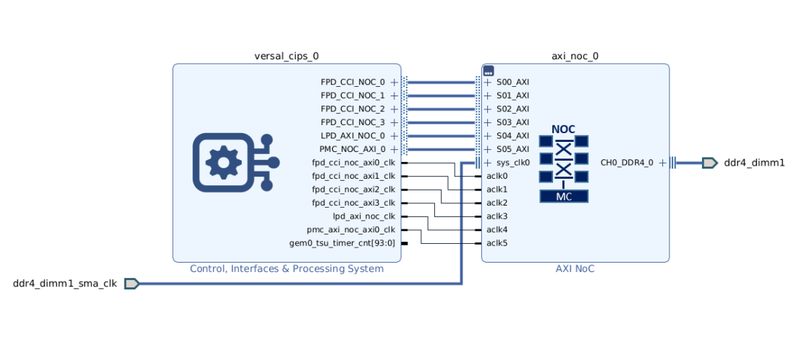
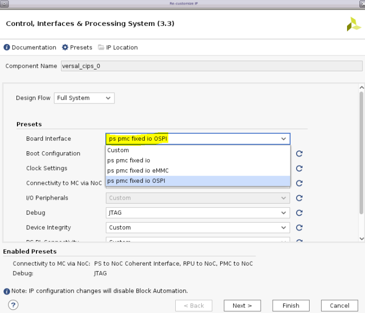

<tr>
   <td align="center"><h1>2023.1 Versal OSPI Boot Tutorial </h1>
   </td>
 </tr>
</table>

# Table of Contents

1. [Introduction](#introduction)

2. [Before You Begin](#before-you-begin)

3. [Building Hardware Design](#building-hardware-design)

4. [Building Software Design](#building-software-design)

5. [Running the Design](#running-the-design)

# Introduction
Versal Adaptive SoC combines adaptable processing and acceleration engines with programmable logic and configurable connectivity to enable custom, heterogeneous hardware solutions for a wide variety of applications in Data Center, automotive, 5G wireless, wired network, and defense. Versal Adaptive SoC supports several primary boot modes for application flexibility. This tutorial highlights the OSPI primary boot mode flow in single mode.

The octal SPI (OSPI) boot mode has an SPI compatible serial bus interface with extended octal commands. Standard Serial Peripheral Interface (SPI) is supported along with high performance Octal SPI variants. The OSPI boot mode supports an 8-bit data bus width and single transfer rate (STR) during the RCU BootROM execution. The Octal-SPI Flash Controller transfer the data either in a memory mapped direct fashion or in an indirect fashion where the controller is set up via configuration registers to silently perform some requested operation, signaling its completion via interrupts or status registers.

## Design Block Diagram

 


## Directory Structure
<details>
<summary> Tutorial Directory Details </summary>

```
OSPI_Boot
|___Design.................Contains Design files
  |___Software/Vitis...................Contains Vitis Design files
                |___bootimage......................Contains bootimage files
                |___src............................Contains Software source files
|___Figures................Contains figures that appear in README.md
  |___Block.PNG........................Block Diagram
  |___Board_interface.PNG...........OSPI Configurations
|___Scripts................Contains TCL scripts to generate reference Design, PDI, etc...
  |___project_top.tcl..................Generates the Vivado Design
  |___vck190_bd.tcl....................Generates the VVivado Block Diagram
  |___vck190_vitis.tcl.................Generates the Vitis Design
|___README.md...............Includes tutorial overview, steps to create reference design, and debug resources
```
</details>

# Before You Begin

Recommended general knowledge of:
* VCK190 evaluation board
* Versal OSPI boot mode 
* Versal PMC
* AMD Vivado Design Suite 
* AMD Vites IDE

<details>

<summary> Key Versal Reference Documents </summary>

* VCK190 Evaluation Board User Guide [(UG1366)](https://docs.xilinx.com/r/en-US/ug1366-vck190-eval-bd))
* Versal Technical Reference Manual [(AM011)](https://www.xilinx.com/support/documentation/architecture-manuals/am011-versal-acap-trm.pdf)
* Versal System Software Developers User Guide [(UG1304)](https://www.xilinx.com/cgi-bin/docs/rdoc?v=latest;d=ug1304-versal-acap-ssdg.pdf)
* Versal Control Interfaces and Processing System (CIPS) [(PG352)](https://www.xilinx.com/cgi-bin/docs/ipdoc?c=versal_cips;v=latest;d=pg352-cips.pdf)

</details>

<details>

<summary> Versal Terms </summary>

|Term|Description|
|  ---  |  ---  |
|Platform management controller (PMC)|Manages Versal ACAP boot and the life cycle management of the device. The PMC ROM Code Unit (RCU) and platform processing unit (PPU) are responsible for booting the device.|
|ROM code unit (RCU)| Includes a microblaze processor that executes the BootROM to initiate the boot phase2: boot setup.|
|Platform processing unit (PPU)|Includes a microblaze processor that executes the platform loader and manager (PLM) to initiate the boot phase3: load platform.|
|Scalar engines|Includes the processing system (PS) Dual-Core ARM Cortex R5F and A72.|
|Adaptable engines|Includes Versal adaptable hardware also referred to in this tutorial as programmable logic (PL).|
|Control Interfaces and Processing System (CIPS)|CIPS LogiCORE IP sets the configuration of PMC/PS peripherals, clocks, and MIO.|
|BootROM|Responsible for initial security and boot mode interface checks. Reads and processes the PDI boot header. Releases the PMC PPU to complete the boot phases. See the Versal Technical Reference Manual [(AM011)](https://www.xilinx.com/support/documentation/architecture-manuals/am011-versal-acap-trm.pdf) for more detail on BootROM.|
|Platform loader and manager (PLM)|Responsible for the final boot phases to load the PDI. Executes supported platform management libraries and application user code. See the Versal System Software Developers User Guide [(UG1304)](https://www.xilinx.com/cgi-bin/docs/rdoc?v=latest;d=ug1304-versal-acap-ssdg.pdf) for more detail on the PLM.|
|Programmable device image (PDI)|Boot image for programming and configuring the Versal Adaptive SoC device. See the BootGen UG1283 for details on the format. See system software developers user guide for details on how PLM manages the images and partitions.|
|MIO| Multiplexed IO pins that can be configured for different peripherals and functions.|
|DIO| Dedicated IO pins dedicated for specific functions, such as JTAG (TCK, TMS, TDI, TDO) or power-on reset (POR_B).|

</details>

## Tutorial Requirements
Note: This tutorial targets the VCK190 evaluation board, but the methodology flow also applies to the VMK180 evaluation board.


#### Hardware Requirements:

* Host machine with an operating system supported by Vivado Design Suite and Vitis 2023.1
* VCK190 Evaluation Board, which includes:
  * Versal Adaptive SoC XCVC1902-2VSVA2197
  * AC power adapter (100-240VAC input, 12VDC 15.0A output).
  * System controller microSD card in socket (J302).
  * USB Type-C cable (for JTAG and UART communications).
  * Boot Module X-EBM-03 (OSPI)
    
#### **NOTE**:
The Boot Module is currently not available for customers but the steps highlighted in this example can be easily adopted  for a custom board with OSPI connected to Versal. For more information about the Boot Modules contact your AMD representative or file a Service Request.
    
#### Software Requirements:
In order to build and run the tutorial reference design, the following must be available or installed:
  * Vivado Design Suite and Vitis 2023.1:
  	- Visit https://www.xilinx.com/support/download.html for the latest tool version.
  	- For more information on installing the Vivado Design Suite and Vitis, refer to [UG1400 Vitis Unified Software Platform Embedded Software Development](https://www.xilinx.com/support/documentation/sw_manuals/xilinx2023_1/ug1400-vitis-embedded.pdf).
  * Scripts to generate the reference design are provided in the `Scripts` directory 
  * UART serial terminal recommended:
	- Vitis serial Terminal or a terminal emulator program for UART (i.e. Putty or Tera Term) can be used to display valuable PLM log boot status.  
    - When UART is not available, Vivado Design Suite and Vitis xsct/xsdb command line tools can be used to read the plm log after a boot attempt.

# Building Hardware Design  

## Vivado

To set up the Vivado environment:
* Windows 32-bit: Run the settings32.bat from the Vivado/2023.1 directory
* Windows 34-bit: Run the settings64.bat from the Vivado/2023.1 directory
* Linux 32-bit: Run the settings32.sh from the Vivado/2023.1 directory
* Linux 64-bit: Run the settings64.sh from the Vivado/2023.1 directory

Enter the `Scripts` directory. From the command line run the following to create the project:

`vivado -source project_top.tcl`

The Vivado project will be built in the `Design/Hardware` directory.

Once Vivado opens and the project is created, click on "Generate Device Image".

Wait until "Device Image Generation successfully completed" then "Open Implemented Design".
Exporting the XSA to the Software folder with the following TCL command:
```
write_hw_platform -fixed -include_bit -force -file ../Design/Software/vck190_wrapper.xsa
```
# Building Software Design 

## Vitis

To set up the Vitis environment:
* Windows 32-bit: Run the settings32.bat from the Vitis/2023.1 directory
* Windows 34-bit: Run the settings64.bat from the Vitis/2023.1 directory
* Linux 32-bit: Run the settings32.sh from the Vitis/2023.1 directory
* Linux 64-bit: Run the settings64.sh from the Vitis/2023.1 directory

Enter the `Scripts` directory. From the command line run the following:

`xsct -eval source vck190_vitis.tcl`

The Vitis project will be built in the `Design/Software/Vitis` directory.

Launch the Vitis software platform and set the workspace path to `Design/Software/Vitis`.

The BootROM operates the OSPI in SDR (Single Data Rate) mode and the PLM operates the OSPI in DDR (Double data rate) mode. So the OSPI mode would be switched to DDR when the PLM is executed.

The default OSPI reference clock frequency is 200MHz which can be set in OSPI clock configurations from Vivado and the prescaler value of OSPI clock is 2. Hence the OSPI device clock frequency would be 100MHz. If user wants to change OSPI device clock frequency, the prescaler value can be modified in xloader_ospi.c file.

Apply the following modification to the project. Pre-modified files are present in the `Design/Software/Vitis/src` folder.

#### **PLM modification**:
In xloader_ospi.c (Design/Software/Vitis/vck190_wrapper/psv_pmc_0/standalone_psv_pmc_0/bsp/psv_pmc_0/libsrc/xilloader_v1_8/src/xloader_ospi.c), change the OSPI presacle to 4 (default was 2) to get OSPI device clock frequency 50MHz.
```
XOspiPsv_SetClkPrescaler(&OspiPsvInstance,
	XOSPIPSV_CLK_PRESCALE_4);
```
To ensure with the modifications, dump the OSPI configuration register and verify.
```
xsdb% mrd 0x00F1010000
F1010000: 8108BC09
```
#### **SW Application modification**:
In helloworld.c (../Software/Vitis/hello_a72_0/src), add a delay to avoid application prints collide with the PLM prints.
```
 sleep(1);
 print("Hello World\n\r");
 print("Successfully ran Hello World application from OSPI.");
 ```
 Be sure to re-build the Hello world application after the changes are applied.

#### **Generate a Boot Image (PDI)**:
Generate a Boot Image (PDI) using the following bootgen command and the output.bif already present in the `Design/Software/Vitis/bootimage` folder:
```
bootgen -arch versal -image output.bif -o BOOT.PDI -w
```
output.bif:
```
/*vck190_ospi*/
the_ROM_image:
{
	image 
	{
		{ type=bootimage, file= ../vck190_wrapper/hw/vck190_wrapper.pdi  } 
		{ type=bootloader, file= ../plm/Debug/plm.elf  } 
	}
	image
	{
		name=apu_subsystem
		id = 0x1c000000
		{ core=a72-0, exception_level=el-3, trustzone, file= ../hello_a72_0/Debug/hello_a72_0.elf } 
	}
}
```
## **Running the Design**
#### **NOTE**:
Find vck190_wrapper.pdi in vivado project build directory and name it `vck190_ospi_prog.pdi` and use it in the flash programming steps below to make it faster.

Execute the following command on XSCT in order to program the BOOT.PDI file into OSPI flash. AMD strongly recommend to boot the Versal Device in JTAG boot mode (SW1 = 0000 (all ON)) to reliably program the OSPI.
```
xsct% exec program_flash -f BOOT.PDI -pdi vck190_ospi_prog.pdi -offset 0x0 -flash_type ospi-x8-single
```
#### **Flash programming log**:
```

xsdb% exec program_flash -f BOOT.PDI -pdi vck190_ospi_prog.pdi -offset 0x0 -flash_type ospi-x8-single
                                                                                
****** Program Flash
****** Program Flash v2023.1 (64-bit)
  **** SW Build (by xbuild) on 2023-05-03-16:48:11
    ** Copyright 1986-2022 Xilinx, Inc. All Rights Reserved.
    ** Copyright 2022-2023 Advanced Micro Devices, Inc. All Rights Reserved.

                                                                                
Connected to hw_server @ TCP:localhost:3121
                                                                                
Target not specified. Selecting target_id 2 (arm_dap) by default.

Retrieving Flash info...
                                                                                
Initialization done
Using default mini u-boot image file - /proj/xbuilds/2023.1_daily_latest/installs/lin64/Vitis/2023.1/data/xicom/cfgmem/uboot/versal_ospi_x8_single.bin
                                                                                

U-Boot 2023.01-g8624651 (Mar 14 2023 - 23:24:43 -0600)

Model: Xilinx Versal MINI OSPI SINGLE
DRAM:  WARNING: Initializing TCM overwrites TCM content
256 KiB
EL Level:	EL3
Core:  7 devices, 7 uclasses, devicetree: separate
Loading Environment from <NULL>... OK
Versal> sf probe 0 0 0
SF: Detected mt35xu02g with page size 256 Bytes, erase size 128 KiB, total 256 MiB
Versal> Sector size = 131072.
Total size = 268435456.
f probe 0 0 0
Performing Erase Operation...
sf erase 0 1E0000
SF: 1966080 bytes @ 0x0 Erased: OK                                              
Versal> Erase Operation successful.
INFO: [Xicom 50-44] Elapsed time = 3 sec.
Performing Program Operation...
0%...sf write FFFC0000 0 10000                                                  
device 0 offset 0x0, size 0x10000
SF: 65536 bytes @ 0x0 Written: OK                                               
Versal> sf write FFFC0000 10000 10000                                           
device 0 offset 0x10000, size 0x10000
SF: 65536 bytes @ 0x10000 Written: OK                                           
Versal> sf write FFFC0000 20000 10000                                           
device 0 offset 0x20000, size 0x10000
SF: 65536 bytes @ 0x20000 Written: OK                                           
Versal> 10%...sf write FFFC0000 30000 10000                                     
device 0 offset 0x30000, size 0x10000
SF: 65536 bytes @ 0x30000 Written: OK                                           
Versal> sf write FFFC0000 40000 10000                                           
device 0 offset 0x40000, size 0x10000
SF: 65536 bytes @ 0x40000 Written: OK                                           
Versal> sf write FFFC0000 50000 10000                                           
device 0 offset 0x50000, size 0x10000
SF: 65536 bytes @ 0x50000 Written: OK                                           
Versal> sf write FFFC0000 60000 10000                                           
device 0 offset 0x60000, size 0x10000
SF: 65536 bytes @ 0x60000 Written: OK                                           
Versal> sf write FFFC0000 70000 10000                                           
device 0 offset 0x70000, size 0x10000
SF: 65536 bytes @ 0x70000 Written: OK                                           
Versal> sf write FFFC0000 80000 10000                                           
device 0 offset 0x80000, size 0x10000
SF: 65536 bytes @ 0x80000 Written: OK                                           
Versal> sf write FFFC0000 90000 10000                                           
device 0 offset 0x90000, size 0x10000
SF: 65536 bytes @ 0x90000 Written: OK                                           
Versal> sf write FFFC0000 A0000 10000                                           
device 0 offset 0xa0000, size 0x10000
SF: 65536 bytes @ 0xa0000 Written: OK                                           
Versal> sf write FFFC0000 B0000 10000                                           
device 0 offset 0xb0000, size 0x10000
SF: 65536 bytes @ 0xb0000 Written: OK                                           
Versal> sf write FFFC0000 C0000 10000                                           
device 0 offset 0xc0000, size 0x10000
SF: 65536 bytes @ 0xc0000 Written: OK                                           
Versal> sf write FFFC0000 D0000 10000                                           
device 0 offset 0xd0000, size 0x10000
SF: 65536 bytes @ 0xd0000 Written: OK                                           
Versal> 50%...sf write FFFC0000 E0000 10000                                     
device 0 offset 0xe0000, size 0x10000
SF: 65536 bytes @ 0xe0000 Written: OK                                           
Versal> sf write FFFC0000 F0000 10000                                           
device 0 offset 0xf0000, size 0x10000
SF: 65536 bytes @ 0xf0000 Written: OK                                           
Versal> sf write FFFC0000 100000 10000                                          
device 0 offset 0x100000, size 0x10000
SF: 65536 bytes @ 0x100000 Written: OK                                          
Versal> 60%...sf write FFFC0000 110000 10000                                    
device 0 offset 0x110000, size 0x10000
SF: 65536 bytes @ 0x110000 Written: OK                                          
Versal> sf write FFFC0000 120000 10000                                          
device 0 offset 0x120000, size 0x10000
SF: 65536 bytes @ 0x120000 Written: OK                                          
Versal> sf write FFFC0000 130000 10000                                          
device 0 offset 0x130000, size 0x10000
SF: 65536 bytes @ 0x130000 Written: OK                                          
Versal> sf write FFFC0000 140000 10000                                          
device 0 offset 0x140000, size 0x10000
SF: 65536 bytes @ 0x140000 Written: OK                                          
Versal> sf write FFFC0000 150000 10000                                          
device 0 offset 0x150000, size 0x10000
SF: 65536 bytes @ 0x150000 Written: OK                                          
Versal> sf write FFFC0000 160000 10000                                          
device 0 offset 0x160000, size 0x10000
SF: 65536 bytes @ 0x160000 Written: OK                                          
Versal> sf write FFFC0000 170000 10000                                          
device 0 offset 0x170000, size 0x10000
SF: 65536 bytes @ 0x170000 Written: OK                                          
Versal> sf write FFFC0000 180000 10000                                          
device 0 offset 0x180000, size 0x10000
SF: 65536 bytes @ 0x180000 Written: OK                                          
Versal> sf write FFFC0000 190000 10000                                          
device 0 offset 0x190000, size 0x10000
SF: 65536 bytes @ 0x190000 Written: OK                                          
Versal> sf write FFFC0000 1A0000 10000                                          
device 0 offset 0x1a0000, size 0x10000
SF: 65536 bytes @ 0x1a0000 Written: OK                                          
Versal> sf write FFFC0000 1B0000 10000                                          
device 0 offset 0x1b0000, size 0x10000
SF: 65536 bytes @ 0x1b0000 Written: OK                                          
Versal> 100%
sf write FFFC0000 1C0000 5D90                                                   
device 0 offset 0x1c0000, size 0x5d90
SF: 23952 bytes @ 0x1c0000 Written: OK                                          
Versal> Program Operation successful.
INFO: [Xicom 50-44] Elapsed time = 14 sec.

Flash Operation Successful

```
#### **Boot the Boot Image (PDI) from OSPI**:
There are two ways to test the design once the OSPI is programmed.

##### **Method #1**:
Change the Versal Device boot mode to OSPI (SW1[1:4] = 0001 (ON-ON-ON-OFF)) and power on the board.

##### **Method #2**: 
Change the Versal Device boot mode to JTAG (SW1[1:4] = 0000 (ON-ON-ON-ON)), power on the board and run the following script:
```
tar -set -filter {name =~ "Versal *"}
# Enable ISO
mwr -force 0xf1120000 0xffbff
# Switch boot mode
mwr 0xf1260200 0x8100
mrd 0xf1260200
# Set MULTIBOOT address to 0
mwr -force 0xF1110004 0x0
# SYSMON_REF_CTRL is switched to NPI by user PDI so ensure its
# switched back
mwr -force 0xF1260138 0
mwr -force 0xF1260320 0x77
# Perform reset
tar -set -filter {name =~ "PMC"}
rst
```
This script change the boot mode from JTAG to OSPI without the need of power cycle the board.

#### **PLM log when booting from OSPI**:
To see the PLM Log the user can look at the UART console or use the XSDB command "plm log" from target 1 (`tar -set -filter {name =~ "Versal *"}`):

``` 
 Sep 26 2023  -  09:53:16
[0.120]Platform Version: v2.0 PMC: v2.0, PS: v2.0
[0.162]BOOTMODE: 0x8, MULTIBOOT: 0x0
[0.192]****************************************
[0.418]Non Secure Boot
[3.394]PLM Initialization Time 
[3.423]***********Boot PDI Load: Started***********
[3.462]Loading PDI from OSPI
[3.489]Monolithic/Master Device
[3.591]FlashID=0x2C 0x5B 0x1C
[4.878]OSPI mode switched to DDR
[6.205]2.736 ms: PDI initialization time
[6.242]+++Loading Image#: 0x1, Name: lpd, Id: 0x04210002
[6.288]---Loading Partition#: 0x1, Id: 0xC
[61.679] 55.347 ms for Partition#: 0x1, Size: 3104 Bytes
[66.548]---Loading Partition#: 0x2, Id: 0xB
[71.056] 0.672 ms for Partition#: 0x2, Size: 64112 Bytes
[75.501]+++Loading Image#: 0x2, Name: pl_cfi, Id: 0x18700000
[80.601]---Loading Partition#: 0x3, Id: 0x3
[127.956] 43.513 ms for Partition#: 0x3, Size: 707824 Bytes
[130.344]---Loading Partition#: 0x4, Id: 0x5
[168.125] 33.857 ms for Partition#: 0x4, Size: 561392 Bytes
[170.524]+++Loading Image#: 0x3, Name: fpd, Id: 0x0420C003
[175.625]---Loading Partition#: 0x5, Id: 0x8
[179.970] 0.422 ms for Partition#: 0x5, Size: 1616 Bytes
[184.776]+++Loading Image#: 0x4, Name: apu_subsystem, Id: 0x1C000000
[190.445]---Loading Partition#: 0x6, Id: 0x0
[194.776] 0.410 ms for Partition#: 0x6, Size: 163920 Bytes
[199.517]***********Boot PDI Load: Done***********
[203.905]34.438 ms: ROM Time
[206.453]Total PLM Boot Time 
Hello World
Successfully ran Hello World application

```

## **Conclusion**

The design steps and build instructions are used to create an OSPI boot image and the new bif format helps to add user partitions. The plm boot log gives partitions load information with the boot times.

© Copyright [2020] Xilinx, Inc. All rights reserved.
