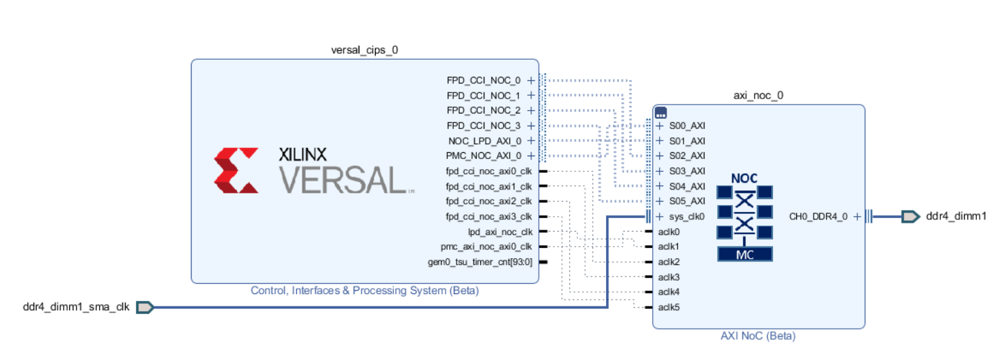
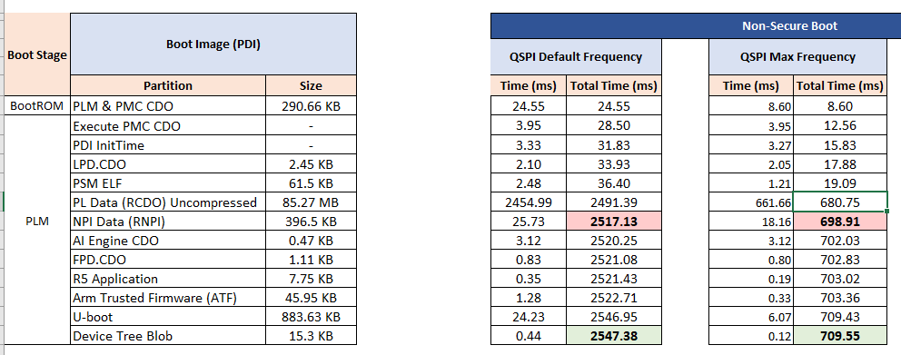
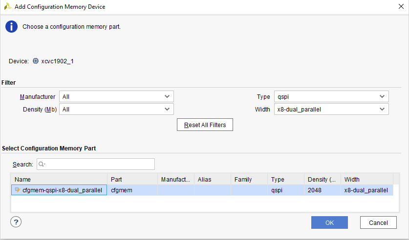
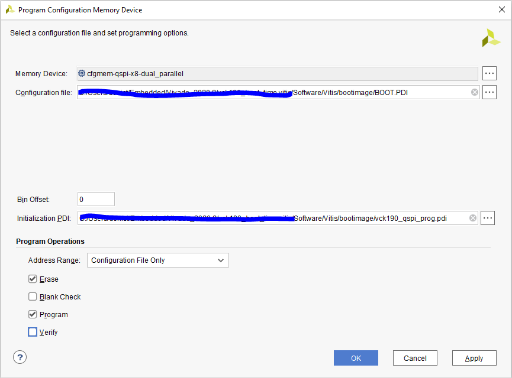

<table class="sphinxhide" width="100%">
 <tr width="100%">
    <td align="center"><h1>Versal™Boot and Configuration Tutorials</h1>
    <a href="https://www.xilinx.com/products/design-tools/vivado.html">See Vivado™ Development Environment on xilinx.com</a>
    </td>
 </tr>
</table>


# Boot Time From Dual Parallel QSPI

***Version: Vivado 2021.1***


## Table of Contents

1. [Introduction](#introduction)

2. [Before You Begin](#before-you-begin)

3. [Building Hardware Design](#building-hardware-design)

4. [Building Software Design](#building-software-design)

5. [Running the Design](#running-the-design)

## Introduction
Versal™ Adaptive SoC combines adaptable processing and acceleration engines with programmable logic and configurable connectivity to enable custom, heterogeneous hardware solutions for a wide variety of applications in Data Center, automotive, 5G wireless, wired network, and defense. Versal Adaptive SoC supports several primary boot modes for application flexibility. This tutorial highlights the way to measure the boot time from dual parallel qspi.
	
### Objectives
The goal is to be able to build a VCK190 design (QSPI dual Parallel) to reproduce the boot times outlined in the boot time estimator spreadsheet. What optimizations can provide the best Boot Time improvement for boot time critical designs?

### Design Block Diagram



### Directory Structure
<details>
<summary> Tutorial Directory Details </summary>

```
JTAG_Boot
|___Design.................Contains Design files
  |___Hardware.........................Contains Hardware Design files
    |___constraints....................Contains constraints files
  |___Software/Vitis...................Contains Vitis Design files
    |___bootimage......................Contains bootimage files
    |___src............................Contains Software source files
|___Figures................Contains figures that appear in README.md
  |___add_config_device.png............Add Configuration Memory Device
  |___block.png........................Block Diagram
  |___prog_config_device.png...........Program Configuration Memory Device
  |___time_estimator.png...............Time Estimator
|___Scripts................Contains TCL scripts to generate reference Design, PDI, etc...
  |___project_top.tcl..................Generates the Vivado Design
  |___vck190_bd.tcl....................Generates the VVivado Block Diagram
  |___vck190_vitis.tcl.................Generates the Vitis Design
|___README.md...............Includes tutorial overview, steps to create reference design, and debug resources
```
</details>

## Before You Begin

Recommended general knowledge of:
* VCK190 evaluation board
* Versal QSPI boot mode 
* Versal PMC
* Xilinx Vivado Design Suite 
* Xilinx Vites IDE

<details>

<summary> Key Versal Reference Documents </summary>

* VCK190 Evaluation Board User Guide [(UG1366)](file:///C:/Docs/UGs/Boards_UG/ug1366-vck190-eval-bd-102720-XART_review.pdf)
* Versal Technical Reference Manual [(AM011)](https://www.xilinx.com/support/documentation/architecture-manuals/am011-versal-acap-trm.pdf)
* Versal System Software Developers User Guide [(UG1304)](https://www.xilinx.com/cgi-bin/docs/rdoc?v=latest;d=ug1304-versal-acap-ssdg.pdf)
* Versal Control Interfaces and Processing System (CIPS) [(PG352)](https://www.xilinx.com/cgi-bin/docs/ipdoc?c=versal_cips;v=latest;d=pg352-cips.pdf)

</details>

<details>

<summary> Versal Terms </summary>

|Term|Description|
|  ---  |  ---  |
|Platform management controller (PMC)|Manages Versal Adaptive SoC boot and the life cycle management of the device. The PMC ROM Code Unit (RCU) and platform processing unit (PPU) are responsible for booting the device.|
|ROM code unit (RCU)| Includes a microblaze processor that executes the BootROM to initiate the boot phase2: boot setup.|
|Platform processing unit (PPU)|Includes a microblaze processor that executes the platform loader and manager (PLM) to initiate the boot phase3: load platform.|
|Scalar engines|Includes the processing system (PS) Dual-Core ARM Cortex R5F and A72.|
|Adaptable engines|Includes Versal adaptable hardware also referred to in this tutorial as programmable logic (PL).|
|Control Interfaces and Processing System (CIPS)|CIPS LogiCORE IP sets the configuration of PMC/PS peripherals, clocks, and MIO.|
|BootROM|Responsible for initial security and boot mode interface checks. Reads and processes the PDI boot header. Releases the PMC PPU to complete the boot phases. See the Versal Technical Reference Manual [(AM011)](https://www.xilinx.com/support/documentation/architecture-manuals/am011-versal-acap-trm.pdf) for more detail on BootROM.|
|Platform loader and manager (PLM)|Responsible for the final boot phases to load the PDI. Executes supported platform management libraries and application user code. See the Versal System Software Developers User Guide [(UG1304)](https://www.xilinx.com/cgi-bin/docs/rdoc?v=latest;d=ug1304-versal-acap-ssdg.pdf) for more detail on the PLM.|
|Programmable device image (PDI)|Boot image for programming and configuring the Versal Adaptive SoC device. See the BootGen UG1283 for details on the format. See system software developers user guide for details on how PLM manages the images and partitions.|
|MIO| Multiplexed IO pins that can be configured for different peripherals and functions.|
|DIO| Dedicated IO pins dedicated for specific functions, such as JTAG (TCK, TMS, TDI, TDO) or power-on reset (POR_B).|

</details>

### Tutorial Requirements
Note: This tutorial targets the VCK190 evaluation board, but the methodology flow also applies to the VMK180 evaluation board.


##### Hardware Requirements:

* Host machine with an operating system supported by Vivado Design Suite and Vitis 2021.1
* VCK190 Evaluation Board, which includes:
  * Versal Adaptive SoC XCVC1902-2VSVA2197
  * AC power adapter (100-240VAC input, 12VDC 15.0A output).
  * System controller microSD card in socket (J302).
  * USB Type-C cable (for JTAG and UART communications).
  * Boot Module X-EBM-01 (Dual Parallel QSPI) Rev_A02

##### Software Requirements:
In order to build and run the tutorial reference design, the following must be available or installed:
  * Vivado Design Suite and Vitis 2021.1:
  	- Visit https://www.xilinx.com/support/download.html for the latest tool version.
  	- For more information on installing the Vivado Design Suite and Vitis, refer to [UG1400 Vitis Unified Software Platform Embedded Software Development](https://www.xilinx.com/support/documentation/sw_manuals/xilinx2020_2/ug1400-vitis-embedded.pdf).
  * Scripts to generate the reference design are provided in the `Scripts` directory 
  * UART serial terminal recommended:
	- Vitis serial Terminal or a terminal emulator program for UART (i.e. Putty or Tera Term) can be used to display valuable PLM log boot status.  
    - When UART is not available, Vivado Design Suite and Vitis xsct/xsdb command line tools can be used to read the plm log after a boot attempt.
    
## Building Hardware Design  

### Vivado

To set up the Vivado environment:
* Windows 32-bit: Run the settings32.bat from the Vivado/2021.1 directory
* Windows 34-bit: Run the settings64.bat from the Vivado/2021.1 directory
* Linux 32-bit: Run the settings32.sh from the Vivado/2021.1 directory
* Linux 64-bit: Run the settings64.sh from the Vivado/2021.1 directory

Enter the `Scripts` directory. From the command line run the following to create the project:

`vivado -source project_top.tcl`

The Vivado project will be built in the `Design/Hardware` directory.

Once Vivado opens and the project is created, click on "Generate Device Image".

Wait until "Device Image Generation successfully completed" then "Open Implemented Design".
Exporting the XSA to the Software folder with the following TCL command:
```
write_hw_platform -fixed -include_bit -force -file ../Design/Software/vck190_wrapper.xsa
```

##### **NOTE**:

In order to better estimate the bandwidth while loading the CFI, the CFI compression has been removed using the following constraint:
```
set_property BITSTREAM.GENERAL.COMPRESS FALSE [current_design]
```
Doing so the PDI from Vivado is ~85.9 MB (Mainly CFI data).

## Building Software Design 

### Vitis

To set up the Vitis environment:
* Windows 32-bit: Run the settings32.bat from the Vitis/2021.1 directory
* Windows 34-bit: Run the settings64.bat from the Vitis/2021.1 directory
* Linux 32-bit: Run the settings32.sh from the Vitis/2021.1 directory
* Linux 64-bit: Run the settings64.sh from the Vitis/2021.1 directory

Enter the `Scripts` directory. From the command line run the following:

`xsct -eval source vck190_vitis.tcl`

The Vitis project will be built in the `Design/Software/Vitis` directory.

Launch the Vitis software platform and set the workspace path to `Design/Software/Vitis`.

Apply the following modification to the project. Pre-modified files are present in the `Design/Software/Vitis/src` folder.

##### **PLM MODIFICATION #1**:
In xloader_qspi.c (Design\Software\Vitis\vck190_wrapper\psv_pmc_0\psv_pmc_0\bsp\psv_pmc_0\libsrc\xilloader_v1_4\src), change the QSPI prescaler to 2 (default was 8):
```
/*
* Set the pre-scaler for QSPI clock
*/
Status = XQspiPsu_SetClkPrescaler(&QspiPsuInstance, XQSPIPSU_CLK_PRESCALE_2);
```

##### **PLM MODIFICATION #2**:
In xplmi_config.h (Design\Software\Vitis\vck190_wrapper\psv_pmc_0\psv_pmc_0\bsp\psv_pmc_0\libsrc\xilplmi_v1_4\src), define the following macros:
```
#define PLM_DEBUG
#define PLM_PRINT_PERF
#define PLM_PRINT_PERF_PL
```
in order to get the time break-down of the PL components.
```
[534.596184]PL supply status good
[574.426137]PL POR B status good
[574.550687]PL House Clean completed
```
Be sure to re-build the platform and all the applications after the changes are applied. 
If the changes doesn't seem to apply to the build, I recommend to delete the .o files from folders like the xilloader_v1_4\src, xilplmi_v1_4\src and xilpm_v3_4\src.

##### **Generate a Boot Image (PDI)**:
Generate a Boot Image (PDI) using the following bootgen command and the output.bif already present in the `Design/Software/bootimage` folder:
```
bootgen -arch versal -image output.bif -o BOOT.PDI -w
```
output.bif:
```
/*vck190_qspi*/
the_ROM_image:
{
	image 
	{
		{ type=bootimage, file= ../vck190_wrapper/hw/vck190_wrapper.pdi  } 
		{ type=bootloader, file= ../plm/Debug/plm.elf  } 
		{ core=psm, file= ../psmfw/Debug/psmfw.elf  } 
	}
	image
	{
		name=apu_subsystem
		id = 0x1c000000
		{ core=a72-0, exception_level=el-3, trustzone, file= ../hello_a72_0/Debug/hello_a72_0.elf } 
	}
}
```

### **Boot Time Estimation - Coming Soon.**
The Boot Time Estimator is a tool that Xilinx provides in order to estimate the time will take to boot a design on Versal from a specific boot device. It takes some input parameters from the user (like peripheral clocks and partition sizes) to closely match the specific design. As of now, there's an internally available 2020.2 version. 



The table below shows how the 2020.2 estimator compares with the measurement takes by running the Design and looking at the 2021.1 plm log. 
For more information contact your Xilinx sales representative or file a support case with Xilinx.

| --- | Time (ms) from 2020.2 estimator | Time (ms)  from 2021.1 plm log	|comments|
|  ---  |  ---  | ---  | ---  |
|bootROM | 8.60 | 23.528 |??|
|PDI InitTime | 3.27 | 0.286 | Estimator adds PDI processing time|
|LPD CDO | 2.05 | 50.582 |??|
|PSM ELF | 1.21 | 0.997 |---  |
|PL DATA | 661.66 | 602.460 |---  |
|NPI DATA | 18.16 | 26.755 |---  |
|FPD CDO | 0.80 | 0.441 |---  |


### **Running the Design**

##### **NOTE**:
We recommend to build a .pdi with compression,  name it `vck190_qspi_prog.pdi` and use it in the flash programming steps below to make it faster. 

Execute the following command on XSCT in order to program the BOOT.PDI file into QSPI flash. Xilinx strongly recommend to boot the Versal Device in JTAG boot mode (SW1 = 0000 (all ON)) to reliably program the QSPI.
```
xsct% program_flash -f BOOT.PDI -pdi vck190_qspi_prog.pdi -offset 0x0 -flash_type qspi-x8-dual_parallel
```
An alternative to program the QSPI flash is to use Vivado HW Manager.

##### **NOTE**: 

Xilinx strongly recommend to boot the Versal Device in JTAG boot mode (SW1 = 0000 (all ON)) to reliably program the QSPI.
Here two screen shots to help adding and programming a configuration memory device using Vivado HW Manager.

###### **Add a Configuration Memory Device in Vivado HW Manager**:



###### **Program a Configuration Memory Device in Vivado HW Manager**:




##### **Boot the Boot Image (PDI) from QSPI**:
There are two ways to test the design once the QSPI is programmed.

###### **Method #1**:
Change the Versal Device boot mode to QSPI32 (SW1 = 0100 (ON-OFF-ON-ON)) and power on the board.

###### **Method #2**: 
Change the Versal Device boot mode to JTAG (SW1 = 0000 (ON-N-ON-ON)), power on the board and run the following script:
```
tar -set -filter {name =~ "Versal *"}
## Switch boot mode
mwr 0xf1260200 0x2100
mrd 0xf1260200
## Set MULTIBOOT address to 0
mwr -force 0xF1110004 0x0
## SYSMON_REF_CTRL is switched to NPI by user PDI so ensure its
## switched back
mwr -force 0xF1260138 0
mwr -force 0xF1260320 0x77
## Perform reset
tar -set -filter {name =~ "PMC"}
rst
```
This script change the boot mode from JTAG to QSPI without the need of power cycle the board.

##### **The PLM Log**:
To see the PLM Log the user can use the XSDB command "plm log" from target 1 (`tar -set -filter {name =~ "Versal *"}`):
Here a sample of the PLM Log:

```
[4.131]PLM Initialization Time 
[4.195]***********Boot PDI Load: Started***********
[4.272]Loading PDI from QSPI32
[4.334]Monolithic/Master Device
[4.424]FlashID=0x20 0xBB 0x21
[4.590]0.286 ms: PDI initialization time
[4.664]+++Loading Image#: 0x1, Name: lpd, Id: 0x04210002
[4.750]---Loading Partition#: 0x1, Id: 0xC
[30.675]****************************************
[34.881]Xilinx Versal Platform Loader and Manager 
[39.254]Release 2021.1   Oct 14 2021  -  15:41:37
[43.544]Platform Version: v2.0 PMC: v2.0, PS: v2.0
[47.918]BOOTMODE: 0x2, MULTIBOOT: 0x0
[51.197]****************************************
[55.442] 50.582 ms for Partition#: 0x1, Size: 2336 Bytes
[60.280]---Loading Partition#: 0x2, Id: 0x0
[64.616] 0.520 ms for Partition#: 0x2, Size: 48 Bytes
[68.688]---Loading Partition#: 0x3, Id: 0x0
[72.921] 0.415 ms for Partition#: 0x3, Size: 61072 Bytes
[77.352]---Loading Partition#: 0x4, Id: 0x0
[81.202] 0.032 ms for Partition#: 0x4, Size: 2640 Bytes
[85.932]---Loading Partition#: 0x5, Id: 0x0
[89.787] 0.037 ms for Partition#: 0x5, Size: 3440 Bytes
[94.513]---Loading Partition#: 0x6, Id: 0x0
[98.347] 0.015 ms for Partition#: 0x6, Size: 80 Bytes
[108.159]+++Loading Image#: 0x2, Name: pl_cfi, Id: 0x18700000
[113.443]---Loading Partition#: 0x7, Id: 0x3
[121.097]PL supply status good
[124.499]PL POR B status good
[128.411]PL House Clean completed
[719.809] 602.460 ms for Partition#: 0x7, Size: 89410960 Bytes
[722.452]---Loading Partition#: 0x8, Id: 0x5
[753.114] 26.755 ms for Partition#: 0x8, Size: 427312 Bytes
[755.544]+++Loading Image#: 0x3, Name: fpd, Id: 0x0420C003
[760.557]---Loading Partition#: 0x9, Id: 0x8
[764.905] 0.441 ms for Partition#: 0x9, Size: 1104 Bytes
[769.595]+++Loading Image#: 0x4, Name: apu_subsystem, Id: 0x1C000000
[775.210]---Loading Partition#: 0xA, Id: 0x0
[780.207] 1.089 ms for Partition#: 0xA, Size: 163920 Bytes
[784.217]***********Boot PDI Load: Done***********
[788.552]23.528 ms: ROM Time
[791.043]Total PLM Boot Time 
```

#### **Analyze the Boot Times**
This section helps the user understanding the break-down of the PDI loading process.
How to interpret the timestamps and calculate the bandwidth of the various sub-images.
Not always the QSPI bandwidth is the bottle-neck of the operation.

##### **PMC ROM Time**
23.528 ms is the time the PMC ROM code takes to load the PLM into PPU RAM.
It does depend on the PLM size (in this case ~260KB).
```
[784.217]***********Boot PDI Load: Done***********
[788.552]23.528 ms: ROM Time
```

##### **PLM Initialization Time**
0.286 ms is the time the PLM takes to initialize the system.
For example clocking and MIO settings.
```
[4.590]0.286 ms: PDI initialization time
```

##### **LPD Loading and Configuration Time**
2336 bytes are loaded in 50.582 ms.
Most of the time is used by the PLM to configure the LPD (PS).
Removing the PLM banner prints saves ~ 20 ms.

```
[4.664]+++Loading Image#: 0x1, Name: lpd, Id: 0x04210002
[4.750]---Loading Partition#: 0x1, Id: 0xC
[30.675]****************************************
[34.881]Xilinx Versal Platform Loader and Manager 
[39.254]Release 2021.1   Oct 14 2021  -  15:41:37
[43.544]Platform Version: v2.0 PMC: v2.0, PS: v2.0
[47.918]BOOTMODE: 0x2, MULTIBOOT: 0x0
[51.197]****************************************
[55.442] 50.582 ms for Partition#: 0x1, Size: 2336 Bytes
```

##### **psmfw Loading and Initialization Time**
0.997 ms (0.520 + 0.415 + 0.032 + 0.037 + 0.015) is the time it takes to load the pmufw and initialize the PSM.
The overall size of this image if 67,280 bytes (48 + 61072 + 2640 + 3440 + 80) and the overall bandwidth is 66 MB/s.
This bandwidth is lower than the Dual Parallel QSPI theoretical bandwidth of 150 MB/s (when QSPI clock is 150MHz) due to the overhead time needed to initialize the PSM and start the psmfw code.

```
[60.280]---Loading Partition#: 0x2, Id: 0x0
[64.616] 0.520 ms for Partition#: 0x2, Size: 48 Bytes
[68.688]---Loading Partition#: 0x3, Id: 0x0
[72.921] 0.415 ms for Partition#: 0x3, Size: 61072 Bytes
[77.352]---Loading Partition#: 0x4, Id: 0x0
[81.202] 0.032 ms for Partition#: 0x4, Size: 2640 Bytes
[85.932]---Loading Partition#: 0x5, Id: 0x0
[89.787] 0.037 ms for Partition#: 0x5, Size: 3440 Bytes
[94.513]---Loading Partition#: 0x6, Id: 0x0
[98.347] 0.015 ms for Partition#: 0x6, Size: 80 Bytes
```

##### **cfi Loading Time**
602.460 ms is the time it takes to power, initialize and program the Programmable Logic.
The size of the data in this case is 89410960 bytes which gives an overall bandwidth of 145 MB/s.
The overall process can be break down in few phases:
PL Supply Time = 121.097 - 113.443 = 7.654 ms (which depends on board design)
PL POR Time = 124.499 - 121.097 = 3.402 ms
PL House Clean = 128.411 - 124.499 = 3.912 ms
Loading from Dual Parallel QSPI time only =  719.809 - 128.411 = 591.398 ms
This shows the Dual PArallel QSPI bandwidht is 139 MB/s which is very close to the theoretical bandwidth of 147 MB/s.

```
[108.159]+++Loading Image#: 0x2, Name: pl_cfi, Id: 0x18700000
[113.443]---Loading Partition#: 0x7, Id: 0x3
[121.097]PL supply status good
[124.499]PL POR B status good
[128.411]PL House Clean completed
[719.809] 602.460 ms for Partition#: 0x7, Size: 89410960 Bytes
```

##### **npi Loading and Configuration Time**
Most of the 26.755 ms are used by the PLM to configure the NPI.
The overall bandwidth of 15.6 MB/s is much lower than the Dual Parallel QSPI bandwidth.
In this case the size of the data is 427312 bytes.
See AM011 for max and/or typical NPI data sizes.

```
[722.452]---Loading Partition#: 0x8, Id: 0x5
[753.114] 26.755 ms for Partition#: 0x8, Size: 427312 Bytes
```

##### **FPD Loading and Configuration Time**
Again, most of the 0.441 ms are used by the PLM to configure the FPD (PS).
Since the size is 1104 bytes, the overall bandwidth is 2.45 MB/s.
See AM011 for max and/or typical PS data sizes.

```
[755.544]+++Loading Image#: 0x3, Name: fpd, Id: 0x0420C003
[760.557]---Loading Partition#: 0x9, Id: 0x8
[764.905] 0.441 ms for Partition#: 0x9, Size: 1104 Bytes
```

##### **SW application Loading Time**
The software application is loaded in DDR and in this case the bottle-neck is the Dual Parallel QSPI.
The 163920 bytes are loaded in 1.089 ms for a bandwidth of 147 MB/s (very close to the Dual Parallel QSPI theoretical bandwidth of 150 MB/s).

```
[769.595]+++Loading Image#: 0x4, Name: apu_subsystem, Id: 0x1C000000
[775.210]---Loading Partition#: 0xA, Id: 0x0
[780.207] 1.089 ms for Partition#: 0xA, Size: 163920 Bytes
```

##### **Total PDI Time**
The overall PDI time (signaled by PS_DONE pin going high) is 791.043 ms.
```
[791.043]Total PLM Boot Time 
```

<hr class="sphinxhide"></hr>

<p class="sphinxhide" align="center"><sub>Copyright © 2020–2024 Advanced Micro Devices, Inc.</sub></p>

<p class="sphinxhide" align="center"><sup><a href="https://www.amd.com/en/corporate/copyright">Terms and Conditions</a></sup></p>
