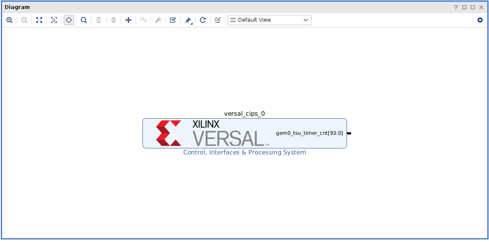
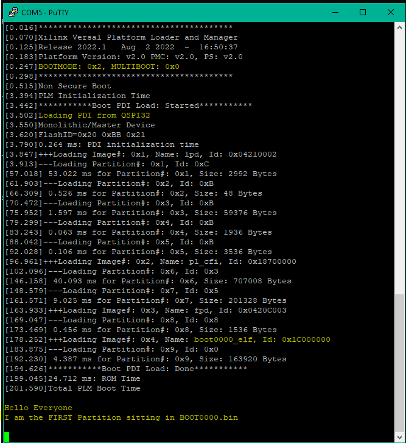
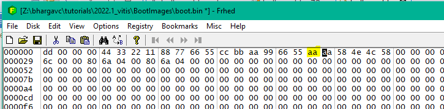
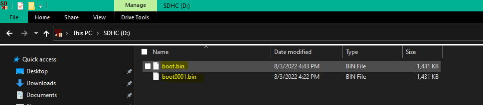
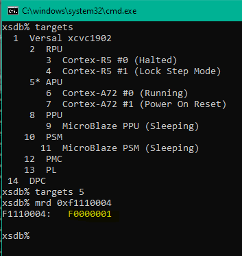
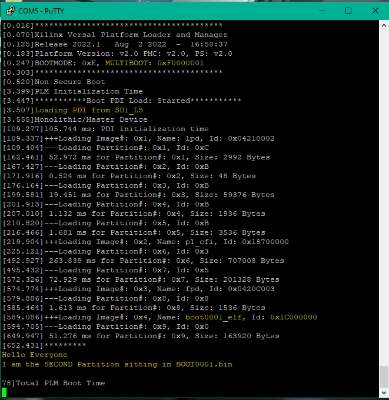
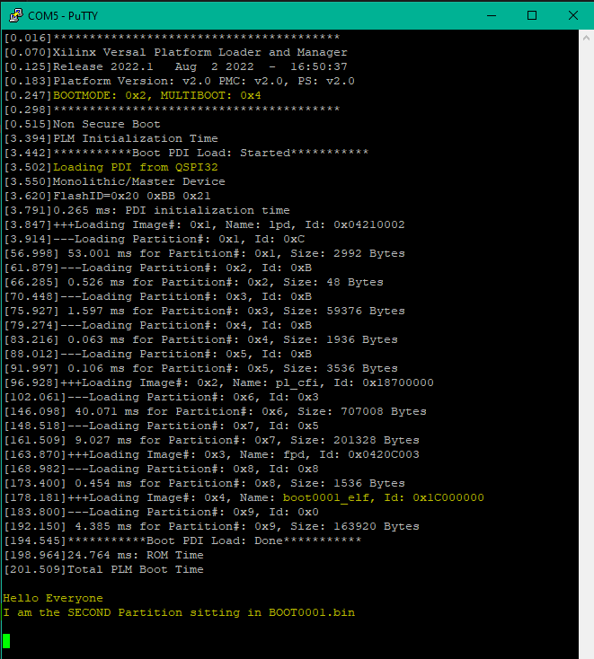

<table class="sphinxhide" width="100%">
 <tr width="100%">
    <td align="center"><h1>Versal™Boot and Configuration Tutorials</h1>
    <a href="https://www.xilinx.com/products/design-tools/vivado.html">See Vivado™ Development Environment on xilinx.com</a>
    </td>
 </tr>
</table>


# Fallback

***Version: Vivado 2022.1***


## Table of Contents

1. [Introduction](#introduction)

2. [Before You Begin](#before-you-begin)


3. [Building Hardware Design](#building-hardware-design)

4. [Building Software Design](#building-software-design)

5. [Running the Design](#running-the-design)


## Introduction

Fallback boot allows an AMD Versal&trade; Adaptive SoC to automatically boot a different PDI than the initial PDI on the same primary boot device if the first PDI fails to boot.

An error during boot PDI load can occur due to various reasons. Some examples for PLM errors include:

* PDI header fields are not valid.
* Copy from boot device has failed.
* Unavailability of power while loading corresponding power domain CDOs (LPD, FPD, NPD, PL, and so on).
* Checksum or decryption or authentication failure while loading partitions, if enabled.
* Command failures (such as DDR memory calibration mask_poll command time out) during CDO processing.


#### **Fallback boot process** (starting from the initial boot after POR):

The BootROM executable accesses the PDI at the location specified when PMC_MULTI_BOOT is 0 (the POR value). The BootROM executable performs integrity and security checks on the boot header (valid ID, checksum), and the associated PLM, ensures that the PDI is not corrupted, decrypts the PDI, and checks that authentication is successful.

If the integrity and security checks fail, the fallback boot is used to try to boot Versal Adaptive SoC from an alternate PDI on the same primary boot device.

To begin the fallback boot, the BootROM executable increments PMC_MULTI_BOOT within search offset limit and executes a system-level reset (SRST), which then uses the PMC_MULTI_BOOT register to read the PDI from the newly specified location within the primary boot device.

From this point, there are two paths:

• **Success**: If the BootROM executable finds a boot header at the new location, BootROM performs boot integrity and security checks on the boot header/PLM. If the integrity and security checks pass, boot continues.

• **Failure**: In this case, either the BootROM executable does not find a boot header at the new location, or the boot header/PLM integrity and security checks fail. The BootROM executable again increments PMC_MULTI_BOOT, issues an SRST, and continues searching, while incrementing PMC_MULTI_BOOT as needed until either a valid boot header/PLM is found, or the search limit is reached.

#### PMC_MULTI_BOOT Register:

Inside the PMC, there is a MultiBoot register (PMC_MULTI_BOOT). After a system-level reset (SRST), the BootROM executable uses PMC_MULTI_BOOT to specify the PDI location in the boot device. PMC_MULTI_BOOT is a number. The type of boot device determines whether PMC_MULTI_BOOT is used to specify the alternative PDI location as an address or a file name.
Refer the Versal Adaptive SoC Register Reference [(AM012)](https://www.xilinx.com/htmldocs/registers/am012/am012-versal-register-reference.html) for more details.

For example, if multiple boot files are present on the *SD card*, the register value indicates the following:
```
PMC_MULTI_BOOT : 0xF0000000 -> System boot from 1st binary file
PMC_MULTI_BOOT : 0xF0000001 -> System boot from 2st binary file
PMC_MULTI_BOOT : 0xF0000002 -> System boot from 3st binary file
etc
```
>***Note***: Here the 'F' in F0000001 value indicates ```User partition (File system mode)```, which is a partition type, only valid for SD/eMMC boot modes. 

Below are the partition types:
* 1: eMMC Boot Partition 1 (Raw mode)
* 2: eMMC Boot Partition 2 (Raw mode)
* 7: User partition (Raw mode)
* F: User partition (File system mode) 


#### Boot Device choices for Fallback:
```
eMMC (4.51) ---------------------------------------------search offset limit **8191 FAT files
Qctal SPI single or dual stacked-------------------------search offset limit **8GB
Quad SPI24 Single or dual stacked------------------------search offset limit **128MB 
Quad SPI24 dual-parallel---------------------------------search offset limit **256MB
Quad SPI32 Single or dual stacked------------------------search offset limit **4GB
Quad SPI32 dual-parallel---------------------------------search offset limit **8GB
SD0 (1.0)------------------------------------------------search offset limit **8191 FAT files
SD1 (2.0)------------------------------------------------search offset limit **8191 FAT files
SD1 (3.0)------------------------------------------------search offset limit **8191 FAT files
```

### Objectives
After completing this tutorial, you should be able to:

* Understand the concept and the steps required to run the fallback tutorial.
* Build the fallback reference design in AMD Vivado&trade; and generate boot images to boot the system via SD card and QSPI booting techniques.
	

### Design Block Diagram


#### <Block vck190_fallback>



### Directory Structure
<details>
<summary> Tutorial Directory Details </summary>

```
vck190_fallback
|___Design........................Contains Design files
  |___Hardware....................Contains Hardware Design files
  |___Software....................Contains Software Design files
	|___Vitis.................Contains Vitis Files
		|___BootImages....Conatins boot files
		|___scr...........Contains source code files
|___Figures.......................Contains figures that appear in README.md
|___Scripts.......................Contains TCL scripts to generate reference Design, PDI, etc...
  |___vivado.tcl..................Generates the Vivado Design
  |___vck190_fallback_bd.tcl......Generates board design
  |___generate_qspi_bin.tcl.......Generate QSPI Binary file
  |___generate_sd_bin.tcl.........Generate SD Binary file
  |___program_flash.tcl...........Flashes the Binary file to the system via QSPI
|___README.md.....................Includes tutorial overview, steps to create reference design, and debug resources
```
</details>

## Before You Begin

Recommended general knowledge of:
* VCK190 evaluation board
* Versal Embedded Design Tutorial
* Versal QSPI and SD Boot process
* Versal PMC
* AMD Vivado&trade; Design Suite
* AMD Vitis&trade; IDE

<details>

<summary> Key Versal Reference Documents </summary>

* VCK190 Fallback and Multiboot reference [(UG1304)](https://docs.xilinx.com/r/2021.1-English/ug1304-versal-acap-ssdg/Fallback-Boot-and-MultiBoot)
* VCK190 Evaluation Board User Guide [(UG1366)](https://docs.xilinx.com/r/en-US/ug1366-vck190-eval-bd)
* Versal Adaptive SoC Embedded Design Tutorial [(UG1305)](https://xilinx.github.io/Embedded-Design-Tutorials/docs/2021.2/build/html/docs/Introduction/Versal-EDT/Versal-EDT.html)
* Versal Technical Reference Manual [(AM011)](https://docs.xilinx.com/r/en-US/am011-versal-acap-trm)
* Versal System Software Developers User Guide [(UG1304)](https://docs.xilinx.com/r/en-US/ug1304-versal-acap-ssdg)
* Versal Control Interfaces and Processing System (CIPS) [(PG352)](https://docs.xilinx.com/r/en-US/pg352-cips)
* Versal Adaptive SoC Register Reference [(AM012)](https://www.xilinx.com/htmldocs/registers/am012/am012-versal-register-reference.html)


</details>

<details>

<summary> Versal Terms </summary>

|Term|Description|
|  ---  |  ---  |
|Platform management controller (PMC)|Manages Versal Adaptive SoC boot and the life cycle management of the device. The PMC ROM Code Unit (RCU) and platform processing unit (PPU) are responsible for booting the device.|
|ROM code unit (RCU)| Includes an AMD Microblaze&trade; processor that executes the BootROM to initiate the boot phase2: boot setup.|
|Platform processing unit (PPU)|Includes a microblaze processor that executes the platform loader and manager (PLM) to initiate the boot phase3: load platform.|
|Scalar engines|Includes the processing system (PS) Dual-Core ARM Cortex R5F and A72.|
|Adaptable engines|Includes Versal adaptable hardware also referred to in this tutorial as programmable logic (PL).|
|Control Interfaces and Processing System (CIPS)|CIPS LogiCORE IP sets the configuration of PMC/PS peripherals, clocks, and MIO.|
|BootROM|Responsible for initial security and boot mode interface checks. Reads and processes the PDI boot header. Releases the PMC PPU to complete the boot phases. See the Versal Technical Reference Manual [(AM011)](https://www.xilinx.com/support/documentation/architecture-manuals/am011-versal-acap-trm.pdf) for more detail on BootROM.|
|Platform loader and manager (PLM)|Responsible for the final boot phases to load the PDI. Executes supported platform management libraries and application user code. See the Versal System Software Developers User Guide [(UG1304)](https://www.xilinx.com/cgi-bin/docs/rdoc?v=latest;d=ug1304-versal-acap-ssdg.pdf) for more detail on the PLM.|
|Programmable device image (PDI)|Boot image for programming and configuring the Versal Adaptive SoC device. See the BootGen UG1283 for details on the format. See system software developers user guide for details on how PLM manages the images and partitions.|
|MIO| Multiplexed IO pins that can be configured for different peripherals and functions.|
|DIO| Dedicated IO pins dedicated for specific functions, such as JTAG (TCK, TMS, TDI, TDO) or power-on reset (POR_B).|

</details>

### Tutorial Requirements

This tutorial is demonstrated on the VCK190 production evaluation board. To run this tutorial, download the necessary files from the lounge and ensure you have the correct licenses installed. If you do not have a board and Vivado license, contact your AMD sales representative. See https://www.xilinx.com/products/boards-and-kits/vck190.html for more information.

>***Note***: This tutorial targets the VCK190 evaluation board, but the methodology flow also applies to the VMK180 evaluation board.

#### Hardware Requirements:

* Host machine with an operating system supported by the Vivado Design Suite and Vitis 2022.1
* VCK190 Evaluation board, which includes:
  * Versal Adaptive SoC XCVC1902-2VSVA2197
  * AC power adapter (100-240VAC input, 12VDC 15.0A output).
  * System controller microSD card in socket (J302).
  * USB Type-C cable (for JTAG and UART communications).
  * Boot Module X-EBM-01 (Dual Parallel QSPI) Rev_A02

#### Software Requirements:
To build and run the tutorial reference design, the following must be available or installed:
  * Vivado Design Suite and Vitis 2022.1:
  	- Visit https://www.xilinx.com/support/download.html for the latest tool version.
  	- For more information on installing the Vivado Design Suite and Vitis, refer to [UG1400 Vitis Unified Software Platform Embedded Software Development](https://www.xilinx.com/support/documentation/sw_manuals/xilinx2020_2/ug1400-vitis-embedded.pdf).
  * Scripts to generate the reference design are provided in the `Scripts` directory
  * UART serial terminal recommended:
	- Vitis serial Terminal or a terminal emulator program for UART (i.e. Putty or Tera Term) can be used to display valuable PLM log boot status.  
    - When UART is not available, Vivado Design Suite and Vitis xsct/xsdb command line tools can be used to read the plm log after a boot attempt.


## Building Hardware Design  

### Vivado

To set up the Vivado environment:

* Windows 32-bit: Run the settings32.bat from the Vivado/2022.1 directory
* Windows 64-bit: Run the settings64.bat from the Vivado/2022.1 directory
* Linux 32-bit: Run the settings32.sh from the Vivado/2022.1 directory
* Linux 64-bit: Run the settings64.sh from the Vivado/2022.1 directory

To build a Vivado fallback reference design, you can use two methods, either use GUI interface of Vivado or use Tcl scripts to generate hardware design files. By using the GUI interface, you can learn the design flow process of generating hardware files.

**Method 1**:

Follow Versal Embedded Design Tutorial [(UG1305)](https://xilinx.github.io/Embedded-Design-Tutorials/docs/2021.2/build/html/docs/Introduction/Versal-EDT/docs/2-cips-noc-ip-config.html#creating-a-new-embedded-project-with-the-versal-acap) Chapter 2: Versal Adaptive SoC CIPS and NoC (DDR) IP Core Configuration till *Exporting Hardware* to generate an XSA design file.

**Method 2**:

From Command line enter the `Scripts` directory and run the following:

```vivado -source vivado.tcl```

The project runs Synthesis, Implementation and generates Device Image using the Tcl script commands. 
The Vivado project is built in the `Design/Hardware` directory.


Wait until the device image generation is successfully completed then **Open Implemented Design**. 

XSA File is generated into the Scripts-> versal_fallback_final directory.
XSA can be exported into the Hardware folder with the following Tcl command:

```
write_hw_platform -fixed -include_bit -force -file ../Design/Hardware/vck190_wrapper.xsa
```


## Building Software Design 


### Vitis


To set up the Vitis environment:

* Windows 32-bit: Run the settings32.bat from the Vitis/2022.1 directory
* Windows 64-bit: Run the settings64.bat from the Vitis/2022.1 directory
* Linux 32-bit: Run the settings32.sh from the Vitis/2022.1 directory
* Linux 64-bit: Run the settings64.sh from the Vitis/2022.1 directory

In Vitis, generate boot files to run an application using the hardware (.xsa) file generated from Vivado. 

Refer to Versal Embedded Design Tutorial [(UG1305)](https://xilinx.github.io/Embedded-Design-Tutorials/docs/2021.2/build/html/docs/Introduction/Versal-EDT/docs/2-cips-noc-ip-config.html#creating-a-hello-world-application-for-the-arm-cortex-a72-on-ocm) and follow steps 1,2, and 3 from *Creating a Hello World Application for the Arm Cortex-A72.* Choose the ```../Design/Software/Vitis/workspace``` folder as workspace, select the .xsa file generated in the previous step and "Create application Project" for "Hello World" (for A72-0 linked to DDR) whithin the same System project called vck190_system. 


image.bif : Used for generating a boot image file using bootgen utility. Available in the `/BootImages` directory. Edit this file as per the input images while creating a boot image.
```
all:
{
    image
    {
        { type = bootimage, file = versal_fallback_wrapper.pdi }
    }
    image
    {
        name = boot0000_elf, id = 0x1c000000
        { core=a72-0, file = boot0000.elf }
    }
} 
```
Copy all the required files into the BootImages directory to generate a Boot Image.

#### Boot Image (BIN) file generation:

Make modifications to the 'helloworld' application project to perform this tutorial. Make changes to the print statement as follows and build the application to generate the .elf files.
```
int main()
{
    init_platform();
    print("\n\n\rHello World\n\r");
    print("I am the FIRST Partition sitting in BOOT.BIN\n\n\r");
    cleanup_platform();
    return 0;
}
```
Build the application and generate the `boot.bin` file for the first partition using the following command.
```
exec bootgen -image image.bif -arch versal -o boot.bin 
```

Similarly, generate the second boot image by making changes to the application source code as follows.

```
int main()
{
    init_platform();
    print("\n\n\rHello World\n\r");
    print("I am the SECOND Partition sitting in BOOT0001.BIN\n\n\r");
    cleanup_platform();
    return 0;
}
```
Build the application and generate the `boot0001.bin` file for the second partition using the following command.
```
exec bootgen -image image.bif -arch versal -o boot0001.bin 
```


## Running the Design

For Fallback, corrupt the first binary file and boot the system automatically using the next valid binary file.

Without corrupting the first binary file, the system gets booted from boot.bin as follows:



To corrupt the boot.bin file, use a hex editor and edit the SYNC word as follows:
```
Original: 665599aa
Corrupted: 6655aaaa
```


1. **SD card boot**

The SD card or eMMC flash must be partitioned so that the first partition is a FAT 16/32 file system. Bootgen is used to create PDI files with the names: boot.bin, boot0001.bin, boot0002.bin, and so on. Except for the PMC_MULTI_BOOT value ‘0,’ the PMC_MULTI_BOOT value is concatenated with first the string boot, then PMC_MULTI_BOOT, then .bin to create the specified PDI file name.

Load the SD card with multiple images with the file name as `boot.bin, boot0001.bin`, and so on. On power up, the device boots from the first good image. 
The SD card image format is as follows:



To read the PMC_MULTI_BOOT register, use the below memory read command from xsbd/xsct console:-
```
mrd 0xF1110004 
```



As you corrupted the first image, the PMC_MULTI_BOOT register value is F0000001.
Hence, the system booted from the boot0001.bin file.



2. **QSPI boot**

For Octal SPI and Quad SPI, PMC_MULTI_BOOT is used as an index into the flash device. PMC_MULTI_BOOT is multiplied by 32 KB to calculate the flash offset.

Run the below program_flash commands in xsct/xsdb console from the BootImages Directory and set the required offset values.
```
program_flash -f boot.bin -pdi versal_fallback_wrapper.pdi -offset 0x0 -flash_type qspi-x8-dual_parallel
program_flash -f boot0001.bin -pdi versal_fallback_wrapper.pdi -offset 0x0020000 -flash_type qspi-x8-dual_parallel
```
After flashing, do a POR and the system boots from first good image, that is, boot0001.bin.

The PMC_MULTI_BOOT register can be read using the following command:
```
mrd 0xF1110004
```



>***Note***: Make sure to change the SW1 on the vck190 evaluation board for the respective boot modes. For SD boot: ON OFF OFF OFF and for QSPI boot: ON OFF ON ON.

> ***Note***: Test results for Fallback are captured in the `Figures/` Directory.


<hr class="sphinxhide"></hr>

<p class="sphinxhide" align="center"><sub>Copyright © 2020–2024 Advanced Micro Devices, Inc.</sub></p>

<p class="sphinxhide" align="center"><sup><a href="https://www.amd.com/en/corporate/copyright">Terms and Conditions</a></sup></p>
