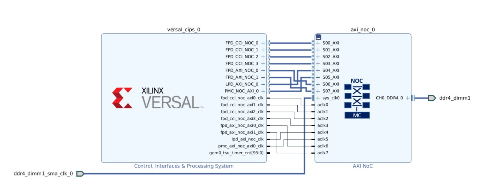

<tr>
   <td align="center"><h1>2022.1 Versal Example Design: USB as secondary boot device</h1>
   </td>
 </tr>
</table>

# Table of Contents

1. [Introduction](#introduction)

2. [Before You Begin](#before-you-begin)

3. [Building Hardware Design](#building-hardware-design)

4. [Building Software Design](#building-software-design)

5. [Running the Design](#running-the-design)

# Introduction
Versal™ ACAP combines adaptable processing and acceleration engines with programmable logic and configurable connectivity to enable custom, heterogeneous hardware solutions for a wide variety of applications in Data Center, automotive, 5G wireless, wired network, and defense. Versal ACAP supports several secondary boot modes for application flexibility. This tutorial highlights the way to use USB as secondary boot device.
	
## Objectives
This example is going to demonstrate how to modify bif to load second PDI via USB in 2022.1. VCK190 will be used for demonstration. We will use SD card as first boot device to load PLM, and use USB as secondary boot device to load the other partitions(A72 helloworld applications or u-boot)

## Design Block Diagram


## Directory Structure
<details>
<summary> Tutorial Directory Details </summary>

```
USB_Boot
|___Design.................Contains Design files
  |___Hardware.........................Contains Hardware Design files
  |___Software...................Contains Software Design files
    |__Petalinux.................Contains Vitis projects
    |__Vitis.....................Contains Petalinux projects
    |__bif............................Contains boot image format files
      |__a72_primary.bif...............For primary PDI
      |__a72_secondary_helloworld.bif..For secondary PDI
      |__a72_secondary_u-boot.bif......For secondary PDI
    |___src............................Contains Software source files
      |__helloworld.c..................Source Code for A72 #0
|___Figures................Contains figures that appear in README.md
  |___block.png........................Block Diagram
|___Scripts................Contains TCL scripts to generate reference Design, PDI, etc...
  |___create_vivado_project.tcl.........Generates the Vivado Design
  |___deisgn_bd.tcl.....................Generates the Vivado Block Diagram
  |___vck190_vitis_app.tcl..............Generates the Vitis application project
  |___vck190_vitis_plm.tcl..............Generates the Vitis plm project
|___README.md...............Includes tutorial overview, steps to create reference design, and debug resources
```
</details>

# Before You Begin

Recommended general knowledge of:
* VCK190 evaluation board
* Versal PMC
* Xilinx Vivado Design Suite 
* Xilinx Vitis IDE
* Xilinx petalinux tools

<details>
<summary> Key  Reference Documents </summary>

* VCK190 Evaluation Board User Guide [(UG1366)](https://docs.xilinx.com/r/en-US/ug1366-vck190-eval-bd)
* Versal ACAP System Software Developers Guide [(UG1304)](https://docs.xilinx.com/r/en-US/ug1304-versal-acap-ssdg)
* Bootgen User Guide [(UG1283)](https://docs.xilinx.com/r/en-US/ug1283-bootgen-user-guide)

</details>


#### Hardware Requirements:

* Host machine with an operating system supported by Vivado Design Suite and Vitis 2022.1
* VCK190 Evaluation Board, which includes:
  * Versal ACAP XCVC1902-2VSVA2197
  * AC power adapter (100-240VAC input, 12VDC 15.0A output).
  * System controller microSD card in socket (J302).
  * USB Type-C cable (for JTAG and UART communications).
  * USB 2.0 type A connector (J308).
* Board setup: Connect VCK190 J308 to PC host with USB cable; Set SW1[1:4] to 0111(up, down, down, down) as sd boot mode.

#### Software Requirements:
In order to build and run the tutorial reference design, the following must be available or installed:
  * Vivado Design Suite, Vitis, and petalinux 2022.1:
  	- Visit https://www.xilinx.com/support/download.html for the latest tool version.
  	- For more information on installing the Vivado Design Suite and Vitis, refer to [UG1400 Vitis Unified Software Platform Embedded Software Development](https://docs.xilinx.com/r/en-US/ug1400-vitis-embedded).
   * VCK190 board support package 2022.1 [(VCK190 BSP)](https://www.xilinx.com/member/forms/download/xef.html?filename=xilinx-vck190-v2022.1-04191534.bsp).
  * Scripts to generate the reference design are provided in the `Scripts` directory 
* UART serial terminal recommended:
	- Vitis serial Terminal or a terminal emulator program for UART (i.e. Putty or Tera Term) can be used to display valuable PLM log boot status.  
    - When UART is not available, Vivado Design Suite and Vitis xsct/xsdb command line tools can be used to read the plm log after a boot attempt. See [Debug During Board Bring-up](#debug-during-board-bring-up) for detail.
    
# Building Hardware Design  

## Vivado steps
Be sure to source `settings.sh` for Vivado.
Enter the `Scripts` directory. From the command line run the following:
```
vivado -source create_vivado_project.tcl
```
The Vivado project `vck190_ddr4` will be created and built in the `Design/Hardware` directory. A .xsa file will be generated in Vivado project directory.
#### **NOTE**:
If you are working under windows, you may need to move the file location and change the project name to keep the file path as short as possible since vivado has a limit on file path length under windows.

# Building Software Design 

## Vitis steps
1. Open XSCT and change working directory to `Scripts`. Run below command to create a vitis project generating plm.elf needed by usb booting.
```
source vck190_vitis_plm.tcl
```
A Vitis workspace will be created and built in the `Design/Software/Vitis/prj_plm` directory.
#### *NOTE*:
The PLM generated by vivado does not support USB as secondary boot device, so we need to generate a PLM with USB enabled in Vitis. 

2. In XSCT, run below command to create an application running on the APU.
```
source vck190_vitis_app.tcl
```
Another Vitis workspace will be created and built in the `Design/Software/Vitis/prj_app` directory.

Launch the Vitis software platform and set the workspace path to `Design/Software/Vitis/prj_app`.

Copy helloworld.c file in the `Design/Software/src` folder to `Design/Software/Vitis/prj_app/hello_a72_0/src`, and then rebuild the project.

#### *NOTE*:
The modified `helloworld.c` is to add some delays before printing helloworld. This is because when A72 is printing helloworld, PLM may not release the control of UART, so helloworld may not be seen in the console. So in this example, 5 seconds delay is added before printing helloworld.

## Petalinux steps
1. Be sure to source `settings.sh` for 2022.1 Petalinux. Enter `Design/Software/Petalinux` directory.

2. Create a new Petalinux project based on release VCK190 BSP 
```
petalinux-create -t project -s <Directory-to-BSP>/xilinx-vck190-v2022.1-<your_bsp_version>.bsp -n vck190_plnx
```
3. Import the generated xsa file
```
cd vck190_plnx
petalinux-config --get-hw-description=../../../Hardware/vck190_ddr4/ --silentconfig
```
4. Build Petalinux project
```
petalinux-build
```

## Generate Boot Images
### Generate the primary boot image
The primary boot image is used to boot plm from primary boot device, in this example, it is microSD card. The simplest method to generate the primary boot image is to modify the generated bif in vivado and then generate pdi again. User can look for the bif file that Vivado uses to generate PDI at <vivado_project>/<vivado_project>.runs/impl_1/ *.bif, and then add "boot_device {usb}" to this bif, which would let PLM know that USB is the secondary boot device.
```
new_bif:
{
 ...
 id = xxx
 boot_device {usb}
 image
 {
  ...
 }
}
```  
 
- steps to generate primary boot image in this example (all bif files are located in `Design/Software/bif` directory)
 1. Copy a72_primary.bif(You can make your own using the above method) to `Design/Hardware/vck190_ddr4/vck190_ddr4.runs/impl_1/`
 2. Copy plm.elf in `Design/Software/Vitis/prj_plm/plm/Debug` to `Design/Hardware/vck190_ddr4/vck190_ddr4.runs/impl_1/gen_files/`
 3. Open XSCT, and change working directory to `Design/Hardware/vck190_ddr4/vck190_ddr4.runs/impl_1/`
 4. Run below command to generate primary boot image: boot_primary.bin
 ```sh
 bootgen -arch versal -image a72_primary.bif -w -o boot_primary.bin
 ```
 
### Generate the secondary boot image for A72 helloworld
The second bif is used to generate pdi which contains helloworld appliation and is loaded via USB DFU.
1. Copy a72_secondary_helloworld.bif to `Design/Software/Vitis/prj_app/hello_a72_0/Debug/`
2. Change directory to `/Design/Software/Vitis/prj_app/hello_a72_0/Debug/`
3. Open XSCT and generate secondary boot image for helloworld application by running below Bootgen command in XSCT:
```sh
bootgen -arch versal -image a72_secondary_helloworld.bif -w -o boot_secondary_helloworld.bin
```
### Generate the secondary boot image for u-boot 
1. Copy a72_secondary_u-boot.bif to `Design/Software/Petalinux/vck190_plnx/images/linux/`
2. Change directory to `Design/Software/Petalinux/vck190_plnx/images/linux/` 
3. Open XSCT and generate secondary boot image for helloworld application by running below Bootgen command in XSCT:
```sh
bootgen -arch versal -image a72_secondary_u-boot.bif -w -o boot_secondary_u-boot.bin
```

# Running the Design
## Running the Design
1. Change the name of boot_primary.bin to boot.bin, then copy it to MicroSD card, and then boot up VCK190 with MicroSD.
2. PLM should wait for secondary image after printing below messages
```sh
[849.246]Loading PDI from USB
[851.827]Monolithic/Master Device
```
3. Loading secondary image by dfu-util in PC host
- If loading A72 helloworld application, copy boot_secondary_helloworld.bin to host and run below commands to download secondary image to VCK190
```sh
sudo dfu-util -l
sudo dfu-util -D boot_secondary_helloworld.bin
```
Helloworld prints should be seen in console.
```
[0.073]Xilinx Versal Platform Loader and Manager
[0.131]Release 2022.1   Aug  9 2022  -  02:52:12
[0.189]Platform Version: v2.0 PMC: v2.0, PS: v2.0
[0.254]BOOTMODE: 0xE, MULTIBOOT: 0xF0000000
[0.312]****************************************
[0.532]Non Secure Boot
[3.357]PLM Initialization Time
[3.407]***********Boot PDI Load: Started***********
[3.469]Loading PDI from SD1_LS
[3.518]Monolithic/Master Device
[433.616]430.119 ms: PDI initialization time
[433.678]+++Loading Image#: 0x1, Name: lpd, Id: 0x04210002
[433.747]---Loading Partition#: 0x1, Id: 0xC
[486.471] 52.635 ms for Partition#: 0x1, Size: 2688 Bytes
[491.466]---Loading Partition#: 0x2, Id: 0xB
[495.985] 0.528 ms for Partition#: 0x2, Size: 48 Bytes
[500.257]---Loading Partition#: 0x3, Id: 0xB
[512.462] 8.212 ms for Partition#: 0x3, Size: 59376 Bytes
[514.725]---Loading Partition#: 0x4, Id: 0xB
[519.500] 0.786 ms for Partition#: 0x4, Size: 1936 Bytes
[523.686]---Loading Partition#: 0x5, Id: 0xB
[528.594] 0.916 ms for Partition#: 0x5, Size: 3536 Bytes
[532.829]+++Loading Image#: 0x2, Name: pl_cfi, Id: 0x18700000
[538.076]---Loading Partition#: 0x6, Id: 0x3
[718.749] 176.682 ms for Partition#: 0x6, Size: 837872 Bytes
[721.271]---Loading Partition#: 0x7, Id: 0x5
[832.500] 107.239 ms for Partition#: 0x7, Size: 512704 Bytes
[835.052]+++Loading Image#: 0x3, Name: fpd, Id: 0x0420C003
[840.193]---Loading Partition#: 0x8, Id: 0x8
[845.391] 1.206 ms for Partition#: 0x8, Size: 1616 Bytes
[849.246]Loading PDI from USB
[851.827]Monolithic/Master Device
[28107.641]27258.360 ms: PDI initialization time
[28109.403]+++Loading Image#: 0x0, Name: user_subsystem, Id: 0x1C000000
[28115.429]---Loading Partition#: 0x0, Id: 0x0
[28119.621] 0.031 ms for Partition#: 0x0, Size: 163920 Bytes
[28124.985]***********Boot PDI Load: Done***********
[28129.589]325.329 ms: ROM Time
[28132.405]Total PLM Boot Time
Hello World
Successfully ran Hello World application
```
- If loading u-boot, copy boot_secondary_u-boot.bin to host and run below commands to download secondary image to VCK190
```sh
sudo dfu-util -l
sudo dfu-util -D boot_secondary_u-boot.bin
```
u-boot should be seen in console.
```
[0.072]Xilinx Versal Platform Loader and Manager
[0.130]Release 2022.1   Aug  5 2022  -  03:50:08
[0.189]Platform Version: v2.0 PMC: v2.0, PS: v2.0
[0.255]BOOTMODE: 0xE, MULTIBOOT: 0xF0000000
[0.308]****************************************
[0.540]Non Secure Boot
[3.448]PLM Initialization Time
[3.498]***********Boot PDI Load: Started***********
[3.559]Loading PDI from SD1_LS
[3.608]Monolithic/Master Device
[3.700]0.115 ms: PDI initialization time
[3.759]+++Loading Image#: 0x1, Name: lpd, Id: 0x04210002
[3.827]---Loading Partition#: 0x1, Id: 0xC
[54.296] 50.383 ms for Partition#: 0x1, Size: 2960 Bytes
[59.192]---Loading Partition#: 0x2, Id: 0xB
[63.606] 0.520 ms for Partition#: 0x2, Size: 48 Bytes
[67.787]---Loading Partition#: 0x3, Id: 0xB
[118.395] 46.713 ms for Partition#: 0x3, Size: 59376 Bytes
[120.737]---Loading Partition#: 0x4, Id: 0xB
[124.723] 0.008 ms for Partition#: 0x4, Size: 1936 Bytes
[129.674]---Loading Partition#: 0x5, Id: 0xB
[133.663] 0.011 ms for Partition#: 0x5, Size: 3536 Bytes
[138.791]+++Loading Image#: 0x2, Name: pl_cfi, Id: 0x18700000
[144.024]---Loading Partition#: 0x6, Id: 0x3
[692.862] 544.856 ms for Partition#: 0x6, Size: 707072 Bytes
[695.377]---Loading Partition#: 0x7, Id: 0x5
[1153.940] 454.583 ms for Partition#: 0x7, Size: 564304 Bytes
[1156.571]+++Loading Image#: 0x3, Name: fpd, Id: 0x0420C003
[1161.783]---Loading Partition#: 0x8, Id: 0x8
[1166.263] 0.414 ms for Partition#: 0x8, Size: 1616 Bytes
[1170.985]Loading PDI from USB
[1173.644]Monolithic/Master Device
[26846.816]25675.796 ms: PDI initialization time
[26848.574]+++Loading Image#: 0x0, Name: apu_subsystem, Id: 0x1C000000
[26854.498]---Loading Partition#: 0x0, Id: 0x0
[26858.657] 0.007 ms for Partition#: 0x0, Size: 23584 Bytes
[26863.872]---Loading Partition#: 0x1, Id: 0x0
[26868.038] 0.015 ms for Partition#: 0x1, Size: 63440 Bytes
[26873.244]---Loading Partition#: 0x2, Id: 0x0
[26877.570] 0.175 ms for Partition#: 0x2, Size: 1055072 Bytes
[26882.864]***********Boot PDI Load: Done***********
[26887.460]4702.027 ms: ROM Time
[26890.353]Total PLM Boot Time
NOTICE:  ATF running on Xilinx Versal Silicon
INFO:    BL31: fsbl-atf handover success 0.
NOTICE:  BL31: Secure code at 0x0
NOTICE:  BL31: Non secure code at 0x8000000
NOTICE:  BL31: v2.6(debug):v1.1-9207-g67ca59c67
NOTICE:  BL31: Built : 03:46:40, Mar 24 2022
INFO:    GICv3 with legacy support detected.
INFO:    ARM GICv3 driver initialized in EL3
INFO:    Maximum SPI INTID supported: 191
INFO:    BL31: Initializing runtime services
WARNING: BL31: cortex_a72: CPU workaround for 859971 was missing!
WARNING: BL31: cortex_a72: CPU workaround for 1319367 was missing!
INFO:    BL31: cortex_a72: CPU workaround for cve_2017_5715 was applied
INFO:    BL31: cortex_a72: CPU workaround for cve_2018_3639 was applied
INFO:    BL31: Preparing for EL3 exit to normal world
INFO:    Entry point address = 0x8000000
INFO:    SPSR = 0x3c9


U-Boot 2022.01 (Apr 04 2022 - 07:53:54 +0000)

CPU:   Versal
Silicon: v2
Model: Xilinx Versal vck190 Eval board revA
DRAM:  8 GiB
EL Level:       EL2
MMC:   mmc@f1050000: 0
Loading Environment from nowhere... OK
In:    serial@ff000000
Out:   serial@ff000000
Err:   serial@ff000000
Bootmode: SD_MODE
Net:
ZYNQ GEM: ff0c0000, mdio bus ff0c0000, phyaddr 1, interface rgmii-id
zynq_gem ethernet@ff0c0000: Failed to read eth PHY id, err: -2

Warning: ethernet@ff0c0000 (eth0) using random MAC address - 0e:a1:48:3a:69:d5
eth0: ethernet@ff0c0000
ZYNQ GEM: ff0d0000, mdio bus ff0c0000, phyaddr 2, interface rgmii-id
zynq_gem ethernet@ff0d0000: Failed to read eth PHY id, err: -2

Warning: ethernet@ff0d0000 (eth1) using random MAC address - 62:5f:35:ad:91:b5
, eth1: ethernet@ff0d0000
Hit any key to stop autoboot:  0
Versal>
```
## Tips and Tricks
- About how to install DFU on Windows/Linux host, please refer to this wiki page: https://xilinx-wiki.atlassian.net/wiki/spaces/A/pages/18842468/ZynqMp+USB+Stadalone+Driver#ZynqMpUSBStadaloneDriver-USBDFUTesting
 
© Copyright [2022] Xilinx, Inc. All rights reserved.


