<table class="sphinxhide" width="100%">
 <tr width="100%">
    <td align="center"><h1>Versal™ Adaptive SoC DFX Tutorials</h1>
    <a href="https://www.xilinx.com/products/design-tools/vivado.html">See Vivado™ Development Environment on xilinx.com</a>
    </td>
 </tr>
</table>

# 1 RP Design with NoC INI in the Static-RM Interface

***Version: AMD Vivado&trade; 2024.1***

## Introduction

This design demonstrates a simple DFX design in AMD Versal&trade; adaptive SoCs. The content of the design is as follows:

- Static Region has CIPS IP, AXI NoC Interface to double-data rates (DDRs), and DDR Controller.
- Reconfigurable Partition has an AXI general purpose I/O (GPIO) IP connected to Constant Values that differ in different reconfigurable modules.
- Static-RM interface is NoC Inter NoC Interconnect (INI).
- Because the Static-RM interface is using NoC INI, no PL based decoupler is used.

## Design Flow

1. Create the flat Top BD.
2. Group the design to hierarchies: Static Region and Reconfigurable Partitions.
3. Create a block design container for the reconfigurable partition.
4. Enable the DFX and Freeze the Static-RM interface.
5. Set the aperture for all interfaces of the reconfigurable partition.
6. Add the Pblock constraints.
7. Generate the targets for all BDs: Top BD and reconfigurable modules BDCs.
8. Use the DFX Wizard to configure the parent and child implementation.
9. Launch Synthesis, Implementation, and WDI generation.

### Create Flat Top BD

Source the `create_top_bd.tcl` to create the flat BD. This BD contains static region IPs and the IPs that eventually go to a reconfigurable partition.
`source create_top_bd.tcl`

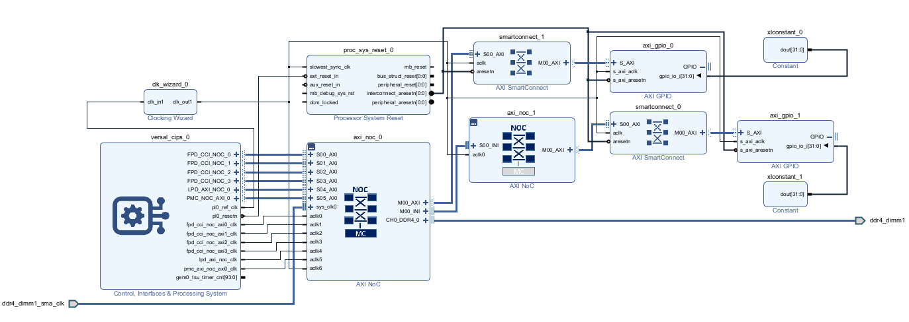

### Create Hierarchies for the Reconfigurable partition and Static Region

In the DFX flow, a separate hierarchy for each reconfigurable partition is required. It is recommended to keep a hierarchy for the static region whenever possible for easier floorplanning down the flow if needed.

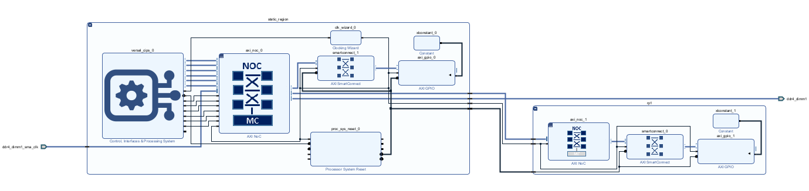

### Create a Block Design Container for Reconfigurable Partition RP1

You need to create a new BD for the reconfigurable module that contains all its sources. This is achieved using the block design container feature in the IP Integrator. For each reconfigurable module, a block design is created using BDC.

`source create_rp1_bdc.tcl` rearranges the design into the right hierarchies and creates a block design container, `rp1rm1.bd`, for the RP1 partition. `rp1rm1.bd` will be the first reconfigurable module for this partition.

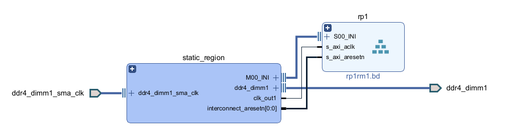

### Enable DFX and Define the Aperture for Static-RM Interfaces

`source enable_dfx_bdc.tcl`

DFX must be enabled on a block design container. Double-click the BDC, in the "General" tab, and select **Enable Dynamic Function eXchange on this container**. You can also "freeze the boundary of this container" if the Static-RP interface definition is complete. This will stop further parameter propogration across the static-RP boundary.

In the "Addressing" tab, the aperture will be automatically defined for each interface based on  the address assignment at the top. You can switch the aperture inference to "Manual" if desired.

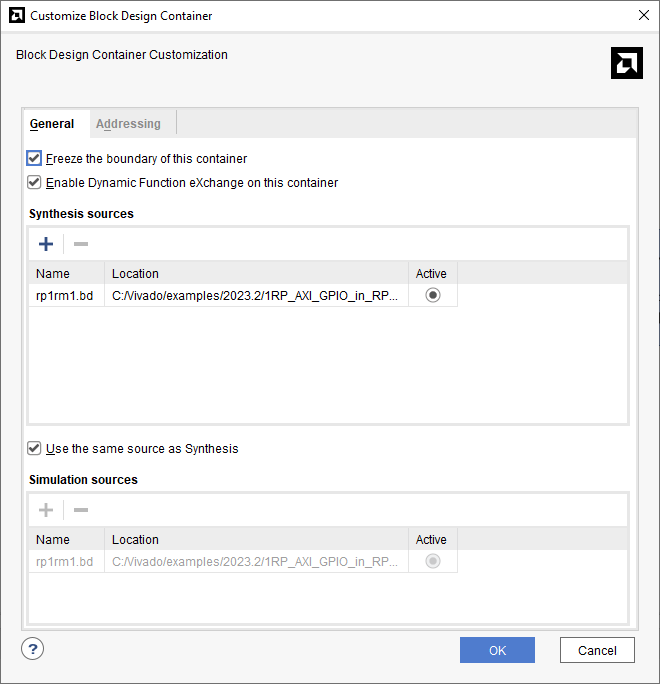

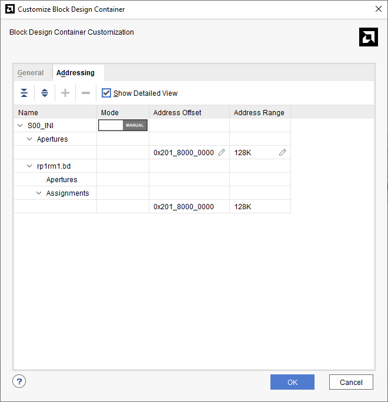

### Create a New Reconfigurable Module for the Partition RP1

`source create_rp1rm2.tcl`

1. Create the second reconfigurable module, `rp1rm2.bd`, for the same reconfigurable partition rp1. You can right-click the rp1 BDC, and select **Create Reconfirurable Module**.

    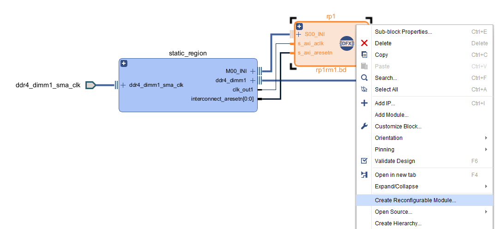

2. Provide a name for the new reconfigurable module.

    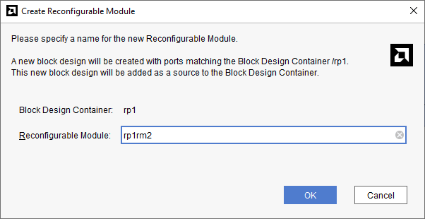

3. This will create a new BD, `rp1rm2.bd`, with the exact same ports as `rp1rm2.bd`. Populate the new BD.

    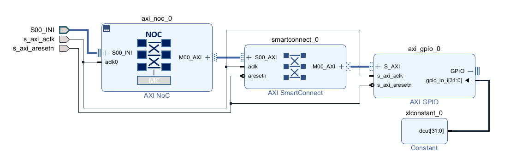

### Create RTL Wrapper, Generate Targets, and Define the Pblocks

Once the BD sources are defined and validated, create the RTL wrapper for the top, followed by generate targets for BD. You can also add the constraints (timing and physical constraints) to the project at this stage.

1. Create the RTL wrapper for the top BD.

    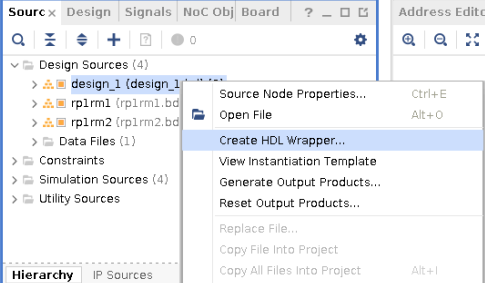

2. Generate the Targets for the Top BD which also generates the targets for its child BDs, `rp1rm1.bd` and `rp1rm2.bd`.

    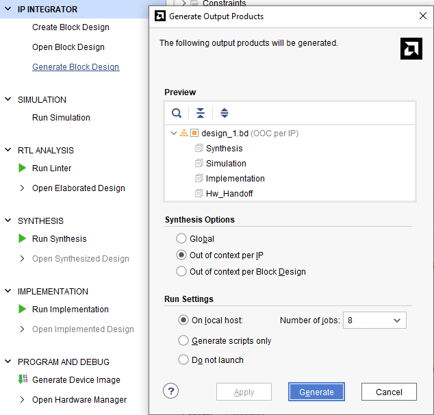

### Use the DFX Wizard to Define the Parent and Child Configurations

1. Once the targets are generated, click the DFX wizard in the "Flow Navigator" of the Vivado IDE. The associated RMs of the RP will be automatically associated with the partition in the DFX wizard.

    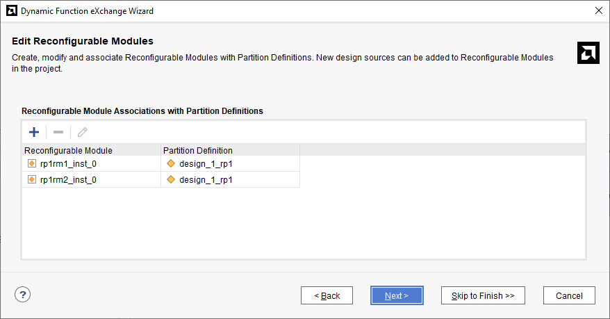

2. Define the configuration for each reconfigurable module for each partition.

    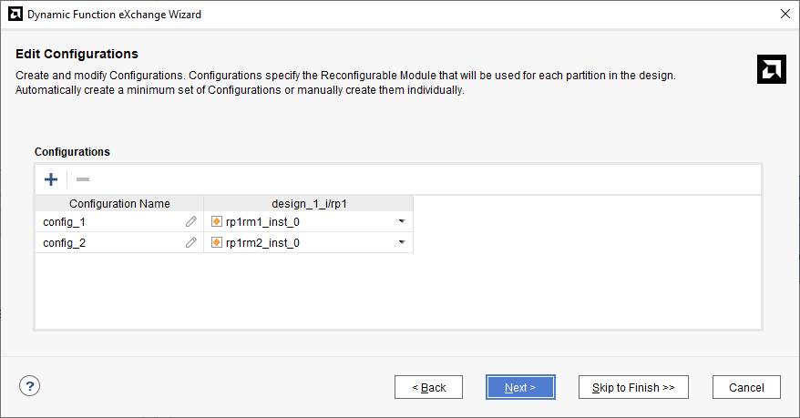

3. Associate each configuration with implementation runs. In the DFX flow, the parent implementation does both the static and associated reconfigurable module implementation. Child implementations place and route the associated reconfigurable module in the context of locked static from the parent implementation.

    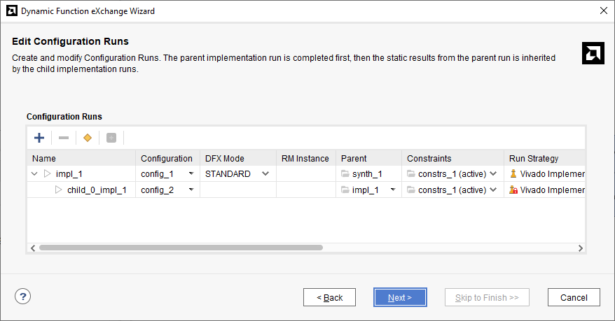

4. Once the configuration and runs are defined in the DFX wizard, the corresponding implementations will appear in the "Design Runs" tab of the Vivado IDE.

    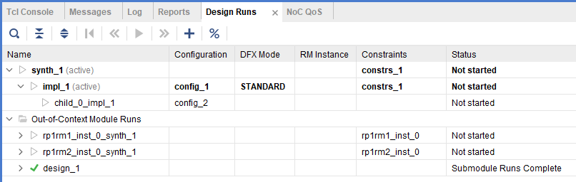

### Launch Synthesis, Implementation, and PDI Generation

`source run_impl.tcl` generates the targets, add constraints, defines the configurations using- the DFX wizard, launches synthesis, implementation, and exports the XSA after device image generation.

Selecting "write_device_image" in the flow navigator automatically starts the synthesis and implementation in the following order.

- Parallel OOC synthesis of RMs: rp1rm1 and rp1rm2.
- Top level Synthesis once OOC synthesis of RMs are complete.
- Parent Implementation (impl_1) where the static and initial reconfigurable module (rp1rm1) is placed and routed.
- Child Implememtation (child_0_impl_1) where the corresponding reconfigurable module (rp1rm2) is implemented in the context of the locked static region from impl_1.
- Device Image is generated for both the parent and child implementations.

### Generate the Hardware Hand-off File XSA for Software Application

For DFX designs, XSA hand-off is not officially supported in project mode. However, you can write out flat fixed XSAs and extract the reconfigurable module's contents using XSCT.

```
open_run impl_1
write_hw_platform -fixed -force  xsa/design_1_wrapper_impl_1.xsa

open_run child_0_impl_1
write_hw_platform -fixed -force  xsa/design_1_wrapper_child_0_impl_1.xsa
```

<hr class="sphinxhide"></hr>

<p class="sphinxhide" align="center"><sub>Copyright © 2020–2024 Advanced Micro Devices, Inc.</sub></p>

<p class="sphinxhide" align="center"><sup><a href="https://www.amd.com/en/corporate/copyright">Terms and Conditions</a></sup></p>
