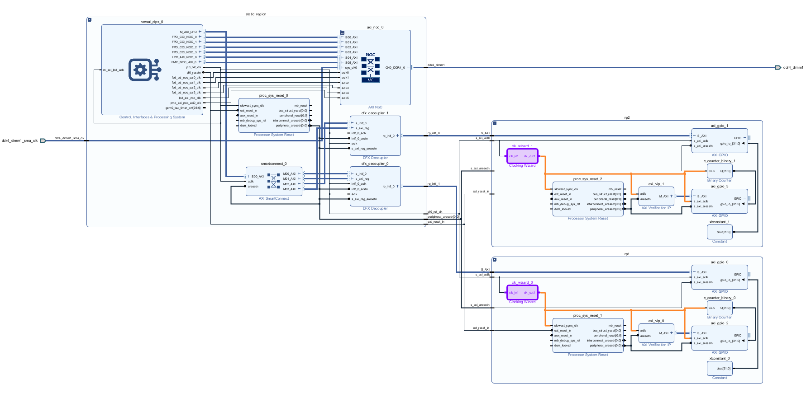
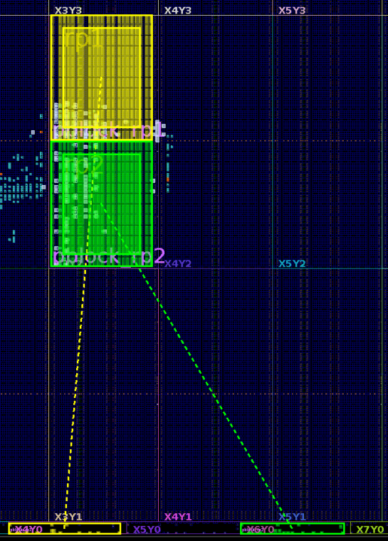

<table class="sphinxhide" width="100%">
 <tr width="100%">
    <td align="center"><h1>Versal™ Adaptive SoC DFX Tutorials</h1>
    <a href="https://www.xilinx.com/products/design-tools/vivado.html">See Vivado™ Development Environment on xilinx.com</a>
    </td>
 </tr>
</table>

# Clock Region Sharing Between Two Reconfigurable Partitions

***Version: AMD Vivado&trade; 2024.1***

## Introduction

- This design demonstrates that a clock region in AMD Versal&trade; adapative SoCs can be shared among multiple reconfigurable partitions (RP).
- Reconfigurable partition pblocks both having internal clocking resources can share one clock region.
- The RCLK row in the clock region is shared between two RPs.
- You can range pblocks one above RCLK row and one below the RCLK row of the clock region.
- RCLK sharing is automatically taken care by the DFX flow in Vivado. You cannot range RCLK sites in your pblock.

## Design Flow

Become familiar with the inter-processor interrupt (IPI) BDC based DFX flow in Vivado using the "2RP_GPIO_BRAM_in_RP_Interface_INI" example design. The same design flow is used in this tutorial.

### IPI

- There are two RPs in the design.
- Both RPs have internal clocking resources.

  

### Implementation

- These are the pblocks used for implementation. As you can see, pblocks for the two reconfigurable partitions share one clock region, above and below the RCLK row, which is the boundary between the two.

  

- This is the schematic of the two internal clocks of the RPs.

  

- This is the device view of a clock region being shared by two reconfiurable partitions: above and below the RP. Notice that RCLK row is being shared by internal clock nets from both partitions.

  

- This is the magnified view of the device view where the RCLK row is being shared by the internal clocks of two RPs.

  

Copyright © 2020–2024 Advanced Micro Devices, Inc.

<a href="https://www.amd.com/en/corporate/copyright">Terms and Conditions</a>

