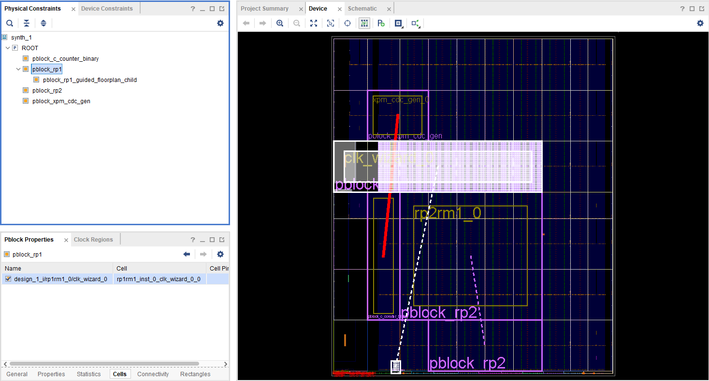

<table class="sphinxhide" width="100%">
 <tr width="100%">
    <td align="center"><h1>Versal™ Adaptive SoC DFX Tutorials</h1>
    <a href="https://www.xilinx.com/products/design-tools/vivado.html">See Vivado™ Development Environment on xilinx.com</a>
    </td>
 </tr>
</table>

# Overlap DRC and Disjoint Pblock Solutions for Versal DFX

***Version: AMD Vivado&trade; 2023.2***

## Abstract
This design demonstrates solutions for scenarios that involve overlap DRCs (two reconfigurable Pblocks interfering with each other) as well as disjoint Pblocks (a clocking resource region separated from the main reconfigurable Pblock)

### BLI Floorplan Alignment
DFX designs for Versal devices have unique challenges related to ranging Pblocks in designs with two or more reconfigurable partitions (RP). Due to the alignment of Boundary Logic Interface (BLI) tiles that are automatically ranged based on other ranged sites within an HSR clock region, the placement and routing footprints can extend farther than originally intended for a given Pblock rectangle. The extended footprints can lead to overlapping Pblock issues, reported by Design Rule Checks (DRC). 

### Disjoint Pblocks for a Reconfigurable Partition
A design may require logic that must be placed in a non-contiguous area between Fabric Super Region (FSR) and Horizontal Super Region (HSR) areas that would require a disjoint Pblock. Only NoC and clocking resources can communicate between the disjoint Pblock sections. 

In a disjoint Pblock case, the main part of the reconfigurable Pblock in the fabric region that contains all but certain clocking resources is referred to as the Primary Region. The other part which includes sites of the clock sources and the fabric region adjacent to the clock sources is referred to as the Secondary Region. 
Currently Vivado supports one Primary Region and one Secondary Region in a disjoint Pblock. The following image shows a disjoint Pblock for RP1 in a two RP design on a two SLR device.


This lab will show: 
1.	The overlap DRC and suggestions for steps to analyze and fix the overlap.
2.	An analysis of routing errors due to a disjoint Pblock and the application of a guided floorplan for the disjoint pblock to fix routing errors. 

## Objectives
 After completing this lab, you will be able to:
* Understand HDPR-39 on BLI overlap error and use the `get_dfx_footprint` command to debug. 
* Understand routing issues due to a disjoint Pblock and fix them with guided floorplan. 

NOTE: This lab is only for DFX learning in Vivado and has not been validated in hardware. 

## Introduction 
You will be using a standard Vivado DFX project as the starting point for this lab. It is a BD based designs with two Reconfigurable Partitions (RP1 and RP2). The design uses NoC IP and NoC INI to connect the IPs. The design is targeted to a two SLR Versal device to bring out the issues commonly seen for multi-RP multi-SLR DFX designs.


### General Flow
In this lab you will proceed through the following steps:
1. Prepare the design: Create project and run synthesis
2. Report DFX DRCs
3. Analyze the DRCs
4. Resize Pblock to resolve DRC
5. Run implementation and analyze new routing error
6. Use a guided floorplan
7. Implement the design to success!

**STEP 1: Prepare the Design**

1.	In the Tcl Console within Vivado 2023.2, source the "recreate_proj.tcl" script. This will create the 2 RP DFX block design. 
2.	Click "Run Synthesis" in the Flow Navigator to process the design through synthesis.
3.	After synthesis is complete, open the synthesized design "synth_1" and examine the device view.

To match the image below, select **Layout > Floorplanning**, then individually right click on each pblock_rp1 and pblock_rp2 to select **Highlight** and then pick the appropriate color (blue for rp1, yellow for rp2).


The blue highlighted Pblock is for RP "rp1rm1_0" and the yellow is for RP "rp2rm1_0." Observe that pblock_rp1 is disjoint with separate Pblock rectangles in HSR and FSR regions. The other two Pblocks are for static logic, specifically applied to create challenges for the use cases covered in this lab. The red line represents a static bus crossing the SLR boundary. 

**STEP 2: Report DFX DRCs**
Most of the floorplanning-related DRCs can be caught after synthesis by calling the report_drc command. As this lab focuses only on DFX, check only the DFX rules from report DRC as highlighted below and observe the DRC errors. Run the DFX DRCs by selecting **Reports > Report DRC**; then deselect **All Rules** and select **Dynamic Function eXchange** before clicking **OK**.


Five types of DFX DRCs are reported:

1-	HDPR-39: This DRC reports a BLI tile conflict. A tile in the HSR region of the RP in blue highlighted Pblock is also part of the RP highlighted in yellow.


2-	HDPR-131: This DRC reports that an MMCM in the RP in blue requires a BLI tile and fabric for tie-off purposes, but viable tiles are owned by the RP in yellow. 


3-	and 4- HDPR-134 and HDPRA-63: These DRCs guide users to appropriate construction of disjoint Pblocks. The required methodology is to add a child Pblock to define the primary region. Only NoC and clocking logic can communicate between disjoint rectangles, as any other connection will require routing resources between the Pblock segments that are not owned by the Pblock. 


5-	HDPR-124: This DRC reports that IO Bank 703 is shared between static and pblock_rp1.


**STEP 3 : Analyze the DRCs**

**HDPR-39:** Examine the first DRC under section HDPR-39 in the DRC window. The "Overlapping tile :" section of the DRC error reports the tile that is shared by two RPs. BLI_CLE_BOT_CORE_X30Y0 is the conflicting tile. 
```
Overlapping tile : BLI_CLE_BOT_CORE_X30Y0 
- Is in PLACEMENT footprint of reconfigurable pblock ‘pblock_rp1’
      Footprint Expansion Path : 
         - BLI_CLE_BOT_CORE_X30Y0 tile in PLACEMENT footprint  for HSR_ROUTING
         - CMT_MMCM_X25Y0 tile in PBLOCK
    - Is in PBLOCK footprint of reconfigurable pblock ‘pblock_rp2’ 
      Footprint Expansion Path : 
         - BLI_CLE_BOT_CORE_X30Y0 tile in PBLOCK
```

The message suggests that "BLI_CLE_BOT_CORE_X30Y0" is required for HSR_ROUTING for tile "CMT_MMCM_X25Y0" present in pblock_rp1 but BLI_CLE_BOT_CORE_X30Y0 is part of pblock_rp2, causing an overlap. 

In the device view you can visualize the overlapping tiles. To show the placement footprint for both Pblocks, use the get_dfx_footprint command:

```
highlight_objects -color blue [get_dfx_footprint -place -of_objects [get_cells design_1_i/rp1rm1_0]]
mark_objects -color yellow [get_dfx_footprint -place -of_objects [get_cells design_1_i/rp2rm1_0]]
mark_objects -color green [get_tiles "*CMT_MMCM_X25Y0*"]
```

One call to get_dfx_footprint uses highlight_objects and the other uses mark_objects (and with different colors) so that any tile that belongs to each set can be easily seen.  In the image below the overlapping tiles are circled. The CMT tile (CMT_MMCM_X25Y0) that forces this footprint for pblock_rp1 is marked in green for reference. 


You can also use the -overlap option for the get_dfx_footprint command. This will return all tiles that overlap between the requested Pblock and any other reconfigurable Pblock.
```
#first clear existing highlighting
unhighlight_objects
unmark_objects

mark_objects -color green [get_tiles "*CMT_MMCM_X25Y0*"]
highlight_objects -color red [get_dfx_footprint -overlap -of_objects [get_cells design_1_i/rp1rm1_0]]
```


Note: The `get_dfx_footprint -overlap` command will also show clocking and interconnect tiles which can be shared by multiple RPs and will not result in a DRC. 

Additionally, the overlapping tiles are listed in the Overlapped_AllTiles.tcl script found in the hd_visual folder under the implementation runs directory, once it is generated by the implementation tools.

**STEP 4: Resize Pblock to resolve DRC**

To resolve the first violation, at least one Pblock must be resized. This is a design dependent decision. You can use one of these two options:

*Option 1:*  
Resize a Pblock to remove the overlap. This must be done after highlighting the Pblocks as explained above.

``
resize_pblock pblock_rp2 -remove CLOCKREGION_X2Y1
``

*Option 2:*  
Resize a Pblock using one of the "Floorplan fix resolution" suggestions mentioned in the DRC error. 
This option of using the floorplan fix resolution from DRC may require iterative steps of fixing the floorplan and running DRC multiple times.

Each will resolve the DRC, but consider the choice carefully.  For the first instance of HDPR-39, you should not use "Suggestion to keep 'BLI_CLE_BOT_CORE_X30Y0'" as it is the command to remove CMT_MMCM_X25Y0 from pblock_rp1, but the RM netlist rp1rm1_0 requires MMCM in that Pblock. Additional changes will be required if this option is selected

*Suggestion to keep 'CMT_MMCM_X25Y0' in 'pblock_rp1'  
set pblock_rp2_tiles [get_dfx_footprint -source [get_pblocks pblock_rp1] -tile [get_tiles CMT_MMCM_X25Y0] -conflict [get_pblocks pblock_rp2]]  
resize_pblock [get_pblocks pblock_rp2] -remove [ get_sites -of [ get_tiles $pblock_rp2_tiles ] ]*


Note: This lab does not resolve all DRC errors individually. Using option 1 above will fix DRC error HDPR-39 as well as HDPR-131. 

For this design, use option 1 above and resize a Pblock to resolve the overlaps. 

Run Report DRC for DFX rules and see the DRC errors have been fixed. (The Critical Warning and Warnings will remain.)  The constraints for option 1 are captured in "constr_2.xdc" under constraint set "constrs_2" and used for the "impl_SLL_ERROR" implementation run. 

The following image shows the new design floorplan with highlighting updated.


**STEP 5: Run implementation and analyze new routing error**

From the Synthesized design after fixing the DRC errors, run `opt_design`, `place_design`, and `route_design` from the TCL console. You can also launch the implementation run for impl_SLL_ERROR in the Design Runs tab.

You will see route_design has failed with the following error during the SLL assignment phase:


*ERROR: [Route 35-3424] SLL Assignment failed. There are no SLL nodes available in SLR Cut [0-1] for net 'design_1_i/rp1rm1_0/proc_sys_reset_1/U0/SEQ/pr_reg_0'.*

As seen in the SLL table, net demand is low and there is sufficient capacity for routing. To debug the error, check the schematic for the net mentioned in the error and mark the source and load cells using the following commands with design_1_wrapper_routed_error.dcp open in memory:

```
show_objects -name fail_net [get_nets design_1_i/rp1rm1_0/proc_sys_reset_1/U0/SEQ/pr_reg_0]
mark_objects -color yellow [get_cells {design_1_i/rp1rm1_0/proc_sys_reset_1/U0/SEQ/ACTIVE_LOW_PR_OUT_DFF[0].FDRE_PER_N_i_1}]
mark_objects -color green [get_cells {design_1_i/rp1rm1_0/proc_sys_reset_1/U0/ACTIVE_LOW_PR_OUT_DFF[0].FDRE_PER_N}]
```


The failing net is within an RM (rp1rm1_0) but the placement is such that it requires a non-clock net to route between disjoint Pblock rectangles. This is not allowed, as no general routing resources are declared that would provide a path from source to load. To fix such routing issues and to have control over placement in Primary and Secondary regions, a guided floorplan is required. 

For more information on the SLL Assignment table, please consult Static Routing Across SLR Boundaries in Vivado Design Suite User Guide: Dynamic Function eXchange (UG909)

**STEP 6: Use a guided floorplan**

Specific cell assignments must be made to the Primary region and the Secondary region. These assignments will guide the Vivado placer to not place non-clock logic in the Secondary region of a disjoint Pblock. If any non-clock logic that connects to logic in the Primary region were to be placed in the Secondary region, unroutes would certainly occur, as there are no standard (non-clock) routing resources to bridge any gap between the sections.

Use the `guide_disjoint_floorplan.tcl` file which uses the `get_dfx_footprint` command to create a recommended Pblock methodology. It creates a guided child Pblock and assigns all the non-clock cells to this child Pblock within the Primary region. It excludes assignment of the clock-control logic from the child Pblock. In this design, prepare and launch the guided floorplan Tcl proc as follows:

```
place_design -unplace
source ./guide_disjoint_floorplan.tcl -notrace
dfx_utils::guided_floorplan::create_guided_floorplan
```

This will create a guided floorplan with a Secondary region (clocking) assigned to the parent Pblock and a Primary region (FSR cells) assigned to the child Pblock. 

Note: For the purposes of this lab, the guided floorplan was created after the routing error has been reported. The best method is to create the guided floorplan before calling place and route using a Tcl script. Using the guided floorplan will fix DRC HDPR-134 which was reported earlier. 


The parent Pblock includes clocking logic in the secondary region:



The generated guided child Pblock contains all non-clocking login in the primary region:


**STEP 7: Implement the design to success!**

Reset the PPLOC assignments from the previous run and rerun place and route with the new guided floorplan to see design can be successfully routed. 

```
set cells [get_cells -quiet -hier -filter HD.RECONFIGURABLE]
foreach cell $cells {
reset_property HD.PARTPIN_LOCS [get_pins $cell/*]
}

place_design
route_design
```

The constraints for the guided floorplan are captured in "constr_3.xdc" under constraint set "constrs_3" and used for the "impl_GUIDE_FIX" implementation run.

Launch all implementations runs present in Design runs window:  
Run **impl_BLI_ERROR** to see the overlap DRC error during opt_design.  
Run **impl_SLL_ERROR** to fix the overlap DRC error but hit the error at route_design due to unguided disjoint Pblock.  
Run **impl_GUIDE_FIX** to fix the overlap DRC and by using a guided floorplan that completes successfully.


### Related points to note  
***Proper RP Pblock for SLL crossing***  
Below is a floorplan of an implemented design which shows the static SLR crossing nets highlighted in cyan. The SLL routing is detoured as the blue RP Pblock leaves no space for direct SLL crossing. There are derived DFX rules for Versal. 
* Static nets cannot use SLL to exit through CLE in RP
* Boundary nets cannot use SLL to exit through CLE in RP 
* Static nets can use SLL cascading through RP


***Non-Clock net driving both Primary and Secondary region***  
In some cases, a non-clock boundary net must drive logic in both Primary and Secondary regions. For such scenarios, two separate PPLOCs are required for proper routing of the boundary net to each region. The design may initially have a single boundary pin for this boundary net. Users must split this boundary pin into two unique pins. One pin should be used by the boundary net to drive loads of the logic which is assigned to the Primary region and other for the loads in the Secondary region.


***PROHIBITS on unused XPIO sites***  
Any unused XPIO sites within an RM are tied to ground to meet silicon requirements. These tie-offs are considered static for subsequent configurations, which means these sites are unavailable for RMs in child configurations. Vivado automatically inserts prohibit constraints on the unusable sites. Therefore the recommended strategy is to build the worst case (greatest usage) scenario in the parent configuration so all subsequent RMs have equal or lesser usage. 

You can see that for HDPR-124, unused XPIOLOGIC and IOB sites present in static within I/O bank 703 are prohibited by Vivado.


## Conclusion 
In this Lab we have covered analyzing HDPR-39 DFX DRC on BLI overlap errors and have used the `get_dfx_footprint` command to debug the errors. We have used the guided floorplan to overcome routing errors and have control over placement in Primary and Secondary regions. 


<hr class="sphinxhide"></hr>

<p class="sphinxhide" align="center"><sub>Copyright © 2020–2024 Advanced Micro Devices, Inc.</sub></p>

<p class="sphinxhide" align="center"><sup><a href="https://www.amd.com/en/corporate/copyright">Terms and Conditions</a></sup></p>
