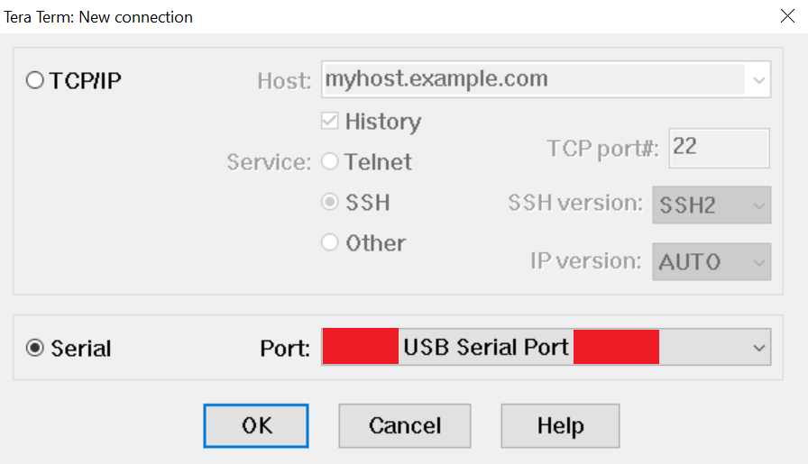
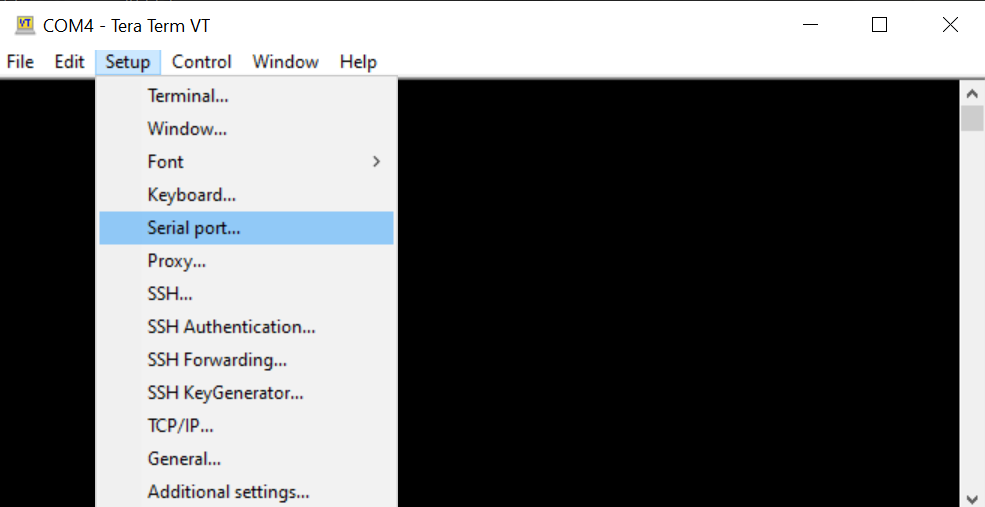
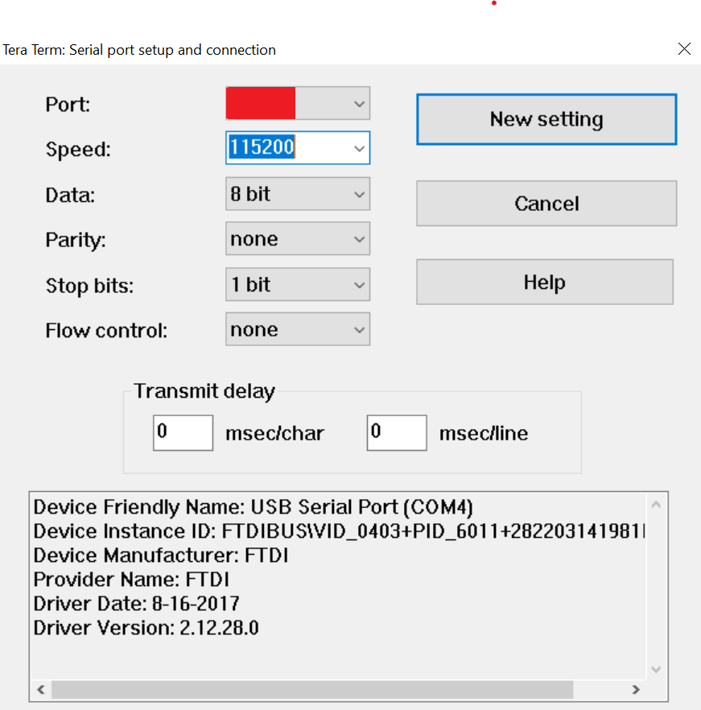

<table class="sphinxhide" width="100%">
 <tr width="100%">
    <td align="center"><h1>AMD Vivado™ Design Suite Tutorials</h1>
    <a href="https://www.xilinx.com/products/design-tools/vivado.html">See Vivado Development Environment on xilinx.com</br></a>
    </td>
 </tr>
</table>

# Linux-based partial image delivery
***Version: AMD Vivado&trade; 2023.2***

## Introduction
This tutorial covers creating a simple Vivado design with one reconfigurable partition and three reconfigurable modules. This design is then used to create a PetaLinux project which will make use of fpgautil and libdfx to program the PL and load the device tree overlays with the relevant driver information.

### Prerequisites
- Vivado and PetaLinux 2023.2
- Access to a VCK190 board
- A micro SD card
- [Xilinx VCK190 BSP](https://www.xilinx.com/member/forms/download/xef.html?filename=xilinx-vck190-v2023.2-10140544.bsp)

### Before You Begin
First, for the commands in this project to work, you must source the Vivado and PetaLinux 2023.2 settings.    

```bash
source <xilinx_install>/Vivado/2023.2/settings64.sh
source <xilinx_install>/Petalinux/2023.2/settings.sh
```

Second, after having downloaded the [BSP](https://www.xilinx.com/member/forms/download/xef.html?filename=xilinx-vck190-v2023.2-10140544.bsp), move it to this project's top-level directory.

Finally, edit <install_directory>/Linux-based-partial-image-delivery/code/libdfx/files/Makefile line 7, changing <INSTALL_DIR> to the absolute path leading to the top-level directory for this project.

### Design Flow
1. Creating the Vivado Design & Exporting XSAs
2. Creating the PetaLinux Project
3. Preparing Micro SD Card for Boot
4. Booting the Project
5. Loading RMs and Drivers in Linux

### Automating steps 1 & 2

If you wish to automate steps 1 one and 2 of this tutorial, execute the following:
```bash
make
```

To clean up the outputs for the project, execute:
```bash
make clean
```

### 1. Creating the Vivado Design & Exporting XSAs

To automate this portion of the tutorial, execute:
```bash
make vivado_prj
```

Or, to see what happens step-by-step:

1. Navigate to the project's top directory.
```bash
cd <install_directory>/Linux-based-partial-image-delivery/
```

2. Launch Vivado.
```bash
vivado
```

3. Create the reconfigurable modules.
```bash
source ./scripts/create_rp1rm1.tcl
source ./scripts/create_rp1rm2.tcl
source ./scripts/create_rp1rm3.tcl
```

4. Create the top BD.
```bash
source ./scripts/create_top_bd.tcl
```

5. Launch synthesis, implementation, and PDI generation. This script will also automatically export the needed XSAs to a new directory Linux-based-partial-image-delivery/xsa.
```bash
source ./scripts/run_impl.tcl
```
Vivado will automatically close once this script it done running.

To clean the outputs from this part of the project, execute:
```bash
make clean_vivado_prj
```

### 2. Creating the PetaLinux Project

In this section, we will be creating a PetaLinux project based on the Vivado design completed in the previous section.

To automate this portion of the tutorial, execute:
```bash
make versal_dfx
```

Alternatively, to do everything step-by-step:

1. Create the PetaLinux project based on the VCK190 BSP.
```bash
petalinux-create -t project -n versal-dfx -s ./xilinx-vck190-v2023.2-10140544.bsp
```

2. Navigate to the PetaLinux project directory.
```bash
cd versal-dfx
```

3. Configure the project based on the full XSA file you generated in the previous section.
```bash
petalinux-config --get-hw-description ../xsa/design.xsa
```

Use arrow keys to navigate up/down the menu.

- Navigate to FPGA Manager and press &lt;ENTER&gt;
- Press &lt;Y&gt; to enable Fpga Manager
- Press &lt;TAB&gt; and &lt;ENTER&gt; to go back to main config menu
- Navigate to Image Packaging Configuration and press &lt;ENTER&gt;
- Navigate to Root filesystem type (INITRD) and press &lt;ENTER&gt;
- Navigate to EXT4 (SD/eMMC/SATA/USB) and press &lt;ENTER&gt;
- Exit the config menu by pressing &lt;TAB + ENTER&gt; twice
- When asked if you want to save the configuration, select Yes (press &lt;ENTER&gt;)

Enabling Fpga Manager enables a built-in command line tool called fpgautil and allows us to create apps with the fpgamanager_dtg and fpgamanager_dtg_dfx templates. These apps are used with fpgautil to load and unload PDIs and partial PDIs from the Linux console.

For the automated flow, in order to skip having to open the config menu (which requires user input), we have instead copied over all of the files that would have been generated by steps 2.1-2.3.

4. Create the static app based on the static XSA file you generated in the previous section.
```bash
petalinux-create -t apps --template dfx_dtg_versal_static -n static-app --enable --srcuri "../xsa/static.xsa"
```

5. Create the rprm apps based on the RPRM XSA files you generated in the previous section.
```bash
petalinux-create -t apps --template dfx_dtg_versal_partial -n rp1rm1-app --enable --srcuri "../xsa/rp1rm1.xsa" --static-pn static-app
petalinux-create -t apps --template dfx_dtg_versal_partial -n rp1rm2-app --enable --srcuri "../xsa/rp1rm2.xsa" --static-pn static-app
petalinux-create -t apps --template dfx_dtg_versal_partial -n rp1rm3-app --enable --srcuri "../xsa/rp1rm3.xsa" --static-pn static-app
```

6. Create the libdfx app and copy over the source code, Makefile, and bitbake file.
```bash
petalinux-create -t apps -n libdfx-app --enable
cp -r ../code/libdfx/* ../versal-dfx/project-spec/meta-user/recipes-apps/libdfx-app/
```

7. Build the project.
```bash
petalinux-build
```

8. Navigate to the /images/linux/ directory and create the boot image.
```bash
cd ./images/linux/
petalinux-package --boot --u-boot
```

9. Copy necessary files to a new directory Linux-based-partial-image-delivery/sdcard.
```bash
mkdir ../../../sdcard
cp BOOT.BIN boot.scr image.ub rootfs.tar.gz ../../../sdcard
```

### 3. Preparing Micro SD Card for Boot

Follow the instructions detailed in [UG1144, Preparing the SD Card](https://docs.xilinx.com/r/2022.2-English/ug1144-petalinux-tools-reference-guide/Preparing-the-SD-Card).

### 4. Booting the Project

In this section, we will be using the micro SD card to boot our project onto the board. Make sure you have a way to monitor serial ports, [Tera Term](https://ttssh2.osdn.jp/index.html.en) is a good free option.

1. Set your VCK190 board to SD boot mode (SW1, [Callout #6](https://docs.xilinx.com/r/en-US/ug1366-vck190-eval-bd/Board-Component-Location)).  
Switch 1 - ON  
Switch 2 - OFF  
Switch 3 - OFF  
Switch 4 - OFF  
2. Insert the micro SD card.
3. Plug in USB-C cable into the board and the other end into your machine.
4. Plug in the power cable.
5. Check your Device Manager to see which COM ports your board is using.
6. Open Tera Term or other equivalent app.
7. Select the COM port corresponding to your board, and make sure the following settings are configured:  
Speed/Baud Rate - 115200  
Data - 8-bit  
Parity - None  
Stop bits - 1 bit  
Flow control - None

Open the app and select a COM port related to your board (in red).
<p align="center">
  
</p>

Open the settings for the serial port.
<p align="center">
  
</p>

Change the settings to the following:
<p align="center">
  
</p>

8. Power on your board.
9. When prompted for your login information, use petalinux as your username and set your own password.

### 5. Loading RMs and Drivers in Linux

In this section, we will be demonstrating how to load and unload full and partial PDIs using fpgautil and libdfx. We will also be showing how to load and unload a device driver in Linux. 

Fpgautil is a built-in command line tool. To enable fpgautil, you need to turn on Fpga Manger in the PetaLinux config menu (see step 2.3) before building a given project. Fpgautil also requires that you build PetaLinux apps with the template fpgamanager_dtg for the static region and fpgamanager_dtg_dfx for the reconfigurable region(s) (see steps 2.4 & 2.5).

Libdfx, on the other hand, is an API that you can bake into a C app of your choosing. Libdfx requires the static library libdfx.a, which you can build yourself by following the instructions in the [libdfx git repository](https://github.com/Xilinx/libdfx). The libdfx repository also comes with an example app at libdfx/apps/libdfx_app.c, and you can also check this repository's Linux-based-partial-image-delivery/code/libdfx/files/libdfx-app.c for a similar example.

Unlike fpgautil, you do not need to build specific apps for libdfx to work. However, you will still need to have the relevant PDIs (static and partial) as well as the relevant DTBO files. For example, you'd need a filestructure that looks something like:

```bash
-->static_folder
	|
	|-->static.pdi
	|-->static.dtbo
	|
	|-->rp1rm1_folder
	|	|
	|	|-->rp1rm1.pdi
	|	|-->rp1rm1.dtbo
	|
	|-->rp1rm2_folder
		|
		|-->rp1rm2.pdi
		|-->rp1rm2.dtbo
```

You will then need to let the libdfx API know where to look for each of these folders. Conveniently, creating apps with the fpgamanager_dtg and fpgamanager_dtg_dfx templates creates this filestructure for us under /lib/firmware/xilinx/. You can see how we've used this to our advantage in Linux-based-partial-image-delivery/code/libdfx/files/libdfx-app.c.

Before the beginning the demo, start a sudo shell (some of the commands we need to run require sudo priviledges).
```bash
sudo -s
```

We will start with demonstrating how to use fpgautil since it is a step-by-step process while running libdfx only requires us to execute a file. If you wish to skip straight to running libdfx, go to substep 9 of this section.

1. Load the static PDI.
```bash
fpgautil -b /lib/firmware/xilinx/static-app/static-app.pdi -o /lib/firmware/xilinx/static-app/static-app.dtbo -f Full -n full
```

You will see that you get several messages that read: "WARNING: memory leak will occur if overlay removed".

These messages are completely normal and nothing to worry about, so long as you follow the correct procedure for loading and unloading PDIs. Always load the static image before any partial images are loaded in. If you wish to swap out a partial images in the same reconfigurable region, you must first unload the current partial image before loading in the new one. Finally, if you want to unload the static image, make sure all reconfigurable regions are unloaded.

2. Among the boot messages, you will be able to find that a DFX Decoupler has been loaded with a memory address of 0xA4400000. Its default state is disabled (not decoupling), so we want to make sure it is enabled before loading in a partial PDI.
```bash
devmem 0xA4400000
```

We should see all 0s at this address, this means the decoupler is disabled.

```bash
devmem 0xA4400000 32 1
```

This will write a 1 to the decoupler, which enables it. The 32 in this command is the width of the register we are writing to (execute devmem -help for more information).

3. We can now load the partial PDIs containing rms 1, 2, and 3, making sure to remove the previous image before loading the next one. To load any of the 3 images, execute:

```bash
fpgautil -b /lib/firmware/xilinx/static-app/rp1rm1-app/rp1rm1-app.pdi -o /lib/firmware/xilinx/static-app/rp1rm1-app/rp1rm1-app.dtbo -f Partial -n PR0
```
```bash
fpgautil -b /lib/firmware/xilinx/static-app/rp1rm2-app/rp1rm2-app.pdi -o /lib/firmware/xilinx/static-app/rp1rm2-app/rp1rm2-app.dtbo -f Partial -n PR0
```
```bash
fpgautil -b /lib/firmware/xilinx/static-app/rp1rm3-app/rp1rm3-app.pdi -o /lib/firmware/xilinx/static-app/rp1rm3-app/rp1rm3-app.dtbo -f Partial -n PR0
```

You can see that, compared to loading the static image, we've changed the following options:  
<code>-f Full --> -f Partial</code><br>
<code>-n full --> -n PR0</code>

These flags let fpgautil know that the images we are attempting to load are partial PDIs and that we are targeting the dynamic region PR0 (if we had more than one reconfigurable region, they'd be denoted as PR0, PR1, PR2, ...etc).

Before we can send instructions to these RMs, we need to disable the decoupler. To do so, execute:
```bash
devmem 0xA4400000 32 0
```

This reverts the decoupler to its default state by changing the 1 we wrote to it earlier back to a 0.

Once you've confirmed that the above commands worked, to properly unload the current partial image before loading the next one, execute:
```bash
devmem 0xA4400000 32 1
fpgautil -R -n PR0
```

This re-enables to decoupler and then tells fpgautil to unload the image in the reconfigurable region PR0.

Once you are comfortable loading and unloading the various partial PDIs, move on to the next step.


4. To verify that RM1 is working, load it and execute:
```bash
devmem 0xA4420000
```

This is the memory address for a GPIO. We are expecting to read a value of 0xFACEFEED.

5. To verify that RM2 is working, load it and execute:
```bash
devmem 0xA4420000
```

This is the memory address for a GPIO (note that this is the same memory address as the GPIO for RM1). This time, we are expecting to read a value of 0xC0000000.

6. Verifying RM3 is a little more complicated as there is a Uartlite instead of a GPIO. This Uartlite is in loopback with another Uartlite that is in the static region. Before we begin verification, make sure that RM3 is loaded.

If you look in /dev/, you should now be able to see two Uartlites, ttyUL0 & ttyUL1. ttyUL0 is the Uartlite in the static region and ttyUL1 is the one in RM3. To verify that these Uartlites are in loopback, begin by monitoring the inputs of ttyUL0.
```bash
cat /dev/ttyUL0 &
```

This will show us the data that comes into ttyUL0. We can now write a simple message to ttyUL1 and see if it gets passed along.
```bash
echo Hello ttyUl1! > /dev/ttyUL1
```

You will see that you get a console message displaying "Hello ttyUL1!", which is from the cat command you ran earlier. This means that the output of ttyUL1 feeds into the input of ttyUL0, which is what we expect. You can now kill the cat command.
```bash
killall -9 cat
```

We can now run the same test, but swap which Uartlite we read from and write to.
```bash
cat /dev/ttyUL1 &
echo Hello ttyUl0! > /dev/ttyUL0
killall -9 cat
```

You should now see a message displaying "Hello ttyUl0!", confirming that the output of ttyUL0 feeds into the input of ttyUL1.

7. To unload the partial and static images, execute:
```bash
devmem 0xA4400000 32 1
fpgautil -R -n PR0
fpgautil -R -n full
```

This command is similar to the one for unloading the static region, but we've replaced "PR0" with "full" which tells fpgautil to unload that region instead.

8. To test that libdfx works as intended, execute:
```bash
/usr/bin/libdfx-app
```

This app runs through the exact same steps we just went through with fpgautil, but uses the libdfx API instead.

 
<p class="sphinxhide" align="center"><sub>Copyright © 2020–2023 Advanced Micro Devices, Inc</sub></p>

<p class="sphinxhide" align="center"><sup><a href="https://www.amd.com/en/corporate/copyright">Terms and Conditions</a></sup></p>