<table class="sphinxhide" width="100%">
 <tr width="100%">
    <td align="center"><h1>Versal™ Adaptive SoC Architecture Tutorials</h1>
    <a href="https://www.xilinx.com/products/design-tools/vivado.html">See Vivado™ Development Environment on xilinx.com</a>
    </td>
 </tr>
</table>


# Modular NoC Performance Tuning

## Introduction to NoC/DDRMC Performance Tuning

This tutorial presents a more complex design example, and it demonstrates the process of refining the design to achieve performance goals. You will start with a system DDR traffic spec and learn how to model this with the NoC, DDR memory controllers, and AXI traffic generators (TGs). You will simulate the design to measure performance, and then work through several design iterations to tune performance. Once the desired traffic spec has been achieved, you will modify the simulated design to work in hardware, then build the design and run it on hardware.

This design uses seven Performance AXI TGs and two AXI NoC instances, each with an integrated 2x32 LPDDR4 Memory Controller block to solve a more challenging system-level DDR bandwidth requirement. Four of the TGs write and read 256-byte transactions with a linear addressing pattern, while the remaining three TGs write and read shorter transactions with a random address pattern. The design process consists of the following phases:


## Description of the Design


1. Understand the DDR traffic spec

2. Define a CSV file to control the Performance AXI Traffic Generator

3. Build and simulate an initial version of the design using Designer Assistance

4. Revise the design to address shortcomings observed in simulation

5. Modify the simulated design to work in hardware

6. Build the design and run it on VCK190

7. Observe the measured traffic bandwidth

### Traffic Spec

This system has 12 concurrent processes, all accessing memory at the same time, with various bandwidth requirements. Four processes are writing in 256-byte bursts, with a linear addressing pattern. Four other processes are reading in 256-byte bursts, also with a linear access pattern. All of these linear accesses are at 2.77 GB/s each.

In parallel with this linear traffic, four other processes are accessing a different part of memory with shorter bursts to random addresses. One process is writing at 2.3 GB/s, while three other processes are reading from random addresses in three subblocks of the same address space to which writes are occurring. The reads require 2.9 GB/s bandwidth for each process.

The DDR Traffic Model is summarized below:

| DDR Operation |  Burst Length (bytes)  |  Access Pattern  |  Throughput (GB/s)  |
|---|---|---|---|
| Linear Write 1 | 256 | Sequential | 2.77 |
| Linear Write 2 | 256 | Sequential | 2.77 |
| Linear Write 3 | 256 | Sequential | 2.77 |
| Linear Write 4 | 256 | Sequential | 2.77 |
| Linear Read 1 | 256 | Sequential | 2.77 |
| Linear Read 2 | 256 | Sequential | 2.77 |
| Linear Read 3 | 256 | Sequential | 2.77 |
| Linear Read 4 | 256 | Sequential | 2.77 |
| Random Write | 128 | Random | 2.27 |
| Random Read 1 | 128 | Random | 2.8 |
| Random Read 2 | 128 | Random | 2.8 |
| Random Read 3 | 128 | Random | 2.8 |

### Using a CSV File to Control the Traffic Generator

In the previous labs, you learned how to use the Performance AXI TG to create traffic to and from memory in your simulations. These examples have all used the non-synthesizable version of the TG. This version is convenient for simulation purposes, but it has the disadvantage of not being usable in actual hardware. For this tutorial, the design will ultimately be run in hardware, so you will switch to using the synthesizable version of the TG. While this version can be implemented in hardware, it has some limitations relative to the non-synthesizable version. Refer to *PG381 Performance AXI Traffic Generator Product Guide* for a complete description of the differences between the two versions.

For now, an important difference is that the Synthesizable TG requires a CSV file to define the traffic pattern. For the initial attempt at the design, try a single TG to drive all the traffic. The CSV file might look as follows.

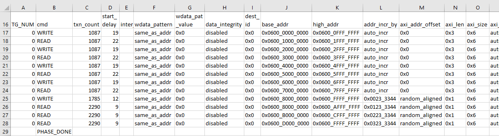

### Linear Read and Write Commands

Rows 17-24 in the CSV are used to configure the linear write and read traffic. AxSIZE is set to 0x6 in column O, representing a burst size of 64. AxLEN is set to 0x3 in column N, representing a burst length of 4, so each linear write or read burst is 256 bytes, matching the traffic spec. Column D, start_delay, is used to regulate the bandwidth of traffic being driven by the TG. For a burst length of 4, each write command requires four AXI clock cycles, and each read requires one cycle. For each write or read, start_delay AXI cycles are introduced after each command before the next write or read is issued. Therefore, a start delay of 19 for writes and 22 for reads means one write or read command will be issued every 23 cycles. At an AXI clock rate of 250 MHz, with 256 bytes per burst, which means linear traffic is driven at 250 MHz × 256 bytes ÷ 23 = 2.78 GB/s. Each write or read stream is directed to a unique address range, as shown by the address in columns J and K. Within each address range, the addresses are incremented in a linear fashion. Transaction count, in column C, is chosen such that the simulation should complete in about 100μs, assuming the system is able to handle the traffic demand.

**Note**: It is important not to set the transaction count too low. The memory controller must periodically interrupt traffic to execute refresh commands in the DDR memory. Xilinx recommends running the simulation long enough to cover at least 10 refresh cycles.

### Random Read and Write Commands

Rows 25-28 in the CSV are used to configure the random write and read traffic. AxSIZE is set to 0x6 in column O, representing a burst size of 64. AxLEN is set to 0x1 in column N, representing a burst length of 2, so each random write burst is 128 bytes, matching the traffic spec. Just like the linear traffic lines, start_delay, is used to regulate the bandwidth of traffic being driven by the TG. For a burst length of 2, each write command requires two AXI clock cycles, and each read requires one cycle. The calculation of bandwidth vs. start_delay follows the same methodology explained for linear traffic. The write traffic is directed to a range of addresses, separate from that used for the linear traffic. The three random read traffic streams are directed to random addresses in three separate ranges within the range to which data is being written.

### Building and Simulating the First Design Iteration

#### Design Flow Steps

To run the tutorial end to end, source build_design.tcl in the attached archive. Follow the steps below to interactively run the tutorial in GUI.

1. Enable the Modular NoC Parameter.

   The Modular NoC project is gated by the parameter. User must set the following parameter before the project is created/opened.

   ```
   #Set the parameter to enable NoC RTL flow
   set_param project.enableModularNoc 1
   ```

   ```
   #Suppress a false flag of error message specific to modular NoC in 2023.
   set_msg_config -suppress -id {Common 17-116}
   ```

1. Create Project targeted at VCK190 board.

   Create the Vivado project. This tutorial project is targeted at VCK190 board. User is free to choose different board as the Modular NoC works across all versal devices.

   ```
   #Create the project in the output directory
   create_project project_1 ./vivado_prj -force  -part xcvc1902-vsva2197-2MP-e- S
   ```

   ```
   #Set the board part
   set_property board_part xilinx.com:vck190:part0:3.2 [current_project]
   ```

1. Add Design sources (RTL/BD/XCI) to the project

   Add the design sources that include the custom RTL, Block Design (BD) and other IP (XCI) sources.

   ```
   #####Read all sources for building the project#####
   #Read the system BD that has only CIPS and DDR NOCs
   import_files  ./sources/bd/design_1.bd
   ```

   ```
   #Read the RTL files that have XPM NMUs and NSUs instantiated along with traffic generators
   import_files ./sources/rtl/
   ```

   ```
   #Add the CSV file to be used for configuring the traffic pattern for traffic generator
   import_files ./sources/csv/all_in_one.csv
   ```

   ```
   #Read the XCI files for Performance Traffic Generators and VIO IPs
   import_files {{./sources/xci/axis_vio_pl_master_to_ddr/axis_vio_pl_master_to_ddr.xci} {./sources/xci/perf_axi_tg_pl_master_to_ddr/perf_axi_tg_pl_master_to_ddr.xci} {./sources/xci/axi_pmon_0/axi_pmon_0.xci}}
   ```

   ```
   #Read the testbench files for simulation to sim_1 fileset only
   import_files -fileset sim_1 ./sources/testbench
   ```

1. IP Integrator in the tutorial

   In the tutorial, the IP Integrator is used solely to insert the CIPS and DDRMC.

   

   *IP Integrator in the tutorial*

1. Design Sources View

   The Design Sources view is shown below. It has one BD and one RTL hierarchy for the NoC topology mentioned above.

   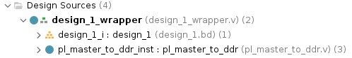

   *Sources Hierarchy View*

1. PL Peripherals used in the tutorial

   For the PL master, the design uses the AXI Performance Traffic Generator IP. For the PL Slave, design uses the AXI BRAM controller. Below is the hierarchy for PL to DDR use case.

   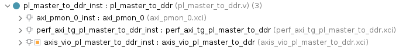

   *Example: PL to DDR NoC topology design sources*

1. AXI Connectivity b/w PL peripherals and XPM NoCs

   In the RTL, The AXI master interface of PL peripheral (Traffic Generator) is connected to AXI master interface in XPM instantiation of NMU. Users can also control the data width and address width of the XPM's AXI interfaces using its parameters. Below is a snippet of AXI connections made from PL traffic generator to the AXI signals of XPM NMU.

   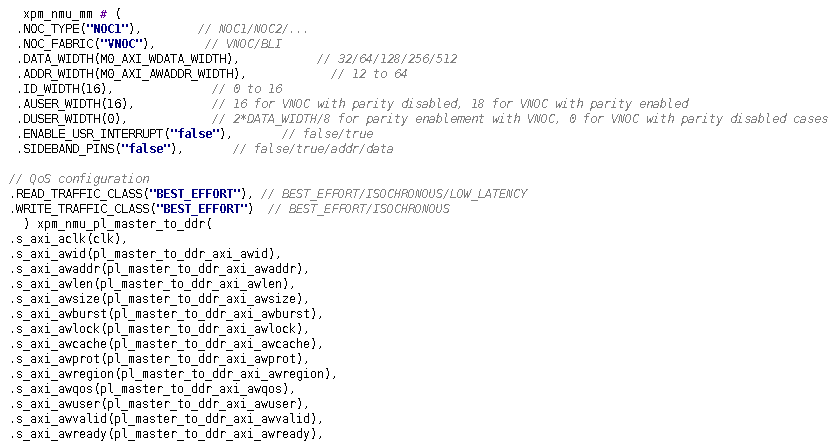

   *PL Peripheral to XPM NoC connection*

1. AXI Performance Traffic Generator Configuration

   The design uses a single "all_in_one" CSV file to configure the Performance Traffic Generator (AXI PTG). Please refer [*"PG381"*](https://docs.xilinx.com/r/en-US/pg381-perf-axi-tg-spec) for more details regarding Performance Traffic Generator and its customization.

   

   *CSV used for AXI PTG configuration.*

1. Integration of Debug in the design

   Standard debug flow continues to work with Modular NoC flow. Debug cores like AXI VIO and ILA are used in this project. AXI Debug Hub is instantiated in the IP Integrator, to which the debug cores will be connected during opt_design phase.

1. AXIS VIO IP*

   In this tutorial, AXIS VIO IP is used for each Traffic Generator. VIO IP is configured to drive the input signals: "reset" and "start" of the Traffic Generator, and to monitor the output signals "error" and "done" via hardware manager.

   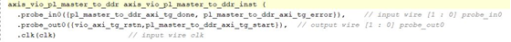

   *AXIS VIO instantiation in PL master*

1. MARK_DEBUG and ILA*

   The tutorial also applies MARK_DEBUG on AXI signals in the RTL. Post-Synthesis, we have used "Set Up Debug" flow to connect these signals to the ILA. The resulting constraints are stored in the design_1_wrapper_debug.xdc. User can choose to connect only the AXI control signals to ILA while setting up the debug at "Set up Debug" phase.  

   ```
   ##Read the XDC files that has constraints for creating ILAs and for connecting them to debug hub in the design. This constraint is auto-generated by the tool based on "Set up Debug" flow.
   import_files -fileset constrs_1 ./sources/xdc/design_1_wrapper_debug.xdc
   ```

   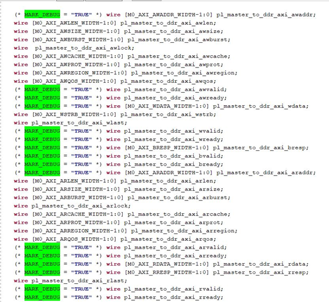

   *MARK_DEBUG in RTL*

1. Generate the Targets for XCI and BDs

   User must generate the outputs of sources XCI and BD before calling `validate_noc`. This is an essential step as `validate_noc` command does RTL elaboration and does expect all sources to be generated to RTL before it is called.

   ```
   #####Generate targets : XCI/BD######
   generate_target {synthesis instantiation_template} [get_files { axis_vio_pl_master_to_ddr.xci perf_axi_tg_pl_master_to_ddr.xci design_1.bd}]
   ```

1. Launch `validate_noc` and Observe CRITICAL WARNING about unconnected XPM NoCs

   ```
   validate_noc
   ```

   To confirm that the project recognizes the NoC XPMs, execute the `validate_noc` command in the TCL console. When you run this command, you will notice critical warnings. These warnings indicate that the tool has provisionally recognized the XPM instances of the NoC but has not established a valid connection to egress or ingress NoC endpoints. This essentially informs the user that the tool has identified the XPM instances of the NoC but has not connected them to a valid egress or ingress NoC endpoint.

   *CRITICAL WARNING: [filemgmt 56-606] Provisionally validated top block 'design_1_wrapper'. NOC interface '/_1_pl_slave_from_cips_inst/xpm_nsu_mm_pl_slave_from_ps/M_AXI_nsu' is currently unconnected. Please connect all NOC interfaces before implementing design.*

   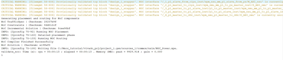

   *`validate_noc` to demonstrate unconnected XPM NoCs*

1. `get_noc_interfaces` command

   To verify that the tool recognizes all the NoC interfaces, you can use the `get_noc_interfaces` command in the TCL console. This command will provide a list of all NMUs and NSUs within the project. In this particular project, this list encompasses NMUs and NSUs from both BD and RTL sources.

   

   *`get_noc_interfaces` command*

1. Adding NoC XDC constraint file

   Now, user should add the constraint file to specify the NoC constraints for making connections, specifying aperture and for setting QoS settings. In the tutorial project, file used to provide NoC constraints is `noc_constraints.xdc`.

   ```
   ##Read the XDC files for creating NoC connection, setting its QoS settings and the aperture of XPM NSUs.
   import_files -fileset constrs_1 ./sources/xdc/noc_constraints.xdc
   ```

   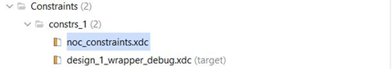

   *NoC constraints XDC sources window*

1. `get_noc_interfaces` command

   To simplify the XDC demonstration, we have assigned each NoC interface to a variable which is used later for subsequent commands.  

   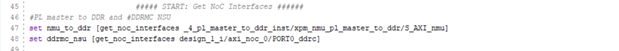

1. `get_noc_interfaces` command

   `get_noc_interfaces` command is used to specify the connection between NMU and NSU. `-source` and `-target` arguments are used to specify the NMU and NSU respectively. The command returns the NoC connection, which is a first class TCL object in Vivado. In the constraint shown below, all created connections are assigned to a variable to which we can assign NoC path specific properties.

   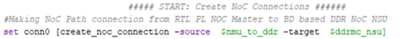

   *`get_noc_interfaces` example*

1. Set QoS properties at the NoC connection

   Once the NoC connections are established in the XDC, user can provide the QoS requirements. User editable QoS properties for a connection in the XDC are: `READ_BANDWIDTH`, `WRITE_BANDWIDTH`, `READ_AVERAGE_BURST`, and `WRITE_AVERAGE_BURST`. If the user has not provided any QoS numbers, the tool will use the default values.

   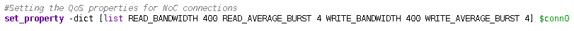

   *QoS properties at the NoC connection*

1. USED_IN "synthesis_pre" for NoC Constraint file

   The NoC constraints file should be marked as USED_IN {synthesis_pre}. This is a necessary step for the `validate_noc` command to see the NoC constraints.

   *set_property USED_IN {synthesis_pre} [get_files ./vivado_prj/project_1.srcs/constrs_1/imports/xdc/noc_constraints.xdc]*

   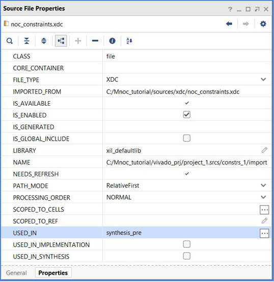

   *USED_IN synthesis_pre for NoC constraints file*

1. `validate_noc` command to observe system level NoC view

   Now that you have instantiated the Xilinx Parameterized Macros (XPMs), established connections through Xilinx Design Constraints (XDC), and configured Quality of Service (QoS) properties using XDC, you are prepared to examine the system-level Network on Chip (NoC) view. To do this, execute the `validate_noc` command. This command initiates RTL elaboration, applies NoC constraints from XDC, and invokes the NoC compiler. Additionally, the `validate_noc` command includes multiple embedded design rule checks (DRCs) to ensure the validity of the overall system-level NoC solution.

   ```
   validate_noc
   ```

   The following message in `validate_noc` log confirms that it is applying the XDC file that contain NoC constraints.

   *INFO: [Project 1-4937] Applying constraint file 'project_1.srcs/constrs_1/imports/xdc/noc_constraints.xdc' onto module instance '/'

   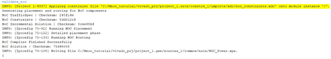

   *validate_noc output*

1. How to select System Level NoC in tool

   To see the system level NoC view, click the Project Manager in the Flow Navigator, followed by "NoC" in "Window" tab of the menu bar.

   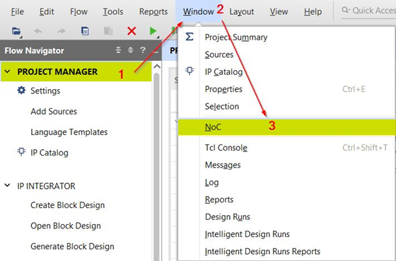

   *How to select System Level NoC View*

1. System level NoC Objects Tab

   The NoC objects tab shows NoC endpoints from all design sources. Picture shown below shows the NMUs from both block diagram and RTL. Marked below are the XPM NOCs from the RTL.

   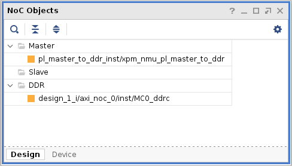

   *System Level NoC objects View*

1. System Level NoC Viewer

   Noc Viewer shows NoC endpoints from all design sources along with switches used by the connections.

   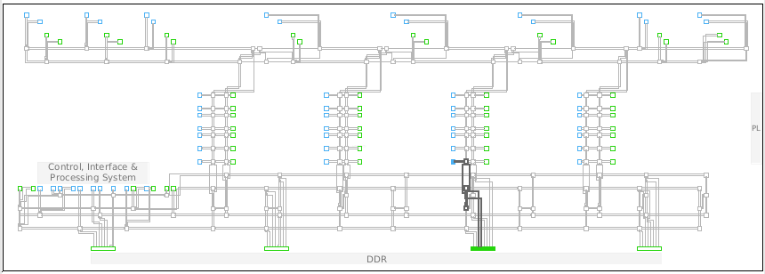

   *System Level NoC Viewer*

1. System Level NoC QoS Tab

   NoC QoS tab should reflect the numbers user requested in the XDC file for the NoC connections from/to the XPM NMUs and NSUs.

   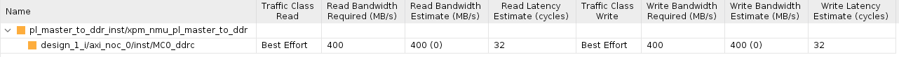

   *System Level NoC QoS view*

### Analyzing the Results

When the simulation completes, you can make several observations.

The Tcl Console shows messages from the simulator and the AXI Performance Monitor.

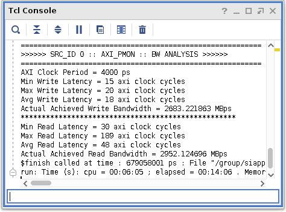

From this, you can see the Achieved Write Bandwidth ~ 2.7 GB/s, Achieved Read Bandwidth ~ 3.0 GB/s, and the simulation duration was 679μs. This falls far short of our intended targets of ~13.4 GB/s write and ~19.8 GB/s read bandwidth. Also, as discussed in the description of the CSV file, the simulation is intended to complete in about 100μs.

By looking at the waveform display, you can see other problems.

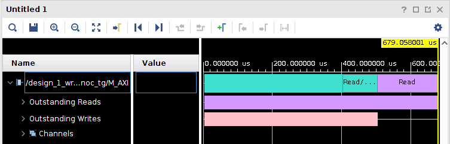

You can see the writes finished before the reads. The intention was for all traffic to happen concurrently, and for writes and reads to complete at the same time.

Expand the Channels display to view *Read and Write Addresses*, and then zoom in at the beginning of the simulation.

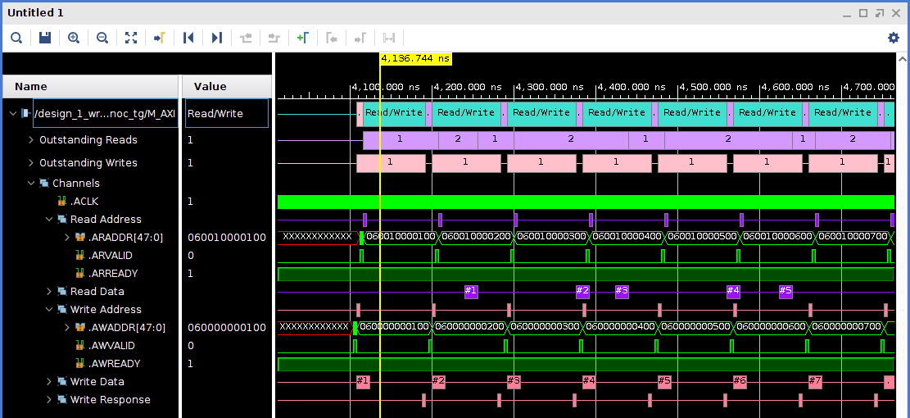

You can see the reads are all linear reads starting at 0x0600_1000_0100 and the writes are all linear writes starting at 0x0600_0000_0100. This corresponds to the first two rows in the CSV, but no other traffic is visible. By further studying the waveform, you can see that the TG can issue simultaneous reads and writes, but multiple separate CSV entries for reads and writes are executed sequentially, not in parallel. Our system traffic spec requires all traffic to happen concurrently, so more traffic generators are required to properly model the traffic spec.

It is also worth looking at the memory efficiency required to meet the traffic spec. With a 2x32 LPDDR4 operating at 3930 Mb/s, the maximum possible bandwidth is 3.930 GB/s × 8 = 31.4 GB/s. This assumes zero overhead for refresh and page misses. In order to meet this traffic spec, you would need to achieve (13.4 GB/s write + 19.8 GB/s read) ÷ 31.4 GB/s = 105% efficiency. Figure 22 in *PG313 Versal ACAP Programmable Network on Chip and Integrated Memory Controller* shows that 45.5% efficiency is expected for 128B random read only traffic to a 2x32 LPDDR4 memory.

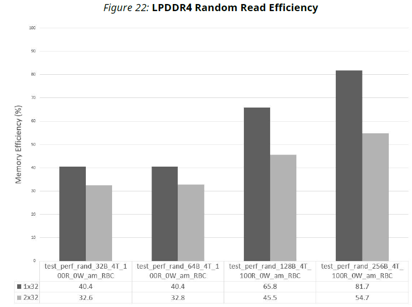

With a mix of linear and random read and write traffic, even lower efficiency is expected.

In order to meet the traffic spec, you will have to add more TGs and a second LPDDR4 interface.

### Modifying the CSV File

By changing the TG_NUM column in the CSV file, you can use one CSV to control multiple instances of the AXI Performance TG. In order to drive all traffic concurrently, each TG can have no more than one read command and one write command. Following is a snapshot showing the change.

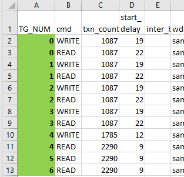

Also, you will change the traffic patterns such that all the linear traffic is directed to one 2x32 LPDDR4 DDR memory controller, and all the random traffic is directed to a separate memory controller. In order to accomplish this, you will need different address regions for the two different controllers. Send linear traffic to DDR CH1 and leave the random traffic at DDR CH2. Following is a snapshot showing the revised address ranges.

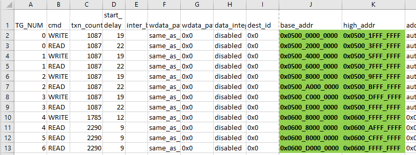

### Building and Simulating the Second Design Iteration with Multiple Traffic Generators

Close the first design in Vivado, by selecting File &rarr; Close Project. We have provided a Tcl script to generate the second design. In the Vivado Tcl Console, cd to the `Performance_Tuning/second_design_multiple_tgs/design` directory. Then source `./second_design.tcl`.

After the design finishes building, run a behavioral simulation. The results are summarized in the following table.

|  Traffic Generator  |  Write Bandwidth (GB/s)  |  Write Bandwidth Target (GB/s)  |  Read Bandwidth (GB/s)  |  Read Bandwidth Target (GB/s)  |
|---|---|---|---|---|
| 0 | 2.19 | 2.77 | 2.24 | 2.77 |
| 1 | 2.10 | 2.77 | 2.19 | 2.77 |
| 2 | 2.19 | 2.77 | 2.18 | 2.77 |
| 3 | 2.19 | 2.77 | 2.15 | 2.77 |
| 4 | 2.26 | 2.27 | 2.14 | 2.8 |
| 5 | 0 | 0 | 2.14 | 2.8 |
| 6 | 0 | 0 | 2.14 | 2.8 |


The waveform display is as follows.

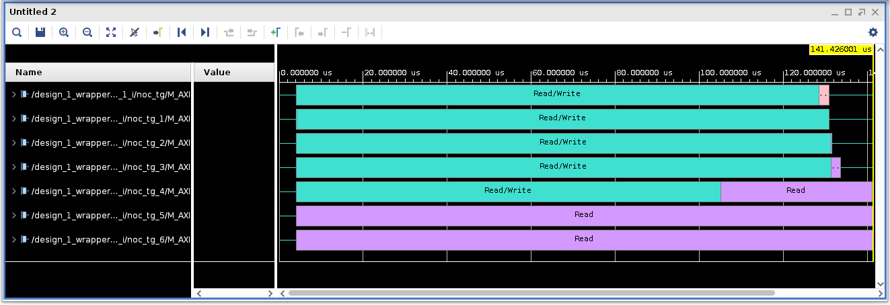

You can see the random writes achieve almost all the desired bandwidth, but the linear writes and all the reads fall short.

### Debugging the Second Design

By looking at some additional signals in the simulation, you can gain some insight into why the desired bandwidth is not being achieved. You can view signals to the LPDDR4 memory by probing nets in the internal DDR responder model.

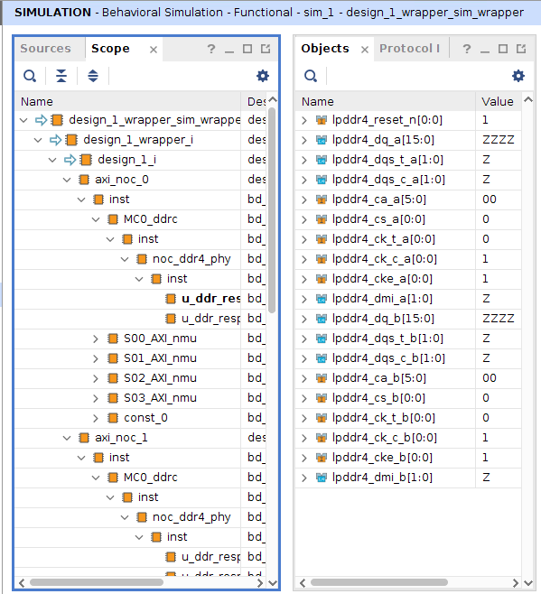

Add all `lpddr4_dqs_t_*[1:0]` signals from both channels of both axi_noc instances by dragging them from the Objects list to the waveform display, and then rerun the simulation. Now the waveform display looks as follows.

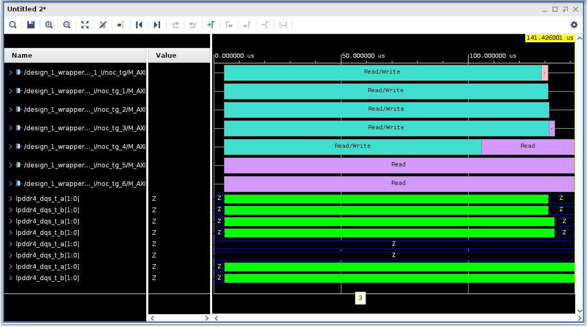

You can see there is no traffic on axi_noc_1 LPDDR4 channel `0`. All the random reads and writes are directed to the upper half of the DDR CH2 address range to which you mapped axi_noc_1.

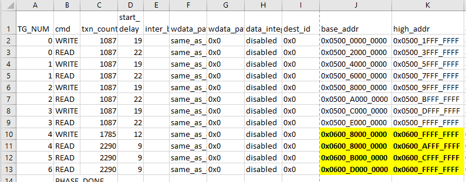

The dual-channel LPDDR4 controller is not interleaving the two 1x32 channels, so all of the traffic is going to ch1. To change this, double click on the axi_noc_1 instance in the Block Design. On the DDR Memory tab, click the check box for Channel Interleaving.

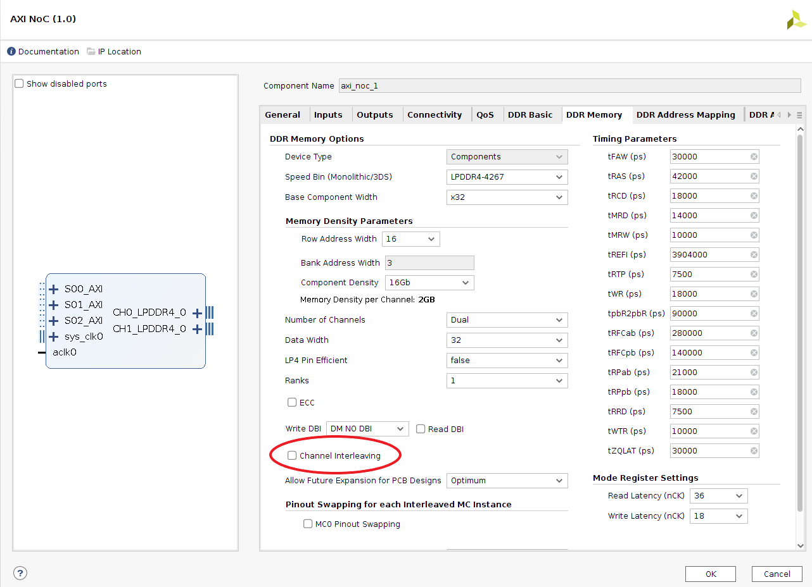

This adds an additional field, allowing you to select Interleaving Granularity.


Given the random traffic is in 128-byte bursts, it makes sense to try setting this to 128 Bytes. Make that edit, and similarly edit the axi_noc_0 instance to enable 256-Byte interleave to match the 256-byte linear burst size. Now, resimulate.

The new simulation results are summarized in the following table.


|  Traffic Generator  |  Write Bandwidth (GB/s)  |  Write Bandwidth Target (GB/s)  |  Read Bandwidth (GB/s)  |  Read Bandwidth Target (GB/s)  |
|---|---|---|---|---|
| 0 | 1.62 | 2.77 | 1.71 | 2.77 |
| 1 | 1.62 | 2.77 | 1.72 | 2.77 |
| 2 | 1.62 | 2.77 | 1.71 | 2.77 |
| 3 | 1.62 | 2.77 | 1.71 | 2.77 |
| 4 | 2.29 | 2.27 | 2.92 | 2.8 |
| 5 | 0 | 0 | 2.95 | 2.8 |
| 6 | 0 | 0 | 2.94 | 2.8 |


From the waveform display, you can see that the random traffic is now distributed across both channels of the memory controller in axi_noc_1.

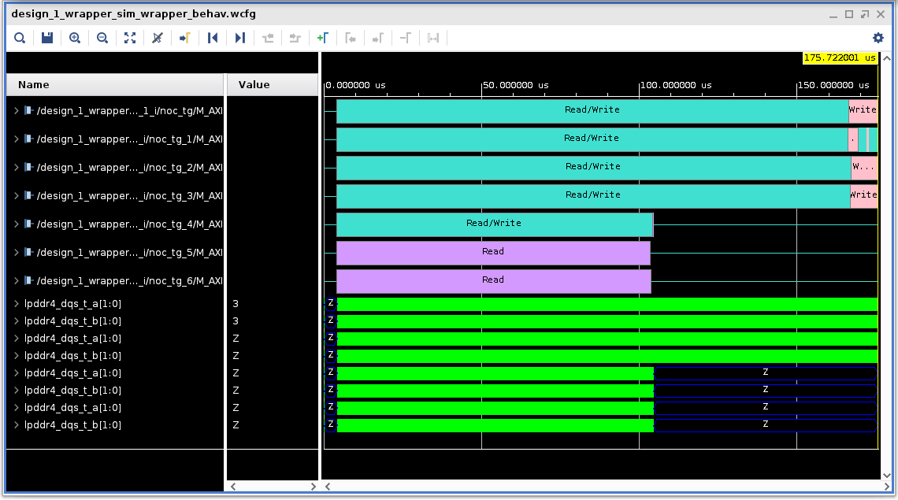

The random traffic now meets the bandwidth targets.

However, the linear traffic is a bit worse, so now try tuning it.

### Address Mapping for Linear Traffic

To achieve the best performance with linear traffic, it is important to optimize the DDR Address Mapping to match the traffic pattern. LPDDR4 memory has eight banks, as selected by the Bank Address bits. At any given time, only one row can be activated per bank. If the memory controller needs to access a row that is not active in a given bank, it must first execute a precharge command to close the open row, then an activate command to open the desired row. Only then can the read or write command be issued. This incurs a timing penalty of tRPpb + tRCD, or 36 ns in the case of LPDDR4. There are two ways to avoid this timing penalty:

1. Structure memory access and address mapping such that you leave pages open as long as possible. As an extreme example, you would not want to map the addresses such that lowest order bits mapped to row addresses. If that were the case, each subsequent address would force a precharge/activate (or page miss) penalty. Instead, map low order bits to column addresses rather than row addresses.

2. Divide the traffic such that there are multiple streams of data with each stream accessing one bank, and ideally, with all eight banks open at once. For example, if your processing is pipelined, memory access might be structured as shown in the following sequence: 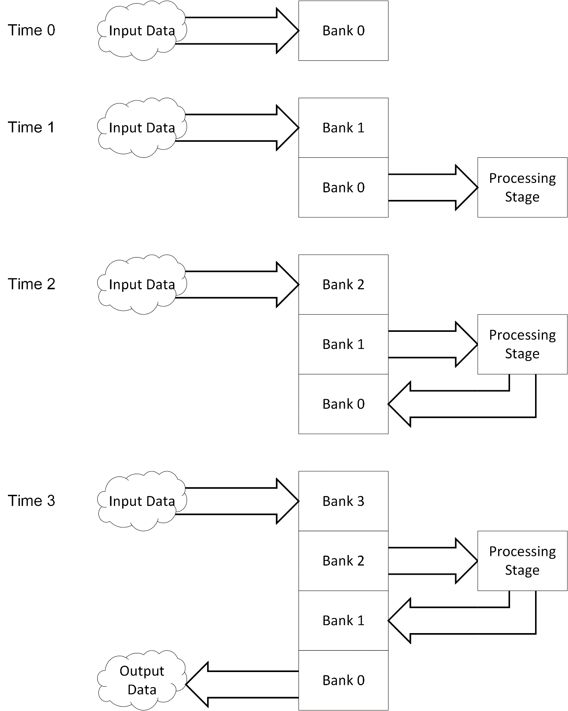 At any given time, only one process is accessing a memory bank at a time. It is important to avoid having multiple processes accessing the same bank at the same time, as in that case, one process could cause page misses in the other process. By structuring the memory traffic as shown in this example, the memory controller can "hide" the impact of page misses. While one process is stalled waiting for a page miss, the memory controller can reorder transactions to allow other processes to continue in other banks.

> While this example shows four banks in use, ideally your application can be structured such that all eight banks are in use.

In the traffic generator model, we always write to some banks, and we always read from other banks. There is no logic to switch the pointer from bank to bank at each time interval. This is a reasonable approximation of the DDR bandwidth demands, as it stresses the NoC and DDRMC with concurrent writes and reads. The final design would require the addition of logic such that you read data that was previously written.

Similarly, you can choose an address mapping for the random traffic. You can experiment with different mappings, but for this traffic spec, the default ROW BANK COLUMN seems to work well.

For more in-depth discussion of address mapping, refer to *PG313 Versal ACAP Programmable Network on Chip and Integrated memory Controller*.

### Editing the Address Mapping

To align the DDR Address Mapping with the traffic pattern defined in the CSV file, select a different mapping as follows:

1. Double-click the axi_noc_0 instance in the block design.

1. Select the DDR Address Mapping tab. The default address mapping is ROW BANK COLUMN.

   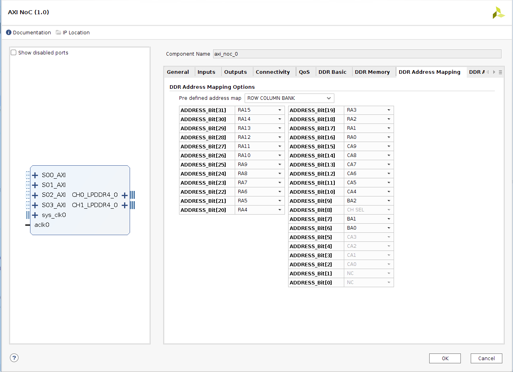

1. Pull down the Pre-defined address map list, and then choose BANK ROW COLUMN. Now the Bank Address Bits are assigned to address bits `[31:29]`. This matches the linear traffic in the CSV file.

   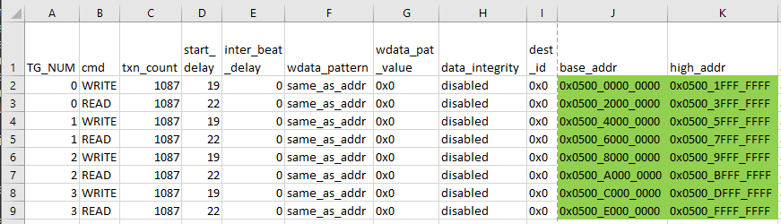

   You can see that each write or read process corresponds to an address range that maps to a unique bank address.

1. Rerun **Validate Design**, **Generate Block Design**, and **Run Simulation**.

Now, the design meets the traffic spec requirements.

### Verifying the Design in Hardware

To run the design in hardware, you will need to make some modifications. The Performance AXI TG has a feature whereby VIOs can be used to load instructions and read registers. Use this feature to load the CSV into hardware, enable performance counters in the traffic generator, launch traffic, and then read out the results from the performance counters.

Modifying the design is somewhat involved, so instead of walking through each step individually, a final design has been provided that runs on hardware.

In the Tcl console, cd into `finished_design/design`. Source `vck190_4tg_lin_mc1_3tg_rnd_mc3.tcl`. It takes about an hour to build the design and generate the PDI. Once the script has finished, Open Block Design.

The complete design appears as follows:

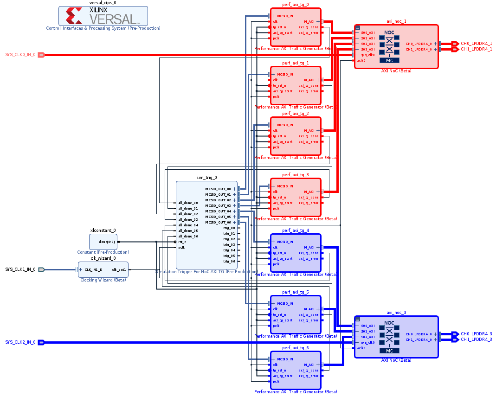

The linear TGs and NoC instance are highlighted in red. The random TGs and NoC instance are highlighted in blue. The other blocks are necessary for clock generation and controlling the TGs.

Notice some significant differences:

1. This block diagram has an instance of the Control, Interfaces & Processing System (or CIPS). In Versal ACAPs, all designs must have an instance of CIPS. This block includes the Platform Management Controller (PMC), which is required for device bring-up.

1. The TGs now have an extra port enabled to facilitate traffic reloading.

1. The Simulation Trigger also has an extra port enabled for traffic reloading.

1. Each memory controller requires an external sys_clk, and an additional sys_clk input has been added to generate the internal AXI clock.

1. The CSV has been switched such that at boot up, each TG executes a single dummy read command, and then stops. These are shown in the EMPTY.csv file. After boot, scripts will be used to control the VIOS to load the desired traffic patterns.

1. In both axi_noc instances, MC0 Flipped pinout has been selected on the DDR Memory configuration tab.

   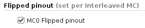

   > The VCK190 board uses flipped pinout for both of the LPDDR4 interfaces. This is described in PG313.

1. A constraint file has been added to define the pinout being used for this memory configuration.

### Load the Design into Hardware

- Launch Vivado
- Open Hardware Manager
- Open New Target to connect to the VCK190
- Tools &rarr; Program device
  - PDI: `Tutorials/NoC_DDRMC/Performance_Tuning/finished_design/design/myproj/project_1.runs/impl_1/design_1_wrapper.pdi`
  - LTX: `Tutorials/NoC_DDRMC/Performance_Tuning/finished_design/design/myproj/project_1.runs/impl_1/design_1_wrapper.ltx`
- Hardware Manager should show that DDRMC calibration passed

### Launch Traffic Generators and Performance Counters

In Vivado Tcl Console:

```
cd ./scripts
```

```
source ./total_flow_7tg_inf.tcl
```

This script accomplishes the following:

1. Reads the traffic patterns descriptions in `scripts/4TG_LIN_MC1_3TG_RND_MC3_M*.csv`

2. Converts them to .mem format

3. Loads the patterns into block RAM

4. Sets up performance counters in the traffic generators

5. Launches the traffic pattern

6. Reads the results from the performance counters

7. Writes the results to `RESULT.csv`

More information about the traffic generators can be found in *PG381 Performance AXI Traffic Generator Product Guide*.

### Outputs

- Results will be captured in `./scripts/RESULT.csv`, a sample of which is shown below:

  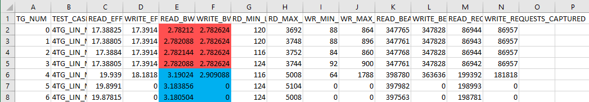
- Random write BW (GB/s) is in cell F6
- Random read 1 BW (GB/s) is in cell E6
- Random read 2 BW (GB/s) is in cell E7
- Random read 3 BW (GB/s) is in cell E8
- Linear write BW (GB/s) is in cells F2, F3, F4, and F5
- Linear read BW (GB/s) is in cells E2, E3, E4, and E5

### Using the Tutorial with Boards Other than VCK190

As written, this tutorial is designed to work with VCK190 and the xcvc1902-vsva2197-2MP-e-S part. With minor modifications, the same design can be made to work with other boards/parts. Here are things to consider when trying to use a different board.

#### Different Versal Part and/or Clock Rates

Other boards may use a different Versal part at a different clock rate. For the early parts of the tutorial, in which you assemble a block design manually or with a script, you should substitute the Versal part on your board. If necessary, change the sys_clk rates to match those found on your board.

#### Different Memory Controllers

This tutorial uses both of the 2x32 LPDDR4 memory interfaces on VCK190. Other boards may have fewer LPDDR4 interfaces, perhaps with more DDR4 interfaces instead. The memory data rate may be greater or less than what is possible on VCK190. You may need to edit the type of memory used in the designs to match what is found on your board.

#### Different Simulation Results

As a consequence of using different parts, clock rates, memory controller types, and memory data rates, your simulation results will likely vary somewhat from those quoted in this tutorial.

#### Changes Required in Hardware Design

The LPDDR4 memory interfaces on VCK190 use banks 703-5 and 709-11. Other boards likely use different memory interfaces. This will require providing a different XDC file to match the memory configuration on a given board. Also, some of the memory configuration may need to be changed. For example, VCK190 uses flipped pinout on both LPDDR4 memory interfaces. Other boards might not use flipped pinout. Refer to [XD031 Obtaining and Verifying Versal ACAP Memory Pinouts](https://github.com/Xilinx/Vivado-Design-Tutorials/tree/master/Device_Architecture_Tutorials/Versal/PCB_Design/Memory_Pinouts) for information about how to generate an XDC file for a given board pinout. [UG994 Vivado Design Suite User Guide - Designing IP Subsystems Using IP Integrator](https://www.xilinx.com/support/documentation/sw_manuals/xilinx2020_2/ug994-vivado-ip-subsystems.pdf) *Chapter 12: Using the Platform Board Flow in IP Integrator* explains how to create a block design targeting a specific board. By using the Platform Board Flow, it is possible to create a temporary block design, instantiate one or more memory interfaces from that board, then view the properties of the NoC instances to see whether flipped pinout is used, as well as other relevant memory configuration properties. You will also need to edit the Tcl script used to generate the final design such that the block diagram pin names for the memory interfaces and sys_clks match the corresponding pin names in the XDC for the board you are targeting.

#### Changes Required in Run Scripts

Edit `total_flow_7tg_inf.tcl` and `sptg_top_load_bram_vck190.tcl`. Change the following lines to match the device on your board:

```
set device "xcvc1902_1"
```


<hr class="sphinxhide"></hr>

<p class="sphinxhide" align="center"><sub>Copyright © 2020–2024 Advanced Micro Devices, Inc.</sub></p>

<p class="sphinxhide" align="center"><sup><a href="https://www.amd.com/en/corporate/copyright">Terms and Conditions</a></sup></p>
