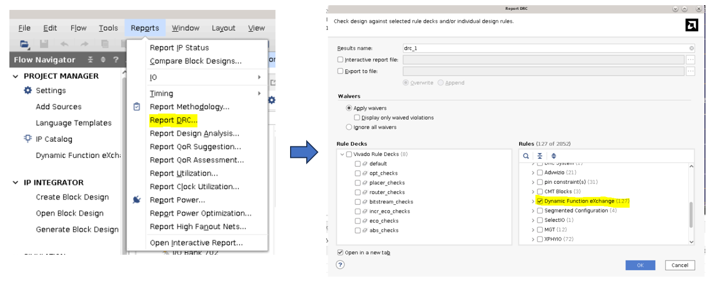
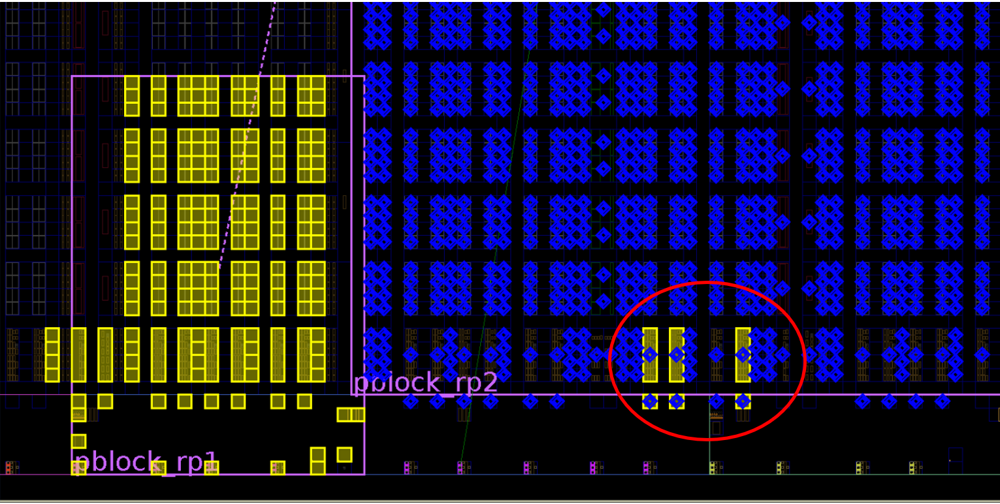
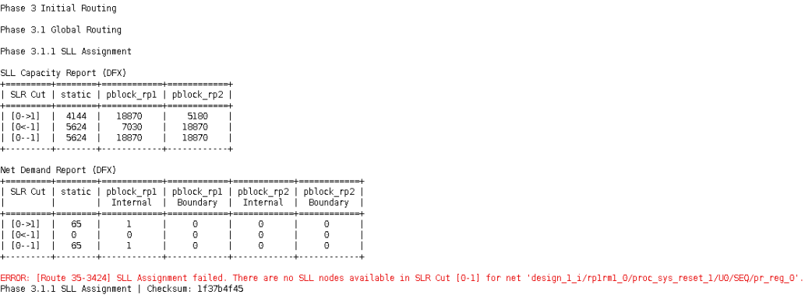
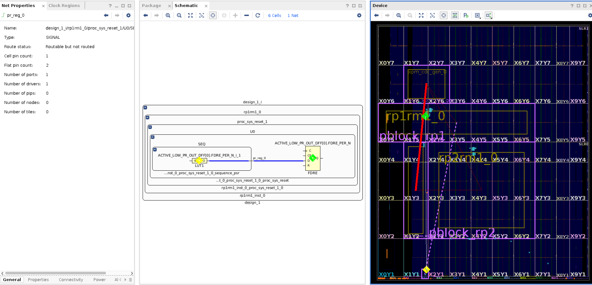
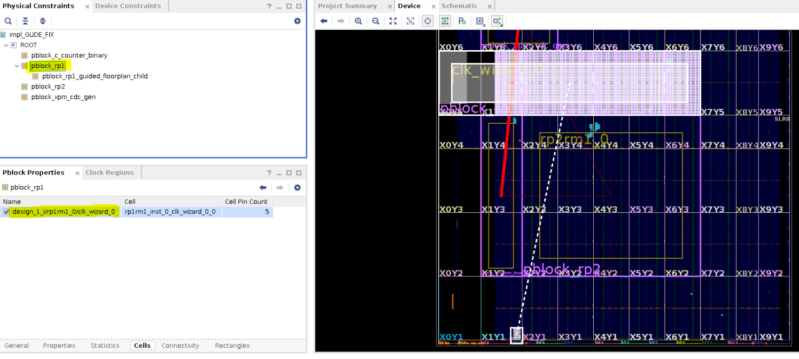
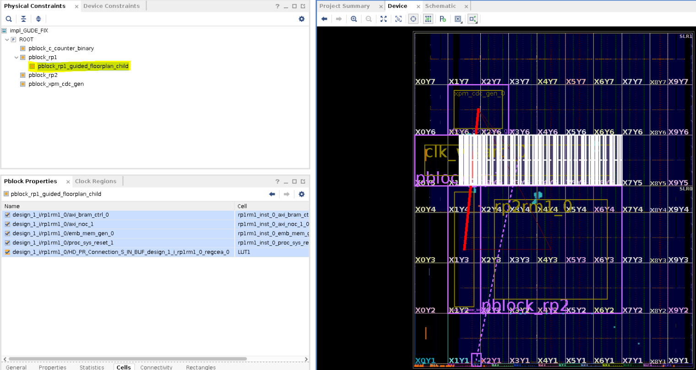
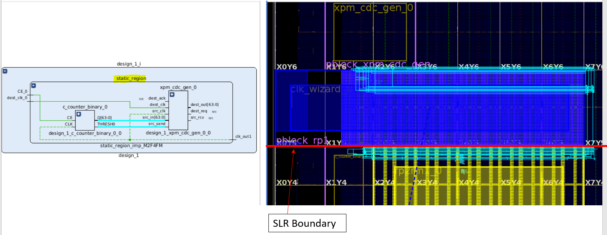
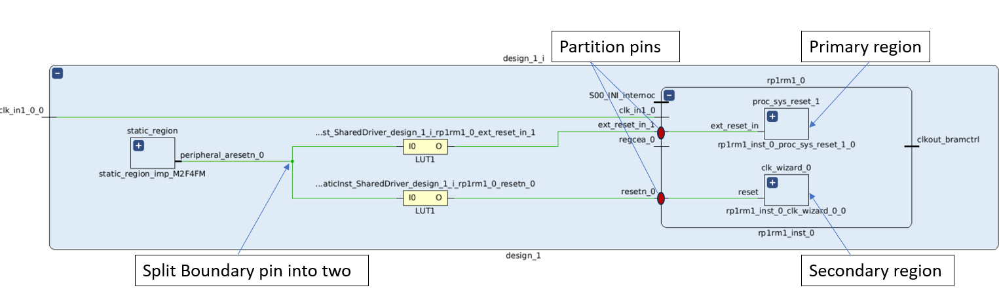

<table class="sphinxhide" width="100%">
 <tr width="100%">
    <td align="center"><h1>Versal™ Adaptive SoC DFX Tutorials</h1>
    <a href="https://www.xilinx.com/products/design-tools/vivado.html">See Vivado™ Development Environment on xilinx.com</a>
    </td>
 </tr>
</table>

[Versal Adaptive SoC Multiple Reconfiguable Partition Floorplanning --]{.underline}

[Overlap DRC and Disjoint Pblock]{.underline}

***Version: Vivado 2023.2***

**Abstract**

**[BLI Floorplan Alignment:]{.underline}**

DFX designs for Versal devices have unique challenges related to ranging Pblocks in designs with two or more reconfigurable partitions (RP). Due to the alignment of Boundary Logic Interface (BLI) tiles that are automatically ranged based on other ranged sites within an HSR clock region, the placement and routing footprints can extend farther than originally intended for a given Pblock rectangle. The extended footprints can lead to overlapping Pblock issues, reported by Design Rule Checks (DRC).

**[Disjoint pblocks for a Reconfigurable Partition:]{.underline}**

A design may require logic that must be placed in a non-contiguous area between Fabric Super Region (FSR) and Horizontal Super Region (HSR) areas that would require a disjoint pblock. Only NoC and clocking resources can communicate between the disjoint pblock sections.

In a disjoint pblock case, the main part of the reconfigurable pblock in the fabric region that contains all but certain clocking resources is referred to as the Primary Region. The other part which includes sites of the clock sources and the fabric region adjacent to the clock sources is referred to as the Secondary Region. Currently Vivado supports one Primary Region and one Secondary Region in a disjoint pblock. The following image shows a disjoint pblock for RP1 in a two RP design on a two SLR device.

This lab will show:

1.  Overlap DRC and suggest steps to analyze and fix the overlap.

2.  Analysis of routing errors due to a disjoint pblock and the application of a guided floorplan for the disjoint pblock to fix routing errors.

**Objectives**

After completing this lab, you will be able to:

-   Understand HDPR-39 on BLI overlap error and use the get_dfx_footprint command to debug.

-   Understand routing issues due to a disjoint pblock and fix them with guided floorplan.

**NOTE**: This lab is only for DFX learning and has not been validated in hardware.

**Introduction:**

You will be using the standard 2023.2 Vivado project as the starting point for this lab. It is a BD based designs with two Reconfigurable Partitions (RP1 and RP2). The design uses NoC IP and NoC INI to connect the IPs. It is targeted to a two SLR Versal device to bring out the issues commonly seen for multi-RP multi-SLR DFX designs.

**General flow:**

  -------------------------------------------------------------------------------------------------------------------------------------------------------------------------------------------------------------------------------------------------------------------------------------------------------------------------------------------------------------------------------------------------------------------------------------------------------------------------------------------------------------------------------------------------------------------------------
  Step 1:  \                          ![Shape, arrow                                                                                                Step 2:  \        Report DRCs   Description automatically generated](./media/image4.png)    Analyze DRCs    Description automatically generated](./media/image4.png)    Resize pblocks to fix DRCs    Description automatically generated](./media/image4.png)    Implement the design 
  ----------------------------------- ------------------------------------------------------------------------------------------------------------- ------------- ------------------------------------------------------------------------------------------------------------- --------------- ------------------------------------------------------------------------------------------------------------- ----------------------------- ------------------------------------------------------------------------------------------------------------- -----------------------

  -------------------------------------------------------------------------------------------------------------------------------------------------------------------------------------------------------------------------------------------------------------------------------------------------------------------------------------------------------------------------------------------------------------------------------------------------------------------------------------------------------------------------------------------------------------------------------

+-----------+----+-----------+----+-----------+----+-----------+----+
| Step 6:   | ![ | Step 7:   | ![ | Step 8:   | ![ | Step 9:   |    |
|  \        | Sh |  \        | Sh |  \        | Sh |           |    |
| SLL       | ap | Analyze   | ap | Use       | ap | Implement |    |
| a         | e, | routing   | e, | guided    | e, | the       |    |
| ssignment | a  | error     | a  | floorplan | a  | design    |    |
| fails     | rr |           | rr |           | rr |           |    |
|           | ow |           | ow |           | ow |           |    |
|           | D  |           | D  |           | D  |           |    |
|           | es |           | es |           | es |           |    |
|           | cr |           | cr |           | cr |           |    |
|           | ip |           | ip |           | ip |           |    |
|           | ti |           | ti |           | ti |           |    |
|           | on |           | on |           | on |           |    |
|           | a  |           | a  |           | a  |           |    |
|           | ut |           | ut |           | ut |           |    |
|           | om |           | om |           | om |           |    |
|           | at |           | at |           | at |           |    |
|           | ic |           | ic |           | ic |           |    |
|           | al |           | al |           | al |           |    |
|           | ly |           | ly |           | ly |           |    |
|           | ge |           | ge |           | ge |           |    |
|           | ne |           | ne |           | ne |           |    |
|           | ra |           | ra |           | ra |           |    |
|           | te |           | te |           | te |           |    |
|           | d] |           | d] |           | d] |           |    |
|           | (. |           | (. |           | (. |           |    |
|           | /m |           | /m |           | /m |           |    |
|           | ed |           | ed |           | ed |           |    |
|           | ia |           | ia |           | ia |           |    |
|           | /i |           | /i |           | /i |           |    |
|           | ma |           | ma |           | ma |           |    |
|           | ge |           | ge |           | ge |           |    |
|           | 4. |           | 4. |           | 4. |           |    |
|           | pn |           | pn |           | pn |           |    |
|           | g) |           | g) |           | g) |           |    |
|           | {w |           | {w |           | {w |           |    |
|           | id |           | id |           | id |           |    |
|           | th |           | th |           | th |           |    |
|           | =" |           | =" |           | =" |           |    |
|           | 0. |           | 0. |           | 0. |           |    |
|           | 25 |           | 25 |           | 25 |           |    |
|           | 62 |           | 62 |           | 62 |           |    |
|           | 5i |           | 5i |           | 5i |           |    |
|           | n" |           | n" |           | n" |           |    |
|           | he |           | he |           | he |           |    |
|           | ig |           | ig |           | ig |           |    |
|           | ht |           | ht |           | ht |           |    |
|           | =" |           | =" |           | =" |           |    |
|           | 0. |           | 0. |           | 0. |           |    |
|           | 21 |           | 21 |           | 21 |           |    |
|           | 18 |           | 18 |           | 18 |           |    |
|           | 05 |           | 05 |           | 05 |           |    |
|           | 55 |           | 55 |           | 55 |           |    |
|           | 55 |           | 55 |           | 55 |           |    |
|           | 55 |           | 55 |           | 55 |           |    |
|           | 55 |           | 55 |           | 55 |           |    |
|           | 55 |           | 55 |           | 55 |           |    |
|           | 5i |           | 5i |           | 5i |           |    |
|           | n" |           | n" |           | n" |           |    |
|           | }  |           | }  |           | }  |           |    |
+===========+====+===========+====+===========+====+===========+====+
+-----------+----+-----------+----+-----------+----+-----------+----+

**STEP 1:** Preparing the Design

1.  On the Tcl within Vivado 2023.2, source the "recreate_proj.tcl" script. This will create the 2 RP DFX block design.

2.  Click "Run Synthesis" in the Flow Navigator to process the design through synthesis.

3.  After synthesis is complete, open the synthesized design "synth_1" and check the device view.

Figure: Device view showing two RP pblocks, each within a single SLR

The blue highlighted pblock is for RP "rp1rm1_0" and the yellow is for RP "rp2rm1_0." Observe that pblock_rp1 is disjoint with separate pblock rectangles in HSR and FSR regions. The other two pblocks are for static logic, specifically applied to create the use case for the lab. The red flyer is a static bus crossing the SLR boundary.

NOTE: The highlighting in the image above was done by right-clicking on the pblock instance in the Physical tab and selecting Highlight, and then selecting a color.

**STEP 2: Report DFX DRC**

Most of the floorplanning related DRC can be caught post synthesis by calling the report_drc command.

As this lab focuses only on DFX, check only the DFX rules from report DRC as highlighted below and observe the DRC errors. Run the DFX DRCs by selecting Reports \> Report DRC; then deselect All Rules and select DFX rules before clicking OK.

Five types of DFX DRCs are reported:

1.  HDPR-39: overlapping BLI tile of the HSR region of RP in blue highlighted pblock are part of the other RP highlighted in yellow.

2.  HDPR-131: This shows MMCM of RP in blue in HSR region needs the BLI tile and fabric for tie off which is all ranged in other RP in yellow.

3.  HDPR-134 and HDPRA-63: For the disjoint pblock, the recommended methodology is to add a child pblock to define the primary region. Only NoC and clocking logic can communicate between disjoint rectangles.

4.  HDPR-124: I/O Bank 703 is shared between static and pblock_rp1.

**STEP 3 : Analyze the DRCs:**

HDPR-39: Take the first DRC under section HDPR-39 in the DRC window:

The "**Overlapping tile :**" section of the DRC error reports the tile that is shared by two RPs. BLI_CLE_BOT_CORE_X30Y0 is the overlapping tile.

*Overlapping tile : BLI_CLE_BOT_CORE_X30Y0*

*- Is in PLACEMENT footprint of reconfigurable pblock 'pblock_rp1'*

*Footprint Expansion Path :*

*- BLI_CLE_BOT_CORE_X30Y0 tile in PLACEMENT footprint for HSR_ROUTING*

*- CMT_MMCM_X25Y0 tile in PBLOCK*

*- Is in PBLOCK footprint of reconfigurable pblock 'pblock_rp2'*

*Footprint Expansion Path :*

*- BLI_CLE_BOT_CORE_X30Y0 tile in PBLOCK*

The message suggests that "*BLI_CLE_BOT_CORE_X30Y0"* is required for HSR_ROUTING for tile "*CMT_MMCM_X25Y0"* present in *pblock_rp1* but *BLI_CLE_BOT_CORE_X30Y0* is part of *pblock_rp2*, causing an overlap.

In the device view you can visualize the overlapping tiles. To show the placement footprint for both Pblocks, use the get_dfx_footprint command:

*highlight_objects -color yellow \[get_dfx_footprint -place -of_objects \[get_cells* *design_1\_i/rp1rm1_0\]\]*

*mark_objects -color blue \[get_dfx_footprint -place -of_objects \[get_cells* *design_1\_i/rp2rm1_0\]\]*

One call to get_dfx_footprint uses highlight_objects and the other uses mark_objects (and with different colors) so that any tile that belongs to each set can be easily seen as such.

Device view showing overlapping tiles which have both the yellow highlight and the blue mark.

You can also use the -overlap option for the get_dfx_footprint command. This will return all tiles that overlap between the requested pblock and any other reconfigurable pblock.

*highlight_objects -color red \[get_dfx_footprint -overlap -of_objects \[get_cells design_1\_i/**rp1rm1_0\]\]*

**Note:** The get_dfx_footprint -overlap command will also show clocking and interconnect tiles which can be shared by multiple RPs and will not result in a DRC.

Additionally, the overlapping tiles are listed in the *hd_visual/Overlapped_AllTiles.tcl* script.

**STEP 4: Resize Pblock to resolve DRC:**

To resolve the violation, at least one Pblock must be resized. This is a design dependent decision. You can use one of these options:

**Option 1:\
**Resize a pblock to remove the overlap. This must be done after highlighting the pblocks as explained above.

*resize_pblock pblock_rp2 -remove CLOCKREGION_X2Y1*

**Option 2:**

Resize a pblock using any one of the "Floorplan fix resolution" mentioned in the DRC errors.

Use any of the resolution depending on the design netlist. This option of using Floorplan fix resolution from DRC may require iterative steps of fixing the floorplan and running DRC multiple times.

For the first instance of HDPR-39, you should not use "*Suggestion to keep \'BLI_CLE_BOT_CORE_X30Y0\'*" as it is the command to remove CMT_MMCM_X25Y0 from pblock_rp1 but RM netlist rp1rm1_0 requires MMCM in that pblock.

*\#* *Suggestion to keep \'CMT_MMCM_X25Y0\' in \'pblock_rp1\'*

*set pblock_rp2_tiles \[get_dfx_footprint -source \[get_pblocks pblock_rp1\] -tile \[get_tiles CMT_MMCM_X25Y0\] -conflict \[get_pblocks pblock_rp2\]\]*

*resize_pblock \[get_pblocks pblock_rp2\] -remove \[ get_sites -of \[ get_tiles \$pblock_rp2_tiles \] \]*

**[Note:]{.underline}** This lab does not resolve all DRC errors individually. Using option 1 above will fix DRC error HDPR-39 as well as HDPR-131.

For this design take option 1 and resize a pblock to resolve the overlaps.

*resize_pblock pblock_rp2 -remove CLOCKREGION_X2Y1*

Run Report DRC for DFX rules and see the DRC errors have been fixed. (The Critical Warning and Warnings will remain.) The constraints for option 1 are captured in "constr_2.xdc" under constraint set "constrs_2" and used for the "impl_SLL_ERROR" implementation run.

**STEP 5: Run implementation and analyze new routing error:**

From the Synthesized design after fixing the DRC errors, run ***opt_design; place_design; route_design*** from the TCL console. You can also launch the implementation run for impl_SLL_ERROR in the Design Runs tab.

You will see route_design has failed with the following error during the SLL assignment phase:

*ERROR: \[Route 35-3424\] SLL Assignment failed. There are no SLL nodes available in SLR Cut \[0-1\] for net \'design_1\_i/rp1rm1_0/proc_sys_reset_1/U0/SEQ/pr_reg_0\'.*

As seen in the SLL table, net demand is low and has good capacity for routing. To debug the error, check the schematic for the net mentioned in the error and mark the source and load cells using the following commands with design_1\_wrapper_routed_error.dcp open in memory:

*show_objects -name fail_net \[get_nets design_1\_i/rp1rm1_0/proc_sys_reset_1/U0/SEQ/pr_reg_0\]*

*mark_objects -color yellow \[get_cells {design_1\_i/rp1rm1_0/proc_sys_reset_1/U0/SEQ/ACTIVE_LOW_PR_OUT_DFF\[0\].FDRE_PER_N\_i_1}\]*

*mark_objects -color green \[get_cells {design_1\_i/rp1rm1_0/proc_sys_reset_1/U0/ACTIVE_LOW_PR_OUT_DFF\[0\].FDRE_PER_N}\]*

The failing net is within RM (rp1rm1_0) but the placement is such that it requires a non-clock net to route between disjoint pblock rectangles. This is not allowed.

To fix such routing issues and to have control over placement in Primary and Secondary regions, a guided floorplan is required.

For more information on SLL Assignment table please check [Static Routing Across SLR Boundaries](https://docs.xilinx.com/r/en-US/ug909-vivado-partial-reconfiguration/Static-Routing-Across-SLR-Boundaries) in\
*Vivado Design Suite User Guide: Dynamic Function eXchange (UG909)*

**STEP 6: Use a guided floorplan**

Specific cell assignments must be made to the Primary region and the Secondary region. This will guide the Vivado placer not to place non-clock logic in the secondary region of a disjoint Pblock. If this non-clock logic connects to logic in the Primary region of the disjoint pblock it may lead to unroutes, as there are no standard (non-clock) routing resources to bridge any gap between the sections.  

You can use guide_disjoint_floorplan.tcl file which uses get_dfx_footprint command to create recommended pblock methodology. It will create guided child pblock and assign all the non-clock cells to the child pblock or the Primary region. Exclude assignment of the clock-control logic from the child pblock

*place_design -unplace*

*source ./guide_disjoint_floorplan.tcl -notrace*

*dfx_utils::guided_floorplan::create_guided_floorplan*

This will create a guided floorplan with secondary region (clocking) assigned to the parent pblock and a primary region (FSR cells) assigned to the child pblock.

**Note:** For the purposes of this lab, the guided floorplan was created after the routing error has been reported. The best method is to create the guided floorplan before calling place and route using a TCL script. Using the guided floorplan will fix DRC HDPR-134 which was reported earlier.

The parent pblock including clocking logic from secondary region:

The generated guided child pblock with all non-clocking login in the primary region:

Reset the PPLOC assignments from the previous run and rerun place and route with the new guided floorplan to see design is successfully routed.

*set cells \[get_cells -quiet -hier -filter HD.RECONFIGURABLE\]*

*foreach cell \$cells {*

*reset_property HD.PARTPIN_LOCS \[get_pins \$cell/\*\]*

*}*

*place_design*

*route_design*

The constraints for thee guided floorplan are already captured in "constr_3.xdc" under constraint set "constrs_3" and used for the "impl_GUIDE_FIX" implementation run.

Launch all implementations runs present in Design runs window:

impl_BLI_ERROR à To see overlap DRC error during opt_design

impl_SLL_ERROR à Fixed overlap DRC error but error at route_design due to unguided disjoint pblock

impl_GUIDE_FIX à Fixed overlap DRC and uses Guided floorplan that completes successfully

**Related points to note:**

[Proper RP pblock for SLL crossing]{.underline}

Below is a floorplan of an implemented design which shows the static SLR crossing nets in cyan. The SLL routing is detoured as the blue RP pblock leaves no space for direct SLL crossing. There are derived DFX rules for Versal.

-   Static nets cannot use SLL to exit through CLE in RP

-   Boundary nets cannot use SLL to exit through CLE in RP

-   Static nets can use SLL cascading through RP

> 

[Non-Clock net driving both Primary and Secondary region:]{.underline}

In some cases, a non-clock boundary net must drive logic in both Primary and Secondary regions. For such scenarios, two separate PPLOCs are required for proper routing of the boundary net to each region. The design may initially have a single boundary pin for this boundary net. Users must split this boundary pin into two unique pins. One pin should be used by the boundary net to drive loads of the logic which is assigned to the Primary region and other for the loads in the Secondary region.

[PROHIBITS on unused XPIO sites:]{.underline}

Any unused XPIO sites within an RM are tied to ground to meet silicon requirement. These tie-offs are considered static for subsequent configurations, which means these sites are unavailable for RMs in child configurations. Vivado automatically inserts prohibit constraints on the unusable sites. Therefore the recommended strategy is to build the worst case (greatest usage) scenario in the parent configuration so all subsequent RMs have equal or lesser usage.

You can see that for HDPR-124, unused XPIOLOGIC and IOB sites present in static within I/O bank 703 are prohibited by Vivado.

**[Conclusion:]{.underline}**

In this Lab we have covered analyzing HDPR-39 DFX DRC on BLI overlap error and use get_dfx_footprint command to debug the error. Using guided floorplan to overcome routing error and have control over placement in Primary and Secondary regions.\
Additional learnings on static nets crossing SLR, Non- Clock net driving both Primary and Secondary regions and Prohibits applied on unused XPIO sites

Copyright © 2020–2024 Advanced Micro Devices, Inc.

<a href="https://www.amd.com/en/corporate/copyright">Terms and Conditions</a>

