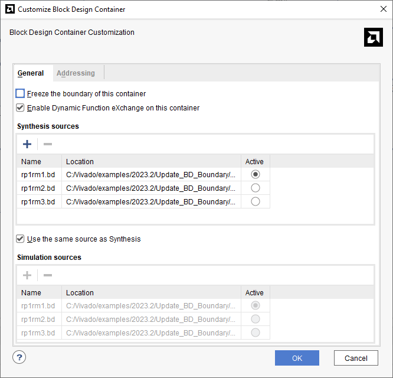
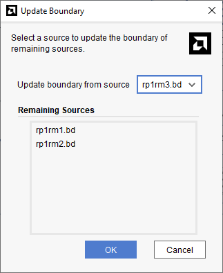

<table class="sphinxhide" width="100%">
 <tr width="100%">
    <td align="center"><h1>Versal™ Adaptive SoC DFX Tutorials</h1>
    <a href="https://www.xilinx.com/products/design-tools/vivado.html">See Vivado™ Development Environment on xilinx.com</a>
    </td>
 </tr>
</table>

# Update Reconfigurable Partition Boundaries

***Version: AMD Vivado&trade; 2023.2***

## Introduction

In the DFX flow, a fundamental requirement is that all reconfigurable modules associated with a reconfigurable partition must have the same interface ports to static. In the inter-processor interrupt (IPI), if one reconfigurable module is modified to add or remove ports, all remaining reconfigurable modules associated with that partition must also be updated to match the exact same ports. This can be done using the `update_bd_boundaries` command. This allows you to easily apply the same modifications on ports to each reconfigurable module. This reduces the chance of making errors, especially while creating interface ports that have multiple data width signals.

## Design Flow

Follow the design flow from the "1RP_AXI_GPIO_in_RP_Interface_INI" tutorial to become familiar with the IPI-based DFX design flow using the block design container feature. This is the similar flow used for this tutorial.

### IP Integrator

- A simple 1RP-based design is used to demonstrate the feature.
- Observe that there are two AXI interfaces to the reconfigurable partition: S_AXI and S_AXI1.
- The general purpose I/O (GPIO) is connected to a simple constant value IP confgured to `0XFACEFEED`.

  ```
  source create_top_bd.tcl
  source create_rp1_bdc.tcl
  source enable_bdc_dfx.tcl
  ```

  

- This is the block diagram of the second reconfigurable module, `rp1rm2.bd`.
- As expected, rp1rm2 also has the same interface ports to the static region with the GPIO connected to the constant value, `0XC001000F`.

  ```
  source create_rp1rm2.tcl
  ```

  

- A new reconfigurable module, `rp1rm3.bd`, has been created using the same steps mentioned in the tutorial. However, a new port has been added to `rp1rm3.bd`. The `S_AXI` and `S_AXI1` ports are inherited when rp1rm3 is created using the "Create_reconfigurable" option of the DFX BDC rp1. Then a new interface port, `S_AX1_0`, is manually added in the script followed by new IPs, axi_gpio_1 and xlconstant_1.

  ```
  source create_rp1rm3.tcl
  ```

  

- Before updating the BD boundaries, you can unfreeze the boundary of the DFX BDCs. This is to reenable any parameter propogation across the DFX boundary because a new port has been added.

  

- Once the boundary is unlocked, select the Top BD, right-click the rp1 BDC, and select **Update Boundary of Sources...**

  ```
  source update_rm_boundary.tcl
  ```

  

- In the Update Boundary window, you can decide which reconfigurable module can be used as the source to update the remaining reconfigurable module ports. In this example, `rp1rm3.bd` is selected as the source, and the sources `rp1rm1.bd` and `rp1rm2.bd` are updated to match with it.

  

- Once the BDs are updated and validated, observe the following changes in each reconfigurable module. The new port has appeared in the `rp1rm1.bd` is shown below. This image shows the view from the top BD.

  

- Observe the similar change in `rp1rm2.bd` as well. This image shows the view from within the RM BD.

  

- In this design, because a new interface has been added to the reconfigurable partition, ensure proper decoupling is added in the static region for the new interface. For that, update the top BD.

  ```
  source update_top_bd.tcl
  ```

  

- You can manually update the aperture for each BD if required.

    ```
    source match_aperture.tcl
    ```

  - Once the IPI design creation is complete, you can implement the design. Even though some ports of the reconfigurable module rp1rm1 and rp1rm2 are loadless, it is okay because the DFX flow automatically legalizes the netlist by inserting a LUT1 during implementation (opt_design).

    ```
    source run_impl.tcl
    ```

    

<hr class="sphinxhide"></hr>

<p class="sphinxhide" align="center"><sub>Copyright © 2020–2024 Advanced Micro Devices, Inc.</sub></p>

<p class="sphinxhide" align="center"><sup><a href="https://www.amd.com/en/corporate/copyright">Terms and Conditions</a></sup></p>
