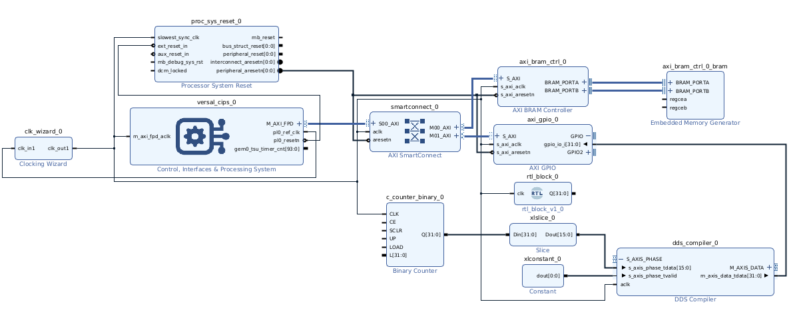
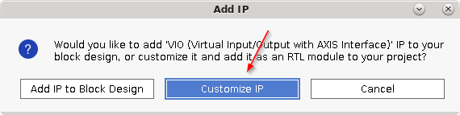
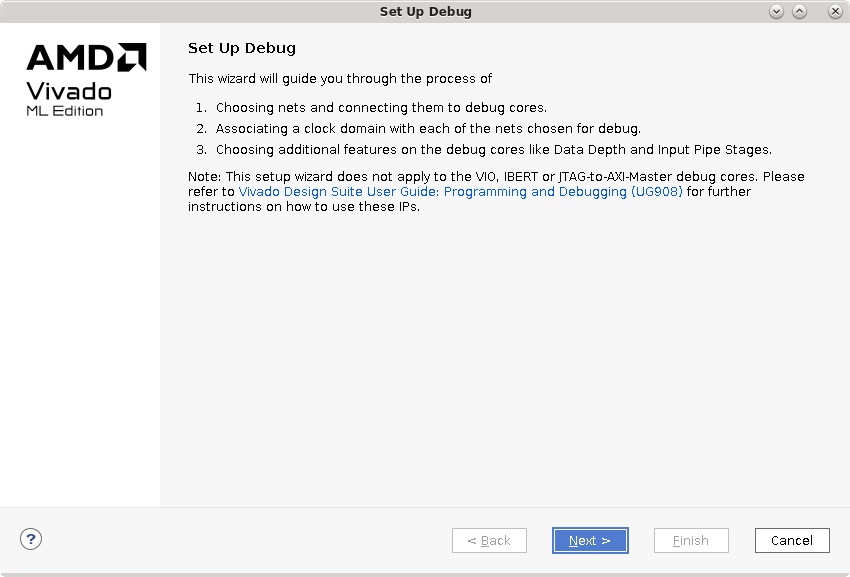
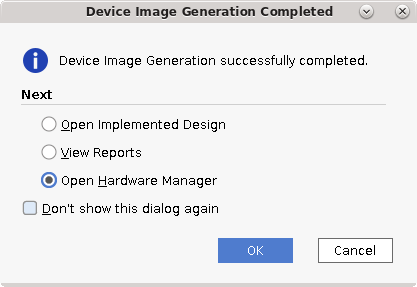
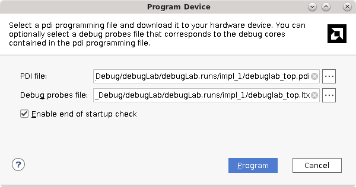
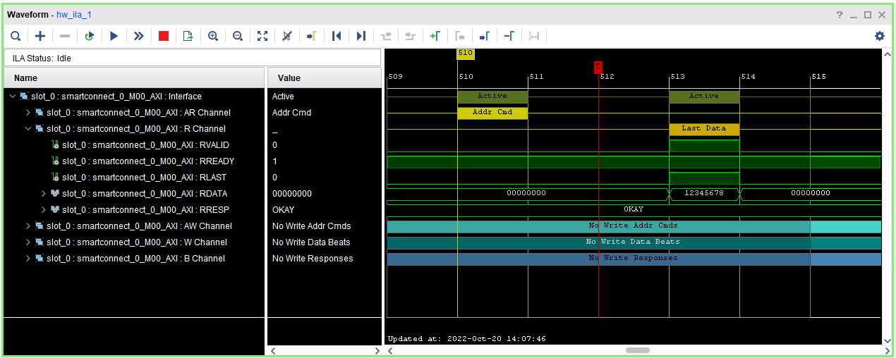

<table>
 <tr>
   <td align="center"><h1>Versal ACAP Hardware Debug Tutorial</h1>
   </td>
 </tr>
 <tr>
 <td align="center"><h1>Basic PL Hardware Debugging Using ChipScope AXIS-ILA and AXIS-VIO</h1>
 </td>
 </tr>
</table>

## Introduction
This tutorial  describes the steps required to insert the Integrated Logic Analyzer (AXIS-ILA) and Virtual Input Output Core (AXIS-VIO) into a basic design to aid in debugging in the programmable logic (PL) domain.

## Design Flow
This tutorial contains two tcl scripts that can be used to build the design.  The first script `run.tcl` is used to generate the base design used at the beginning of the tutorial and contains no debug cores.  The second script `run_complete.tcl` will generate a project that contains the tutorial completed, with only the PDI generation step remaining. 

### Building the Base Design
1.  Begin by cloning this tutorial and changing directory to the location where the design files were saved.

1.  Using Vivado 2022.2, run one of the following at the command line:

    - To get build the design up to the starting point for this tutorial, run `vivado -source run.tcl`.  
    - To run the design end to end run `vivado -source run_complete.tcl`.  This will build the complete design (skipping all hardware debug IP insertion) that is ready for PDI generation and runtime steps.
    *Note: it is also possible to run `source run.tcl` or `source run_complete.tcl` from the Vivado Tcl interpreter after launching the Vivado GUI.*
   
1.  Once the command completes, the following design will be built:

## Adding A VIO To Control the Binary Counter IP
In the initial design the instance of the Binary Counter IP has it's control signals left un-connected, which will leave them auto-connected to their default values.  In a debugging scenario it may be neccessary to control these signals.

1.  Begin by clicking the **+** symbol on the IP Integrator canvas to add new IP.
1.  When the IP search window appears, type *vio* to search for the AXI-Streaming VIO core.  Hit **Enter** to add the AXIS-VIO to the IP Integrator canvas. 

    
	
3. Double click on the newly added AXIS-VIO instance to customize it and set **Input Probe Count** to **1** and **Output Probe Count** to **5**.  Set the probe width for each probe to the following:

    Probe Width | Width | Initial Value
	------------|-------|--------------
	probe_in0 | 32 | -
	probe_out0 | 1 | 0x1
	probe_out1 | 1 | 0x0 
	probe_out2 | 1 | 0x1 
	probe_out3 | 1 | 0x0 
	probe_out4 | 32 | 0x0
	
4. After the VIO configuration is complete, connect the VIO's clock port to the same `CLK` port on the binary counter, connect the input probe to the `Q` output port from the binary counter and each of the VIO's output probes to the Binary Counter control signals as indicated in the diagram below:

    
	
1.  *(Optional)* After all connection is complete, select the net connected to **probe_out0** and edit the name in the **System Net Properties** window to give this net a recognizable name.  By default, IP Integrator will auto-generate a name based on the driver.  Do the same for each output probe.

	
	
	

## Adding an ILA Core using IP Integrator Designer Automation

1.  Select the AXI interface between the AXI-SmartConnect (`smartconnect_0`) and the AXI BRAM Controller (`axi_bram_ctrl_0`) and right click.  In the drop down menu, select **Debug**
1.  Do the same for the Binary Counter output (`Q`), the `Q` output of the RTL module, and the output of the `dds_compiler_0` IP.
1.  Once all nets have been selected, click the **Run Connection Automation** banner.  Ensure all nets are selected, then click **OK**.

    
	
1.  After connection automation runs, observe the ILA added to the block design.
1.  Double click on the ILA to recustomize the IP.
1.  Under the **Advanced Options** tab, set the **Input Pipe Stages** to **3** and check the box to enable **Advanced Trigger**.  
    
	*The input pipe stages option will add additional pipeline registers between the input probe pin and the capture logic in the ILA IP allowing for easier timing closure.  This can be a valuable option for inserting an ILA into a high-performance design with less impact on timing results.  The Advanced Trigger option will be used to construct a trigger state machine allowing a stateful trigger on AXI transactions.*
    
	

1. Click **OK** to finish customizing the IP.

## Adding a VIO to the RTL Module Using Debug Core Instantiation 
1.  In the **Sources** window, double click on the `rtl_block` module to open the text editor.  Observe the instance of the RTL counter in the `rtl_block` module, a VIO will be added to the control signals to allow control of this module.  There are also nets with the `MARK_DEBUG` attribute, which will be addressed in the later section.  Once a VIO is generated, the below lines can be uncommented to instantiate the VIO.

    
	
1.  In the **PROJECT NAVIGATOR** click **IP Catalog**.  In the search bar, type **vio** and double click on the VIO to customize it.

    
	
1.  A popup window may appear if the block design is left open, if it does click **Customize IP** and set **Input Probe Count** to **1** and **Output Probe Count** to **5**.  Select the following probe widths for each probe:  

    

    Probe Width | Width | Initial Value
	------------|-------|--------------
	probe_in0 | 32 | -
	probe_out0 | 1 | 0x1
	probe_out1 | 1 | 0x0 
	probe_out2 | 1 | 0x1 
	probe_out3 | 1 | 0x0 
	probe_out4 | 32 | 0x0
	
1.  Select **OK** to finish customization.
1.  Return to the Vivado text editor and uncomment the VIO instantiation on lines 29 through 39 to instantiate the VIO in the design.

    
	
## Using Post-Synth Insertion to insert ILA into RTL module.
1.  In the **Flow Navigator** click **Run Synthesis** to synthesize the design.

    

1.  After synthesis completes, click on the option to **Open Synthesized Design** from the popup window or click **Open Synthesized Design** in the flow navigator. 

    
	
1.  Select the **Setup Debug Wizard** in the **Flow Navigator**.
1.  Click **Next** when the wizard appears.

    

1.  Select all unconnected debug nets.
1.  Once the nets are added, click **Next**.

	
	
1.  At the **ILA Core Options** page click next to use the default settings, then click **Finish** to conclude adding the ILA to the synthesized netlist.
1.  Save the netlist by clicking the save icon.   When the **Save Constraints** popup appears, type `default` for the file name and click **OK**.
1.  Click **Generate Device Image** to proceed with PDI generation.

# Running on Hardware

## Connecting to the VCK190 and Programming the PDI
1.  When PDI generation is complete, click the option in the pop-up window to **Open Hardware Manager**.

    
	
1.  Click the text **Open target** on the green banner to open a hardware target.
1.  Click the **Auto Connect** option to connect to the locally connected VCK190.
    
	*Note: if the target is not locally connected, please see UG908 for instructions to connect to a remote hardware target*
	
	
	
1.  Click **Program device** on the green banner to program the generated PDI into the Versal Device.

    
	
1.  When the **Program Device** window appears, ensure that the **PDI** and **Debug Probes File** dialogs are each populated with with a path to the respective files.  Click **Program**.

    
	
1.  When device programming completes, the following debug cores should be visible in the Hardware panel:

    
	

## Using the AXIS-VIO to control the Binary Counter IP

1.  Click on the **hw_vios** tab to show the VIO Dashboard.  In the **Hardware** pane, select **hw_vio_1** and drag it into the blank VIO dashboard to add all of the available probes on this VIO to the dashboard.

	
	
	*Note:  It is also possible to add probes manually by clicking the **+** symbol to add probes.*
	
1.  Observe that the Binary Counter Output (`c_counter_binary_0_Q`) is incrementing and the value and activity can be viewed in the VIO dashboard.
1   Click on the `BinaryCounter_CE` value drop down and change it to `0` to deassert the clock enable signal.  Observe that the counter stops incrementing and after a short while the activity detector will indicate no activity on this probe.

	

1.  The binary counter also has other control signals that can be used such as the `LOAD` signals.  To load a new value, set the following:

    Probe | Value 
	-------|-------
	`BinaryCounter_L` | 1234abcd
	`BinaryCounter_LOAD` | 1
	
1.  To start the count from the loaded value, set `BinaryCounter_LOAD` to `0`.

*There is also an instance of the VIO core that was instantiated in the RTL module that can be interacted with as an optional step.*

## Capuring a Waveform using the AXIS-ILA

1.  Click on the **hw_ila_1** tab to select the ILA view.
1.  In the **Trigger Setup** window click the **+** button to add a trigger condition.  

    
	
1.  Search for `counter_binary_0_Q` and click **OK** to add the binary counter output to the trigger equation.  

    
	
1.  Click on **Value** and set the value to `12345678` and observe that the Radix is set to `[H]` indicating that the value provided is in hexadecimal format.  This will create a trigger condition that will trigger the ILA when the counter output is equal to `0x12345678`.

	
	
	
1.  Click **Run Trigger** to arm the ILA.

	

1.  After some time, the ILA will trigger.  Using the zoom buttons, zoom in to view the red trigger marker and observe that the ILA has triggered when the counter output is equal to `0x12345678`:

	
	
## Capturing an AXI Transaction using the AXIS-ILA

The Versal architecture allows generating AXI transactions directly from the Debug Packet Controller (DPC) with no additional IP requirements.  For more information, refer to the Versal Technical Reference Manual (AM011).

### Arming the ILA with a Trigger State Machine

1.  In the ILA settings window, change the trigger mode for **hw_ila_1** to **ADVANCED_ONLY**.

	

1.  In the **Trigger Mode Settings** options, click the button to browse for a trigger state machine and navigate to the `tsms` directory in the design files.  Select the `axitxn.tsm` file.

	
	

1.  Click **Run Trigger** to arm the ILA using the trigger state machine.  At this point, the ILA is armed and will trigger on an AXI read transaction.

    
	
### Generating an AXI transaction using the Debug Packet Controller (DPC) and the Xilinx System Debugger (XSDB)
	
1.  Launch the Xilinx System Debugger (XSDB) tool.
    - On Linux, type `xsdb` at the command line.
	- On Windows, launch the Vivado TCL shell in the Start menu.  After the command prompt appears, type `xsdb`.  *Note: you may observe a Common 17-259 warning, this can be safely ignored.*
	
	
	
1.  Type `connect` at the XSDB prompt to connect to the local target.  Type `targets` to list the available targets and note the number next to the target labeled `DPC`.

    *Note: if a remote target is used, the `-host` or `-url` option can be used to specify the hostname of a remote hw_server.*
	
	
	
1.  Select the DPC target by typing `target <number next to DPC>` to select the DPC target.  Running `targets` again with no options will list the available targets and an \* symbol will appear next to the selected target.

	

1.  Generate an AXI write transaction with the below command.  This will write the value `0x12345678` into the first address in the block memory address space.

    `mwr 0xA4000000 0x12345678`
	
1.  Generate an AXI read transaction with the below command.  This will read the data back from the block memory address.  During this read transaction, the previously armed ILA will trigger on the read transaction.

    `mrd 0xA4000000`
	
1.  Return to the ILA window to observe that the ILA has triggered on the read transaction.  Using the zoom buttons or clicking on the waveform and dragging, zoom in on the read transaction and observe the AXI transaction.

    

### Summary

This tutorial has covered adding an AXIS-ILA to an IP Integrator Design, adding an AXIS-ILA to an RTL module and using the post-synthesis insertion flow to add an ILA to the design after synthesis is run.  It has also covered programming the PDI into the Versal device through JTAG using the Vivado Hardware Manager, connecting and interacting with the debug cores in the Vivado Hardware Manager, and generating AXI transactions using the Xilinx System Debugger (XSDB).

Copyright © 2020–2023 Advanced Micro Devices, Inc

<a href="https://www.amd.com/en/corporate/copyright">Terms and Conditions</a>

