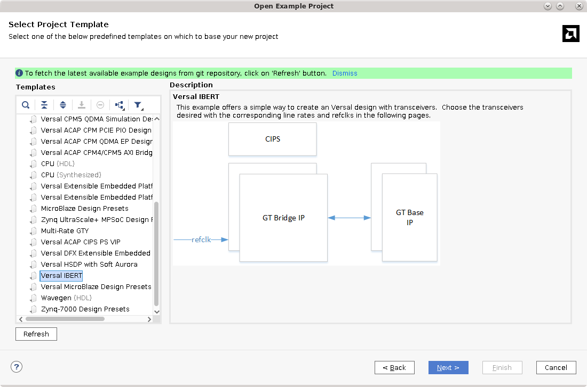
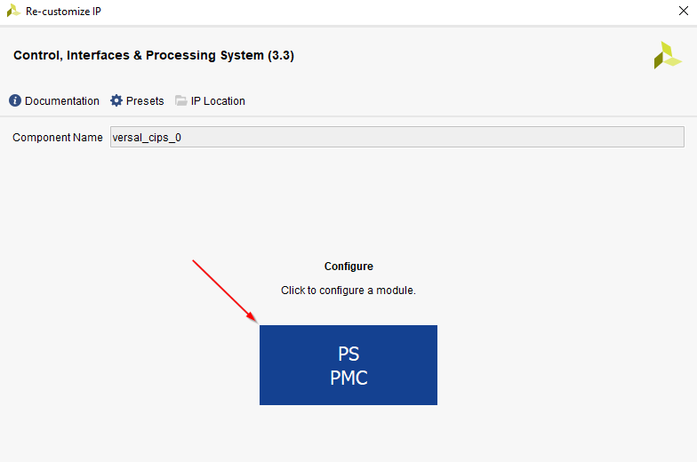

<table>
 <tr>
   <td align="center"><h1>Versal ACAP Hardware Debug Tutorial</h1>
   </td>
 </tr>
 <tr>
 <td align="center"><h1>Versal IBERT GTY Tutorial</h1>
 </td>
 </tr>
</table>

## Introduction

## Hardware Setup

1. QSPI loopback?

## Design Creation
A design that is IBERT capable can be generated quickly using the CED.

1. Launch Vivado 2023.1 and select **Open Example Design** at the landing page.  Click **Next** to proceed.
    
1. In the **Select Project Template** window, scroll to the **Versal IBERT** template.  Click **Next**.
    _Note:  If the Versal IBERT example design is not present, click **Refresh**
	
1. _(Optional)_ If desired, enter a project name and choose a location for the project to be created. 
1. This design targets the VCK190 Evaluation Kit which has the XCVC1902-2MSEVSVA2197 Versal AI Core device.  In the part selection page, select: `xcvc1902-vsva2197-2MP-e-S` to target this part.
    
1. Referencing the [VCK190 User Guide GTY Transceivers Section](https://docs.xilinx.com/r/en-US/ug1366-vck190-eval-bd/GTY-Transceivers) and the [VCK190 Evaluation Board User Guide Clock Generation Section](https://docs.xilinx.com/r/en-US/ug1366-vck190-eval-bd/Clock-Generation) it can be observed that the following GTY Quads are connected as follows with the following reference clocks:

    | Quad | Reference Clock Source | Reference Clock Frequency (MHz) | 
	|------|------------------------|---------------------------------|
	| 200  | Shared from QUAD 201 | - |
	| 201  | SI570 Connected to REFCLK0 | 100 MHz | 
	| 204  | SI570 Connected to REFCLK0 | 100 MHz |
	
1. In the **Design Preset** menu, select the following, then click **Next** and finally **Finish** to generate the design.
    
	
	
1.  As this design will target the VCK190 Evaluation Kit, it is required to enable MIO 37 as this is required by the board to boot.  Once the design is generated, open the block design by clicking **Open Block Design**.  Locate the CIPS IP and double click to customize the IP.  At the **Presets** page, click **Next** then click on the blue box labeled **PS PMC**.

    
	
	
	
1.  In the CIPS configuration wizard, click on **IO** and locate **MIO 37**.  Click on the small pencil icon to customize the MIO pin.  Change **External Usage** to **GPIO** and set the following:

	
	
	
	
1.  Click **Finish** to exit the CIPS IP customization wizard.
	

## Generating the PDI and Programming into Hardware

1. After the IBERT Example Design is created, click **Generate Device Image** from the flow navigator.  
   
   
   
## Connecting to the VCK190 and Programming the PDI
1.  When PDI generation is complete, click the option in the pop-up window to **Open Hardware Manager**.

    
	
1.  Click the text **Open target** on the green banner to open a hardware target.
1.  Click the **Auto Connect** option to connect to the locally connected VCK190.
    
	*Note: if the target is not locally connected, please see UG908 for instructions to connect to a remote hardware target*
	
	
	
1.  Click **Program device** on the green banner to program the generated PDI into the Versal Device.

    
	
1.  When the **Program Device** window appears, ensure that the **PDI** and **Debug Probes File** dialogs are each populated with with a path to the respective files.  Click **Program**.

    
	
1.  When device programming completes, the following debug cores should be visible in the Hardware panel:

    

## Interacting with IBERT using the Serial I/O Analyzer

1. Create links
1. Create scan
1. Create sweep

### Chipscopy plug?

## Conclusion

Copyright © 2020–2023 Advanced Micro Devices, Inc

<a href="https://www.amd.com/en/corporate/copyright">Terms and Conditions</a>

