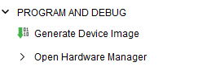
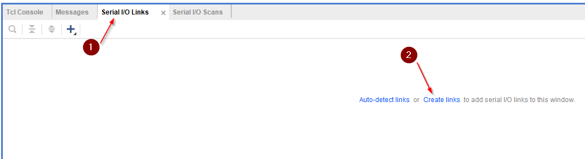
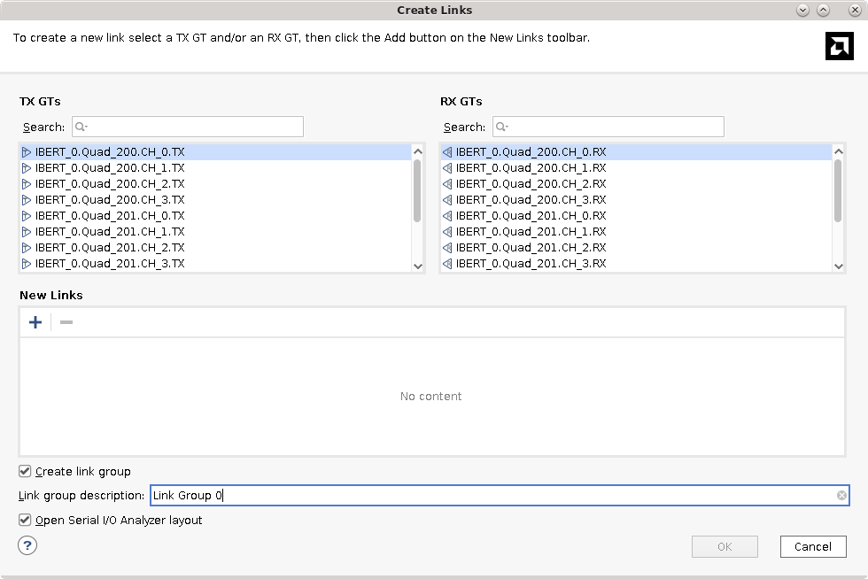
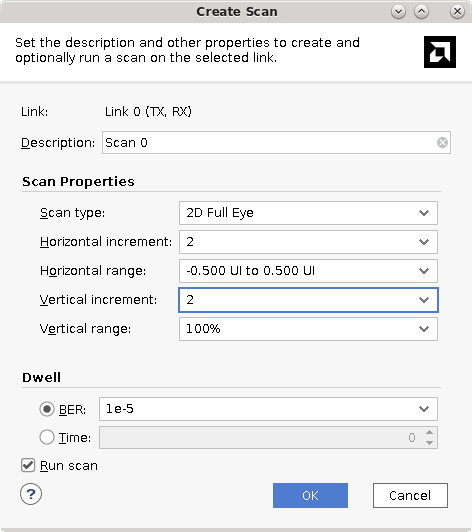

<table>
 <tr>
   <td align="center"><h1>Versal ACAP Hardware Debug Tutorial</h1>
   </td>
 </tr>
 <tr>
 <td align="center"><h1>Versal IBERT GTY Tutorial</h1>
 </td>
 </tr>
</table>

## Introduction

## Hardware Setup

1. QSPI loopback?

## Design Creation
A design that is IBERT capable can be generated quickly using the CED.

1. Launch Vivado 2023.1 and select **Open Example Design** at the landing page.  Click **Next** to proceed.
    
1. In the **Select Project Template** window, scroll to the **Versal IBERT** template.  Click **Next**.
    _Note:  If the Versal IBERT example design is not present, click **Refresh**
	
1. _(Optional)_ If desired, enter a project name and choose a location for the project to be created. 
1. This design targets the VCK190 Evaluation Kit which has the XCVC1902-2MSEVSVA2197 Versal AI Core device.  In the part selection page, select: `xcvc1902-vsva2197-2MP-e-S` to target this part.
    
    _Note: The Versal IBERT example design does not currently support selecting a board part._
    
1. Referencing the [VCK190 User Guide GTY Transceivers Section](https://docs.xilinx.com/r/en-US/ug1366-vck190-eval-bd/GTY-Transceivers) and the [VCK190 Evaluation Board User Guide Clock Generation Section](https://docs.xilinx.com/r/en-US/ug1366-vck190-eval-bd/Clock-Generation) it can be observed that the following GTY Quads are connected as follows using the below reference clocks:

    | Quad | Reference Clock Source | Reference Clock Frequency (MHz) | 
	|------|------------------------|---------------------------------|
	| 200  | Shared from QUAD 201 | - |
	| 201  | SI570 Connected to REFCLK0 (GTY REFCLK X1Y2)| 100 MHz | 
	| 204  | SI570 Connected to REFCLK0 (GTY REFCLK X1Y8)| 100 MHz |
	
1. In the **Design Preset** menu, select the following, then click **Next** and finally **Finish** to generate the design.
    
	
	
## Generating the PDI and Programming into Hardware

1. After the IBERT Example Design is created, click **Generate Device Image** from the flow navigator.  
   
   
   
## Connecting to the VCK190 and Programming the PDI
1.  When PDI generation is complete, click the option in the pop-up window to **Open Hardware Manager**.

    
	
1.  Click the text **Open target** on the green banner to open a hardware target.
1.  Click the **Auto Connect** option to connect to the locally connected VCK190.
    
	*Note: if the target is not locally connected, please see UG908 for instructions to connect to a remote hardware target*
	
	
	
1.  Click **Program device** on the green banner to program the generated PDI into the Versal Device.

    
	
1.  When the **Program Device** window appears, ensure that the **PDI** and **Debug Probes File** dialogs are each populated with with a path to the respective files.  Click **Program**.

    
	
1.  When device programming completes, the IBERT core should be visible in the hardware panel:

    

## Interacting with IBERT using the Serial I/O Analyzer

1. The first step to interacting with IBERT is to create links, which allows users to link any TX and RX channel within the IBERT design.  To start, click on the **Serial I/O Links** tab and select **Create links**.

	

1.  In this design each channels TX and RX will be linked together so all available links can be added by clicking the **+** button until all links are added.

	
	
1.  Because Quads 201 and 204 do not have a physical loopback connector, select **Internal Loopback** for all channels in Quads 201 and 204.  Quad 200 is connected to the external loopback connector and does not require internal loopback.

	
	
1. After the links are created, they will be displayed in the **Serial I/O Tabs**.  By default, IBERT will default to **User Design** for the TX and RX patterns, allowing user design data to be used.  To bring the links up, change the TX and RX patterns for all links to **PRBS 31** by clicking on the TX and RX pattern drop down for **Link Group 0**.

	

1.  Next, right click on **Link 0** and select **Create Scan**

	
	
1.  For **Horizontal Increment** and **Vertical Increment** select **10**.  Leave all other values default.

	
	
1.  After the scan finishes, the Eye Diagram will be shown

	

### Chipscopy plug?

## Conclusion

Copyright © 2020–2023 Advanced Micro Devices, Inc

<a href="https://www.amd.com/en/corporate/copyright">Terms and Conditions</a>

