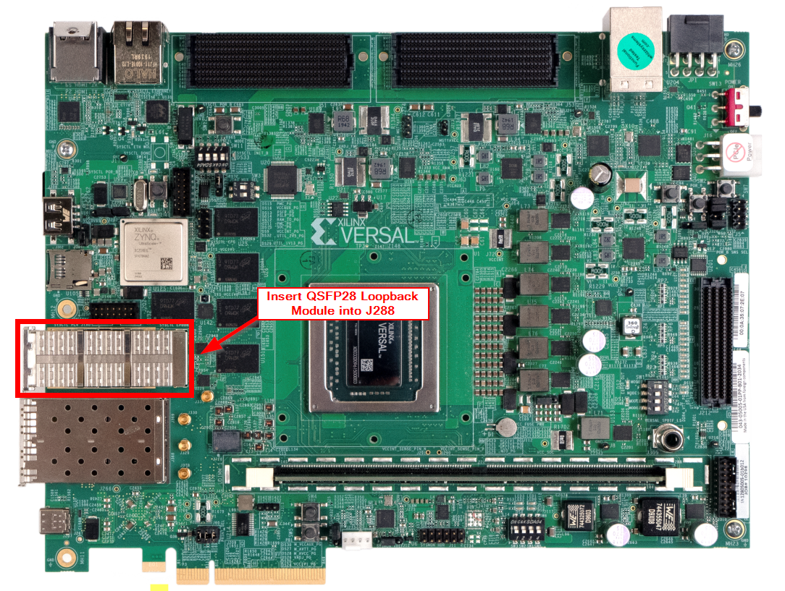
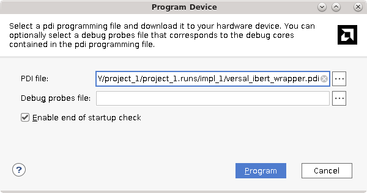

<table class="sphinxhide" width="100%">
 <tr width="100%">
    <td align="center"><h1>Versal™ Adaptive SoC Hardware Debug Tutorials</h1>
    <a href="https://www.xilinx.com/products/design-tools/vivado.html">See Vivado™ Development Environment on xilinx.com</a>
    </td>
 </tr>
</table>

# Versal Adaptive SoC IBERT GTY Tutorial

***Version: AMD Vivado&trade; 2023.2***

## Introduction

The AMD Versal&trade; adaptive SoC IBERT GTY is used to interact with GTY lanes contained in a design. It is used to debug and verify issues in high-speed serial I/O links. In contrast to previous architectures, Versal adaptive SoC IBERT GTY does not require additional IP and can be used with any design that utilizes the GTY transceivers. However, in some cases, it might be required to generate an IBERT capable design with minimal user interaction; this tutorial will demonstrate that flow.

In this tutorial, you will:

- Customize and generate an IBERT capable design using the IBERT Configurable Example Design (CED) in Vivado.
- Interact with the design in hardware using the Serial I/O Analyzer. This includes connecting to the target VCK190 evaluation board, programming the device, and interacting with the Serial I/O lanes.
- Perform a scan test to optimize a transceiver channel.

## Hardware Setup

### Required Hardware

- [Versal AI Core Series VCK190 Evaluation Kit](https://www.xilinx.com/products/boards-and-kits/vck190.html)
- Micro USB Type C cable capable of connecting a PC to the VCK190 **or** a compatible programmer capable of programming the VCK190
- QSFP28 Loopback Connector (Recommended Part Number [ML4002-28-C5](https://www.multilaneinc.com/products/ml4002-28-c5)) *(Optional)*

### Board Setup

1. Setup the VCK190 as per [XTP619 - VCK190 Software Install and Board Setup Tutorial](https://www.xilinx.com/member/forms/download/design-license.html?cid=feabc14f-c88a-4bdf-86f5-5acb34db291d&filename=xtp619-vck190-setup-c-2021-2.pdf).  
    >**NOTE:** Ensure that the VCK190 mode pins are setup for JTAG.

2. *(Optional)* Insert the QSFP28 loopback module into the QSFP cage (J288) on the VCK190.

## Design Creation

A design that is IBERT capable can be generated quickly using the CED.

1. Launch Vivado 2023.2, and select **Open Example Design** at the landing page. Click **Next** to proceed.
    
1. In the **Select Project Template** window, scroll to the **Versal IBERT** template. Click **Next**.
    >**NOTE:** If the Versal IBERT example design is not present, click **Refresh**.

    
1. *(Optional)* If desired, enter a project name, and choose a location for the project to be created.
1. This design targets the VCK190 Evaluation Kit which has the XCVC1902-2MSEVSVA2197 Versal AI Core device.  In the part selection page, select: `xcvc1902-vsva2197-2MP-e-S` to target this part.

    >**NOTE:** The Versal IBERT example design does not currently support selecting a board part.
  
   
1. Referencing the [VCK190 User Guide GTY Transceivers Section](https://docs.xilinx.com/r/en-US/ug1366-vck190-eval-bd/GTY-Transceivers) and the [VCK190 Evaluation Board User Guide Clock Generation Section](https://docs.xilinx.com/r/en-US/ug1366-vck190-eval-bd/Clock-Generation), it can be observed that the following GTY Quads are connected as follows using the following reference clocks:

    | Quad | Reference Clock Source | Reference Clock Frequency (MHz) |
    |------|------------------------|---------------------------------|
    | 200  | Shared from QUAD 201 | - |
    | 201  | SI570 Connected to REFCLK0 (GTY REFCLK X1Y2)| 100 MHz |
    | 204  | SI570 Connected to REFCLK0 (GTY REFCLK X1Y8)| 100 MHz |

1. In the **Design Preset** menu, select the following, then click **Next**, and finally **Finish** to generate the design.

   

## Generating the PDI and Programming into Hardware

1. After the IBERT Example Design is created, click **Generate Device Image** from the flow navigator.  

   

## Connecting to the VCK190 and Programming the PDI

1. When PDI generation is complete, click the option in the pop-up window to **Open Hardware Manager**.

    

1. Click the text, **Open target**, on the green banner to open a hardware target.
1. Click the **Auto Connect** option to connect to the locally connected VCK190.

   >**NOTE:** If the target is not locally connected, see *Vivado Design Suite User Guide: Programming and Debugging* [(UG908)](https://docs.xilinx.com/access/sources/dita/map?isLatest=true&url=ug908-vivado-programming-debugging&ft:locale=en-US) for instructions to connect to a remote hardware target.

   

1. Click **Program device** on the green banner to program the generated PDI into the Versal device.

    

1. When the **Program Device** window appears, ensure that the **PDI** and **Debug Probes File** dialogs are each populated with a path to the respective files. Click **Program**.

   

1. When device programming completes, the IBERT core should be visible in the hardware panel:

   

## Interacting with IBERT Using the Serial I/O Analyzer

1. The first step to interacting with IBERT is to create links, which allows you to link any TX and RX channel within the IBERT design. To start, click the **Serial I/O Links** tab, and select **Create links**.

   

1. In this design, each TX and RX channels will be linked together so all available links can be added by clicking the **+** button until all links are added.

   

1. Because Quads 201 and 204 do not have a physical loopback connector, select **Internal Loopback** for all channels in Quads 201 and 204.  Quad 200 is connected to the external loopback connector and does not require internal loopback.

   >**NOTE:** If a physical loopback connector is not inserted into J288, select **Internal Loopback** for all lanes.

   

1. After the links are created, they will be displayed in the **Serial I/O Tabs**. By default, IBERT will default to **User Design** for the TX and RX patterns, allowing user design data to be used. To bring the links up, change the TX and RX patterns for all links to **PRBS 31** by clicking the TX and RX pattern drop down for **Link Group 0**.

   

1. Next, right-click **Link 0**, and select **Create Scan**.

   

1. For **Horizontal Increment** and **Vertical Increment**, select **2**. Leave all other values default.

   

1. After the scan finishes, the Eye Diagram will be shown.

   

## Chipscopy

ChipScoPy is an open-source project from AMD that enables high-level control of Versal debug cores (including IBERT) in Python without using Vivado. If you are interested in learning more, see [ChipScoPy on GitHub](https://github.com/Xilinx/chipscopy). For an example that interacts with IBERT GTY lanes, see [link_and_eye_scan.ipynb](https://github.com/Xilinx/chipscopy/blob/master/chipscopy/examples/ibert/versal_gty/link_and_eye_scan.ipynb).

## Conclusion

This tutorial has covered generating an IBERT capable design using the Versal IBERT CED, connecting to a VCK190 board, programming the programmable device image (PDI), setting up IBERT links, and running an eye-scan.  To learn more about the Versal GTY transceivers, see *Versal Adaptive SoC GTY and GTYP Transceivers Architecture Manual* [(AM002)](https://docs.xilinx.com/r/en-US/am002-versal-gty-transceivers). To learn more about the programming and debug features in Vivado for Versal adaptive SoCs, see *Vivado Design Suite User Guide: Programming and Debugging* [(UG908)](https://docs.xilinx.com/access/sources/dita/map?isLatest=true&url=ug908-vivado-programming-debugging&ft:locale=en-US).

Copyright © 2020–2024 Advanced Micro Devices, Inc.

<a href="https://www.amd.com/en/corporate/copyright">Terms and Conditions</a>
