<table>
 <tr>
   <td align="center"><h1>2020.2 Efficient Data Movement with Versal Network on Chip</h1>
   </td>
 </tr>
</table>

# Introduction to Versal NoC Data Movement
This tutorial uses a complex design example to demonstrate how the Versal™ Network on Chip (NoC) simplifies the design process for on-chip data movement. For comparison, a similar design is built in a Zynq® UltraScale+™ device. The NoC frees up programmable logic resources that are consumed by SmartConnect in the Zynq UltraScale+ design. Both designs can be run in hardware, and you can measure data movement and power consumption for comparison purposes.  

# Overview
The tutorial is structured as follows:
1. [Description of the Design](#Description-of-the-Design)
2. [Description of the *k*-Means Kernel](#Description-of-the-*k*-Means-Kernel)
3. [Building and Running the Top-Level Design on Versal ACAPs](#Building-and-Running-the-Top\-Level-Design-on-Versal-ACAPs)
4. [Building and Running the Top-Level Design on UltraScale+ Devices](#Building-and-Running-the-Top\-Level-Design-on-UltraScale+-Devices)
5. [Comparison of Results](#Comparison-of-Results)

# Description of the Design
This design uses programmable logic (PL) kernels to accelerate *k*-means clustering, a popular algorithm for unsupervised learning. Details about *k*-means clustering are available online and in various other Xilinx tutorials, so they are not repeated here.  For more information about *k*-means clustering, refer to UG1123, and others. Rather, this tutorial focuses on the advantages of the NoC for designs that require lots of data movement from PL to/from DDR memory. 

# Description of the *k*-Means Kernel
As previously mentioned, this design uses multiple PL kernels to accelerate *k*-means clustering of data.  Each kernel reads a set of data points from memory, clusters the data into k clusters, determines the centroids of each of those clusters, iterates the assignment of data points to centroids and recalculation of centroid coordinates until convergence, and then writes the final centroid assignments and coordinates back to memory.

There are two primary interfaces to each kernel: a memory-mapped AXI4-Lite interface (`s_axi_cfg`) for configuring and controlling the kernel; and a memory-mapped AXI4 interface (`m_axi_mem`) for accessing data in DDR memory. `s_axi_cfg` provides access to a number of configuration registers which control the operation of the kernel. `m_axi_mem` is connected to DDR memory to allow retrieval of the data set and storage of the final solution.

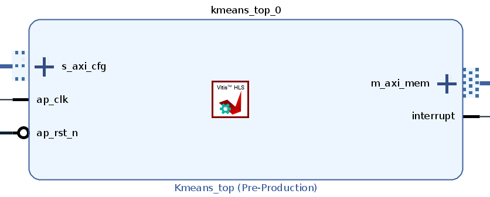

The *k*-means kernel is generated from C++ source code using Vitis HLS. The source code is provided in [hls/kmeans_vitis.cpp](hls/kmeans_vitis.cpp). To generate the kernel:
```bash
cd build/kernel
make
```
The resultant kernel IP is exported to the `kmeans_ip_from_vitis_vck190` directory.

To generate the kernel to be run on ZC1657:
```bash
cd build/kernel
make zuplus
```
The resource utilization for the two versions of the kernel is summarized as follows:
| PL Resource  | Versal Kernel Utilization | UltraScale+ Kernel Utilization |
| ------------ | ------------------------- | ------------------------------ |
| LUT          | 5,157                     | 5,132                          |
| FF           | 7,075                     | 7,102                          |
| DSP          | 14                        | 23                             |
| BRAM         | 19                        | 18                             |
| SRL          | 114                       | 114                            |
| URAM         | 6                         | 6                              |


# Building and Running the Top-Level Design on Versal ACAPs
The Versal design is structured as shown in the following figure.
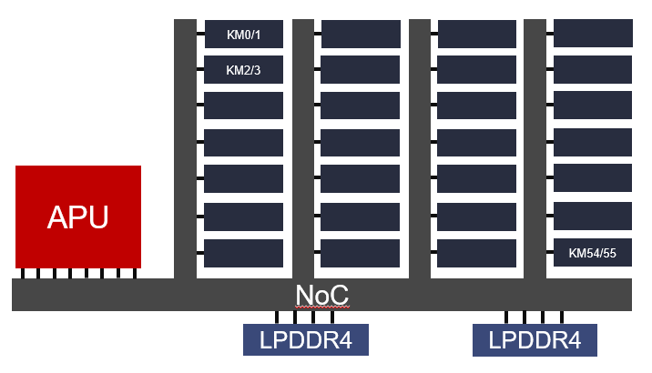

A bare-metal application runs on an Arm Cortex-A72 processor in the Application Processing Unit (APU). This application generates random data points and writes them to LPDDR4 memory by way of the NoC. 56 instances of the *k*-means kernel are implemented in programmable logic. The APU uses the NoC to configure registers in the kernels, to instruct them to start the *k*-means algorithm, and to monitor them for completion. Once configured, the *k*-means kernels use the NoC to fetch data points from memory, and to write the final results back to memory. When the *k*-means kernels are done, the APU fetches the results from memory, solves the same clustering problem in software, and compares results from software versus hardware to validate the hardware accelerated result.

The NoC plays a vital role in the design, and it facilitates multiple data movement paths. These are described in more detail in the following.
## APU to/from Memory
The NoC provides hardened memory controllers for connection to DDR4 or LPDDR4 memory. The VCK190 board, for example, uses one of these controllers for DDR4 memory running at 3200 MT/s, and two controllers for LPDDR4 memory running at 3933 MT/s. Each of these LPDDR4 interfaces is configured as 2x32, for a total of four independent 32-bit channels. This design does not make use of the DDR4 memory on VCK190. The APU uses eight ports for connection to the NoC. Each memory controller has four NoC ports. This design connects all eight APU NoC ports to port 0 of both memory controllers, as shown in green in the following figure.
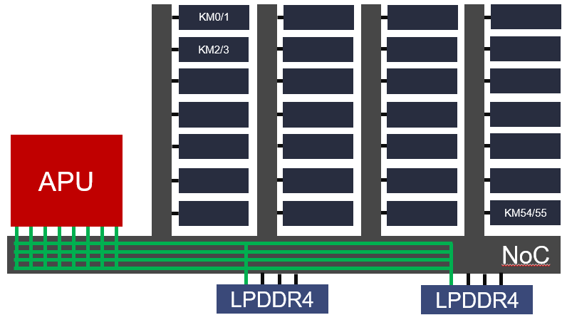

## APU to/from Kernels
The NoC is also used to provide a connection from the APU to the kernels. The APU uses this to set configuration registers in the kernels, to signal them to start, and to monitor their progress. This path is shown in green and blue in the following figure.
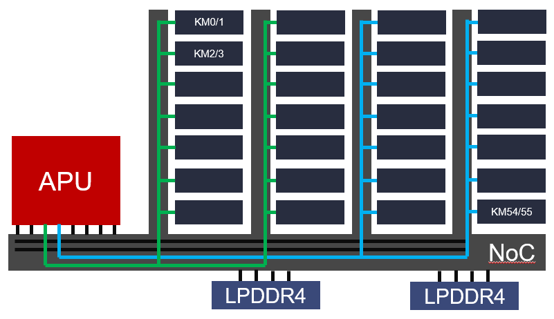

A few details of this path are worth mentioning.
### Muxing from NoC to Kernels
The Versal XCVC1902 device in the VCK190 board has 28 NSUs, but 56 kernels need to be addressed. This is accomplished by adding instances of AXI SmartConnect between each NSU port and two *k*-means kernels, as shown in the following figure. The SmartConnect acts as a 1-to-2 mux. The SmartConnect also serves to convert AXI4 transactions from the APU/NoC to AXI4-Lite required by the kernels. The configuration path, from the APU via the NoC, enters from the left side of the figure.
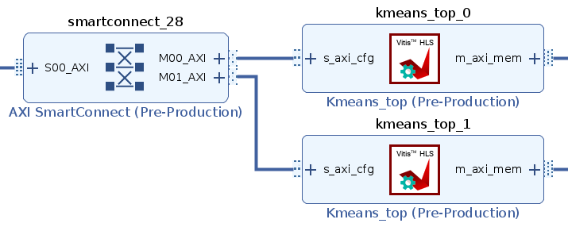
### NMU to NSU Limitation
Each NMU can only connect to a maximum of 16 NSUs. In this design there are connections to 28 NSUs, so two NMUs are required. This is shown in the previous block diagram, in which a green route from one NMU connects to half the kernels, while a blue route from a different NMU connects to the other half.
### Fixed Address Ranges and NMUs
PL devices are mapped to the system address region from 0x0201_0000_0000 to 0x03FF_FFFF_FFFF. Traffic in the 2TB to 3TB memory space is routed to the CCI port referred to as FPD_CCI_NOC_0. Traffic in the 3TB to 4TB memory space is routed to the CCI port referred to as FPD_CCI_NOC_1. These requirements dictate that design must use FPD_CCI_NOC_0 and 1 for these configuration paths from APU to kernel. These connections appear in the Connectivity tab of the AXI NoC configuration. In the following figure, S02_AXI is connected to FPD_CCI_NOC_0, and the NoC connects it to M00_AXI to M13_AXI.
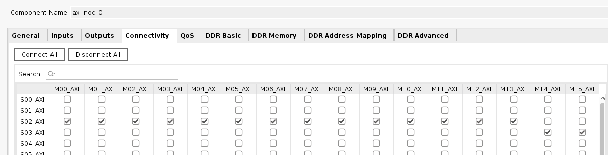
In the IP integrator Address Editor, you can see that the first 28 kernels are mapped to the 2TB to 3TB address range, and the other 28 kernels are mapped to the 3TB to 4TB range.
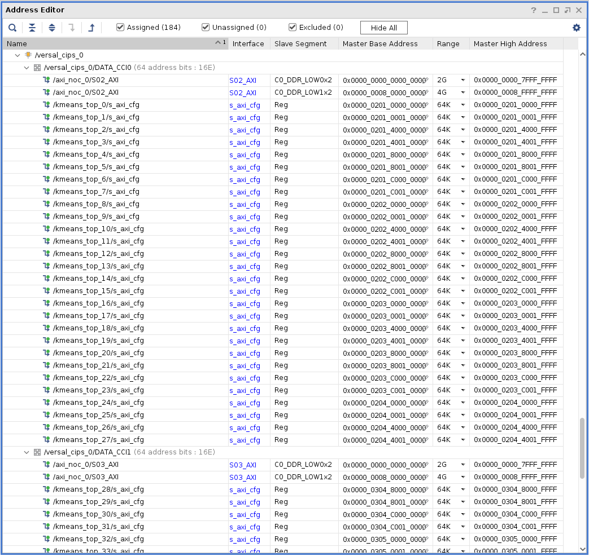

## Kernels to/from Memory
Finally, the NoC provides a path from the kernels to the hardened LPDDR4 memory controllers. The kernels use this path to read information about data points and centroids from memory, and to write the results back to memory. Optionally, the kernels can be configured to write intermediate results to memory as the clustering algorithm is iterating. These paths are shown in green, blue, and yellow in the following figure. Note, the kernels are distributed among multiple NSUs within the memory controllers to facilitate greater throughput to memory.
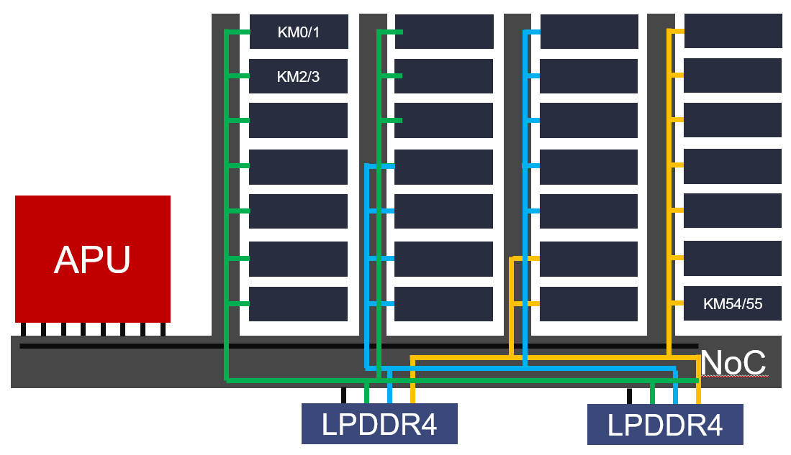

### Muxing from Kernels to NoC
As described [APU to/from Kernels](#Muxing-from-NoC-to-Kernels), the XCVC1902 device only has 28 NMUs, but this design has 56 kernels. In order to connect the kernels to the NoC, additional AXI SmartConnect instances are added to function as a 2-to-1 mux between each two kernels and a corresponding NMU port. The path to memory exits from the right side of the kernels, goes through the AXI SmartConnect acting as a 2-to-1 mux, and then exits the right side of the SmartConnect to connect to memory via the NoC.
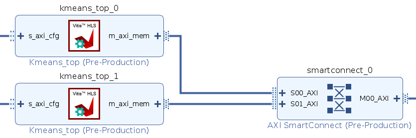

## Building the Top-Level Design
To build the top-level design, start the Vivado® Design Suite in the `build/design` directory. Within the Vivado Tcl Console:
```tcl
source ./create_design_vck190.tcl
```
After the script completes, you can see the top-level block design by looking at the Diagram tab. Three more steps are required to generate the device image:
1. Click on **Generate Block Design**
2. Click on **Generate Device Image**
3. Copy the resultant PDI file from `kmeans_project_vck190/kmeans_project_vck190.runs/impl_1/design_1_wrapper.pdi` to `../../pdi/vck190`.
4. Run **File->Export->Export Hardware...**  Select the option to **Include device image**, and otherwise use the default options.

Generating the device image might require more than 12 hours to complete. Alternatively, use the pregenerated PDI file available on the web. Download the files from [here](https://www.xilinx.com/bin/public/openDownload?filename=XD024_binaries.tgz). Move the downloaded file to the top directory of this tutorial, and extract the contents there. If done correctly, the PDI file will be extracted to the `pdi/vck190` directory, and the ELF file will be extracted to `elf/vck190`.

## Compiling the Application
Source code for the application that runs on the APU is provded in the `src/vck190` directory. To compile the application, complete the following steps:
```bash
cd build/elf
xsct build_kmeans_app_vck190.tcl
```
After compilation, the resultant ELF file is located in:
`build/elf/kmeans_workspace_vck190/kmeans_top_vck190/Release/kmeans_top_vck190.elf`.  Copy the ELF file from this location to `../../elf/vck190`.

If using the prebuilt PDI, skip this process and use the prebuilt ELF file provided in the `elf/vck190` directory.

## Running the Application
A set of scripts is provided to facilitate running the design. This script assumes you are an internal Xilinx user accessing a board-farm board with systest. Future versions of this tutorial will include scripts to facilitate running the design on a standalone board.

To run the design within Xilinx:
```bash
cd cmd
/proj/systest/bin/cluster-ping vck190
```
Identify an available VCK190 board with ES1 silicon.
```bash
/proj/systest/bin/systest <name of vck190 board>
```
At the systest prompt:
```bash
execute "top.systest.vck190"
```
The script downloads the PDI to the board, downloads the ELF, generates a random dataset and loads it to memory, launches the *k*-means clustering algorithm in the kernels, solves the same clustering problem in software, then compares the results. Statistics are reported about accelerator time taken, APU cycles taken by the accelerators, and counts of read and write commands executed by the memory controller.

To test additional datasets after the initial set completes:
```bash
runTest <# of data points> <# of clusters> 1
```
Maximum number of data points = 229,376.
Maximum number of clusters = 63.

# Building and Running the Top-Level Design on UltraScale+ Devices
The Zynq UltraScale+ design is structured as shown in the following figure.
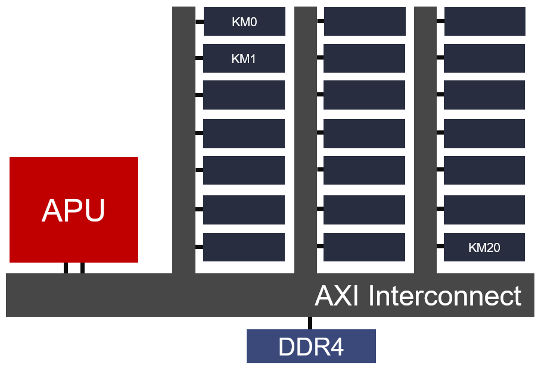

The design is conceptually similar to the Versal design, but with a few important differences.
1. No NoC: Whereas Versal ACAPs have a dedicated Network on Chip to connect the APU, kernels, and DDR memory, Zynq UltraScale+ devices lack this feature. Instead of one NoC instance, the Zynq UltraScale+ design requires three AXI Interconnect instances, each of which use up programmable logic and routing resources.
2. No Dedicated DDR Memory Controllers: Versal has memory controllers integrated into the NoC, and those memory controllers can support LPDDR4 up to 4266 MT/s. Zynq UltraScale+ devices have no dedicated memory controllers, and instead requires using more programmable logic resources to implement the controller. No LPDDR4 support is available in the programmable logic memory controller.
3. Only 21 Kernels: Lots of PL resources are consumed by the AXI Interconnect and DDR Memory Controller, leaving fewer available resources for kernels. In an XCZU19EG device, only 21 kernels could fit in the remaining logic.

For comparison with the Versal design, here are descriptions of the comparable data paths in the Zynq UltraScale+ design.

## APU to/from Memory
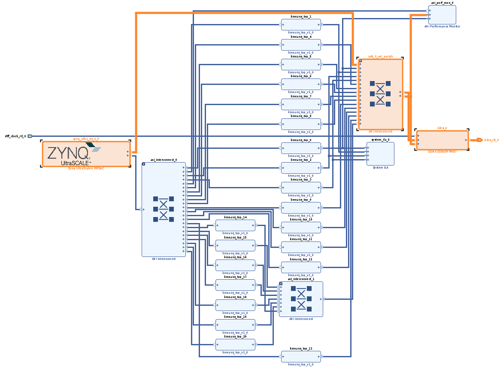
The APU sends data to/from memory by way of the path highlighted in the preceding figure. AXI transactions are routed from the APU to the AXI Interconnect block in the upper right. The DDR4 Memory Controller is highlighted on the right side of the figure.

## APU to/from Kernels
All the configuration and control traffic between the APU and the kernels is accomplished with another AXI Interconnect. As shown in the following figure, AXI transactions originate at the APU on the left side of the figure, enter the AXI Interconnect just to its right, and then fan out to all 21 kernels.
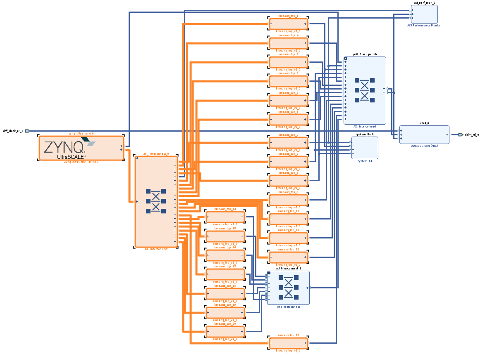

## Kernels to/from Memory
Similar to the other two data paths just described, the path from the kernels to/from memory also goes through AXI Interconnect. Take note that two AXI Interconnect instances are required. Each instance only supports a maximum of 16 AXI slave ports, so in order to connect 21 kernels, some of them must be cascaded through two interconnects.
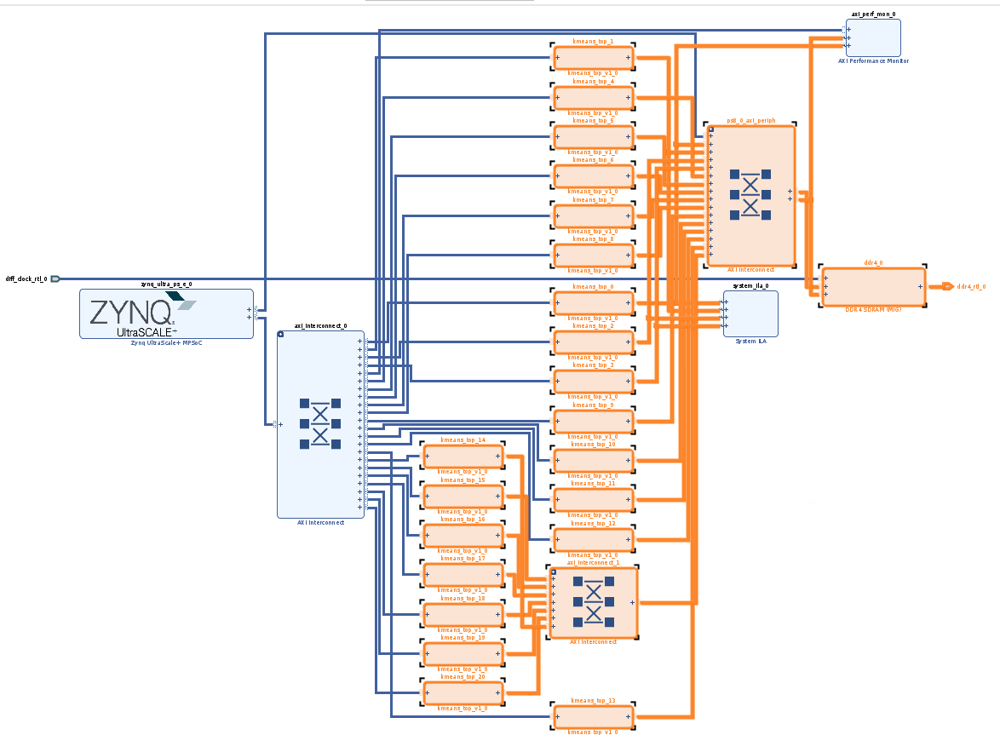

## Building the Top-Level Design
To build the top-level design, start the Vivado Design Suite in the `build/design` directory. In the Vivado Tcl Console:
```tcl
source ./create_design_zc1657.tcl
```
After the script completes, you can see the top-level block design by looking at the Diagram tab. Three more steps are needed to generate the device image:
1. Click on **Generate Block Design**
2. Click on **Generate Bitstream**
3. Copy the resultant bit file from `kmeans_project_zc1657/kmeans_project_zc1657.runs/impl_1/design_1_wrapper.bit` to `../../pdi/zc1657`.
4. Run **File->Export->Export Hardware...**  Select the option to **Include device image**, and otherwise use the default options.

Generating the bit file might require upwards of 12 hours to complete. Alternatively, use the pregenerated bit file available in the `pdi` directory of this tutorial.

# Comparison of Results
The total resource utilization for the two versions of the block design is summarized below:
| PL Resource  | Versal Utilization        | UltraScale+ Utilization        |
| ------------ | ------------------------- | ------------------------------ |
| LUT          | 393,829                   | 217,402                        |
| LUTRAM       | 28,587                    | 11,689                         |
| FF           | 563,257                   | 302,692                        |
| DSP          | 784                       | 486                            |
| BRAM         | 532                       | 306                            |
| URAM         | 336                       | 126                            |

The normalized resource utilization for the two versions of the block design is summarized below, where normalized = total / # of kernels:
| PL Resource  | Versal Normalized Utilization | UltraScale+ Normalized Utilization |
| ------------ | ----------------------------- | ---------------------------------- |
| LUT          | 7,033                     | 10,352                         |
| LUTRAM       | 510                       | 557                            |
| FF           | 10,058                    | 14,414                         |
| DSP          | 14                        | 23                             |
| BRAM         | 10                        | 15                             |
| URAM         | 6                         | 6                              |

The UltraScale+ design is limited by the number of available URAMs. At 21 kernels, 98% of the URAMs were consumed. As expected, the Versal design consumes far fewer LUT, FF, DSP, and BRAM on a per-kernel basis. This is because the UltraScale+ design requires resources for the AXI Interconnect and DDR memory controller.


# Revision History
* Mar 5, 2021 - Initial draft


© Copyright 2021 Xilinx, Inc.

Licensed under the Apache License, Version 2.0 (the "License");
you may not use this file except in compliance with the License.
You may obtain a copy of the License at

    http://www.apache.org/licenses/LICENSE-2.0

Unless required by applicable law or agreed to in writing, software
distributed under the License is distributed on an "AS IS" BASIS,
WITHOUT WARRANTIES OR CONDITIONS OF ANY KIND, either express or implied.
See the License for the specific language governing permissions and
limitations under the License.

<p align="center"><br><sup>XD024</sup></br></p>
