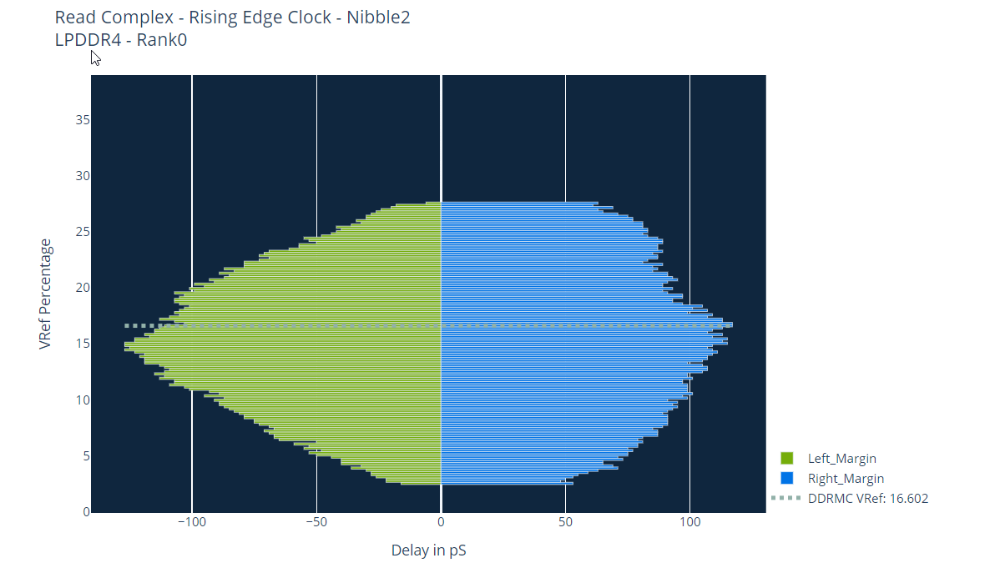
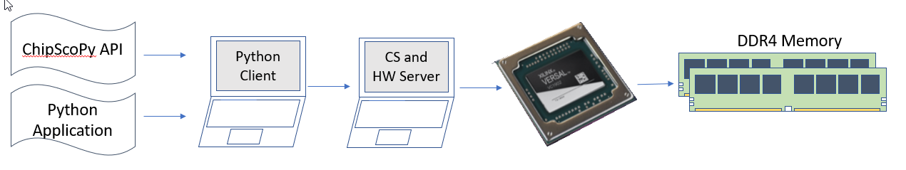
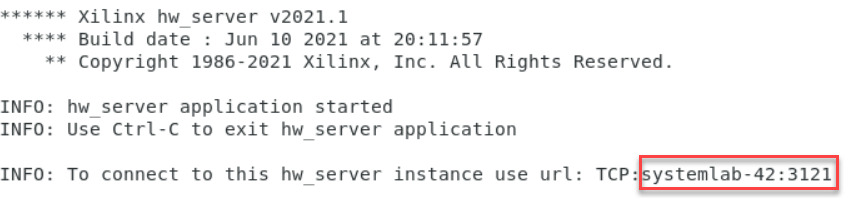
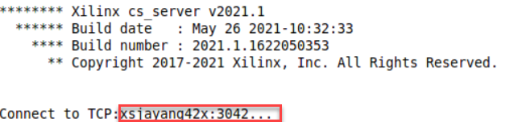
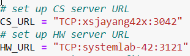
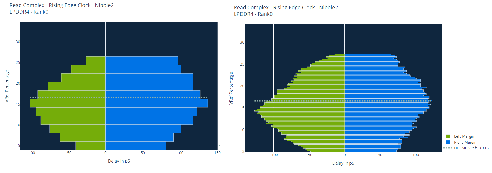

<table>
 <tr>
   <td align="center"><h1>Versal&reg; ACAP DDR Memory Controller - 2D Eye Scan Tutorial</h1>
   </td>
 </tr>
</table>

# Introduction

This tutorial provides a walkthrough of the 2D Eye Scan function on the integrated Versal&reg; ACAP DDR Memory Controller. The 2D Eye shows the data margin available in a graphical format as the Vref is adjusted for either read or write operations. The software requirements and the functions will be detailed along with a sample python script to enable the user to generate their own scans quickly.

# Requirements

* 2D Eye Scan is a hardware feature, therefore a Versal&reg; ACAP with a LP/DDR4 memory interface is required and a hardware debug connection (eg Platform Cable USB II, SmartLynq Data Cable, or SmartLynq+ Module)

* Vivado&reg; or VitisTM version 2021.1 or later

* Python client (3.8.3 recommended)

* ChipScoPy Python Package 2021.1 or later

* Python Application

## Accessing the Tutorial Reference Files

To access the reference files, type the following into a terminal: `git clone 
https://github.com/Xilinx/Vivado-Design-Tutorials/tree/master/Device_Architecture_Tutorials/Versal/NoC_DDRMC`

# Overall Flow

Python code is provided as a template for setting up and executing a 2D read or write margin request. This code along with the ChipScoPy API is executed by the Python client and communicates through the CS and HW server (which may or may not be hosted on the same computer as the Python client) to the Versal ACAP. Inside the ACAP the DDR Memory Controllers take the requests for margin scan, perform the necessary reads or writes to the DDR memory to collect the data, and then return the data back to the Python client. The Python client then calls ChipScoPy API functions to construct the 2D eye from the margin data, and saves the data for later reference.

**Note**: The two PCs in the illustration may be combined into one. They are shown as separate to indicate a lab PC connected to the ACAP and a Python Client remotely communicating with the lab PC.

There are three Python files that are included with this tutorial:
  - versal_2d_eye_scan.py    : Python code for 2D eye scan
  - scan_util.py             : Helper functions for 2D eye scan
  - versal_2d_eye_scan.ipynb : Python code with Jupyter Notebook formatting

If using Jupyter Notebook as the Python client, use the file with the .ipynb extension, but for other Python clients, use the .py extension.

The tutorial details the various steps included in the sample Python code. The code is designed to be run from start to finish and generate an eye diagram and save the scan for later use.

## Python and ChipScoPy Setup

Installation of Python and ChipScoPy are not covered in this tutorial.

See the installation instructions located on the ChipScoPy Github page <https://github.com/Xilinx/chipscopy>

It is recommended to use Python version 3.8.3, which has been tested with this flow.

## Starting CS_SERVER and HW_SERVER

CS_server and HW_server are provided in the Vivado and Vitis installation. The CS_Server is a client that takes high level debug commands from any number of sources and breaks them into discrete commands for HW_server to manage. HW_server takes these lower level commands and communicates with hardware drivers to drive to the ACAP over PCIE or JTAG.

From the PC connected to the ACAP, launch these programs by entering:

*/vivado/2021.1/bin/* hw_server

*/vivado/2021.1/bin/* cs_server

**Note**: The paths in italics should be replaced as necessary

After launching HW_server and CS_server, take note of the ports that are provided for **each** client. Both will need to be updated in the Python code.

All user configuration settings are grouped in the first section of the Python code.
Update the **HW_URL** variable with the HW_server port information, and the **CS_URL** variable with the CS_server port information.

## Setting the ChipScoPy Environment

Set the **CSPY_SRC** variable to the location where chipscopy was installed.

## Running the Python code

All of the following steps in the tutorial provide details on how to properly configure the code to obtain the desired 2D eye. All of the necessary functions are provided in the sample code however they must be configured for your installation and file locations.

After completing the edits, launch your ChipScoPy virtual environment and execute the code.

## Setting the Programming Bitstream

Adjust the **PDI_FILE** path and PDI as necessary within the double quotation marks.

## Selecting the Target

Ensure that the proper ACAP device and Memory Controller are selected.

If there is only 1 ACAP in the device debug chain, leave **ACAP_INDEX** as 0, otherwise adjust as appropriate.

All ACAP devices have at least two DDR Memory Controllers (DDRMC). 2D eye scan targets one DDRMC at a time, so adjust the **DDR_INDEX** as appropriate. A report of the available/enabled DDRMCs will be displayed during the flow, so this can be used to doublecheck if the correct DDRMC is selected.

If there is only 1 rank in the DDR memory interface, leave **RANK** as 0, otherwise adjust to the target rank for the 2D eye scan. Only one rank may be targeted at a time.

## 2D Eye Scan Flow

The 2D eye is built up from multiple 'slices' of margin data. Each horizontal slice is the margin for a given Vref sample point. Calibration establishes these Vref sample points for the input buffers at the ACAP and at the DDR. Reads and writes are considered from the ACAP perspective so a read margin refers to obtaining a 2D eye by adjusting the Vref sample point at the ACAP. Conversely a write margin refers to adjusting the Vref sample point at the DDR. Margins are captured by iterating through Vref points and then combined to form the 2D eye.

Therefore to properly capture a 2D eye, one must request either a read or write margin, and also the min and max values to use for the Vref.

Select the desired margin by adjusting **MARGIN_MODE** to READ or WRITE.

## Data Pattern

The data pattern used for margin detection will have an impact on the resulting eye. A simple data pattern will result in a wider eye compared to the complex pattern. The time for a scan using complex pattern is marginally more than simple.

Set the desired **DATA_PATTERN** to SIMPLE or COMPLEX.

## Selecting Vref

The supported Vref sample point range is different for read and write margin.

For read margin, the ACAP can support a selection anywhere from 0 to 100% of Vref (Vcco) with a granularity of 0.0976563 %

For write margin, the supported Vref range is defined by the DDR4 and LPDDR4 JEDEC specifications (JESD79-4A and JESD209-4A respectively).

DDR4: The targetable Vref is split into two overlapping regions, from 60-92.5% for range 0 and 45 to 77.5% for range 1. In both ranges, the increments between Vref points are 0.65%.

LPDDR4: The targetable Vref is split into two overlapping regions, from 10-30% for range 0 and 22 to 42% for range 1. In both ranges, the increments between Vref points are 0.4%.

For the exact values, consult the appropriate specification.

It is not necessary to know the exact percentage values, a function is provided (*convert_vref_pct_to_code*) that will look at the read/write margin mode and then adjust the requested Vref to the closest available value.

**NOTE:** This function looks at the **MARGIN_MODE** variable to determine which Vref range to use; ensure that it is set properly before running.

For example, for LPDDR4 write, two adjacent Vref points are 14.8% and 15.2%. If the requested value is 14.9%, the function will choose the value closest, which is 14.8%. If the requested value is exactly in the middle, the function returns the lower value (in the example above, requesting 15% returns 14.8%).

**NOTE:** 2D eye scan is not able to cross write Vref ranges. The vref range is pre-determined by calibration and the 2D eye scan may only operate in that region. The range can be found by running the *get_write_vref_range* function. Alternatively you can find this by trial and error - *convert_vref_pct_to_code* will report if the requested Vref value is selectable or not.

**NOTE:** Data input voltage is divided by 2 inside the IO buffer, hence the low Vref percentage setting for Read Margin.

## 2D Eye Steps

 For time considerations a step option is provided. This option defines how many 'steps' the 2D eye will be split into. In the 2D eye image at the top of the page, it is assembled by stacking the 14 steps of margin. Each margin step takes approximately 1 second to capture.

Select the number of steps by adjusting the **STEPS** variable to an positive integer.

The number of steps is bounded by the number of available increments for the hardware and also the Vref Min and Max setting.

For example, LPDDR4 write is selected with a Vref min of 14.8% and 20.0%. Counting the endpoints, there are 14 available increments between these. So the maximum value of steps given these endpoints is 14.

Below is an example of two eye scans using the same Vref Min and Max values, but with different step sizes.

## Collecting the margin data

After all of the configuration settings are entered, the *run_eye_scan* API is called and the Python client will begin managing the commands to the ACAP and data being returned.  A status bar will show the progress.

Margin data collection is performed on all nibbles (reads) and byte lanes (writes) in parallel. When the 2D Eye scan completes, all data for the entire interface at each of the selected Vref points are stored in memory.

## Choosing what to display

 The *display_eye_scan* API call is used to extract the relevant data from the database and draw the eye. This can be run after *run_eye_scan* has completed, or after loading previously saved data (see Loading Saved Results below). The DISPLAY_INDEX variable is used to choose which nibble/byte lane to display the 2D eye.

If more than 1 display is desired, modify the Python code to duplicate the following command with the desired values.

*ddr.display_eye_scan(DISPLAY_INDEX)*

## Re-running the scan

After the first scan is complete, a subsequent scan may be desired to enlarge the eye or to increase the resolution (steps). Return to the top part of the python code where the settings are stored and adjust as needed.  

## Saving the results

The data captured from the 2D eye scan can be saved for later review without needing to re-run the data collection. This file is a comma separated file (CSV) for convenient post processing by other methods.

*ddr.save_eye_scan_data('filename.csv')*

## Loading Saved Results

Data can be restored using the *load_eye_scan_data* API. This loads previously saved data into memory so the *display_eye_scan* API can be used without having to recapture the 2d eye. For the 2021.1 release, a hardware connection must exist to load saved results. A future release will support offline mode.

*ddr.load_eye_scan_data('filename.csv')*

## Closing Chipscope Server

When finished with hardware access, close the Chipscope Server connection using the command below. Failure to do this may result in issues reconnecting to this server later.

*session.cs_server.close()*

## Conclusion

This tutorial provides code to allow a user to generate a 2D eye  to fit their needs with minimal modification. The Python interface allows tremendous flexibility to customize the 2D eye either in range or in granularity.

# References

Xilinx ChipScoPy Github : https://github.com/Xilinx/chipscopy

==========

# Support

GitHub issues will be used for tracking requests and bugs. For questions go to [forums.xilinx.com](http://forums.xilinx.com/).

# License

Licensed under the Apache License, Version 2.0 (the "License"); you may not use this file except in compliance with the License.

You may obtain a copy of the License at [http://www.apache.org/licenses/LICENSE-2.0]( http://www.apache.org/licenses/LICENSE-2.0 )

Unless required by applicable law or agreed to in writing, software distributed under the License is distributed on an "AS IS" BASIS, WITHOUT WARRANTIES OR CONDITIONS OF ANY KIND, either express or implied. See the License for the specific language governing permissions and limitations under the License.

 XD107 | &copy; Copyright 2021 Xilinx, Inc.

