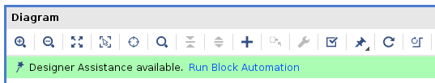
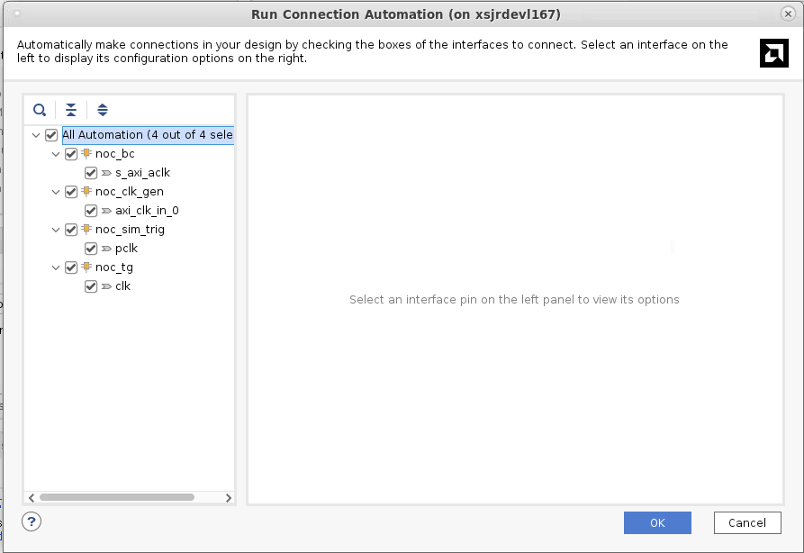
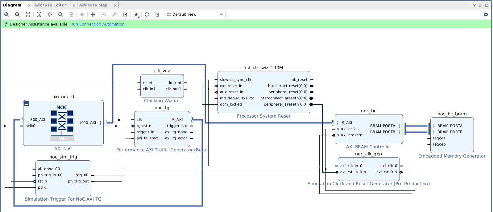
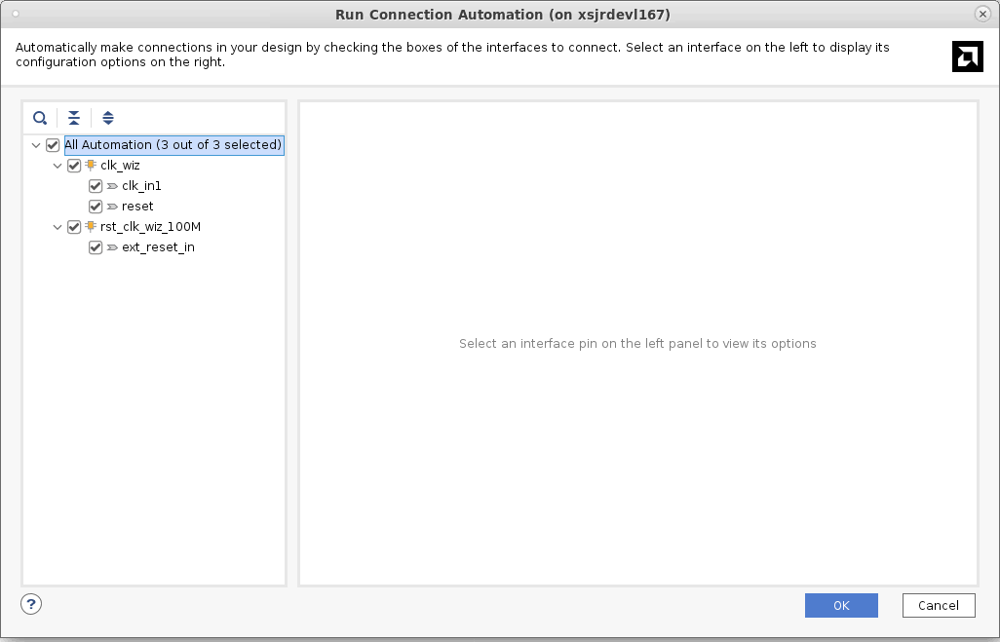
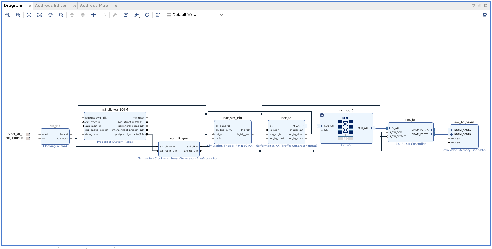
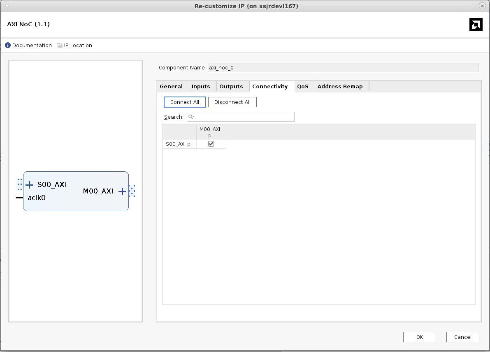
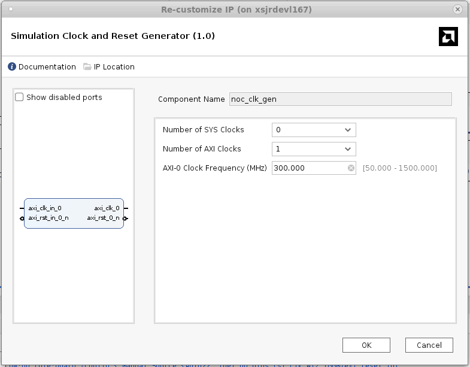
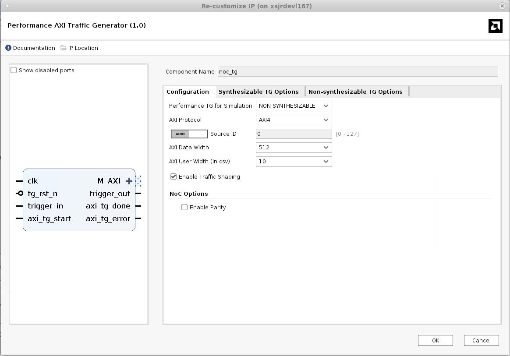
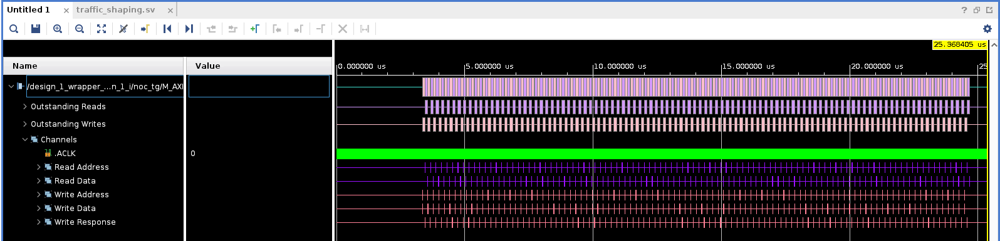

<table>
 <tr>
   <td align="center"><h1>2021.1 Versal™ Basic NoC Design</h1>
   </td>
 </tr>
 <tr>
 <td align="center"><h1>Building and Running the Design</h1>
 </td>
 </tr>
</table>

# Introduction to Logical NoC
The Vivado® Next Generation 2021.1 tool flow introduces a pair of IPs: the AXI NoC and the
AXIS NoC. These IPs act as logical representations of the Versal™ programmable NoC. The AXI
NoC supports the AXI memory mapped protocol while the AXIS NoC supports the AXI4-Stream
protocol. Each instance specifies a set of connections to be mapped onto the physical NoC, along
with the quality of service (QoS) requirements for each connection. A given block design may
have any number of instances of both types. IP integrator automatically aggregates the
connectivity and QoS information from all of the logical NoC instances to form a unified traffic
specification for the NoC compiler.
The integrated memory controllers (MCs) are integrated into the AXI NoC core. An instance of
the AXI NoC IP can be configured to include one, two, or four instances of the integrated MC. If
two or four instances of the MC are selected, they are configured to form a single interleaved
memory. In this case, the memory controllers are configured identically and mapped to the same
address. Interleaving is controlled by the NoC.

# Description of the Design
This design uses an AXI4 traffic generator to write and read data to/from a block RAM. The
design will use a simulation clock generator, an AXI4 traffic generator block, an instance of the
Versal™ NoC, an AXI4 block RAM controller and a memory generator to create a block RAM
instance. This lesson uses a top-down design flow in which an AXI NoC IP is instantiated in the
block design canvas. IP integrator Designer Assistance is then used to infer the NoC, clock
generator and interconnect. After the design is created, it will be simulated to ensure that
the bandwidth requirements of the design are met.
Note: This lab is provided as an example only. Figures and information depicted here might vary from the
current version.

# Create a Project

## Start the Vivado Design Suite
1. Open the Vivado® Design Suite. Ensure the banner at the top of the window identifies the
**Vivado 2021.1** release.
2. Click **Create Project** from the Quick Start Menu.
3. In the Project Name page specify a name of the project such as **lab1**.
4. Step through the popup menus to access the Default Part page.
5. In the Default Part page, search for and select: **xcvc1902-vsva2197-1LP-e-S**.
6. Continue to the Finish stage to create the new project and open Vivado.
7. In the Vivado Flow Navigator, click **IP Integrator** → **Create Block Design**. A popup dialog box
displays to create the block design. Type a name for the block design in the **Design name:**
field.
8. Click **OK**. An empty block design diagram canvas opens.
The Tcl commands to create the project and initial block design are as follows:

In the Vivado Tcl Console:
```tcl
create_project lab1 ./lab1 -part xcvc1902-vsva2197-1LP-e-S-es1
create_bd_design "design_1"
```
# Instantiate the IP and Run Designer Assistance
1. Right-click on the block design canvas and from the context menu select **Add IP....**
2. The IP catalog pops up. In the Search field type **AXI NoC**, to filter a list of IP. From the filtered
list, double-click the **AXI NoC** to instantiate the IP on the block design canvas.
3. The Run Block Automation link becomes active in the block design canvas banner.

4. The Run Block Automation dialog box pops up. The All Automation (1 out of 1 selected)
check box is already checked. Click **OK** with the default options set. Running block
automation instantiates the necessary IP to create a functional design with the NoC and
connects all the IP appropriately.

5. The Run Connection Automation link at the top of the block design canvas banner becomes
active.

6. Click the **Run Connection Automation** link.
7. The Run Connection Automation dialog box pops up. Select **All Automation** (4 out of 4
selected). With all the default options set, click **OK**.


This action completes the clock and reset connection to the AXI NoC as shown in the
following figure. Note that there is a Clocking wizard IP and Simulation Clock and Reset
Generator IP in the block design. The output clock from the Clocking Wizard IP drives the
input clock of the Simulation Clock and Reset Generator IP. This serves two purposes. When
performing simulation the clock is driven by the Simulation Clock and Reset Generator IP.
When implementing the design, the Clocking Wizard IP drives the clock and the Simulation
Clock and Reset Generator IP goes into a "pass-through" mode. In other words, it does not
drive any clocks, but lets the output clock from the Clocking Wizard IP become the default
clock for the design.

8. The Run Connection Automation link becomes active again, as the input clock and reset
sources for the Clocking Wizard IP are yet to be connected. Click the link at the top of the
block design. Select **All Automation** (3 out of 3 selected) as shown and click **OK**.

9. Click the **Regenerate Layout** icon in the toolbar at the top of the block design canvas to
generate an optimal layout of the design.

    The canvas now shows the complete design as shown in the following figure.
    

``` tcl
apply_bd_automation -rule xilinx.com:bd_rule:axi_noc -config { mc_type {None} noc_clk {New/Reuse Simulation Clock And Reset Generator} num_axi_bram {1} num_axi_tg {1} num_aximm_ext {None} num_mc {None} pl2noc_apm {0} pl2noc_cips {0}}  [get_bd_cells axi_noc_0]
startgroup
apply_bd_automation -rule xilinx.com:bd_rule:clkrst -config { Clk {/noc_clk_gen/axi_clk_0 (300 MHz)} Freq {100} Ref_Clk0 {} Ref_Clk1 {} Ref_Clk2 {}}  [get_bd_pins noc_bc/s_axi_aclk]
apply_bd_automation -rule xilinx.com:bd_rule:clkrst -config { Clk {New Clocking Wizard} Freq {100} Ref_Clk0 {} Ref_Clk1 {} Ref_Clk2 {}}  [get_bd_pins noc_clk_gen/axi_clk_in_0]
apply_bd_automation -rule xilinx.com:bd_rule:clkrst -config { Clk {/noc_clk_gen/axi_clk_0 (300 MHz)} Freq {100} Ref_Clk0 {} Ref_Clk1 {} Ref_Clk2 {}}  [get_bd_pins noc_sim_trig/pclk]
apply_bd_automation -rule xilinx.com:bd_rule:clkrst -config { Clk {/noc_clk_gen/axi_clk_0 (300 MHz)} Freq {100} Ref_Clk0 {} Ref_Clk1 {} Ref_Clk2 {}}  [get_bd_pins noc_tg/clk]
endgroup
startgroup
apply_bd_automation -rule xilinx.com:bd_rule:board -config { Clk {New External Port} Manual_Source {Auto}}  [get_bd_pins clk_wiz/clk_in1]
apply_bd_automation -rule xilinx.com:bd_rule:board -config { Manual_Source {New External Port (ACTIVE_HIGH)}}  [get_bd_pins clk_wiz/reset]
apply_bd_automation -rule xilinx.com:bd_rule:board -config { Manual_Source {Auto}}  [get_bd_pins rst_clk_wiz_100M/ext_reset_in]
endgroup
regenerate_bd_layout
```

# NoC Configuration
Each of the instantiated IP blocks has a set of parameters which can be configured to ensure the
IP core behaves as intended. Designer Assistance sets default values that in most cases need
not be changed. This section examines the NoC configuration options.
The NoC configuration determines the number and type of ingress and egress ports to be used
by the design; the association of input clocks with each port; the routing connectivity between
ingress and egress ports; and the desired quality of service (QoS) for each connection.
1. Open the Versal™ NoC Configuration Wizard by double clicking the **axi_noc_0** instance.
The General tab (shown in the following figure), shows the set of NoC interfaces to configure.
Designer Assistance sets the default configuration as follows:
* One AXI slave interface from the PL to the NoC to connect the traffic generator.
* One AXI Master interface to connect the NoC to the block RAM Controller.
In addition, one AXI Clock is selected. This clock will drive the traffic generator and the block
RAM controller as well as the PL interfaces of the NoC.

2. Open the **Inputs** tab to view the configuration of the input port.
This tab shows a table to associate the type of the source and the AXI clock with each input.
In this case, only one input is defined, it is connected to the PL domain, and its associated
clock is `aclk0` (the only AXI clock defined on the previous tab). No changes need to be made
on this tab.
The Outputs tab (not shown) shows a similar table to associate an AXI clock and a destination
domain for each output. No changes need to be made on this tab.
3. Open the **Connectivity** tab.
This menu presents a patch panel style connection matrix to show which NoC ingress
interfaces (for example `S00_AXI`) will be routed to which egress interfaces (for example
`M00_AXI`). Designer Assistance has set the default configuration to connect the traffic
generator to the AXI block RAM controller.

4. Open the **QoS** tab (shown in the following figure).
The QoS tab allows you to select the quality of service (QoS) settings for each NoC
connection.
The first line shows the QoS settings for the ingress port (`S00_AXI`).
Note, the default read and write traffic classes are BEST_EFFORT.
5. Open the tree by clicking on the far left of the ingress port, `S00_AXI`.
This shows the set of QoS properties for each output connection from the selected ingress
port. In this design there is only one output connection (`M00_AXI`) corresponding to the AXI4
port to the block RAM controller. Here the required read and write bandwidth may be
specified. The default values of 1720 MB/s are sufficient.
6. Click **OK** in the bottom right corner to close the NoC menu.

# Configure the Remaining IP
1. Double click the **noc_clk_gen** instance to open the Simulation Clock and Reset Generator
Configuration Wizard.
2. Set the following values:
* The default value for Number of SYS Clocks field is set to **0**. Leave this field at its default
value.
* The default value for the Number of AXI Clocks field is set to **1**. Leave this field at its
default value.
* The default value for the AXI-0 Clock Frequency (MHz) field is set to **300**. Leave this at its
default value.

See the following figure for reference:


3. Click **OK** to close.
4. Double click the **noc_tg** instance to configure the traffic generator. The initial dialog shows
the Configuration tab. For this design the default values are used.

See the following figure for reference.

5. Open the AXI4 Simulation TG Options tab (shown in the following figure) and set the
following values:

    a. Enable Data Integrity Check by clicking the pull-down menu and selecting ON.

    b. Leave all other fields at their default values.

Note: AXI Write Length is set to 0 (a burst length of 1), the AXI Size is set to 64 BYTE and the AXI Burst is set to INCR (the address will be incremented after each transaction).

See the following figure for reference:


6. Click **OK** to apply these changes.

7. Click **Regenerate Layout** (at the top of the canvas).

8. The corresponding Tcl command to Configure the traffic generator is as follows:

``` tcl
set_property -dict [list CONFIG.USER_C_AXI_DATA_INTEGRITY_CHECK {ON}] [get_bd_cells noc_tg]
```
# Address Map
To create a default address map:
1. Open the **Address Editor** tab as shown in the following figure. Expand the tree by clicking the
down-arrow on **noc_tg**.

2. Right-click in the Address Editor window and select **Assign All** from the context menu.

3. Note that the address of `0x0000_0201_0000_0000` is assigned to `axi_bram_ctrl_0`.
When **validate_bd_design** is run these values are propagated to the traffic generator.

# Validate the Block Design
The next step is to validate the design. Validation of a NoC design invokes the NoC compiler to
find an optimal configuration for the NoC. The NoC compiler performs the following functions:
* Determines the mapping of logical ingress and egress ports to the structural NMU and NSU
resources.
* Finds an optimal route through the NoC for all of the specified connections subject to the
QoS requirements.
* Configures the NoC internal resources to implement the routing solution.

To validate the design, right-click anywhere in the canvas and, from the context menu, select
**Validate Design**, or execute the ``` tcl Tcl command validate_bd_design ```. Alternatively, you can also perform validation by clicking the **Validate Design** icon on the toolbar.
After validation the NoC viewer window shows the NoC compiler solution and the NoC QoS tab
shows the quality of service achieved.

# Simulate the Design
The Vivado simulator includes a Transaction View feature that provides a higher level waveform
view of AXI bus transactions. During simulation use the Transaction View to
observe the interface between the traffic generator and the NoC. On the design canvas select
the heavy wire that connects the `noc_tg M_AXI` port to the `axi_noc_0 S00_AXI` port. Right click
and in the pop-up menu select **Mark Simulation**. This instructs the simulator to capture and
display AXI-MM transactions on this wire.
In preparation for simulation, a top level HDL wrapper must be created:
To create the wrapper, follow these steps:
1. Open the **Sources** window.
2. Open the **Hierarchy** tab.
3. Under the Design Sources tree, select the **design_1** (design_1.bd) subtree.
4. Right click and select **Create HDL Wrapper...** as shown in the following figure.

5. Click **OK** to let Vivado manage the wrapper.
The corresponding Tcl commands are:
``` tcl
make_wrapper -files [get_files ./lab1/lab1.srcs/sources_1/bd/design_1/
design_1.bd] -top
add_files -norecurse ./lab1/lab1.srcs/sources_1/bd/design_1/hdl/
design_1_wrapper.v
update_compile_order -fileset sources_1
update_compile_order -fileset sim_1
```
6. In the Flow Navigator, right-click Simulation → Simulation Settings. This opens the Project
Settings menu at the Simulation tab as shown in the following figure.

Note: Ensure that Simulator language is set to Mixed.
7. Set the Target simulator to Vivado Simulator.
Note: The wrapper created above is now the Simulation top module name.
8. To generate the behavioral RTL models and start the simulator, click Simulation → Run
Simulation, and select Run Behavioral Simulation.
9. Click on the Run All icon  in the Simulation toolbar. Simulation will complete in about 25 μs
of simulated time.
```tcl
launch_simulation
```

The simulation waveform window will show the transactions on all of the AXI4 interfaces. In the
figure below, the input to the NoC is expanded.


You can use the Zoom control to show transaction details, as shown in the following figure.


Hovering the mouse over an individual transaction will display a pop-up showing transaction
details. Clicking on a transaction component (for example, Read Address) will highlight the related transaction components.


Licensed under the Apache License, Version 2.0 (the "License");
you may not use this file except in compliance with the License.
You may obtain a copy of the License at

    http://www.apache.org/licenses/LICENSE-2.0

Unless required by applicable law or agreed to in writing, software
distributed under the License is distributed on an "AS IS" BASIS,
WITHOUT WARRANTIES OR CONDITIONS OF ANY KIND, either express or implied.
See the License for the specific language governing permissions and
limitations under the License.

<p align="center"><sup>Copyright© 2020-2021 Xilinx</sup><br><sup>XD028</sup><br></p>
