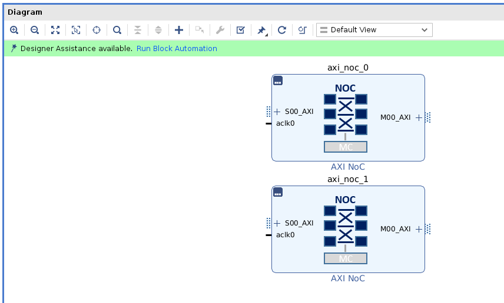
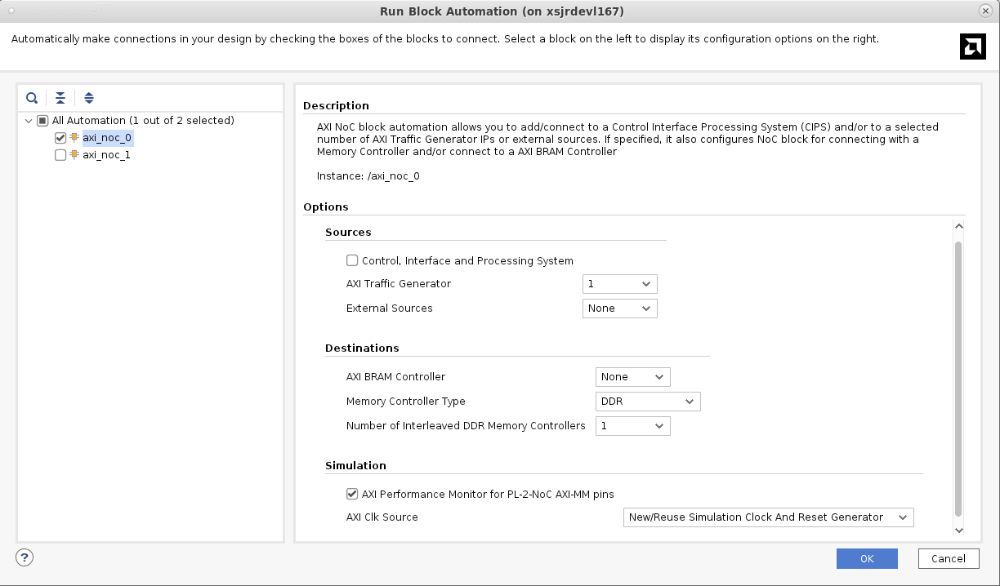
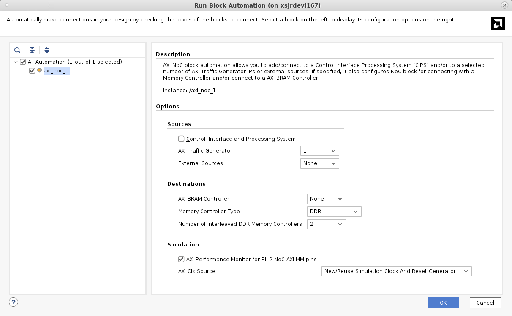
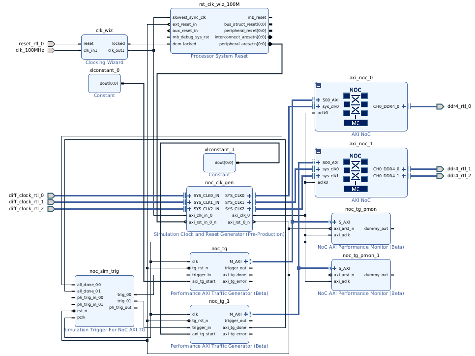
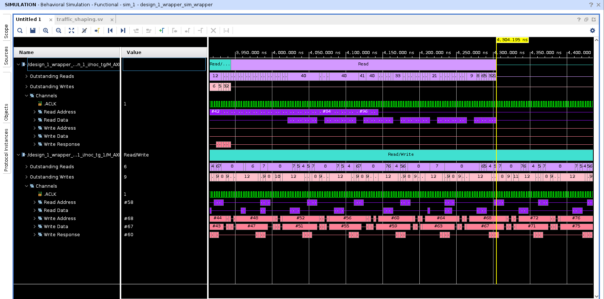

<table class="sphinxhide" width="100%">
 <tr width="100%">
    <td align="center"><h1>Versal™ NoC/DDRMC Design Flow Tutorials</h1>
    <a href="https://www.xilinx.com/products/design-tools/vivado.html">See Vivado™ Development Environment on xilinx.com</a>
    </td>
 </tr>
</table>

# Basic NoC Design: Using Integrated Memory Controller with NoC

***Version: Vivado 2021.1***


## Integrated Memory Controller
The integrated memory controllers (MCs) are integrated into the AXI NoC core. A single instance
of the AXI NoC IP can be configured to include one, two, or four instances of the integrated MC.
If two or four instances of the MC are selected, they are configured to form a single interleaved
memory. The memory controllers in an interleaved group are configured identically and mapped
to the same address. Transaction interleaving is controlled by the NoC.
## Description of the Design
This design uses two AXI4 traffic generators to write and read data to/from DDR4 memory
connected to the NoC through three integrated DDR4 memory controller (MC) blocks. The first
traffic generator reads and writes from a single DDR memory through one AXI NoC instance
while the second traffic generator reads and writes from a pair of interleaved DDR memories
through a second AXI NoC instance. AXI performance monitors are used to report the
average bandwidth and latency achieved by each of the AXI connections.
This lesson uses a bottom up design flow in which the logical NoCs are instantiated first and
Designer Assistance is used to build the design around it. As in Module_01, traffic generators are used to simulate the data flow of a real application.

***Note***: This lab is provided as an example only. Figures and information depicted here might vary from the current version.
## Create the Design
Follow the steps given in Module_01 to open the 2020.2 release of an AMD Vivado&trade;, create a new project with the **xcvc1902-vsva2197-1LP-e-S** part, and create a new block design.
### Instantiate IP and run Designer Assistance
1. Instantiate two AXI NoC instances from the IP catalog (**IP catalog** → **AXI NoC**) and drag onto
the design canvas.
The corresponding Tcl commands to instantiate the AXI NoCs are:
``` tcl
create_bd_cell -type ip -vlnv xilinx.com:ip:axi_noc:1.0 axi_noc_0
create_bd_cell -type ip -vlnv xilinx.com:ip:axi_noc:1.0 axi_noc_1
```
The default AXI NoC IPs display on the canvas as shown in the following figure.


2. Click the **Run Block Automation Designer Assistance** link in the green banner at the top of
the page. The Run Block Automation GUI displays.
3. Select **axi_noc_0** in the tree view and set the following values:
* Set the number of AXI Traffic Generator to **1** 
* The number of External Source AXI-MM is set to **None**. Leave this at its default value.
* Enable AXI Performance Monitors for PL-2NOC AXI-MM pins by selecting the check
box.
* Set the number of AXI BRAM Controller (AXI-MM Destination) to **None**.
* Set the number of Memory Controllers (DDR4) to **1**.
* Leave the NoC Clk Source at its default value.
See the following figure for reference.

4. Click OK.
The Tcl commands to run the block automation are as follows:
``` tcl
apply_bd_automation -rule xilinx.com:bd_rule:axi_noc -config { mc_type {DDR} noc_clk {New/Reuse Simulation Clock And Reset Generator} num_axi_bram {None} num_axi_tg {1} num_aximm_ext {None} num_mc {1} pl2noc_apm {1} pl2noc_cips {0}}  [get_bd_cells axi_noc_0]
```
5. Click on **Run Block Automation** a second time to run Designer Assistance on `axi_noc_1`.
6. Set the options in the Run Block Automation dialog box as follows:
* Set the number of AXI Traffic Generator to **1**
* The number of External Source AXI-MM is set to **None**. Leave this at its default value.
* Enable AXI Performance Monitors for PL-2NOC AXI-MM pins by selecting the check
box.
* Set the number of AXI BRAM Controller (AXI-MM Destination) to **None**.
* Set the number of Memory Controllers (DDR4) to **2**.
* Leave the NoC Clk Source at its default value.

See the following figure for reference.

7. Click **OK**.
The corresponding Tcl commands are as follows:
``` tcl
apply_bd_automation -rule xilinx.com:bd_rule:axi_noc -config { mc_type {DDR} noc_clk {New/Reuse Simulation Clock And Reset Generator} num_axi_bram {None} num_axi_tg {1} num_aximm_ext {None} num_mc {2} pl2noc_apm {1} pl2noc_cips {0}}  [get_bd_cells axi_noc_1]
```

8. Regenerate layout by selecting the **Regenerate Layout** button in the BD canvas, the canvas
looks as follows:

    
    ***Note***: The AXI clock and reset nets are not connected.

9. Click the **Run Connection Automation** link in the green banner.
10. Click through the clock pins on the left side of the popup. The Clock Source is
set to:
* `/noc_clk_gen for /noc_clk_gen/axi_clk_in_0` select Auto option from drop down list
and
* `noc_tg_pmon and noc_tg_pmon_1` for `/noc_clk_gen/axi_clk_0` for the rest
of the clocks.
11. Click to enable **All Automation**.
12. Click **OK**.
Now all of the clock and reset nets are connected. Additionally, the `CH0_DDR4_0` interface of the
`axi_noc_0`, `CH0_DDR4_0` and `CH1_DDR4_1` interfaces of the `axi_noc_1` are
connected to external interface ports. These ports provide the connections to the DDR
I/O.
13. The Run Connection Automation link becomes active again as there are clocks and reset
connectivity required for the Clocking Wizard. Click the link, select **All Automation** and click **OK**.

## Configure the NoC IPs
1. Double click **axi_noc_0** to display the Configuration Wizard.
2. On the QoS tab, set both the **Bandwidth Read** and **Bandwidth Write** values to **12,500**.
3. Click **OK**.
4. Double click **axi_noc_1**.

***Note***: The number of memory controllers is set to two by block automation.

5. On the General tab, set the DDR Address Region 0 value to **DDR CH1**. DDR Address Region
1 might be left at the default value: **None**.
6. On the QoS tab, set both the **Bandwidth Read** and **Bandwidth Write** values to **6000**.

***Note***: Known issue. In this release, to specify a bandwidth of **B** to an N-way interleaved
memory, set the required bandwidth on the QoS tab to **B/N**.
7. Click **OK**.
After Regenerate Layout, the canvas should look as follows:

## Configure the Traffic Generators
Configure each of the traffic generators (TGs) in turn. To display the TG configuration screen for a particular instance, double-click on the TG instance: **noc_tg** and **noc_tg_1**. The Source ID
parameter is in the Configuration tab, whereas the rest of the parameters are under the
Simulation TG Options tab. See the following figure for reference:


### Table: Traffic Generator Settings
| Component   | Tab    | Parameters     | Value    |
| ----------- |:------:|:--------------:|:--------:|
| noc_tg      | configuration  | Performance TG for Simulation   | NON SYNTHESIZABLE   |
|              |               | AXI Protocol    |  AXI4    |
|              |               |Source ID       |    0     |
|              | Non-synthesizable TG options   | Data Integrity Check   |  ON    |
|              |                                | AXI Write Bandwidth   |  12500   |
| noc_tg_1     |  configuration  | Performance TG for Simulation   | NON SYNTHESIZABLE   |
|              |               | AXI Protocol    |  AXI4    |
|              |               |Source ID       |    1    |
|              | Non-synthesizable TG options   | Data Integrity Check   |  ON    |
|              |                                | AXI Write Bandwidth   |  12500   |


The address region of each TG is set through the address editor (described in the next
section). The Tcl commands to set these properties on the TGs are:
``` tcl

set_property -dict [list CONFIG.USER_C_AXI_WRITE_BANDWIDTH {12500} CONFIG.USER_C_AXI_DATA_INTEGRITY_CHECK {ON}] [get_bd_cells noc_tg]

set_property -dict [list CONFIG.USER_C_AXI_WRITE_BANDWIDTH {12500} CONFIG.USER_C_AXI_DATA_INTEGRITY_CHECK {ON}] [get_bd_cells noc_tg_1]
```
### Set the Addressing
Open the Address Editor by clicking on the tab at the top of the canvas, click the **Expand All** icon from the Address Editor toolbar, and select the **Assign All** icon in the toolbar at the top of
the block design canvas. The default address mapping is shown in the following figure.


## Validate the Block Design
As in Module_01, validating the design runs the NoC Compiler to map the design onto the NoC
physical resources. The NoC GUI should show the NoC placement and routing solution as shown
in the following figure NoC Placement and Routing Solution:

The NoC QoS table shows the required and estimated QoS for each of the paths through the
NoC.

***Note***: The Read Latency Estimate and Write Latency Estimate represent only the round-trip structural
latency through a portion of the NoC in the NoC clock domain. These numbers do not include latency in
the DRAM, memory controller, PCB routing, etc. The actual total latency is greater than these
numbers. These latencies are reported in NoC clock cycles. They are intended for relative comparison
between different NoC implementations, not as a representation of the actual total latency

The following figure shows QoS results:


## Simulate the Design
The simulation flow proceeds as in Module_01. That is:
1. As in Module_01, select both of the **M_AXI** ports of the traffic generators, right click and select
**Mark Simulation**.
2. Create the HDL wrapper by following the steps in Module_01 "Simulate the Design."
3. Run the Vivado Simulator by selecting **Run Simulation** → **Run Behavioral Simulation** or by
typing the command `launch_simulation` in the Tcl Console.
4. Click the **Run All** button in the toolbar or type **run all** in the Tcl Console.
The simulation should complete in about 6.8 μs of simulated time. The output is reported in
the Tcl Console.
At the end of simulation, each traffic generator reports the number of transactions and the
success or failure, as shown below:
```
=========================================================
>>>>>> SRC ID 0 :: TEST REPORT >>>>>>
=========================================================
[INFO] SRC ID = 0 ::: TG_HIERARCHY          = design_1_wrapper_sim_wrapper.design_1_wrapper_i.design_1_i.noc_tg.inst.u_top_axi_mst
[INFO] SRC ID = 0 ::: AXI_PROTOCOL          = AXI4
[INFO] SRC ID = 0 ::: AXI_CLK_PERIOD        = 3332ps, AXI_DATAWIDTH  = 512bit
[INFO] SRC ID = 0 ::: TEST_NAME             = write_read_interleaved
[INFO] SRC ID = 0 ::: TOTAL_WRITE_REQ_SENT  = 100, TOTAL_WRITE_RESP_RECEIVED  = 100
[INFO] SRC ID = 0 ::: TOTAL_READ_REQ_SENT   = 100, TOTAL_READ_RESP_RECEIVED   = 100
[INFO] SRC ID = 0 ::: DATA_INTEGRITY_CHECK  = ENABLED
[INFO] SRC ID = 0 ::: TEST_STATUS           = TEST PASSED
=========================================================

Executing Axi4 End Of Simulation checks
=========================================================
>>>>>> SRC ID 1 :: TEST REPORT >>>>>>
=========================================================
[INFO] SRC ID = 1 ::: TG_HIERARCHY          = design_1_wrapper_sim_wrapper.design_1_wrapper_i.design_1_i.noc_tg_1.inst.u_top_axi_mst
[INFO] SRC ID = 1 ::: AXI_PROTOCOL          = AXI4
[INFO] SRC ID = 1 ::: AXI_CLK_PERIOD        = 3332ps, AXI_DATAWIDTH  = 512bit
[INFO] SRC ID = 1 ::: TEST_NAME             = write_read_interleaved
[INFO] SRC ID = 1 ::: TOTAL_WRITE_REQ_SENT  = 100, TOTAL_WRITE_RESP_RECEIVED  = 100
[INFO] SRC ID = 1 ::: TOTAL_READ_REQ_SENT   = 100, TOTAL_READ_RESP_RECEIVED   = 100
[INFO] SRC ID = 1 ::: DATA_INTEGRITY_CHECK  = ENABLED
[INFO] SRC ID = 1 ::: TEST_STATUS           = TEST PASSED
=========================================================
```
Each performance monitor will also report the minimum, maximum, and average latency in cycles
and the achieved bandwidth for read and write transactions, as shown:
```
=========================================================
>>>>>> SRC_ID 0 :: AXI_PMON :: BW ANALYSIS >>>>>>
=========================================================
AXI Clock Period = 3332 ps
Min Write Latency = 15 axi clock cycles
Max Write Latency = 32 axi clock cycles
Avg Write Latency = 24 axi clock cycles
Actual Achieved Write Bandwidth = 10496.001679 MBps
***************************************************
Min Read Latency = 36 axi clock cycles
Max Read Latency = 106 axi clock cycles
Avg Read Latency = 55 axi clock cycles
Actual Achieved Read Bandwidth = 7035.781346 MBps
=========================================================
>>>>>> SRC_ID 1 :: AXI_PMON :: BW ANALYSIS >>>>>>
=========================================================
AXI Clock Period = 3332 ps
Min Write Latency = 16 axi clock cycles
Max Write Latency = 51 axi clock cycles
Avg Write Latency = 44 axi clock cycles
Actual Achieved Write Bandwidth = 3984.996488 MBps
***************************************************
Min Read Latency = 30 axi clock cycles
Max Read Latency = 38 axi clock cycles
Avg Read Latency = 31 axi clock cycles
Actual Achieved Read Bandwidth = 3880.340015 MBps
```
The waveform window shows the transaction view of all the AXI interfaces in the design. To
avoid clutter, delete all but the two waveforms labeled **M_AXI**. These are the input ports to the
NoC. The waveforms start at around 3.3 μs. This is when the memory controller
completes its internal calibration and comes out of reset. Traffic on `axi_noc_1` completes at
about 5.1 μs and `axi_noc_0` completes at about 4.3 μs. Zoom in on the time region
encompassing all of the traffic and expand both waveforms, as shown in the following figure.


Both TGs are programmed to deliver 12,500 MBps in each direction. From the performance
monitor output, you can see that the non-interleaved memory achieved an aggregate of 17,532
MB/sec (10,496 + 7,036) while the interleaved memory achieved 7865 MB/sec.


<hr class="sphinxhide"></hr>

<p class="sphinxhide" align="center"><sub>Copyright © 2020–2024 Advanced Micro Devices, Inc.</sub></p>

<p class="sphinxhide" align="center"><sup><a href="https://www.amd.com/en/corporate/copyright">Terms and Conditions</a></sup></p>
