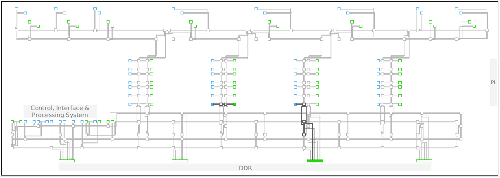

<table class="sphinxhide" width="100%">
 <tr width="100%">
    <td align="center"><h1>Versal™ NoC/DDRMC Design Flow Tutorials</h1>
    <a href="https://www.xilinx.com/products/design-tools/vivado.html">See Vivado™ Development Environment on xilinx.com</a>
    </td>
 </tr>
</table>

# Basic NoC Design: Description of the Design

***Version: Vivado 2021.1***


## Description of the Design
This module uses one traffic generator to write and read isochronous traffic from DDR4 memory,
a second traffic generator to write and read data to/from a block RAM, and two traffic
generators to create AXI4-Stream connections across the device.
The design process consists of three phases:
1. Build a design around a memory mapped AXI NoC that includes both a block RAM and an
integrated DDR4 memory controller.
2. Add to that base design two AXI4-Stream paths.
3. Use the NoC Viewer to assign physical locations to the NMU and NSU NoC endpoints.
IP integrator Block Automation is used to build the memory mapped portion of the design
around one instance of the AXI NoC IP. Then AXI4-Stream connections are added incrementally
by instantiating the AXIS NoC.

After the initial validation of the design, the NoC Viewer is used to assign physical locations
to the AXI4-Stream endpoints, re-validate the design, and simulate using the AMD Vivado&trade; Simulator.

***Note***: This lab is provided as an example only. Figures and information depicted here might vary from the current version.

## Create the Design
### Project Creation and AXI Memory Mapped Design
1. Follow the steps given in Module_01 to open the 2021.1 release of Vivado.
2. Create a new project using part **xcvc1902-vsva2197-1LP-e-S**.
3. Create an empty block design.
4. Create one instance of the AXI NoC IP on the block design canvas.
5. Select **Run Block Automation** in the green Designer Assistance available banner at the top of
the canvas. Select the options shown in the following table:

Table: Block Automation Options
|Selection    | Value   |
| ----------- |:-------:|
|AXI Traffic Generator (AXI-MM Source)   |  2
|External Source AXI-MM    |None
|AXI Performance Monitor   |Select |
|AXI BRAM Controller        |1
|Memory Controllers (DDR4)  |1
|NoC Clk Source Default      |value

6. Click **OK**.
7. In the green Designer Assistance banner click **Run Connection Automation**.
8. Select the entire tree, **All Automation**, to complete the clock and reset net routing, and click
**OK**.
9. The Run Connection Automation link becomes active again to connect the reset and clock ports
of the Clocking Wizard IP. Click the link, select **All Automation** and finally click **OK**.
10. Click the **Regenerate Layout** button at the top of the canvas.
The canvas should look as follows:


## Configuring NoC Connectivity and QoS
1. Double click on the **axi_noc_0** instance. This displays the configuration screen. Change the
default configuration parameters as follows:
* General tab:
   + Number of Memory Controller Ports = **1**
* Connectivity tab:
    + Connect **S00_AXI** to **MC_0**
    + Connect **S01_AXI** to **M00_AXI**
* QoS tab:
   + S00_AXI Read and Write Traffic Class to **ISOCHRONOUS**
   + Bandwidth Read and Bandwidth Write to **5000 MB/s**
   + S01_AXI Read Traffic Class to **LOW_LATENCY**, 
   + Write Traffic Class to **BEST_EFFORT**,
   + Bandwidth Read and Bandwidth Write to **600 MB/s**
2. Click **OK** to dismiss the Configuration dialog box.
3. Configure the traffic generators. Double click the **noc_tg** instance to configure the traffic to
the DDR4. 
* On the Non-synthesizable TG Options tab, set the following values:
    + Data Integrity Check: **ON**
    + Write Data Pattern Types: **RANDOM DATA**
    + AXI Write Length: **16**
    + AXI Write Size (Bytes): **64**
    + AXI Write Bandwidth (MBp/s): **5000**
    + Number of Write Transactions: **50**
4. Click **OK** to dismiss the Configuration dialog box.
This generates the required rate of traffic to and from the integrated memory controller.
5. Double click the **noc_tg_1** instance to configure the traffic to the block RAM.
* On the Configuration tab set the AXI Data Width to **64**.
* On the Non-synthesizable TG Options tab, set the following values:
    + Data Integrity Check: **ON**
    + Write Data Pattern Types: **RANDOM DATA**
    + AXI Write Length: **8**
    + AXI Write Size (Bytes): **8**
    + AXI Write Bandwidth (MBp/s): **600**
    + Number of Write Transactions: **90**
8. Click **OK** to dismiss the Configuration dialog box.
9. Automatically assign addresses by opening the Address Editor and clicking the **Assign All**
button at the top of the canvas.

The memory mapped AXI interface portion of the design is now complete. You can click **Validate
Design** to validate the integrity of the design and view the initial NoC Compiler solution.

The NoC view should display as follows:

Along with the NoC Viewer, a new tab is added to the message (bottom) pane of the cockpit to
show the QoS requirements for each of the paths through the NoC. This is shown in the
following figure:


The Tcl commands to create the memory mapped portion of the design are as follows:
``` tcl
create_project project_1 -part xcvc1902-vsva2197-1LP-e-S-es1
create_bd_design "design_1"
update_compile_order -fileset sources_1
apply_bd_automation -rule xilinx.com:bd_rule:axi_noc -config { mc_type {DDR} noc_clk {New/Reuse Simulation Clock And Reset Generator} num_axi_bram {1} num_axi_tg {2} num_aximm_ext {None} num_mc {1} pl2noc_apm {1} pl2noc_cips {0}}  [get_bd_cells axi_noc_0]
apply_bd_automation -rule xilinx.com:bd_rule:board -config { Manual_Source {Auto}}  [get_bd_intf_pins axi_noc_0/CH0_DDR4_0]
apply_bd_automation -rule xilinx.com:bd_rule:clkrst -config { Clk {/noc_clk_gen/axi_clk_0 (300 MHz)} Freq {100} Ref_Clk0 {} Ref_Clk1 {} Ref_Clk2 {}}  [get_bd_pins noc_bc/s_axi_aclk]
apply_bd_automation -rule xilinx.com:bd_rule:clkrst -config { Clk {New Clocking Wizard} Freq {100} Ref_Clk0 {} Ref_Clk1 {} Ref_Clk2 {}}  [get_bd_pins noc_clk_gen/axi_clk_in_0]
apply_bd_automation -rule xilinx.com:bd_rule:board -config { Manual_Source {Auto}}  [get_bd_intf_pins noc_clk_gen/SYS_CLK0_IN]
apply_bd_automation -rule xilinx.com:bd_rule:clkrst -config { Clk {/noc_clk_gen/axi_clk_0 (300 MHz)} Freq {100} Ref_Clk0 {} Ref_Clk1 {} Ref_Clk2 {}}  [get_bd_pins noc_sim_trig/pclk]
apply_bd_automation -rule xilinx.com:bd_rule:clkrst -config { Clk {/noc_clk_gen/axi_clk_0 (300 MHz)} Freq {100} Ref_Clk0 {} Ref_Clk1 {} Ref_Clk2 {}}  [get_bd_pins noc_tg/clk]
apply_bd_automation -rule xilinx.com:bd_rule:clkrst -config { Clk {/noc_clk_gen/axi_clk_0 (300 MHz)} Freq {100} Ref_Clk0 {} Ref_Clk1 {} Ref_Clk2 {}}  [get_bd_pins noc_tg_1/clk]
apply_bd_automation -rule xilinx.com:bd_rule:clkrst -config { Clk {/noc_clk_gen/axi_clk_0 (300 MHz)} Freq {100} Ref_Clk0 {} Ref_Clk1 {} Ref_Clk2 {}}  [get_bd_pins noc_tg_pmon/axi_aclk]
apply_bd_automation -rule xilinx.com:bd_rule:clkrst -config { Clk {/noc_clk_gen/axi_clk_0 (300 MHz)} Freq {100} Ref_Clk0 {} Ref_Clk1 {} Ref_Clk2 {}}  [get_bd_pins noc_tg_pmon_1/axi_aclk]
apply_bd_automation -rule xilinx.com:bd_rule:board -config { Clk {New External Port} Manual_Source {Auto}}  [get_bd_pins clk_wiz/clk_in1]
apply_bd_automation -rule xilinx.com:bd_rule:board -config { Manual_Source {New External Port (ACTIVE_HIGH)}}  [get_bd_pins clk_wiz/reset]
apply_bd_automation -rule xilinx.com:bd_rule:board -config { Manual_Source {Auto}}  [get_bd_pins rst_clk_wiz_100M/ext_reset_in]
regenerate_bd_layout
set_property -dict [list CONFIG.NUM_MCP {1}] [get_bd_cells axi_noc_0]
set_property -dict [list CONFIG.CONNECTIONS {MC_0 { read_bw {5000} write_bw {5000} read_avg_burst {100} write_avg_burst {100}} } CONFIG.R_TRAFFIC_CLASS {ISOCHRONOUS} CONFIG.W_TRAFFIC_CLASS {ISOCHRONOUS}] [get_bd_intf_pins /axi_noc_0/S00_AXI]
set_property -dict [list CONFIG.CONNECTIONS {M00_AXI { read_bw {600} write_bw {600} read_avg_burst {100} write_avg_burst {100}} } CONFIG.R_TRAFFIC_CLASS {LOW_LATENCY}] [get_bd_intf_pins /axi_noc_0/S01_AXI]
set_property -dict [list CONFIG.USER_C_AXI_WRITE_LEN {16} CONFIG.USER_C_AXI_WRITE_BANDWIDTH {5000} CONFIG.USER_C_AXI_NO_OF_WR_TRANS {50} CONFIG.USER_C_AXI_DATA_INTEGRITY_CHECK {ON}] [get_bd_cells noc_tg]
set_property -dict [list CONFIG.USER_C_AXI_WDATA_WIDTH {64} CONFIG.USER_C_AXI_RDATA_WIDTH {64} CONFIG.USER_C_AXI_WRITE_LEN {8} CONFIG.USER_C_AXI_WRITE_SIZE {8} CONFIG.USER_C_AXI_READ_SIZE {1} CONFIG.USER_C_AXI_WRITE_BANDWIDTH {600} CONFIG.USER_C_AXI_NO_OF_WR_TRANS {90} CONFIG.USER_C_AXI_DATA_INTEGRITY_CHECK {ON} CONFIG.USER_C_AXI_WDATA_VALUE {0x0000000000000000}] [get_bd_cells noc_tg_1]
assign_bd_address
validate_bd_design
```
## AXI4-Stream Design
In this section, you return to the Diagram canvas to add two AXI4-Stream connections through
the NoC.
1. Add one instance of the AXI4-Stream NoC from the IP catalog (or by right clicking in the
canvas), and selecting paths to the design. First, create one path from a traffic
generator source through an AXIS NoC to a stream sink, then use copy and paste to create a
duplicate path. The final step is to ensure both paths are properly connected.
2. Using the same method, create one instance of the Performance AXI Performance Traffic Generator and
one instance of the AXI4-Stream Data FIFO.
3. Configure the traffic generator to produce a 128-bit (16 byte) wide stream source. Double
click the **perf_axi_tg_0** instance and on the Configuration tab select:
* AXI Protocol: **AXI4 STREAM**
* AXIS Data Width: **128**
4. On the Non-synthesizable TG Options tab, select:
* Stream Data Pattern: **RANDOM DATA**
* AXIS Packet Length: **50**
* AXIS Bandwidth: **4800**
* AXIS No. of Packets: **25**
5. Click **OK** to dismiss the configuration dialog box.
6. The `axis_data_fifo` instance serves as the stream receiver. To configure this, double
click the instance and make the following selection:
* FIFO depth: **8192**
7. Click **OK** to dismiss the configuration dialog box.
8. Reconfigure the `noc_sim_trig` IP to accept four triggers by double clicking on the IP and
setting the parameter, Select the **Number of AXI TG to Trigger** to **4**. Click **OK**.
9. On the Diagram canvas, make the following connections:
* `perf_axi_tg_0` pin `M_AXIS` to `axis_noc_0` pin `S00_AXIS`
* `perf_axi_tg_0` pin `axi_tg_done` to `noc_sim_trig` pin `all_done_02`
* `perf_axi_tg_0` pin `trigger_in` to `noc_sim_trig` pin `trig_02`
* `perf_axi_tg_0` pin `axi_tg_start` to `noc_const` pin `dout`
* `axis_noc_0` pin `M00_AXIS` to `axis_data_fifo_0` pin `S_AXIS`
10. Configure the AXIS NoC:
* Double-click the **axis_noc_0** instance.
* Ensure that the Connectivity tab has the source to the destination connected.
* Set the QoS to **4800 MB/s**.
* Click **OK** to dismiss the configuration dialog box.
* Click **Run Connection Automation** on the green banner at the top.
* Click **OK** in the Run Connection Automation dialog box with default options selected.
* Connect the `s_axis_aresetn` and `s_axis_aclk` pins of the `axis_data_fifo_0`
instance to the `axi_rst_0_n` and `axi_clk_0` pins respectively of the `noc_clk_gen`
instance.
11. Create a second stream path:
* Select **perf_axi_tg_0**, **axis_noc_0** and **axis_data_fifo_0** using the **Select Area** tool to select
the region around all three IP blocks.
* Use the Copy (Ctrl+C) and Paste (Ctrl+V) commands to create a copy of the Stream path.
* Complete the design by connecting the clocks, resets and `noc_sim_trig` connections.
After regenerating the layout, the canvas should look as follows.


12. Revalidate the design. The NoC window should now look as follows.

The Tcl commands to create the AXI4-Stream portion of the design are as follows:
``` tcl
create_bd_cell -type ip -vlnv xilinx.com:ip:axis_noc:1.0 axis_noc_0
create_bd_cell -type ip -vlnv xilinx.com:ip:perf_axi_tg:1.0 perf_axi_tg_0
create_bd_cell -type ip -vlnv xilinx.com:ip:axis_data_fifo:2.0 axis_data_fifo_0
set_property -dict [list CONFIG.USER_C_AXI_PROTOCOL {AXI4_STREAM} CONFIG.USER_C_AXIS_TDATA_WIDTH {128} CONFIG.USER_C_AXIS_PKT_LEN {50} CONFIG.USER_C_AXIS_NO_OF_PKT {25} CONFIG.USER_C_AXIS_TDATA_VALUE {0x00000000000000000000000000000000} CONFIG.USER_C_AXIS_BANDWIDTH {4800} CONFIG.USER_SYNTH_DEFINED_PATTERN_CSV {/proj/xbuilds/2020.2_qualified_latest/installs/lin64/Vivado/2020.2/data/ip/xilinx/perf_axi_tg_v1_0/utils/default_axis_synth_tg.csv} CONFIG.USER_SYN_ID_WIDTH {6} CONFIG.USER_SYN_USER_WIDTH {16} CONFIG.USER_EN_VIO_STATUS_MONITOR {FALSE} CONFIG.USER_DEST_ID_PORTS {WRITE}] [get_bd_cells perf_axi_tg_0]
set_property -dict [list CONFIG.FIFO_DEPTH {8192}] [get_bd_cells axis_data_fifo_0]
set_property -dict [list CONFIG.USER_NUM_AXI_TG {4}] [get_bd_cells noc_sim_trig]
connect_bd_intf_net [get_bd_intf_pins perf_axi_tg_0/M_AXIS] [get_bd_intf_pins axis_noc_0/S00_AXIS]
connect_bd_net [get_bd_pins perf_axi_tg_0/axi_tg_done] [get_bd_pins noc_sim_trig/all_done_02]
connect_bd_net [get_bd_pins perf_axi_tg_0/trigger_in] [get_bd_pins noc_sim_trig/trig_02]
connect_bd_net [get_bd_pins perf_axi_tg_0/axi_tg_start] [get_bd_pins noc_const/dout]
connect_bd_intf_net [get_bd_intf_pins axis_noc_0/M00_AXIS] [get_bd_intf_pins axis_data_fifo_0/S_AXIS]
set_property -dict [list CONFIG.CONNECTIONS {M00_AXIS { write_bw {4800}} }] [get_bd_intf_pins /axis_noc_0/S00_AXIS]
apply_bd_automation -rule xilinx.com:bd_rule:clkrst -config { Clk {/noc_clk_gen/axi_clk_0 (300 MHz)} Freq {100} Ref_Clk0 {} Ref_Clk1 {} Ref_Clk2 {}}  [get_bd_pins perf_axi_tg_0/clk]
connect_bd_net [get_bd_pins axis_data_fifo_0/s_axis_aresetn] [get_bd_pins noc_clk_gen/axi_rst_0_n]
connect_bd_net [get_bd_pins axis_data_fifo_0/s_axis_aclk] [get_bd_pins noc_clk_gen/axi_clk_0]
copy_bd_objs /  [get_bd_cells {axis_noc_0 perf_axi_tg_0 axis_data_fifo_0}]
connect_bd_intf_net [get_bd_intf_pins perf_axi_tg_1/M_AXIS] [get_bd_intf_pins axis_noc_1/S00_AXIS]
connect_bd_net [get_bd_pins perf_axi_tg_1/axi_tg_done] [get_bd_pins noc_sim_trig/all_done_03]
connect_bd_net [get_bd_pins perf_axi_tg_1/trigger_in] [get_bd_pins noc_sim_trig/trig_03]
connect_bd_net [get_bd_pins perf_axi_tg_1/axi_tg_start] [get_bd_pins noc_const/dout]
connect_bd_intf_net [get_bd_intf_pins axis_noc_1/M00_AXIS] [get_bd_intf_pins axis_data_fifo_1/S_AXIS]
connect_bd_net [get_bd_pins axis_data_fifo_1/s_axis_aresetn] [get_bd_pins noc_clk_gen/axi_rst_0_n]
connect_bd_net [get_bd_pins noc_clk_gen/axi_clk_0] [get_bd_pins axis_data_fifo_1/s_axis_aclk]
apply_bd_automation -rule xilinx.com:bd_rule:clkrst -config { Clk {/noc_clk_gen/axi_clk_0 (300 MHz)} Freq {100} Ref_Clk0 {} Ref_Clk1 {} Ref_Clk2 {}}  [get_bd_pins perf_axi_tg_1/clk]
regenerate_bd_layout
validate_bd_design
```


## Assigning Locations to NoC Endpoints
The NoC Viewer can be used to add location constraints to the NoC end points. To constrain an
NMU or NSU:
1. Select the cell to move by clicking on the cell in the NoC Objects view. This displays the NoC Properties window, as shown in the following figure.


2. Mouse over the target site and note the site name.
For this lab, move the NMU connected to the MC to the NMU site in the bottom of
the left most VNOC of the bottom SLR (`SLR_0_VNOC_0_NMU_0`).
3. Click on the ellipsis box next to the NoC Site Constraint. This displays the Choose NoC Sites
window.
4. Click on the new site and make the selection, as shown in the following figure.


***Note***: Clicking multiple sites allow the NoC compiler to make an optimal choice from among those
selected.

5. Click **OK** to dismiss the Choose Sites dialog box.


6. Constrain the NoC endpoints as follows:
* `axi_noc_0/inst/S00_AXI_nmu` to `NOC_NMU512_X0Y0`
* `axi_noc_0/inst/S01_AXI_nmu` to `NOC_NMU512_X3Y6`
* `axi_noc_0/inst/M00_AXI_nsu` to `NOC_NSU512_X0Y1`
* `axis_noc_0/inst/S00_AXIS_nmu` to `NOC_NMU512_X0Y2`
* `axis_noc_0/inst/M00_AXIS_nsu` to `NOC_NSU512_X3Y6`
* `axis_noc_1/inst/S00_AXIS_nmu` to `NOC_NMU512_X3Y5`
* `axis_noc_1/inst/M00_AXIS_nsu` to `NOC_NSU512_X0Y0`

Re-running Validate produces the following NoC layout.


The Tcl commands to assign the above NoC sites are as follows:

``` tcl

set_property -dict [list CONFIG.PHYSICAL_LOC {NOC_NMU512_X0Y0}] [get_bd_intf_pins axi_noc_0/S00_AXI]
set_property -dict [list CONFIG.PHYSICAL_LOC {NOC_NMU512_X3Y6}] [get_bd_intf_pins axi_noc_0/S01_AXI]
set_property -dict [list CONFIG.PHYSICAL_LOC {NOC_NSU512_X0Y1}] [get_bd_intf_pins axi_noc_0/M00_AXI]
set_property -dict [list CONFIG.PHYSICAL_LOC {NOC_NMU512_X0Y2}] [get_bd_intf_pins axis_noc_0/S00_AXIS]
set_property -dict [list CONFIG.PHYSICAL_LOC {NOC_NSU512_X3Y6}] [get_bd_intf_pins axis_noc_0/M00_AXIS]
set_property -dict [list CONFIG.PHYSICAL_LOC {NOC_NMU512_X3Y5}] [get_bd_intf_pins axis_noc_1/S00_AXIS]
set_property -dict [list CONFIG.PHYSICAL_LOC {NOC_NSU512_X0Y0}] [get_bd_intf_pins axis_noc_1/M00_AXIS]
validate_bd_design
```
## Simulate the Design
To prepare for simulation, create a top level design wrapper as described in Lab 1.
Click Simulation → Run Simulation from the Flow Navigator pane. This generates the
simulation netlist and start up the Vivado simulator. With the traffic parameters given above,
the simulation completes after approximately 14 μs.


<hr class="sphinxhide"></hr>

<p class="sphinxhide" align="center"><sub>Copyright © 2020–2024 Advanced Micro Devices, Inc.</sub></p>

<p class="sphinxhide" align="center"><sup><a href="https://www.amd.com/en/corporate/copyright">Terms and Conditions</a></sup></p>
