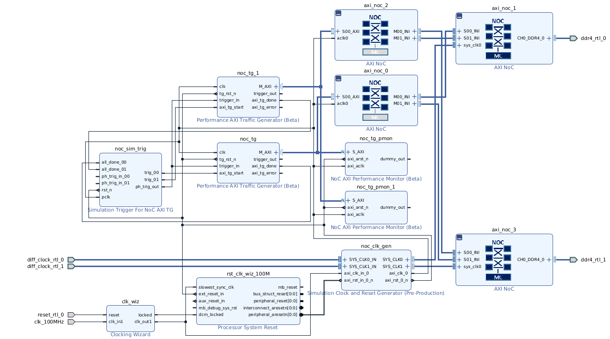
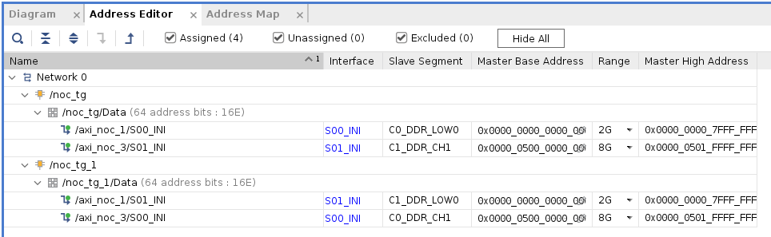

<table class="sphinxhide" width="100%">
 <tr width="100%">
    <td align="center"><h1>Versal™ NoC/DDRMC Design Flow Tutorials</h1>
    <a href="https://www.xilinx.com/products/design-tools/vivado.html">See Vivado™ Development Environment on xilinx.com</a>
    </td>
 </tr>
</table>

# Basic NoC Design: Inter-NoC Interface-Connecting Multiple NoC Instances

***Version: Vivado 2021.1***


## Description of the Design
This design uses the Inter-NoC Interface (INI) to connect two AXI4 traffic generators to two
independent, integrated DDR4 memory controllers (DDRMCs). Each traffic generator is
connected to a single AXI NoC. Each of those AXI NoCs uses two INI output ports to fan out to
two AXI NoCs. Those two AXI NoCs each contain two INI input ports and one integrated
DDRMC. The result is a full crossbar between the two traffic generatrors and two DDRMCs. The
Quality of Service (QoS) requirements are set on the memory controller side of the crossbar.
The traffic generators will be configured to form a double buffer structure with one acting as the
data producer and the other as the consumer. The traffic patterns will be controlled with a userdefined
traffic file provided with this tutorial.

Note: This lab is provided as an example only. Figures and information depicted here might vary from the
current version.

## Create the Design
Follow the steps given in Module_01 to open the 2020.2 release of Vivado®, create a new project with
the **xcvc1902-vsva2197-1LP-e-S** part, and create an empty block design.
Follow the steps below to construct the IP integrator design:
1. Copy the file `lesson04.csv` to the working directory. This file defines the simulated data
traffic pattern used by the traffic generators.
2. On the IP integrator canvas, instantiate four instances of the AXI NoC IP. Configure each as
follows:

Table: AXI NoC Configurations

|Instance| Number of AXI Slave Interfaces| Number of AXI Master Interfaces |Number of Inter-Noc Slave Interfaces|Number of Inter-Noc Master Interfaces|Memory Controller|Connectivity |
|--------|:------------------------------:|:------------------------------:|:----------------------------------:|:-----------------------------------:|:---------------:|:-----------:|
|axi_noc_0|   1                           |   0                            | 0 | 2 | None | S00_AXI => M00_INI, M01_INI|
| axi_noc_1 | 0 | 0 | 2 | 0 | Single (with 2 Number of Memory Controller Ports) | S00_INI => MC Port 0, S01_INI => MC Port 1 |
| axi_noc_2 | 1 | 0 | 0 | 2 | None  | S00_AXI => M00_INI , M01_INI|
| axi_noc_3 | 0 | 0 | 2 | 0 | Single Memory Controller (with 2 Number of Memory Controller Ports) | S00_INI => MC Port 0, S01_INI => MC Port 1|

``` tcl

set_property -dict [list CONFIG.NUM_MI {0} CONFIG.NUM_NMI {2}] [get_bd_cells axi_noc_0]
set_property -dict [list CONFIG.CONNECTIONS {M01_INI { read_bw {1720} write_bw {1720}} M00_AXI { read_bw {1720} write_bw {1720}} M00_INI { read_bw {1720} write_bw {1720}} }] [get_bd_intf_pins /axi_noc_0/S00_AXI]
set_property -dict [list CONFIG.ASSOCIATED_BUSIF {S00_AXI}] [get_bd_pins /axi_noc_0/aclk0]
set_property -dict [list CONFIG.NUM_SI {0} CONFIG.NUM_MI {0} CONFIG.NUM_NSI {2} CONFIG.NUM_CLKS {0} CONFIG.NUM_MC {1} CONFIG.NUM_MCP {2} CONFIG.LOGO_FILE {data/noc_mc.png}] [get_bd_cells axi_noc_1]
set_property -dict [list CONFIG.CONNECTIONS {MC_0 { read_bw {1720} write_bw {1720} read_avg_burst {4} write_avg_burst {4}} }] [get_bd_intf_pins /axi_noc_1/S00_INI]
set_property -dict [list CONFIG.CONNECTIONS {MC_1 { read_bw {1720} write_bw {1720} read_avg_burst {4} write_avg_burst {4}} }] [get_bd_intf_pins /axi_noc_1/S01_INI]
set_property -dict [list CONFIG.NUM_MI {0} CONFIG.NUM_NMI {2}] [get_bd_cells axi_noc_2]
set_property -dict [list CONFIG.CONNECTIONS {M01_INI { read_bw {1720} write_bw {1720}} M00_AXI { read_bw {1720} write_bw {1720}} M00_INI { read_bw {1720} write_bw {1720}} }] [get_bd_intf_pins /axi_noc_2/S00_AXI]
set_property -dict [list CONFIG.ASSOCIATED_BUSIF {S00_AXI}] [get_bd_pins /axi_noc_2/aclk0]
set_property -dict [list CONFIG.NUM_SI {0} CONFIG.NUM_MI {0} CONFIG.NUM_NSI {2} CONFIG.NUM_CLKS {0} CONFIG.NUM_MC {1} CONFIG.NUM_MCP {2} CONFIG.LOGO_FILE {data/noc_mc.png}] [get_bd_cells axi_noc_3]
set_property -dict [list CONFIG.CONNECTIONS {MC_0 { read_bw {1720} write_bw {1720} read_avg_burst {4} write_avg_burst {4}} }] [get_bd_intf_pins /axi_noc_3/S00_INI]
set_property -dict [list CONFIG.CONNECTIONS {MC_1 { read_bw {1720} write_bw {1720} read_avg_burst {4} write_avg_burst {4}} }] [get_bd_intf_pins /axi_noc_3/S01_INI]
```
3. Make the following connections:
* `axi_noc_0 M00_INI` to `axi_noc_1 S00_INI`
* `axi_noc_0 M01_INI` to `axi_noc_3 S01_INI`
* `axi_noc_2 M00_INI` to `axi_noc_3 S00_INI`
* `axi_noc_2 M01_INI` to `axi_noc_1 S01_INI`

After regenerating the layout, the canvas should look as follows.


4. Click **Run Block Automation** (on the green banner at the top of the canvas).

5. Click on **axi_noc_0/1/2/3** and uncheck Control, Interface and Processing System under Sourcres. 
  
    Click on **axi_noc_1**  and **axi_noc_3**

    a. Set Memory Controller Type to **DDR** under Destinations.

  
    Click on **axi_noc_0** and **axi_noc_2**
      
      a. Set AXI Traffic Generator to 1 under Sources. 
      
      b. Set Memory Controller Type to **None** under Destinations.
      
      c. enable AXI Performance Monitor for `PL-2-NOC AXI-MM` pins under Simulation. 


6. Click **All Automation** on Run Block Automation. Followed by **Run Connection Automation**.
7. Click **OK**. The Run Connection Automation link becomes active. Connect the clock and
reset pins of the Clocking Wizard. Click the link, select **All Automation** and click **OK**.
8. Configure the `noc_tg` to use the user defined traffic pattern defined by the `lesson04.csv`
file previously copied to the working directory. This can be done by double-clicking the
**noc_tg** instance to bring up the configuration dialog box and then under the Non-synthesizable TG Options tab, setting the parameter AXI Test/Pattern Types to **user defined**.
pattern by clicking the pull-down menu.
9. Use the file browser to select the **Path to User Defined Pattern File (CSV)** option to set the
path to the CSV file.
10. Click **OK** to dismiss the configuration dialog box. 

11. Click **OK** to dismiss the dialog box.

12. Regenerate the layout. The canvas should now look as follows.


13. Double click on **axi_noc_3** to bring up the configuration screen.
14. On the General tab, set DDR Address Region 0, to **DDR CH1**.
15. Click **OK** to dismiss the dialog box.
16. Open the Address Editor and click **Assign All**. Each traffic
generator sees the same memory at the same address, as shown in the following figure.

The TCL commands to set the addresses are:
```  tcl
set_property offset 0x0000000000000000 [get_bd_addr_segs {noc_tg_1/Data/
SEG_axi_noc_1_C1_DDR_LOW0}]
set_property offset 0x0000050000000000 [get_bd_addr_segs {noc_tg_1/Data/
SEG_axi_noc_3_C0_DDR_CH1}]
```
17. On the Diagram canvas, select the two AXI traffic generator output nets, M_AXI, and right
click to display the context menu.
18. Select **Mark Simulation**. This will mark the two AXI nets to appear as transactions in the
simulation waveform viewer.
19. Click **Run Validate Design** (**F6**) to validate.
20. Run generate_target all command

``` tcl
generate_target all [get_files  ${myPath}/module_04/module_04.srcs/sources_1/bd/design_1/design_1.bd]
```


## Simulate the Design
To prepare for simulation, create a top level design wrapper following the procedure from Module_01.
Click **SIMULATION** → **Run Simulation** → **Run Behavioral Simulation** from the Flow Navigator
pane. This will generate the simulation netlist and start up the Vivado simulator. With the traffic
parameters given above, the simulation will complete after approximately 46 μs. The resulting
waveform window showing the traffic generator AXI interfaces should appear as follows:


<hr class="sphinxhide"></hr>

<p class="sphinxhide" align="center"><sub>Copyright © 2020–2024 Advanced Micro Devices, Inc.</sub></p>

<p class="sphinxhide" align="center"><sup><a href="https://www.amd.com/en/corporate/copyright">Terms and Conditions</a></sup></p>
