<table>
 <tr>
   <td align="center"><h1>2020.2 Versal™ Synthesis and Implementing the Design</h1>
   </td>
 </tr>
 <tr>
 <td align="center"><h1></h1>
 </td>
 </tr>
</table>

# Synthesis and Implementing the Design
This tutorial design demonstrates using IP integrator to add an AXI-NoC IP with access to an
integrated DDRMC. You will then add and configure the AXI Traffic Generator (TG) to generate traffic
to the DDRMC via the NoC.
Post synthesis you will use the Nibble Planner in the IO Ports window to assign the appropriate
DDR Memory Bank. You will then implement the design.
Behavioral simulation can also be run on the design. To do this, you need to force inputs on the
external clock and reset pins of the design to ensure the proper initialization and functioning of
the TG and the design.
The basic flow of the tutorial is as follows:
1. Start Vivado®.
2. Create a new project.
3. Open a new block design.
4. Add an AXI_NoC IP to the block design.
5. Enable one Memory Controller with one port, and specify its connectivity and Quality of
Servive (QoS) parameters.
6. Add an AXI Traffic Generator and connect it as a master AXI connection to the NoC.
7. Validate the design.
8. Synthesize the design.
9. Assign a DDR Memory Bank using the Nibble Planner.
10. Implement the design.
11. Simulate the design.

**Note**: Synthesis and Implementing Design/`run.tcl` contains the Tcl script that will setup the project per the basic flow outlined
above - all the way from creating the IP integrator design to implementing the design in Vivado.
# Description of the Design
This design uses one AXI4 TG to write and read data to/from DDR4 memory
connected to the NoC through an integrated DDR4 Memory Controller (MC) block. The TG will read and write from a single DDR memory through the `axi_noc` instance. The TG is used to simulate the data flow of a real application.

**Note**: This design is provided as an example only. Figures and information depicted here might vary from the
current version.

# Create a Project
## Start Vivado
1. Open the Vivado® GUI. Make sure the banner at the top of the window identifies the Vivado
2020.2 release.
2. From the Quick Start buttons, click **Create Project**.
3. Step through the pop-up menus to the **Default Part** menu.
4. On the Default Part pop-up menu, search for and select part **xcvc1902-vsva2197-1LP-e-S**.
5. Step through to the Finish stage to create the new project and open **Vivado**.
The Tcl command to create the project is as follows:

`create_project lab6 ./lab6 -part xcvc1902-vsva2197-1LP-e-S`

6. In the Vivado Flow Navigator, click IP Integrator → Create Block Design. A popup dialog
displays to create the block design
7. Click OK. An empty block design diagram canvas opens.
The Tcl commands to create the project and initial block design are as follows:
``` tcl
create_project project_1 ./project_1 -part xcvc1902-vsva2197-1LP-e-S-es1
create_bd_design "design_1"
```
# NoC IP Configuration
The NoC IPs act as logical representations of the Versal™ network on chip. The `axi_noc`
supports the AXI memory mapped protocol. Each instance specifies a set of connections to be
mapped onto the physical NoC, along with the QoS requirements for each connection. A given
HDL design may have any number of instances of the NoC IP. Vivado® automatically aggregates
the connectivity and QoS information from all of the logical NoC instances to form a unified
traffic specification for the NoC compiler.

The integrated Memory Controllers (MCs) are integrated into the `axi_noc` core. An instance of
the `axi_noc` IP can be configured to include one, two, or four instances of the integrated MC. If
two or four instances of the MC are selected, they are configured to form a single interleaved
memory. In this case, the memory controllers are configured identically and mapped to the same
address. Interleaving is controlled by the NoC.
1. Add an instance of the Versal™ AXI NoC IP by right-clicking anywhere on the block design
canvas and selecting **Add IP** from the context menu.
2. Open the AXI NoC IP customization GUI by double-clicking it. The General tab shows the set
of NoC interfaces to configure. Configure the number of master and slave interfaces as
follows:
* Set the Number of AXI Slave Interfaces to **1**.
* Set the Number of AXI Master Interfaces to **0**.
* Set the Number of AXI Clocks to **1**.
* Set the Memory Controllers to **Single Memory Controller**.
* Set the Number of Memory Controller Ports to **1**.
3. Open the Connectivity tab. This menu presents a patch panel style connection matrix to
show which NoC ingress interfaces (for example `S00_AXI`) will be routed to which egress
interfaces (for example `MC_0`). Check the checkbox under the MC Port 0 column.
4. Open the QoS tab. This menu allows you to select the Quality of Service (QoS) settings for
each NoC connection. The first line shows the QoS settings for the ingress port (`S00_AXI`).
**Note**: The default read and write traffic classes are BEST_EFFORT.
5. Open the tree by clicking on the button on the far left of the ingress port. This shows the set
of QoS properties for each output connection from the selected ingress port.
6. Open the DDR Basic tab and select the checkbox for **Enable Internal Responder**.
7. Click **OK** in the bottom right corner to close the NoC menu.

# Add and Configure the Traffic Generator
Add one instance of AXI Traffic Generator IP. Double-click it and configure as follows (see the
following figures for reference):
* Set Profile Selection to **High Level Traffic**.
* Set Traffic Profile to **Data**.
* Set Address Width to **64**.
* Set AXI Master Width to **128**.
* Click **OK** to dismiss the dialog box.

AXI Traffic Generator (Profile Selection)
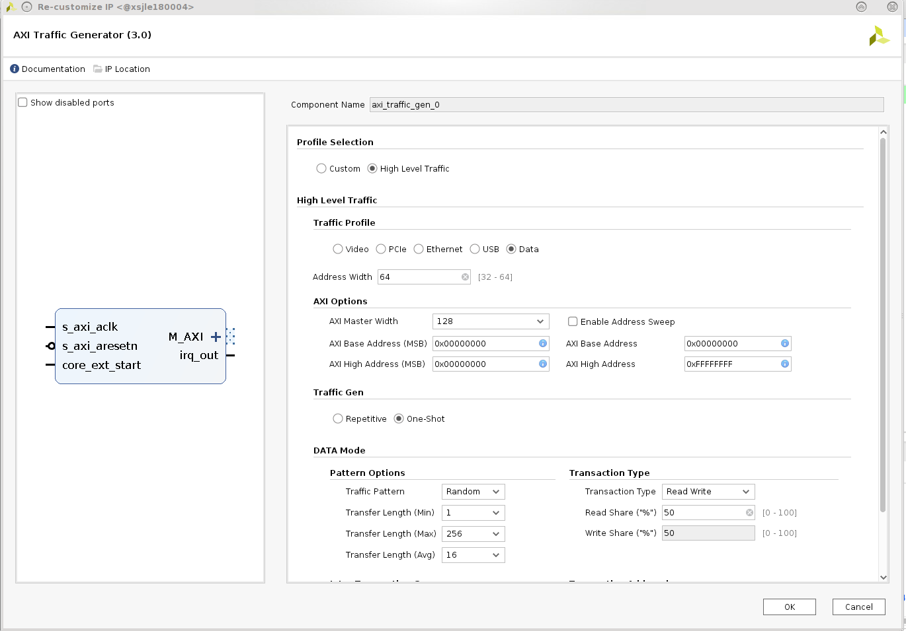
1. Right-click on the block design and add one instance of Constant IP.
2. Connect the `core_ext_start` pin of the `axi_traffic_gen_0` instance to the `dout`
output of the Constant IP.
3. Right-click the block design and add one instance of each of the following IPs:
* clocking wizard: **clk_wizard_0**
* Simulation Clock and Reset Generator: **clk_gen_sim_0**
* Processor System Reset: **proc_sys_reset_0**
* Control, Interfaces & Processing System: **versal_cips_0**
4. Double click Simulation Clock and Reset Generator and configure as follows:
* Number of System Clocks: **2**
* Frequency of first system clock: **400 MHz**
* Frequency of second system clock: **200 MHz**
* Number of AXI Clocks: **0**
5. Click **OK**.

See the following figure for reference.
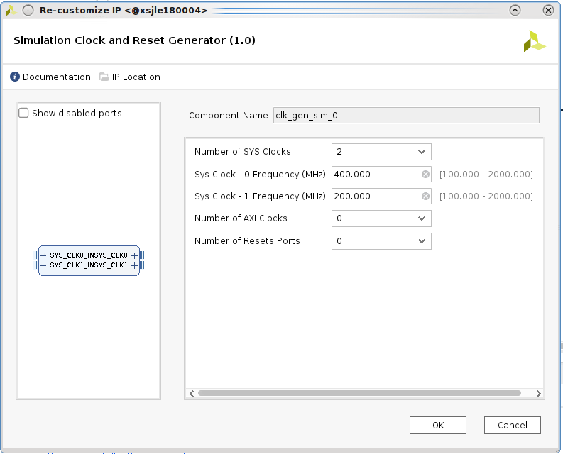

6. Double click **Clocking Wizard** under Input Clock information in Clocking Features tab.
7. Change the Input Frequency for the Primary Clock to Manual and set it to **200 MHz**.
8. Change the Source of the Primary Clock to Differential Capable Pin.

See the following figure for reference.
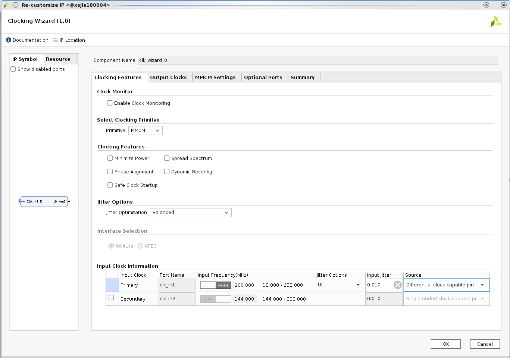

9. Click the **Optional Ports** tab.
10. Select the **Locked** check box in the Enable Port column.
11. Click **OK**.

See the following figure for reference.
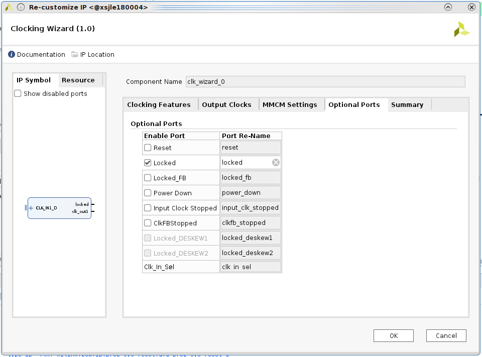

12. Double click **Control, Interfaces & Processing System**.
13. Expand **PS-PMC**.
14. Select **PL-PS Interfaces**.
15. On the right-side window in PL resets set the number of PL resets to **1**.

See the following figure for reference.
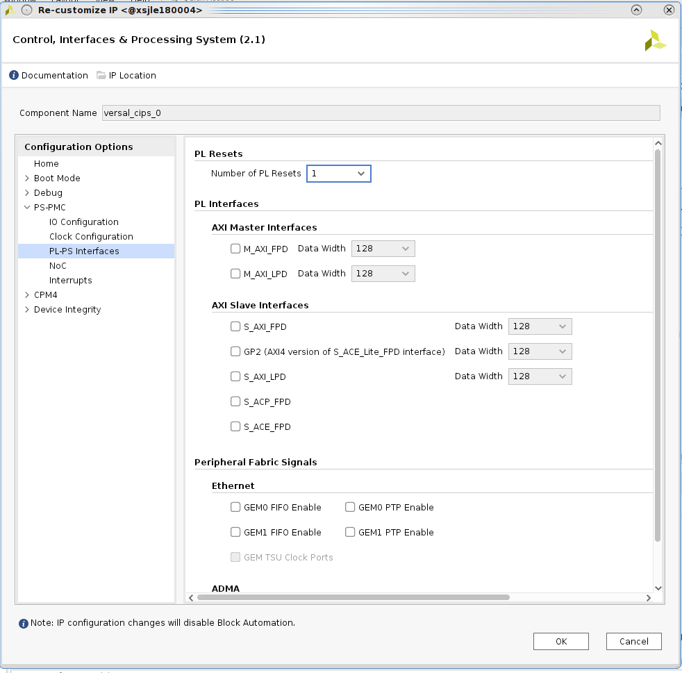

16. Make following connections:
* Connect locked pin of `clk_wizard_0` to `dcm_locked` pin of `proc_sys_reset_0`
* Connect `clk_out1` pin of `clk_wizard_0` to `aclk0` pin of `axi_noc_0`
* Connect `slowest_sync_clk` pin of `proc_sys_reset_0` to `clk_out1` pin of
`clk_wizard_0`
* Connect `pl0_resetn` pin of `versal_cips_0` to `ext_reset_in` pin of
`proc_sys_reset_0`
* Connect `peripheral_aresetn` pin of `proc_sys_reset_0` to `s_axi_aresetn` pin
of `axi_traffic_gen_0`
* Connect `SYS_CLK1` pin of `clk_gen_sim_0` to `CLK_IN1_D` pin of `clk_wizard_0`
* Connect `SYS_CLK0` pin of `clk_gen_sim_0` to `sys_clk0` pin of `axi_noc_0`
17. Click **Run Connection Automation** to make the rest of the connections.
18. After completion of all connections click **Regenerate Layout**. 

See the following figure for reference.
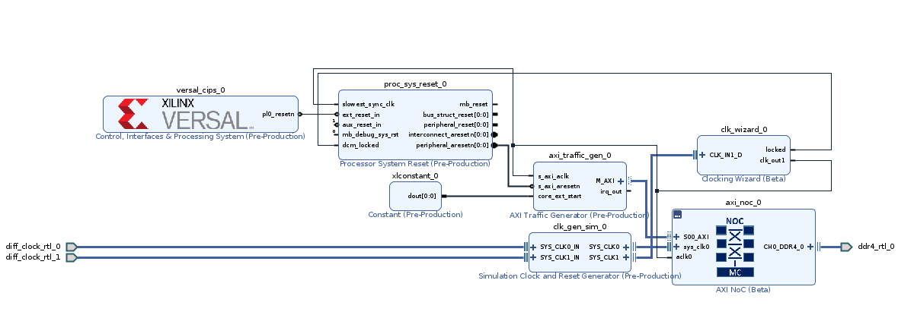

# Address Editor
1. Click the **IPI Address Editor** tab.
2. Click the **Assign All** icon at the top. This will auto assign the base and range addresses
associated with the AXI slaves in the block design.
# Validate the Block Design
Validate the design in the IP integrator by clicking the **Validate Block Design** icon at the top of
the canvas.
# Create the HDL Wrapper and Generate Output Products
1. In the Sources window to the left, right-click on the block design, and select **Create HDL
Wrapper**.
2. Go with the default selection in the Create HDL Wrapper dialog box and click **OK**.
3. Right-click the block design again and select **Generate Output Products**.
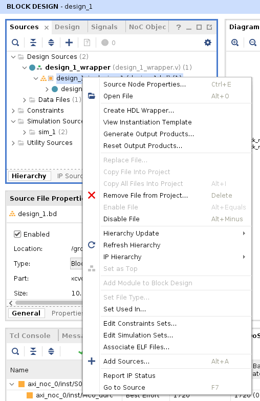
4. The Out-of-Context Per IP synthesis option is selected by default in the Generate Output
Products dialog that follows, click **Generate**. The out-of-context module runs take a few
minutes to complete.

# Set up the Memory Bank using the Nibble Planner
1. Run **Synthesis**.
2. When synthesis finishes, the Synthesis Completed dialog box opens. Select **Open
Synthesized Design** and click **OK**.
3. From the menu, select **Window** → **IO Ports**.
4. On the I/O Ports window, click the Open Advanced I/O Planner link at the top.               
See the following figure for reference.
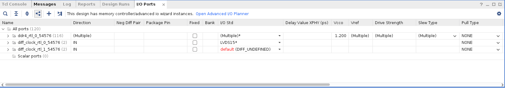
The Advanced I/O Planner window displays.
5. Click the **IO Bank** browse button … as shown in the following figure.
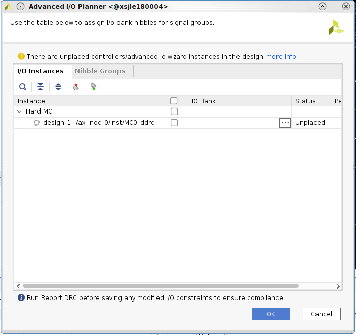
6. Select IO Banks **706**, **707**, **708** to be associated with **DDRMC2** (see the following figure for
reference). This triplet bank will now be associated with the DDRMC in the design.
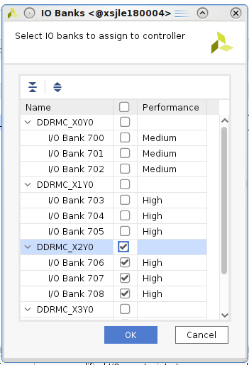
7. Click **OK** to dismiss the IO Banks dialog box.
8. Click **OK** to dismiss the Advanced I/O Planner dialog box.
9. Save the design by clicking the **Save** icon on the toolbar.
10. The Out of Date Design window pops up. Click **OK** to accept the changes.
11. The Save Constraints dialog box opens. **Create a new file** is selected by default. Give a name
to the file by typing **memory_constraints** in the file name field and click **OK**.
12. A Synthesis Out-of-date message shows up in the top right corner. Click the **details** link to
open the Synthesis Out-of-date Due to dialog box, and at the top of the dialog box click
**Force up-to-date**.
13. Implement the design by clicking **Run Implementation** under Implementation in the Flow
Navigator. The Launch Runs dialog box opens.
14. Click **OK**.
15. After implementation completes, the Implementation Completed dialog box opens. Click
**Cancel** to dismiss the dialog box.

# Simulate the HDL Design
Now you can simulate the HDL design and examine the results.
1. To ensure you examine the correct interface:
*  To open the block design, click **IP INTEGRATOR** in the Flow Navigator.
* In the block design canvas, right-click the AXI interface connection between the AXI NoC
IP and the AXI Traffic Generator.
* Click **Mark Simulation**. See the following figure for reference:
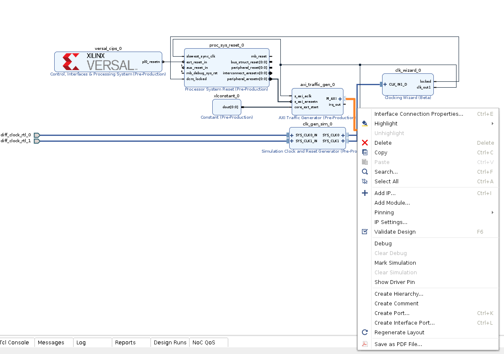

2. Save the block design.
3. To generate the behavioral RTL models and start the simulator, click **Simulation** → **Run
Simulation** and select **Run Behavioral Simulation**.

On the Tcl console:
``` tcl
save_bd_design
generate_target Simulation [get_files /group/siapps/parthj/NOC/PG313/2020.2/lab5/project_1/project_1.srcs/sources_1/bd/design_1/design_1.bd]
export_ip_user_files -of_objects [get_files /group/siapps/parthj/NOC/PG313/2020.2/lab5/project_1/project_1.srcs/sources_1/bd/design_1/design_1.bd] -no_script -sync -force -quiet
export_simulation -of_objects [get_files /group/siapps/parthj/NOC/PG313/2020.2/lab5/project_1/project_1.srcs/sources_1/bd/design_1/design_1.bd] -directory /group/siapps/parthj/NOC/PG313/2020.2/lab5/project_1/project_1.ip_user_files/sim_scripts -ip_user_files_dir /group/siapps/parthj/NOC/PG313/2020.2/lab5/project_1/project_1.ip_user_files -ipstatic_source_dir /group/siapps/parthj/NOC/PG313/2020.2/lab5/project_1/project_1.ip_user_files/ipstatic -lib_map_path [list {modelsim=/group/siapps/parthj/NOC/PG313/2020.2/lab5/project_1/project_1.cache/compile_simlib/modelsim} {questa=/group/siapps/parthj/NOC/PG313/2020.2/lab5/project_1/project_1.cache/compile_simlib/questa} {ies=/group/siapps/parthj/NOC/PG313/2020.2/lab5/project_1/project_1.cache/compile_simlib/ies} {xcelium=/group/siapps/parthj/NOC/PG313/2020.2/lab5/project_1/project_1.cache/compile_simlib/xcelium} {vcs=/group/siapps/parthj/NOC/PG313/2020.2/lab5/project_1/project_1.cache/compile_simlib/vcs} {riviera=/group/siapps/parthj/NOC/PG313/2020.2/lab5/project_1/project_1.cache/compile_simlib/riviera}] -use_ip_compiled_libs -force -quiet
launch_simulation
```
The waveform window will show the traffic from the traffic generator to the NoC in the design.
These are the input ports to the NoC. Note that the waveforms start around 1.1 μs. This is when
the memory controller completes its internal calibration and comes out of reset. Zoom in on the
time region encompassing all of the traffic and expand the waveform, as shown in the following
figure.


© Copyright 2020 Xilinx, Inc.

Licensed under the Apache License, Version 2.0 (the "License");
you may not use this file except in compliance with the License.
You may obtain a copy of the License at

    http://www.apache.org/licenses/LICENSE-2.0

Unless required by applicable law or agreed to in writing, software
distributed under the License is distributed on an "AS IS" BASIS,
WITHOUT WARRANTIES OR CONDITIONS OF ANY KIND, either express or implied.
See the License for the specific language governing permissions and
limitations under the License.

<p align="center"><sup>XD028</sup></p>
