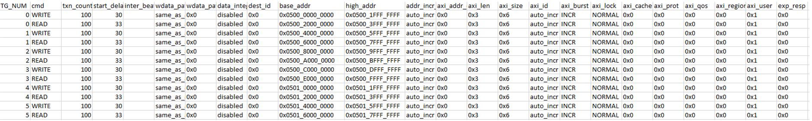
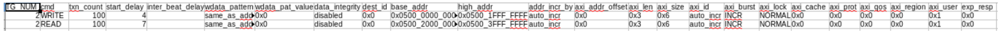
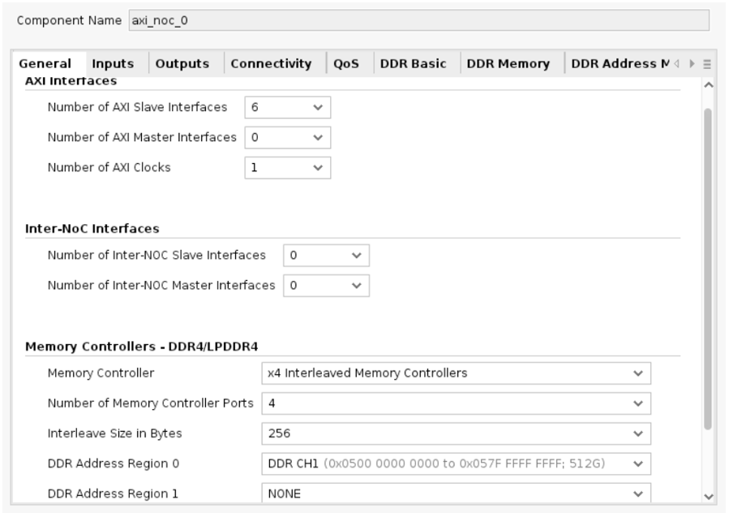
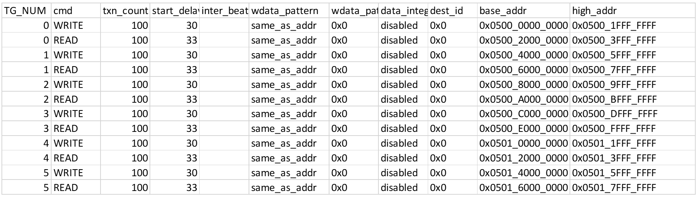
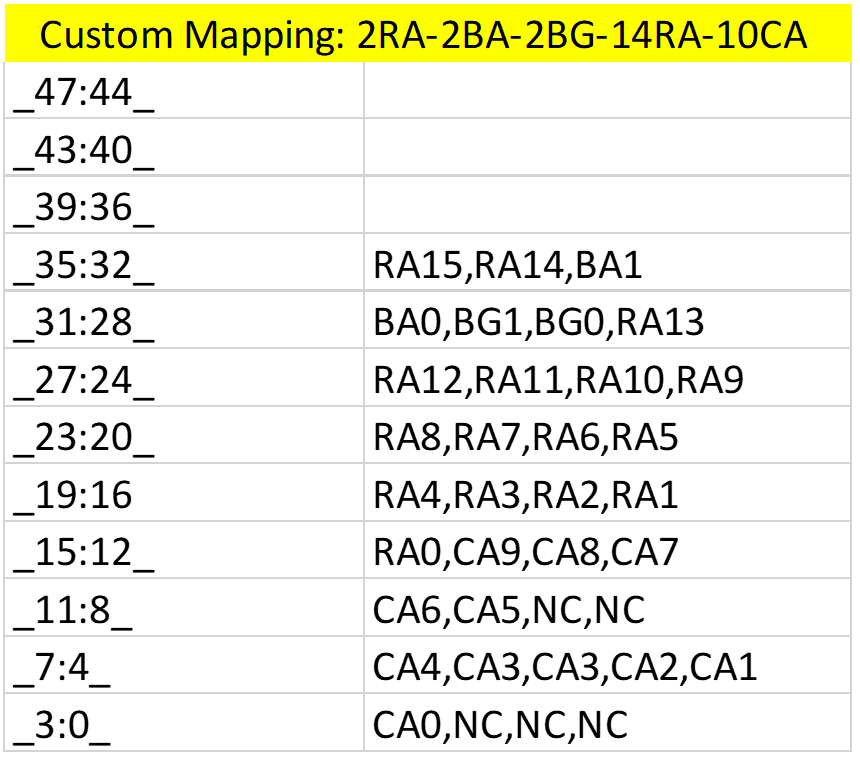

<table>
 <tr>
   <td align="center"><h1>AMD Versal™ Adaptive SoC: Performance Analysis in Simulation Tutorial (XD200)</h1>
   <h2 align="left"><i>Version: 2022.1</i></h2>
   </td>
 </tr>
</table>

# Introduction to Performance Analysis in Simulation

This tutorial covers a design that was generated to experiment with the
default NoC placement with six traffic generators sending linear data to four
interleaved memory controllers. The tutorial will start with outlining
the basic bandwidth spec for the design and then you will use the AMD Vivado™ IP
integrator to build the design and simulate. You will review the
performance and introduce a Command Decode tool to analyze the commands
and different command counters to better understand the design. Based on
the analysis, the original design will be optimized to enhance the
performance. The two primary goals in this tutorial are to:

* Highlight the Command Parser tool and,
* Show the significance of simulating your design and how major performance issues can be found in the
simulation phase.

# Description of the Design

This design uses six Performance AXI Traffic Generator (TG) instances and one AXI NoC instance, with an
integrated DDR4 Memory Controller with four interleaved MCs. All six of the
TGs write and read 256-byte transactions with a linear addressing
pattern, and each TG targets a unique address space. The design
process consists of the following phases:

1. Understand the DDR spec.
2. Define a CSV file to control the Performance AXI TGs.
3. Build and simulate an initial version of the design using Designer
Assistance.
4. Simulate the design and learn how to use the Command Decode tool to
better analyze simulation waveforms.
5. Revise the design with the information gathered from the tool.
6. Rerun and analyze the updated design to see if it meets spec.

# Specification

Six Performance TGs writing data to one AXI NoC configured
with four Interleaved DDR4 Memory controllers (however, only three of the
MC ports are connected to the slave AXI ports). The goal is to
reach 8000 Mb/s Read/Write bandwidth per TG. The transaction spec is 256
byte transactions with a linear addressing pattern.

## Using a CSV File to Control the Traffic Generator

A total of six CSV files are used, each controlling one TG to perform 256
byte write and read transactions. The above screenshot shows the data in
all six CSVs collated together. Each individual CSV will be split per
unique `TG_NUM`. As the CSV shows, each of the TGs targets a unique
address space with linear addressing and the size and length parameters
are set accordingly for 256 byte transaction. The six CSVs are provided in
the files section. Note that the `TG_NUM` value needs to match the number of
TGs in the block design. Following is a screenshot of an
individual CSV.

# Building and Simulating the First Design Iteration

1. As described in previous labs, create a new project with the **xcvc1902-vsva2197-2MP-e-S** part, and create a new block design.
2. Add one AXI NoC instance, and run block automation, with the following
settings:

    * **Control, Interface and Processing System**: Unchecked
    * **AXI Traffic Generator**: 6
    * **External Sources**: None
    * **AXI BRAM Controller**: None
    * **Memory Controller Type**: DDR4
    * **Number of Interleaved Memory Controllers**: 4
    * **AXI Performance Monitor for PL-2-NoC AXI-MM pins**: Checked
    * **AXI Clk Source**: New/Reuse Simulation Clock and Reset Generator

3. Run **Connection Automation** twice, selecting **All Automation** both times.
4. Regenerate the layout.
5. Edit the `axi_noc_0` properties.

## General Tab

* **Number of AXI Slave Interfaces**: 6

* **Number of AXI Master Interfaces**: 0

* **Number of AXI Clocks**: 1

* **DDR Address Region 0**: DDR CH1 This matches the address range selected in the CSV file.

Following is a screenshot of how the **General** settings should look.

## Connectivity Tab

Following is a screenshot of how the **Connectivity** settings should look.

## QOS Tab

Following is a screenshot of how the **QoS** settings should look.

## DDR Basic Tab

* **Controller Type**: DDR4 SDRAM

* **Input System Clock Period (ps)**: 5000 (200 MHz) VCK190 uses a 200 MHz
`sys_clk`.

Following is a screenshot of how the **DDR Basic** settings should look.

## DDR Memory

* **Number of Channels**: Single

Following is a screenshot of how the **DDR Memory** settings should look.

## DDR Address Mapping

Following is a screenshot of the default selection for **DDR Address Mapping**.

6. Edit the NOC_TG properties:

* **Performance TG for Simulation**: SYNTHESIZABLE
* **AXI Data Width**: 512
* **AXI User Width**: 11
* **Enable Traffic Shaping**: Unchecked
* **Enable NoC user Destination ID Ports**: NONE

Following is a screenshot of the NOC_TG selections.

## Synthesizable TG Options

* **Path to User Defined Pattern File (CSV) for Synthesizable TG**: Enter path
* **Insert VIO for debug status signals**: Unchecked

Following is a screenshot of the **Synthesizable TG Options** selection:

Repeat the same for all six TGs.

7. Edit the noc_clk_gen properties:

* **Sys Clock -- 0 Frequency (MHz)**: **201.501**: This corresponds to the Input System Clock Period set in step 5.
* **AXI-0 Clock Frequency (MHz)**: **250**: This is the frequency used when determining the `start_delay` values in the CSV.

8. Edit the noc_sim_trig properties

* **Enable Traffic Shaping**: Uncheck this option.

Complete Block Design

9. Mark `noc_tg_M_AXI` for simulation.
10.	In the **Address Editor**, Assign **All Addresses**.
11.	Validate the design.
12.	Create an HDL Wrapper for the block design.
13.	Generate Output Products.
14.	Set **Simulator Settings** to **Mixed**.
15.	Simulate the Design.

When simulation completes, the waveform should be fully populated. In
the console there should be a report of the bandwidth information. Based
on the report, notice that the bandwidth is much slower than
requested.

# Bandwidth Results

To improve the performance of the design, a better understanding of the
DDR commands issued is required. The DDR signals can be viewed by
probing the nets in the responder model. The following screenshot shows the window to add the DDR signals into the waveform.

After adding the signals, you can run simulation again and all the DDR
signals should be populated in the waveform. When simulation completes,
the waveform window will look as follows:

\_\_\_\_\_\_\_\_\_\_\_\_\_\_\_\_\_\_\_\_\_\_\_\_\_\_\_\_\_\_\_\_\_\_\_\_\_\_\_\_\_\_\_\_\_\_\_\_\_\_\_\_\_\_\_\_\_\_\_\_\_\_\_\_\_\_\_\_\_\_\_\_\_\_\_\_\_\_\_\_\_\_\_\_\_\_\_\_\_\_\_\_\_\_\_\_\_\_\_\_\_\_\_\_

A manual method of analysis would be to zoom into the waveform and
analyze the signals cycle by cycle with the command truth table to
understand what command is occurring at what time. However, this method
is both error-prone and time-intensive, hence we developed an in-house
RTL tool that can be added to an existing DDR4/LPDDR4 project to
visualize the commands on the waveform. Below is the procedure to
initialize the RTL module into the project.

# Manual Instantiation and Connection of the DDR4 Command_Decode.v

Module:
The DDR4 module is instantiated and connected in the responder model.

These are the steps to manually connect the module.

1. Designers can set up and validate their block design and add the
`Command_Decode.v` (the Verilog file is included in the project files)
into the project sources and create a top-level wrapper. Right click on
**Command_Decode.v** and set as **Global Include**.

2. Click **Run Simulation**, and after generating all the necessary
items for simulation, Vivado will open the simulation window.

Figure 1: Opening up Source Code for Responder Model

3. In the simulation window under the sources window pane, expand the hierarchy as below to find the responder model and right click and
choose **Go to Source Code** to open the `.sv` file. The previous figure highlights the option.

  

  Figure 2 : Adding Output Signals to Responder Module

4. In the responder model add the following output signals to the
module header. Refer to figure 2 for the correct placement of the
signals.

For DDR4:
*output write,*
*output read,*
*output prechargeSingle,*
*output prechargeAll,*
*output refresh,*
*output activate,*
*output other,*
*output \[16:0\] write_c,*
*output \[16:0\] read_c,*
*output \[16:0\] prechargeSingle_c,*
*output \[16:0\] prechargeAll_c,*
*output \[16:0\] refresh_c,*
*output \[16:0\] activate_c,*
*output \[16:0\] other_c,*
*//output \[16:0\] rowAddr \[0:3\] \[0:3\],*
*output \[9:0\] colAddr,*
*output \[16:0\] rowAddrDuringRW*

Figure 3: Instantiating the Decoder Module

5. Add the following line at the end of the file right before the
`endmodule` keyword in the responder. Refer to Figure 3 for the
placement of the instantiation.
For DDR4:

*Command_Decode Command_Decode (.CS_n(ddr4_cs_n),
.ACT_n(ddr4_act_n), .adr(ddr4_adr), .clk(ddr4_ck_t), .write(write),
.read(read), .prechargeSingle(prechargeSingle),
.prechargeAll(prechargeAll), .refresh(refresh), .activate(activate),
.other(other), .write_c(write_count), .read_c(read_count),
.prechargeSingle_c(prechargeSingle_count),
.prechargeAll_c(prechargeAll_count), .refresh_c(refresh_count),
.activate_c(activate_count), .other_c(other_count), .Row_adr(Row_adr),
.Column_adr(Column_adr), .ba(ddr4_ba), .bg(ddr4_bg));*

6. Save changes and click **Run Simulation** again.

7. After the waveform view opens up, on the left side open the
**Scope** tab and expand the hierarchy as shown in Figure 4.

Figure 4: Hierarchy with Command Decode Module Instantiated and Connected

Click **Command_Decode**, and in the **Objects** tab, add the following
signals for DDR4:

8. Click **Run All** to simulate.

**Note**: When the block design is changed and the design needs to be
revalidated, the tool does not capture the instantiation of the module
in the responder model. You must go into the responder model and
cut/paste the instantiation as done in Step 5 and continue onto Step 6.
Note that this process has to repeated to see the commands per MC. In
most cases, designers can get a good understanding of their performance
by first instantiating this module on one MC.

\_\_\_\_\_\_\_\_\_\_\_\_\_\_\_\_\_\_\_\_\_\_\_\_\_\_\_\_\_\_\_\_\_\_\_\_\_\_\_\_\_\_\_\_\_\_\_\_\_\_\_\_\_\_\_\_\_\_\_\_\_\_\_\_\_\_\_\_\_\_\_\_\_\_\_\_\_\_\_\_\_\_\_\_\_\_\_\_\_\_\_\_\_\_\_\_\_\_\_\_\_\_\_\_

When the waveform is populated, you can see the counts of the different
commands and when they occur. For this design, notice that the counts are:

From the above data, you can see that there is a tremendous number
of precharges and activates which are referred to as page misses. Page
misses reduce the overall bandwidth and are dependent on customizations
such as address mapping, number of memory controllers, channel
interleaving, and whether the TGs are writing and reading
data as systematically as possible. In this design the TGs, memory controllers, and address regions are customized to
meet the spec. The one major customization option that needs attention
is address mapping.

In this design, the address mapping option that was selected is the default
`Row,Bank,Column,BG0`. The following screenshot of the CSV shows the
address regions targeted, and the screenshot of the address
mapping tab in Vivado show how the bits are mapped for the default
mapping chosen before.

Looking at the `base_addr` column notice that bits 28 to 31
change from row to row as well as bit 32 which changes from 0 to 1. To
decrease the number of page misses, each of the TGs
should be accessing different banks. So arranging the bits so that the
bank group bits are between bits 29 and 30, and the bank address bits are
between bits 31 and 32 will give the least number of page misses. With
that in mind we came up with the following custom mapping.

To change the address mapping go back to the block design and double
click the NoC, then under the **DDR Address Mapping** tab, choose **User Defined
Address Map** and set to `2RA-2BA-2BG-14RA-10CA`. The following figure shows what this will
look like.

After changing the address mapping, you can re-run simulation and repeat
step 6 onwards to reinitialize the Command Decode module as mentioned in
the note of the **Manual Instantiation** section. With the modified address
mapping the counts after simulation are as follows.

Notice that the precharge and activate counts are significantly
lower than earlier when the default mapping was used.

The updated bandwidth from the performance monitor:

Analyzing the bandwidth statistics also shows significantly higher bandwidth using the custom address mapping. The
bandwidth is much closer to that requested than without custom address
mapping. After simulating the original design and using the Command
Parser module you were able to analyze the DDR commands and determine
whether the chosen address mapping can be further optimized. If
simulation was skipped and the design was directly tested on hardware,
the debug time to reach the spec would be significantly longer.

# Revision history

* June 2023 - Initial Release.

 Copyright © 2023 Advanced Micro Devices, Inc 

 XD200 

