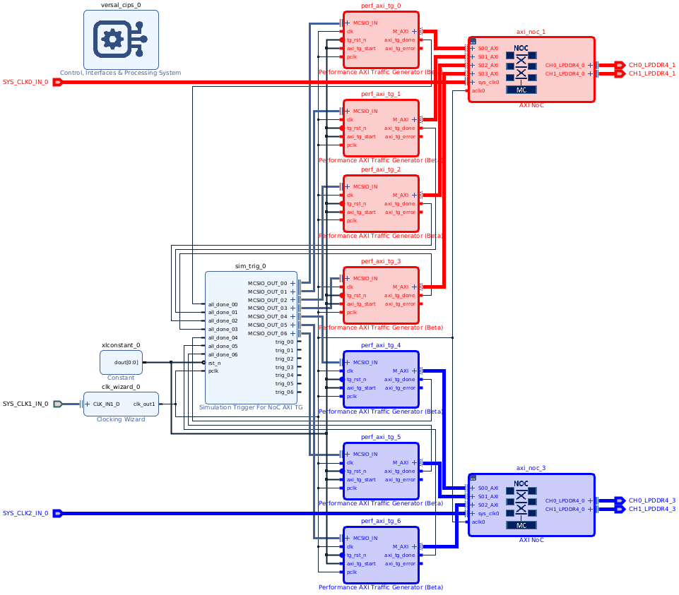
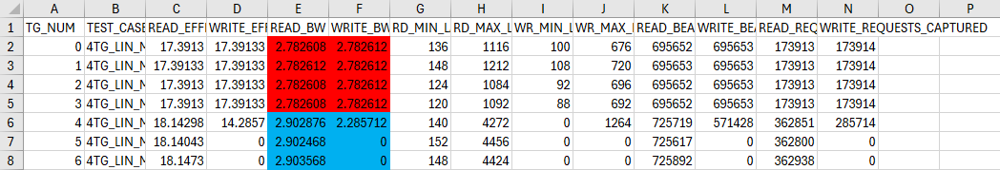

<table>
 <tr>
   <td align="center"><h1>2021.1 Versal™ Network on Chip/DDR Memory Controller Performance Tuning Tutorial</h1>
   </td>
 </tr>
 <tr>
 <td align="center"><h1>Building and Running the Final Design </h1>
 </td>
 </tr>
</table>

# Introduction
This design uses seven AXI Performance Traffic Generators, and two AXI NoC instances, each with a 2x32 LPDDR4-3930 memory controller, to model the DDR traffic requirements on VCK190.

# DDR Traffic Model
One LPDDR4 memory controller handles all the random access memory traffic.  One traffic generator writes to random memory addresses at 2.9 GB/s.  Concurrently, three other traffic generators send read requests to random addresses in three subblocks of same address space to which writes are occurring, each at 3.1 GB/s.

In parallel, a second LPDDR4 memory controller handles eight simultaneous linear traffic threads, four writes and four reads, each accessing a unique bank in memory.  All of these threads are running at 2.78 GB/s.

The DDR Traffic Model is summarized below:

| DDR Operation  | Burst Length | Access Pattern | Throughput (GB/s) |
| -------------- | ------------ | -------------- | ----------------- |
| Linear Write 1 | 2048         | Sequential     | 2.78              |
| Linear Write 2 | 2048         | Sequential     | 2.78              |
| Linear Write 3 | 2048         | Sequential     | 2.78              |
| Linear Write 4 | 2048         | Sequential     | 2.78              |
| Linear Read 1  | 2048         | Sequential     | 2.78              |
| Linear Read 2  | 2048         | Sequential     | 2.78              |
| Linear Read 3  | 2048         | Sequential     | 2.78              |
| Linear Read 4  | 2048         | Sequential     | 2.78              |
| Random Write   | 1024         | Random         | 2.9               |
| Random Read 1  | 1024         | Random         | 3.1               |
| Random Read 2  | 1024         | Random         | 3.1               |
| Random Read 3  | 1024         | Random         | 3.1               |
# Build the Design
* cd into design directory
* Follow the instructions in the README in that directory to build the design

The complete design appears as follows:

The linear traffic generators and NoC instance are highlighted in red.  The random traffic generators and NoC instance are highlighted in blue.  The other blocks are necessary for clock generation and controlling the traffic generators.

# Load Design into Versal
* Launch Vivado
* Open Hardware Manager
* Open New Target to connect to the VCK190
* Tools -> Program device
  * PDI: Tutorials/NoC_DDRMC/Performance_Tuning/finished_design/design/myproj/project_1.runs/impl_1/design_1_wrapper.pdi
  * LTX: Tutorials/NoC_DDRMC/Performance_Tuning/finished_design/design/myproj/project_1.runs/impl_1/design_1_wrapper.ltx
* Hardware Manager should show that DDRMC calibration passed

# Launch Traffic Generators and Performance Counters
* In Vivado Tcl Console:
```tcl
cd ./scripts
source ./total_flow_7tg_inf.tcl
```
This script accomplishes the following:
1. Reads the traffic patterns descriptions in scripts/4TG_LIN_MC1_3TG_RND_MC3_M*.csv
2. Converts them to .mem format
3. Loads the patterns into BRAM
4. Sets up performance counters in the traffic generators
5. Launches the traffic pattern
6. Reads the results from the performance counters
7. Writes the results to RESULT.csv

More information about the traffic generators can be found in the *Performance AXI Traffic Generator Product Guide* (PG381).
# Outputs:
* Results will be captured in ./scripts/RESULT.csv, a sample of which is shown below:

* Random write BW (GB/s) is in cell F6
* Random read 1 BW (GB/s) is in cell E6
* Random read 2 BW (GB/s) is in cell E7
* Random read 3 BW (GB/s) is in cell E8
* Linear write BW (GB/s) is in cells F2, F3, F4, and F5
* Linear read BW (GB/s) is in cells E2, E3, E4, and E5

# Revision History
* Jul 23, 2020 - Initial revision
* Jul 24, 2020 - Changed output descriptions
* Sep 24, 2020 - Updated for 2020.2
* Aug 26, 2021 - Updated for 2021.1

© Copyright 2020-2021 Xilinx, Inc.

Licensed under the Apache License, Version 2.0 (the "License");
you may not use this file except in compliance with the License.
You may obtain a copy of the License at

    http://www.apache.org/licenses/LICENSE-2.0

Unless required by applicable law or agreed to in writing, software
distributed under the License is distributed on an "AS IS" BASIS,
WITHOUT WARRANTIES OR CONDITIONS OF ANY KIND, either express or implied.
See the License for the specific language governing permissions and
limitations under the License.
