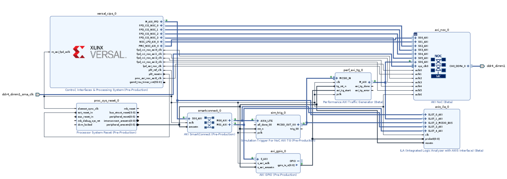
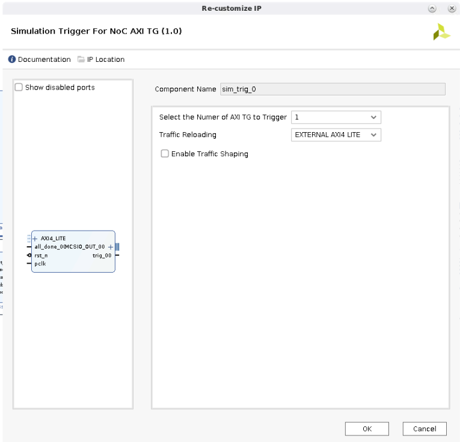
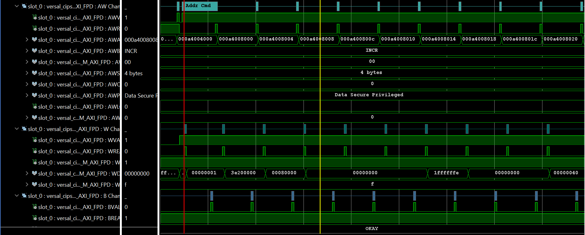
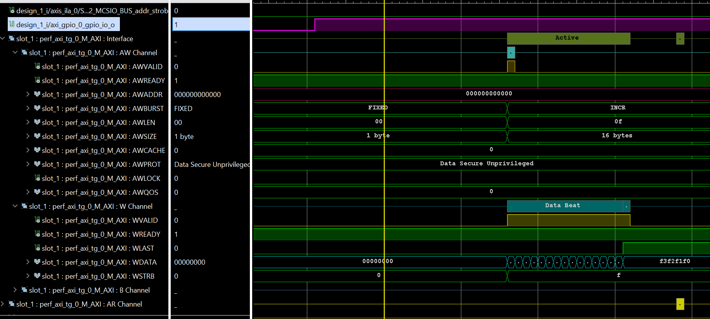
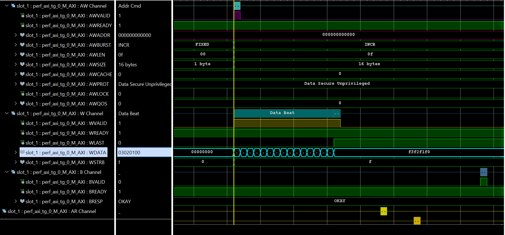

# Versal-Performance-Axi-Traffic-Generator

## **Introduction to Performance Axi Traffic Generator**

The Performance AXI Traffic Generator is intended for modeling traffic masters in Versal™ ACAP designs for performance evaluation of network on chip (NoC) based solutions. It is available in two versions: Non-Synthesizable for simulations only and Synthesizable for both simulations and running in the hardware. The traffic generator supports AXI3, AXI4, and AXI4-Stream protocols. The traffic generator supports multiple operating modes and offers high level of configuration options to support the dynamic workloads enabled by Versal ACAP devices.

https://www.xilinx.com/support/documentation/ip_documentation/perf_axi_tg/v1_0/pg381-perf-axi-tg-spec.pdf

## **Description of the Design**

This design will demonstrate how to configure the instruction BRAM of the Performance AXI traffic Generator using AXI4-Lite protocol. Once configured, the Performance AXI Traffic Generator sends writes to DDR through the AXI NoC. The Axi4-Lite interface is connected to CIPS and the performance AXI traffic generator configured in run time through software. The AXI GPIO is used to start the perfomance AXI traffic generator.

Below is the format to load configure the Performance traffic generator

1. Write 0 to the SOFT_RST register (active-Low register):

   address: 0000_4000 Data: 0000_0000
   
2. Write 1 to the SOFT_RST register:

   address: 0000_4000 Data: 0000_0001

3. Load the block RAM with instructions. The addresses to load the block RAM are as follows:

   Instruction = 1;
   
   address = 32'h00008030; data = instruction1[12*32+:32]

   address = 32'h0000802c; data = instruction1[11*32+:32]

   address = 32'h00008028; data = instruction1[10*32+:32]

   address = 32'h00008024; data = instruction1[9*32+:32]

   address = 32'h00008020; data = instruction1[8*32+:32]

   address = 32'h0000801c; data = instruction1[7*32+:32]

   address = 32'h00008018; data = instruction1[6*32+:32]

   address = 32'h00008014; data = instruction1[5*32+:32]

   address = 32'h00008010; data = instruction1[4*32+:32]

   address = 32'h0000800c; data = instruction1[3*32+:32]

   address = 32'h00008008; data = instruction1[2*32+:32]

   address = 32'h00008004; data = instruction1[1*32+:32]

   address = 32'h00008000; data = instruction1[0*32+:32]

   Instruction =2

   address = 32'h00008070; data = instruction2[12*32+:32]

   address = 32'h0000806c; data = instruction2[11*32+:32]

   address = 32'h00008068; data = instruction2[10*32+:32]

   address = 32'h00008064; data = instruction2[9*32+:32]

   address = 32'h00008060; data = instruction2[8*32+:32]

   address = 32'h0000805c; data= instruction2[7*32+:32]

   address = 32'h00008058; data = instruction2[6*32+:32]

   address = 32'h00008054; data = instruction2[5*32+:32]

   address = 32'h00008050; data = instruction2[4*32+:32]

   address = 32'h0000804c; data = instruction2[3*32+:32]

   address = 32'h00008048; data = instruction2[2*32+:32]

   address = 32'h00008044; data = instruction2[1*32+:32]

   address = 32'h00008040; data = instruction2[0*32+:32]

   Note: These instruction 1 and 2 are formed by arranging the Axi parameters discussed in interface Instruction format.
   
4. Write 1 to the TG_START register to start the traffic:

   Address: 00004004; Data: 0000_0001

## **Performance Axi Traffic Generator AXI4-Lite interface Instruction format**

| Bit Fields | Field Name | Width | Description|
| --- | --- | --- | --- |
| [3:0] | axiUser | 4 | Axi user field | 
| [7:4] | axiRegion | 4 | Axi Region field | 
| [11:8] | axiQos | 4 | Axi Qos filed | 
| [14:12] | axiProt | 3 | Axi Prot field | 
| [18:15] | axiCache | 4 | Axi Cache field | 
| [20:19] | axiLock | 2 | Axi Lock field | 
| [22:21] | axiBurst | 2 | Axi Burst field | 
| [25:23] | axiSize | 3 | Axi Size field | 
| [33:26] | axiLen | 8 | Axi Length field |
| [34] | ID Type | 1 | if 1'b0: constant awid/arid | 
 |  |  |  | if 1'b1: Incremental awid/arid | 
| [50:35] | Number of Transactions | 16 | Number of transactions per command | 
| [52:51] | Transaction Type | 2 | 2'b00: READ command | 
 |  |  |  | 2'b01: WRITE command | 
 |  |  |  | 2'b10: WAIT command | 
| [100:53] | Number of bytes per transaction | 48 | if the address pattern field is 2'b00, "Linear address", then this field is equal to (2^axisize)*(axilen+1). | 
 |  |  | | if the address pattern field is 2'b01, "increment by value", then this field is equal a constant value by which the transaction address is incremented. | 
| [148:101] | Address offset | 48 | This is the offset value that will be added to the base address to calculate the address of the first transaction of a command. if the next transaction reaches the boundary of the high address then base address is loaded on the | 
| [196:149] | High Address | 48 | Up to this value the address will be incremented by The TG. Once the incremented address is reached the high address boundary, the next transaction start address will be the base address. | 
| [244:197] | Base Address | 48 | The base address can be specified in this field. The incremented address for the transaction will be looped back to the base address when the high address boundary is reached. | 
| [292:245] | Seed | 48 | This filed specifies the seed value for random address generation | 
| [294:293] | Address pattern | 2 | 2'b00: Linear address. The next transaction address will be incremented by the number of bytes accessed in the current transaction | 
 |  |  | | 2'b01: Increment by value. The next transaction address will be incremented by this value | 
 |  |  | | 2'b10: Random address. Seed field is used to generate the random addresses using a prbs pattern generator. | 
 |  |  | | 2'b11: Random aligned address. The random address generated by the prbs module will be aligned. | 
| [303:295] | Loop Address | 9 | In case the loop is used in the csv filed, this field indicates to which instruction to loop back. | 
| [304] | Loop | 1 | In case the loop is used in the csv field, set this bit high for all the instructions in the loop. | 
| [305] | Last Instruction | 1 | This bit indicates the last instruction. | 
| [306] | Infinite Transaction | 1 | If the bit is set then the instruction is executed forever. | 
| [322:307] | Delay between Transactions | 16 | specifies the delay between each transaction in clock cycles | 
| [338:323] | Loop count | 16 | In case the loop is used in the csv filed, this field indicates how many time to loop the instructions | 
| [339] | Infinite Loop | 1 | In case the loop is used in the csv filed, this field indicates loop the instruction forever | 
| [340] | Loop Start | 1 | No Used | 
| [352:341] | Destination ID | 12 | This value is set on the destination id output signal | 
| [353] | DI Enable | 1 | if set enables the data integrity of corresponding reads instructions | 
| [362:354] | Data Patterns | 9 | If the MSB bit is 0, the next 8 bits will be sent as data else the LSB 3 bits will specify the data pattern | 
 |  |  | | 8’b100000000: Address as data | 
 |  |  | | 8’b100000001: Byte XOR of address | 
 |  |  | | 8’b100000010: Reserved | 
 |  |  | | 8’b100000011: Reserved | 
 |  |  | | 8’b100000100: Reserved | 
 |  |  | | 8’b100000101: Reserved | 
 |  |  | | 8’b100000110: Reserved | 
 |  |  | | 8’b100000111: Reserved | 
| [378:363] | Loop Increment value | 16 | This value specifies the address to be incremented for each loop count | 
| [382:379] | ID value | 4 | AXI ID value | 
| [385:383] | Expected response | 3 | Expected response for RRESP and BRESP |

## **Required Hardware and Tools**

2020.2 Vivado and Vitis

Versal VCK190 Evaluation Platform

## **Block Diagram**

#### **Enabling AXI4-lite Interface**

## **Build Instructions**

### **Vivado:**

Be sure to source `settings.sh` for Vivado.

If the board under test is not present in the Vivado installation, it can be installed following these steps.

To create the project, run the following from the command line:

`vivado -source project_top.tcl`

The Vivado project will be built in the `Hardware` directory.

Once the project is created, click on "Generate Device Image".

Wait until "Device Image Generation successfully completed" then "Open Implemented Design". Exporting the XSA to the Software folder with the following TCL command:

`write_hw_platform -fixed -include_bit -force -file ../Software/design_1_wrapper.xsa`

### **Vitis:**

Be sure to source `settings.sh` for Vitis.

Enter the Scripts directory. From the command line run the following:

`xsct -eval source design_1_vitis.tcl`

The Vitis project will be built in the `Software/Vitis` directory.

## **Running the Design**

 set the boot mode to JTAG and power on the board. Program the design_1_wrapper.pdi then set up the trigger in ILA and then program the helloworld application.  

## **Analyzing the Results**

#### **loading configuration data into Performance AXI traffic generator from processor**

#### **Asserting the GPIO to start the Performance AXI traffic generator**

#### **Performance AXI traffic generator Writting the data into DDR through NoC**

## **Conclusion**

This design helps the users to configure the Performance traffic generator using software in run time. 

© Copyright 2021 Xilinx, Inc.

Licensed under the Apache License, Version 2.0 (the "License"); you may not use this file except in compliance with the License. You may obtain a copy of the License at

`http://www.apache.org/licenses/LICENSE-2.0`

Unless required by applicable law or agreed to in writing, software distributed under the License is distributed on an "AS IS" BASIS, WITHOUT WARRANTIES OR CONDITIONS OF ANY KIND, either express or implied. See the License for the specific language governing permissions and limitations under the License.

