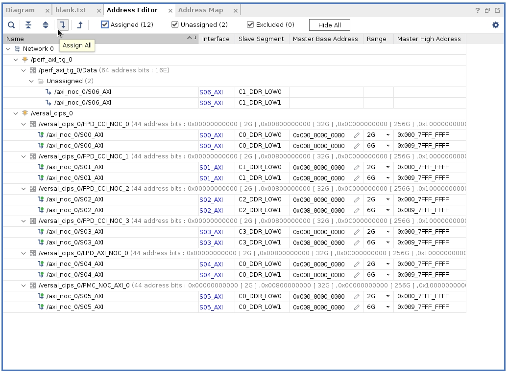
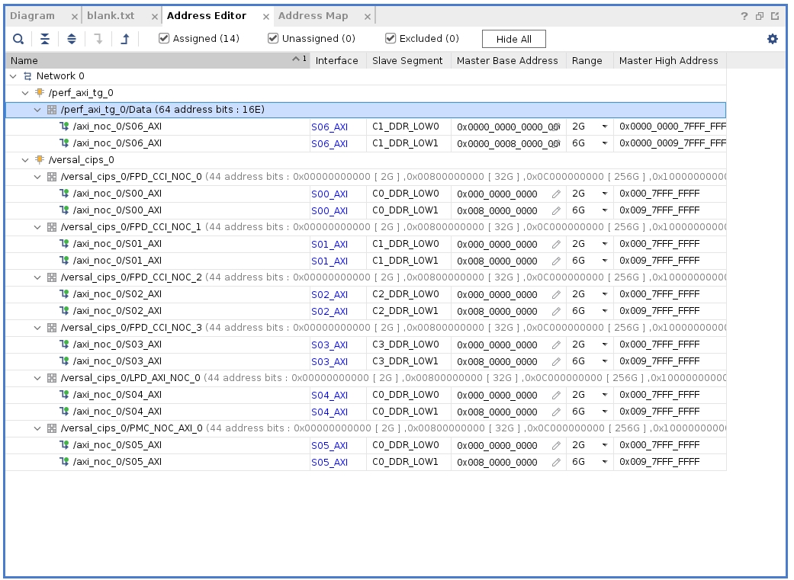
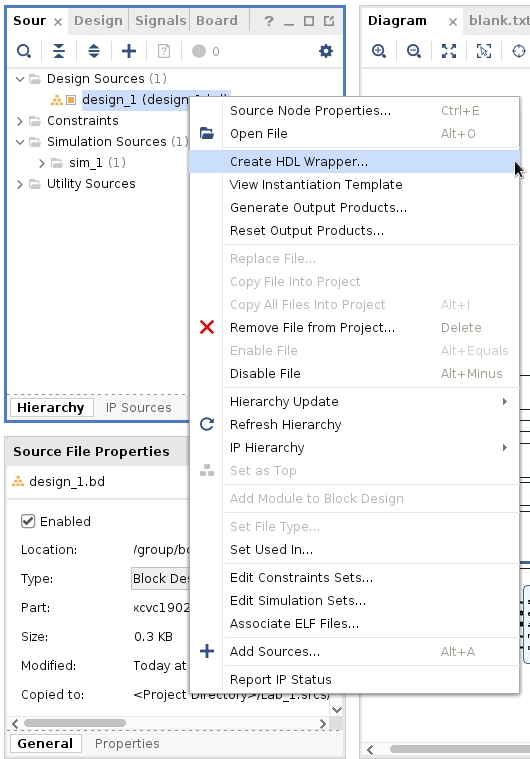
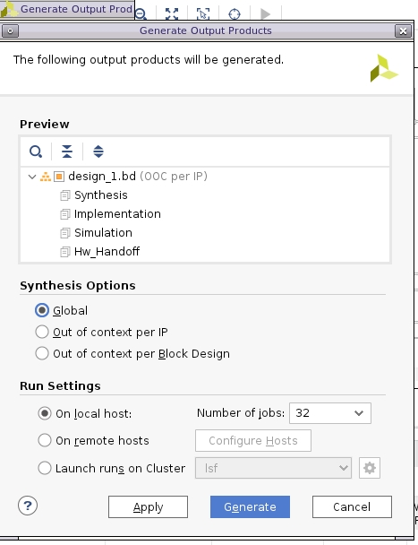
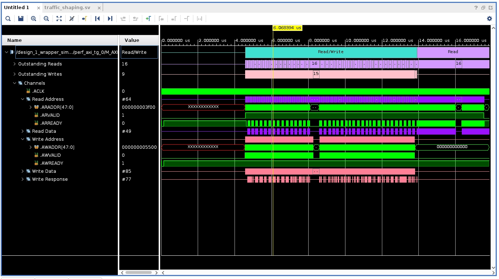
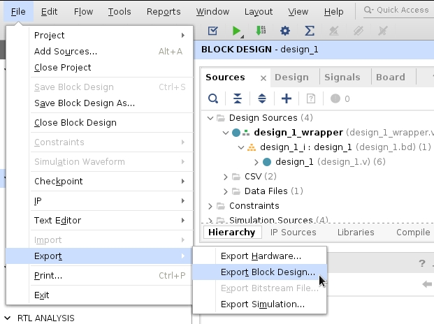
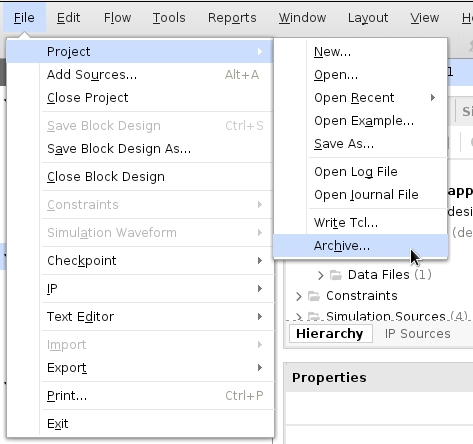

<table>
 <tr>
   <td align="center"><h1>2021.2 Versal™ Network on Chip Non-Synthesizable Performance AXI Traffic Generator Tutorial</h1>
   </td>
 </tr>
</table>

# Lab 1 - Introduction to the Performance AXI Traffic Generator
This tutorial covers the basics of building a non-synthesizable performance AXI traffic generator design. This lab will demonstrate a pre-defined workload as well as leveraging the default CSV traffic specification for a simple AXI traffic generator simulation on a VCK190 evaluation board. The lab walks through the steps to build a design with various IP components in IP integrator. Additionally, instructions are included on how to configure and connect the various IP components to have a working design in simulation. The design uses a basic 64-bit DDR4 memory interface running at 3200 Mbps, which is accessible through an AXI NoC instantiation.

# Description of the Design

This design targets the VCK190 evaluation board and uses a single Performance AXI traffic generator instantiation to drive traffic to an AXI NoC instance with a 64-Bit 3200 Mbps DDR4 interface. A pre-defined workload will be used as well as a traffic specification leveraged from the default CSV file but is modified to have larger aligned memory accesses and less write/read transactions to reduce the simulation run time. Little automation is used to build the project in order to reinforce the design process.

# Building the Design

1. Create a working directory called pg381_non_synth_tg_labs.
1. Create the Project.
    * Open Vivado Design Suite and click Create Project.
    * Press Next.
    * Call the Project Name Lab_1, set within the pg381_non_synth_tg_labs folder, and press Next.
    * Select RTL Project and press Next.
    * Press Next twice to skip adding Sources and Constraints.
    * At the Default Part screen select the Boards option, target the Versal VCK190 Evaluation Platform, then press Next.
    * Press Finish at the final screen.
1. At the Flow Navigator screen, select the option to Create Block Design under the IP INTEGRATOR heading.
    * Press OK at the Create Block Design prompt.
1. Add the AXI NoC.
    * Right click on the IPI Canvas and select Add IP to bring up the IP Catalog.
    * Type AXI NoC in the search field and then double click on the AXI NoC to add it to the canvas.
    * After the AXI NoC is placed on the canvas select the Run Block Automation option at the top of the canvas.
    * Leave the automation options as the defaults with a Control, Interface, and Processing System instantiation (CIPS), no AXI Traffic Generator, no External Sources, no AXI BRAM Controller, and a single DDR memory controller instance.
    * 
    * The block automation adds the CIPS presets for the VCK190 board as well as targeting the DDR4 interface on the board.  Automation also enables the Cache Coherent interfaces on the CIPS block which are connected to the AXI NoC. This allows the lab to be imported to the Vitis IDE as a valid project which can be expanded upon.
1. Exploring the NoC.
    * Double-click the AXI NoC to bring up the configuration GUI.
    * The Board tab shows the VCK190 board aware interfaces with CH0_DDR4_0 connected to ddr dimm1 and the DDRMC reference clock sys_clk0 connected to ddr4 dimm1 sma clk.
    * The General tab shows 6 AXI Slave interfaces which were connected by automation.  It also has 6 AXI clocks to correspond with each AXI Slave interface.  A Single Memory Controller is enabled with 4 Memory Controller Ports.  The default address ranges of DDR LOW0 and DDR LOW1 are set.
    * The Inputs tab shows the 6 AXI slaves and their clock domain.
    * Nothing is connected in the Outputs tab.
    * The Connectivity tab shows the AXI Slave to MC Port connection matrix.
    * The DDR Basic tab is set to DDR4 with a 200MHz reference clock and a 625ps interface clock period, which is 1600MHz or 3200Mbps DDR.  The Enable Internal Responder box is checked to enable the default memory model for simulations.
    * The DDR Memory tab shows the board automation preset of a 64-bit UDIMM targeting 8Gbit components with a total of 8GB memory available.
    * Press OK to close the AXI NoC configuration GUI.
1. Add additional IP to the Block Design canvas.
    * Right click on the canvas and select Add IP.
    * Add one instance of the Performance AXI Traffic Generator.
    * Add one instance of the Simulation Trigger for NoC AXI TG.
    * Add one instance of Processor System Reset.
    * Add one instance of Simulation Clock and Reset Generator.
    * Right click on the canvas and select the Regenerate Layout option to arrange all the IP blocks.
    * 
1. Reconfigure the CIPS blocks.
    * Double click on the CIPS block to bring up the reconfiguration GUI.
    * Click Next to go to the second page.
    * Select the PS PMC block on the left.
    * Go to the Clocking heading on the left, then the Output Clocks tab.
    * Expand All and under the PL Fabric Clocks enable PL CLK 0 at 225MHz and PL CLK 1 at 100MHz.
    * The PL CLK 0 will be used to drive the traffic generator and PL CLK 1 is available for debug IP.
    * Go to the PS PL Interfaces tab and enable 1 PL Reset.
    * Press Finish and Finish again to close the GUI.
1. Reconfigure the Performance AXI Traffic Generator.
    * Double-click the Performance AXI Traffic Generator IP to bring up the reconfiguration GUI.
    * In the Performance TG for Simulation field set the NON SYNTHESIZABLE option.
    * Change the AXI Data Width to 512.
    * Check the box to Enable Traffic Shaping.
    * Switch to the Non-synthesizable TG Options tab.
    * Change the AXI ID Width to 4.
    * Change the AXI Write Length to 3.
    * Change the AXI Write Bandwidth to 14000.
    * 
    * Press OK to close the GUI.
1. Reconfigure the Simulation Trigger for NoC AXI TG.
    * Double click on the Sim Trig IP to bring up the reconfiguration GUI.
    * Check the box to Enable Traffic Shaping.
    * Press OK to close the GUI.
1. Reconfigure the Simulation Clock and Reset Generator IP.
    * Double click on the clk gen sim IP to bring up the reconfiguration GUI.
    * Set the Number of SYS Clocks to 1 and set the Sys Clock - 0 Frequency (MHz) field to 200MHz.
    * Set the Number of AXI Clocks to 1 and set the AXI-0 Clock Frequency (MHz) field to 225MHz.
    * Press OK to close the GUI.
1. Configure the Simulation Trigger for NoC AXI TG connections.    
    * Connect trig_00 to axi_tg_start of the Perf AXI TG.
    * Connect ph_trig_out to trigger_in of the Perf AXI TG.
1. Configure the Performance AXI Traffic Generator connections.
    * Connect trigger_out to ph_trig_in_00 of the Sim Trigger.
    * Connect axi_tg_done to all_done_00 of the Sim Trigger.
1. Configure the CIPS block connections.
    * Connect the pl0_ref_clk to the slowest_sync_clk of the Processor System Reset and the axi_clk_in_0 of the Simulation Clock and Reset Generator.
    * Connect the pl0_resetn to the ext_reset_in of the Processor System Reset.
1. Processor System Reset connections.
    * Connect the interconnect_aresetn[0:0] to axi_rst_in_0_n of the Simulation Clock and Reset Generator.
1. Simulation Clock and Reset Generator connections.
    * Disconnect the ddr4_dimm1_sma_clk from the AXI NoC sys_clk0 pin and connect it to the input SYS_CLK0_IN of the Simulation Clock and Reset Generator.
    * Connect the output SYS_CLK0 to the input sys_clk0 of the AXI NoC.
    * Connect the axi_rst_0_n output to the input rst_n of the Sim Trig and the tg_rst_n of the Perf AXI TG.
    * Connect the axi_clk_0 output to the input pclk of the Sim Trig as well as the clk input of the Perf AXI TG.
    * These connections are required in order for the simulation test bench to operate but can be left in for designs running in hardware.
    * 
1. Reconfigure the AXI NoC by double clicking on the IP instance.
    * Go to the General tab and increase the Number of AXI Slave interfaces to 7 and the Number of AXI Clocks to 7.
    * Go to the Inputs tab and change the S06_AXI clock to aclk6.
    * Note that S06_AXI is set to the PL which is correct for soft IP like the Performance AXI Traffic Generator.
    * Go to the Connectivity tab and assign S06_AXI to MC Port 1.
    * Go to the QoS tab and change the S06_AXI MC Port 1 Read and Write Bandwidth to 14000 MB/s each.
    * This is to match the max bandwidth of the Performance AXI Traffic Generator, which at peak will be approximately 14GB/s (225MHz x 64Bytes).
    * Values larger than this will cause a QoS DRC to trigger since it considers the traffic and NoC packet overhead from each traffic source.
    * Press OK to close the GUI.
1. Make the final connections.
    * Connect the axi_clk_0 output of the Simulation Clock and Reset Generator to aclk6 of the AXI NoC.
    * Connect the M_AXI port of the Performance AXI Traffic Generator to the S06_AXI port of the AXI NoC.
    * Right click on the canvas and select Regenerate Layout.
    * 
1. Assign S06_AXI.
    * At the top of the IPI Canvas select the Address Editor tab, and then press the down arrow button to 'Assign All' remaining segments.
    * This figure shows the original address mapping before 'Assign All'.   
    * 
    * This figure shows the addressing after 'Assign All'.
    * 
    * Note now the /perf_axi_tg_0/Data segment is assigned to C1_DDR_LOW0 and C1_DDR_LOW1, which corresponds to MC Port 1 of the DDR_LOW0 and DDR_LOW1 memory ranges.
1. Go back to the IPI Canvas by selecting the Diagram tab.
    * Right click on the M_AXI channel of the perf_axi_tg_0 and select Mark Simulation.
1. Under the Sources tab expand the Design Sources heading, right click on design_1.bd, and select Create HDL Wrapper...
    * Leave it as 'Let Vivado manage wrapper and auto-update' then press OK.
    * 
1. After the wrapper is created select the Generate Block Design option under the IP INTEGRATOR tab of the Flow Navigator.
    * When prompted select Global under Synthesis Options and press generate.
    * Note that the Generate Block Design step runs validation checks on user CSV files assigned to the Performance AXI Traffic Generators.
    

# Simulating with the Pre Defined Workload

1. After generation is complete update the Simulation settings.
    * Right click on the Simulation heading in the Flow Navigator column and select Simulation Settings.
    * Go to the Simulation tab.
    * Set the xsim.simulate.runtime to 1ms.
    * Check the box for xsim.simulate.log_all_signals.
    * Press Apply then press OK.
    
1. Run the simulation by left clicking on the Run Simulation button, then Run Behavioral Simulation.
    * The simulation will run and will automatically finish after the 100 Writes and 100 Reads are complete.
1. View the results by selecting the Untitled tab.
    * Press the maximize window button in the upper right corner.
    * Right click in the simulation window and select the Full View option.
    * Expand the simulation channels until you can see the Read Address and Write Address busses.
     
    * Notice how the AXI Address move linearly through the address space with 0x100 Byte offsets, which aligns with 4 bursts of 64 Bytes per command.
    * Also note that for most of the simulation time the Write and Read traffic is mixed but there is a period of Read only traffic after the Writes have completed.

# Simulating with a CSV Workload

1. Copy the default CSV file to the project.
    * The default CSV file path can be seen here:
      * Xilinx\Vivado\2021.2\data\ip\xilinx\perf_axi_tg_v1_0\utils
    * The default_aximm_synth_tg.csv file is used for AXI4MM based designs.
    * The default_axis_synth_tg.csv file is used for AXI Stream based designs.
    * Copy the default_aximm_synth_tg.csv file in to the Lab_1 project folder.
    * Rename the default_aximm_synth_tg.csv file to non_synth_tg_lab_1.csv.
    * Open the CSV file.
    * The default CSV file issues 5000 Writes and then 5000 Reads starting at address 0x0 with a burst length of 0 and a burst size of 0, meaning 1 burst of 1 byte per command, with the AXI burst type set to 1 for INCR.  This is not a realistic DDR4 access pattern so the axi_len and axi_size fields will be updated.  Additionally 5000 commands will result in a longer simulation run time, so this will also be reduced.
    * 
      * Right click and select Open Image, or View Image, or Save Image to see in high quality.
    * Change the axi_len field to 0x3 for an AXI burst length of 4.
    * Change the axi_size field to 0x6 for 64Bytes, which aligns to a 64-bit DDR4 interface burst size.
    * Change the txn_count/loop_count/wait_option from 5000 to 500 to reduce simulation run time.
    * 
      * Right click and select Open Image, or View Image, or Save Image to see in high quality.
    * Save the changes and close the file.      
    * For more information about the CSV fields see PG381.
1. Target the new CSV file to the Performance AXI Traffic Generator.
    * Click on the Open Block Design on the left side of the Vivado GUI and select the Diagram tab to return to the IPI canvas.
    * Double click on the Perf AXI TG on the IPI Canvas.
    * Go to the Non-synthesizable TG Options tab.
    * Change the AXI Test/Pattern Types value from 'write read interleaved' to 'user defined pattern'.
    * Click on the folder icon next to the Path to User Defined Pattern File (CSV).
    * Navigate to non_synth_tg_lab_1.csv in the Lab_1 project structure, select the file, and press OK.
    * Press OK again to close the customization GUI.
1. Press Generate Block Design again with the Global outputs options.
    * The resulting CSV file after it was processed can be seen in this path:
    * Lab_1\Lab_1.gen\sources_1\bd\design_1\ip\design_1_perf_axi_tg_0_0\design_1_perf_axi_tg_0_0_pattern.csv
    * Open the CSV file and see that the axi_len, axi_size, and txn_count/loop_count/wait_option fields are all updated.
1. Run the simulation by left clicking on the Run Simulation button, then Run Behavioral Simulation.
    * When prompted with "Simulation is Already Running" press Yes to close the previous simulation results.
    * The simulation will run and will automatically finish after the 500 Writes and 500 Reads are complete.
1. View the results by selecting the Untitled tab.
    * Press the maximize window button in the upper right corner.
    * Right click in the simulation window and select the Full View option.
    * Expand the simulation channels until you can see the Read Address and Write Address busses.
    * 
    * Notice how the AXI Address move linearly through the address space with 0x100 Byte offsets, which aligns with 4 bursts of 64 Bytes per command.
    * Also note that for most of the simulation time the Write and Read traffic is mixed but there is a period of Read only traffic after the Writes have completed.

# Export Design Files

1. Export the Block Design.
    * Go back to the Block Design by selecting the Open Block Design tab under the Flow Navigator columns.
    * Go to File, Export, then Export Block Design.
    * Change the file name to pg381_non_synth_tg_lab_1.tcl.
    * 
    * Use this file to rebuild this project for Lab 2.
1. Modify the Block Design TCL script.
    * Navigate to the pg381_non_synth_tg_lab_1.tcl and open in a text editor.
    * Search for this line:
    CONFIG.USER_USR_DEFINED_PATTERN_CSV
    * Change the file path to only have the CSV file, as shown as follows:
      * CONFIG.USER_USR_DEFINED_PATTERN_CSV {non_synth_tg_lab_1.csv} \
    * This change allows for the CSV file to be automatically picked up when rebuilding the block design.
1. Save a project archive.
    * Go to File, Project, and then Archive.
    * Call the archive name Lab_1, check the box for Include configuration settings, and then press OK to generate the archive.
    * 
      * It is safe to ignore the Critical Warnings during the archiving process if they appear.

# Revision History
* November 10, 2021 - First Release

© Copyright 2021 Xilinx, Inc.

Licensed under the Apache License, Version 2.0 (the "License");
you may not use this file except in compliance with the License.
You may obtain a copy of the License at

    http://www.apache.org/licenses/LICENSE-2.0

Unless required by applicable law or agreed to in writing, software
distributed under the License is distributed on an "AS IS" BASIS,
WITHOUT WARRANTIES OR CONDITIONS OF ANY KIND, either express or implied.
See the License for the specific language governing permissions and
limitations under the License.

 XD124 
