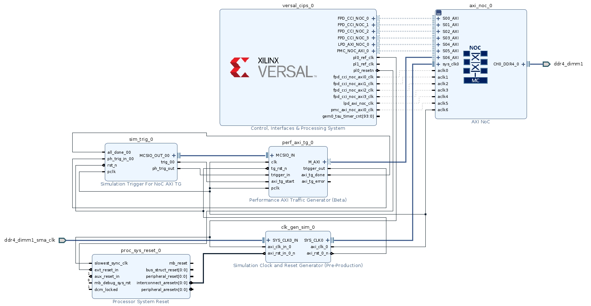
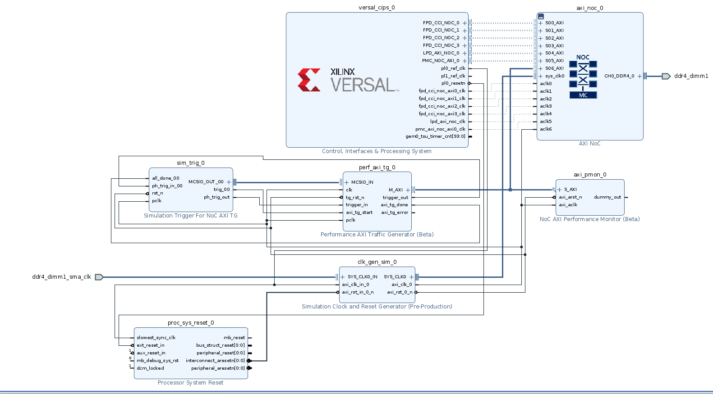
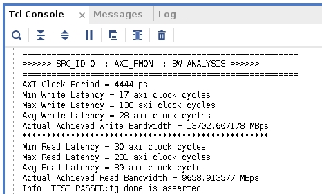
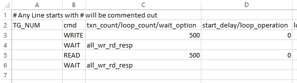
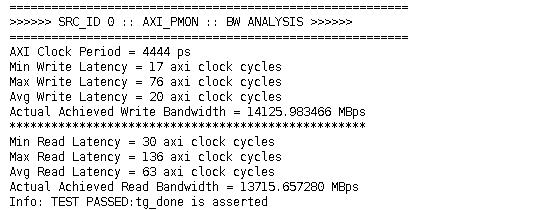

<table class="sphinxhide" width="100%">
 <tr width="100%">
    <td align="center"><h1>Versal™ NoC/DDRMC Design Flow Tutorials</h1>
    <a href="https://www.xilinx.com/products/design-tools/vivado.html">See Vivado™ Development Environment on xilinx.com</a>
    </td>
 </tr>
</table>

# Versal NoC Synthesizable Performance AXI Traffic Generator: Lab 2 - NoC AXI Performance Monitor

***Version: Vivado 2021.2***

This tutorial leverages the design from Lab 1 - Introduction and adds a NoC AXI Performance Monitor to generate more detailed performance information from the Synthesizable Traffic Generator workload. The CSV will be updated to have the same overall workload but with the addition of traffic flow control, which will result in different performance.

## Description of the Design

This design leverages the project from Lab 1 which targets a VCK190 evaluation board using the 64-Bit DDR4 interface at 3200 Mbps with a single Performance AXI Traffic Generator. A single NoC AXI Performance Monitor is added to give more detailed simulation performance statistics.

## Building the Design

1. Copy and paste the pg381_synth_tg_lab_1.tcl and synth_tg_lab_1.csv files from Lab_1 to your pg381_synth_tg_labs working directory.
    * Open the pg381_synth_tg_lab_1.tcl file with a text editor.
    * Find the line:
     create_project project_1 myproj -part xcvc1902-vsva2197-2MP-e-S
    * Change it to:
     create_project Lab_2 Lab_2 -part xcvc1902-vsva2197-2MP-e-S
    * Save the changes.
    * Start a new Vivado IDE session.
    * Go to Tools and Run TCL script.
    * Target the pg381_synth_tg_lab_1.tcl file which was just modified and press OK.
    * The project will rebuild without errors if the files were modified correctly and placed in the same directory.
    * 
1.  Add the NoC AXI Performance Monitor.
    * Once the design has been rebuilt open the block design canvas by selecting Open Block Design under the Flow Navigator heading.
    * Right click on the canvas and select Regenerate Layout.
    * At this point the canvas should look exactly like it did at the end of Lab 1.
    * Right click and select Add IP.
    * Enter NoC AXI Performance Monitor and double click to add one to the canvas.
1. Connect the NoC AXI Performance Monitor.
    * Connect the M_AXI port of the Perf AXI TG to the S_AXI port of the NoC AXI Performance Monitor.
    * Connect the axi_arst_n input of the NoC AXI Performance Monitor to the axi_rst_0_n output of the Sim Clock and Reset Generator.
    * Connect the axi_aclk input of the NoC AXI Performance Monitor to the axi_clk_0 output of the Sim Clock and Reset Generator.
    * Right click on the canvas and select Regenerate Layout.
    * 
1. Retarget the CSV file to the Performance AXI Traffic Generator.
    * Double click on the Perf AXI TG on the IPI Canvas.
    * Go to the Synthesizable TG Options tab.
    * Click on the folder icon next to the Path to User Defined Pattern File (CSV) for Synthesizable TG.
    * Navigate to synth_tg_lab_1.csv in your working directory, select the file, and press OK.
    * Press OK again to close the customization GUI.
1. Under the Sources tab expand the Design Sources heading, right click on design_1.bd, and select Create HDL Wrapper...
    * Leave it as 'Let Vivado manage wrapper and auto-update' then press OK.
1. After the wrapper is created select the Generate Block Design option under the IP INTEGRATOR tab of the Flow Navigator.
    * When prompted select Global under Synthesis Options and press Generate.

## Simulating the Design

1. After generation is complete update the Simulation settings.
    * Right click on the Simulation heading in the Flow Navigator column and select Simulation Settings.
    * Go to the Simulation tab.
    * Set the xsim.simulate.runtime to 1ms.
    * Check the box for xsim.simulate.log_all_signals.
    * Press Apply then press OK.
1. Run the simulation by left clicking on the Run Simulation button, then Run Behavioral Simulation.
    * The simulation will run and will automatically finish after the 500 Writes and 500 Reads are complete.
1. Expand the TCL console after the simulation has finished to review the AXI NoC Performance Monitor results.
    * 
    * This is the performance when you have both Write and Read traffic occurring at the same time, which is suboptimal because of protocol churn.
      * Results may vary slightly depending on the Vivado release.
    * The PMON results are captured in the simulate.log file after the simulation is closed.
    * This is the path to the log file:
      * Lab_2\Lab_2.sim\sim_1\behav\xsim
1. Modify the CSV file for a different access pattern.
    * Open the synth_tg_lab_1.csv file and save a new copy as synth_tg_lab_2.csv.
    * Insert a new line after the Write command.
    * Add a WAIT command with all_wr_rd_resp in the txn_count/loop_count/wait_option fields.
    * After the Read command add a WAIT command with all_wr_rd_resp in the txn_count/loop_count/wait_option fields.
    * Save the CSV file.
    * 
    * The purpose of this change is to separate the Write and Read traffic so the Write operations will run first and complete before the Read operations start.
1. Update the CSV file in the Performance AXI Traffic Generator.
    * Click on the Open Block Design on the left side of the Vivado GUI and select the Diagram tab to return to the IPI canvas.
    * Double click on the Perf AXI TG on the IPI Canvas.
    * Go to the Synthesizable TG Options tab.
    * Click on the folder icon next to the Path to User Defined Pattern File (CSV) for Synthesizable TG.
    * Navigate to synth_tg_lab_2.csv in your working directory, select the file, and press OK.
    * Press OK again to close the customization GUI.
1. Select the Generate Block Design option under the IP INTEGRATOR tab of the Flow Navigator.
    * When prompted select Global under Synthesis Options and press Generate.
1. Run the simulation by left clicking on the Run Simulation button, then Run Behavioral Simulation.
    * When prompted with "Simulation is Already Running" press Yes to close the previous simulation results.
    * The simulation will run and will automatically finish after the 500 Writes and 500 Reads are complete.
1. Compare simulation Results.
    * Open the TCL console to see the new PMON Results.
    * 
    * The second run has higher overall bandwidth and lower latency than the first one because the access pattern was improved to reduce bus turnaround and protocol hits from mixed traffic streams.
      * Results may vary slightly depending on the Vivado release

## Export Design Files

1. Export the Block Design.
    * Go back to the Block Design by selecting the Open Block Design tab under the Flow Navigator columns.
    * Go to File, Export, then Export Block Design.
    * Change the file name to pg381_synth_tg_lab_2.tcl.
    * Use this file to rebuild this project for Lab 3.
1. Modify the Block Design TCL script.
    * Navigate to the pg381_synth_tg_lab_2.tcl and open in a text editor.
    * Search for this line:
    CONFIG.USER_SYNTH_DEFINED_PATTERN_CSV
    * Change the file path to only have the CSV file, as follows:
      * CONFIG.USER_SYNTH_DEFINED_PATTERN_CSV {synth_tg_lab_2.csv} \
    * This change allows for the CSV file to be automatically picked up when rebuilding the block design.
1. Save a project archive.
    * Go to File, Project, and then Archive.
    * Name the archive Lab_2, check the box for Include configuration settings, and then press OK to generate the archive.
    * It is safe to ignore the Critical Warnings during the archiving process if they appear.

Copyright © 2020–2024 Advanced Micro Devices, Inc.

<a href="https://www.amd.com/en/corporate/copyright">Terms and Conditions</a>

