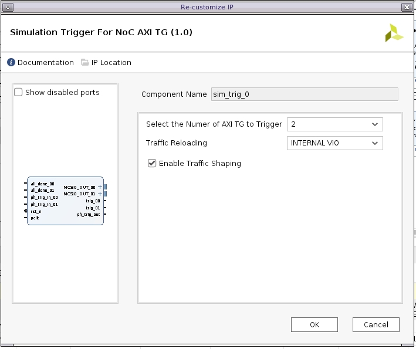
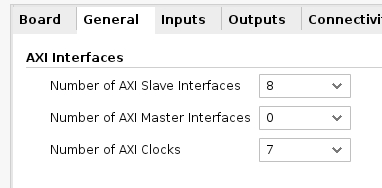
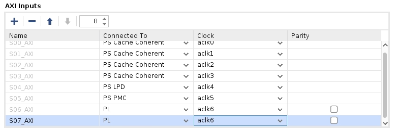
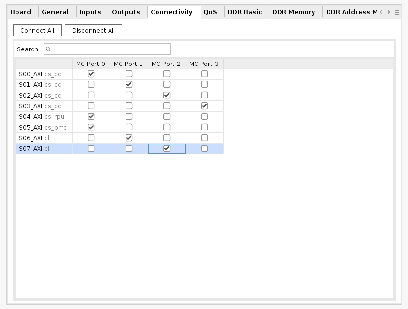
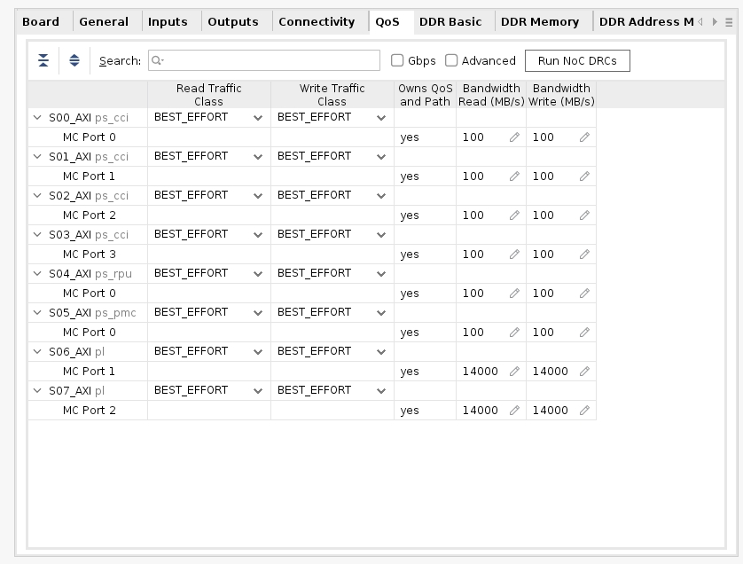
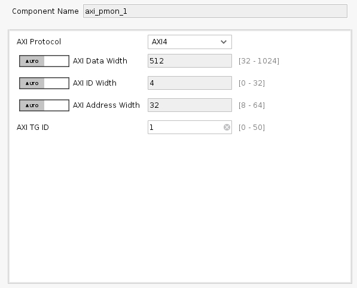
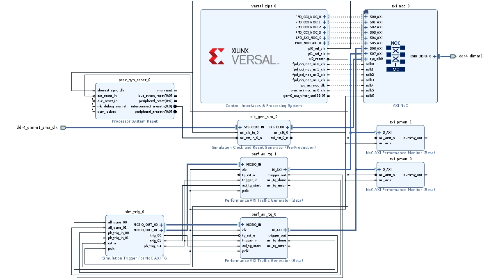
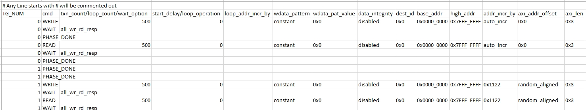
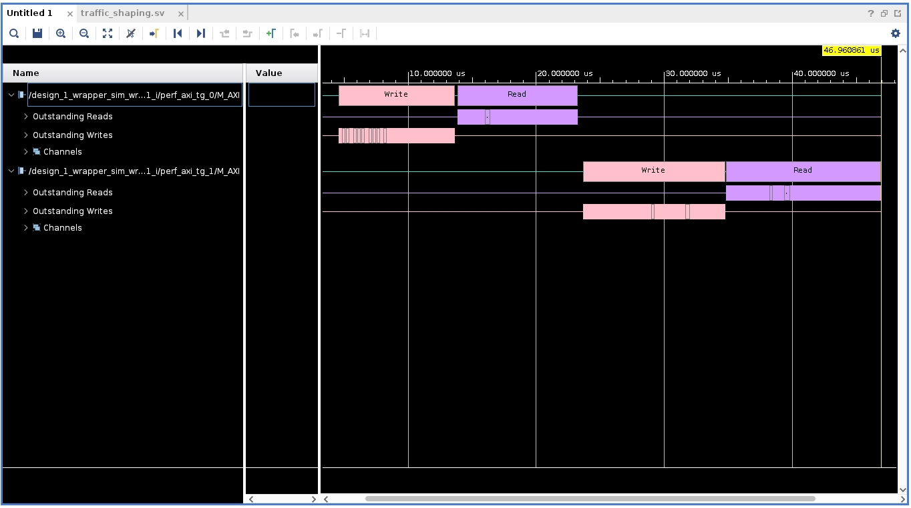
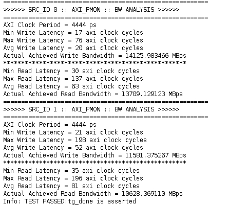

<table>
 <tr>
   <td align="center"><h1>2021.2 Versal™ Network on Chip Synthesizable Performance AXI Traffic Generator Tutorial</h1>
   </td>
 </tr>
</table>

# Lab 3 - Traffic Shaping

This tutorial leverages the design from Lab 2 - Performance Monitor and adds a second Performance AXI Traffic Generator to demonstrate a traffic shaping use case which has two different workloads.

# Description of the Design

This design leverages the project from Lab 2 which targets a VCK190 evaluation board using the 64-Bit DDR4 interface at 3200 Mbps but with two instantiations of the Performance AXI Traffic Generator. An additional NoC AXI Performance Monitor is added to the second traffic generator. The CSV traffic specification is also updated to demonstrate the difference between the two workloads.

# Building the Design

1. Copy and paste the pg381_synth_tg_lab_2.tcl and synth_tg_lab_2.csv files from Lab_2 to your pg381_synth_tg_labs working directory.
    * Open the pg381_synth_tg_lab_2.tcl file with a text editor.
    * Find the line:
     create_project project_1 myproj -part xcvc1902-vsva2197-2MP-e-S
    * Change it to:
     create_project Lab_3 Lab_3 -part xcvc1902-vsva2197-2MP-e-S
    * Save the changes.
    * Start a new Vivado session.
    * Go to Tools and Run TCL script.
    * Target the pg381_synth_tg_lab_2.tcl file which was just modified and press OK.
    * The project will rebuild without errors if the files were modified correctly and placed in the same directory.
1. Add the second Performance AXI Traffic Generator.
    * Once the design has been rebuilt open the block design canvas by selecting Open Block Design under the Flow Navigator heading.
    * Right click on the canvas and select Regenerate Layout.
    * At this point the canvas should look exactly like it did at the end of Lab 2.
    * Right click and select Add IP.
    * Enter Performance AXI Traffic Generator and double click to add one to the canvas.
1. Reconfigure the new Performance AXI Traffic Generator.
    * Double click on the newly added Performance AXI Traffic Generator IP to bring up the reconfiguration GUI.
    * In the Performance TG for Simulation field set the SYNTHESIZABLE option.
    * Change the AXI Data Width to 512.
    * Check the box to Enable Traffic Shaping.
    * Switch to the Synthesizable TG Options tab.
    * Change the AXI ID Width to 4.
    * Check the box to enable Traffic Reloading.
    * Press OK to close the GUI.
1. Reconfigure the Simulation Trigger for NoC AXI TG.
    * Double click on the Sim Trig IP to bring up the reconfiguration GUI.
    * Change the Select the Number of AXI TG to Trigger to 2.
    * 
    * Press OK to close the GUI.
1. Reconfigure the AXI NoC by double clicking on the IP instance.
    * Go to the General tab and increase the Number of AXI Slave interfaces to 8.  The number of clocks can remain the same.
    * 
    * Go to the Inputs tab and change the S07_AXI clock to aclk6.
    * 
    * Go to the Connectivity tab and assign S07_AXI to MC Port 2.
    * 
    * Go to the QoS tab and change the S07_AXI MC Port 2 Read and Write Bandwidth to 14000 MB/s each.
    * 
    * Press OK to close the GUI.
1. Connect the second Performance AXI Traffic Generator.
    * Connect the MCSIO_IN to MCSIO_OUT_01 of the Sim Trig.
    * Connect the trigger_out to the ph_trig_in_01 of the Sim Trig.
    * Connect axi_tg_done to all_done_01 of the Sim Trig.
    * Connect the axi_tg_start to trig_01 of the Sim Trig.
    * Connect trigger_in to ph_trig_out of the Sim Trig.
    * Connect the clk to axi_clk_0 of the Sim Clock and Reset Gen.
    * Connect the tg_rst_n to the axi_rst_0_n of the Sim Clock and Reset Gen.
    * Connect the M_AXI port to the S07_AXI of the NoC.
1. Add a second NoC AXI Performance Monitor and connect it to the new Performance AXI Traffic Generator.
    * Right click on the canvas and select Add IP.
    * Enter NoC AXI Performance Monitor and double click to add one to the canvas.
    * Connect the M_AXI port of TG_1 to the S_AXI port of the new AXI Perf Mon.
    * Connect the axi_arst_n to the axi_rst_0_n of the Sim Clock and Reset Generator.
    * Connect the axi_aclk to the axi_clk_0 of the Sim Clock and Reset Generator.
    * Reconfigure the new NoC AXI Performance Monitor by double clicking on it and setting the AXI TG ID to 1, then press OK.
    * 
1. Right click the new M_AXI bus out of the new Perf AXI TG and select Mark Simulation.
1. At the top of the IPI Canvas select the Address Editor tab, and then press the down arrow button to 'Assign All' remaining segments.
    * Note now the /perf_axi_tg_1/Data segment is assigned to C2_DDR_LOW0 and C2_DDR_LOW1, which corresponds to MC Port 2 of the DDR_LOW0 and DDR_LOW1 memory ranges.
1. Right click on the canvas and select the Regenerate Layout option to arrange all the IP blocks.
    * 
1. Modify the CSV file for the new traffic generator.
    * Open the synth_tg_lab_2.csv file and save a new copy as synth_tg_lab_3.csv.
    * For the first four existing commands add the value of 0 under the TG_NUM field to indicate these are for Perf AXI TG 0.
    * Insert a PHASE_DONE command with the TG_NUM field of 0 after the WAIT command after the Write sequence.
    * Insert a PHASE_DONE command with the TG_NUM field of 0 after the WAIT command after the Read sequence.
    * After this insert two PHASE_DONE commands with the TG_NUM field set to 1.
    * This means TG1 will not do any accesses while TG0 is going through the Write/Read sequence.
    * Copy the Write/Wait and Read/Wait sequence assigned to TG0 and paste it below the two PHASE_DONE commands for TG1.
    * Change the TG_NUM field to 1 for these four commands.
    * At this point TG1 should have a sequence of PHASE_DONE, PHASE_DONE, Write, Wait, Read, Wait.
    * For the TG1 Write/Read sequence change the axi_addr_offset field from 0x0 to random_aligned.
    * For the TG1 Write/Read sequence change the addr_incr_by field from auto_incr to 0x1122.
    * TG1 will now perform random accesses aligned to the burst size and length of the AXI transaction, and the value of 0x1122 acts as the PRBS seed.
    * 
      *  Right click and select Open Image, or View Image, or Save Image to see in high quality.
    * Save the changes to the CSV file.
1. Target the new CSV file.
    * Go back to the IPI Canvas and point both Perf AXI TG 0 and Perf AXI TG 1 to the same CSV file by reconfiguring the IP and pointing to the new CSV file.
    * Both TGs can use the same CSV file because the TG_NUM field assigns the commands to the specific Perf TGs.
1.  Under the Sources tab expand the Design Sources heading, right click on design_1.bd, and select Create HDL Wrapper...
    * Leave it as 'Let Vivado manage wrapper and auto-update' then press OK.
1. After the wrapper is created select the Generate Block Design option under the IP INTEGRATOR tab of the Flow Navigator.
    * When prompted select Global under Synthesis Options and press Generate.

# Simulating the Design

1. After generation is complete, update the Simulation settings.
    * Right click on the Simulation heading in the Flow Navigator column and select Simulation Settings.
    * Go to the Simulation tab.
    * Set the xsim.simulate.runtime to 1ms.
    * Check the box for xsim.simulate.log_all_signals.
    * Press Apply then press OK.
1. Run the simulation by left clicking on the Run Simulation button, then Run Behavioral Simulation.
    * The simulation will run and will automatically finish after the 500 Writes and 500 Reads for each TG are complete.
1. After the simulation is complete expand the AXI channels and observe the transactions.
    * Select the Untitled window and maximize it.
    * Right click in the waveform area and select Full View.
    * Expand the perf_axi_tg_0/M_AXI perf_axi_tg_1/M_AXI channels to see the Write and Read transactions.
    * 
    * Notice now with the use of PHASE_DONE commands TG0 goes first and then TG1 starts.
    * Expand the TCL Console and look for the AIX_PMON Results.
    * 
        * Results may vary slightly depending on the Vivado release.
    * Notice how SRC_ID 0 for TG0 has higher performance and lower latency while SRC_ID 1 for TG1 has lower performance and higher latency.
    * This is because TG0 is using a linear access pattern through the memory space while TG1 uses a random addressing pattern, which greatly reduces the possibility of a page hit and thus lowers performance while also increasing latency.

# Export Design Files

1. Export the Block Design.
    * Go back to the Block Design by selecting the Open Block Design tab under the Flow Navigator columns.
    * Go to File, Export, then Export Block Design.
    * Change the file name to pg381_synth_tg_lab_3.tcl.
    * Use this file to rebuild this project for Lab 4.
1. Modify the Block Design TCL script.
    * Navigate to the pg381_synth_tg_lab_3.tcl and open in a text editor.
    * Search for this line:
    CONFIG.USER_SYNTH_DEFINED_PATTERN_CSV
    * Change the file path to only have the CSV file, as shown below
      * CONFIG.USER_SYNTH_DEFINED_PATTERN_CSV {synth_tg_lab_3.csv} \
    * This change allows for the CSV file to be automatically picked up when rebuilding the block design.
    * Make this modification for both TG instances.
1. Save a project archive.
    * Go to File, Project, and then Archive.
    * Name the archive Lab_3, check the box for Include configuration settings, and then press OK to generate the archive.
      * It is safe to ignore the Critical Warnings during the archiving process if they appear.

# Revision History
* November 10, 2021 - First Release

© Copyright 2021 Xilinx, Inc.

Licensed under the Apache License, Version 2.0 (the "License");
you may not use this file except in compliance with the License.
You may obtain a copy of the License at

    http://www.apache.org/licenses/LICENSE-2.0

Unless required by applicable law or agreed to in writing, software
distributed under the License is distributed on an "AS IS" BASIS,
WITHOUT WARRANTIES OR CONDITIONS OF ANY KIND, either express or implied.
See the License for the specific language governing permissions and
limitations under the License.

 XD124 
