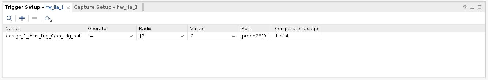

<table class="sphinxhide" width="100%">
 <tr width="100%">
    <td align="center"><h1>Versal™ NoC/DDRMC Design Flow Tutorials</h1>
    <a href="https://www.xilinx.com/products/design-tools/vivado.html">See Vivado™ Development Environment on xilinx.com</a>
    </td>
 </tr>
</table>

# Versal NoC Synthesizable Performance AXI Traffic Generator: Lab 4 - Running in Hardware

***Version: Vivado 2021.2***

## Lab 4 - Running in Hardware

Lab 4 builds off of Lab 3 - Traffic Shaping and shows how to modify a design so it can go from a simulation environment to running in hardware.

## Description of the Design

This design leverages the project from Lab 3 which targets a VCK190 evaluation board using the 64-Bit DDR4 interface at 3200 Mbps with two traffic generators running two different workloads. Additional debug signals are added so it is easier to see signs of life with the traffic generators and verify they are operating as expected.

## Building the Design

1. Copy and paste the pg381_synth_tg_lab_3.tcl and synth_tg_lab_3.csv files from Lab_3 to your pg381_synth_tg_labs working directory.
    * Open the pg381_synth_tg_lab_3.tcl file with a text editor.
    * Find the line:
     create_project project_1 myproj -part xcvc1902-vsva2197-2MP-e-S
    * Change it to:
     create_project Lab_4 Lab_4 -part xcvc1902-vsva2197-2MP-e-S
    * Save the changes.
    * Start a new Vivado IDE session.
    * Go to Tools and Run TCL script.
    * Target the pg381_synth_tg_lab_3.tcl file which was just modified and press OK.
    * The project will rebuild without errors if the files were modified correctly and placed in the same directory.
1. Open the block design and regenerate the layout.
    * Once the design has been rebuilt open the block design canvas by selecting Open Block Design under the Flow Navigator heading.
    * Right click on the canvas and select Regenerate Layout.
    * At this point the canvas should look exactly like it did at the end of Lab 3.

## Update the CSV Traffic Specification

1. Modify the CSV file to create an infinite loop while running in hardware.
   * Open the synth_tg_lab_3.csv file and save a new copy as synth_tg_lab_4.csv.
   * Insert a new line at the start of the command sequence, set the TG_NUM to 0, set the cmd field to START_LOOP, txn_count is INF, and loop_addr_incr_by value of 0.  The remaining fields can be blank.
   * Insert another PHASE_DONE after the last PHASE_DONE command for TG_NUM 0.
   * After this new PHASE_DONE command insert an END_LOOP command for TG_NUM 0 and loop_addr_incr_by value of 0.
   * The START_LOOP command starts the loop for TG 0 while the additional PHASE_DONE commands are used to synchronize TG 0 and TG 1.
   * At the start of the TG_NUM 1 sequence insert a new command with TG_NUM set to 1, the cmd set to START_LOOP, txn_count is INF, and loop_addr_incr_by value of 0.
   * After the last WAIT command for the TG 1 read sequence insert a PHASE_DONE command with TG_NUM 1.
   * After this new PHASE_DONE command insert an END_LOOP command with loop_addr_incr_by value of 0 with TG_NUM 1.
   * At this point the traffic generators are synchronized and will have an infinite loop where TG 0 goes first and then TG 1 goes after TG 0 finishes.
   * 
1. Target the new CSV file.
   * Go back to the IPI Canvas and point both Perf AXI TG 0 and Perf AXI TG 1 to the same CSV file by reconfiguring the IP and pointing to the new CSV file.
1. Under the Sources tab expand the Design Sources heading, right click on design_1.bd, and select Create HDL Wrapper...
   * Leave it as 'Let Vivado manage wrapper and auto-update' then press OK.
1. After the wrapper is created select the Generate Block Design option under the IP INTEGRATOR tab of the Flow Navigator.
   * When prompted select Global under Synthesis Options and press generate.

## Marking Debug Nets and Generating a Programmable Device Image
1. Run Synthesis after Generating Output Products is complete.
    * Once output products are generated press the Run Synthesis button under the Synthesis heading of the Flow Navigator.
    * Press OK when the synthesis prompt comes up.
1. Mark Debug Nets.
    * After synthesis is complete open the synthesized design when prompted.
    * The default view show have the Netlist tab showing.
    * 
    * Expand design_1, then perf_axi_tg_0, then expand Nets.
    * Find trigger_out, then right click, and select Mark Debug.
    * Find and highlight axi_wvalid, axi_wready, axi_wlast, axi_rvalid, axi_rready, axi_rlast, axi_bvalid, axi_bready, axi_awvalid, axi_awready, axi_arready, axi_arvalid, axi_arready, axi_rresp, and axi_bresp by holding the CTRL key and left clicking the mouse on each net.  After they are highlighted right click and select mark debug.
    * 
    * Perform the same steps for perf_axi_tg_1.
    * Find sim_trig_0, expand the Nets, and mark ph_trig_out as Debug.
1. Setup Debug.
    * On the left side under the Flow Navigator click on Set Up Debug.
    * Click Next on the first two screens.
    * On the ILA Core Options tab check the box for Advanced trigger.
    * 
    * Press Next, and then Finish on the final page.
1. Run Synthesis again.
    * After setting up the debug core run synthesis again by clicking Run Synthesis in the Flow Navigator.
    * When prompted to Save Project press Save.
    * When prompted with the Out of Date Design press OK.
    * When prompted to Save Constraints create a new file called debug_constraints, then press OK.
    * When prompted to Launch Runs press OK.
1. Generate Device Image.
    * After synthesis is complete select the option to Open Synthesized Design.
    * After the design is open press Generate Device Image at the bottom of the Flow Navigator.
    * When prompted with No Implementation Results Available press Yes.
    * Press OK at the Launch Runs screen.

## Running in Hardware
1. Once prompted at Device Image Generation Complete select the option to Open Hardware Manager.
1. Connect to the VCK190 Board.
1. Program the board with the PDI and LTX file from this design.
    * 
    * DDRMC_1 should have a PASS calibration status.
    * 
1. Monitor the traffic generator behavior with hw_ila_1.
    * Select the hw_ila_1 tab and maximize the window.
    * Select all the ILA nets and then press the minus button or delete key to remove them from the ILA window.
    * Add the ILA nets back with the plus button, select all the debug nets, and press OK.
    * 
    * Use the Run Trigger for ILA Core arrow to force a trigger and make sure the traffic generators are running.
    * 
    * 
1. Setup a trigger with the ph_trig_out signal.
    * Select the Trigger Setup - hw_ila_1 tab.
    * Press the plus button to add ILA signals.
    * Select design_1_i/sim_trig_0/ph_trig_out and press OK.
    * Change the Operator to !=.
    * Change the Value to 0.
    * 
1. Use the ILA trigger.
    * Press the Run Trigger for ILA Core arrow to use the trigger on ph_trig_out is not equal to 0.
    * Depending on when the trigger occurs you should see TG0 switching between Write and Read or switching between TG0 and TG1.
    * 
    * 

## Export Design Files
1. Export the Block Design.
    * Go back to the Block Design by selecting the Open Block Design tab under the Flow Navigator columns.
    * Go to File, Export, then Export Block Design.
    * Change the file name to pg381_synth_tg_lab_4.tcl.
    * Use this file to rebuild this project for Lab 4.
1.Modify the Block Design TCL script.
    * Navigate to the pg381_synth_tg_lab_4.tcl and open in a text editor.
    * Search for this line:
    CONFIG.USER_SYNTH_DEFINED_PATTERN_CSV
    * Change the file path to only have the CSV file, as follows:
      * CONFIG.USER_SYNTH_DEFINED_PATTERN_CSV {synth_tg_lab_4.csv} \
    * Make this modification for both TG instances.
    * This change allows for the CSV file to be automatically picked up when rebuilding the block design.
    * Find the line:
      * create_project project_1 myproj -part xcvc1902-vsva2197-2MP-e-S
    * Change it to:
      * create_project Lab_4 Lab_4 -part xcvc1902-vsva2197-2MP-e-S
1. Save a project archive.
    * Go to File, Project, and then Archive.
    * Name the archive Lab_4, check the box for Include configuration settings, and then press OK to generate the archive.
    * It is safe to ignore the Critical Warnings during the archiving process if they appear.

Copyright © 2020–2024 Advanced Micro Devices, Inc.

<a href="https://www.amd.com/en/corporate/copyright">Terms and Conditions</a>

