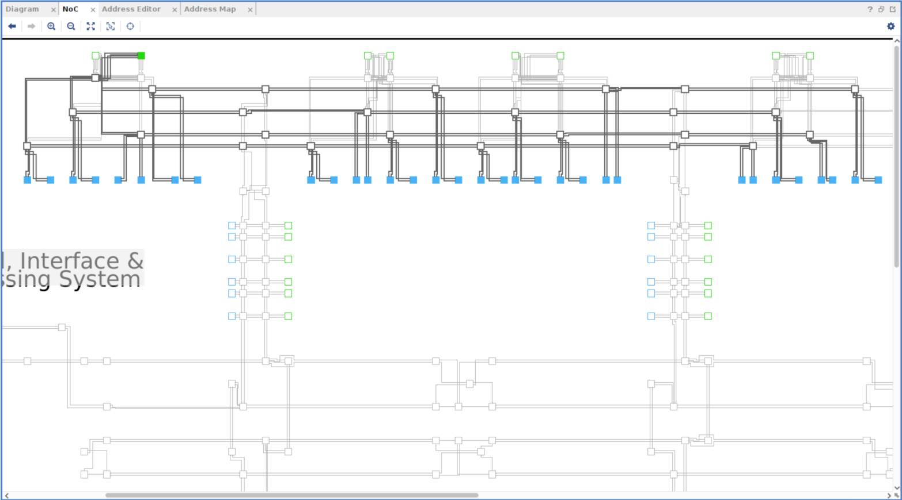

<table>
 <tr>
   <td align="center"><h1>Versal™ HBM Performance Tuning</h1>
   </td>
 </tr>
 <tr>
 <td align="center"><h1>Connectivity and QoS</h1>
 </td>
 </tr>
</table>

# Introduction

This module provides an overview of the process of tuning designs to get the best performance out of the NoC and HBM architecture in AMD Versal&trade; HBM devices. Utilizing a range of example designs, this module imparts knowledge of the performance tuning process involving NoC connectivity and quality of service (QoS). A thorough understanding of the NoC architecture is essential to ensure that the system is optimized to achieve maximum performance. This module begins with a basic example design, and later adjusts it to showcase the significance of connectivity and QoS in the NoC.

This module presumes that you have completed and understood the tutorials provided in the [Intro_Design_Flow](../../Intro_Design_Flow) section.

# Design

## Description of the Design

This design uses 32 Performance AXI Traffic Generators (TG). These TGs are connected to one HBM controller through one instance of AXI NoC IP. The TGs serve as AXI masters to the HBM controller. Each TG in the example design is writing and reading 80 KB of data. The read/write transactions have the following AXI attributes:
1. AxSIZE = 0x4 (16 bytes)
2. AxLEN = 0xff (256)

Each TG issues 20 transactions, following a linear addressing pattern. Therefore, the total transaction size for each TG equals the number of transactions multiplied by AxSIZE and AxLEN (that is, 20 x 16 bytes x 256 = 80 KB).  
                                                
16 TGs are targeting pseudo channel 0 of HBM controller 0 and 16 TGs are targeting pseudo channel 1 of HBM controller 0. Each TG is accessing a unique 512 KB of the HBM address space.

The design process consists of the following phases:

1. Traffic Spec
2. Defining CSV files to Control the Performance AXI Traffic Generator
3. Building and Simulating the Initial Design
4. Revising the Design to Address Shortcomings Observed in Simulation

## Traffic Spec

As mentioned above, this system has 32 TGs (TG0-TG31) accessing the HBM memory simultaneously, with each TG having the same bandwidth requirement. Each issue has 20 write transactions followed by 20 read transactions, with a data width of 16 bytes (AxSIZE) and a length of 256 beats (AxLEN). The goal is to maximize the achievable bandwidth of the HBM subsystem.

## CSV Files to Control the Performance AXI Traffic Generators

This design employs the Synthesizable TGs, with each TG assigned a unique CSV file. Every TG addresses a unique 512 KB of the HBM address space, achieved by configuring the **base_addr**, **high_addr**, and **axi_addr_offset** fields in the respective CSV files. This is explained further in detail later in this section. The following image depicts the configuration used in the CSV file for TG0. Each TG has a similar configuration, differing only in the **TG_NUM**, **base_addr**, **high_addr**, and **axi_addr_offset** fields.


A total of 16 TGs are configured to access pseudo channel 0, while the remaining 16 TGs access pseudo channel 1. For the TGs addressing pseudo channel 0 of HBM controller 0, the **base_addr** (column J) in their respective CSV files is set to **0x40_0000_0000**, and the **high_addr** (column K) is set to **0x40_3FFF_FFFF**. The **axi_addr_offset** (column M) varies for each TG, as they address unique address spaces. The hex equivalent of 512 KB, **0x8_0000**, is added as an address offset for each TG accessing the same pseudo channel.

Similarly, for TGs accessing pseudo channel 1 of HBM controller 0, the **base_addr** (column J) is set to **0x40_4000_0000**, the **high_addr** (column K) is set to **0x40_7FFF_FFFF**, and column M follows the same format as for pseudo channel 0.

Each TG performs 20 writes and reads. In the CSV file, the **txn_count** field (column C) is set to 20 for both the write and read transactions. For a burst size (AxSIZE) of 16 bytes, column O is set to **0x4**. A burst length (AxLEN) of 256 corresponds to column N being set to **0xFF**. To understand the remaining fields in the CSV, refer to [PG381 Performance AXI Traffic Generator Product Guide](https://docs.amd.com/r/en-US/pg381-perf-axi-tg-spec).

The address ranges targeted by the TGs are summarized in the following table:

| TG Number | Base Address | High Address |    
|-----------|--------------|--------------|    
|     0     |0x40_0000_0000|0x40_0007_FFFF|    
|     1     |0x40_0008_0000|0x40_000F_FFFF|    
|     2     |0x40_0010_0000|0x40_0017_FFFF|    
|     3     |0x40_0018_0000|0x40_001F_FFFF|    
|     4     |0x40_0020_0000|0x40_0027_FFFF|    
|     5     |0x40_0028_0000|0x40_002F_FFFF|    
|     6     |0x40_0030_0000|0x40_0037_FFFF|    
|     7     |0x40_0038_0000|0x40_003F_FFFF|    
|     8     |0x40_0040_0000|0x40_0047_FFFF|    
|     9     |0x40_0048_0000|0x40_004F_FFFF|    
|     10     |0x40_0050_0000|0x40_0057_FFFF|   
|     11     |0x40_0058_0000|0x40_005F_FFFF|   
|     12     |0x40_0060_0000|0x40_0067_FFFF|   
|     13     |0x40_0068_0000|0x40_006F_FFFF|   
|     14     |0x40_0070_0000|0x40_0077_FFFF|   
|     15     |0x40_0078_0000|0x40_007F_FFFF| 
|     16     |0x40_4000_0000|0x40_4007_FFFF|
|     17     |0x40_4008_0000|0x40_400F_FFFF|
|     18     |0x40_4010_0000|0x40_4017_FFFF|
|     19     |0x40_4018_0000|0x40_401F_FFFF|
|     20     |0x40_4020_0000|0x40_4027_FFFF|
|     21     |0x40_4028_0000|0x40_402F_FFFF|
|     22     |0x40_4030_0000|0x40_4037_FFFF|
|     23     |0x40_4038_0000|0x40_403F_FFFF|
|     24     |0x40_4040_0000|0x40_4047_FFFF|
|     25     |0x40_4048_0000|0x40_404F_FFFF|
|     26     |0x40_4050_0000|0x40_4057_FFFF|
|     27     |0x40_4058_0000|0x40_405F_FFFF|
|     28     |0x40_4060_0000|0x40_4067_FFFF|
|     29     |0x40_4068_0000|0x40_406F_FFFF|
|     30     |0x40_4070_0000|0x40_4077_FFFF|
|     31     |0x40_4078_0000|0x40_407F_FFFF|
 
## Building and Simulating the Initial Design

### Running Block Automation

1. Create a new project with the **xcvh1582-vsva3697-2MP-e-S** part, and create a new block design.
2. Add one AXI NoC instance, and run **Block Automation** with the following settings:
   * Memory Controller Type: HBM
   * Control, Interface and Processing System: Checked
   * AXI Traffic Generator: None
   * HBM AXI Slave Interfaces (AXI Traffic Generators for HBM): 32
   * External Sources: None
   * AXI BRAM Controller: None
   * HBM Memory Size (GB): 2
   * AXI Performance Monitor for PL-2-NOC AXI-MM pins: Checked
   * AXI Clk Source: New/Reuse Clocking Wizard
   
 3. Run **Connection Automation**, selecting **All Automation**. 
 4. Run **Connection Automation** again and select **Reset Source** as **/versal_cips_0/pl0_resetn(ACTIVE_LOW)**.
 5. Regenerate the layout.
 
 Alternatively, run the following script in the Tcl console after creating the project to build the block design:
 ```tcl console
source ./scripts/config_build_bd.tcl
```
 
 The AXI clock is set to 400 MHz as a part of the automation flow.
 
### Configuring the AXI NoC IP

1. Double-click on the **axi_noc_0** instance to display the configuration wizard.
2. On the General tab, select the following:
   * The **Number of Channels and Memory Size** is set to **1 (2GB)** under Memory Controllers - HBM. This selection indicates the number of integrated HBM controllers connected to this axi_noc instance.
   * The **Number of HBM AXI PL Slave Interfaces** is set to 32 under Memory Controllers - HBM. This selection indicates the number of AXI slave interfaces, which are used to pass the traffic conforming to AXI4 protocol in and out of the NoC. In this design, the AXI TGs transact with the AXI NoC IP using these ports.
3. On the Connectivity tab, match the settings shown in the following figure. Click on **Disconnect HBM** to erase the connectivity canvas. Each HBM Channel has two pseudo channels (PC0 and PC1) with two ports each. Use port 0 to connect the first 16 HBM_AXI ports (HBM00_AXI - HBM15_AXI) to HBM0_PC0. Similarly, use port 2 to connect the last 16 HBM_AXI ports (HBM16_AXI - HBM31_AXI) to HBM0_PC1. 


4. Leave the rest of the settings at default.

Alternatively, run the provided script in the Tcl console to configure the AXI NoC IP:
```tcl console
source ./scripts/config_axi_noc_ip_base.tcl
```
The above script contains the Tcl commands obtained by following the previously mentioned steps. 


### Configuring the Traffic Generators
 
 1. Double click on the **noc_tg** instance to display the configuration wizard.
 2. On the Configuration tab, make the following selections:
    * Set **Performance TG for Simulation** to **Synthesizable**.
 3. On the Synthesizable TG Options tab, select the following:
    * Under **Path to User Defined Pattern File (CSV) for Synthesizable TG**, select the `tg_synth_wr_followed_by_rd_lin_0_offset.csv` file.
    * Uncheck the box next to **Insert VIO for debug status signals**.
 4. Follow the same steps for all the TGs in the design. Each TG has its unique CSV file to be programmed. For example, the CSV file `tg_synth_wr_followed_by_rd_lin_1_offset.csv` should be used for **noc_tg_1**, `tg_synth_wr_followed_by_rd_lin_2_offset.csv` should be used for **noc_tg_2**, and so on.

Alternatively, run the provided script in the Tcl console to correctly configure all the TGs:
```tcl console
source ./scripts/config_tgs_base.tcl
```
 
### Running Simulation
 
1. In the **Address Editor**, select **Assign All** addresses. The address editor should appear as follows.


2. Validate the design. The NoC view should appear as follows. If the NoC view does not appear, it can be opened through *Window->NoC*.



3. Create an HDL wrapper for the block design.
4. Simulate the design. Under *Settings->Simulation->Simulation Tab*, ensure that the option to log all signals is checked and the simulation run time is set to 2ms to ensure simulation completion, as shown in the following figure.


Alternatively, run the following commands in the Tcl console to set up the design for simulation:

```tcl console
assign_bd_address
validate_bd_design
make_wrapper -files [get_files ./project_1/project_1.srcs/sources_1/bd/design_1/design_1.bd] -top
add_files -norecurse ./project_1/project_1.gen/sources_1/bd/design_1/hdl/design_1_wrapper.v
set_property -name {xsim.simulate.runtime} -value {2ms} -objects [get_filesets sim_1]
set_property -name {xsim.simulate.log_all_signals} -value {true} -objects [get_filesets sim_1]
```
 
The simulation should take about 30 minutes to complete.

## Analyzing the Results
 
The Tcl console displays the performance results of the simulations. The following is a snapshot of how the bandwidth measurements are displayed per TG. The results can exhibit slight variations compared to those shown in the following figure.  
 
 

The following table summarizes the results across all TGs:
 
| TG Number | Read Performance (MB/s) | Write Performance (MB/s) |    
|-----------|------------------|-------------------|    
|     0      | 636  | 805  |    
|     1      | 1218 | 713  |    
|     2      | 2329 | 1823 |    
|     3      | 3250 | 1658 |    
|     4      | 953  | 569  |    
|     5      | 1932 | 469  |    
|     6      | 2306 | 1821 |    
|     7      | 1158 | 712  |    
|     8      | 998  | 540  |    
|     9      | 1529 | 501  |    
|     10     | 1239 | 644  |   
|     11     | 1560 | 804  |   
|     12     | 998  | 539  |   
|     13     | 1759 | 568  |   
|     14     | 1226 | 643  |   
|     15     | 3207 | 900  | 
|     16     | 1335 | 498  |
|     17     | 1176 | 608  |
|     18     | 1316 | 499  |
|     19     | 2149 | 1240 |
|     20     | 1538 | 502  |
|     21     | 3864 | 899  |
|     22     | 956  | 558  |
|     23     | 1582 | 470  |
|     24     | 2289 | 1248 |
|     25     | 1572 | 469  |
|     26     | 847  | 608  |
|     27     | 1849 | 469  |
|     28     | 2155 | 1241 |
|     29     | 2262 | 1245 |
|     30     | 956  | 558  |
|     31     | 3243 | 1654 |

By default, the AXI clock is set to 400 MHz. With an AxSIZE of 16 bytes, the maximum theoretical bandwidth for read and write transactions should be 6400 MB/s or 6.4 GB/s (400 MHz x 16 bytes). However, upon examining the results in the above table, it is evident that the performance falls significantly short of this theoretical maximum.

Average write bandwidth per TG: 827 MB/s

Average read bandwidth per TG: 1731 MB/s

Two main factors prevent the design from reaching the theoretical maximum.
 
 1. Inefficient memory space management
 2. Incorrect read/write bandwidth and burst length settings in the QoS tab of the AXI NoC IP.
 
 ### Inefficient Memory Space Management
 
The total data width of an HBM stack is 1024 bits, divided across eight channels of 128 bits each. Each channel is serviced by a single HBM controller accessing the HBM in pseudo channel mode, featuring two semi-independent 64 bit data channels with a shared command/address/control (CAC) bus. If all TGs attempt to access the address space across a single HBM controller, the design shares a 128 bit data bus, preventing the memory subsystem from utilizing the full available bandwidth.

Additionally, configuring all TGs to access a single HBM controller results in shared horizontal routing in the NoC that limits the available bandwidth and increases latency. For more information about NoC routing in HBM designs, refer to the "Routing Use Cases and HBM Subsystems" section in [PG313 Versal Adaptive SoC Programmable Network on Chip and Integrated Memory Controller](https://docs.amd.com/r/en-US/pg313-network-on-chip).

The traffic requirement specifies that each TG addresses a unique 512 KB of the HBM address space. The current setup accesses 32 unique 512 KB address spaces across only a 2 GB range managed by one controller. Each stack has eight controllers and a total 16 GB of address space. Distributing the address space across all controllers would enhance memory access efficiency. This optimized design is expanded across a single HBM stack, with two TGs accessing each pseudo channel, thereby efficiently utilizing the bandwidth and memory space with 32 TGs and 16 pseudo channels.
 
  
###  Incorrect Read/Write Bandwidth and Burst Length set in the QoS tab of the AXI NoC IP
 
 Double click on the AXI NoC IP to open the configuration wizard. Click on the QoS tab and select the advanced checkbox. The bandwidth for different paths is set to 100 or 500 MBps and the burst length is set to 4. Observe that in the base design the bandwidth and burst length settings do not match the traffic profile. 
 
 The total available bandwidth across one HBM controller or two pseudo channels is as follows:

>  (64 bits per pseudo channel) x (2 pseudo channels per memory controller) x 1600 MHz x 2 (DDR)
 
 This results in 51,200 MB/s of bandwidth across one HBM controller or 25,600 MB/s of bandwidth across one pseudo channel. The AxSIZE of the transactions is set to 16 bytes and the AXI clock is set to 400 MHz. As a result, the maximum bandwidth from one TG is restricted to 6400 MB/s. This value should be programmed in the QoS tab of the AXI NoC IP for each path.
 
 ## Building and Simulating the Optimized Design
 
 In this section, the design is modified to address the issues outlined in the previous section. The first step is to efficiently utilize the available memory space. Instead of consolidating the design in a single memory controller, this modified design utilizes all eight controllers and 16 pseudo channels in one HBM stack. As a result, the addressing space expands to a total of 16 GB. Change the **Number of Channels and Memory Size** to **8 (16GB)** on the general tab of the AXI NoC IP as shown in the following figure.   
 
 
 
 On the connectivity tab of the AXI NoC IP, click on **Disconnect HBM** and then click on **Connect HBM 1:1**. The connectivity tab should appear as shown in the following figure.
 
 

As it can be seen in the figure, there are two AXI master ports connected to one HBM pseudo channel. This modified design further splits the address space within a pseudo channel using the same 512 KB offset discussed earlier. For example, HBM0 - PC0 is split into two address spaces. The TG connected to HBM00_AXI addresses the space beginning at offset **0x0**, whereas the TG connected to HBM01_AXI addresses the space beginning at offset **0x8_0000** within PC0. This is configured in the CSV file used to profile the traffic from the TGs. This is covered in further detail in the following section.

The next step involves accurately configuring the QoS settings in the AXI NoC IP to match the incoming traffic from the TGs. As stated earlier, the maximum theoretical read and write bandwidth per connection is 6.4 GB/s (400 MHz x 16 bytes) or 6400 MB/s. In the QoS tab of the AXI NoC IP, set **Bandwidth Read (MB/s)** and **Bandwidth Write (MB/s)** for all of the connections to **6400**. Select the **Advanced** checkbox to configure the burst length of the traffic. Set **Read Ave Burst Length** and **Write Ave Burst Length** to **256** for all connections, as shown in the following figure. Click **OK** to close the AXI NoC IP.


Alternatively, run the provided script in the Tcl console to configure the AXI NoC IP:
```tcl console
source ./scripts/config_axi_noc_ip_mod.tcl
```

The new address ranges targeted by the TGs are summarized in the following table:

| TG Number | Base Address | High Address |    
|-----------|--------------|--------------|    
|     0     |0x40_0000_0000|0x40_0007_FFFF|    
|     1     |0x40_0008_0000|0x40_000F_FFFF|    
|     2     |0x40_4000_0000|0x40_4007_FFFF|    
|     3     |0x40_4008_0000|0x40_400F_FFFF|    
|     4     |0x40_8000_0000|0x40_8007_FFFF|    
|     5     |0x40_8008_0000|0x40_800F_FFFF|    
|     6     |0x40_C000_0000|0x40_C007_FFFF|    
|     7     |0x40_C008_0000|0x40_C00F_FFFF|    
|     8     |0x41_0000_0000|0x41_0007_FFFF|    
|     9     |0x41_0008_0000|0x41_000F_FFFF|    
|     10     |0x41_4000_0000|0x41_4007_FFFF|   
|     11     |0x41_4008_0000|0x41_400F_FFFF|   
|     12     |0x41_8000_0000|0x41_8007_FFFF|   
|     13     |0x41_8008_0000|0x41_800F_FFFF|   
|     14     |0x41_C000_0000|0x41_C007_FFFF|   
|     15     |0x41_C008_0000|0x41_C00F_FFFF| 
|     16     |0x42_0000_0000|0x42_0007_FFFF|
|     17     |0x42_0008_0000|0x42_000F_FFFF|
|     18     |0x42_4000_0000|0x42_4007_FFFF|
|     19     |0x42_4008_0000|0x42_400F_FFFF|
|     20     |0x42_8000_0000|0x42_8007_FFFF|
|     21     |0x42_8008_0000|0x42_800F_FFFF|
|     22     |0x42_C000_0000|0x42_C007_FFFF|
|     23     |0x42_C008_0000|0x42_C00F_FFFF|
|     24     |0x43_0000_0000|0x43_0007_FFFF|
|     25     |0x43_0008_0000|0x43_000F_FFFF|
|     26     |0x43_4000_0000|0x43_4007_FFFF|
|     27     |0x43_4008_0000|0x43_400F_FFFF|
|     28     |0x43_8000_0000|0x43_8007_FFFF|
|     29     |0x43_8008_0000|0x43_800F_FFFF|
|     30     |0x43_C000_0000|0x43_C007_FFFF|
|     31     |0x43_C008_0000|0x43_C00F_FFFF|

The CSV file must be updated to reflect the design alterations. Adjust the **base_addr** and **high_addr** fields to match the new address ranges displayed in the address editor tab. The **axi_addr_offset** field must be modified to account the offset within a pseudo channel as well, per the preceding table. Alternatively, the modified CSV files are provided that can be used with this design.

Run the provided script in the Tcl console to reconfigure the TGs:
```tcl console
source ./scripts/config_tgs_mod.tcl
```

Having made all necessary changes to the design, the next step is to reset the output products, validate the block design, and save it. Reset the output products of the block design by right-clicking on **design_1** clicking on **Reset Output Products** as shown in the following figure.


Make sure to reassign all the addresses from the address editor window. This can be easily accomplished by selecting **Unassign All** followed by **Assign All**.


As illustrated in the following figure, the memory space is distributed across the entire HBM stack, preventing the shared horizontal routing present in the previous design iteration. With these adjustments, a point-to-point (PTP) routing configuration has been achieved, avoiding congestion along the horizontal NoC resources, and thereby optimizing efficiency. Though the TGs utilize the same set of NMUs to interact with the memory, the memory space extends across eight HBM controllers, allowing the NoC compiler to achieve an optimal routing solution.


After saving the block design, run the simulation. The simulation should take about 30 minutes to complete.

Alternatively, run the following commands in the Tcl console to set up the design for simulation:

```tcl console
reset_target all [get_files ./project_1/project_1.srcs/sources_1/bd/design_1/design_1.bd]
delete_bd_objs [get_bd_addr_segs] [get_bd_addr_segs -excluded]
assign_bd_address
validate_bd_design
save_bd_design
```

The performance results of the simulation are displayed in the Tcl console.
 
The following table summarizes the results across all TGs:

| TG Number | Read Performance (MB/s) | Write Performance (MB/s) |    
|-----------|------------------|-------------------|    
|     0    	|       6352      	|       5529      	 |
|     1    	|       5995      	|       5431      	 |
|     2    	|       6287      	|       5488      	 |
|     3    	|       6148      	|       5444      	 |
|     4    	|       6268      	|       5421      	 |
|     5    	|       6350      	|       5459      	 |
|     6    	|       6306      	|       5412      	 |
|     7    	|       6338      	|       5483      	 |
|     8    	|       6330      	|       5467      	 |
|     9    	|       6215      	|       5450      	 |
|     10    |       6350      	|       5489      	 |
|     11    |       6196      	|       5463      	 |
|     12    |       6330      	|       5467      	 |
|     13    |       6215      	|       5450      	 |
|     14    |       6350      	|       5489      	 |
|     15    |       6196      	|       5463      	 |
|     16    |       5990      	|       5426      	 |
|     17    |       6048      	|       5435      	 |
|     18    |       6344      	|       5466      	 |
|     19    |       6239      	|       5454      	 |
|     20    |       6341      	|       5550      	 |
|     21    |       6196      	|       5435      	 |
|     22    |       6305      	|       5434      	 |
|     23    |       6283      	|       5481      	 |
|     24    |       6285      	|       5468      	 |
|     25    |       6069      	|       5416      	 |
|     26    |       6314      	|       5411      	 |
|     27    |       6302      	|       5476      	 |
|     28    |       6341      	|       5471      	 |
|     29    |       6227      	|       5454      	 |
|     30    |       5996      	|       5403      	 |
|     31    |       6016      	|       5406      	 |
 
Averaging the bandwidth across all TGs in the modified design:

Average write bandwidth per TG: 5456 MB/s

Average read bandwidth per TG: 6235 MB/s

Following is the comparison of the results of the base design with the optimized design:

| TG Number | Base Design Read Performance (MB/s) | Optimized Design Read Performance (MB/s) | Base Design Write Performance (MB/s) | Optimized Design Write Performance (MB/s) |
|-----------|------------------|-------------------|------------------|-------------------|    
|     0      | 636  |       6352      	| 805  |       5529      	 |   
|     1      | 1218 |       5995      	| 713  |       5431      	 |   
|     2      | 2329 |       6287      	| 1823 |       5488      	 |   
|     3      | 3250 |       6148      	| 1658 |       5444      	 |   
|     4      | 953  |       6268      	| 569  |       5421      	 |   
|     5      | 1932 |       6350      	| 469  |       5459      	 |   
|     6      | 2306 |       6306      	| 1821 |       5412      	 |   
|     7      | 1158 |       6338      	| 712  |       5483      	 |   
|     8      | 998  |       6330      	| 540  |       5467      	 |   
|     9      | 1529 |       6215      	| 501  |       5450      	 |   
|     10     | 1239 |       6350      	| 644  |       5489      	 |  
|     11     | 1560 |       6196      	| 804  |       5463      	 |  
|     12     | 998  |       6330      	| 539  |       5467      	 |  
|     13     | 1759 |       6215      	| 568  |       5450      	 |  
|     14     | 1226 |       6350      	| 643  |       5489      	 |  
|     15     | 3207 |       6196      	| 900  |       5463      	 |
|     16     | 1335 |       5990      	| 498  |       5426      	 |
|     17     | 1176 |       6048      	| 608  |       5435      	 |
|     18     | 1316 |       6344      	| 499  |       5466      	 |
|     19     | 2149 |       6239      	| 1240 |       5454      	 |
|     20     | 1538 |       6341      	| 502  |       5550      	 |
|     21     | 3864 |       6196      	| 899  |       5435      	 |
|     22     | 956  |       6305      	| 558  |       5434      	 |
|     23     | 1582 |       6283      	| 470  |       5481      	 |
|     24     | 2289 |       6285      	| 1248 |       5468      	 |
|     25     | 1572 |       6069      	| 469  |       5416      	 |
|     26     | 847  |       6314      	| 608  |       5411      	 |
|     27     | 1849 |       6302      	| 469  |       5476      	 |
|     28     | 2155 |       6341      	| 1241 |       5471      	 |
|     29     | 2262 |       6227      	| 1245 |       5454      	 |
|     30     | 956  |       5996      	| 558  |       5403      	 |
|     31     | 3243 |       6016      	| 1654 |       5406      	 |

The following table compares the average bandwidth across all TGs in both the base design and the optimized design:

| Base Design Average Read Performance (MB/s) | Optimized Design Average Read Performance (MB/s) | Base Design Average Write Performance (MB/s) | Optimized Design Average Write Performance (MB/s) |
|-----------|------------------|-------------------|-------------------|    
| 1731 |       6235      	| 827  |       5456      	 | 

The results demonstrate how efficiently utilizing the memory space and optimizing QoS settings to match the traffic can enhance the overall HBM subsystem performance. The bandwidth is also evenly distributed across all connections. This tutorial highlights the importance of providing accurate information to the NoC compiler to achieve an optimal routing solution.


<hr class="sphinxhide"></hr>

<p class="sphinxhide" align="center"><sub>Copyright © 2024 Advanced Micro Devices, Inc.</sub></p>

<p class="sphinxhide" align="center"><sup><a href="https://www.amd.com/en/corporate/copyright">Terms and Conditions</a></sup></p>