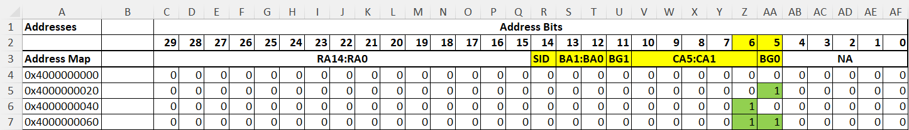
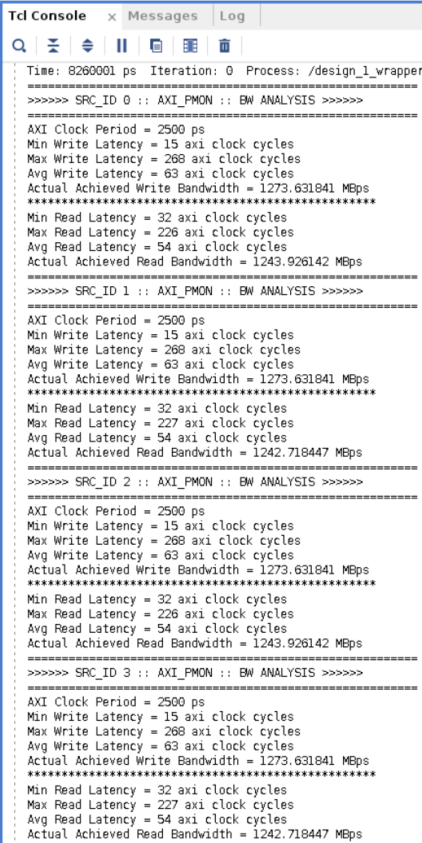

<table>
 <tr>
   <td align="center"><h1>Versal™ HBM Performance Tuning</h1>
   </td>
 </tr>
 <tr>
 <td align="center"><h1>Address Mapping</h1>
 </td>
 </tr>
</table>

# Introduction

In this module, the impact of various traffic patterns on the performance of the HBM subsystem is examined. Start by testing a design with a linear access pattern using the default address mapping in the memory controller. After evaluating this setup's performance, switch to random accesses while keeping the default address mapping to compare the results. Any performance changes are analyzed for potential causes. Furthermore, alternative address mappings for possible performance improvements and verifying the results through simulations are explored. This process emphasizes how DRAM bottlenecks affect performance and offers solutions for systems designers to tackle these issues.

This module presumes that users have completed and understood the tutorials provided in the [Intro_Design_Flow](../../Intro_Design_Flow) and [Module_01_QoS_and_Connectivity](../Module_01_QoS_and_Connectivity) sections.

# Design

## Description of the Design

This design uses four Performance AXI Traffic Generators (TG). These TGs are connected to two HBM controllers through one instance of the AXI NoC IP. The TGs serve as AXI masters to the HBM controller. Each TG in the example design is performing read and write transactions with the following AXI attributes:
1. AxSIZE = 0x5 (32 bytes)
2. AxLEN = 0x3 (4)

Each TG targets a distinct pseudo channel within the HBM. The design implements two HBM controllers and hence, four pseudo channels. As a result, TG0 accesses pseudo channel 0 of HBM controller 0, TG1 accesses pseudo channel 1 of HBM controller 0, TG2 accesses pseudo channel 0 of HBM controller 1, and TG3 accesses pseudo channel 1 of HBM controller 1. Each TG is accessing a unique address space in the HBM array.

While the traffic patterns are varied across different test scenarios, the number of TGs and the total transaction size remain consistent throughout all the designs.

This module consists of three parts:

1. Linear Traffic with Default HBM Controller Address Mapping
2. Buffered Random Traffic with Default HBM Controller Address Mapping
3. Buffered Random Traffic with Modified HBM Controller Address Mapping


## Part 1 - Linear Traffic with Default HBM Controller Address Mapping 

The design process in this section consists of the following phases:

1. Traffic Spec
2. Defining CSV Files to Control the Performance AXI Traffic Generator
3. Building and Simulating the Design

### Traffic Spec

This design employs four instances of the Performance AXI Traffic Generator to access HBM memory, with each TG having the same bandwidth requirement. Each TG issues 1000 writes followed by 1000 read transactions, with a data width of 32 bytes (AxSIZE) and a length of 4 beats (AxLEN). The goal is to measure the bandwidth of the HBM subsystem with default address map settings.

### Defining CSV Files to Control the Performance AXI Traffic Generator

This design employs the Synthesizable TGs. Each TG is assigned a separate CSV file and addresses a unique 6 KB of the HBM address space across different pseudo channels. This is achieved by setting the **base_addr** and **high_addr** fields of the respective CSV files. The following image shows the configuration used in the CSV file to define the traffic from TG0. Each TG has a similar configuration, differing only in the **TG_NUM**, **base_addr**, and **high_addr** fields.


TG0 is configured to access pseudo channel 0 of HBM controller 0, which is done by setting the appropriate fields in the CSV file used to configure traffic for the traffic generator. The **base_addr** (column J) is set to **0x40_0000_0000**, and the **high_addr** (column K) is set to **0x40_3FFF_FFFF**. Similarly, the CSV file for TG1 is configured to access pseudo channel 1 of HBM controller 0, with the **base_addr** (column J) set to **0x40_4000_0000** and the **high_addr** (column K) set to **0x40_7FFF_FFFF**. The **base_addr** and **high_addr** fields for the CSV configuring traffic for TG2 are set to **0x40_8000_0000** and **0x40_BFFF_FFFF**, respectively. Likewise, the **base_addr** and **high_addr** fields for the CSV configuring traffic for TG3 are set to **0x40_C000_0000** and **0x40_FFFF_FFFF**, respectively.

Each TG performs 1000 writes and reads. In the CSV file, the **txn_count** field (column C) is set to **1000** for both the write and read transactions. To ensure that the address is incremented linearly between transactions, the **addr_incr_by** field (column L) is set to **auto_incr**. For a burst size (AxSIZE) of 32 bytes, column O is set to **0x5**. A burst length (AxLEN) of four corresponds to column N being set to **0x3**. To understand the remaining fields in the CSV, refer to [PG381 Performance AXI Traffic Generator Product Guide](https://docs.amd.com/r/en-US/pg381-perf-axi-tg-spec).

### Building and Simulating the Design

1. As described earlier in the previous NOC_HBM tutorials, create a new project with the **xcvh1582-vsva3697-2MP-e-S** part, and create a new block design.
2. Add one AXI NoC instance, and run **Block Automation**, with the following settings:
   * Memory Controller Type: HBM
   * Control, Interface and Processing System: Checked
   * AXI Traffic Generator: None
   * HBM AXI Slave Interfaces (AXI Traffic Generators for HBM): 4
   * External Sources: None
   * AXI BRAM Controller: None
   * HBM Memory Size (GB): 4
   * AXI Performance Monitor for PL-2-NOC AXI-MM pins: Checked
   * AXI Clk Source: New/Reuse Clocking Wizard
   
 3. Run **Connection Automation**, selecting **All Automation**.
 4. Run **Connection Automation** again and select **Reset Source** as **/versal_cips_0/pl0_resetn(ACTIVE_LOW)**.
 5. Regenerate the layout.
 
 Alternatively, run the following script in the Tcl console after creating the project to build the block design:
```tcl console
source ./scripts/module2_part1_build_bd.tcl
```
 
 The AXI clock is set to 400MHz as a part of the automation flow.

### Configuring the AXI NoC IP

1. Double click on the **axi_noc_0** instance to display the configuration wizard.
2. On the General tab, make the following selections:
   * The **Number of Channels and Memory Size** is set to **2 (4GB)** under Memory Controllers - HBM. This selection indicates the number of integrated HBM controllers connected to this axi_noc_instance.
   * The **Number of HBM AXI PL Slave Interfaces** is set to **4** under Memory Controllers - HBM. This selection indicates the number of AXI Slave interfaces which are used to pass the traffic conforming to AXI4 protocol in and out of the NoC. In this design, the AXI TGs transact with the AXI NoC IP using these ports.
3. On the Connectivity tab, match the settings shown in the following figure. Click on **Disconnect HBM** to erase the connectivity canvas. Each HBM Channel has two pseudo channels (PC0 and PC1) with two ports each. Use port 0 to connect the HBM00_AXI to HBM0_PC0, port 2 to connect HBM01_AXI to HBM0_PC1, port 0 to connect HBM02_AXI to HBM1_PC0, and port 2 to connect HBM03_AXI to HBM1_PC1.


4. On the QoS tab, set **Bandwidth Read (MB/s)** and **Bandwidth Write (MB/s)** to **12800** MB/s. Select the **Advanced** checkbox to configure the burst length of the traffic. Set **Read Ave Burst Length** and **Write Ave Burst Length** to **4**. 
5. Leave the rest of the settings at default.

Alternatively, run the following commands in the Tcl console to configure the AXI NoC IP:
```tcl console
set_property -dict [list CONFIG.CONNECTIONS {HBM0_PORT0 {read_bw {12800} write_bw {12800} read_avg_burst {4} write_avg_burst {4}}}] [get_bd_intf_pins /axi_noc_0/HBM00_AXI]
set_property -dict [list CONFIG.CONNECTIONS {HBM0_PORT2 {read_bw {12800} write_bw {12800} read_avg_burst {4} write_avg_burst {4}}}] [get_bd_intf_pins /axi_noc_0/HBM01_AXI]
set_property -dict [list CONFIG.CONNECTIONS {HBM1_PORT0 {read_bw {12800} write_bw {12800} read_avg_burst {4} write_avg_burst {4}}}] [get_bd_intf_pins /axi_noc_0/HBM02_AXI]
set_property -dict [list CONFIG.CONNECTIONS {HBM1_PORT2 {read_bw {12800} write_bw {12800} read_avg_burst {4} write_avg_burst {4}}}] [get_bd_intf_pins /axi_noc_0/HBM03_AXI]
```
### Configuring the Traffic Generators
 
 1. Double click on the **noc_tg** instance to display the configuration wizard.
 2. On the Configuration tab, make the following selections:
    * Set **Performance TG for Simulation** to **Synthesizable**.
 3. On the Synthesizable TG Options tab, make the following selections:
    * Under **Path to User Defined Pattern File (CSV) for Synthesizable TG**, select the `module2_part1_tg_synth_wr_followed_by_rd_lin_0.csv` file.
    * Uncheck the box next to **Insert VIO for debug status signals**.
 4. Follow the same steps for all the TGs in the design. Each TG has its unique CSV file to be programmed. The CSV file `module2_part1_tg_synth_wr_followed_by_rd_lin_1.csv` should be used for **noc_tg_1**, `module2_part1_tg_synth_wr_followed_by_rd_lin_2.csv` should be used for **noc_tg_2**, and `module2_part1_tg_synth_wr_followed_by_rd_lin_3.csv` should be used for **noc_tg_3**.

Alternatively, run the provided script in the Tcl console to correctly configure all the TGs:
```tcl console
source ./scripts/module2_part1_config_tgs_lin.tcl
```
### Running Simulation
 
1. In the **Address Editor**, **Assign All** addresses.
2. Validate the design. The NoC view should appear as follows. If the NoC view does not appear, click on **Windows->NoC**.


3. Create an HDL wrapper for the block design.
4. Simulate the design. Under **Settings->Simulation->Simulation Tab**, ensure that the option to log all signals is checked and the simulation run time is set to 2ms to ensure simulation completion, as shown in the following figure.


Alternatively, run the following commands in the Tcl console before launching the simulation:

```tcl console
assign_bd_address
validate_bd_design
make_wrapper -files [get_files ./project_1/project_1.srcs/sources_1/bd/design_1/design_1.bd] -top
add_files -norecurse ./project_1/project_1.gen/sources_1/bd/design_1/hdl/design_1_wrapper.v
set_property -name {xsim.simulate.runtime} -value {2ms} -objects [get_filesets sim_1]
set_property -name {xsim.simulate.log_all_signals} -value {true} -objects [get_filesets sim_1]
```
 
The simulation should take about 30 minutes to complete.

The Tcl console displays the performance results of the simulations. The following is a snapshot of how the bandwidth measurements are displayed per TG.
 
 

The following table summarizes the results across all TGs:
 
| TG Number | Read Performance (MB/s) | Write Performance (MB/s) |    
|-----------|------------------|-------------------|    
|     0     | 11822 | 10806 |    
|     1     | 11792 | 10815 |    
|     2     | 11822 | 10806 |    
|     3     | 11792 | 10815 |    

The theoretical maximum bandwidth for each TG can be calculated using the AxSIZE of the transactions and the configured AXI clock frequency. With an AxSIZE of 32 bytes at a frequency of 400 MHz, the theoretical maximum bandwidth for each TG is 12,800 MBps (32B x 400 MHz). This design, using a linear traffic pattern, achieves an average read bandwidth of 11,800 MBps and a write bandwidth of 10,800 MBps across each TG. While the purpose of this simulation is not to demonstrate the maximum bandwidth that the HBM subsystem can achieve, the results show that the default address map is suitable for linear traffic. Due to DRAM REFRESH requirements and other controller overheads, the theoretical maximum bandwidth of 12,800MBps cannot be achieved.

## Part 2 - Buffered Random Traffic with Default HBM Controller Address Mapping

The design process in this section consists of the following phases:

1. Traffic Spec
2. Defining CSV files to control the Performance AXI Traffic Generator
3. Building and simulating the design
4. Analyzing the Results

### Traffic Spec

Similar to the traffic spec in the previous design, this design has four instances of the Performance AXI Traffic Generator accessing the HBM memory. Each TG has an identical bandwidth requirement and issues 100 write transactions followed by 100 read transactions. Each transaction is 32 bytes wide (AxSIZE) with an AxLEN of 0. The goal is to maximize the achievable bandwidth of the HBM subsystem.

Instead of linear accesses, this design utilizes buffered accesses. With a buffer size of 2 MB, the access pattern is such that the first access occurs at an address offset of 0x0, the next access is offset by 0x20_0000, and subsequent accesses proceed to **0x40_0000**, **0x60_0000**, **0x80_0000**, and so on. This occurs for both the read and write transactions, with a total of 100 transactions for each access type.

### Defining CSV Files to Control the Performance AXI Traffic Generator

As described in the traffic spec, this design utilizes 100 buffered accesses rather than 1000 linear accesses. This is implemented in the CSV file with 100 separate commands for both the write and read transactions. Each access implements a unique offset from the base address to achieve a 2 MB buffer between consecutive transactions. The image below displays the configuration used in the CSV file to define the traffic from TG0. Each TG has a unique CSV file containing similar configurations, with variations in the **TG_NUM**, **base_addr**, and **high_addr** fields.


Each TG issues 100 write and 100 read transactions. The **txn_count** field (column C) of the CSV file is set to **1** for each individual access.

### Building and Simulating the Design

The only change from the previous design is the traffic spec. To make this change, follow the steps below:

 1. Double-click on the **noc_tg** instance to display the configuration wizard.
 2. On the Synthesizable TG Options tab, make the following selections:
    * Under **Path to User Defined Pattern File (CSV) for Synthesizable TG**, select the `module2_part2_tg_synth_wr_followed_by_rd_rnd_0.csv` file.
 3. Follow the same steps for all the TGs in the design. Each TG has its unique CSV file to be programmed. The CSV file `module2_part2_tg_synth_wr_followed_by_rd_rnd_1.csv` should be used for **noc_tg_1**, `module2_part2_tg_synth_wr_followed_by_rd_rnd_2.csv` should be used for **noc_tg_2**, and `module2_part2_tg_synth_wr_followed_by_rd_rnd_3.csv` should be used for **noc_tg_3**.

These CSV files are stored under the `csv` directory. 

Alternatively, run the provided script in the Tcl console to correctly configure all the TGs:
```tcl console
source ./scripts/module2_part2_config_tgs_rnd.tcl
```

### Running Simulation
 
 1. Reset the output products of the block design by right-clicking on **design_1** clicking on **Reset Output Products**.
 
 
 
 2. Validate the block design and then save it.
 3. Simulate the design. Ensure that the option to log all signals is checked and set the simulation run time to 2ms to ensure simulation completion.

Alternatively, run the following commands in the Tcl console before launching the simulation:

```tcl console
reset_target all [get_files ./project_1/project_1.srcs/sources_1/bd/design_1/design_1.bd]
validate_bd_design
save_bd_design
```
 
The simulation should take about 30 minutes to complete.

### Analyzing the Results

The Tcl console displays the performance results of the simulations. The following is a snapshot of how the bandwidth measurements are displayed per TG.
 
 

The following table summarizes the results across all TGs:
 
| TG Number | Read Performance (MB/s) | Write Performance (MB/s) |    
|-----------|------------------|-------------------|    
|     0     |416|592|    
|     1     |413|598|    
|     2     |416|592|    
|     3     |413|598|    

The decline in performance is expected due to the lack of linearity between consecutive accesses. With AxLEN set to 0x0, txn_count set to 1, and a 2 MB buffer between transactions, each consecutive access requires the current page to be closed and a new page to be opened in the memory. This concept is explored further in detail later in this tutorial.

The current traffic pattern resembles that of a video streaming application with a 2 MB buffer. A significant distinction, however, is the lack of linear accesses within each of the 2MB buffers, making the pattern appear purely random.

## Part 3 - Random Traffic with Modified HBM Controller Address Mapping

The design process in this section consists of the following phases:

1. Traffic Spec
2. Understanding How Address Mapping May Impact Performance
3. Build and Simulate the Design
4. Compare the Performance with the Previous Results

### Traffic Spec

The traffic spec is same as the previous design.

### Understanding How Address Mapping May Impact Performance

To understand how to improve performance for this traffic profile, analyze each transaction in the CSV file. As previously mentioned, setting AxLEN to 0x0 (transaction length of 1) and txn_count to 1 with a 2 MB buffer results in no linear accesses from the starting address of the transaction. To better understand the transaction non-linearity, first examine the traffic profile from part 1, which featured linear accesses from the starting address. This was achieved by setting the following in the CSV file: AxLEN to 0x3 (transaction length of 4), txn_count to 1000, and addr_incr_by to auto_incr (auto increment to the next address after each transaction).

The start address for the first transaction = base_addr + axi_addr_offset

The start address from second transaction onwards = previous start address + ((2 ^ axi_size) * (axi_len + 1))

#### Analyzing Linear Traffic

Using the two equations above, calculate the sequence of addresses for the first few transactions from TG0 in the first design of this module. axi_size = 0x5, indicating a transaction width of 32 bytes. Also, axi_len = 0x3, indicating a transaction length of 4.

Start address of the first transaction = 40_0000_0000 + 0x0 = 0x40_0000_0000

Start address of the second transaction = 0x40_0000_0000 + ((2 ^ 5) * (3 + 1)) = 0x40_0000_0000 + (32 * 4) = 0x40_0000_0080

Start address of the third transaction = 0x40_0000_0080 + ((2 ^ 5) * (3 + 1)) = 0x40_0000_0080 + (32 * 4) = 0x40_0000_0100

Start address of the fourth transaction = 0x40_0000_0100 + ((2 ^ 5) * (3 + 1)) = 0x40_0000_0100 + (32 * 4) = 0x40_0000_0180

And so on.

As there are 1000 transactions of this type, the start address of the final transaction is 0x40_0001_F380.

The HBM DRAM on XCVH1582 devices has a density of 2 GB per memory channel or 1 GB per pseudo channel. There are 15 row address (RA) bits, 5 column address (CA) bits, 2 Bank Address (BA) bits, 2 Bank Group (BG) bits, and 1 SID bit. Before a READ or WRITE command can be issued to a bank, a row in the bank must be opened. This is 
accomplished via the ACTIVATE command, which selects both the bank and the row to be activated. Once a row is open, a READ or WRITE command can be issued to that row. HBM devices have a 256 bit prefetch size and 1 KB page size per pseudo channel. 

Page size = (2 ^ column bits) * (prefetch size / 8) = (2 ^ 5) * (256 / 8) = 32 * 32 = 1 KB

If the transactions are issued in such a way that the entire page size is accessed before switching to a new page, it helps in optimizing the bandwidth. On the contrary, if the transactions are issued such that each transaction accesses a unique page (a separate row needs to be opened), a lot of bandwidth is wasted in issuing precharges and activates to close and open the page, respectively. 

The default address map for both pseudo channels is set to "ROW BANK COLUMN BG0" in the AXI NoC IP.


Break down the addresses calculated for the first few transactions from TG0 in the first design of this module:


As illustrated in the preceding figure, with an axi_size of 0x5, axi_length of 0x3, txn_count of 1000, and auto incrementing addressing, bits [16:7] toggle between consecutive transactions. Considering the axi_length of 0x3, there are four beats of 32 bytes (axi_size) in each transaction. This implies that the first transaction targeting 0x40_0000_0000 includes the following beats in a burst:

1. Beat 1: 0x40_0000_0000
2. Beat 2: 0x40_0000_0020
3. Beat 3: 0x40_0000_0040
4. Beat 4: 0x40_0000_0060

Upon breaking down a single burst transaction, you can see that bits [6:5] are toggling between the four beats. 



It is important to understand that issuing consecutive read/write commands to the same bank group incurs a greater penalty compared to issuing consecutive commands to different bank groups. This command delay is denoted by tCCD within JEDEC timing parameters for HBM DRAM. If consecutive read/write commands are issued to the same bank group, the command delay is denoted by tCCDL. If consecutive read/write commands are issued to different bank groups, the command delay is denoted by tCCDS. As tCCDL carries a more significant penalty compared to tCCDS, efforts should be made to avoid tCCDL as much as possible when determining the address map.

As a result, this linear traffic has bits [16:5] toggling between consecutive accesses. Examine both the default address map and the address bits toggling in consecutive accesses. In the address map, bit [5] is assigned to BG0, which allows consecutive beats within a burst to be issued to different bank groups. This is called bank group interleaving. 

Bank group interleaving keeps one page open in each bank, so consecutive accesses made to different banks incur tCCDS instead of tCDDL. This significantly enhances the utilization of the available bandwidth, thereby improving efficiency. Bits [10:6] are assigned to column bits. For any open row, configuring the address map such that these bits toggle before accessing a new row increases the number of linear accesses and therefore improve efficiency. This can be seen in the figure displaying the break down of the addresses calculated for the first few transactions from TG0, as bits [10:6] toggle within an open row prior to accessing a new row. Additionally, bits [13:11] contain the remaining three bank address bits, ensuring that new rows in different banks are opened before opening a new row in the same bank. This helps to avoid precharges and activates that are required to close existing pages and open new ones. As a result, the default address map is suitable for the linear traffic pattern used in part 1 of this module. This address map provides a high degree of locality between the memory transactions, resulting in better efficiency.

#### Analyzing Buffered Random Traffic

Similar to linear traffic analysis, the buffered random traffic in parts 2 and 3 of this module is examined. Calculate the sequence of addresses for the first few transactions from TG0 in the second and third design of this module. For this traffic profile, the transaction width is 32 bytes (axi_size = 0x5) and the transaction length is 1 (axi_len = 0x0). Note that txn_count = 1 for all transactions in the CSV file. As a result, the following equation is used to calculate the start address of the transactions:

Start address of the transaction = base_addr + axi_addr_offset

The start address of the first few transactions can be calculated as follows:

Start address of the first transaction = 40_0000_0000 + 0x0000_0000 = 0x40_0000_0000

Start address of the second transaction = 0x40_0000_0000 + 0x0020_0000 = 0x40_0020_0000

Start address of the third transaction = 0x40_0000_0080 + 0x0040_0000 = 0x40_0040_0000

Start address of the fourth transaction = 0x40_0000_0100 + 0x0060_0000 = 0x40_0060_0000

And so on.

As there are 100 transactions of this type, the start address of the final transaction is 0x40_00x40_0C60_0000001_F380.

Break down the addresses calculated for the first few transactions from TG0 in the second and third design of this module:


As illustrated in the preceding figure, with an axi_size of 0x5, axi_length of 0x0, txn_count of 1, bits [27:21] toggle between consecutive transactions. Examine both the default address map and the address bits toggling in consecutive accesses. Bits [27:21] in the address map are assigned to Row Address bits RA12:RA6. As a result, each consecutive access opens a new row in the same bank, requiring regular precharge and activate commands. This results in a DRAM bottleneck and performance degradation. With a transaction length and transaction count of 1, there is no linearity within an open page. Thus, only 32 bytes of the 1 KB page are accessed (as axi_size = 0x5), leading to further performance degradation. This explains the performance degradation seen in the simulation results of the second design (*Buffered Random Traffic with Default HBM Controller Address Mapping*).

To improve the performance for the same traffic profile, consider alternate address mapping to achieve more linearity within an open page. To achieve this, five out of the seven toggling bits (bits [27:21]) should be allocated as column address bits. Bit [21] toggles for each consecutive access. To avoid the long command to command delay (tCCDL), each command should target a different bank group, which can be achieved by assigning bit [21] as BG0 in the address map. This ensures that BG0 toggles for each consecutive read/write command. The five column bits, CA5:CA1, can be assigned to bits [26:22]. BG1 can be assigned to bit [27] of the address map of the address map so that all the bank groups are accessed before opening a new row in an already opened bank. Toggling the five column bits in each opened page of any bank group ensures the entire page is accessed before opening a new page, resulting in more linearity. Combined with toggling BG0 at bit [21], this address map usage leads to 2 KB of linear accesses.

Using the information discussed above, build an address map. Bit [4:0] in the address map cannot be configured. Assign bits [19:5] to all 15 of the RA bits. Bit [20] can be assigned to BA0, bit [21] to BG0, bits [26:22] to CA5:CA1, bit [27] to BG1, bit [28] to BA1, and bit [29] to SID. The following figure shows the final address map. This map can be set in the AXI NoC IP under *HBM Configuration -> Configure Channels -> HBM Address Map Options*.


### Build and Simulate the Design

The only change from the previous design is the new address map. To make this change, follow the steps below:

 1. Double click on the **axi_noc_0** instance to display the configuration wizard.
 2. Navigate to *HBM Configuration -> Configure Channels -> HBM Address Map Options*, and change the address map to **1SID-1BA-1BG-5CA-1BG-1BA-15RA**.

### Running Simulation
 
 1. Reset the output products of the block design by right-clicking on **design_1** clicking on **Reset Output Products**. 
 2. Validate the block design and then save it.
 3. Simulate the design. Ensure that the option to log all signals is checked and set the simulation run time to 2ms to ensure simulation completion.

Alternatively, run the following commands in the Tcl console before launching the simulation:

```tcl console
reset_target all [get_files  ./project_1/project_1.srcs/sources_1/bd/design_1/design_1.bd]
validate_bd_design
save_bd_design
```
 
The simulation should take about 30 minutes to complete.

### Analyzing the Results

The Tcl console displays the performance results of the simulations. The following is a snapshot of how the bandwidth measurements are displayed per TG.
 
 

The following table summarizes the results across all TGs:
 
| TG Number | Read Performance (MB/s) | Write Performance (MB/s) |    
|-----------|------------------|-------------------|    
|     0     |1244|1274|    
|     1     |1243|1274|    
|     2     |1244|1274|    
|     3     |1243|1274|    

Compare the results with the default address map and the modified address map:

| TG Number |  Default Address Map Read Performance (MB/s) |  Modified Address Map Read Performance (MB/s) | Default Address Map Write Performance (MB/s) | Modified Address Map Write Performance (MB/s)| 
|-----------|--------------------------|--------------------------|--------------------------|-------------------------|    
|     0     |416|1244|592|1274|    
|     1     |413|1243|598|1274|    
|     2     |416|1244|592|1274|    
|     3     |413|1243|598|1274|  

The simulation results show a significant improvement in performance across all TGs. To achieve the best possible performance from the memory subsystem, designers are expected to undergo a similar exercise to determine which address map improves the efficiency for their use case.


<hr class="sphinxhide"></hr>

<p class="sphinxhide" align="center"><sub>Copyright © 2024 Advanced Micro Devices, Inc.</sub></p>

<p class="sphinxhide" align="center"><sup><a href="https://www.amd.com/en/corporate/copyright">Terms and Conditions</a></sup></p>