<table class="sphinxhide" width="100%">
 <tr width="100%">
    <td align="center"><h1>Versal™ Adaptive SoC NoC HBM Design Flow Tutorials</h1>
    <a href="https://www.xilinx.com/products/design-tools/vivado.html">See Vivado™ Development Environment on xilinx.com</a>
    </td>
 </tr>
</table>

# Synthesizing and Implementing the Design

***Version: Vivado 2023.1***

## Description of the Design

The design from Module one uses one Performance AXI TG to transact with one pseudo channel (PC) of an HBM controller. Each HBM controller is divided into two semi-independent pseudo channels which address a dedicated portion of the HBM. The design in this module has four Performance AXI TGs transacting with two PCs of an HBM controller. AXI Performance Monitor is used to report the average bandwidth and latency achieved by each of the AXI connections in the simulation. In addition to simulating the design, this module also guides through the steps to synthesize, implement, generate the device image (PDI), and the debug probes file (LTX). The generated PDI and LTX files are then loaded on AMD Versal&trade; VHK158 Evaluation Platform to observe the transactions going in and out of the Performance AXI TG.

***Note***: This lab is provided only as an example. Figures and information depicted here might vary from the current version. It is highly recommended to follow all the steps below to learn how to build the design with Integrated HBM controllers. To build the design directly without following all the steps, you can skip all the sections below and jump to [Script to build and Simulate the Design](#script-to-build-and-simulate-the-design).

## Create the Design

### Start the Vivado Design Suite

1. Open the AMD Vivado&trade; Design Suite with 2023.1 release or later.
2. Click **Create Project** from the Quick Start Menu.
3. In the Project Name page, specify a name of the project such as **hbm_module_2**.
4. Step through the pop-up menus to access the Default Part page.
5. In the Default Part page, search for and select **xcvh1582-vsva3697-2MP-e-S**.
6. Continue to the Finish stage to create the new project.
7. In the Vivado Flow Navigator, click **IP Integrator → Create Block Design**. A popup dialog box displays to create the block design. Type a name for the block design in the **Design name** field.
8. Click **OK**. An empty block design diagram canvas opens. The Tcl commands to create the project and initial block design are as follows:

In the Vivado Tcl Console:

```tcl
create_project hbm_module_2 ./hbm_module_2 -part xcvh1582-vsva3697-2MP-e-S
create_bd_design "design_1"
```

### Instantiate the AXI NoC IP and run Designer Assistance

1. Instantiate one AXI NoC instance from the IP catalog (**IP catalog** → **AXI NoC**) and drag it onto the design canvas.
The corresponding Tcl commands to instantiate the AXI NoCs are:

```tcl
create_bd_cell -type ip -vlnv xilinx.com:ip:axi_noc axi_noc_0
```

The default AXI NoC IP displays on the canvas as shown in the following figure.

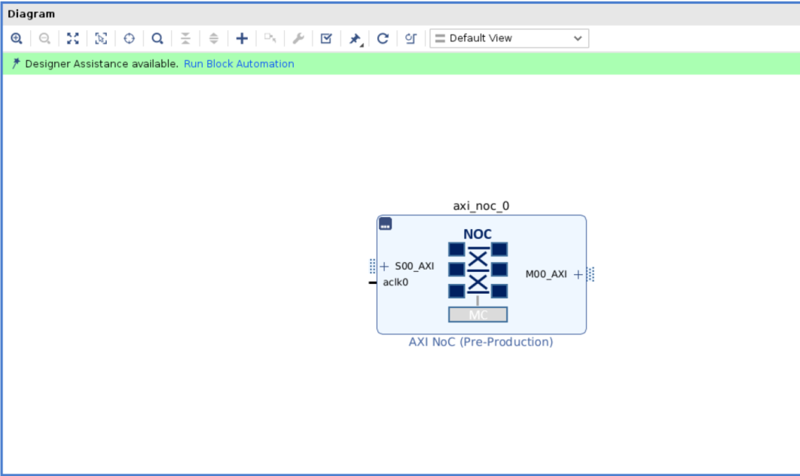

2. Click on the **Run Block Automation Designer** Assistance link in the green banner at the top of the page. The Run Block Automation GUI displays.
3. Select axi_noc_0 in the tree view and set the following values:
   * Select **HBM** under Memory Controller Type.
   * Set the HBM AXI Slave Interfaces (AXI Traffic Generators for HBM) to **4**.
   * Enable **AXI Performance Monitors for PL-2-NOC AXI-MM pins** by selecting the check box.
   * The number of AXI Traffic Generator is set to None. Leave this at its default value.
   * The number of External Sources is set to None. Leave this at its default value.
   * The number of AXI BRAM Controller is set to None. Leave this at its default value.
   * The HBM Memory Size (GB) is set to **2**. Leave this at its default value.

Check the following figure for reference.

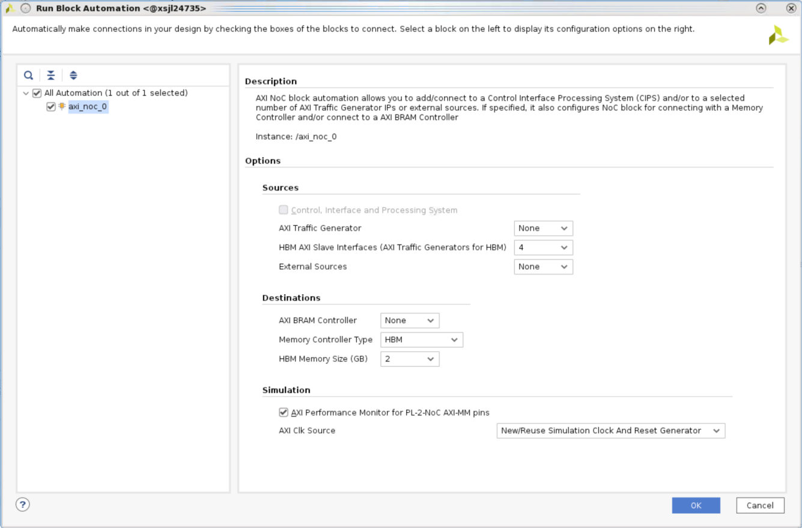

4. Click **OK**.

The Tcl commands to run the block automation are as follows:

```tcl
apply_bd_automation -rule xilinx.com:bd_rule:axi_noc -config { hbm_density {2} hbm_nmu {4} mc_type {HBM} noc_clk {New/Reuse Simulation Clock And Reset Generator} num_axi_bram {None} num_axi_tg {None} num_aximm_ext {None} num_mc_ddr {None} num_mc_lpddr {None} pl2noc_apm {1} pl2noc_cips {0}}  [get_bd_cells axi_noc_0]
```

5. Regenerate the layout by selecting the **Regenerate Layout** button in the BD canvas or running the tcl command ```regenerate_bd_layout```. There can be minor differences but the canvas should look similar to the following figure.

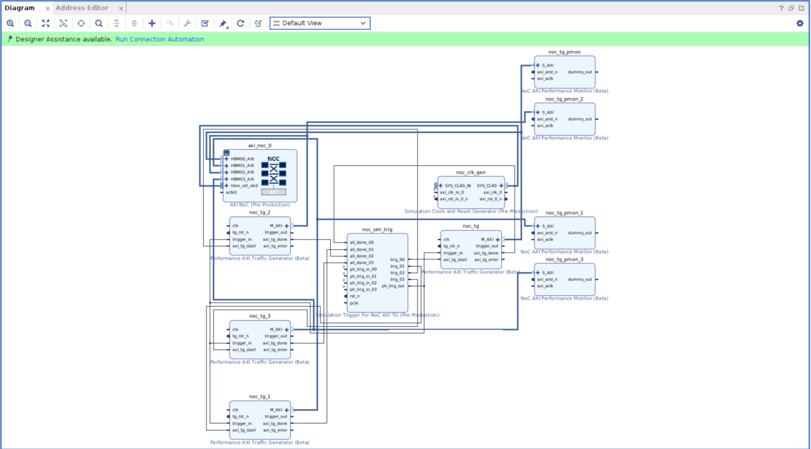
    
***Note:*** The AXI clock and reset nets are not connected.

### Configure the NoC IP

1. Double click **axi_noc_0** to display the Configuration Wizard.
2. On the General tab, make the following selections:
   * The Number of AXI Slave Interfaces is set to **0**. Leave this at its default value.
   * The Memory Controller is set to **None** under Memory Controllers - DDR4/LPDDR4. Leave this at its default value.
   * The Number of Channels and Memory Size is set to **1 (2GB)** under Memory Controllers - HBM. Leave this at its default value. This selection indicates the number of integrated HBM controllers connected to this axi_noc_instance.
   * The Number of HBM AXI PL Slave Interfaces is set to **4** under Memory Controllers - HBM. Leave this at its default value. This selection indicates the number of AXI Slave interfaces which are used to pass the traffic conforming to AXI3/AXI4 protocol in and out of the NoC. In this design, the AXI TGs transact with the Axi NoC IP using these ports.

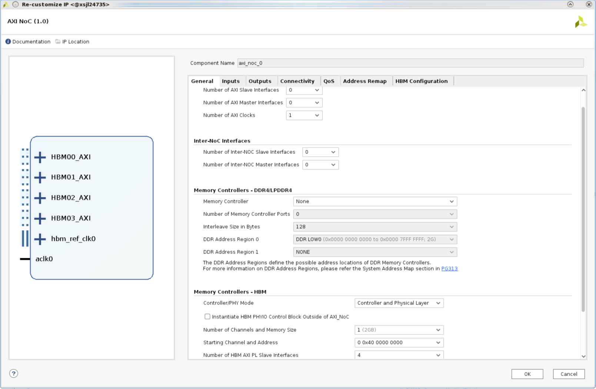

3. On the Connectivity tab click **Connect HBM 1:1**. Each HBM Channel has two pseudo channels (PC0 and PC1) each with two ports, giving four ports per channel. Clicking on Connect HBM 1:1 will connect one AXI PL interface to one Port of PC0/PC1 in the HBM controller selected. As shown in the following figure, HBM00_AXI interface is connected to Port 0 of PC0, HBM01_AXI interface is connected to Port 1 of PC0, and so on.

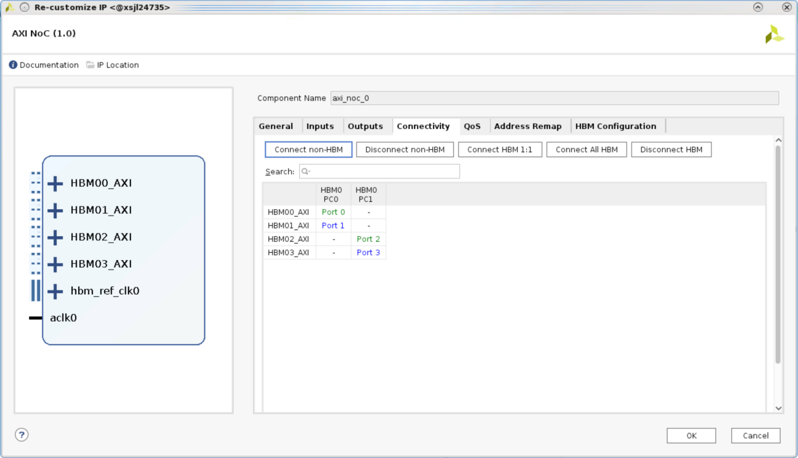

4. On the QoS Tab, set the Read and Write Bandwidth (MB/s) to **12800**.

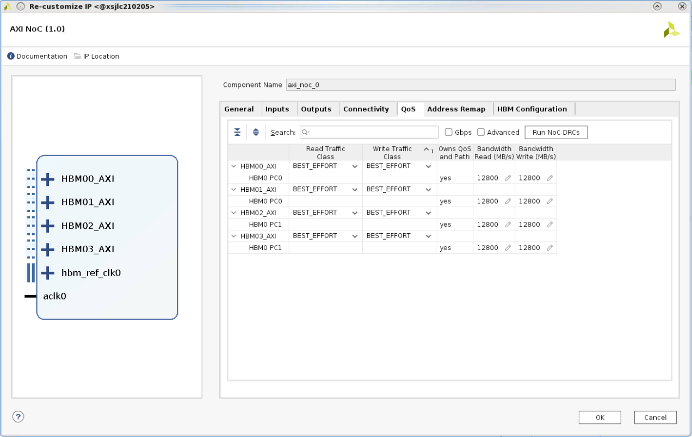

5. On the HBM Configuration Tab, set HBM Clock to **Internal** under the section Clocking. Set the HBM Memory Frequency for Stack 0 (MHz) to **1600** and HBM Reference Frequency for Stack 0 (MHz) to **100**. Based on the input clock frequency provided and the desired operation rate of the HBM, the dedicated PLL is automatically configured to match the requirements.

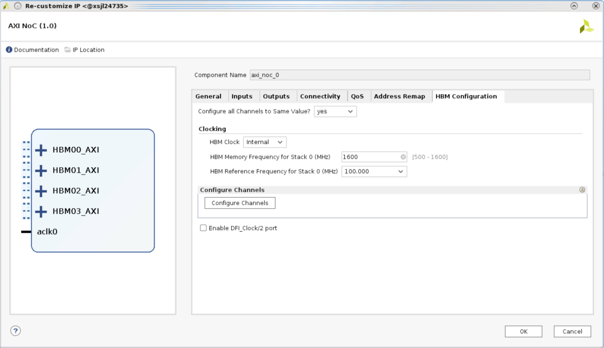

6. Click **OK**. There can be minor differences but the canvas should look similar to the following figure.

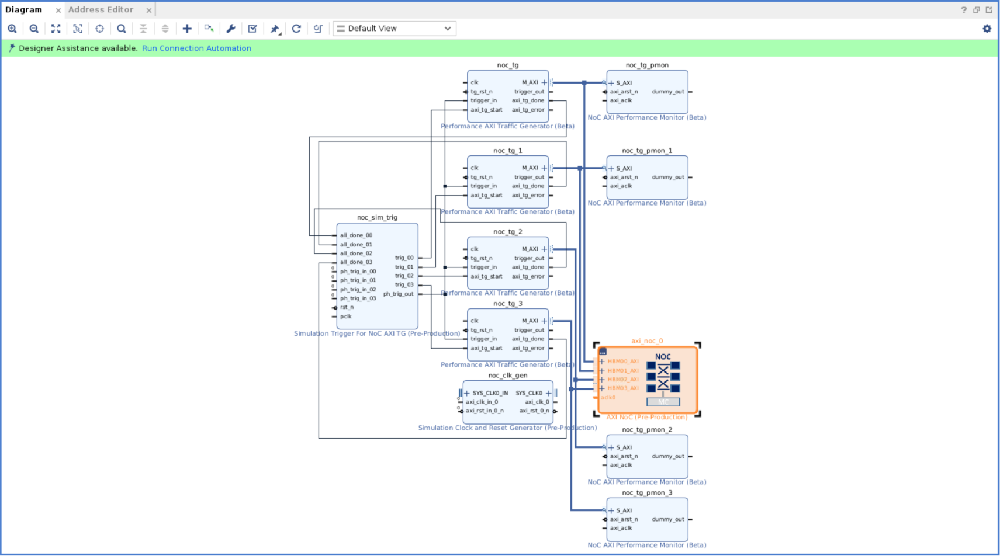

The Tcl commands to configure the NoC IP are as follows:

```tcl
set_property CONFIG.HBM_REF_CLK_SELECTION {Internal} [get_bd_cells axi_noc_0]
set_property -dict [list CONFIG.CONNECTIONS {HBM0_PORT0 {read_bw {12800} write_bw {12800} read_avg_burst {4} write_avg_burst {4}}}] [get_bd_intf_pins /axi_noc_0/HBM00_AXI]
set_property -dict [list CONFIG.CONNECTIONS {HBM0_PORT1 {read_bw {12800} write_bw {12800} read_avg_burst {4} write_avg_burst {4}}}] [get_bd_intf_pins /axi_noc_0/HBM01_AXI]
set_property -dict [list CONFIG.CONNECTIONS {HBM0_PORT2 {read_bw {12800} write_bw {12800} read_avg_burst {4} write_avg_burst {4}}}] [get_bd_intf_pins /axi_noc_0/HBM02_AXI]
set_property -dict [list CONFIG.CONNECTIONS {HBM0_PORT3 {read_bw {12800} write_bw {12800} read_avg_burst {4} write_avg_burst {4}}}] [get_bd_intf_pins /axi_noc_0/HBM03_AXI]
delete_bd_objs [get_bd_intf_nets noc_clk_gen_SYS_CLK0]
```

### Configure the Simulation Clock and Reset Generator

1. Double click **noc_clk_gen** to display the Configuration Wizard.
2. Make the following selections:
   * Set the **Number of SYS Clocks** to **0**.
   * Set the **Number of AXI Clocks** to **1**.
   * Set the **AXI-0 Clock Frequency (MHz)** to **300**.

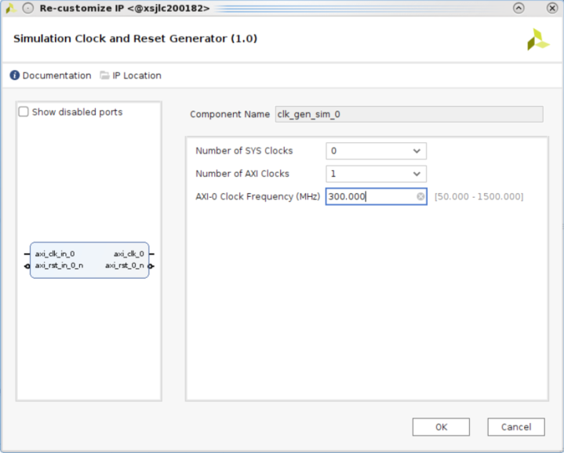

3. Click **OK** and then regenerate the layout by selecting the Regenerate Layout button in the BD canvas or running the tcl command ```regenerate_bd_layout```. There can be minor differences but the canvas should look similar to the following figure.

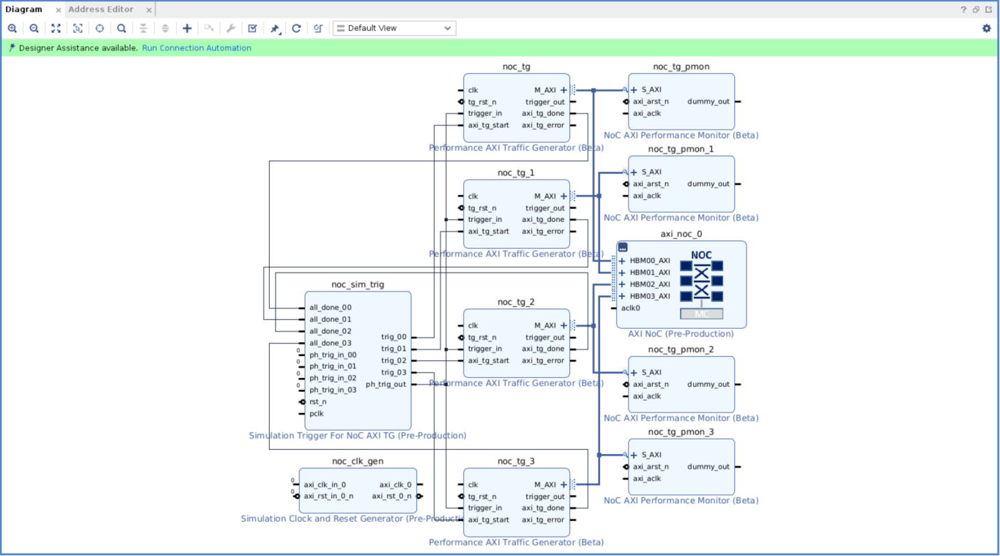

The Tcl command to configure this IP is as follows:

```tcl
set_property -dict [list CONFIG.USER_NUM_OF_SYS_CLK {0} CONFIG.USER_NUM_OF_AXI_CLK {1} CONFIG.USER_AXI_CLK_0_FREQ {300.000} ] [get_bd_cells noc_clk_gen]
regenerate_bd_layout
```

### Configure the Traffic Generators

1. Configure each of the Performance AXI TGs in turn. To display the TG configuration screen for a particular instance, double-click the TG instance: **noc_tg**.
2. In this example design, set the following parameters on the Configuration tab:
   * Set the Performance TG for Simulation to **NON SYNTHESIZABLE**.
   * Set the AXI Data Width to **256**.  

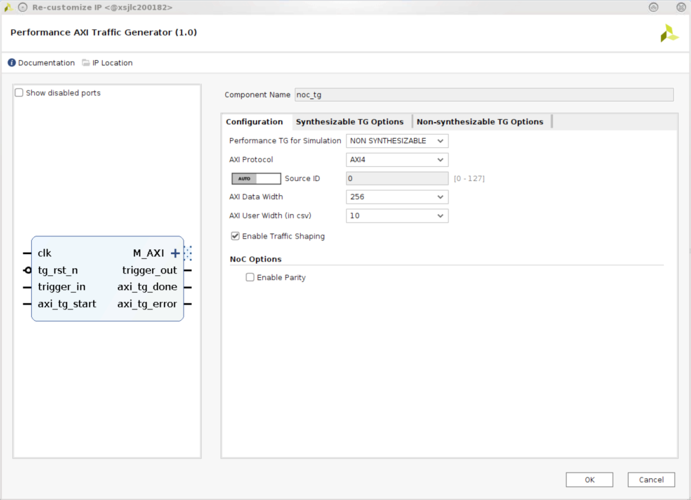

3. On the Synthesizable TG Options tab:
   * Click on the browse option besides Path to User Defined Pattern File (CSV) for Synthesizable TG to select **tg_synth_wr_followed_by_rd_0.csv**.
   * Uncheck the boxes next to **Traffic Reloading**, **Insert VIO for debug status signals** and **Insert ILA for Debug status signals**.

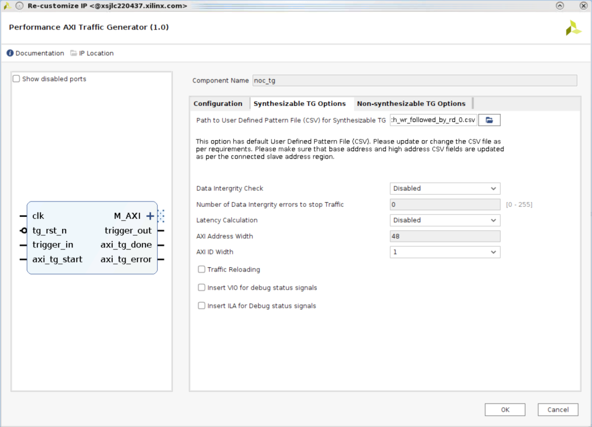

4. On the Non-synthesizable TG Options tab:
   * Set the **AXI Test/Pattern Types** to **user defined pattern**.
   * Click on the browse option besides **Path to User Defined Pattern File (CSV)** to select **tg_sim_wr_followed_by_rd_0.csv**.

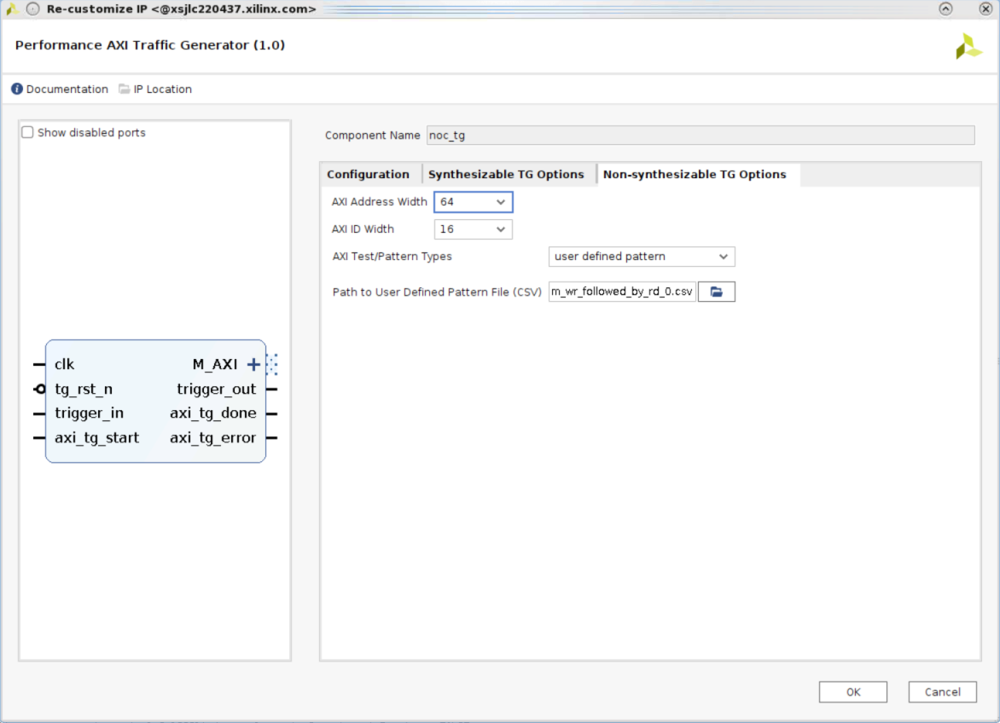

5. Follow steps 1 through 4 for the TG instance **noc_tg_1** by selecting **tg_synth_wr_followed_by_rd_1.csv** and **tg_sim_wr_followed_by_rd_1.csv**.
6. Similarly, follow steps 1 through 4 for the TG instance **noc_tg_2** by selecting **tg_synth_wr_followed_by_rd_2.csv** and **tg_sim_wr_followed_by_rd_2.csv**.
7. Similarly, follow steps 1 through 4 for the TG instance **noc_tg_3** by selecting **tg_synth_wr_followed_by_rd_3.csv** and **tg_sim_wr_followed_by_rd_3.csv**.

The previous lab used Non-Synthesizable version of the Performance AXI TG. This version is convenient for simulation purposes but it cannot be used in actual hardware. This design is run in hardware and hence it uses both synthesizable version (to run traffic in the actual hardware) and non-synthesizable version (to run traffic in simulation). Synthesizable TG requires a CSV file to define the traffic pattern. Non-synthesizable TG can be configured either through the GUI or a comma-separated values (CSV) file. This design uses a CSV file to configure the non-synthesizable TG as well. Refer to [PG381 Performance AXI Traffic Generator Product Guide](https://docs.amd.com/r/en-US/pg381-perf-axi-tg-spec) for a complete description of the two versions.

There is a separate file per TG for both synthesizable and non-synthesizable versions in this design. For example, the TG instance **noc_tg** uses **tg_synth_wr_followed_by_rd_0.csv** for the synthesizable version and **tg_sim_wr_followed_by_rd_0.csv** for non-synthesizable version. The CSV file for synthesizable TG is configured to run an infinite loop of 100 writes followed by 100 reads whereas the CSV file for non-synthesizable TG is configured to run one loop of 100 writes followed by 100 reads. 

The following figure shows the snapshot of the CSV file used for synthesizable TG:

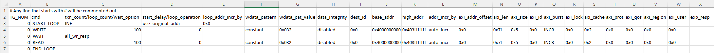

***Note:*** Click on the image to open it in high resolution.

Row 3 in the CSV indicates the start of a loop and Row 7 indicates the end of that loop. The commands between Row 3 and Row 7 are run infinite times as indicated by the option **INF** in Row 3, Column C. The option **use_original_addr** indicates that while executing the loop each time, the address offset of the writes and reads inside the loop is reset to the original value.

Row 4 in the CSV indicates a write command with a transaction count of 100 (as indicated under column C), an AXI burst length of 127 (as indicated under column N), an AXI size of 32 bytes (as indicated under column O) and the AXI burst type INCR (as indicated under column Q). The command indicates writing a constant value of **0x32** through the options selected in the fields **wdata_pattern** and **wdata_pat_value**. These writes start from the base address of either **0x40_0000_0000** or **0x40_4000_0000** depending on the TGs and the addresses are auto incremented. 

The wait command on row 5 after the write command holds the next instruction until all the write instructions are finished and responses are received. The next instruction is then issued, which is read in this case.

Row 6 in the CSV indicates a read command with a transaction count of 100 (as indicated under column C), an AXI burst length of 127 (as indicated under column N), an AXI size of 32 bytes (as indicated under column O) and the AXI burst type INCR (as indicated under column Q). These reads start from the base address of **0x40_0000_0000** or **0x40_4000_0000** and the addresses are auto incremented. The data integrity checks are disabled for these transactions.

The following figure shows the snapshot of the CSV file used for non-synthesizable TG:

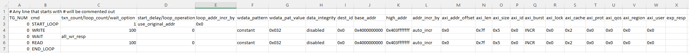

***Note:*** Click on the image to open it in high resolution.

As mentioned above, the two CSV files are identical with the only differene being the loop in this CSV file runs only once instead of running non-stop. This is done so as to reduce the simulation time. 

The Tcl commands to configure the four TGs are as follows:

```tcl
set_property -dict [list CONFIG.USER_C_AXI_TEST_SELECT {user_defined_pattern} CONFIG.USER_EN_VIO_STATUS_MONITOR {FALSE} CONFIG.USER_USR_DEFINED_PATTERN_CSV {../../../../../../../tg_sim_wr_followed_by_rd_0.csv} CONFIG.USER_SYNTH_DEFINED_PATTERN_CSV {../../../../../../../tg_synth_wr_followed_by_rd_0.csv}] [get_bd_cells noc_tg]
set_property -dict [list CONFIG.USER_C_AXI_TEST_SELECT {user_defined_pattern} CONFIG.USER_EN_VIO_STATUS_MONITOR {FALSE} CONFIG.USER_USR_DEFINED_PATTERN_CSV {../../../../../../../tg_sim_wr_followed_by_rd_1.csv} CONFIG.USER_SYNTH_DEFINED_PATTERN_CSV {../../../../../../../tg_synth_wr_followed_by_rd_1.csv}] [get_bd_cells noc_tg_1]
set_property -dict [list CONFIG.USER_C_AXI_TEST_SELECT {user_defined_pattern} CONFIG.USER_EN_VIO_STATUS_MONITOR {FALSE} CONFIG.USER_USR_DEFINED_PATTERN_CSV {../../../../../../../tg_sim_wr_followed_by_rd_2.csv} CONFIG.USER_SYNTH_DEFINED_PATTERN_CSV {../../../../../../../tg_synth_wr_followed_by_rd_2.csv}] [get_bd_cells noc_tg_2]
set_property -dict [list CONFIG.USER_C_AXI_TEST_SELECT {user_defined_pattern} CONFIG.USER_EN_VIO_STATUS_MONITOR {FALSE} CONFIG.USER_USR_DEFINED_PATTERN_CSV {../../../../../../../tg_sim_wr_followed_by_rd_3.csv} CONFIG.USER_SYNTH_DEFINED_PATTERN_CSV {../../../../../../../tg_synth_wr_followed_by_rd_3.csv}] [get_bd_cells noc_tg_3]
```

The address region of the TG is set through the address editor (described later in the section **Set the Addressing**).

### Add and Configure the Control, Interface & Processing System (CIPS) IP to the Design

1. Instantiate one CIPS instance from the IP catalog (**IP catalog** → **Control, Instance & Processing System**) and drag it onto the design canvas.
The corresponding Tcl commands instantiate the CIPS IP:

```tcl
create_bd_cell -type ip -vlnv xilinx.com:ip:versal_cips versal_cips_0
```

2. Double-click on the **CIPS IP** to open and configure it. 
3. Click **Next**.
4. Click on **PS PMC 0-1**. This should spawn a new Processign System, Platform Management Controller window.

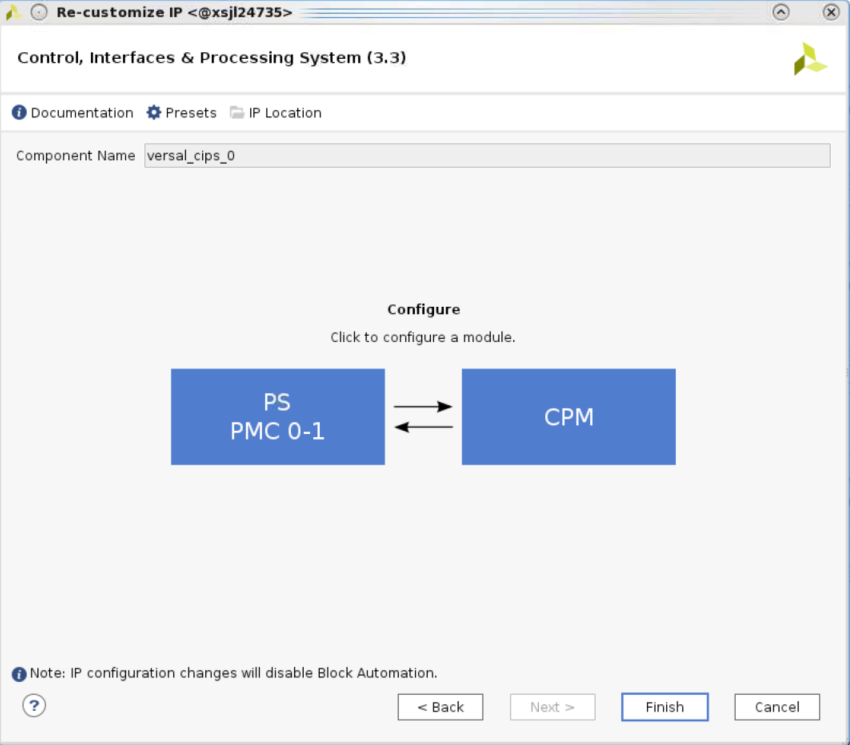

5. Select **Clocking** from the left panel as shown in the figure below. Select **Output Clocks->PMC Domain Clocks->PL Fabric Clocks->PL CLK 0** and set it to **100**MHz.

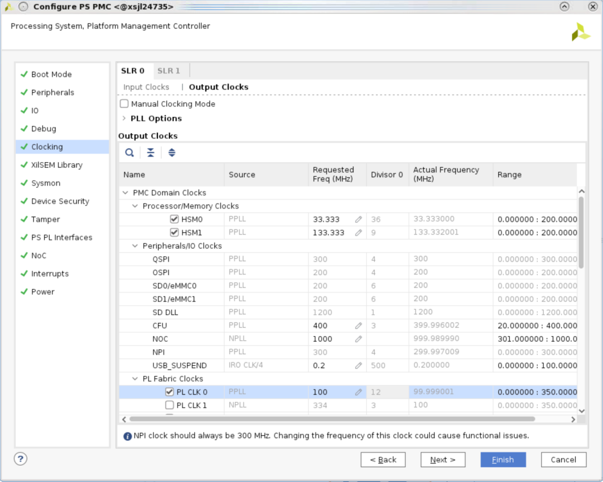

6. Click on SLR 1 tab and select **PMC Domain Clocks->Processor/Memory Clocks->HSM0** to set it to **100**MHz.

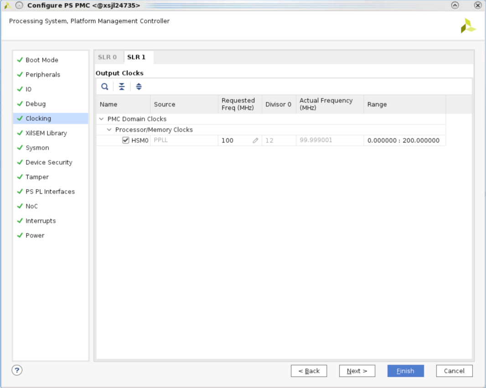

7. Select **PS PL Interfaces** from the left panel as shown in the following figure. Set the Number of PL Resets to **1**. This serves as the internal reference clock for the HBM stack.

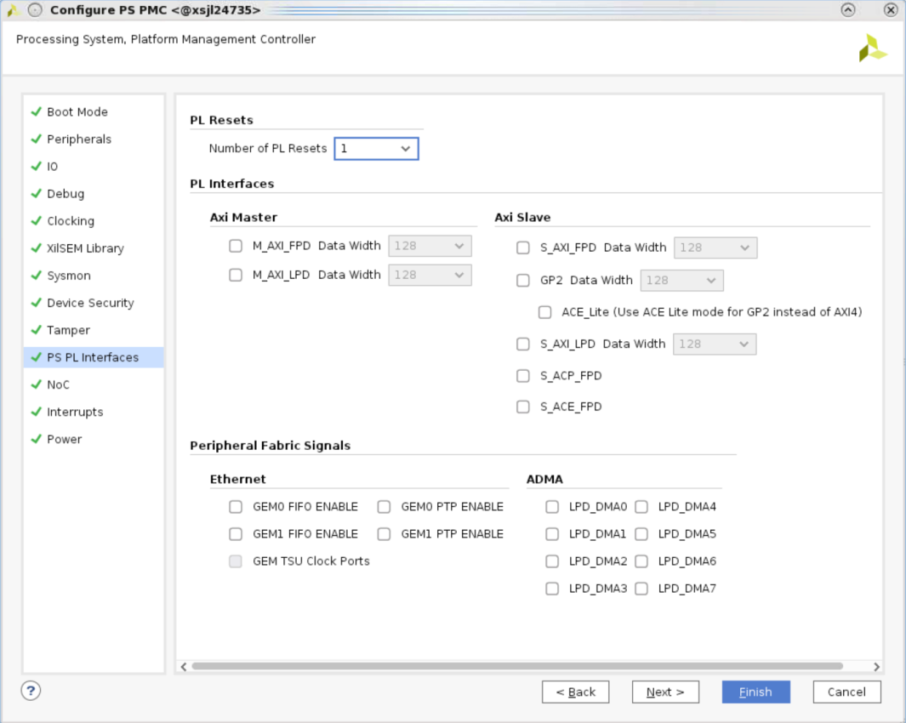

8. Click Finish on both Processign System, Platform Management Controller and CIPS window.

The corresponding Tcl commands configure CIPS:

```tcl
set_property -dict [list CONFIG.CLOCK_MODE {Custom} CONFIG.PS_PMC_CONFIG { CLOCK_MODE {Custom} PMC_CRP_HSM0_REF_CTRL_FREQMHZ {33.333} PMC_CRP_PL0_REF_CTRL_FREQMHZ {100} PS_NUM_FABRIC_RESETS {1} PS_USE_PMCPL_CLK0 {1} SMON_ALARMS {Set_Alarms_On} SMON_ENABLE_TEMP_AVERAGING {0} SMON_TEMP_AVERAGING_SAMPLES {0} } ] [get_bd_cells versal_cips_0]
```

### Add Processor System Reset IP to the Design

Instantiate one Processor System Reset instance from the IP catalog (**IP catalog** → **Processor System Reset**) and drag it onto the design canvas.
The corresponding Tcl commands instantiate the IP:

```tcl
create_bd_cell -type ip -vlnv xilinx.com:ip:proc_sys_reset proc_sys_reset_0
```

### Add Clocking Wizard to the Design

1. Instantiate one Clocking Wizard instance from the IP catalog (**IP catalog** → **Clocking Wizard**) and drag it onto the design canvas.
The corresponding Tcl commands instantiate the IP:

```tcl
create_bd_cell -type ip -vlnv xilinx.com:ip:clk_wizard clk_wizard_0
```

2. Double-click on the **Clocking Wizard** instance to open and configure it.
3. Click on the **Output Clocks** tab and set the Requested Output Frequency to **300**MHz as shown in the following figure.

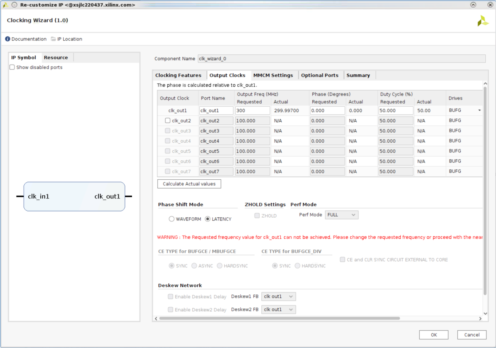

The corresponding Tcl commands configure the Clocking Wizard:

```tcl
set_property -dict [list CONFIG.CLKOUT_DRIVES {BUFG,BUFG,BUFG,BUFG,BUFG,BUFG,BUFG} CONFIG.CLKOUT_DYN_PS {None,None,None,None,None,None,None} CONFIG.CLKOUT_GROUPING {Auto,Auto,Auto,Auto,Auto,Auto,Auto} CONFIG.CLKOUT_MATCHED_ROUTING {false,false,false,false,false,false,false} CONFIG.CLKOUT_PORT {clk_out1,clk_out2,clk_out3,clk_out4,clk_out5,clk_out6,clk_out7} CONFIG.CLKOUT_REQUESTED_DUTY_CYCLE {50.000,50.000,50.000,50.000,50.000,50.000,50.000} CONFIG.CLKOUT_REQUESTED_OUT_FREQUENCY {300,100.000,100.000,100.000,100.000,100.000,100.000} CONFIG.CLKOUT_REQUESTED_PHASE {0.000,0.000,0.000,0.000,0.000,0.000,0.000} CONFIG.CLKOUT_USED {true,false,false,false,false,false,false} ] [get_bd_cells clk_wizard_0]
```

### Add ILA to the Design

1. Instantiate one ILA (Integrated Logic Analyzer with AXIS Interface) instance from the IP catalog (**IP catalog** → **ILA(Integrated Logic Analyzer with AXIS Interface)**) and drag it onto the design canvas.
The corresponding Tcl commands instantiate the IP:

```tcl
create_bd_cell -type ip -vlnv xilinx.com:ip:axis_ila axis_ila_0
```

2. Double-click on the **ILA** instance to open and configure it.
3. Set the ILA Input Type to **Interface Monitor** and Click **OK**.

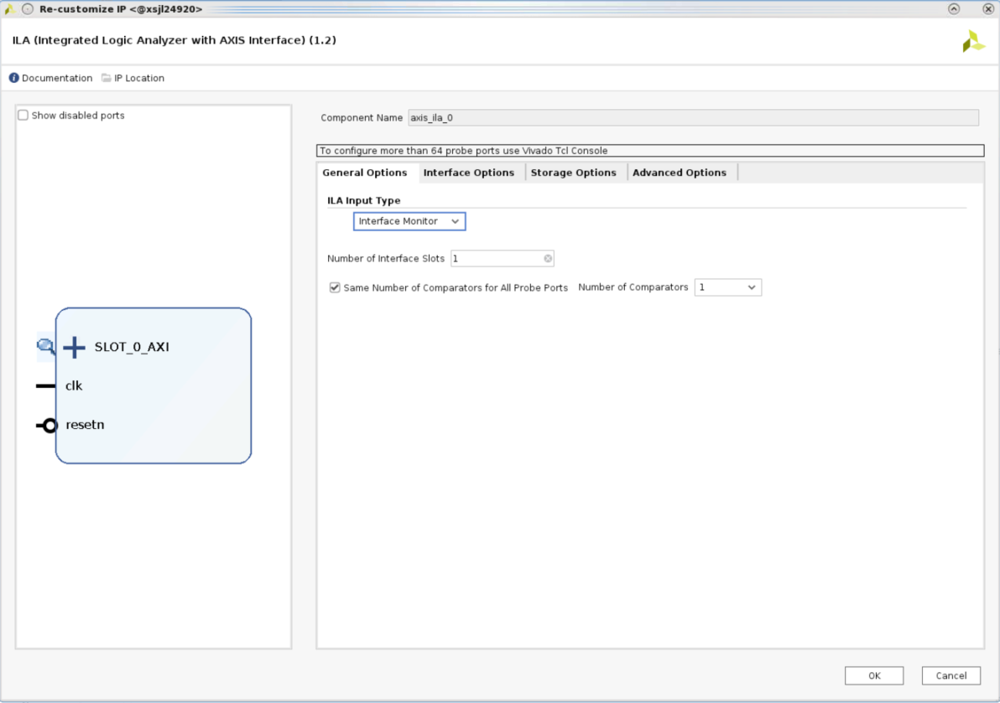

The corresponding Tcl command configures the ILA:

```tcl
set_property CONFIG.C_MON_TYPE {Interface_Monitor} [get_bd_cells axis_ila_0]
```

4. Regenerate the layout by selecting the **Regenerate Layout** button in the BD canvas or running the tcl command ```regenerate_bd_layout```. There can be minor differences but the canvas should look similar to the following figure.

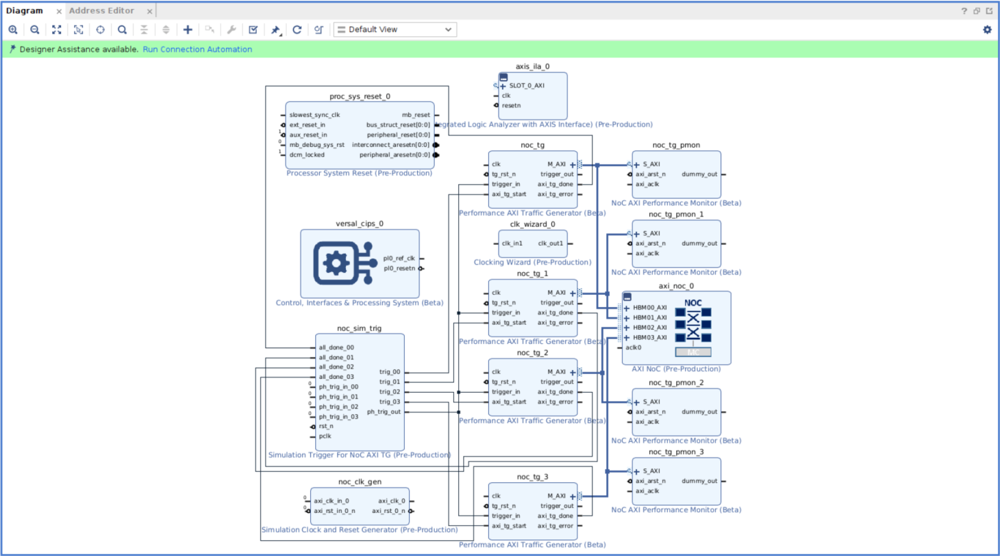

### Connect all the IPs

1. Connect **pl0_ref_clk** port of the **CIPS** IP to the **clk_in1** port of the **Clocking Wizard**.
2. Connect **pl0_resetn** port of the **CIPS** IP to the **ext_reset_in** port of the **Processor System Reset**.
3. Connect **clk_out1** port of the **Clocking Wizard** to the **slowest_sync_clk** port of the **Processor System Reset**.
4. Connect **peripheral_aresetn** port of the **Processor System Reset** to the **axi_rst_in_0_n** port of the **Simulation Clock and Reset Generator (noc_clk_gen)** instance.
5. Connect **clk_out1** port of the **Clocking Wizard** to the **axi_clk_in_0** port of the **Simulation Clock and Reset Generator (noc_clk_gen)** instance.
6. From **axi_rst_0_n** port of the **Simulation Clock and Reset Generator (noc_clk_gen)**, make the following connections:
   * **rst_n** port of the **Simulation Trigger For NoC AXI TG (noc_sim_trig)** instance.
   * **tg_rst_n** port of the **Performance AXI Traffic Generator (noc_tg)** instance.
   * **tg_rst_n** port of the **Performance AXI Traffic Generator (noc_tg_1)** instance.
   * **tg_rst_n** port of the **Performance AXI Traffic Generator (noc_tg_2)** instance.   
   * **tg_rst_n** port of the **Performance AXI Traffic Generator (noc_tg_3)** instance.   
   * **axi_arst_n** port of the **NoC AXI Performance Monitor (noc_tg_pmon)** instance.   
   * **axi_arst_n** port of the **NoC AXI Performance Monitor (noc_tg_pmon_1)** instance.   
   * **axi_arst_n** port of the **NoC AXI Performance Monitor (noc_tg_pmon_2)** instance.   
   * **axi_arst_n** port of the **NoC AXI Performance Monitor (noc_tg_pmon_3)** instance.   
   * **resetn** port of the **ILA (axis_ila_0)** instance.
   
7. From **axi_clk_0** port of the **Simulation Clock and Reset Generator (noc_clk_gen)**, make the following connections:
   * **pclk** port of the **Simulation Trigger For NoC AXI TG (noc_sim_trig)** instance.
   * **clk** port of the **Performance AXI Traffic Generator (noc_tg)** instance.
   * **clk** port of the **Performance AXI Traffic Generator (noc_tg_1)** instance.
   * **clk** port of the **Performance AXI Traffic Generator (noc_tg_2)** instance.
   * **clk** port of the **Performance AXI Traffic Generator (noc_tg_3)** instance.
   * **axi_aclk** port of the **NoC AXI Performance Monitor (noc_tg_pmon)** instance.
   * **axi_aclk** port of the **NoC AXI Performance Monitor (noc_tg_pmon_1)** instance.
   * **axi_aclk** port of the **NoC AXI Performance Monitor (noc_tg_pmon_2)** instance.
   * **axi_aclk** port of the **NoC AXI Performance Monitor (noc_tg_pmon_3)** instance.
   * **aclk0** port of the **AXI NoC (axi_noc_0)** instance.
   * **clk** port of the **ILA (axis_ila_0)** instance.

8. Connect **M_AXI** port of the **Performance AXI Traffic Generator (noc_tg)** to the **SLOT_0_AXI** port of the **ILA (axis_ila_0)** instance.

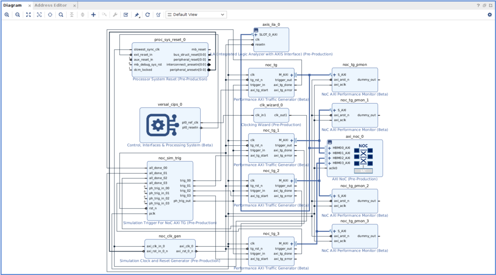

The corresponding Tcl commands makes all the connections mentioned in this section:

```tcl
connect_bd_net [get_bd_pins versal_cips_0/pl0_ref_clk] [get_bd_pins clk_wizard_0/clk_in1]
connect_bd_net [get_bd_pins versal_cips_0/pl0_resetn] [get_bd_pins proc_sys_reset_0/ext_reset_in]
connect_bd_net [get_bd_pins clk_wizard_0/clk_out1] [get_bd_pins proc_sys_reset_0/slowest_sync_clk]
connect_bd_net [get_bd_pins proc_sys_reset_0/peripheral_aresetn] [get_bd_pins noc_clk_gen/axi_rst_in_0_n]
connect_bd_net [get_bd_pins clk_wizard_0/clk_out1] [get_bd_pins noc_clk_gen/axi_clk_in_0]
connect_bd_net [get_bd_pins noc_clk_gen/axi_rst_0_n] [get_bd_pins noc_sim_trig/rst_n]
connect_bd_net [get_bd_pins noc_clk_gen/axi_rst_0_n] [get_bd_pins noc_tg/tg_rst_n] 
connect_bd_net [get_bd_pins noc_clk_gen/axi_rst_0_n] [get_bd_pins noc_tg_1/tg_rst_n] 
connect_bd_net [get_bd_pins noc_clk_gen/axi_rst_0_n] [get_bd_pins noc_tg_2/tg_rst_n] 
connect_bd_net [get_bd_pins noc_clk_gen/axi_rst_0_n] [get_bd_pins noc_tg_3/tg_rst_n] 
connect_bd_net [get_bd_pins noc_clk_gen/axi_rst_0_n] [get_bd_pins noc_tg_pmon/axi_arst_n] 
connect_bd_net [get_bd_pins noc_clk_gen/axi_rst_0_n] [get_bd_pins noc_tg_pmon_1/axi_arst_n] 
connect_bd_net [get_bd_pins noc_clk_gen/axi_rst_0_n] [get_bd_pins noc_tg_pmon_2/axi_arst_n] 
connect_bd_net [get_bd_pins noc_clk_gen/axi_rst_0_n] [get_bd_pins noc_tg_pmon_3/axi_arst_n]
connect_bd_net [get_bd_pins noc_clk_gen/axi_rst_0_n] [get_bd_pins axis_ila_0/resetn]
connect_bd_net [get_bd_pins noc_clk_gen/axi_clk_0] [get_bd_pins noc_sim_trig/pclk] 
connect_bd_net [get_bd_pins noc_clk_gen/axi_clk_0] [get_bd_pins noc_tg/clk] 
connect_bd_net [get_bd_pins noc_clk_gen/axi_clk_0] [get_bd_pins noc_tg_1/clk] 
connect_bd_net [get_bd_pins noc_clk_gen/axi_clk_0] [get_bd_pins noc_tg_2/clk] 
connect_bd_net [get_bd_pins noc_clk_gen/axi_clk_0] [get_bd_pins noc_tg_3/clk] 
connect_bd_net [get_bd_pins noc_clk_gen/axi_clk_0] [get_bd_pins noc_tg_pmon/axi_aclk] 
connect_bd_net [get_bd_pins noc_clk_gen/axi_clk_0] [get_bd_pins noc_tg_pmon_1/axi_aclk] 
connect_bd_net [get_bd_pins noc_clk_gen/axi_clk_0] [get_bd_pins noc_tg_pmon_2/axi_aclk] 
connect_bd_net [get_bd_pins noc_clk_gen/axi_clk_0] [get_bd_pins noc_tg_pmon_3/axi_aclk] 
connect_bd_net [get_bd_pins noc_clk_gen/axi_clk_0] [get_bd_pins axi_noc_0/aclk0] 
connect_bd_net [get_bd_pins noc_clk_gen/axi_clk_0] [get_bd_pins axis_ila_0/clk]
connect_bd_intf_net [get_bd_intf_pins noc_tg/M_AXI] [get_bd_intf_pins axis_ila_0/SLOT_0_AXI]
```

26. Regenerate the layout by selecting the **Regenerate Layout** button in the BD canvas or running the tcl command ```regenerate_bd_layout```. The canvas looks as follows:

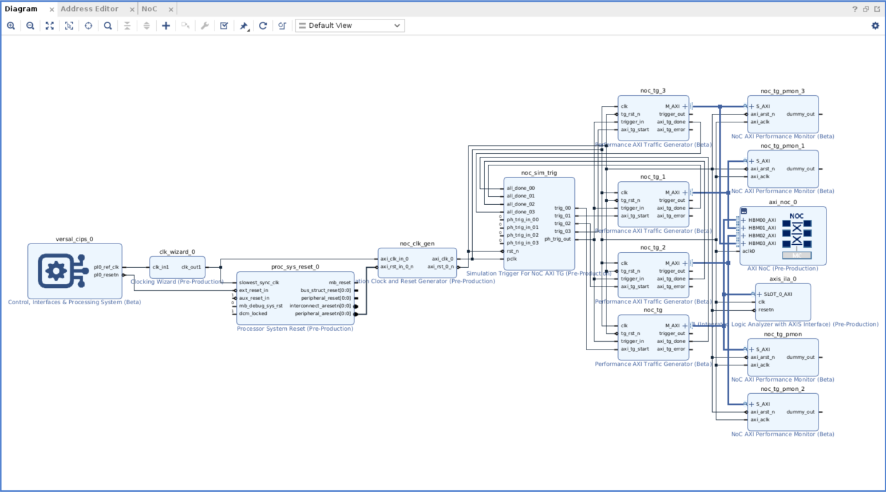

### Set the Addressing

Open the Address Editor by clicking the tab at the top of the canvas, click the **Expand All** icon from the Address Editor toolbar, and select the **Assign All** icon in the toolbar at the top of the block design canvas. Alternatively, run ```assign_bd_address``` command in the Tcl Console. The default address mapping is shown in the following figure.

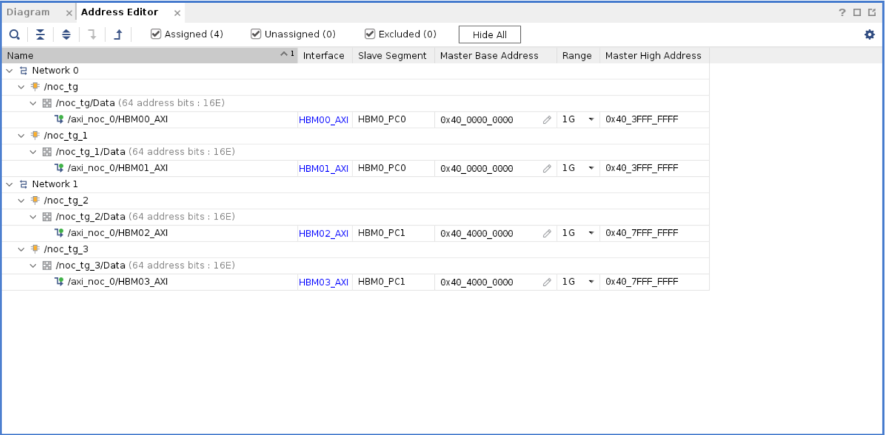

## Validate the Block Design

Validation of a NoC design invokes the NoC compiler to find an optimal configuration for the NoC. To validate the design, right-click anywhere in the canvas and, from the context menu, select **Validate Design**. Alternatively, you can also perform validation by clicking the **Validate Design** icon on the toolbar or running ```validate_bd_design``` in the Tcl Console.
The NoC GUI should show the NoC placement and routing solution as shown in the following figure.

The NoC QoS table shows the required and estimated QoS for each of the paths through the NoC.

***Note***: The Read Latency Estimate and Write Latency Estimate represent only the round-trip structural latency through a portion of the NoC in the NoC clock domain. These numbers do not include latency in the DRAM, memory controller etc. The actual total latency is greater than these numbers. These latencies are reported in NoC clock cycles. They are intended for relative comparison between different NoC implementations, not as a representation of the actual total latency.

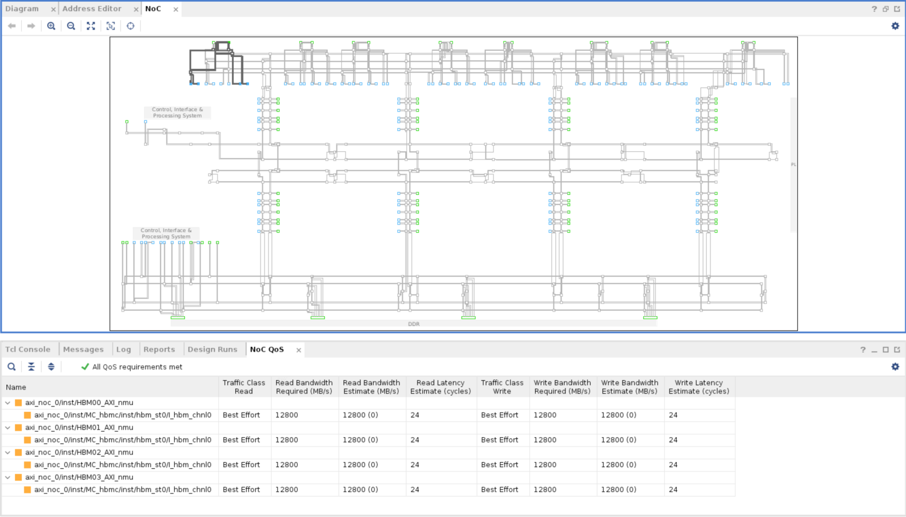

## Synthesize and Implement the Design

In preparation for synthesis and implementation, a top level HDL wrapper must be created as follows:

1. Open the **Sources** window.
2. Open the **Hierarchy** tab.
3. Under the Design Sources tree, select the **design_1** (`design_1.bd`) subtree.
4. Right-click and select **Create HDL Wrapper...** as shown in the following figure.


5. Click **OK** to let Vivado manage the wrapper.
6. Click on **Run Synthesis** from the Flow Navigator window. This creates the Output Products for all the IPs included in the design and then synthesize the design. The status of all the IPs and syntesis can be seen in the **Design Runs** window under **Out-of-Context Module Runs** and **synth_1**, respectively.

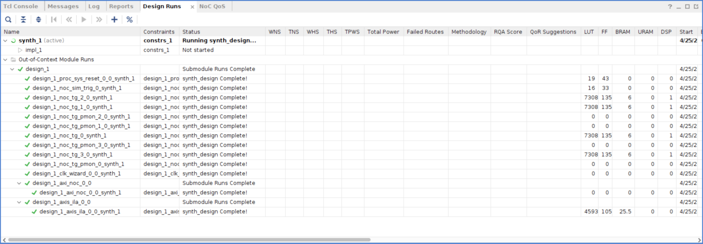

7. When synthesis finishes, the Synthesis Completed dialog box opens. Select **Run Implementation** from the dialog box and click **OK**.

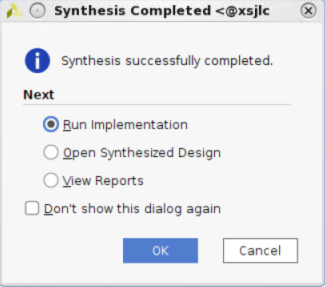

8. When implementation finishes, the Implementation Completed dialog box opens. Select **Generate Device Image** from the dialog box and click **OK**.
 
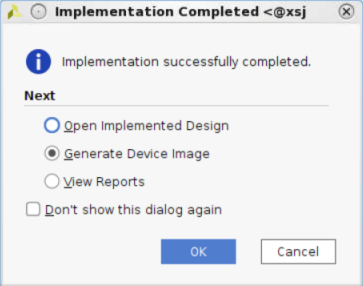

9. When Device Image Generation finishes, the Device Image Generation Completed dialog box opens. Select **Open Implemented Design** from the dialog box and click **OK** analyze the Implemented Design.

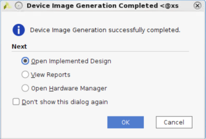

10. The device image (**design_1_wrapper.pdi**) and the debug probes file (**design_1_wrapper.ltx**) are generated under **./hbm_module_2/hbm_module_2.runs/impl_1/**.

## Running the Design on Hardware

The next step is to load the generated device image and debug probes file on VHK158. To do that, connect the board to your machine and follow the steps below:

1. Open the Vivado Design Suite (Lab edition) with 2023.1 release or later.
2. Click on **Open Hardware Manager**.
3. Click on Open Target in the green banner and connect to the board.
4. Click on Program Device in the green banner and select the PDI (**design_1_wrapper.pdi**) and the Debug Probes file (**design_1_wrapper.ltx**) in their respective fields.

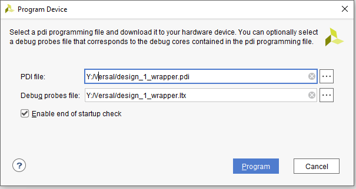

5. Once the image is loaded, select **HBM_1** in the **Dashboard Options** tab, this should add a new tab **HBM_1** to the window. This tab highlights the active HBM controller and displays the temperature of the stack. The Controller **0 (x0y0)** is mapped to number **5** under **Memory Controller Status** due to the NPI Addressing and hence is seen as the active controller. The mapping for the rest of the controllers is as follows:
   * **x1y0** -> **6**
   * **x2y0** -> **7**
   * **x3y0** -> **8**
   * **x4y0** -> **1**
   * **x5y0** -> **2**
   * **x6y0** -> **3**
   * **x7y0** -> **4**

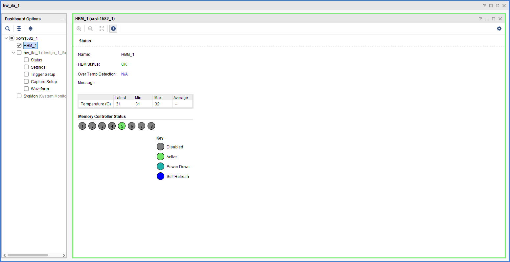

6. Similarly, click on **hw_ila_1** in the **Dashboard Options** tab, this should add a few tabs to the window. Click on **Run Trigger for this ILA Core** on the **Waveform - hw_ila_1** tab. Expand the signals under **slot_0:noc_tg_M_AXI:Interface**, this should display the AXI transactions in the waveform window.

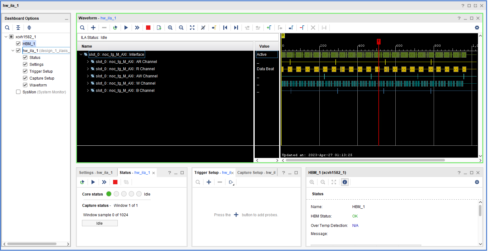

7. Expand the signals under the different channels to observe the transactions. Run the trigger multiple times to check the changing traffic.

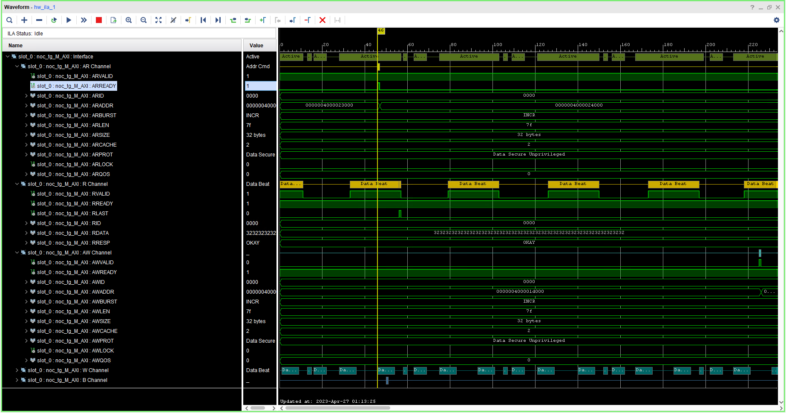

## Simulate the Design

To simulate the design, follow the steps mentioned below:

1. In the Flow Navigator, right-click **Simulation** → **Simulation Settings**. This opens the Project
Settings menu at the Simulation tab as shown in the following figure.

***Note:*** Ensure that Simulator language is set to Mixed.

2. In this design, set the Target simulator to Vivado Simulator.

3. On the Simulation tab, set the simulation run time to 150000 and select **xsim.simulate.log_all_signals** as shown in the following figure. Click **Apply** and then **OK**.

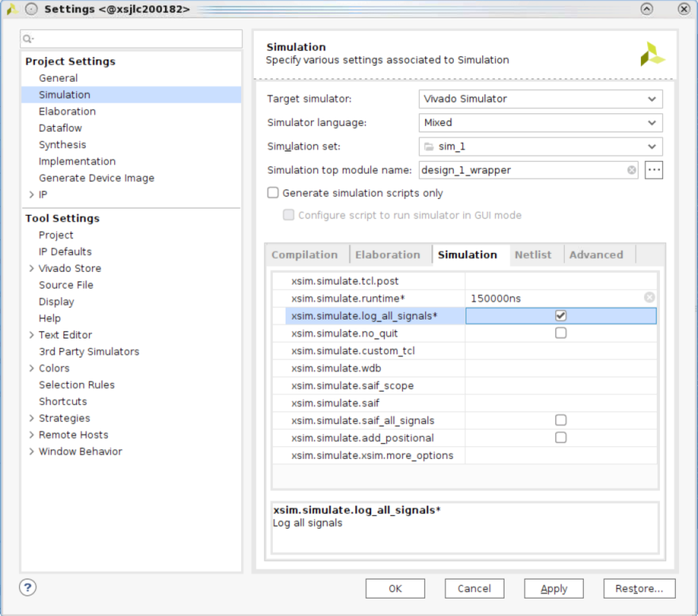
 
4. To start the simulator, click **Simulation → Run Simulation**, then select **Run Behavioral Simulation**. This launches simulation and creates a top-level wrapper for simulation called **design_1_wrapper_sim_wrapper**.
At the end of simulation each TG reports the number of transactions and success or failure in the Tcl console, as shown:

```
=========================================================
>>>>>> SRC ID 0 :: TEST REPORT >>>>>>
=========================================================
[INFO] SRC ID = 0 ::: TG_HIERARCHY          = design_1_wrapper_sim_wrapper.design_1_wrapper_i.design_1_i.noc_tg.inst.u_top_axi_mst
[INFO] SRC ID = 0 ::: AXI_PROTOCOL          = AXI4
[INFO] SRC ID = 0 ::: AXI_CLK_PERIOD        = 3334ps, AXI_DATAWIDTH  = 256bit
[INFO] SRC ID = 0 ::: TEST_NAME             = user_defined_pattern
[INFO] SRC ID = 0 ::: CSV_FILE              = design_1_noc_tg_0_pattern.csv
[INFO] SRC ID = 0 ::: TOTAL_WRITE_REQ_SENT  = 100, TOTAL_WRITE_RESP_RECEIVED  = 100
[INFO] SRC ID = 0 ::: TOTAL_READ_REQ_SENT   = 100, TOTAL_READ_RESP_RECEIVED   = 100
[INFO] SRC ID = 0 ::: DATA_INTEGRITY_CHECK  = DISABLED
[INFO] SRC ID = 0 ::: TEST_STATUS           = TEST PASSED
=========================================================

Executing Axi4 End Of Simulation checks
=========================================================
>>>>>> SRC ID 1 :: TEST REPORT >>>>>>
=========================================================
[INFO] SRC ID = 1 ::: TG_HIERARCHY          = design_1_wrapper_sim_wrapper.design_1_wrapper_i.design_1_i.noc_tg_1.inst.u_top_axi_mst
[INFO] SRC ID = 1 ::: AXI_PROTOCOL          = AXI4
[INFO] SRC ID = 1 ::: AXI_CLK_PERIOD        = 3334ps, AXI_DATAWIDTH  = 256bit
[INFO] SRC ID = 1 ::: TEST_NAME             = user_defined_pattern
[INFO] SRC ID = 1 ::: CSV_FILE              = design_1_noc_tg_1_0_pattern.csv
[INFO] SRC ID = 1 ::: TOTAL_WRITE_REQ_SENT  = 100, TOTAL_WRITE_RESP_RECEIVED  = 100
[INFO] SRC ID = 1 ::: TOTAL_READ_REQ_SENT   = 100, TOTAL_READ_RESP_RECEIVED   = 100
[INFO] SRC ID = 1 ::: DATA_INTEGRITY_CHECK  = DISABLED
[INFO] SRC ID = 1 ::: TEST_STATUS           = TEST PASSED
=========================================================

Executing Axi4 End Of Simulation checks
=========================================================
>>>>>> SRC ID 2 :: TEST REPORT >>>>>>
=========================================================
[INFO] SRC ID = 2 ::: TG_HIERARCHY          = design_1_wrapper_sim_wrapper.design_1_wrapper_i.design_1_i.noc_tg_2.inst.u_top_axi_mst
[INFO] SRC ID = 2 ::: AXI_PROTOCOL          = AXI4
[INFO] SRC ID = 2 ::: AXI_CLK_PERIOD        = 3334ps, AXI_DATAWIDTH  = 256bit
[INFO] SRC ID = 2 ::: TEST_NAME             = user_defined_pattern
[INFO] SRC ID = 2 ::: CSV_FILE              = design_1_noc_tg_2_0_pattern.csv
[INFO] SRC ID = 2 ::: TOTAL_WRITE_REQ_SENT  = 100, TOTAL_WRITE_RESP_RECEIVED  = 100
[INFO] SRC ID = 2 ::: TOTAL_READ_REQ_SENT   = 100, TOTAL_READ_RESP_RECEIVED   = 100
[INFO] SRC ID = 2 ::: DATA_INTEGRITY_CHECK  = DISABLED
[INFO] SRC ID = 2 ::: TEST_STATUS           = TEST PASSED
=========================================================

Executing Axi4 End Of Simulation checks
=========================================================
>>>>>> SRC ID 3 :: TEST REPORT >>>>>>
=========================================================
[INFO] SRC ID = 3 ::: TG_HIERARCHY          = design_1_wrapper_sim_wrapper.design_1_wrapper_i.design_1_i.noc_tg_3.inst.u_top_axi_mst
[INFO] SRC ID = 3 ::: AXI_PROTOCOL          = AXI4
[INFO] SRC ID = 3 ::: AXI_CLK_PERIOD        = 3334ps, AXI_DATAWIDTH  = 256bit
[INFO] SRC ID = 3 ::: TEST_NAME             = user_defined_pattern
[INFO] SRC ID = 3 ::: CSV_FILE              = design_1_noc_tg_3_0_pattern.csv
[INFO] SRC ID = 3 ::: TOTAL_WRITE_REQ_SENT  = 100, TOTAL_WRITE_RESP_RECEIVED  = 100
[INFO] SRC ID = 3 ::: TOTAL_READ_REQ_SENT   = 100, TOTAL_READ_RESP_RECEIVED   = 100
[INFO] SRC ID = 3 ::: DATA_INTEGRITY_CHECK  = DISABLED
[INFO] SRC ID = 3 ::: TEST_STATUS           = TEST PASSED
=========================================================

=========================================================
>>>>>> SRC_ID 0 :: AXI_PMON :: BW ANALYSIS >>>>>>
=========================================================
AXI Clock Period = 3334 ps
Min Write Latency = 199 axi clock cycles
Max Write Latency = 1046 axi clock cycles
Avg Write Latency = 985 axi clock cycles
Actual Achieved Write Bandwidth = 8565.532240 MBps
***************************************************
Min Read Latency = 159 axi clock cycles
Max Read Latency = 1084 axi clock cycles
Avg Read Latency = 1032 axi clock cycles
Actual Achieved Read Bandwidth = 9214.387528 MBps
=========================================================
>>>>>> SRC_ID 1 :: AXI_PMON :: BW ANALYSIS >>>>>>
=========================================================
AXI Clock Period = 3334 ps
Min Write Latency = 202 axi clock cycles
Max Write Latency = 1045 axi clock cycles
Avg Write Latency = 984 axi clock cycles
Actual Achieved Write Bandwidth = 8564.935089 MBps
***************************************************
Min Read Latency = 162 axi clock cycles
Max Read Latency = 1086 axi clock cycles
Avg Read Latency = 1032 axi clock cycles
Actual Achieved Read Bandwidth = 9212.314706 MBps
=========================================================
>>>>>> SRC_ID 2 :: AXI_PMON :: BW ANALYSIS >>>>>>
=========================================================
AXI Clock Period = 3334 ps
Min Write Latency = 199 axi clock cycles
Max Write Latency = 1044 axi clock cycles
Avg Write Latency = 983 axi clock cycles
Actual Achieved Write Bandwidth = 8572.106399 MBps
***************************************************
Min Read Latency = 159 axi clock cycles
Max Read Latency = 1083 axi clock cycles
Avg Read Latency = 1034 axi clock cycles
Actual Achieved Read Bandwidth = 9201.964566 MBps
=========================================================
>>>>>> SRC_ID 3 :: AXI_PMON :: BW ANALYSIS >>>>>>
=========================================================
AXI Clock Period = 3334 ps
Min Write Latency = 202 axi clock cycles
Max Write Latency = 1045 axi clock cycles
Avg Write Latency = 984 axi clock cycles
Actual Achieved Write Bandwidth = 8564.935089 MBps
***************************************************
Min Read Latency = 166 axi clock cycles
Max Read Latency = 1122 axi clock cycles
Avg Read Latency = 1038 axi clock cycles
Actual Achieved Read Bandwidth = 9168.999844 MBps
```

From the performance monitor output, each TG achieved a write bandwidth of about 8565 MBps and a read bandwidth of about 9200 MBps. This results in an aggregate write bandwidth of about 34260 MBps and an aggregate read bandwidth of about 36800 MBps.

The simulator generates a waveform at the end of the simulation. To check the AXI transactions from the TGs, select **design_1_wrapper_sim_wrapper->design_1_wrapper_i->design_1_i->axi_noc_0** from the Scope tab under Simulation window as shown in the following figure. This should list all the input and output signals under **axi_noc_0** module in the **Objects tab**. Select all the signals from the **Objects** tab, then right-click on one of the signals and click on **Add to Wave Window**.

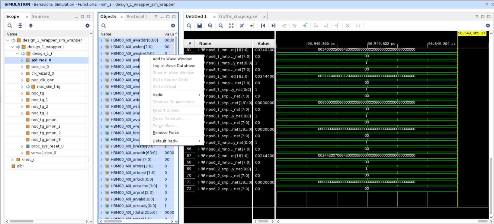

The following Tcl commands can be used to add all these signals to the Waveforms:

```tcl
add_wave {{/design_1_wrapper_sim_wrapper/design_1_wrapper_i/design_1_i/axi_noc_0/HBM00_AXI_awaddr}} {{/design_1_wrapper_sim_wrapper/design_1_wrapper_i/design_1_i/axi_noc_0/HBM00_AXI_awlen}} {{/design_1_wrapper_sim_wrapper/design_1_wrapper_i/design_1_i/axi_noc_0/HBM00_AXI_awsize}} {{/design_1_wrapper_sim_wrapper/design_1_wrapper_i/design_1_i/axi_noc_0/HBM00_AXI_awburst}} {{/design_1_wrapper_sim_wrapper/design_1_wrapper_i/design_1_i/axi_noc_0/HBM00_AXI_awlock}} {{/design_1_wrapper_sim_wrapper/design_1_wrapper_i/design_1_i/axi_noc_0/HBM00_AXI_awcache}} {{/design_1_wrapper_sim_wrapper/design_1_wrapper_i/design_1_i/axi_noc_0/HBM00_AXI_awprot}} {{/design_1_wrapper_sim_wrapper/design_1_wrapper_i/design_1_i/axi_noc_0/HBM00_AXI_awvalid}} {{/design_1_wrapper_sim_wrapper/design_1_wrapper_i/design_1_i/axi_noc_0/HBM00_AXI_awready}} {{/design_1_wrapper_sim_wrapper/design_1_wrapper_i/design_1_i/axi_noc_0/HBM00_AXI_wdata}} {{/design_1_wrapper_sim_wrapper/design_1_wrapper_i/design_1_i/axi_noc_0/HBM00_AXI_wstrb}} {{/design_1_wrapper_sim_wrapper/design_1_wrapper_i/design_1_i/axi_noc_0/HBM00_AXI_wlast}} {{/design_1_wrapper_sim_wrapper/design_1_wrapper_i/design_1_i/axi_noc_0/HBM00_AXI_wvalid}} {{/design_1_wrapper_sim_wrapper/design_1_wrapper_i/design_1_i/axi_noc_0/HBM00_AXI_wready}} {{/design_1_wrapper_sim_wrapper/design_1_wrapper_i/design_1_i/axi_noc_0/HBM00_AXI_bresp}} {{/design_1_wrapper_sim_wrapper/design_1_wrapper_i/design_1_i/axi_noc_0/HBM00_AXI_bvalid}} {{/design_1_wrapper_sim_wrapper/design_1_wrapper_i/design_1_i/axi_noc_0/HBM00_AXI_bready}} {{/design_1_wrapper_sim_wrapper/design_1_wrapper_i/design_1_i/axi_noc_0/HBM00_AXI_araddr}} {{/design_1_wrapper_sim_wrapper/design_1_wrapper_i/design_1_i/axi_noc_0/HBM00_AXI_arlen}} {{/design_1_wrapper_sim_wrapper/design_1_wrapper_i/design_1_i/axi_noc_0/HBM00_AXI_arsize}} {{/design_1_wrapper_sim_wrapper/design_1_wrapper_i/design_1_i/axi_noc_0/HBM00_AXI_arburst}} {{/design_1_wrapper_sim_wrapper/design_1_wrapper_i/design_1_i/axi_noc_0/HBM00_AXI_arlock}} {{/design_1_wrapper_sim_wrapper/design_1_wrapper_i/design_1_i/axi_noc_0/HBM00_AXI_arcache}} {{/design_1_wrapper_sim_wrapper/design_1_wrapper_i/design_1_i/axi_noc_0/HBM00_AXI_arprot}} {{/design_1_wrapper_sim_wrapper/design_1_wrapper_i/design_1_i/axi_noc_0/HBM00_AXI_arvalid}} {{/design_1_wrapper_sim_wrapper/design_1_wrapper_i/design_1_i/axi_noc_0/HBM00_AXI_arready}} {{/design_1_wrapper_sim_wrapper/design_1_wrapper_i/design_1_i/axi_noc_0/HBM00_AXI_rdata}} {{/design_1_wrapper_sim_wrapper/design_1_wrapper_i/design_1_i/axi_noc_0/HBM00_AXI_rresp}} {{/design_1_wrapper_sim_wrapper/design_1_wrapper_i/design_1_i/axi_noc_0/HBM00_AXI_rlast}} {{/design_1_wrapper_sim_wrapper/design_1_wrapper_i/design_1_i/axi_noc_0/HBM00_AXI_rvalid}} {{/design_1_wrapper_sim_wrapper/design_1_wrapper_i/design_1_i/axi_noc_0/HBM00_AXI_rready}} {{/design_1_wrapper_sim_wrapper/design_1_wrapper_i/design_1_i/axi_noc_0/HBM00_AXI_arid}} {{/design_1_wrapper_sim_wrapper/design_1_wrapper_i/design_1_i/axi_noc_0/HBM00_AXI_aruser}} {{/design_1_wrapper_sim_wrapper/design_1_wrapper_i/design_1_i/axi_noc_0/HBM00_AXI_awid}} {{/design_1_wrapper_sim_wrapper/design_1_wrapper_i/design_1_i/axi_noc_0/HBM00_AXI_awuser}} {{/design_1_wrapper_sim_wrapper/design_1_wrapper_i/design_1_i/axi_noc_0/HBM00_AXI_bid}} {{/design_1_wrapper_sim_wrapper/design_1_wrapper_i/design_1_i/axi_noc_0/HBM00_AXI_buser}} {{/design_1_wrapper_sim_wrapper/design_1_wrapper_i/design_1_i/axi_noc_0/HBM00_AXI_rid}} {{/design_1_wrapper_sim_wrapper/design_1_wrapper_i/design_1_i/axi_noc_0/HBM00_AXI}} 
add_wave {{/design_1_wrapper_sim_wrapper/design_1_wrapper_i/design_1_i/axi_noc_0/HBM01_AXI_awaddr}} {{/design_1_wrapper_sim_wrapper/design_1_wrapper_i/design_1_i/axi_noc_0/HBM01_AXI_awlen}} {{/design_1_wrapper_sim_wrapper/design_1_wrapper_i/design_1_i/axi_noc_0/HBM01_AXI_awsize}} {{/design_1_wrapper_sim_wrapper/design_1_wrapper_i/design_1_i/axi_noc_0/HBM01_AXI_awburst}} {{/design_1_wrapper_sim_wrapper/design_1_wrapper_i/design_1_i/axi_noc_0/HBM01_AXI_awlock}} {{/design_1_wrapper_sim_wrapper/design_1_wrapper_i/design_1_i/axi_noc_0/HBM01_AXI_awcache}} {{/design_1_wrapper_sim_wrapper/design_1_wrapper_i/design_1_i/axi_noc_0/HBM01_AXI_awprot}} {{/design_1_wrapper_sim_wrapper/design_1_wrapper_i/design_1_i/axi_noc_0/HBM01_AXI_awvalid}} {{/design_1_wrapper_sim_wrapper/design_1_wrapper_i/design_1_i/axi_noc_0/HBM01_AXI_awready}} {{/design_1_wrapper_sim_wrapper/design_1_wrapper_i/design_1_i/axi_noc_0/HBM01_AXI_wdata}} {{/design_1_wrapper_sim_wrapper/design_1_wrapper_i/design_1_i/axi_noc_0/HBM01_AXI_wstrb}} {{/design_1_wrapper_sim_wrapper/design_1_wrapper_i/design_1_i/axi_noc_0/HBM01_AXI_wlast}} {{/design_1_wrapper_sim_wrapper/design_1_wrapper_i/design_1_i/axi_noc_0/HBM01_AXI_wvalid}} {{/design_1_wrapper_sim_wrapper/design_1_wrapper_i/design_1_i/axi_noc_0/HBM01_AXI_wready}} {{/design_1_wrapper_sim_wrapper/design_1_wrapper_i/design_1_i/axi_noc_0/HBM01_AXI_bresp}} {{/design_1_wrapper_sim_wrapper/design_1_wrapper_i/design_1_i/axi_noc_0/HBM01_AXI_bvalid}} {{/design_1_wrapper_sim_wrapper/design_1_wrapper_i/design_1_i/axi_noc_0/HBM01_AXI_bready}} {{/design_1_wrapper_sim_wrapper/design_1_wrapper_i/design_1_i/axi_noc_0/HBM01_AXI_araddr}} {{/design_1_wrapper_sim_wrapper/design_1_wrapper_i/design_1_i/axi_noc_0/HBM01_AXI_arlen}} {{/design_1_wrapper_sim_wrapper/design_1_wrapper_i/design_1_i/axi_noc_0/HBM01_AXI_arsize}} {{/design_1_wrapper_sim_wrapper/design_1_wrapper_i/design_1_i/axi_noc_0/HBM01_AXI_arburst}} {{/design_1_wrapper_sim_wrapper/design_1_wrapper_i/design_1_i/axi_noc_0/HBM01_AXI_arlock}} {{/design_1_wrapper_sim_wrapper/design_1_wrapper_i/design_1_i/axi_noc_0/HBM01_AXI_arcache}} {{/design_1_wrapper_sim_wrapper/design_1_wrapper_i/design_1_i/axi_noc_0/HBM01_AXI_arprot}} {{/design_1_wrapper_sim_wrapper/design_1_wrapper_i/design_1_i/axi_noc_0/HBM01_AXI_arvalid}} {{/design_1_wrapper_sim_wrapper/design_1_wrapper_i/design_1_i/axi_noc_0/HBM01_AXI_arready}} {{/design_1_wrapper_sim_wrapper/design_1_wrapper_i/design_1_i/axi_noc_0/HBM01_AXI_rdata}} {{/design_1_wrapper_sim_wrapper/design_1_wrapper_i/design_1_i/axi_noc_0/HBM01_AXI_rresp}} {{/design_1_wrapper_sim_wrapper/design_1_wrapper_i/design_1_i/axi_noc_0/HBM01_AXI_rlast}} {{/design_1_wrapper_sim_wrapper/design_1_wrapper_i/design_1_i/axi_noc_0/HBM01_AXI_rvalid}} {{/design_1_wrapper_sim_wrapper/design_1_wrapper_i/design_1_i/axi_noc_0/HBM01_AXI_rready}} {{/design_1_wrapper_sim_wrapper/design_1_wrapper_i/design_1_i/axi_noc_0/HBM01_AXI_arid}} {{/design_1_wrapper_sim_wrapper/design_1_wrapper_i/design_1_i/axi_noc_0/HBM01_AXI_aruser}} {{/design_1_wrapper_sim_wrapper/design_1_wrapper_i/design_1_i/axi_noc_0/HBM01_AXI_awid}} {{/design_1_wrapper_sim_wrapper/design_1_wrapper_i/design_1_i/axi_noc_0/HBM01_AXI_awuser}} {{/design_1_wrapper_sim_wrapper/design_1_wrapper_i/design_1_i/axi_noc_0/HBM01_AXI_bid}} {{/design_1_wrapper_sim_wrapper/design_1_wrapper_i/design_1_i/axi_noc_0/HBM01_AXI_buser}} {{/design_1_wrapper_sim_wrapper/design_1_wrapper_i/design_1_i/axi_noc_0/HBM01_AXI_rid}} {{/design_1_wrapper_sim_wrapper/design_1_wrapper_i/design_1_i/axi_noc_0/HBM01_AXI}} 
add_wave {{/design_1_wrapper_sim_wrapper/design_1_wrapper_i/design_1_i/axi_noc_0/HBM02_AXI_awaddr}} {{/design_1_wrapper_sim_wrapper/design_1_wrapper_i/design_1_i/axi_noc_0/HBM02_AXI_awlen}} {{/design_1_wrapper_sim_wrapper/design_1_wrapper_i/design_1_i/axi_noc_0/HBM02_AXI_awsize}} {{/design_1_wrapper_sim_wrapper/design_1_wrapper_i/design_1_i/axi_noc_0/HBM02_AXI_awburst}} {{/design_1_wrapper_sim_wrapper/design_1_wrapper_i/design_1_i/axi_noc_0/HBM02_AXI_awlock}} {{/design_1_wrapper_sim_wrapper/design_1_wrapper_i/design_1_i/axi_noc_0/HBM02_AXI_awcache}} {{/design_1_wrapper_sim_wrapper/design_1_wrapper_i/design_1_i/axi_noc_0/HBM02_AXI_awprot}} {{/design_1_wrapper_sim_wrapper/design_1_wrapper_i/design_1_i/axi_noc_0/HBM02_AXI_awvalid}} {{/design_1_wrapper_sim_wrapper/design_1_wrapper_i/design_1_i/axi_noc_0/HBM02_AXI_awready}} {{/design_1_wrapper_sim_wrapper/design_1_wrapper_i/design_1_i/axi_noc_0/HBM02_AXI_wdata}} {{/design_1_wrapper_sim_wrapper/design_1_wrapper_i/design_1_i/axi_noc_0/HBM02_AXI_wstrb}} {{/design_1_wrapper_sim_wrapper/design_1_wrapper_i/design_1_i/axi_noc_0/HBM02_AXI_wlast}} {{/design_1_wrapper_sim_wrapper/design_1_wrapper_i/design_1_i/axi_noc_0/HBM02_AXI_wvalid}} {{/design_1_wrapper_sim_wrapper/design_1_wrapper_i/design_1_i/axi_noc_0/HBM02_AXI_wready}} {{/design_1_wrapper_sim_wrapper/design_1_wrapper_i/design_1_i/axi_noc_0/HBM02_AXI_bresp}} {{/design_1_wrapper_sim_wrapper/design_1_wrapper_i/design_1_i/axi_noc_0/HBM02_AXI_bvalid}} {{/design_1_wrapper_sim_wrapper/design_1_wrapper_i/design_1_i/axi_noc_0/HBM02_AXI_bready}} {{/design_1_wrapper_sim_wrapper/design_1_wrapper_i/design_1_i/axi_noc_0/HBM02_AXI_araddr}} {{/design_1_wrapper_sim_wrapper/design_1_wrapper_i/design_1_i/axi_noc_0/HBM02_AXI_arlen}} {{/design_1_wrapper_sim_wrapper/design_1_wrapper_i/design_1_i/axi_noc_0/HBM02_AXI_arsize}} {{/design_1_wrapper_sim_wrapper/design_1_wrapper_i/design_1_i/axi_noc_0/HBM02_AXI_arburst}} {{/design_1_wrapper_sim_wrapper/design_1_wrapper_i/design_1_i/axi_noc_0/HBM02_AXI_arlock}} {{/design_1_wrapper_sim_wrapper/design_1_wrapper_i/design_1_i/axi_noc_0/HBM02_AXI_arcache}} {{/design_1_wrapper_sim_wrapper/design_1_wrapper_i/design_1_i/axi_noc_0/HBM02_AXI_arprot}} {{/design_1_wrapper_sim_wrapper/design_1_wrapper_i/design_1_i/axi_noc_0/HBM02_AXI_arvalid}} {{/design_1_wrapper_sim_wrapper/design_1_wrapper_i/design_1_i/axi_noc_0/HBM02_AXI_arready}} {{/design_1_wrapper_sim_wrapper/design_1_wrapper_i/design_1_i/axi_noc_0/HBM02_AXI_rdata}} {{/design_1_wrapper_sim_wrapper/design_1_wrapper_i/design_1_i/axi_noc_0/HBM02_AXI_rresp}} {{/design_1_wrapper_sim_wrapper/design_1_wrapper_i/design_1_i/axi_noc_0/HBM02_AXI_rlast}} {{/design_1_wrapper_sim_wrapper/design_1_wrapper_i/design_1_i/axi_noc_0/HBM02_AXI_rvalid}} {{/design_1_wrapper_sim_wrapper/design_1_wrapper_i/design_1_i/axi_noc_0/HBM02_AXI_rready}} {{/design_1_wrapper_sim_wrapper/design_1_wrapper_i/design_1_i/axi_noc_0/HBM02_AXI_arid}} {{/design_1_wrapper_sim_wrapper/design_1_wrapper_i/design_1_i/axi_noc_0/HBM02_AXI_aruser}} {{/design_1_wrapper_sim_wrapper/design_1_wrapper_i/design_1_i/axi_noc_0/HBM02_AXI_awid}} {{/design_1_wrapper_sim_wrapper/design_1_wrapper_i/design_1_i/axi_noc_0/HBM02_AXI_awuser}} {{/design_1_wrapper_sim_wrapper/design_1_wrapper_i/design_1_i/axi_noc_0/HBM02_AXI_bid}} {{/design_1_wrapper_sim_wrapper/design_1_wrapper_i/design_1_i/axi_noc_0/HBM02_AXI_buser}} {{/design_1_wrapper_sim_wrapper/design_1_wrapper_i/design_1_i/axi_noc_0/HBM02_AXI_rid}} {{/design_1_wrapper_sim_wrapper/design_1_wrapper_i/design_1_i/axi_noc_0/HBM02_AXI}} 
add_wave {{/design_1_wrapper_sim_wrapper/design_1_wrapper_i/design_1_i/axi_noc_0/HBM03_AXI_awaddr}} {{/design_1_wrapper_sim_wrapper/design_1_wrapper_i/design_1_i/axi_noc_0/HBM03_AXI_awlen}} {{/design_1_wrapper_sim_wrapper/design_1_wrapper_i/design_1_i/axi_noc_0/HBM03_AXI_awsize}} {{/design_1_wrapper_sim_wrapper/design_1_wrapper_i/design_1_i/axi_noc_0/HBM03_AXI_awburst}} {{/design_1_wrapper_sim_wrapper/design_1_wrapper_i/design_1_i/axi_noc_0/HBM03_AXI_awlock}} {{/design_1_wrapper_sim_wrapper/design_1_wrapper_i/design_1_i/axi_noc_0/HBM03_AXI_awcache}} {{/design_1_wrapper_sim_wrapper/design_1_wrapper_i/design_1_i/axi_noc_0/HBM03_AXI_awprot}} {{/design_1_wrapper_sim_wrapper/design_1_wrapper_i/design_1_i/axi_noc_0/HBM03_AXI_awvalid}} {{/design_1_wrapper_sim_wrapper/design_1_wrapper_i/design_1_i/axi_noc_0/HBM03_AXI_awready}} {{/design_1_wrapper_sim_wrapper/design_1_wrapper_i/design_1_i/axi_noc_0/HBM03_AXI_wdata}} {{/design_1_wrapper_sim_wrapper/design_1_wrapper_i/design_1_i/axi_noc_0/HBM03_AXI_wstrb}} {{/design_1_wrapper_sim_wrapper/design_1_wrapper_i/design_1_i/axi_noc_0/HBM03_AXI_wlast}} {{/design_1_wrapper_sim_wrapper/design_1_wrapper_i/design_1_i/axi_noc_0/HBM03_AXI_wvalid}} {{/design_1_wrapper_sim_wrapper/design_1_wrapper_i/design_1_i/axi_noc_0/HBM03_AXI_wready}} {{/design_1_wrapper_sim_wrapper/design_1_wrapper_i/design_1_i/axi_noc_0/HBM03_AXI_bresp}} {{/design_1_wrapper_sim_wrapper/design_1_wrapper_i/design_1_i/axi_noc_0/HBM03_AXI_bvalid}} {{/design_1_wrapper_sim_wrapper/design_1_wrapper_i/design_1_i/axi_noc_0/HBM03_AXI_bready}} {{/design_1_wrapper_sim_wrapper/design_1_wrapper_i/design_1_i/axi_noc_0/HBM03_AXI_araddr}} {{/design_1_wrapper_sim_wrapper/design_1_wrapper_i/design_1_i/axi_noc_0/HBM03_AXI_arlen}} {{/design_1_wrapper_sim_wrapper/design_1_wrapper_i/design_1_i/axi_noc_0/HBM03_AXI_arsize}} {{/design_1_wrapper_sim_wrapper/design_1_wrapper_i/design_1_i/axi_noc_0/HBM03_AXI_arburst}} {{/design_1_wrapper_sim_wrapper/design_1_wrapper_i/design_1_i/axi_noc_0/HBM03_AXI_arlock}} {{/design_1_wrapper_sim_wrapper/design_1_wrapper_i/design_1_i/axi_noc_0/HBM03_AXI_arcache}} {{/design_1_wrapper_sim_wrapper/design_1_wrapper_i/design_1_i/axi_noc_0/HBM03_AXI_arprot}} {{/design_1_wrapper_sim_wrapper/design_1_wrapper_i/design_1_i/axi_noc_0/HBM03_AXI_arvalid}} {{/design_1_wrapper_sim_wrapper/design_1_wrapper_i/design_1_i/axi_noc_0/HBM03_AXI_arready}} {{/design_1_wrapper_sim_wrapper/design_1_wrapper_i/design_1_i/axi_noc_0/HBM03_AXI_rdata}} {{/design_1_wrapper_sim_wrapper/design_1_wrapper_i/design_1_i/axi_noc_0/HBM03_AXI_rresp}} {{/design_1_wrapper_sim_wrapper/design_1_wrapper_i/design_1_i/axi_noc_0/HBM03_AXI_rlast}} {{/design_1_wrapper_sim_wrapper/design_1_wrapper_i/design_1_i/axi_noc_0/HBM03_AXI_rvalid}} {{/design_1_wrapper_sim_wrapper/design_1_wrapper_i/design_1_i/axi_noc_0/HBM03_AXI_rready}} {{/design_1_wrapper_sim_wrapper/design_1_wrapper_i/design_1_i/axi_noc_0/aclk0}} {{/design_1_wrapper_sim_wrapper/design_1_wrapper_i/design_1_i/axi_noc_0/HBM03_AXI_arid}} {{/design_1_wrapper_sim_wrapper/design_1_wrapper_i/design_1_i/axi_noc_0/HBM03_AXI_aruser}} {{/design_1_wrapper_sim_wrapper/design_1_wrapper_i/design_1_i/axi_noc_0/HBM03_AXI_awid}} {{/design_1_wrapper_sim_wrapper/design_1_wrapper_i/design_1_i/axi_noc_0/HBM03_AXI_awuser}} {{/design_1_wrapper_sim_wrapper/design_1_wrapper_i/design_1_i/axi_noc_0/HBM03_AXI_bid}} {{/design_1_wrapper_sim_wrapper/design_1_wrapper_i/design_1_i/axi_noc_0/HBM03_AXI_buser}} {{/design_1_wrapper_sim_wrapper/design_1_wrapper_i/design_1_i/axi_noc_0/HBM03_AXI_rid}} {{/design_1_wrapper_sim_wrapper/design_1_wrapper_i/design_1_i/axi_noc_0/HBM03_AXI}} 
```

This should list all the show all the AXI signals on the waveform window. All the Read and Write transactions initiating out of the TGs can be observed on the waveform window.

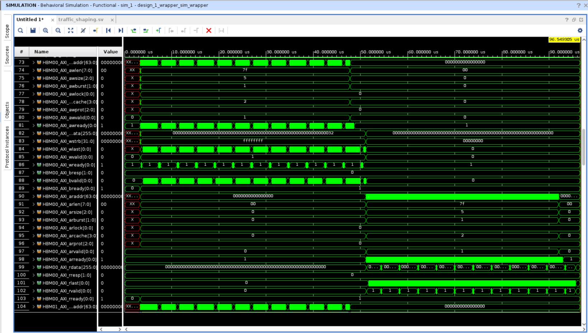

## Script to Build and Simulate the Design

To build and simulate the above design with a script, source **run_hbm_module2.tcl** from the Tcl Console after launching Vivado Design Suite with 2023.1 release or later.

```tcl
source ./run_hbm_module2.tcl
```


<hr class="sphinxhide"></hr>

<p class="sphinxhide" align="center"><sub>Copyright © 2023–2024 Advanced Micro Devices, Inc.</sub></p>

<p class="sphinxhide" align="center"><sup><a href="https://www.amd.com/en/corporate/copyright">Terms and Conditions</a></sup></p>
