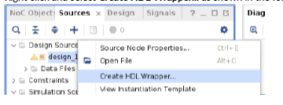

<table>
 <tr>
   <td align="center"><h1>Versal™ Basic HBM Design with NoC</h1>
   </td>
 </tr>
 <tr>
 <td align="center"><h1>Building and Running the Design</h1>
 </td>
 </tr>
</table>

# HBM Controller
The HBM Controller (HBMC) is integrated into the AXI NoC IP. This IP allows the user to instantiate the required number of HBMCs along with setting the required data rate, clocking, address mapping, QoS and connectivity. It interfaces with the AXI Memory Map Supported logic and configures the NoC. The Versal HBM family contains up to two HBM2e stacks of 8GB or 16GB each. There's an HBM controller for each of the 8 memory channels in the stack. Each controller is further divided into two pseudo channels. A single controller can be configured for single or dual pseudo channel use. In this module, a single traffic generator (TG) will be configured with a single pseudo channel of the HBMC.

# Description of the Design
This design uses one AXI4 TG to write and read data to/from HBM memory connected to the NoC. AXI performance monitor will be used to report the average bandwidth and latency achieved by each of the AXI connections. This module uses a bottom up design flow in which the logical NoCs are instantiated first and Designer Assistance is used to build the design around it. A TG will be used to simulate the data flow of a real application.

**Note**: This lab is provided as an example only. Figures and information depicted here might vary from the current version. It is highly recommended to follow all the steps below to learn how to build the design with Integrated HBM Controllers. To build the design directly without following all the steps, users can skip all the sections below and jump to [Script to build and Simulate the Design](#script-to-build-and-simulate-the-design)

# Create the Design

## Start the Vivado Design Suite

1. Open the Vivado® Design Suite with 2023.1 release or later.
2. Click **Create Project** from the Quick Start Menu.
3. In the Project Name page specify a name of the project such as **hbm_module_1**.
4. Step through the pop-up menus to access the Default Part page.
5. In the Default Part page, search for and select: **xcvh1582-vsva3697-2MP-e-S**.
6. Continue to the Finish stage to create the new project and open Vivado.
7. In the Vivado Flow Navigator, click **IP Integrator → Create Block Design**. A popup dialog box displays to create the block design. Type a name for the block design in the **Design name** field.
8. Click **OK**. An empty block design diagram canvas opens. The Tcl commands to create the project and initial block design are as follows:

In the Vivado Tcl Console:
``` tcl
create_project hbm_module_1 ./hbm_module_1 -part xcvh1582-vsva3697-2MP-e-S
create_bd_design "design_1"
```

## Instantiate IP and run Designer Assistance
1. Instantiate one AXI NoC instance from the IP catalog (**IP catalog** → **AXI NoC**) and it drag onto
the design canvas.
The corresponding Tcl commands to instantiate the AXI NoCs are:
``` tcl
create_bd_cell -type ip -vlnv xilinx.com:ip:axi_noc:1.0 axi_noc_0
```
The default AXI NoC IP will display on the canvas as shown in the following figure.


2. Click the **Run Block Automation** Designer Assistance link in the green banner at the top of
the page. The Run Block Automation GUI displays.
3. Select **axi_noc_0** in the tree view and set the following values:
   * Select **HBM** under Memory Controller Type.
   * Set the HBM AXI Slave Interfaces (AXI Traffic Generators for HBM) to **1**.
   * Enable AXI Performance Monitors for PL-2-NOC AXI-MM pins by selecting the check box.
   * The number of AXI Traffic Generator is set to **None**. Leave this at its default value.
   * The number of External Sources is set to **None**. Leave this at its default value.
   * The number of AXI BRAM Controller is set to **None**. Leave this at its default value.
   * The HBM Memory Size (GB) is set to **2**. Leave this at its default value.
   * Make sure the check box next to **Control, Interface and Processing System** is not checked.
   * Leave the AXI Clk Source at its default value.


4. Click **OK**.
The Tcl commands to run the block automation are as follows:
``` tcl
apply_bd_automation -rule xilinx.com:bd_rule:axi_noc -config { hbm_density {2} hbm_nmu {1} mc_type {HBM} noc_clk {New/Reuse Simulation Clock And Reset Generator} num_axi_bram {None} num_axi_tg {None} num_aximm_ext {None} num_mc_ddr {None} num_mc_lpddr {None} pl2noc_apm {1} pl2noc_cips {0}}  [get_bd_cells axi_noc_0]
```

5. Regenerate the layout by selecting the **Regenerate Layout** button in the BD canvas or running the tcl command ```regenerate_bd_layout```. The canvas
looks as follows:


    
**Note:** The AXI clock and reset nets are not connected.
# Configure the NoC IP
1. Double click **axi_noc_0** to display the Configuration Wizard.
2. On the General tab, make the following selections:
   * The Number of AXI Slave Interfaces is set to **0**. Leave this at its default value.
   * The Number of AXI Clocks is set to **1**. Leave this at its default value. 
   * The Memory Controller is set to **None** under Memory Controllers - DDR4/LPDDR4. Leave this at its default value.
   * The Number of Channels and Memory Size is set to **1 (2GB)** under Memory Controllers - HBM. Leave this at its default value. This selection indicates the number of integrated HBM Controllers connected to this axi_noc_instance.
   * The Number of HBM AXI PL Slave Interfaces is set to **1** under Memory Controllers - HBM. Leave this at its default value. This selection indicates the number of AXI Slave interfaces which are used to pass the traffic conforming to AXI3/AXI4 protocol in and out of the NoC. In this design, the AXI TG transacts with the Axi NoC IP using this port.


3. On the Connectivity tab click **Connect HBM 1:1**. Each HBM Channel has two pseudo channels (PC0 and PC1) each with two ports, giving four ports per channel. Clicking on **Connect HBM 1:1** will connect 1 AXI PL interface (HBM00_AXI) to Port 0 of PC0 in the HBM controller selected. 


4. On the QoS Tab, set the Read and Write Bandwidth (MB/s) to 12800.


5. On the HBM Configuration Tab, set HBM Clock to **Internal** under the section Clocking. Set the HBM Memory Frequency for Stack 0 (MHz) to **1600** and HBM Reference Frequency for Stack 0 (MHz) to **100**. Based on the input clock frequency provided and the desired operation rate of the HBM, the dedicated PLL will be automatically configured to match the requirements.


6. Click **OK**.
The Tcl commands to configure the NoC IP are as follows:
``` tcl
set_property CONFIG.HBM_REF_CLK_SELECTION {Internal} [get_bd_cells axi_noc_0]
set_property -dict [list CONFIG.CONNECTIONS {HBM0_PORT0 {read_bw {12800} write_bw {12800} read_avg_burst {4} write_avg_burst {4}}}] [get_bd_intf_pins /axi_noc_0/HBM00_AXI]
delete_bd_objs [get_bd_intf_nets noc_clk_gen_SYS_CLK0]
```
The BD canvas should look as shown in the following figure.


7. Click the **Run Connection Automation** link in the green banner.
8. Click through the clock pins on the left side of the pop-up or enable **All Automation** as shown in the following figure.


9. Click **OK**. The BD canvas should look as shown in the following figure.


The Tcl commands to run the connection automation are as follows:
```tcl
apply_bd_automation -rule xilinx.com:bd_rule:clkrst -config { Clk {New Clocking Wizard} Freq {100} Ref_Clk0 {} Ref_Clk1 {} Ref_Clk2 {}}  [get_bd_pins noc_clk_gen/axi_clk_in_0]
apply_bd_automation -rule xilinx.com:bd_rule:board -config { Manual_Source {Auto}}  [get_bd_intf_pins noc_clk_gen/SYS_CLK0_IN]
apply_bd_automation -rule xilinx.com:bd_rule:clkrst -config { Clk {/noc_clk_gen/axi_clk_0 (300 MHz)} Freq {100} Ref_Clk0 {} Ref_Clk1 {} Ref_Clk2 {}}  [get_bd_pins noc_sim_trig/pclk]
apply_bd_automation -rule xilinx.com:bd_rule:clkrst -config { Clk {/noc_clk_gen/axi_clk_0 (300 MHz)} Freq {100} Ref_Clk0 {} Ref_Clk1 {} Ref_Clk2 {}}  [get_bd_pins noc_tg/clk]
apply_bd_automation -rule xilinx.com:bd_rule:clkrst -config { Clk {/noc_clk_gen/axi_clk_0 (300 MHz)} Freq {100} Ref_Clk0 {} Ref_Clk1 {} Ref_Clk2 {}}  [get_bd_pins noc_tg_pmon/axi_aclk]
```

10. The **Run Connection Automation** link becomes active again because clocks and reset connectivity is required for the Clocking Wizard. Click the link in the green banner and select **All Automation** as shown in the following figure. Click **OK**. 


The BD canvas should look as shown in the following figure.


The Tcl commands to run the connection automation are as follows:
```tcl
apply_bd_automation -rule xilinx.com:bd_rule:board -config { Clk {New External Port} Manual_Source {Auto}}  [get_bd_pins clk_wiz/clk_in1]
apply_bd_automation -rule xilinx.com:bd_rule:board -config { Manual_Source {New External Port (ACTIVE_HIGH)}}  [get_bd_pins clk_wiz/reset]
apply_bd_automation -rule xilinx.com:bd_rule:board -config { Manual_Source {Auto}}  [get_bd_pins rst_clk_wiz_100M/ext_reset_in]
```

11. Regenerate the layout by selecting the **Regenerate Layout** button in the BD canvas or running the Tcl command ```regenerate_bd_layout```. The canvas
looks as follows:


# Configure the Simulation Clock and Reset Generator
1. Double click on **noc_clk_gen** to display the Configuration Wizard. 

2. Change the AXI-0 Clock Frequency (MHz) to **400**.


The following Tcl command can be used to change the AXI-0 Clock Frequency:
```tcl
set_property CONFIG.USER_AXI_CLK_0_FREQ {400} [get_bd_cells noc_clk_gen]
```


# Configure the Traffic Generators
1. To display the TG configuration screen for a particular instance, double-click the TG instance: **noc_tg**.
2. In this example design, set the following parameters on the Configuration tab:
   * Set the Performance TG for Simulation to **NON SYNTHESIZABLE**.
   * Set the AXI Data Width to **256**.  


3. On the Non-synthesizable TG Options tab:
   * Set the AXI Test/Pattern Types to **writes followed by reads**.
   * Under AXI4 Write Channel Config, set AXI Write Size(Bytes) to **32**.
   * Set the AXI Write Length to **127**.
   * Set the AXI Write Bandwidth(MBps) to **12800**.


   * Under AXI4 Read Channel Config, set AXI Read Size(Bytes) to **32**.
   * Set the AXI Read Length to **127**.
   * Set the AXI Read Bandwidth(MBps) to **12800**.


The following Tcl command can be used to configure the Traffic Generator:
``` tcl
set_property -dict [list CONFIG.USER_C_AXI_READ_BANDWIDTH {12800} CONFIG.USER_C_AXI_READ_LEN {127} CONFIG.USER_C_AXI_READ_SIZE {32} CONFIG.USER_C_AXI_TEST_SELECT {writes_followed_by_reads} CONFIG.USER_C_AXI_WRITE_BANDWIDTH {12800} CONFIG.USER_C_AXI_WRITE_LEN {127} CONFIG.USER_C_AXI_WRITE_SIZE {32}] [get_bd_cells noc_tg]
```

The address region of the TG will be set through the address editor (described in the next section).

## Set the Addressing
Open the Address Editor by clicking the tab at the top of the canvas, click the **Expand All** icon from the Address Editor toolbar, and select the **Assign All** icon in the toolbar at the top of the block design canvas. Alternatively, run ```assign_bd_address``` command in the Tcl Console. The address editor tab should look as shown in the figure below:


# Validate the Block Design
Validation of a NoC design invokes the NoC compiler to find an optimal configuration for the NoC. To validate the design, right-click anywhere in the canvas and, from the context menu, select **Validate Design**. Alternatively, you can also perform validation by clicking the **Validate Design** icon on the toolbar or running ```validate_bd_design``` in the Tcl Console.
The NoC GUI should show the NoC placement and routing solution as shown in the figure below. There can be minor build-to-build differences in the NoC solution.


The NoC QoS table shows the required and estimated QoS for each of the paths through the
NoC.

**Note**: The Read Latency Estimate and Write Latency Estimate represent only the round-trip structural
latency through a portion of the NoC in the NoC clock domain. These numbers do not include latency in
the DRAM, memory controller etc. The actual total latency will be greater than these
numbers. These latencies are reported in NoC clock cycles. They are intended for relative comparison
between different NoC implementations, not as a representation of the actual total latency

Below figure shows QoS Results:


# Simulate the Design

To simulate the design, follow the steps mentioned below:
1. Open the **Sources** window.
2. Open the **Hierarchy** tab.
3. Under the Design Sources tree, select the **design_1** (`design_1.bd`) subtree.
4. Right-click and select **Create HDL Wrapper...** as shown in the following figure.



5. Click **OK** to let Vivado manage the wrapper.
6. In the Flow Navigator, right-click **Simulation** → **Simulation Settings**. This opens the Project
Settings menu at the Simulation tab.

   **Note:** Ensure that Simulator language is set to Mixed.

7. In this design, set the Target simulator to **Vivado Simulator**. 
8. On the Simulation tab, set the simulation run time to **150000 ns** and select **xsim.simulate.log_all_signals** as shown in the figure below. Click **Apply** and then **OK**.


9. To start the simulator, click **Simulation** → **Run Simulation**, then select **Run Behavioral Simulation**. 

At the end of simulation each TG will report the number of transactions and success or failure in the Tcl console, as shown:
```
=========================================================
>>>>>> SRC ID 0 :: TEST REPORT >>>>>>
=========================================================
[INFO] SRC ID = 0 ::: TG_HIERARCHY          = design_1_wrapper_sim_wrapper.design_1_wrapper_i.design_1_i.noc_tg.inst.u_top_axi_mst
[INFO] SRC ID = 0 ::: AXI_PROTOCOL          = AXI4
[INFO] SRC ID = 0 ::: AXI_CLK_PERIOD        = 2500ps, AXI_DATAWIDTH  = 256bit
[INFO] SRC ID = 0 ::: TEST_NAME             = writes_followed_by_reads
[INFO] SRC ID = 0 ::: TOTAL_WRITE_REQ_SENT  = 100, TOTAL_WRITE_RESP_RECEIVED  = 100
[INFO] SRC ID = 0 ::: TOTAL_READ_REQ_SENT   = 100, TOTAL_READ_RESP_RECEIVED   = 100
[INFO] SRC ID = 0 ::: DATA_INTEGRITY_CHECK  = DISABLED
[INFO] SRC ID = 0 ::: TEST_STATUS           = TEST PASSED
=========================================================

=========================================================
>>>>>> SRC_ID 0 :: AXI_PMON :: BW ANALYSIS >>>>>>
=========================================================
AXI Clock Period = 2500 ps
Min Write Latency = 555 axi clock cycles
Max Write Latency = 1087 axi clock cycles
Avg Write Latency = 904 axi clock cycles
Actual Achieved Write Bandwidth = 11157.722691 MBps
***************************************************
Min Read Latency = 168 axi clock cycles
Max Read Latency = 1027 axi clock cycles
Avg Read Latency = 661 axi clock cycles
Actual Achieved Read Bandwidth = 11927.781013 MBps
```

From the performance monitor output, you can see that it achieved a write bandwidth of 11157 MBps and a read bandwidth of 11927 MBps (an aggregate bandwidth of 23084 MBps).

The simulator will generate a waveform at the end of the simulation. To check the AXI transactions from the TG, select **design_1_wrapper_sim_wrapper->design_1_wrapper_i->design_1_i->axi_noc_0** from the **Scope** tab under Simulation window as shown in the figure shown below. This should show all the input and output signals under **axi_noc_0** module in the **Objects** tab. Select all the signals from the **Objects** tab, then right click on one of the signals and click on **Add to Wave Window**. Click the **Zoom fit** button to fit the entire simulation run to the waveform window.


The following Tcl command can be used to add all these signals to the Waveforms:

```tcl
add_wave {{/design_1_wrapper_sim_wrapper/design_1_wrapper_i/design_1_i/axi_noc_0/HBM00_AXI_awaddr}} {{/design_1_wrapper_sim_wrapper/design_1_wrapper_i/design_1_i/axi_noc_0/HBM00_AXI_awlen}} {{/design_1_wrapper_sim_wrapper/design_1_wrapper_i/design_1_i/axi_noc_0/HBM00_AXI_awsize}} {{/design_1_wrapper_sim_wrapper/design_1_wrapper_i/design_1_i/axi_noc_0/HBM00_AXI_awburst}} {{/design_1_wrapper_sim_wrapper/design_1_wrapper_i/design_1_i/axi_noc_0/HBM00_AXI_awlock}} {{/design_1_wrapper_sim_wrapper/design_1_wrapper_i/design_1_i/axi_noc_0/HBM00_AXI_awcache}} {{/design_1_wrapper_sim_wrapper/design_1_wrapper_i/design_1_i/axi_noc_0/HBM00_AXI_awprot}} {{/design_1_wrapper_sim_wrapper/design_1_wrapper_i/design_1_i/axi_noc_0/HBM00_AXI_awvalid}} {{/design_1_wrapper_sim_wrapper/design_1_wrapper_i/design_1_i/axi_noc_0/HBM00_AXI_awready}} {{/design_1_wrapper_sim_wrapper/design_1_wrapper_i/design_1_i/axi_noc_0/HBM00_AXI_wdata}} {{/design_1_wrapper_sim_wrapper/design_1_wrapper_i/design_1_i/axi_noc_0/HBM00_AXI_wstrb}} {{/design_1_wrapper_sim_wrapper/design_1_wrapper_i/design_1_i/axi_noc_0/HBM00_AXI_wlast}} {{/design_1_wrapper_sim_wrapper/design_1_wrapper_i/design_1_i/axi_noc_0/HBM00_AXI_wvalid}} {{/design_1_wrapper_sim_wrapper/design_1_wrapper_i/design_1_i/axi_noc_0/HBM00_AXI_wready}} {{/design_1_wrapper_sim_wrapper/design_1_wrapper_i/design_1_i/axi_noc_0/HBM00_AXI_bresp}} {{/design_1_wrapper_sim_wrapper/design_1_wrapper_i/design_1_i/axi_noc_0/HBM00_AXI_bvalid}} {{/design_1_wrapper_sim_wrapper/design_1_wrapper_i/design_1_i/axi_noc_0/HBM00_AXI_bready}} {{/design_1_wrapper_sim_wrapper/design_1_wrapper_i/design_1_i/axi_noc_0/HBM00_AXI_araddr}} {{/design_1_wrapper_sim_wrapper/design_1_wrapper_i/design_1_i/axi_noc_0/HBM00_AXI_arlen}} {{/design_1_wrapper_sim_wrapper/design_1_wrapper_i/design_1_i/axi_noc_0/HBM00_AXI_arsize}} {{/design_1_wrapper_sim_wrapper/design_1_wrapper_i/design_1_i/axi_noc_0/HBM00_AXI_arburst}} {{/design_1_wrapper_sim_wrapper/design_1_wrapper_i/design_1_i/axi_noc_0/HBM00_AXI_arlock}} {{/design_1_wrapper_sim_wrapper/design_1_wrapper_i/design_1_i/axi_noc_0/HBM00_AXI_arcache}} {{/design_1_wrapper_sim_wrapper/design_1_wrapper_i/design_1_i/axi_noc_0/HBM00_AXI_arprot}} {{/design_1_wrapper_sim_wrapper/design_1_wrapper_i/design_1_i/axi_noc_0/HBM00_AXI_arvalid}} {{/design_1_wrapper_sim_wrapper/design_1_wrapper_i/design_1_i/axi_noc_0/HBM00_AXI_arready}} {{/design_1_wrapper_sim_wrapper/design_1_wrapper_i/design_1_i/axi_noc_0/HBM00_AXI_rdata}} {{/design_1_wrapper_sim_wrapper/design_1_wrapper_i/design_1_i/axi_noc_0/HBM00_AXI_rresp}} {{/design_1_wrapper_sim_wrapper/design_1_wrapper_i/design_1_i/axi_noc_0/HBM00_AXI_rlast}} {{/design_1_wrapper_sim_wrapper/design_1_wrapper_i/design_1_i/axi_noc_0/HBM00_AXI_rvalid}} {{/design_1_wrapper_sim_wrapper/design_1_wrapper_i/design_1_i/axi_noc_0/HBM00_AXI_rready}} {{/design_1_wrapper_sim_wrapper/design_1_wrapper_i/design_1_i/axi_noc_0/aclk0}} {{/design_1_wrapper_sim_wrapper/design_1_wrapper_i/design_1_i/axi_noc_0/HBM00_AXI_arid}} {{/design_1_wrapper_sim_wrapper/design_1_wrapper_i/design_1_i/axi_noc_0/HBM00_AXI_aruser}} {{/design_1_wrapper_sim_wrapper/design_1_wrapper_i/design_1_i/axi_noc_0/HBM00_AXI_awid}} {{/design_1_wrapper_sim_wrapper/design_1_wrapper_i/design_1_i/axi_noc_0/HBM00_AXI_awuser}} {{/design_1_wrapper_sim_wrapper/design_1_wrapper_i/design_1_i/axi_noc_0/HBM00_AXI_bid}} {{/design_1_wrapper_sim_wrapper/design_1_wrapper_i/design_1_i/axi_noc_0/HBM00_AXI_buser}} {{/design_1_wrapper_sim_wrapper/design_1_wrapper_i/design_1_i/axi_noc_0/HBM00_AXI_rid}} {{/design_1_wrapper_sim_wrapper/design_1_wrapper_i/design_1_i/axi_noc_0/HBM00_AXI}} 
```

This should list all the show all the AXI signals on the waveform window. All the Read and Write transactions initiating out of the TG can be observed on the waveform window.


# Script to build and Simulate the Design

To build the above design with a script, source **run_hbm_module1.tcl** from the Tcl Console after launching Vivado® Design Suite with 2023.1 release or later.
```tcl
source ./run_hbm_module1.tcl
```
