<table class="sphinxhide" width="100%">
 <tr width="100%">
    <td align="center"><h1>Versal™ Adaptive SoC Architecture Tutorials</h1>
    <a href="https://www.xilinx.com/products/design-tools/vivado.html">See Vivado™ Development Environment on xilinx.com</a>
    </td>
 </tr>
</table>

# Module 3: Connectivity and QoS

***Version: Vivado 2023.2***

Refer to [Module 1](../Module_01_Intro_to_Basic_HBM_Design_and_Simulation) and [Module 2](../Module_02_Synthesis_and_Implementing_HBM_Design) to understand how to build a design.

## Introduction

This module will focus on the effect of NoC routing in Versal HBM designs. The tutorial will highlight the relationship between connectivity and QoS in the NoC, with particular focus on bandwidth, routing, and latency.

## Architecture of the NoC

The NoC architecture within the top Super Logic Region (SLR) of AMD Versal™ HBM series devices has been optimized for HBM traffic. This architecture is depicted in Figure 4 from *PG313 Versal ACAP Programmable Network on Chip and Integrated Memory Controller* (below), with two HBM stacks and an overview of the Horizontal NoC (HNoC) showcasing the 4-port NoC Packet Switch (NPS4) and 6-port NoC Packet Switch (NPS6).

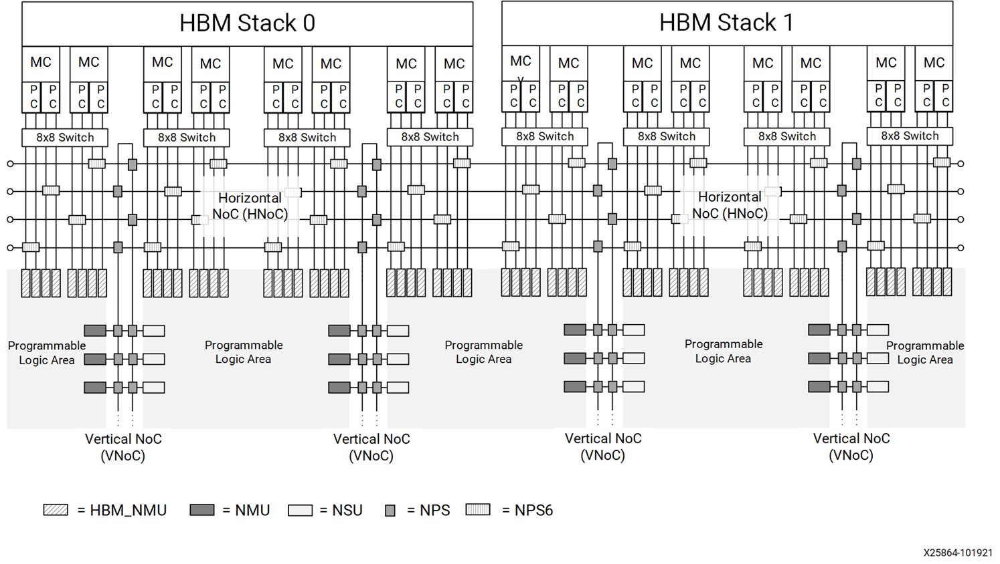

With each HBM stack, 8 Memory Controllers (MC) can be found, each of which is responsible for two Pseudo Channels (PC) in the HBM array. Each PC is accessible on the NoC via two NSU ports. These NSU ports are connected to an 8x8 switch, which is shared by two adjacent MCs. The 8x8 switch can therefore direct routing to any of the four PCs within the pair. If a packet needs to reach an HBM controller outside of the pair, it will be rerouted to another switch via the HNoC. It's important to note that there are no direct interconnections between the 8x8 switches.

The following figure (from *PG313 Versal ACAP Programmable Network on Chip and Integrated Memory Controller*) depicts the 8x8 switch in greater detail.

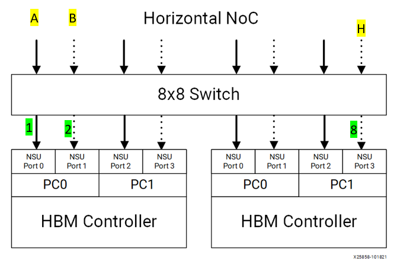

The routing from ingress ports A, B, ... H can be linked to any of the egress ports 1, 2, ... 8 via the 8x8 switch. The 8x8 switch is then connected to the adjacent HNoC lanes via NPS6. In general, the 8x8 switch connects the NPS6 to the controller's pseudo channels, specifically NSU port 0 or port 1 or both, while NPS6 connects the 8x8 switch to the nearby NMUs. To reiterate, NPS6 plays a key role in establishing lateral connections within the Horizontal NoC (HNoC), enabling NMUs to access various 8x8 switches for different HBM controllers.

The NoC view in Vivado Design Suite provides a closer look showcasing the NoC routing between the memory controllers and the NMU. Green squares represent MCs, Blue squares represent NMUs, and gray squares represent either NPS4 or NPS6.

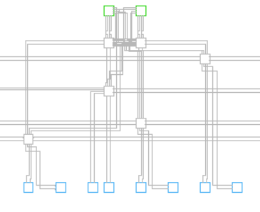

This shows a comprehensive view of the connections between the memory controller and the NMUs, with the routes that traverse through NPS4 and NPS6.

A closer look of the NoC view shows that 8x8 switches comprise of two interconnected NPS4.

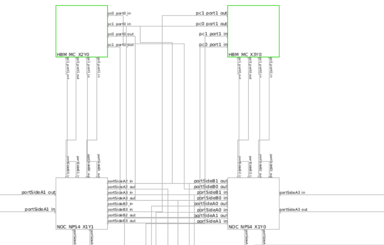

These NPS4 components have the capability to direct connections to the two memory controllers, as evidenced by the intersecting connections displayed in the diagram.

Routing in the Versal NoC is defined as the physical path that data takes between two endpoints within the network. The physical route defines the structural latency of the path, determined by the number of switches traversed through the route. Quality of service (QoS) constraints supplied by the designer are crucial in determining routing through the NoC. The NoC compiler in the Vivado Design Suite assigns NoC ingress points, egress points, and routing paths, considering the design connectivity and supplied constraints to solve for a globally optimal solution.

# Building the Designs

A progressive design approach will be employed, starting with a simple configuration and progressively adding complexity. The initial design employs a single traffic generator and a single HBM pseudo channel. Note that the traffic generator in this design will serve as the master.

## Start the Vivado Design Suite

1. Open the Vivado® Design Suite with 2023.1 release or later.
2. Click **Create Project** from the Quick Start Menu.
3. In the Project Name page specify a name of the project such as **hbm_module_3**.
4. Step through the pop-up menus to access the Default Part page.
5. In the Default Part page, search for and select: **xcvh1582-vsva3697-2MP-e-S**.
6. Continue to the Finish stage to create the new project
7. In the Vivado Flow Navigator, click  **IP Integrator → Create Block Design**. A popup dialog box displays the block design. Type a name (hbm_mod3) for the block design in the **Design name** field.
8. Click **OK**. An empty block design diagram canvas opens.  

## Building the Initial Design

1. Add one AXI NoC instance, and run block automation, with the following settings:
   - HBM AXI Slave Interfaces: 1
   - External Sources: None
   - AXI BRAM Controller: None
   - Memory Controller Type: HBM
   - HBM Memory Size (GB): 2
   - AXI Performance Monitor for PL-2-NOC AXI-MM pins: Checked
   - AXI Clk Source: New/Reuse Simulation Clock and Reset Generator
2. Run Connection Automation twice, selecting All Automation.
3. Regenerate the layout.
4. Edit the axi_noc_0 properties.
   - General:
     - AXI Interfaces
         - The Number of AXI Slave Interfaces: 0
         - The Number of AXI Clocks: 1.
     - Memory Controllers – DDR4/LPDDR4
         - The Memory Controller: None
     - Memory Controllers – HBM
         - The Number of Channels and Memory Size: 1 (2 GB)
         - The Number of HBM AXI PL Slave Interfaces: 1
   - Connectivity:
      - Input HBM00_AXI connected to HBM0 PC0 through port 0
   - QoS:
      - Read Bandwidth: 500 MB/s
      - Write Bandwidth: 500 MB/s
   - HBM Configuration:
      - HBM Clock: Internal
      - HBM Memory Frequency for Stack 0 (MHz): 1600
      - HBM Reference Frequency for Stack 0 (MHz): 100
5. Edit the noc_clk_gen properties:
   - AXI-0 Clock Frequency (MHz): 400
6. Run Connection Automation if prompted
7. Set the Addressing
   - Click Assign All on the address editor tab.

## Single NMU Design

The steps above generate a simple design where one traffic generator transacts with a single pseudo-channel in the HBM array.

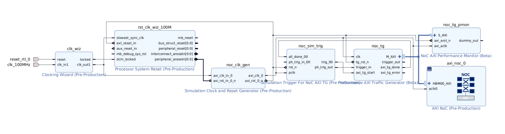

Open the AXI NoC IP customization GUI by double-clicking it.

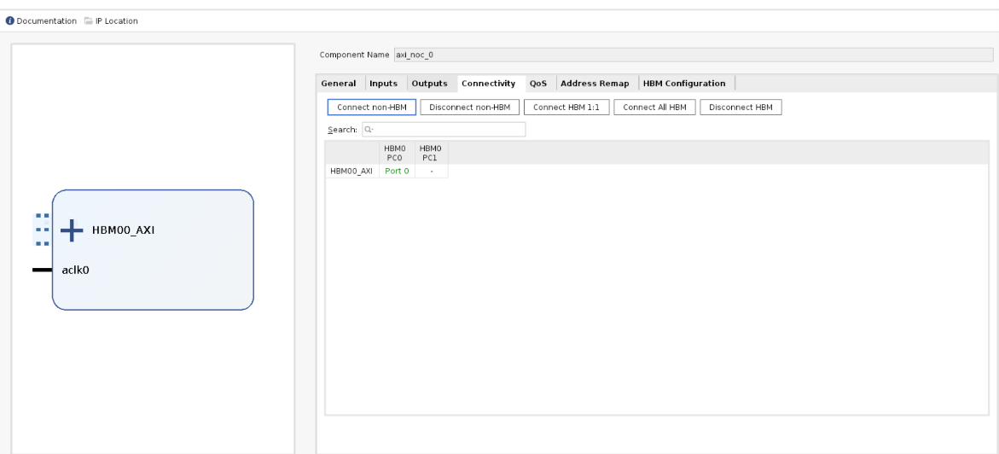

The connectivity tab displays a single connection from the NMU (HBM00_AXI) to one port on the pseudo-channel (Port 0 of HBM0 PC0).

Navigate to the QoS tab.

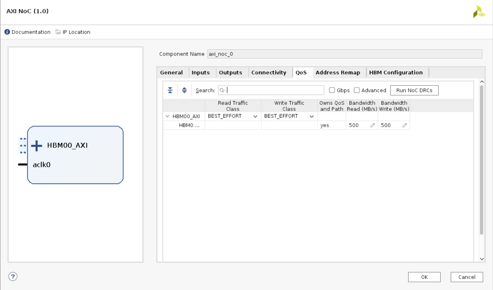

Every route through the NoC has an associated quality of service (QoS) requirement. You can set the QoS requirement for each connection enabled in the NoC IP. For the single connection established in this design, a default value of 500 MB/s has been configured for both the read and write paths.

It is important to recognize that setting the QoS bandwidth requirement does not assure that the network will consistently achieve this speed. Several factors come into play, including the capacity of the master to transmit data at this rate and the capability of the memory channel to respond at that speed. It is also worth noting that the actual performance of a route through the NoC may exceed the QoS bandwidth requirement, if the capacity of the route exceeds the requested bandwidth.

The QoS requirements, together with the set of desired NoC connections, constitute a traffic specification. The traffic specification is used internally by the NoC compiler to compute a configuration for the NoC.

Click **OK** to close the customization GUI without making any changes. Validate the design.

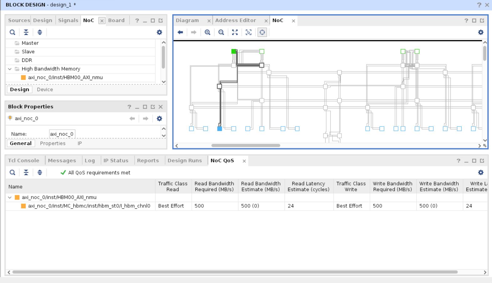

Validating the design invokes the NoC compiler. With no other routes in the network, the NoC compiler chooses from the shortest available paths in order to minimize structural latency through the network. Alternatively, design 1 can be created as follows:

```tcl
source ./Design_TCL/Design_1/Design1.tcl
```

The traffic generator in the design uses a 400 MHz AXI clock. With a configured bus width of 256b, the maximum theoretical throughput of the master is therefore 12,800 MB/s. Rather than the low initial bandwidth request of 500 MB/s, update the QoS requirement to match this throughput:

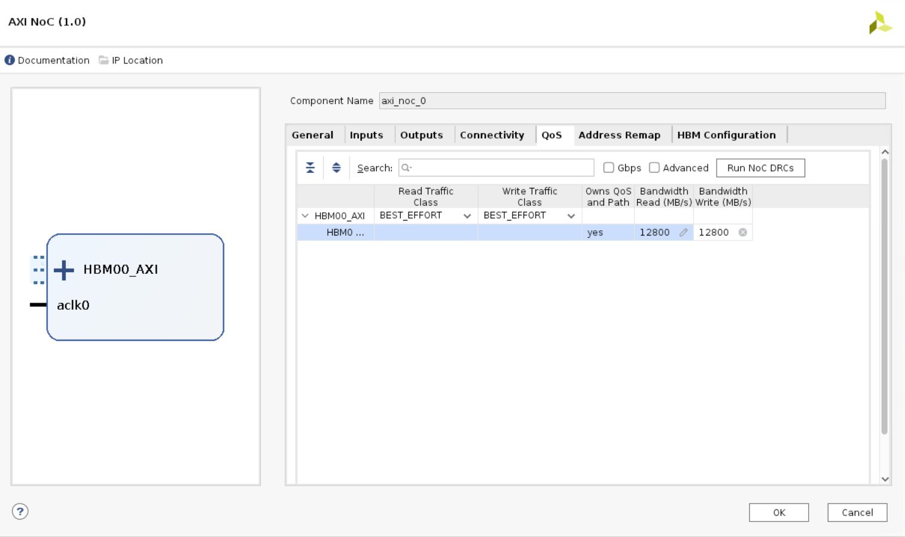

Validate the design again to invoke the NoC compiler with the updated QoS settings.

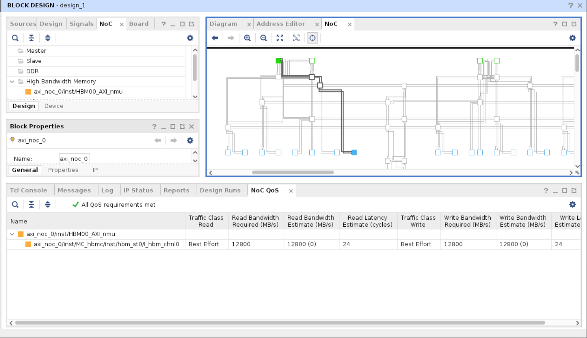

Note the NoC QoS tab at the bottom of the Vivado window. All QoS requirements are met, indicating that the NoC compiler successfully generated a solution satisfying the increased bandwidth requirement. Again, with only a single route in the network, the NoC compiler chooses one of the shortest available paths from NMU to HBM0 PC0.

Reconfigure the NoC IP. In the connectivity tab, select "Connect All HBM". An additional NoC route is enabled, allowing the traffic generator connected to the NMU at HBM00_AXI to access both pseudo channels of the memory controller. This enables access to the entire 2 GB of the enabled memory space.


Under Quality of Service, update the bandwidth requirement to 6400 MB/s for each of the enabled routes.


Validate the design to again invoke the NoC compiler. **Note** You might be asked to assign a missing address; please press "OK" when prompted.


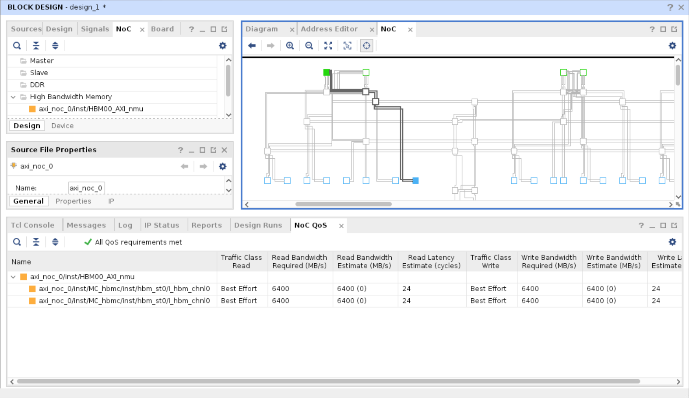

The resulting path is similar to the previous result, with a single route from the NMU to the input of the 8x8 switch. At the egress of the switch, two routes are enabled to access two independent ports of the enabled memory controller.

## Multiple NMUs

So far, this design has employed a single master to access one or more HBM pseudo channels. To properly utilize the available HBM bandwidth, multiple masters must simultaneously access the various channels in the HBM array. These masters can be designated for either multiple different applications or consolidated into a single application.

The provided script will build a design with four traffic generators accessing both pseudo channels in a memory controller. In the Vivado Tcl console:

```tcl
source ./Design_TCL/Design_2/Design2.tcl
```

The design appears as follows:

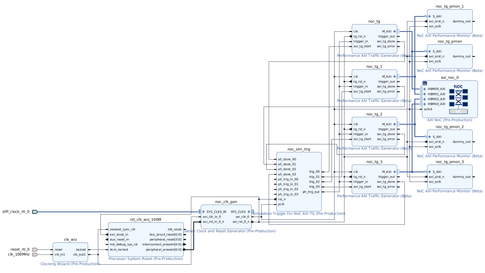

Open the AXI NoC IP customization GUI. The connectivity is set to a 1:1 configuration, with each master connecting to a distinct port on the HBM controller. Two masters are connected to each pseudo channel.

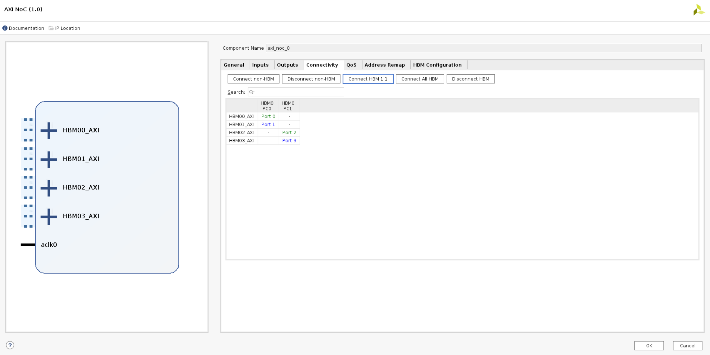

In the QoS tab, set a bandwidth requirement of 12800 MB/s for both the read and write path of each route. With an AXI clock rate of 400 MHz, 12800 MB/s represents the peak throughput attainable by a 256-bit bus.

**Note:** The maximum theoretical throughput of the HBM pseudo channel is 25.6 GB/s.

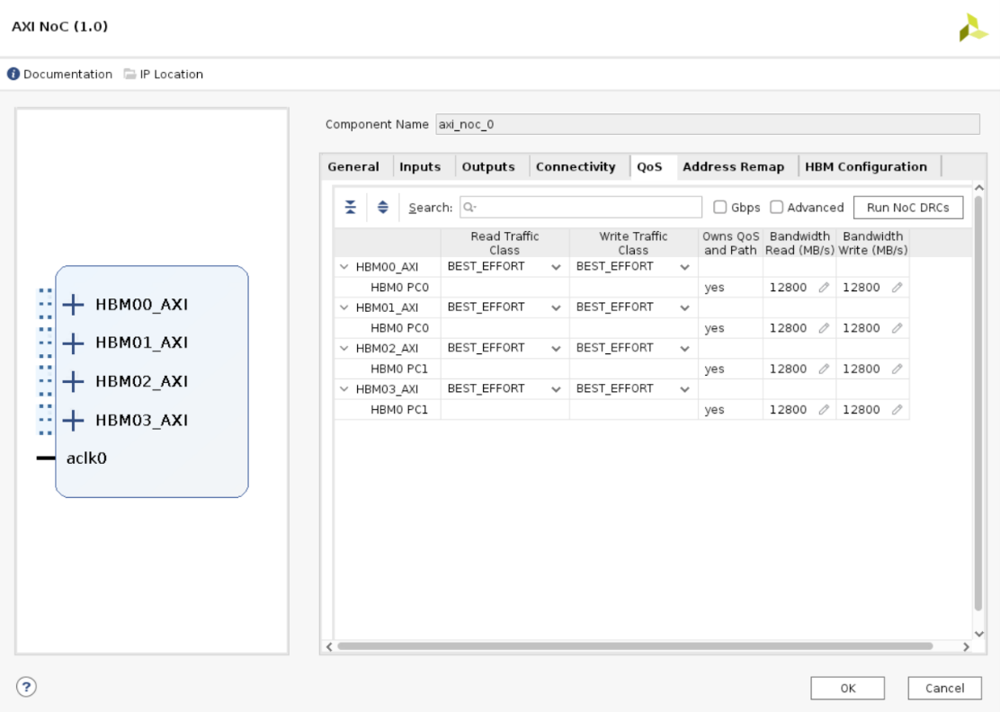

Validate the design to invoke the NoC compiler.

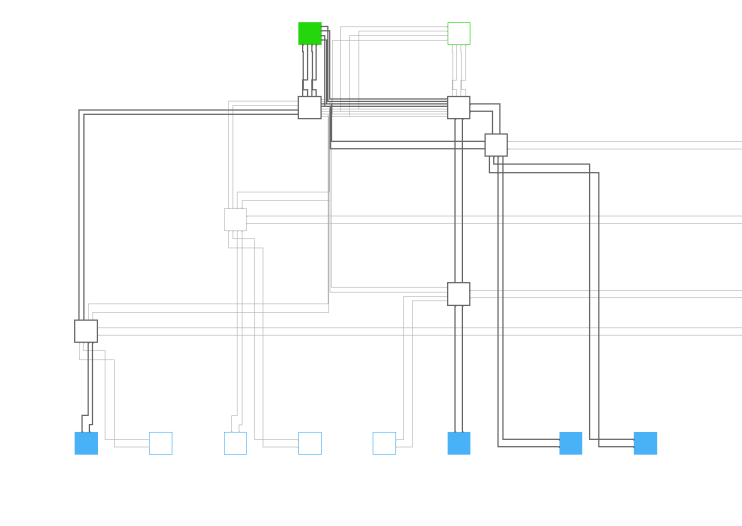

The QoS requirements are met. Each NMU was given a distinct route to the appropriate destination port on the HBM controller.

Reconfigure the NoC IP. In the connectivity tab, select **Connect All HBM**. Additional NoC routes are  enabled, ensuring that every NMU can reach PC of the MC. This enables each traffic generator access to the entire 2 GB of the enabled memory space.

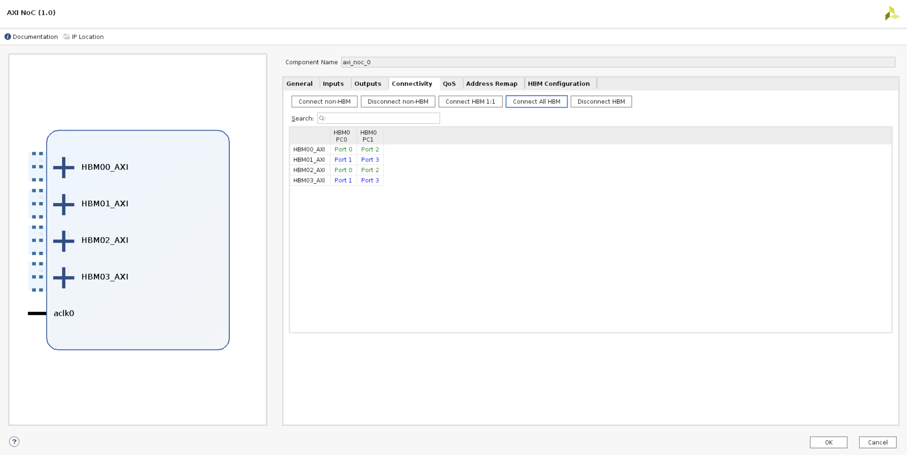

Additional endpoints were added for each traffic generator. As the maximum total throughput that the master can provide is unchanged, the QoS requirements should be reduced to account for the additional data paths. The following Tcl commands are provided for convenience:

```tcl
set_property -dict [list CONFIG.CONNECTIONS {HBM0_PORT2 {read_bw {500} write_bw {500} read_avg_burst {4} write_avg_burst {4}} HBM0_PORT0 {read_bw {6400} write_bw {6400} read_avg_burst {4} write_avg_burst {4}}}] [get_bd_intf_pins /axi_noc_0/HBM00_AXI]
set_property -dict [list CONFIG.CONNECTIONS {HBM0_PORT1 {read_bw {6400} write_bw {6400} read_avg_burst {4} write_avg_burst {4}} HBM0_PORT3 {read_bw {500} write_bw {500} read_avg_burst {4} write_avg_burst {4}}}] [get_bd_intf_pins /axi_noc_0/HBM01_AXI]
set_property -dict [list CONFIG.CONNECTIONS {HBM0_PORT2 {read_bw {6400} write_bw {6400} read_avg_burst {4} write_avg_burst {4}} HBM0_PORT0 {read_bw {500} write_bw {500} read_avg_burst {4} write_avg_burst {4}}}] [get_bd_intf_pins /axi_noc_0/HBM02_AXI]
set_property -dict [list CONFIG.CONNECTIONS {HBM0_PORT1 {read_bw {500} write_bw {500} read_avg_burst {4} write_avg_burst {4}} HBM0_PORT3 {read_bw {6400} write_bw {6400} read_avg_burst {4} write_avg_burst {4}}}] [get_bd_intf_pins /axi_noc_0/HBM03_AXI]
```

**Note:** In user designs, the QoS bandwidth requirement should be set to reflect the average data bandwidth the connection is expected to consume.

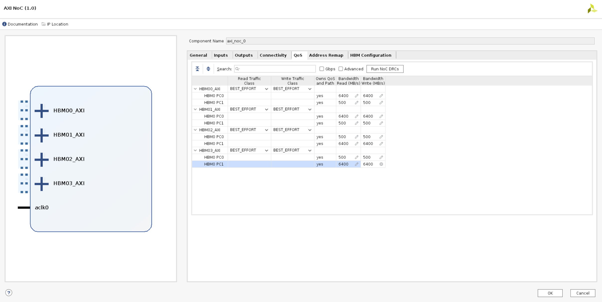

Validating the design yields the following solution. **Note** You might be asked to assign a missing address; please press "OK" when prompted.

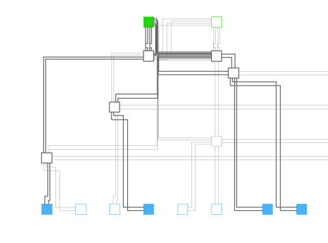

Tracing each route through the NoC, you can see that for each of the NMUs, connectivity to the two distinct endpoints is provided by the 8x8 switch. Thus far, every pathway within the NoC has utilized local routing resources, where masters associated with each NMU access the HBM pseudo-channels situated nearby.

**Note:** A route through the NoC can be highlighted by selecting the corresponding endpoint in the NoC QoS tab below the NoC view.

## Shared Routes

The designs so far have demonstrated local and global routing in the HBM array, and how connectivity and QoS requirements are used by the NoC compiler to route masters to endpoints within the network. One topic which has not been covered is the effect of QoS requirements on shared routes.

A design is provided. In the Vivado Tcl console:

```tcl
source ./Design_TCL/Design_3/Design3.tcl
```

The design, shown below, consists of eight traffic generators accessing two HBM controllers.

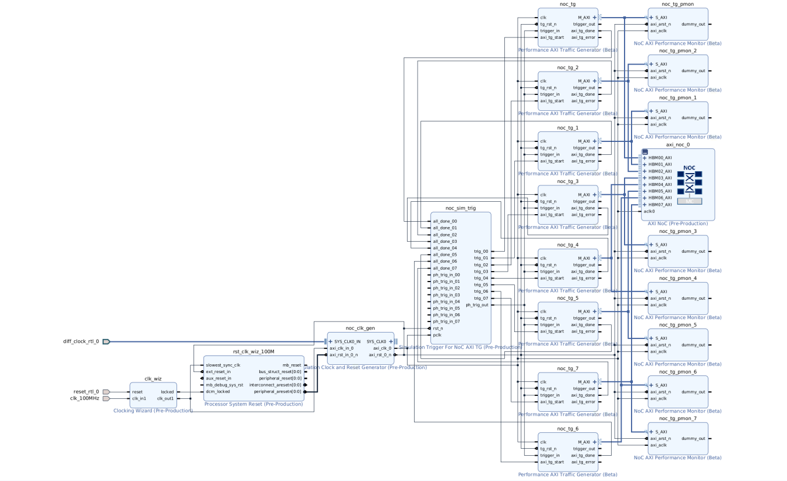

All eight traffic generators have access to the entire memory space spanned by the four HBM pseudo channels. Each path through the NoC is assigned a default QoS bandwidth requirement of 500 MB/s in a 1:1 connection as shown in this design.

The completed solution is shown below.

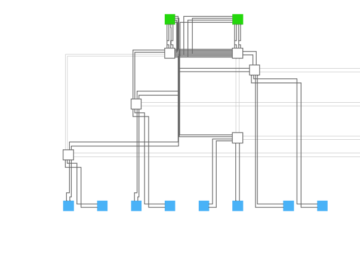


Taking a closer look at the routing solution, you will notice some lanes between the eight NMUs and the 8x8 switch are unused. With low QoS bandwidth requirements, the NoC compiler is consolidating paths in order to conserve routing resources. This solution satisfies the specified bandwidth request, as the aggregate bandwidth is well within the available capacity of the occupied routes.

Suppose that each of the NMUs has a high priority access path to a given pseudo channel. The following Tcl commands will increase the bandwidth requirements for these high priority paths:


```tcl
set_property -dict [list CONFIG.CONNECTIONS {HBM1_PORT2 {read_bw {500} write_bw {500} read_avg_burst {4} write_avg_burst {4}} HBM0_PORT2 {read_bw {500} write_bw {500} read_avg_burst {4} write_avg_burst {4}} HBM0_PORT0 {read_bw {6400} write_bw {6400} read_avg_burst {4} write_avg_burst {4}} HBM1_PORT0 {read_bw {500} write_bw {500} read_avg_burst {4} write_avg_burst {4}}}] [get_bd_intf_pins /axi_noc_0/HBM00_AXI]
set_property -dict [list CONFIG.CONNECTIONS {HBM1_PORT3 {read_bw {500} write_bw {500} read_avg_burst {4} write_avg_burst {4}} HBM0_PORT1 {read_bw {6400} write_bw {6400} read_avg_burst {4} write_avg_burst {4}} HBM0_PORT3 {read_bw {500} write_bw {500} read_avg_burst {4} write_avg_burst {4}} HBM1_PORT1 {read_bw {500} write_bw {500} read_avg_burst {4} write_avg_burst {4}}}] [get_bd_intf_pins /axi_noc_0/HBM01_AXI]
set_property -dict [list CONFIG.CONNECTIONS {HBM1_PORT2 {read_bw {500} write_bw {500} read_avg_burst {4} write_avg_burst {4}} HBM0_PORT2 {read_bw {6400} write_bw {6400} read_avg_burst {4} write_avg_burst {4}} HBM0_PORT0 {read_bw {500} write_bw {500} read_avg_burst {4} write_avg_burst {4}} HBM1_PORT0 {read_bw {500} write_bw {500} read_avg_burst {4} write_avg_burst {4}}}] [get_bd_intf_pins /axi_noc_0/HBM02_AXI]
set_property -dict [list CONFIG.CONNECTIONS {HBM1_PORT3 {read_bw {500} write_bw {500} read_avg_burst {4} write_avg_burst {4}} HBM0_PORT1 {read_bw {500} write_bw {500} read_avg_burst {4} write_avg_burst {4}} HBM0_PORT3 {read_bw {6400} write_bw {6400} read_avg_burst {4} write_avg_burst {4}} HBM1_PORT1 {read_bw {500} write_bw {500} read_avg_burst {4} write_avg_burst {4}}}] [get_bd_intf_pins /axi_noc_0/HBM03_AXI]
set_property -dict [list CONFIG.CONNECTIONS {HBM1_PORT2 {read_bw {500} write_bw {500} read_avg_burst {4} write_avg_burst {4}} HBM0_PORT2 {read_bw {500} write_bw {500} read_avg_burst {4} write_avg_burst {4}} HBM0_PORT0 {read_bw {500} write_bw {500} read_avg_burst {4} write_avg_burst {4}} HBM1_PORT0 {read_bw {6400} write_bw {6400} read_avg_burst {4} write_avg_burst {4}}}] [get_bd_intf_pins /axi_noc_0/HBM04_AXI]
set_property -dict [list CONFIG.CONNECTIONS {HBM1_PORT3 {read_bw {500} write_bw {500} read_avg_burst {4} write_avg_burst {4}} HBM0_PORT1 {read_bw {500} write_bw {500} read_avg_burst {4} write_avg_burst {4}} HBM0_PORT3 {read_bw {500} write_bw {500} read_avg_burst {4} write_avg_burst {4}} HBM1_PORT1 {read_bw {6400} write_bw {6400} read_avg_burst {4} write_avg_burst {4}}}] [get_bd_intf_pins /axi_noc_0/HBM05_AXI]
set_property -dict [list CONFIG.CONNECTIONS {HBM1_PORT2 {read_bw {6400} write_bw {6400} read_avg_burst {4} write_avg_burst {4}} HBM0_PORT2 {read_bw {500} write_bw {500} read_avg_burst {4} write_avg_burst {4}} HBM0_PORT0 {read_bw {500} write_bw {500} read_avg_burst {4} write_avg_burst {4}} HBM1_PORT0 {read_bw {500} write_bw {500} read_avg_burst {4} write_avg_burst {4}}}] [get_bd_intf_pins /axi_noc_0/HBM06_AXI]
set_property -dict [list CONFIG.CONNECTIONS {HBM1_PORT3 {read_bw {6400} write_bw {6400} read_avg_burst {4} write_avg_burst {4}} HBM0_PORT1 {read_bw {500} write_bw {500} read_avg_burst {4} write_avg_burst {4}} HBM0_PORT3 {read_bw {500} write_bw {500} read_avg_burst {4} write_avg_burst {4}} HBM1_PORT1 {read_bw {500} write_bw {500} read_avg_burst {4} write_avg_burst {4}}}] [get_bd_intf_pins /axi_noc_0/HBM07_AXI]
```

Validate the design to see the updated NoC solution. **Note** You might be asked to assign a missing address; please press "OK" when prompted.

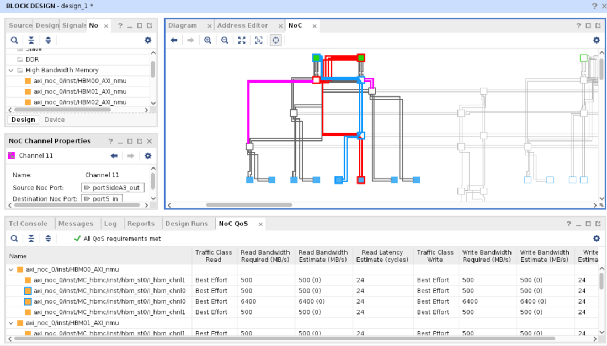

Additional lanes have been added to the solution. All of the local routing resources are leveraged to satisfy the increased bandwidth requirements.

## Global Connectivity

The NoC enables comprehensive device-wide connectivity, allowing any connected master to access any memory controller in the HBM array. This is achieved by leveraging the four HNoC lanes adjacent to the memory controllers.

To demonstrate this, reconfigure the NoC IP to enable more memory channels.

In the general tab, set **The Number of Channels and Memory Size: 8 (16 GB)**

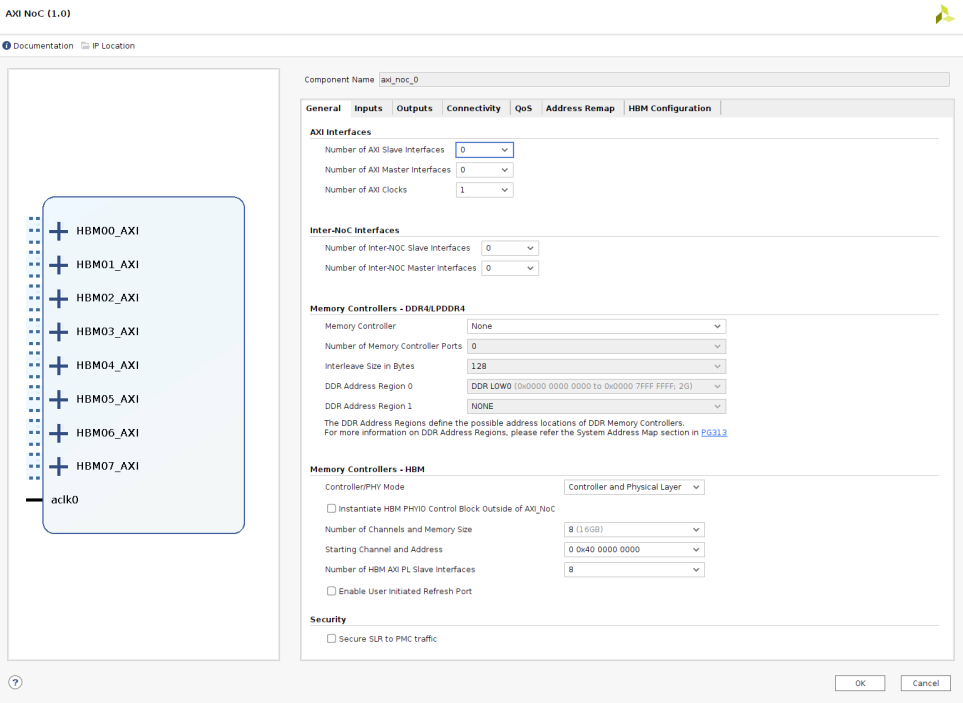

In the connectivity tab, make the following connection:

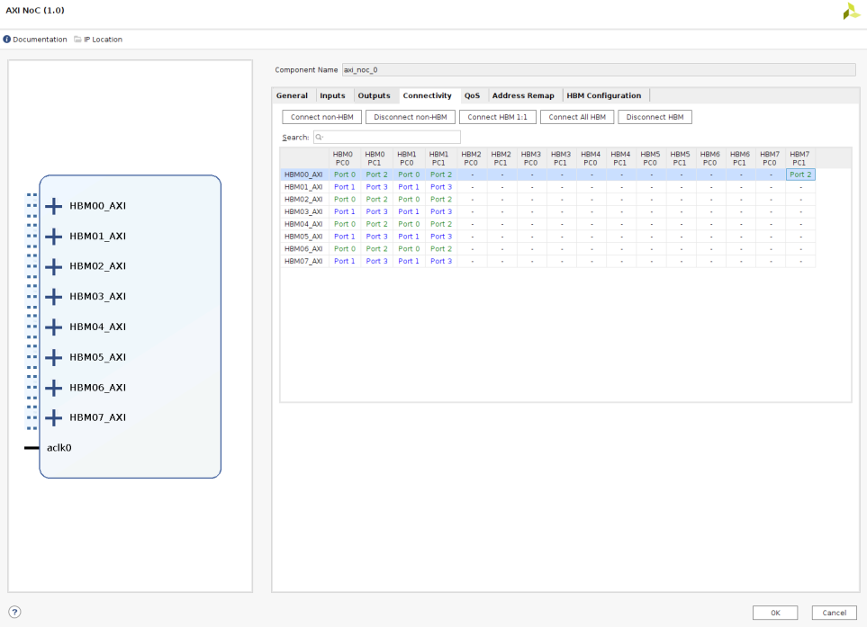

Validating the design yields the following solution.

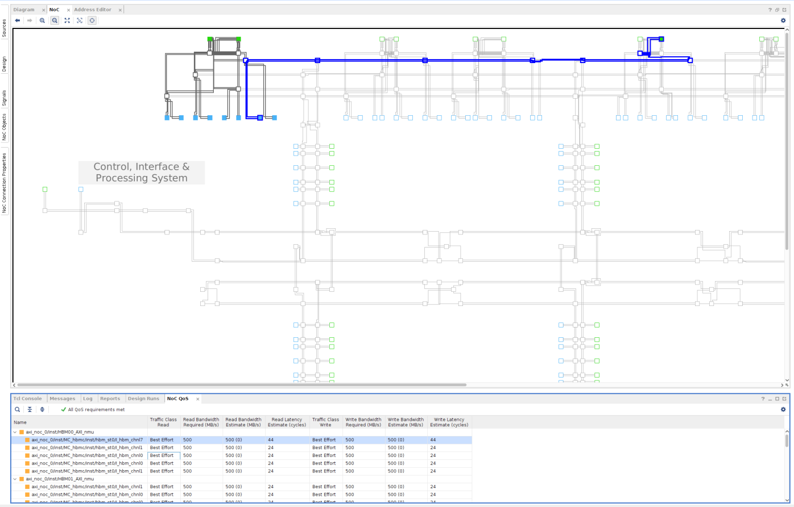

The newly established route is highlighted in blue. The compiler has added a route along one of the four HNoC lanes, allowing the master to reach a remote PC in the HBM array. You will notice in the NoC QoS tab, that this new route has a higher latency estimate than the other routes in the design. This is due to the additional NPS elements along the route to the endpoint. Each switch contributes additional structural latency to the path.

**Note:** Only structural latency is estimated by the NoC compiler. Dynamic latency may be higher, as in the case of congestion and queued transactions in the network.

In conclusion, this tutorial provides a detailed exploration of the NoC architecture within the top SLR of AMD Versal™ HBM devices. The tutorial highlights the impact of routing, latency, and quality of service (QoS) requirements in HBM designs, providing an overview of the NoC architecture, the role of switches, and the connectivity between memory controllers and NMUs. Stepping through the design flow in Vivado™ Design Suite, this guide showcases a progressive approach to building designs with increasing complexity. By examining different scenarios, including single and multiple traffic generators, the tutorial illustrates how QoS requirements influence the routing decisions made by the NoC compiler. In sum, this guide serves as a resource for designers working with Versal HBM devices, offering insight into effective utilization of the NoC for high bandwidth memory applications.


<hr class="sphinxhide"></hr>

<p class="sphinxhide" align="center"><sub>Copyright © 2020–2024 Advanced Micro Devices, Inc.</sub></p>

<p class="sphinxhide" align="center"><sup><a href="https://www.amd.com/en/corporate/copyright">Terms and Conditions</a></sup></p>
