<table class="sphinxhide" width="100%">
 <tr width="100%">
    <td align="center"><h1>Versal™ Adaptive SoC Architecture Tutorials</h1>
    </td>
 </tr>
 <tr>
   <td align="center"><h1>DCMAC to NoC Connectivity</h1>
   </td>
 </tr>
 <tr>
   <td align="center"><a href="https://www.xilinx.com/products/design-tools/vivado.html">See Vivado™ Development Environment on xilinx.com</a>
   </td>
 </tr>
</table>

# Introduction to Versal NoC and DCMAC

***Version: AMD Vivado&trade; 2023.2***

The AMD Versal™ programmable network on chip (NoC) is an AXI-interconnecting network used for sharing data between IP endpoints in the programmable logic (PL), the processing system (PS), and other hard blocks.  

Many Versal™ devices contain one or more DCMAC (600G Channelized Multirate Ethernet Subsystem) hard IPs, each supporting one or more Ethernet links up to a combined total bandwidth of 600 Gb/s per IP.  

The NoC can be used to transport data between high-bandwidth IPs such as DCMAC without consuming fabric resources.  


## Design Goal

The goal of this reference design is to demonstrate the utility of the NoC to transport high-bandwidth interfaces which are not standard AXI-stream.  

The DCMAC IP uses a segmented AXI-stream (AXI-S) interface to maintain high bandwidth by segmenting wide AXI-stream interfaces into multiple 128-bit wide segments, thereby limiting the number of idle bytes on a transfer should the packet length be unaligned with an AXI-stream transfer size boundary. The segmented AXI-stream is used on other Ethernet related IPs (such as HSC or MRMAC).

A common use case would be to transfer the payload data for a high-speed link (for example, 400 Gb/s Ethernet) between hard IP blocks that may have significant separation, such as being located in different super logic regions (SLR) of the device. This reference design will show that the NoC infrastructure can be used for connecting these segmented AXI-S hard IPs with a minimum of custom connection logic required for bridging. Using the NoC potentially avoids the timing closure challenges and/or routing limitations associated with propagating a wide high-speed bus across SLR boundaries.

> **Note**: This tutorial outlines one approach for transporting a DCMAC data link over the NoC. Other solutions are possible, refer to *Appendix: Alternative Solutions* at the end of this tutorial for a description of different implementation options.


## Design Background

- Platform: Versal
- Board: VPK180 (XCVP1802 part, 4 SLRs)
- Tools: Vivado 2023.2

This DCMAC/NoC reference design implements a data path connection between two DCMAC IPs supporting a 400G link using the NoC infrastructure.  
i.e. DCMAC #0  &rarr;  DCMAC #1  

The locations used for the DCMAC IPs are represented in the device view below; more details regarding locations, routing, etc. are presented later in this document.  


[ 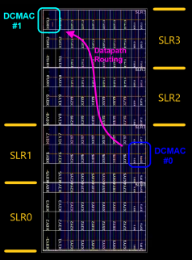 ](./images/vivado_synth_device_markup.png) *(click to expand)*

Although the NoC has multiple endpoints per SLR and can be used to transport data within an SLR, it can just as easily transport data across SLRs which may have otherwise added complications for fabric logic routing. This DCMAC/NoC reference design transfers data between two DCMAC IPs located in different SLRs to better showcase the NoC capabilities.  

This DCMAC/NoC reference design uses as a base the DCMAC example design as generated by Vivado.  
( example design hierarchy )  

- dcmac_0_exdes_imp_top  
  - dcmac_0_exdes  (dataplane)  
    - several RTL modules, block diagram for DCMAC & GT quads  
  - dcmac_0_cips_wrapper  (control plane)  
    - block diagram for CIPS and AXI-Lite & APB interconnect  

The block diagram below represents the simplified module connectivity and data flow within the unmodified DCMAC reference design generated by the Vivado tool. (dataplane sub-hierarchy only)

*(click to expand)*
[ 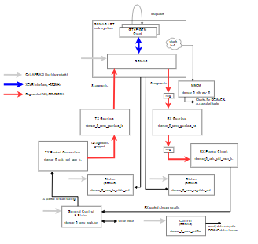 ](./images/bd_dcmag_eg_base.png)

This DCMAC/NoC reference design adds a second DCMAC instance and NoC channels for datapath connectivity. The block diagram below represents the updated module connectivity and data flow to accommodate both DCMAC IPs & the NoC.

*(click to expand)*
[ 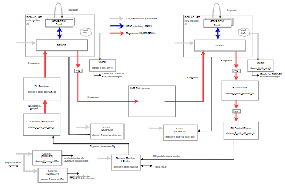 ](./images/bd_dcmag_eg_modx2.png)


### Design Considerations

#### DCMAC

[DCMAC Documentation](https://docs.xilinx.com/r/en-US/pg369-dcmac "DCMAC Product Guide PG369")  

The DCMAC instance(s) in this reference design supports a single 400 Gb/s link, the highest capacity Ethernet link available.  
For clarity of dataflow, only one link (at 400 Gb/s) is implemented in the design.  
i.e. the DCMAC ports are configured as  ports 0-3 400GAUI, ports 4-5 disabled

DCMAC configuration reference:  
*(click to expand)*
[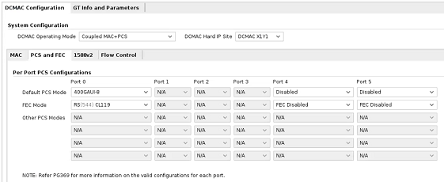](./images/dcmac_config.png)

> **Note**: The TX & RX AXI-S ports on the DCMAC use a modified (segmented) AXI-S style of data transfer with special considerations, please refer to DCMAC documentation for details.
> In particular, each segment has additional signaling in the TUSER field: enable (ENA), start-of-packet (SOP), end-of-packet (EOP), error (ERR), and empty bytes indication (MTY).
> Additionally, the TX data input port has backpressure output indicators to throttle the data. The input data rate cannot be throttled arbitrarily by deasserting valid indicator (and enables) on any given cycle - valid can only be deasserted safely after a transfer containing an EOP with no following SOP **OR** if TAF (internal TX buffer almost full indicator) is asserted on the previous cycle. Otherwise, TX data throttling is driven by the DCMAC IP via assertion of ready indicator.


#### NoC

[NoC Architecture Documentation](https://docs.xilinx.com/r/en-US/pg313-network-on-chip "NoC Product Guide PG313")  

The maximum bandwidth capacity for a single NoC channel is 16GB/s for a -2 speed grade part (as in the VP1802 device used on the VPK180 board).
A 400 Gb/s link would require a minimum of 400 Gb/s / (16GB/s x 8bit/byte) = 3.125  &rarr;  **4** unshared NoC channels.

> **Note**: The true number of NoC channels required depends on a variety of parameters, such as:
>
> - Segmented AXI-S &harr; NoC transport (AXI-S) mapping approach, e.g.
>   - Convert segmented AXI-S to unsegmented AXI-S, split/stripe unsegmented AXI-S among multiple NoC channels
>   - Convert segmented AXI-S to unsegmented AXI-S, round-robin unsegmented AXI-S packets across multiple NoC channels
>   - Split/stripe segmented AXI-S to multiple NoC channels directly, align stripe at NoC far-end
> - Expected Ethernet bandwidth usage
>   - Smaller packets generally have higher percentage of wasted bytes after unsegmented AXI-S conversion, increases needed NoC capacity
>   - Increased inter-packet gap adds "dead" time between new packet starts, decreases needed NoC capacity
> - NoC channel utilization by other part of the system
>   - Shared NoC channels reduce the per-channel NoC capacity available

This DCMAC/NoC reference design uses **4** NoC channels to support the maximum DCMAC &rarr; DCMAC bandwidth. The NoC endpoints can be configured for 128/256/512-bit interface width - the 256-bit interface option is used as it aligns the segmented interface total width (1024 bits) with the aggregate NoC interface width (4x256 = 1024 bits).

> **Note**: The internal NoC channels are 128-bit @ 1GHz (-2 part) and are invisible to the user. The NMU (ingress) and NSU (egress) endpoints handle the width & clock domain conversion.  

The mapping solution used in this DCMAC/NoC reference design is that each NoC channel NMU/NSU is configured for 256-bit usage and transports 2x 128-bit DCMAC interface segments at the DCMAC AXI-S interface speed; the combined 4 NoC channels transport the entire 1024-bit segmented interface (8x 128-bit segments) with no conversion or padding. A full transport solution using this approach for the NoC requires custom logic at the far end to ensure the alignment of segments, but has the following advantages:

- No segmented AXI-S to unsegmented AXI-S conversion logic required
- No wasted NoC link capacity
  - e.g. Packet spanning 9x 128-bit segments would require 2 beats of 1024-bit unsegmented AXI-S with 7x128 = 996 bits of padding on second beat  
- No need to run logic at higher clock speed than minimum DCMAC AXI-S speed to make up for needed padding  

In this solution, the NoC AXI-S channels are transporting the segmented AXI-S payload & user data as 4x data pipes rather than as packetized transfers.  

Transport of the individual segments necessitates transport of the DCMAC sideband segmented interface indicators, (i.e., user data such as SOP, EOP, ENA, and so forth). The NoC has the following AXI-S support limitations as per PG313:  

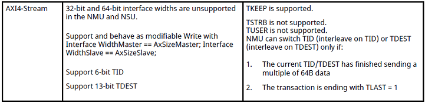  

The DCMAC MTY (empty) signal can be converted to use TKEEP (TKEEP=0 for unused segments is transported through the NoC unmodified). The DCMAC signals (SOP, EOP, and so forth) can be packed and transported using the NoC TID & TDEST, observing the NMU switching restrictions outlined above.  

Refer to the *Implementation Details & Results &rarr; NoC Solution Details* section for specifics of this reference design.  


#### Locations

The below table shows the location characteristics of the DCMAC IPs, GTM quads and NoC endpoints used in this DCMAC/NoC reference design.  
A DCMAC supporting a 400 Gb/s link requires two GTM quads - the quad locations were selected based on proximity to the corresponding DCMAC.  
The NoC endpoints were also selected based on proximity, allowing for some separation from the corresponding DCMAC to balance route distance with potential routing congestion. To better balance NoC latency, NSU/NMU pairs from same columns are used - each NSU/NMU has a separate column. Note that NoC routes with differing latencies are acceptable, but the support logic must be able to align the data prior to forwarding the data to DCMAC #1.  
  

<table>
    <thead>
        <tr>
            <th rowspan=2 colspan=2 style="text-align: center; border-bottom: 2px solid"></th>
            <th colspan=2 style="text-align: center">DCMAC Instance</th>
        </tr>
            <th style="text-align: center; border-bottom: 2px solid">#0</th>
            <th style="text-align: center; border-bottom: 2px solid">#1</th>
        </tr>
    </thead>
    <tbody>
        <tr>
            <td rowspan=3><b>DCMAC IPs</b></td>
            <td><b>Site</b></td>
            <td style="text-align: center">DCMAC_X1Y1</td>
            <td style="text-align: center">DCMAC_X0Y6</td>
        </tr>
        <tr>
            <td><b>SLR #</b></td>
            <td style="text-align: center">1</td>
            <td style="text-align: center">3</td>
        </tr>
        <tr>
            <td><b>Clock Region</b></td>
            <td style="text-align: center">X9Y6</td>
            <td style="text-align: center">X0Y13</td>
        </tr>
        <tr>
            <td rowspan=3><b>GTM quads </b></td>
            <td><b>Quad Sites</b></td>
            <td style="text-align: center">X1Y7 / X1Y8</td>
            <td style="text-align: center">X0Y21 / X0Y22</td>
        </tr>
        <tr>
            <td><b>I/O Banks</b></td>
            <td style="text-align: center">209 / 210</td>
            <td style="text-align: center">123 / 124</td>
        </tr>
        <tr>
            <td><b>Clock Region</b></td>
            <td style="text-align: center">X9Y6</td>
            <td style="text-align: center">X0Y13</td>
        </tr>
        <tr>
            <td rowspan=2><b>NoC </b></td>
            <td><b>NoC Sites</b></td>
            <td style="text-align: center">NMUs <br/> X2Y9 / X2Y10 / X1Y9 / X1Y10</td>
            <td style="text-align: center">NSUs <br/> X2Y21 / X2Y22 / X1Y21 / X1Y22</td>
        </tr>
        <tr>
            <td><b>Clock Regions</b></td>
            <td style="text-align: center">X5Y6 & X3Y6</td>
            <td style="text-align: center">X5Y12 & X3Y12</td>
        </tr>
    </tbody>
</table>


## Block Diagram

See below for an expanded block diagram including details regarding the conversion of data suitable for NoC transport.  

*(click to expand)*  
[ 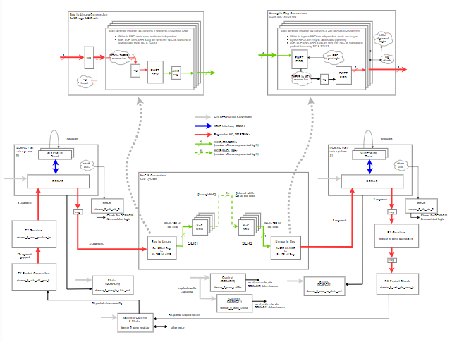 ](./images/bd_dcmag_eg_modx2_w_noc_solution.png)  

Notes on NoC:

- Reminder: 8 segmented AXI-S lanes map to 4 NoC AXI-S channels, i.e. 2 AXI-S segments (128-bits per segment) to 1 NoC AXI-S (256-bit)
  - Internally the 256-bit AXI-S is converted to 128-bit flits at higher speed, this is invisible to the user
- An incrementing tag value is inserted during the seg-to-unseg conversion on all AXI-S NoC transfers; this tag is used to check alignment at the egress of the unseg-to-seg when recombining the data
  - Unaligned data transfers are flagged via indicator (unconnected in this reference design)
- Refer to the *Implementation Details & Results &rarr; NoC Solution Details* section for more information


## Build & Simulation Instructions - Vivado 2023.2

### Original DCMAC Example Project Creation

This DCMAC/NoC reference design is based on the 400G DCMAC example project - many of the generated example project files are untouched. Refer to the *Implementation Details & Results &rarr; Conversion of DCMAC example design to this DCMAC/NoC reference design* section for the list of altered files and modification details.

The first step is to generate the original 400G DCMAC example project.

Open Vivado 2023.2. Within the TCL console, run the following command in the `scripts` directory:

```
source create_dcmac_eg_ref_project.tcl
```

The Vivado projects will be built in the `vivado_eg_ref` sub-directory.

The script will create a temporary project to create a DCMAC IP in 400G configuration, then will in turn generate the associated example design as a new project using a new Vivado instance.

The build script then captures both block diagrams to TCL for reference using the `write_bd_tcl` command. These block diagram TCL files are the same as the DCMAC/NoC reference design.

- vivado_eg_ref/ip_gen - temporary project, DCMAC IP only
- vivado_eg_ref/eg_ref - example design project  

The RTL source files are contained within the `dcmac_0_ex/imports/` sub-folder of the example design project.  

Once the script runs to completion, the resulting Vivado projects may be closed.

### Project Creation

The DCMAC/NoC project can be built from script referencing solely from the generated 400G DCMAC example design and the source files contained within this repo. There are several block diagrams within the project and each block diagram is represented by a TCL script that is called from the main script.

Within the Vivado TCL console, run the following command in the `scripts` directory:

```
source create_dcmac_x2_noc_project.tcl
```

The Vivado project will be built in the `vivado` sub-directory.

- All source files are snapshotted to the newly generated directory
- All 3 block diagrams are built
- A new DCMAC/GT block diagram is created and sourced to create a second almost identical DCMAC/GT subsystem instance
  - DCMAC location update (SLR3 instead of SLR1)
  - DCMAC IP & GT hierarchy have `_1` appended to avoid generated constraints conflict
  - The project contains 4 block diagrams after project creation is complete
- The NoC simulation model is generated using the `generate_switch_network_for_noc` TCL command
  - The `generate_switch_network_for_noc` TCL command assumes the ***Design Sources*** top-level is to be used for NoC model generation; this causes issues here because there are multiple block diagrams with NoC access potential
    - The simulation top-level DUT is different than the design top-level (simulation DUT excludes the control plane)
  - The script implements a workaround
    - The top-level is temporarily moved to the data plane (dcmac_0_exdes module)
    - The original top-level and control plane BD are temporarily disabled
    - NoC simulation model is generated
    - Original hierarchy is reinstated

### Build

After creating the project (`Project Creation` above), within the Flow Navigator, click **Generate Device Image**.


Let the project build run to completion.

The results in the Design Runs tab of the TCL console should be similar to the below:

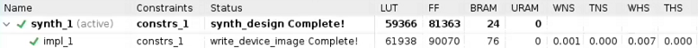  

Refer to the *Implementation Details & Results* section for more on build results.

### Simulation

After having created the project (`Project Creation` above), click on the **Run Simulation &rarr; Run Behavioral Simulation** button drop-down within the Flow Navigator.  
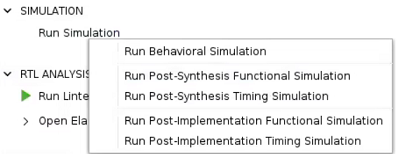  
No extra steps are required. The project creation script has already generated the NoC simulation model - the testbench calls the generated simulation wrapper module `dcmac_0_exdes_sim_wrapper` in lieu of the `dcmac_0_exdes` module.
Let the project simulation run to completion.  

The simulation initiates GT alignment for all quads - after alignment is achieved the DCMAC IPs and custom register modules are configured for intended operation. Packet generation is then started, a high-bandwidth packet stream with variable packet length in which almost all packets are transmitted back-to-back, i.e. segmented AXI-S streams see SOPs and EOPs across all lanes. Packet generation is stopped after the test interval has elapsed; the packet generation & reception metrics are checked as well as the payload data. The payload data is a pseudorandom binary sequence (PRBS); flagged PRBS errors would identify lost/corrupted data.  


The final log entries displayed in the TCL console should be similar to the below:  
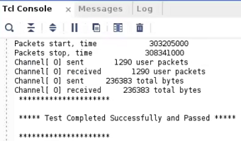  

> Caveat: After simulation completion, Vivado attempts to relaunch the simulation using the implementation top-level and errors out due to the presence of multiple NoC capable modules. Given the goal of this reference design is to highlight the NoC transport usage, this errored simulation reattempt can be ignored.

The *Test Completed Successfully and Passed* simulation message indicates that no packets were lost, and all data was successfully received without PRBS loss of sync. The NoC transport was successful in transmitting all packet data at the required bandwidth for a 400 Gb/s link.

#### Notes on Testbench

The testbench serves to configure the IPs & modules within the design - the data generation & checking is performed by the design RTL modules directly.  
Most of the simulation time involves the GT quads achieving alignment - the packet streaming start/stop is a relatively short interval. Note that this DCMAC/NoC reference design uses the `SIM_SPEED_UP` definition for accelerated simulation time.  

Refer to the table of file modifications in the *Implementation Details & Results* section for a list of updates to the example design testbench.  


## Implementation Details & Results

### Conversion of DCMAC example design to this DCMAC/NoC reference design

This reference design was developed with the aim of minimizing the modifications to the base fileset. The base fileset used was the generated DCMAC example design, a generic fileset which is modified during generation to suit DCMAC user parameters  - as such, there are areas of unused/dead code in the original fileset.  
To make clear the file changes associated with this reference design, no attempt was made to reorganize or `clean up` the generated files.  
The DCMAC example design was generated with the default project name of dcmac_0 - as a result, all the reference files have the "dcmac_0_" string as a prefix.
The text "__2dcmac_noc" was appended to the file names of modified RTL files to make clear which files were updated.  
The following files were updated:  


<table>
    <thead>
        <tr>
            <th style="text-align: left; border-bottom: 2px solid">File<br/>(original name)</th>
            <th style="text-align: left; border-bottom: 2px solid">Type</th>
            <th style="text-align: left; border-bottom: 2px solid">Notes</th>
        </tr>
    </thead>
    <tbody>
        <tr>
            <td rowspan=6><b>dcmac_0_exdes.sv</b></td>
            <td rowspan=6>RTL module</td>
            <td>Added second DCMAC/GT subsystem</td>
        <tr>
            <td>Replicated most signals for second DCMAC/GT subsystem<br/>
            ('__DCMAC0' suffix for DCMAC#0 subsystem, '__DCMAC1' suffix for DCMAC#1 subsystem)</td>
        </tr>
        <tr>
            <td>Added second MMCM & clock domains</td>
        </tr>
        <tr>
            <td>Insert NoC transport solution (see below for more details) and DCMAC#1 between DCMAC#0 RX and RX gearbox</td>
        </tr>
        <tr>
            <td>Add core sniffer module & custom preamble generation for DCMAC#1<br/>
            (both core sniffer modules written simultaneously)</td>
        </tr>
        <tr>
            <td>Move RX gearbox & RX monitor to DCMAC#1 clock domains</td>
        </tr>
        <tr>
            <td rowspan=3><b>dcmac_0_exdes_imp_top.sv</b></td>
            <td rowspan=3>RTL module</td>
            <td>Added connections to second GT subsystem</td>
        </tr>
        <tr>
            <td>Replicated reset signals for second DCMAC/GT subsystem</td>
        </tr>
        <tr>
            <td>Instantiate AXI-Lite interface for second DCMAC/GT subsystem</td>
        </tr>
        <tr>
            <td rowspan=4><b>dcmac_0_exdes_tb.sv</b></td>
            <td rowspan=4>Simulation <br/>testbench</td>
            <td>Added loopbacks for second GT subsystem, add second refclk</td>
        </tr>
        <tr>
            <td>Add second AXI-Lite interface<br/>
            Update tasks to access both AXI-Lite interfaces</td>
        </tr>
        <tr>
            <td>Extend configuration to all DCMAC ports</td>
        </tr>
        <tr>
            <td>Other minor signal & log updates</td>
        </tr>
        <tr>
            <td rowspan=2><b>dcmac_0_example_top.xdc</b></td>
            <td rowspan=2>Constraints</td>
            <td>Added pin locations for GT quads</td>
        </tr>
        <tr>
            <td>Added clocking info for second GT reference clock </td>
        </tr>
        <tr>
            <td><b>bd_cips.tcl</b></td>
            <td>Block diagram <br/>TCL capture</td>
            <td>CIPS control plane - M00_AXI_1 port was updated to 1MB of address space<br/>
            (to be connected to second DCMAC/GT subsystem)</td>
        </tr>
    </tbody>
</table>

> **Note**: The `bd_cips.tcl` file is not included in this repo. It is generated and modified by the `create_dcmac_eg_ref_project.tcl` script.


The two DCMAC/GT subsystems are identical regarding connection paths - only the DCMAC and GT locations are different (refer to table in the *Design Consideration &rarr; Locations* section).


### NoC Solution Details

> Also refer to the *Design Considerations &rarr; NoC* section

The NoC transport solution in this DCMAC/NoC reference design is implemented as a block diagram using the NoC IP with custom modules.  

Block diagram:  
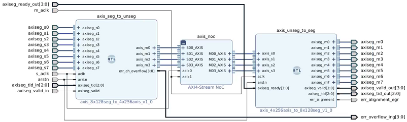  

To provide a cleaner connection diagram, a custom interface definition for the `axiseg_` signals is used to group segmented AXI-S components together. The interface was originally developed using the *Tools &rarr; Create Interface Definition...* option in the Vivado tool. This interface is defined and stored as a custom repo, loaded by the build script at project creation.  

A segmented interface connection is composed as follows:

```
tdata[128]
tuser_ena
tuser_sop
tuser_eop
tuser_err
tuser_mty[4]
```  
  
The 8 segments of the segmented interface are transported via 4 NoC channels, 2 segments per NoC channel.  

#### NoC IP**

The NoC IP is implemented with 4 mutually exclusive routing channels, each with 256-bit NMU & NSU. Although nominally the same frequency, the NMUs and NSUs are driven by different clock sources (corresponding to the two DCMAC/GT subsystems). TID & TDEST are enabled for segmented TUSER signal transport, maximum write bandwidth is defined for QoS purposes.

NoC configuration reference:

*(click to expand)*  
[ 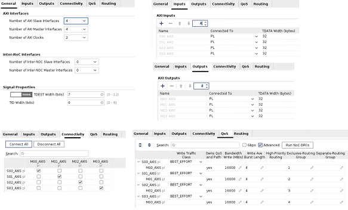 ](./images/noc_config.png)

NoC IP connection routing:

*(click to expand)*  
[ 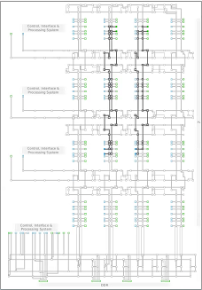  ](./images/noc_config_route_view.png)  


QoS results:
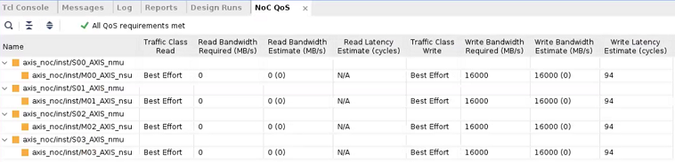  

This confirms the expected bandwidth capacity of the NoC channels.


#### Custom Module - Ingress to NoC

*( axis_seg_to_unseg in block diagram above )*

The segmented interface ingress is registered to derisk timing closure and separated into 4 parallel logic groups (2 segments per group); the tdata & tuser data associated with each group is flattened into an array and passed to FIFOs. These FIFOs serve as elasticity buffers to absorb any backpressure issued by the NoC channels. The FIFO data from each group is passed to the NoC channel NMUs via 256-bit data AXI-S interfaces.  
The NoC AXI-S TDATA width of 256 can accommodate 2x segments of 128-bit data, but the additional TUSER data (SOP, EOP, ERR, MTY) also needs to be transported across the NoC.

- TUSER MTY  
  - The NoC AXI-S supports TKEEP usage; the segmented MTY indicator is converted to the equivalent TKEEP representation and transmitted on the TKEEP field  
  - Only a maximum of 1 of the 2 segments can contain an EOP - the MTY associated with the segment containing EOP is selected for TKEEP conversion  
  - Segmented ENA (enable) indicator is signaled by setting TKEEP=0 when ENA is deasserted; propagation of TKEEP=0 is supported by the NoC
- TUSER SOP/EOP/ERR
  - Each NoC NMU is connected to only one NSU, no source/destination disambiguation is required nor is dynamic NoC routing information needed
  - As such, the TID & TDEST fields are available for AXI-S use and are repurposed for transporting the segmented TUSER SOP, EOP & ERR indicators  

To allow an alignment check on the NSU end of the 4 independent NoC transport channels, a time-incrementing 'tag' is inserted within each data beat; the same tag value is inserted on all parallel transport channels for a given beat, the incremented tag is inserted on the next beat, etc. The logic on the far end can compare the tag data values from all transport channels upon recombination of each beat to confirm proper recreation of the original 1024-bit (+ SOP etc.) segmented bus.

A breakdown of the NoC AXI-S field mappings are as follows:  

<table style="text-align: left">
    <thead>
        <tr>
            <th colspan=2 style="border-bottom: 2px solid">NoC AXI-S field<br/>
            NoC channel # N  (N = 0 to 3)</th>
            <th style="border-bottom: 2px solid">Maps to ...</th>
        </tr>
    </thead>
    <tbody>
        <tr>
            <td rowspan=2><b>TDATA</b></td>
            <td>127:0</td>
            <td>Seg 2xN TDATA (e.g. NoC #0 &rarr; seg0, NoC #1 &rarr; seg2, etc.)</td>
        </tr>
        <tr>
            <td>255:128</td>
            <td>Seg 2xN+1 TDATA(e.g. NoC #0 &rarr; seg1, NoC #1 &rarr; seg3, etc.)</td>
        </tr>
        <tr>
            <td><b>TKEEP</b></td>
            <td>15:0</td>
            <td>Seg 2xN or seg 2xN+1 MTY (depending on EOP), converted to TKEEP</td>
        </tr>
        <tr>
            <td rowspan=5><b>TID</b></td>
            <td>0</td>
            <td>Seg 2xN TUSER EOP</td>
        </tr>
        <tr>
            <td>1</td>
            <td>Seg 2xN+1 TUSER EOP</td>
        </tr>
        <tr>
            <td>2</td>
            <td>Seg 2xN TUSER SOP</td>
        </tr>
        <tr>
            <td>3</td>
            <td>Seg 2xN+1 TUSER SOP</td>
        </tr>
        <tr>
            <td>5:4</td>
            <td>Tag</td>
        </tr>
        <tr>
            <td rowspan=5><b>TDEST</b></td>
            <td>0</td>
            <td>Seg 2xN TUSER ERR</td>
        </tr>
        <tr>
            <td>1</td>
            <td>Seg 2xN+1 TUSER ERR</td>
        </tr>
        <tr>
            <td>4:2</td>
            <td>Seg TID LSBs (constant for DCMAC unchannelized mode)</td>
        </tr>
        <tr>
            <td>6:5</td>
            <td>Tag (same as NoC AXI-S TID[5:4])</td>
        </tr>
    </tbody>
</table>  


The AXI-S NoC has a restriction for updating the TID & TDEST fields - they can only be switched every 64 bytes of data (e.g. 2 beats for 256-bit AXI-S) or when TLAST=1. By permanently driving '1' to the TLAST input of the NoC channels, the TID & TDEST is updated with *every* 256-bit beat of the NoC channels without impact to the overall NoC bandwidth.  

The upstream DCMAC#0 RX can potentially output valid data continuously and cannot handle backpressure. The NoC should be able to handle the continuous bandwidth, however the FIFO levels are monitored, and an error flag is produced if any of the FIFOs experience an overflow due to excess NoC backpressure.  

RTL files:

- axis_2x_seg_to_1x_axis.sv
  - Parameterizable module, logic for conversion of two 128-bit segments to one AXI-S interface  
  - Parameters allow for 'N' instances of segmented to AXI-S conversion
- axis_8x128seg_to_4x256axis.v  
  - Verilog wrapper for axis_2x_seg_to_1x_axis.sv to allow block diagram instantiation with auto interface binding  
  - Parameter N=4 to allow conversion of 1024-bit segmented bus (8 segments) to 4x AXI-S interfaces, data resized for interfacing with parameterizable sub-module  


#### Custom Module - Egress from NoC

*( axis_unseg_to_seg in block diagram above )*

Incoming data - TDATA, TKEEP, TID & TDEST fields - are captured from the NoC channel NSUs via 4x AXI-S interfaces into parallel ingress FIFOs (one FIFO per NoC channel AXI-S). These FIFOs allow for instantaneous differences in data generation/consumption by the DCMAC IPs and act as a buffer for differential latency among the NoC channels. The synchronized draining of the ingress FIFOs only start once all the ingress FIFO fill levels have reached a minimum threshold.

The segmented AXI-S TX input of the downstream DCMAC#1 needs to support AXI-S style backpressure - i.e. combinatorial ready/valid connections - to allow the DCMAC to throttle the incoming data as needed. A wide AXI-S interface running at high speed (~390MHz) to a hard IP represents a timing closure challenge. There are a variety of potential approaches, the one used in this reference design involves a second (egress) set of FWFT FIFOs which interface directly to DCMAC#1. These egress FIFOs aid in two ways:

- The backpressure from the egress FIFOs to the ingress FIFOs uses the 'programmable full' indicators, allowing for additional simple registering of the ingress FIFO outputs and register stages for backpressure indicators  
- The final AXI-S connections from the egress FIFOs are closer to the DCMAC#1, allowing shorter data propagation times

> **Note**: There is an option to use an 'almost full' indicator from the DCMAC which would allow for a single register stage in the segmented AXI-S connection, this would have been a potential solution to explore as well.  

The egress FIFO outputs are mapped to the 8 segmented AXI-S fields in the final connection to DCMAC#1. Note that the TKEEP is converted to segmented MTY between the ingress & egress FIFOs, reducing the amount of combinatorial logic in the final connection to the DCMAC.  

The delayed drain of the ingress FIFOs based on FIFO fill levels is a simple method to achieve time-alignment of the independent parallel NoC channels carrying the data. The tag values generated upstream of the NoC are propagated through the FIFOs and checked for sameness at the output of the egress FIFOs; an error indicator is pulsed if the tag values differ, indicating an alignment error has occurred. No attempt is made in this reference design to dynamically reset the NoC interface; this would be possible if the indicators were made available to software-accessible registers & appropriate control software developed.  

RTL files:

- axis_1x_axis_to_2x_seg.sv
  - Parameterizable module, logic for conversion of one AXI-S interface to two 128-bit segments  
  - Parameters allow for 'N' instances of AXI-S to segmented conversion
- axis_4x256axis_to_8x128seg.v  
  - Verilog wrapper for axis_1x_axis_to_2x_seg.sv to allow block diagram instantiation with auto interface binding  
  - Parameter N=4 to allow conversion of 4x AXI-S interfaces to 1024-bit segmented bus (8 segments), data resized for interfacing with parameterizable sub-module  


### Timing Closure Notes

The NoC endpoints should be reasonably close to the appropriate DCMAC/GT subsystems to allow short routing paths; registering the signals can also help. This reference design incorporates hard locations for the NoC endpoints to create more deterministic results (note the tool can still adjust NoC endpoint locations during place & route). Placing an endpoint group too close to the corresponding DCMAC/GT subsystem was found to make timing worse - the congestion forced the tool to place the intermediary logic far from the IP blocks.  

This reference design uses the High SLR Utilization strategy as the implementation (place & route) strategy to help ensure logic isn't arbitrarily spread across SLR boundaries.  
`set_property strategy Performance_HighUtilSLRs [get_runs impl_1]`  

Experimentation with explicit pblock usage was not found to provide additional benefit to the implementation strategy above.  
Trial pblock definitions are captured in the define_pblock.tcl file; this file is disabled within the reference project but left in place for reference in case users want to experiment. This file creates pblocks to constrain custom NoC endpoint logic close to the NoC endpoints and constrains various modules to the same SLR as their respective DCMAC/GT subsystem.  

Only pin location constraints in keeping with the GT locations were added to the generated example design constraints.  


### Utilization & Routing

The utilization associated with the reference design should be similar to below:  
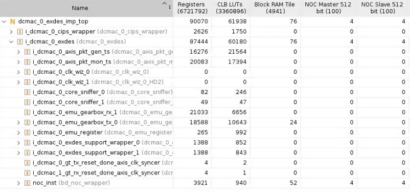  


With a corresponding device routing:  
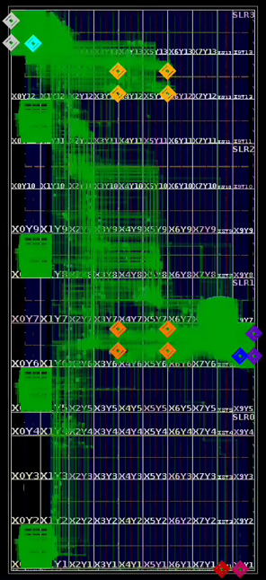  


Selection Color Legend:  
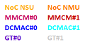  

TCL Commands to mark objects:

```
set path_to_noc {i_dcmac_0_exdes/noc_inst/bd_noc_i/axis_noc/inst/*/*}
set path_to_mmcm0 {i_dcmac_0_exdes/i_dcmac_0_clk_wiz_0/inst/clock_primitive_inst/MMCM*_inst}
set path_to_mmcm1 {i_dcmac_0_exdes/i_dcmac_0_clk_wiz_1/inst/clock_primitive_inst/MMCM*_inst}
set path_to_bd0 {i_dcmac_0_exdes/i_dcmac_0_exdes_support_wrapper*/dcmac_0_exdes_support_i}
set path_to_bd1 {i_dcmac_0_exdes/i_dcmac_0_exdes_support_wrapper*/dcmac_0_exdes_support_1_i}
mark_objects -rgb {255 170 0} [get_cells ${path_to_noc}/NOC_NSU512*];
mark_objects -rgb {255 120 0} [get_cells ${path_to_noc}/NOC_NMU512*];
mark_objects -rgb {200 0 100} [get_cells -quiet ${path_to_mmcm0}]
mark_objects -rgb {200 0 0} [get_cells -quiet ${path_to_mmcm1}]
mark_objects -rgb {0 0 255} [get_cells ${path_to_bd0}/dcmac_0_core*/inst/*/* -filter {REF_NAME == "DCMAC" }]
mark_objects -rgb {100 0 200} [get_cells ${path_to_bd0}/dcmac_0_gt_wrapper*/gt_quad_base*/inst/quad_inst]
mark_objects -rgb {0 255 255} [get_cells ${path_to_bd1}/dcmac_0_core*/inst/*/* -filter {REF_NAME == "DCMAC" }]
mark_objects -rgb {200 200 200} [get_cells ${path_to_bd1}/dcmac_0_gt_wrapper*/gt_quad_base*/inst/quad_inst]
```


## Comparison with Standard Pipeline (non-NoC) Transport Solution

For comparison purposes, the transport solution using the NoC was compared to a design using the fabric to bridge the two DCMAC IPs. The NoC solution was replaced with a series of pipeline registers the width of the segmented AXI interface, with elasticity FIFOs on either end to absorb backpressure. A total of 5 pipeline states were allocated - nominally 1 for crossing SLR1 and SLR3, and 3 for crossing SLR2.

> **Note**: The pipeline registers should use the `(* shreg_extract = "no" *) (* srl_style = "register" *)` attributes to avoid SRL optimization.  

The solution was simulated to ensure equivalency.  

The files for pipeline transport comparison are present in the design for reference purposes but left disabled.

- src/noc/reg_pipeline_comparison_only/register_pipeline_8x128seg_comparison.sv
  - replaces NoC BD wrapper file (generated file bd_noc_wrapper.v)  
- sim/reg_pipeline_comparison_only/register_pipeline_8x128seg_comparison_sim_wrapper.v  
  - replaces DUT simulation wrapper file (generated file dcmac_0_exdes_sim_wrapper.v)  

To replace the NoC solution with a pipeline solution as per above bullets, run the custom TCL process `dcmac_proj__enable_pipeline` (loaded by the project creation script) in the Vivado TCL command window after project creation.  

The side-by-side place & route results are as shown below.  

<table style="text-align: center">
    <thead>
        <tr style="text-align: center">
            <th border-bottom: 2px solid"></th>
            <th style="text-align: center; border-bottom: 2px solid">NoC Solution</th>
            <th style="text-align: center; border-bottom: 2px solid">Register Pipelining</th>
        </tr>
    </thead>
    <tbody>
        <tr>
            <td><b>Utilization</b><br/><i>(click to expand)</i> </td>
            <td style="text-align: center"> <a href="images/vivado_par_noc_utilization.png"> </a>  </td>
            <td style="text-align: center"> <a href="images/vivado_par_pipe_utilization.png"> </a>  </td>
        </tr>
        <tr>
            <td><b>Device Routing</b><br/><i>(click to expand)</i> </td>
            <td> <a href="images/vivado_par_noc_device.png"> </a>  </td>
            <td> <a href="images/vivado_par_pipe_device.png"> </a>  </td>
        </tr>
        <tr>
            <td><b>SLL Crossings</b></td>
            <td style="text-align: center">  </td>
            <td style="text-align: center">  </td>
        </tr>
    </tbody>
</table>


The comparison shows the results to be similar, illustrating the NoC as a viable solution for transporting high-speed segmented data between IP blocks. Note the reduction in visible routing crossing the device and the drop in Super Long Line (SLL) usage. The cross-device routing visible in the NoC solution is control plane related. This is **NOT** to imply that using the NoC is the *correct* solution for *all* designs - it is ultimately up to the developer to select a transport solution that is suitable for the design in question.  


## Directory Layout of Project Files


<table style="text-align: left">
    <thead>
        <tr>
            <th colspan=3 style="border-bottom: 2px solid">Directory</th>
            <th style="border-bottom: 2px solid">Notes</th>
        </tr>
    </thead>
    <tbody>
        <tr>
            <td colspan=3><b>constraints/</b></td>
            <td>Modified constraints file originally generated with DCMAC example design</td>
        </tr>
        <tr>
            <td colspan=3 style="border-top: 2px solid"><b>scripts/</b></td>
            <td style="border-top: 2px solid">Scripts for project creation, to be sourced by user</td>
        </tr>
        <tr>
            <td></td>
            <td colspan=2>bd/</td>
            <td>Block diagram definitions, run by project creation script</td>
        </tr>
        <tr>
            <td colspan=3 style="border-top: 2px solid"><b>sim/</b></td>
            <td style="border-top: 2px solid">Simulation testbench</td>
        </tr>
        <tr>
            <td></td>
            <td colspan=2><i>reg_pipeline_comparison_only/</i></td>
            <td><i>Alternate simulation DUT top-level file<br/>
            Pipelining comparison only, not active part of project</i></td>
        </tr>
        <tr>
            <td colspan=3 style="border-top: 2px solid"><b>src/</b></td>
            <td style="border-top: 2px solid">Modified RTL files originally generated with DCMAC example design</td>
        </tr>
        <tr>
            <td></td>
            <td colspan=2>eg_ref/</td>
            <td>Unmodified RTL files generated with DCMAC example design</td>
        </tr>
        <tr>
            <td>&nbsp;&nbsp;</td>
            <td>&nbsp;&nbsp;</td>
            <td>ip/</td>
            <td>IP generated with reference design (MMCM only)</td>
        </tr>
        <tr>
            <td></td>
            <td colspan=2>noc/</td>
            <td>Custom transport solution connecting two DCMAC IPs<br/>
            Files are called as modules in NoC block diagram</td>
        </tr>
        <tr>
            <td>&nbsp;&nbsp;</td>
            <td>&nbsp;&nbsp;</td>
            <td>axis_register_slice_noc_ch/</td>
            <td>AXI-S register definition, optional AXI-S register stage for NoC modules<br/>
            Can be added by parameter definition in NoC modules if needed for timing closure<br/>
            Not used by default</td>
        </tr>
        <tr>
            <td>&nbsp;&nbsp;</td>
            <td>&nbsp;&nbsp;</td>
            <td>axiseg_if/</td>
            <td>Custom interface definition used in NoC block diagram<br/>
            Bundles segmented AXI-S connections</td>
        </tr>
        <tr>
            <td>&nbsp;&nbsp;</td>
            <td>&nbsp;&nbsp;</td>
            <td><i>reg_pipeline_comparison_only/</i></td>
            <td><i>Alternate transport solution, replaces NoC block diagram<br/>
            Pipelining comparison only, not active part of project</i></td>
        </tr>
    </tbody>
</table>


## Appendix: Alternative Solutions**

In the design above, the segmented AXI-S interface from the DCMAC is not converted to a standard, unsegmented AXI-S interface. Instead, the data segments are directly split/striped to multiple NoC channels, as described in *Design Considerations - NoC*. As highlighted above, this solution has several advantages:

- No segmented AXI-S to unsegmented AXI-S conversion logic required
- No wasted NoC link capacity
  - e.g. Packet spanning 9x 128-bit segments would require 2 beats of 1024-bit unsegmented AXI-S with 7x128 = 996 bits of padding on 2<sup>nd</sup> beat  
- No need to run logic at higher clock speed than minimum DCMAC AXI-S speed to make up for needed padding 

Alternatively, the segmented AXI-S interface could be converted before entering the NoC. This conversion logic would include the following (where N is the number of segments):

- Buffer all N segments individually
- Combine buffer outputs into N-wide interface
- Remap segments to align new SOP with segment 0, inserting beats if necessary
- Translate MTY (empty) signal to AXI-S TKEEP
- Drop sideband signals (SOP, EOP, ERR)

The resulting output would be a N*128-bit wide AXI-S interface. This wide, unsegmented interface would then be partitioned across several fixed-bandwidth AXI-S NoC links.

> **Note**: A DCMAC 100G link only requires 1 NoC channel to support the bandwidth and is a trivial solution. The solutions below only apply to 200G and 400G DCMAC links. For purposes of discussion, a 400G link across 4 NoC channels will be used.

Multiple partitioning methods are available. The packet stream can either be split up in time (packet-to-packet or beat-to-beat) or split up in width. Any solution is going to require additional elasticity FIFOs at the NSU side of the NoC links to allow for NoC differential latency.

## Packet Switching

This solution splits the AXI-S interface in the time dimension (round-robin fashion), sending a complete packet along a single NoC channel then switching to the next NoC channels for the next packet. The 1024-bit interface would pass to a 1:4 [AXI4-Stream Switch](https://docs.xilinx.com/r/en-US/pg085-axi4stream-infrastructure/AXI4-Stream-Switch) IP, with logic to update the TDEST fields for each new packet entering the switch. Each switch output would pass through a single NoC lane. The reverse operation occurs at the far-end; all NoC lanes are combined via a 4:1 AXI-S Switch IP to produce the original 1024-bit AXI-S interface.

Pros:

- Data is transferred as one logic unit, better debug visibility of data
- Errors would be limited to a finite number of packets (e.g. dropped TLAST)

Cons:

- Very wide switch output (4x 1024-bit), high logic utilization
- Additional near-end FIFOing requirements
- Far-end FIFO requires knowledge of holding complete packet prior to signaling readiness to 4:1 switch (custom logic)
- Variable packet size can lead to imbalanced usage of NoC channels, potentially creating artificial bottleneck
- Packets arriving out-of-order
- Reordering logic at far-end adds complexity

Each near-end switch output would pass through an elasticity FIFO for burst-to-streaming conversion. The FIFO output would be read as a 256-bit interface (at higher clock frequency) to connect directly with the NMU. The far-end 256-bit AXI-S interface from each NSU would need to pass through an elasticity FIFO to accommodate differential packet reception between NoC lanes. Each FIFO output would connect to the input of a 4:1 AXI-S Switch IP.

## Beat-to-Beat Switching

This solution splits the AXI-S interface in the time dimension as well, but on a beat-by-beat basis instead of a packet basis.

The 1024-bit interface would pass to a 1:4 AXI-S Switch IP, with logic to update the TDEST fields for each new beat entering the switch. Each switch output would pass through a single NoC lane. Given the packet is split across several lanes, the TLAST/TKEEP indicators would only have positional meaning. The reverse operation occurs at the far-end; all NoC lanes are combined via a 4:1 AXI-S Switch IP to produce the original 1024-bit AXI-S interface.

Pros:

- Data is transferred as one logic unit
- Errors would be limited to a finite number of packets (e.g. dropped TLAST)

Cons:

- Very wide switch output (4x 1024-bit), high logic utilization
- Need custom mechanism to coherently combine beats in correct order, adding complexity

Each near-end switch output would pass through a [AXI4-Stream Data Width Converter](https://docs.xilinx.com/r/en-US/pg085-axi4stream-infrastructure/AXI4-Stream-Data-Width-Converter) IP (with CDC to faster domain) to create a 256-bit interface to the NMU. Each far-end 256-bit AXI-S interface would need to pass through an elasticity FIFO to accommodate differential latency between NoC lanes. Each FIFO output would connect to the input of a 4:1 AXI-S Switch IP.

## Striping

This solution splits the AXI-S interface in the width dimension into multiple parallel lanes, e.g. splitting a 1024-bit interface into 4x 256-bit AXI-S interfaces running in parallel. This is very similar to the implemented solution in this tutorial. The key differentiator is that in this case the segmented AXI-S interface is converted to a 1024-bit unsegmented interface before striping, rather than striping the 128-bit segments directly onto the NoC channels.

Each 256-bit AXI-S interface would have only partial knowledge of the packet and would be passed on an exclusive NoC channel. The 256-bit AXI-S interfaces would be recombined coherently at the far end of the NoC to produce the original 1024-bit AXI-S interface.

Pros:

- No buffering required on near-end
- Mux/demux is never larger than 1024-bit (4x 256-bit)

Cons:

- Missed beat on one lane has the potential to create indeterminate number of packet errors unless additional monitoring & reset circuitry added
- Padding may be required on unused lanes for last transfer of packet

Each far-end 256-bit AXI-S interface would need to pass through an elasticity FIFO to accommodate differential latency between NoC lanes. This could potentially be instantiated using the [AXI4-Stream Broadcaster](https://docs.xilinx.com/r/en-US/pg085-axi4stream-infrastructure/AXI4-Stream-Broadcaster) & [AXI4-Stream Combiner](https://docs.xilinx.com/r/en-US/pg085-axi4stream-infrastructure/AXI4-Stream-Combiner) IPs. The Broadcaster would need to use the [stream-splitting](https://docs.xilinx.com/r/en-US/pg085-axi4stream-infrastructure/Global-Parameters?tocId=czvmqZzo5EX2iW_8bUepwA) option.

Each output of the Broadcaster would connect directly to an NMU; the corresponding NSU output would pass through an elasticity FIFO on to one input of a 4:1 Combiner IP – the Combiner output would reproduce the original aggregate stream.

Alternatively, a custom striping solution could be implemented with the following functions:

- Broadcaster/Splitter: Assert TVALID synchronously across all outputs; if not all lanes show asserted TREADY, deassert TVALID on lanes whose data has been transferred
- Combiner: Assert TREADY synchronously across all inputs; if not all lanes shows asserted TVALID, deassert TREADY on lanes whose data has been transferred

Lanes should remain in sync even if FIFO overflow on a single lane occurs – the resulting backpressure should halt the entire unsegmented AXI-S flow. Lanes would get out-of-sync in the case of a lost NoC AXI-S beat or incomplete reset condition.


<hr class="sphinxhide"></hr>

<p class="sphinxhide" align="center"><sub>Copyright © 2020–2024 Advanced Micro Devices, Inc.</sub></p>

<p class="sphinxhide" align="center"><sup><a href="https://www.amd.com/en/corporate/copyright">Terms and Conditions</a></sup></p>
