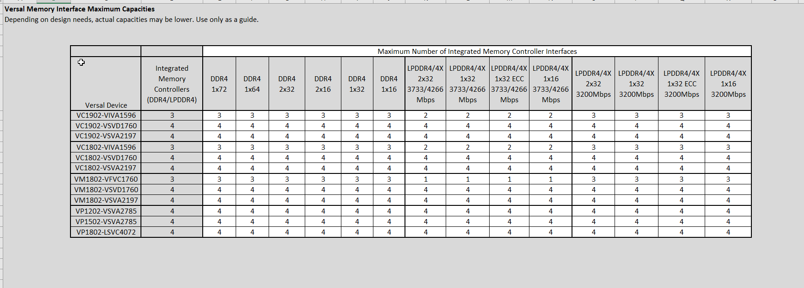
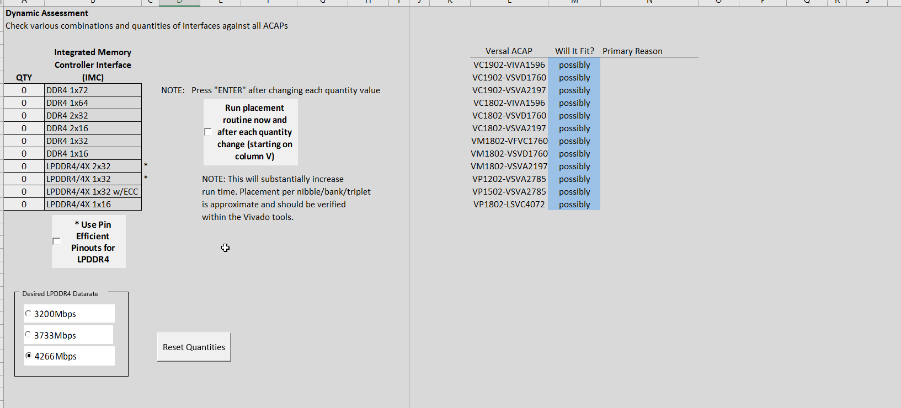
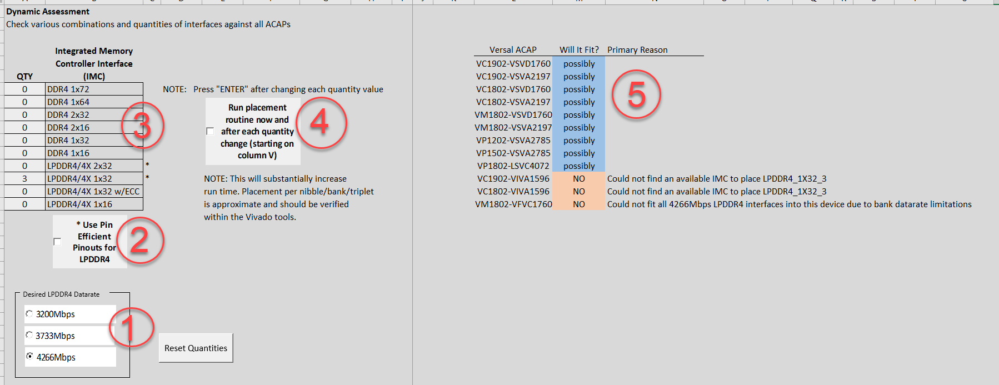
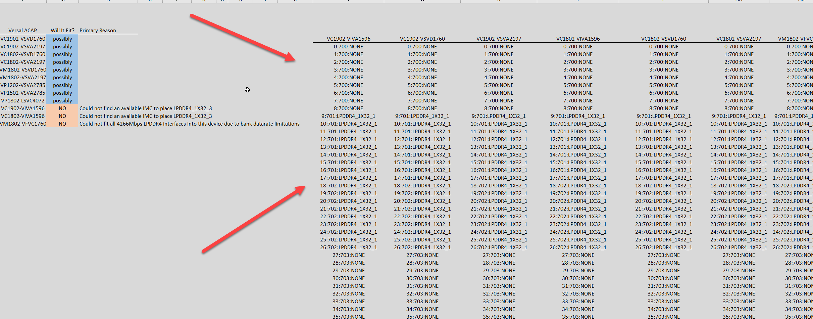

<table>
 <tr>
   <td align="center"><h1>Versal ACAP Memory Interface Planning Tutorial</h1>
   </td>
 </tr>
 </table>

# Introduction
The Versal&trade; external memory pre-planning tool allows system architects to quickly determine which Versal devices are suitable for their memory interace needs.

The tool has two portions.   The first portion is an overview table that shows all of the Versal devices and the maximum capacities for each type of hardened memory interface (such as DDR4 or LPDDR4).     The second portion of the tool is interactive. It allows the user to specify the exact memory interfaces required and determines which Versal devices can accommodate them.

# Overview Table

The **# of Interfaces** tab shows an overview of all Versal devices and supported hardened memory interfaces.   The maximum amount of each interface that can fit in each device is listed, assuming it is the only interface used.   This is useful to get a quick understanding of the capacities of each device.

# Dynamic Assessment

The **Dynamic Assessment** tab contains the interactive portion of the tool where a specific amount of interfaces can be entered as well as a list of devices that can accommodate them all.   This tab also contains a placement routine which can be run to approximate how each selected interface will be placed in the device.

The sections of the dynamic assessment are as follows:

# Quantity Selection

1. Choose the desired datarate for any LPDDR4 interfaces.  NOTE: Some banks in some devices do not support the fastest datarates.
2. For LPDDR4 1x32 or LPDDR4 2x32 interfaces, check this box when the pin-efficient pinout is desired.
3. Manually type in the desired quantity for each interface.    Press ENTER after typing each quantity or click elsewhere on the sheet.
4. OPTIONAL:   Check this box to run the placement routine now and after each quantity change.   NOTE:   Keeping this checked slows down the placement results.
5. After each quantity change, the devices are listed in the order in which the quantities specified can be supported.   If selected quantities cannot fit in a device, the primary reason why is listed.

# Placement Routine

If the **Run Placement** box was checked in step 4 above, a placement routine is run to show where each chosen interface is placed in each Versal device that can support the number of interfaces.   NOTE:  As mentioned above, the placement routine takes some time, so only check the **Run Placement** button after all desired interface quantities have been selected.

The placements shown are approximate and for illustration purposes only to show how the interfaces might be placed by the Vivado® software.   Do not rely on this placement for any purpose other than a general approximation.

Licensed under the Apache License, Version 2.0 (the "License");
you may not use this file except in compliance with the License.

You may obtain a copy of the License at

    http://www.apache.org/licenses/LICENSE-2.0

Unless required by applicable law or agreed to in writing, software
distributed under the License is distributed on an "AS IS" BASIS,
WITHOUT WARRANTIES OR CONDITIONS OF ANY KIND, either express or implied.
See the License for the specific language governing permissions and
limitations under the License.

XD064 | Copyright&copy; 2021 Xilinx, Inc.

