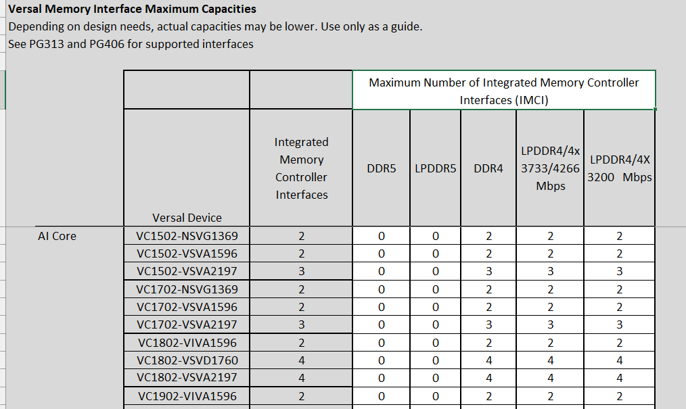
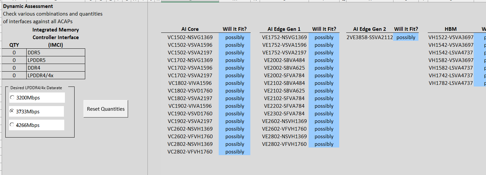
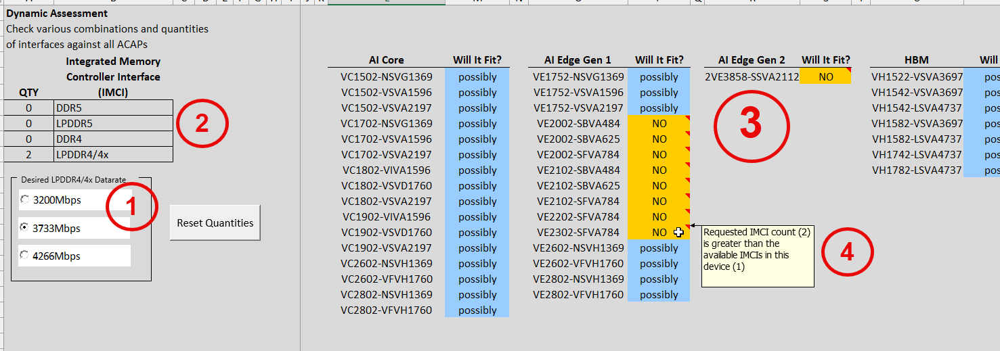

<table class="sphinxhide" width="100%">
 <tr width="100%">
    <td align="center"><h1>Versal™ Adaptive SoC PCB Design Tutorials</h1>
    <a href="https://www.xilinx.com/products/design-tools/vivado.html">See Vivado™ Development Environment on xilinx.com</a>
    </td>
</table>

# Versal Adaptive SoC Memory Interface Planning Tutorial

***Version: Vivado 2024.1***

## Introduction

The Versal™ external memory pre-planning tool allows system architects to quickly determine which Versal devices are suitable for their memory interface needs.

The tool has two portions. The first portion is an overview table that shows all of the Versal devices and the maximum capacities for each type of integrated memory controller interface (DDR5, LPDDR5, DDR4, and LPDDR4/4x). The second portion of the tool is interactive. It allows the user to specify the exact memory interfaces required and determines which Versal devices can accommodate them.

## Overview Table

The **# of Interfaces** tab shows an overview of all Versal devices and supported integrated memory controller interfaces. The maximum amount of each interface that can fit in each device is listed, assuming it is the only interface used. This is useful to get a quick understanding of the capacities of each device.

## Dynamic Assessment

The **Dynamic Assessment** tab contains the interactive portion of the tool where a specific amount of interfaces can be entered as well as a list of devices that can accommodate them all.   

The sections of the dynamic assessment are as follows:

## Quantity Selection

1. Choose the desired datarate for any LPDDR4 interfaces. 
   **NOTE**: Some banks in some devices do not support the fastest datarates.
2. Manually type in the desired quantity for each interface. Press **Enter** after typing each quantity or click elsewhere on the sheet.
3. After each quantity change, the results for each device will be shown. A result of `possibly` means that the device has the resources to fit the type and quantity of interfaces chosen so long as the resource are actually allocated for those purposes.   
4. If the selected quantities cannot fit in a device, the result will show `No`. A tooltip will explain the primary reason why the requested quantities cannot fit in the device under any circumstances.

Copyright © 2021–2024 Advanced Micro Devices, Inc.

<a href="https://www.amd.com/en/corporate/copyright">Terms and Conditions</a>

